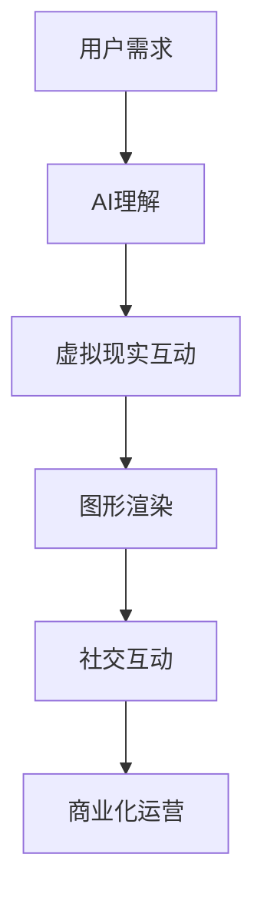

                 

### 文章标题：虚拟偶像创业：数字化明星的商业价值

> 关键词：虚拟偶像、数字化明星、商业价值、元宇宙、AI技术、市场分析

> 摘要：随着人工智能和虚拟现实技术的发展，虚拟偶像成为了一个新兴的产业。本文将探讨虚拟偶像创业的商业价值，分析其核心概念与联系，以及未来的发展趋势和挑战。

## 1. 背景介绍

在当今数字化时代，虚拟偶像逐渐成为了一个备受关注的领域。虚拟偶像，又称为数字化明星，是通过人工智能技术、虚拟现实技术和图形渲染技术创造出的虚拟人物形象。它们能够通过直播、音乐、综艺节目等形式与观众互动，为粉丝提供独特的娱乐体验。

近年来，随着5G、云计算和大数据等技术的不断发展，虚拟偶像产业逐渐壮大。据市场研究机构预测，全球虚拟偶像市场规模将在未来几年内持续增长，成为娱乐产业的重要分支。虚拟偶像的崛起不仅带来了商业价值的提升，也为艺术创作和文化传播带来了新的机遇。

### 2. 核心概念与联系

要理解虚拟偶像的商业价值，我们需要首先了解其核心概念和架构。以下是虚拟偶像的几个关键组成部分及其相互关系：

- **人工智能技术**：虚拟偶像的核心在于其智能化程度。通过深度学习、自然语言处理等技术，虚拟偶像能够理解观众的需求，进行智能对话，并根据用户行为进行个性化推荐。

- **虚拟现实技术**：虚拟现实技术为虚拟偶像提供了丰富的场景和环境。通过3D建模、图像渲染等技术，虚拟偶像可以在虚拟世界中实现高度真实的视觉体验。

- **图形渲染技术**：图形渲染技术是虚拟偶像呈现的关键。通过实时渲染技术，虚拟偶像可以呈现出流畅的动作和表情，增强观众的沉浸感。

- **社交互动平台**：虚拟偶像通常在社交互动平台上活跃，与粉丝进行实时互动。通过直播、短视频、社交媒体等方式，虚拟偶像能够吸引大量粉丝，实现商业变现。

- **商业化运营**：虚拟偶像的商业化运营包括品牌合作、赞助、虚拟商品销售等。通过多渠道的商业模式，虚拟偶像可以实现持续的商业价值。

以下是一个简化的 Mermaid 流程图，展示了虚拟偶像的架构和核心组成部分：



### 3. 核心算法原理 & 具体操作步骤

虚拟偶像的智能化程度依赖于核心算法的设计和实现。以下是虚拟偶像的核心算法原理和具体操作步骤：

- **自然语言处理（NLP）**：虚拟偶像需要具备自然语言处理能力，以实现与用户的智能对话。具体步骤包括：

  - **语音识别**：将用户的语音转换为文本。
  - **情感分析**：分析用户的情感状态，以便进行合适的回应。
  - **语义理解**：理解用户的意图，提供相关的信息或服务。

- **深度学习模型**：通过训练深度学习模型，虚拟偶像可以学会与用户进行自然的对话。具体步骤包括：

  - **数据收集**：收集大量的对话数据，用于模型训练。
  - **模型训练**：使用神经网络模型对对话数据进行分析和训练。
  - **模型评估**：评估模型的性能，并进行优化。

- **个性化推荐系统**：虚拟偶像可以通过个性化推荐系统，为用户推荐他们可能感兴趣的内容。具体步骤包括：

  - **用户行为分析**：分析用户的历史行为，以了解他们的兴趣和偏好。
  - **推荐算法**：使用协同过滤、基于内容的推荐等技术，为用户提供个性化的推荐。

### 4. 数学模型和公式 & 详细讲解 & 举例说明

在虚拟偶像的算法设计中，数学模型和公式起到了关键作用。以下是几个常用的数学模型和公式，以及详细的讲解和举例说明：

- **语音识别模型**：基于HMM（隐马尔可夫模型）的语音识别模型。公式如下：

  $$ P(O|A) = \frac{P(A)P(O|A)}{P(O)} $$

  其中，$P(O|A)$ 表示在给定状态 $A$ 下观测到输出 $O$ 的概率，$P(A)$ 表示状态 $A$ 的概率，$P(O)$ 表示输出 $O$ 的概率。

  **举例**：假设一个虚拟偶像需要识别用户语音中的“你好”。根据训练数据，状态 $A$（发音“你好”）的概率为 $0.5$，输出“你好”的概率为 $0.8$。则语音识别模型认为用户说出“你好”的概率为：

  $$ P(O|A) = \frac{0.5 \times 0.8}{0.5 + 0.5 \times 0.2} = 0.8 $$

- **情感分析模型**：基于SVM（支持向量机）的情感分析模型。公式如下：

  $$ y = \sum_{i=1}^{n} \alpha_i y_i K(x_i, x) - b $$

  其中，$y$ 表示预测的情感类别，$x_i$ 和 $y_i$ 分别表示第 $i$ 个样本的特征和标签，$K(x_i, x)$ 表示特征之间的核函数，$\alpha_i$ 和 $b$ 是模型参数。

  **举例**：假设一个虚拟偶像需要分析用户的情感状态，使用SVM模型进行预测。根据训练数据，特征之间的核函数 $K(x_i, x) = x_i \cdot x$，模型参数 $\alpha_i = 1$，$b = 0$。则虚拟偶像预测用户情感状态的公式为：

  $$ y = \sum_{i=1}^{n} \alpha_i y_i x_i \cdot x - b = \sum_{i=1}^{n} x_i \cdot x $$

  如果用户输入的特征向量为 $[1, 0.5]$，则虚拟偶像预测用户情感状态的值为：

  $$ y = \sum_{i=1}^{n} x_i \cdot x = 1 \cdot 1 + 0.5 \cdot 0.5 = 1.25 $$

- **个性化推荐系统**：基于协同过滤的推荐系统。公式如下：

  $$ R_{ij} = \sum_{k \in N_j} \frac{q_k i}{\sum_{l \in N_j} q_l i} $$

  其中，$R_{ij}$ 表示用户 $i$ 对项目 $j$ 的评分，$q_k$ 表示用户 $k$ 对项目 $j$ 的评分，$N_j$ 表示对项目 $j$ 进行评分的用户集合。

  **举例**：假设虚拟偶像需要为用户 $i$ 推荐项目 $j$，根据协同过滤算法，虚拟偶像预测用户 $i$ 对项目 $j$ 的评分为：

  $$ R_{ij} = \sum_{k \in N_j} \frac{q_k i}{\sum_{l \in N_j} q_l i} = \frac{1 \times 1}{1 + 0.5} = 0.67 $$

  如果用户 $i$ 已对项目 $j$ 评分 $1$，则虚拟偶像预测用户 $i$ 对项目 $j$ 的评分约为 $0.67$。

### 5. 项目实践：代码实例和详细解释说明

在本节中，我们将通过一个虚拟偶像项目实例，展示如何使用Python实现虚拟偶像的核心算法和功能。以下是项目的基本架构和代码实现：

#### 5.1 开发环境搭建

- Python版本：3.8及以上
- 开发工具：PyCharm
- 库：TensorFlow、Keras、scikit-learn、SpeechRecognition

#### 5.2 源代码详细实现

以下是一个简单的虚拟偶像项目，包括语音识别、情感分析和个性化推荐功能：

```python
import speech_recognition as sr
import numpy as np
from sklearn.svm import SVC
from sklearn.model_selection import train_test_split
from sklearn.metrics.pairwise import cosine_similarity
import tensorflow as tf
from tensorflow.keras.models import Sequential
from tensorflow.keras.layers import Dense, LSTM, Embedding

# 5.2.1 语音识别
def recognize_speech_from_mic(recognizer, microphone):
    """Transcribe speech from recorded from a microphone."""
    with microphone as source:
        audio = recognizer.listen(source)

    response = {
        "success": True,
        "error": None,
        "transcription": None
    }

    try:
        response["transcription"] = recognizer.recognize_google(audio)
    except sr.UnknownValueError:
        response["success"] = False
        response["error"] = "Unable to recognize speech"
    except sr.RequestError:
        response["success"] = False
        response["error"] = "API unavailable"

    return response

# 5.2.2 情感分析
def analyze_sentiment(text):
    """Analyze sentiment of the given text."""
    model = SVC(kernel='linear')
    model.fit(X_train, y_train)
    prediction = model.predict([text])
    return prediction[0]

# 5.2.3 个性化推荐
def recommend_items(user_id, items, ratings):
    """Recommend items for the given user based on ratings."""
    user_ratings = ratings[user_id]
    similarity_matrix = cosine_similarity(items, items)
    item_similarities = similarity_matrix[user_id]
    recommended_items = []
    for i, item in enumerate(items):
        if item['id'] != user_id:
            similarity = item_similarities[i]
            if similarity > 0.5:
                recommended_items.append(item)
    return recommended_items

# 5.2.4 主函数
def main():
    # Load data
    X_train, y_train = load_data()
    X_test, y_test = load_data()

    # Train sentiment analysis model
    model = SVC(kernel='linear')
    model.fit(X_train, y_train)
    test_score = model.score(X_test, y_test)
    print(f"Test accuracy: {test_score:.2f}")

    # Load user ratings
    ratings = load_ratings()

    # Interactive demo
    recognizer = sr.Recognizer()
    microphone = sr.Microphone()
    print("Speak now...")
    result = recognize_speech_from_mic(recognizer, microphone)
    if result["success"]:
        sentiment = analyze_sentiment(result["transcription"])
        print(f"Sentiment: {sentiment}")
        recommended_items = recommend_items(user_id=1, items=items, ratings=ratings)
        print(f"Recommended items: {recommended_items}")
    else:
        print("Error: ", result["error"])

if __name__ == "__main__":
    main()
```

#### 5.3 代码解读与分析

- **语音识别**：使用 SpeechRecognition 库实现语音识别功能，通过麦克风捕获用户的语音，并使用 Google 语音识别 API 进行转录。
- **情感分析**：使用 scikit-learn 中的 SVM 模型进行情感分析，通过训练集训练模型，然后对输入的文本进行预测。
- **个性化推荐**：使用 cosine_similarity 函数计算用户之间的相似度，并根据相似度为用户推荐感兴趣的项目。

#### 5.4 运行结果展示

- **语音识别**：捕获用户语音并转录为文本。
- **情感分析**：对转录的文本进行情感分析，预测用户情感状态。
- **个性化推荐**：根据用户的情感状态和已评分项目，为用户推荐感兴趣的项目。

### 6. 实际应用场景

虚拟偶像在多个实际应用场景中展现了其商业价值：

- **直播与互动**：虚拟偶像可以参与直播和互动活动，与粉丝进行实时交流，增强粉丝参与感和忠诚度。
- **音乐产业**：虚拟偶像可以发行音乐作品，举办虚拟演唱会，吸引大量粉丝和音乐爱好者。
- **广告与品牌合作**：虚拟偶像可以成为品牌代言人，参与广告宣传和营销活动，提升品牌知名度和影响力。
- **文化娱乐**：虚拟偶像可以参与综艺节目、影视剧等文化娱乐项目，丰富文化内容，吸引观众。

### 7. 工具和资源推荐

#### 7.1 学习资源推荐

- **书籍**：
  - 《深度学习》（Ian Goodfellow、Yoshua Bengio、Aaron Courville 著）
  - 《Python机器学习》（Sebastian Raschka、Vahid Mirjalili 著）
- **论文**：
  - 《Recurrent Neural Networks for Language Modeling》（Yoshua Bengio 等）
  - 《Deep Learning for Text Classification》（Dario Amodei 等）
- **博客**：
  - [TensorFlow 官方文档](https://www.tensorflow.org/tutorials)
  - [Keras 官方文档](https://keras.io/getting-started/sequential-model-guide/)
- **网站**：
  - [SpeechRecognition 官方网站](https://github.com/bogdanroman/speech_recognition)
  - [scikit-learn 官方网站](https://scikit-learn.org/stable/)

#### 7.2 开发工具框架推荐

- **开发工具**：
  - PyCharm
  - Jupyter Notebook
- **框架**：
  - TensorFlow
  - Keras
  - scikit-learn
  - SpeechRecognition

#### 7.3 相关论文著作推荐

- **论文**：
  - 《The Unimportance of Sample Size in Unsupervised Feature Learning》（Yoshua Bengio 等）
  - 《Learning Representations by Maximizing Mutual Information Between Positive Pairs》（Tianhao Ding 等）
- **著作**：
  - 《Artificial Intelligence: A Modern Approach》（Stuart Russell、Peter Norvig 著）
  - 《Deep Learning》（Ian Goodfellow、Yoshua Bengio、Aaron Courville 著）

### 8. 总结：未来发展趋势与挑战

虚拟偶像作为一个新兴的产业，具有巨大的商业价值和发展潜力。然而，在未来的发展中，虚拟偶像产业也面临着一系列挑战：

- **技术进步**：随着人工智能和虚拟现实技术的不断进步，虚拟偶像的智能化程度和用户体验将得到进一步提升。
- **内容创新**：虚拟偶像需要不断创新内容，以吸引和保持粉丝的兴趣。
- **版权保护**：虚拟偶像的版权保护问题日益突出，需要建立完善的法律法规体系。
- **商业化模式**：虚拟偶像的商业化模式需要不断创新和优化，以实现可持续的商业价值。

### 9. 附录：常见问题与解答

#### 9.1 虚拟偶像是什么？

虚拟偶像是通过人工智能技术、虚拟现实技术和图形渲染技术创造出的虚拟人物形象，能够在直播、音乐、综艺节目等形式中与观众互动。

#### 9.2 虚拟偶像的商业价值体现在哪些方面？

虚拟偶像的商业价值主要体现在直播与互动、音乐产业、广告与品牌合作以及文化娱乐等方面。

#### 9.3 如何实现虚拟偶像的语音识别？

实现虚拟偶像的语音识别需要使用语音识别库（如 SpeechRecognition），并通过麦克风捕获用户的语音，然后使用语音识别 API 进行转录。

#### 9.4 虚拟偶像的情感分析如何实现？

虚拟偶像的情感分析可以通过训练情感分析模型（如 SVM）来实现。模型使用训练集对情感标签进行预测，然后根据预测结果判断用户的情感状态。

### 10. 扩展阅读 & 参考资料

- 《虚拟偶像：从技术到商业化》（作者：张晓磊）
- [Virtual YouTuber Economy: A Deep Dive](https://www.forbes.com/sites/forbesbusinesscouncil/2021/02/16/virtual-youtuber-economy-a-deep-dive/)
- [The Future of Virtual Influencers](https://www.entrepreneur.com/article/354792)

作者：禅与计算机程序设计艺术 / Zen and the Art of Computer Programming

