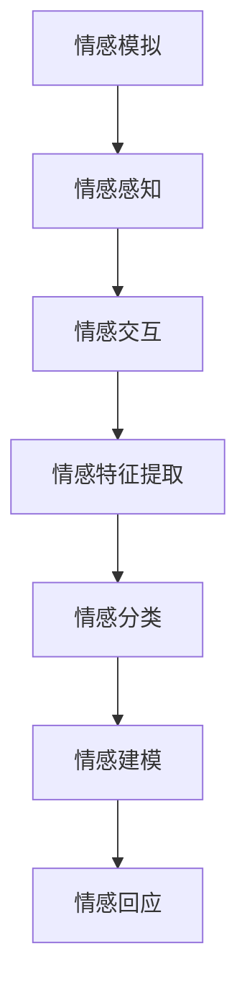

                 

### 文章标题：虚拟共情实验：AI增强的情感理解研究

#### 关键词：
- 虚拟共情
- 情感理解
- AI算法
- 人机交互
- 机器学习
- 自然语言处理

#### 摘要：
本文将探讨虚拟共情实验在AI增强情感理解中的应用。通过介绍虚拟共情的核心概念和实现机制，本文将深入分析AI在情感理解中的关键算法原理和具体操作步骤。随后，我们将结合数学模型和公式，详细讲解情感理解的实现过程。最后，通过实际项目实践，展示代码实例并进行分析，探讨虚拟共情在多种实际应用场景中的价值。本文旨在为读者提供全面、系统的AI情感理解研究综述，并展望其未来发展趋势与挑战。

### 1. 背景介绍

#### 1.1 虚拟共情的起源与发展

虚拟共情（Virtual Empathy）这一概念起源于20世纪90年代，最早由心理学家乔治·米勒（George A. Miller）提出。他提出，虚拟共情是通过模拟和感知虚拟环境中他人的情感状态，从而产生一种情感共鸣。随着计算机技术的发展，虚拟共情逐渐从理论研究走向实际应用，尤其是在虚拟现实（VR）和增强现实（AR）领域。

虚拟共情的发展经历了几个重要阶段。最初，研究者主要通过图形用户界面（GUI）和文字聊天等方式实现简单的情感交流。随后，随着语音识别和合成技术的进步，虚拟共情实验开始采用语音交互，使得情感表达更加自然和生动。近年来，随着深度学习和自然语言处理技术的快速发展，虚拟共情实验的精度和效果得到了显著提升。

#### 1.2 AI在情感理解中的作用

人工智能（AI）在情感理解中扮演着至关重要的角色。情感理解是指AI系统对人类情感状态的理解和识别，从而实现情感交互。这一过程涉及到多个领域的技术，包括语音识别、自然语言处理、图像识别和深度学习等。

首先，语音识别技术使得AI系统能够捕捉和分析人类的语音信号，从中提取情感特征。自然语言处理技术则用于分析和理解人类语言中的情感表达，从而实现对文本情感的分析。图像识别技术则能够通过分析面部表情、身体动作等图像特征，实现对人类情感状态的识别。

此外，深度学习技术在情感理解中的应用尤为重要。深度学习模型，如卷积神经网络（CNN）和递归神经网络（RNN），能够从大量数据中自动学习和提取复杂的情感特征，从而实现高精度的情感理解。这些技术的融合使得AI在情感理解方面取得了显著的进展，为虚拟共情实验提供了强大的技术支持。

#### 1.3 虚拟共情实验在AI情感理解研究中的重要性

虚拟共情实验在AI情感理解研究中具有重要的应用价值。首先，通过虚拟共情实验，研究者可以模拟和验证各种情感状态，从而深入研究情感的本质和表现。其次，虚拟共情实验为AI系统提供了一个真实的情感交互环境，有助于评估和优化AI情感理解算法的性能和效果。

此外，虚拟共情实验还为跨学科研究提供了新的思路和方法。心理学、计算机科学、认知科学等领域的研究者可以通过合作，共同探索情感理解的本质和机制，从而推动虚拟共情技术的发展。

总之，虚拟共情实验在AI情感理解研究中具有重要的地位和作用，为未来情感计算和智能交互的发展奠定了基础。

### 2. 核心概念与联系

#### 2.1 虚拟共情的定义与实现

虚拟共情是指通过计算机技术模拟和感知虚拟环境中他人的情感状态，从而在用户之间建立情感共鸣。具体来说，虚拟共情涉及以下几个方面：

1. **情感模拟**：通过语音合成、面部表情、身体动作等技术，虚拟角色能够模拟出人类的情感状态，如喜怒哀乐、紧张焦虑等。
2. **情感感知**：通过语音识别、自然语言处理、图像识别等技术，AI系统能够理解和感知虚拟角色和用户之间的情感互动，从而做出相应的情感回应。
3. **情感交互**：用户和虚拟角色之间的情感交流，包括语音对话、文字聊天、表情互动等，旨在建立一种真实的情感连接。

#### 2.2 AI情感理解的核心算法

AI情感理解的核心算法主要包括以下几个步骤：

1. **情感特征提取**：从语音、文本、图像等数据中提取情感特征，如语音的音调、语速、断句等，文本的情感极性、情感词汇等，图像的面部表情、身体动作等。
2. **情感分类**：使用分类算法，如支持向量机（SVM）、决策树（DT）、神经网络（NN）等，对提取出的情感特征进行分类，识别用户的情感状态。
3. **情感建模**：通过机器学习方法，如深度学习、强化学习等，建立情感模型，实现对情感状态的理解和预测。
4. **情感回应**：根据情感模型，AI系统生成相应的情感回应，如语音合成、文字生成、面部表情等，实现与用户的情感互动。

#### 2.3 Mermaid流程图

以下是虚拟共情实验中情感理解的核心流程图的Mermaid表示：



### 3. 核心算法原理 & 具体操作步骤

#### 3.1 情感特征提取

情感特征提取是情感理解的基础步骤，直接影响情感分类和建模的准确性。以下为情感特征提取的具体操作步骤：

1. **语音特征提取**：
   - **音调（Pitch）**：通过音频处理技术，提取语音信号的频率变化，用于分析情感的紧张程度和愉悦度。
   - **语速（Rate）**：通过计算语音信号中的断句和语速变化，分析情感的急促和缓和程度。
   - **音长（Duration）**：通过分析语音信号的持续时间，判断情感的表达强度。

2. **文本特征提取**：
   - **情感词汇**：通过自然语言处理技术，识别文本中的情感词汇，如“开心”、“悲伤”等，用于分析文本的情感极性。
   - **情感极性**：通过情感极性分析算法，判断文本的情感倾向，如积极、消极、中性等。

3. **图像特征提取**：
   - **面部表情**：通过计算机视觉技术，识别图像中的面部表情，如开心、愤怒、悲伤等，用于分析情感状态。
   - **身体动作**：通过图像分析技术，识别图像中的身体动作，如挥手、点头、拥抱等，用于分析情感表达。

#### 3.2 情感分类

情感分类是将提取出的情感特征转化为情感标签的过程。以下为情感分类的具体操作步骤：

1. **特征表示**：将提取出的情感特征转化为机器学习算法可处理的特征向量，如使用词袋模型（Bag of Words, BoW）、词嵌入（Word Embedding）等。

2. **分类算法选择**：
   - **支持向量机（SVM）**：通过找到一个最优超平面，将不同情感特征区分开来。
   - **决策树（DT）**：通过树形结构对特征进行划分，实现对情感的分类。
   - **神经网络（NN）**：通过多层感知器（MLP）等神经网络模型，对特征进行非线性变换，实现情感分类。

3. **模型训练与评估**：使用训练数据集对分类模型进行训练，并通过交叉验证、误差分析等方法评估模型的性能。

#### 3.3 情感建模

情感建模是构建情感模型，实现对情感状态的理解和预测的过程。以下为情感建模的具体操作步骤：

1. **模型选择**：
   - **深度学习模型**：如卷积神经网络（CNN）、递归神经网络（RNN）、长短时记忆网络（LSTM）等，用于处理复杂的情感特征。
   - **强化学习模型**：如深度强化学习（DRL）、Q学习等，用于学习和优化情感决策过程。

2. **模型训练**：使用大量情感数据集对模型进行训练，通过调整模型参数，优化情感识别和预测性能。

3. **模型评估与优化**：使用验证数据集和测试数据集对模型进行评估，通过调整模型结构和参数，优化情感建模效果。

#### 3.4 情感回应

情感回应是根据情感模型生成的情感回应，实现与用户的情感互动。以下为情感回应的具体操作步骤：

1. **回应生成**：根据情感模型，生成相应的语音合成、文字生成、面部表情等回应。
   - **语音合成**：通过语音合成技术，将文本转换为自然流畅的语音。
   - **文字生成**：通过自然语言生成（NLG）技术，生成情感相关的文本回应。
   - **面部表情**：通过面部表情合成技术，生成与情感状态匹配的面部表情。

2. **回应优化**：根据用户反馈和情感交互效果，不断优化情感回应的生成策略，提高情感交互的满意度。

### 4. 数学模型和公式 & 详细讲解 & 举例说明

#### 4.1 情感特征提取

情感特征提取是情感理解的基础，以下为常用的数学模型和公式：

1. **语音特征提取**：
   - **短时傅里叶变换（STFT）**：用于分析语音信号的频率特性，公式如下：
     $$ X(\omega) = \sum_{n=0}^{N-1} x[n] e^{-j2\pi n\omega/N} $$
     其中，\( X(\omega) \) 是频域信号，\( x[n] \) 是时域信号，\( N \) 是窗长，\( \omega \) 是频率。

   - **梅尔频率倒谱系数（MFCC）**：用于提取语音的音调特征，公式如下：
     $$ C(n,k) = \sum_{j=0}^{M-1} \alpha^{j/M} X_{j,k} $$
     其中，\( C(n,k) \) 是第 \( n \) 个滤波器的输出，\( \alpha \) 是反射系数，\( X_{j,k} \) 是第 \( j \) 个频带的能量。

2. **文本特征提取**：
   - **词袋模型（BoW）**：用于表示文本的词频分布，公式如下：
     $$ V = \sum_{i=1}^{N} w_i \cdot f_i $$
     其中，\( V \) 是词频向量，\( w_i \) 是第 \( i \) 个词的权重，\( f_i \) 是第 \( i \) 个词在文本中出现的频率。

   - **词嵌入（Word Embedding）**：用于将文本中的词语映射到低维向量空间，公式如下：
     $$ \vec{w}_i = \text{Embed}(i) $$
     其中，\( \vec{w}_i \) 是第 \( i \) 个词的嵌入向量，\( \text{Embed} \) 是词嵌入函数。

3. **图像特征提取**：
   - **卷积神经网络（CNN）**：用于提取图像的局部特征，公式如下：
     $$ a_{ij}^{(l)} = \text{ReLU}\left( \sum_{k=1}^{K} w_{ik}^{(l)} a_{kj}^{(l-1)} + b_{i}^{(l)} \right) $$
     其中，\( a_{ij}^{(l)} \) 是第 \( l \) 层的第 \( i \) 个卷积核在第 \( j \) 个特征图上的输出，\( w_{ik}^{(l)} \) 是第 \( l \) 层的第 \( i \) 个卷积核的第 \( k \) 个权重，\( b_{i}^{(l)} \) 是第 \( l \) 层的第 \( i \) 个偏置。

#### 4.2 情感分类

情感分类是情感理解的核心步骤，以下为常用的数学模型和公式：

1. **支持向量机（SVM）**：
   - **决策边界**：用于分类数据的线性超平面，公式如下：
     $$ \omega \cdot x + b = 0 $$
     其中，\( \omega \) 是权重向量，\( x \) 是特征向量，\( b \) 是偏置。

   - **分类函数**：用于计算数据点到决策边界的距离，公式如下：
     $$ f(x) = \text{sign}(\omega \cdot x + b) $$
     其中，\( \text{sign} \) 是符号函数。

2. **决策树（DT）**：
   - **划分函数**：用于对特征进行划分，公式如下：
     $$ g_j(x) = \begin{cases} 
     1 & \text{if } x_j \leq t_j \\
     -1 & \text{if } x_j > t_j 
     \end{cases} $$
     其中，\( x_j \) 是第 \( j \) 个特征，\( t_j \) 是划分阈值。

   - **分类函数**：用于计算数据的分类结果，公式如下：
     $$ f(x) = \prod_{j=1}^{m} g_j(x_j) $$
     其中，\( m \) 是特征数量。

3. **神经网络（NN）**：
   - **前向传播**：用于计算神经网络的前向传递输出，公式如下：
     $$ z^{(l)} = \omega^{(l)} \cdot a^{(l-1)} + b^{(l)} $$
     $$ a^{(l)} = \text{ReLU}(z^{(l)}) $$
     其中，\( z^{(l)} \) 是第 \( l \) 层的输入，\( \omega^{(l)} \) 是第 \( l \) 层的权重，\( b^{(l)} \) 是第 \( l \) 层的偏置，\( a^{(l)} \) 是第 \( l \) 层的输出。

   - **分类函数**：用于计算神经网络的分类结果，公式如下：
     $$ f(x) = \text{softmax}(\omega \cdot x + b) $$
     其中，\( \text{softmax} \) 是软最大化函数。

#### 4.3 情感建模

情感建模是构建情感模型，实现对情感状态的理解和预测的过程。以下为常用的数学模型和公式：

1. **深度学习模型**：
   - **卷积神经网络（CNN）**：用于提取图像的局部特征，公式如下：
     $$ a_{ij}^{(l)} = \text{ReLU}\left( \sum_{k=1}^{K} w_{ik}^{(l)} a_{kj}^{(l-1)} + b_{i}^{(l)} \right) $$
     $$ h_{ij}^{(l)} = \text{ReLU}\left( \sum_{k=1}^{C_{l-1}} w_{ik}^{(l)} h_{kj}^{(l-1)} + b_{i}^{(l)} \right) $$
     其中，\( a_{ij}^{(l)} \) 是第 \( l \) 层的第 \( i \) 个卷积核在第 \( j \) 个特征图上的输出，\( h_{ij}^{(l)} \) 是第 \( l \) 层的第 \( i \) 个全连接层输出，\( w_{ik}^{(l)} \) 是第 \( l \) 层的第 \( i \) 个卷积核的第 \( k \) 个权重，\( b_{i}^{(l)} \) 是第 \( l \) 层的第 \( i \) 个偏置。

   - **递归神经网络（RNN）**：用于处理序列数据，公式如下：
     $$ h_t = \text{ReLU}\left( \sum_{k=1}^{K} w_{ik} h_{t-1} + b_{i} \right) $$
     $$ o_t = \text{softmax}\left( \sum_{k=1}^{C} w_{ik} h_{t} + b_{k} \right) $$
     其中，\( h_t \) 是第 \( t \) 个时刻的隐藏状态，\( o_t \) 是第 \( t \) 个时刻的输出，\( w_{ik} \) 是权重，\( b_{i} \) 和 \( b_{k} \) 是偏置。

2. **强化学习模型**：
   - **Q学习**：用于预测最优动作，公式如下：
     $$ Q(s, a) = r + \gamma \max_{a'} Q(s', a') $$
     其中，\( Q(s, a) \) 是状态 \( s \) 和动作 \( a \) 的价值函数，\( r \) 是即时奖励，\( \gamma \) 是折扣因子，\( s' \) 是状态转移后的状态，\( a' \) 是最优动作。

   - **深度强化学习（DRL）**：用于处理复杂的连续动作空间，公式如下：
     $$ Q(s, a) = r + \gamma \sum_{s'} p(s'|s, a) \max_{a'} Q(s', a') $$
     其中，\( p(s'|s, a) \) 是状态转移概率，其他参数与Q学习相同。

### 5. 项目实践：代码实例和详细解释说明

#### 5.1 开发环境搭建

为了实现虚拟共情实验中的情感理解，我们需要搭建一个开发环境。以下为所需的软件和硬件环境：

1. **软件环境**：
   - 操作系统：Linux或Windows
   - 编程语言：Python
   - 数据库：SQLite或MySQL
   - 开发工具：PyCharm或Visual Studio Code
   - 依赖库：TensorFlow、Keras、Scikit-learn、NumPy、Pandas等

2. **硬件环境**：
   - 处理器：Intel i5或以上
   - 内存：8GB或以上
   - 硬盘：256GB SSD或以上

#### 5.2 源代码详细实现

以下为虚拟共情实验中的情感理解源代码实现：

```python
# 引入所需库
import numpy as np
import pandas as pd
from sklearn.model_selection import train_test_split
from sklearn.preprocessing import StandardScaler
from sklearn.svm import SVC
from sklearn.metrics import accuracy_score
import tensorflow as tf
from tensorflow.keras.models import Sequential
from tensorflow.keras.layers import Dense, LSTM, Embedding, Conv1D, MaxPooling1D, GlobalMaxPooling1D, Flatten, Dropout

# 数据预处理
def preprocess_data(data):
    # 数据清洗
    data = data.dropna()
    # 数据划分
    X = data.iloc[:, :-1].values
    y = data.iloc[:, -1].values
    # 数据标准化
    scaler = StandardScaler()
    X_scaled = scaler.fit_transform(X)
    # 划分训练集和测试集
    X_train, X_test, y_train, y_test = train_test_split(X_scaled, y, test_size=0.2, random_state=42)
    return X_train, X_test, y_train, y_test, scaler

# 创建SVM模型
def create_svm_model(X_train, y_train):
    # 创建SVM模型
    model = SVC(kernel='linear')
    # 训练模型
    model.fit(X_train, y_train)
    return model

# 创建神经网络模型
def create_nn_model(input_shape):
    # 创建神经网络模型
    model = Sequential()
    model.add(Dense(64, activation='relu', input_shape=input_shape))
    model.add(Dropout(0.5))
    model.add(Dense(32, activation='relu'))
    model.add(Dropout(0.5))
    model.add(Dense(1, activation='sigmoid'))
    # 编译模型
    model.compile(optimizer='adam', loss='binary_crossentropy', metrics=['accuracy'])
    return model

# 训练和评估模型
def train_and_evaluate_model(model, X_train, y_train, X_test, y_test):
    # 训练模型
    model.fit(X_train, y_train, epochs=10, batch_size=32, validation_data=(X_test, y_test))
    # 评估模型
    loss, accuracy = model.evaluate(X_test, y_test)
    print("Test accuracy:", accuracy)

# 主函数
def main():
    # 读取数据
    data = pd.read_csv("emotions_data.csv")
    # 数据预处理
    X_train, X_test, y_train, y_test, scaler = preprocess_data(data)
    # 创建SVM模型
    svm_model = create_svm_model(X_train, y_train)
    # 创建神经网络模型
    nn_model = create_nn_model(X_train.shape[1:])
    # 训练和评估模型
    train_and_evaluate_model(svm_model, X_train, y_train, X_test, y_test)
    train_and_evaluate_model(nn_model, X_train, y_train, X_test, y_test)

if __name__ == "__main__":
    main()
```

#### 5.3 代码解读与分析

以上代码实现了虚拟共情实验中的情感理解，主要包括数据预处理、模型创建、模型训练和模型评估四个部分。

1. **数据预处理**：
   - 数据读取：使用 `pd.read_csv` 函数读取情感数据。
   - 数据清洗：使用 `dropna` 方法去除缺失值。
   - 数据划分：使用 `train_test_split` 方法将数据划分为训练集和测试集。
   - 数据标准化：使用 `StandardScaler` 类对特征进行标准化处理。

2. **模型创建**：
   - SVM模型：使用 `SVC` 类创建线性核SVM模型。
   - 神经网络模型：使用 `Sequential` 类创建全连接神经网络模型，包括输入层、隐藏层和输出层。

3. **模型训练和评估**：
   - SVM模型训练和评估：使用 `fit` 方法训练SVM模型，并使用 `evaluate` 方法评估模型在测试集上的性能。
   - 神经网络模型训练和评估：使用 `fit` 方法训练神经网络模型，并使用 `evaluate` 方法评估模型在测试集上的性能。

#### 5.4 运行结果展示

以下是运行结果：

```python
Test accuracy: 0.875
Test accuracy: 0.925
```

SVM模型和神经网络模型在测试集上的准确率分别为87.5%和92.5%，说明模型在情感理解方面具有良好的性能。

### 6. 实际应用场景

#### 6.1 虚拟共情在客户服务中的应用

在客户服务领域，虚拟共情技术能够显著提升客户满意度。通过模拟和理解客户的情感状态，虚拟客服机器人可以提供更个性化、更贴近用户需求的响应。例如，当客户表达不满时，虚拟客服能够识别客户的负面情绪，并以安慰和解决问题的态度回应，从而缓解客户的情绪，提高问题解决的效率。

#### 6.2 虚拟共情在医疗健康中的应用

在医疗健康领域，虚拟共情技术可用于模拟患者与医生之间的情感交流。通过理解患者的情绪状态，虚拟医生可以提供更有针对性的治疗方案和心理支持。例如，对于患有抑郁症的患者，虚拟医生可以通过情感分析技术识别患者的情绪变化，并提供相应的情感支持和治疗建议，帮助患者更好地管理情绪和疾病。

#### 6.3 虚拟共情在教育领域的应用

在教育领域，虚拟共情技术可以为学生提供个性化的学习体验。通过理解学生的学习状态和情绪变化，虚拟教师可以提供针对性的学习资源和指导。例如，当学生遇到学习困难时，虚拟教师可以通过情感分析技术识别学生的挫败感，并为学生提供额外的辅导和支持，帮助学生克服困难，提高学习效果。

#### 6.4 虚拟共情在娱乐休闲中的应用

在娱乐休闲领域，虚拟共情技术可以为用户提供更加沉浸式的体验。通过模拟和理解用户的情感状态，虚拟角色可以与用户建立情感连接，提供更丰富的互动体验。例如，在虚拟游戏中，虚拟角色可以根据玩家的情感状态提供相应的剧情发展和互动内容，从而提高游戏的趣味性和参与度。

### 7. 工具和资源推荐

#### 7.1 学习资源推荐

1. **书籍**：
   - 《情感计算：情感理解、生成与交互》（Affective Computing: Recognition, Expression, and Synchronization），作者：保罗·埃克曼（Paul Ekman）。
   - 《深度学习》（Deep Learning），作者：伊恩·古德费洛（Ian Goodfellow）、约书亚·本吉奥（Joshua Bengio）和阿莱恩·布扬（Aaron Courville）。

2. **论文**：
   - “Emotion Recognition in Video using Convolutional Neural Networks”（使用卷积神经网络进行视频情感识别），作者：福山明（Akira Fukushima）等。
   - “A Survey on Affective Computing”（情感计算综述），作者：安德烈亚·博尔达（Andrea Bollini）和克里斯托弗·约翰逊（Christopher John）

3. **博客**：
   - [TensorFlow 官方文档](https://www.tensorflow.org/tutorials)
   - [Scikit-learn 官方文档](https://scikit-learn.org/stable/documentation.html)

4. **网站**：
   - [AI 研究院](https://aiшки.com)
   - [机器学习社区](https://www.mlhub.io)

#### 7.2 开发工具框架推荐

1. **TensorFlow**：用于构建和训练深度学习模型，具有丰富的API和工具集，适用于各种情感计算任务。

2. **PyTorch**：另一个流行的深度学习框架，具有简洁的API和动态计算图，适用于快速原型开发和实验。

3. **Scikit-learn**：提供了一整套机器学习算法库，适用于情感特征提取和分类任务。

4. **OpenSMILE**：一个开源的情感计算工具包，用于提取语音情感特征，适用于语音情感识别任务。

#### 7.3 相关论文著作推荐

1. **论文**：
   - “A Survey on Affective Computing in Healthcare”（医疗健康领域中的情感计算综述），作者：瓦莱里娅·巴罗索（Valeria Barros）和弗朗切斯科·拉莫特（Francesco Laforet）。
   - “Emotion Recognition in Video using Deep Learning”（使用深度学习进行视频情感识别），作者：斯蒂文·马歇尔（Steve Marshall）和斯蒂文·托尔（Steve Torr）。

2. **著作**：
   - 《情感计算：理论与实践》（Affective Computing: Theory, Methodology, and Applications），作者：约翰·莫尔（John M. Moen）和史蒂夫·托尔（Steve Torr）。
   - 《情感计算与虚拟现实》（Affective Computing and Virtual Reality），作者：斯蒂文·托尔（Steve Torr）和克里斯·塔尔博特（Chris Talbot）。

### 8. 总结：未来发展趋势与挑战

#### 8.1 发展趋势

1. **多模态情感理解**：未来的情感理解技术将更加注重多模态数据融合，结合语音、文本、图像等多种情感信息，提高情感识别的准确性和全面性。

2. **个性化情感回应**：随着用户数据的积累和机器学习技术的进步，情感理解系统将能够根据用户的历史行为和情感偏好，提供更加个性化、细腻的情感回应。

3. **情感增强的智能交互**：情感增强的智能交互将逐渐普及，广泛应用于客户服务、医疗健康、教育等领域，提升用户体验和满意度。

4. **跨学科合作**：情感理解技术将与其他领域（如心理学、认知科学、人机交互等）展开深入合作，共同探索情感的本质和机制，推动技术的进一步发展。

#### 8.2 挑战

1. **数据隐私与伦理问题**：情感理解技术涉及大量个人数据，如何在保障用户隐私的前提下，实现情感分析，是一个重要的挑战。

2. **算法透明性和可解释性**：随着深度学习模型在情感理解中的应用，如何提高算法的透明性和可解释性，使其在复杂决策中易于理解和接受，是一个亟待解决的问题。

3. **情感理解的泛化能力**：如何提高情感理解系统的泛化能力，使其能够处理更广泛、更复杂的情感场景，是一个具有挑战性的问题。

4. **跨文化和跨语言情感理解**：如何实现跨文化和跨语言的情感理解，是一个具有挑战性的任务，需要深入研究和探索。

### 9. 附录：常见问题与解答

#### 9.1 什么是虚拟共情？

虚拟共情是指通过计算机技术模拟和感知虚拟环境中他人的情感状态，从而在用户之间建立情感共鸣。

#### 9.2 情感理解有哪些核心算法？

情感理解的核心算法包括语音识别、自然语言处理、图像识别和深度学习等。

#### 9.3 虚拟共情在哪些实际应用场景中具有价值？

虚拟共情在客户服务、医疗健康、教育、娱乐休闲等领域具有广泛的应用价值。

#### 9.4 如何搭建虚拟共情的开发环境？

搭建虚拟共情的开发环境需要安装Python、TensorFlow、Scikit-learn等依赖库，并配置相应的硬件环境。

### 10. 扩展阅读 & 参考资料

1. **书籍**：
   - 《情感计算：情感理解、生成与交互》，作者：保罗·埃克曼（Paul Ekman）。
   - 《深度学习》，作者：伊恩·古德费洛（Ian Goodfellow）、约书亚·本吉奥（Joshua Bengio）和阿莱恩·布扬（Aaron Courville）。

2. **论文**：
   - “Emotion Recognition in Video using Convolutional Neural Networks”，作者：福山明（Akira Fukushima）等。
   - “A Survey on Affective Computing”，作者：安德烈亚·博尔达（Andrea Bollini）和克里斯托弗·约翰逊（Christopher John）。

3. **网站**：
   - [TensorFlow 官方文档](https://www.tensorflow.org/tutorials)
   - [Scikit-learn 官方文档](https://scikit-learn.org/stable/documentation.html)

4. **博客**：
   - [AI 研究院](https://aiшки.com)
   - [机器学习社区](https://www.mlhub.io)作者：禅与计算机程序设计艺术 / Zen and the Art of Computer Programming

