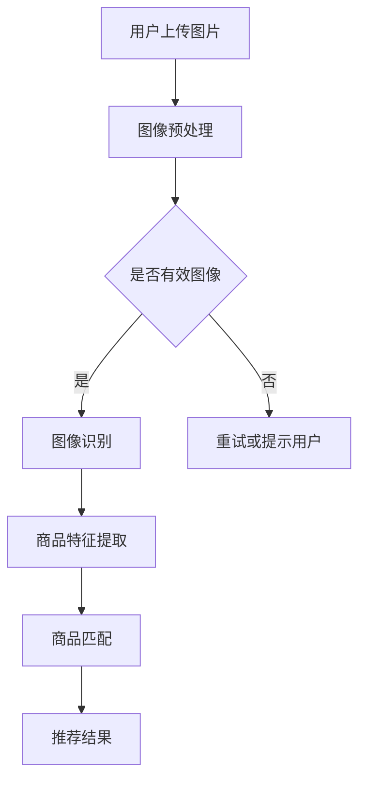
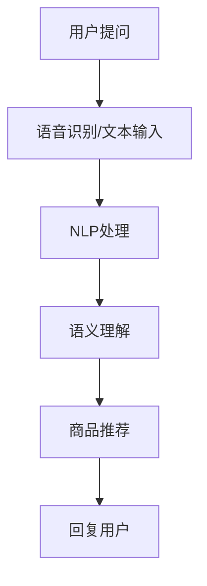
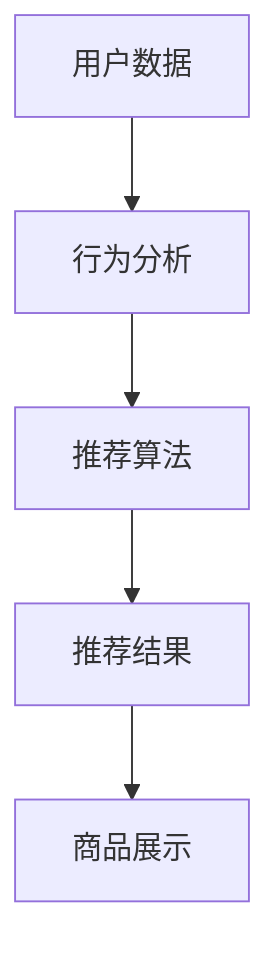
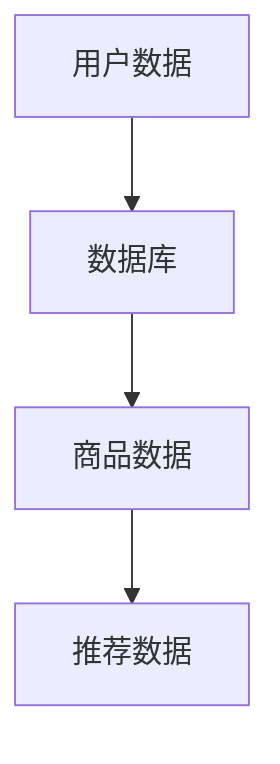
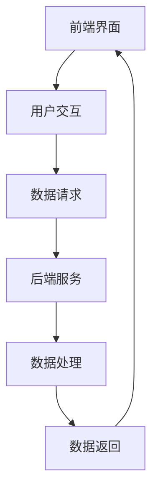
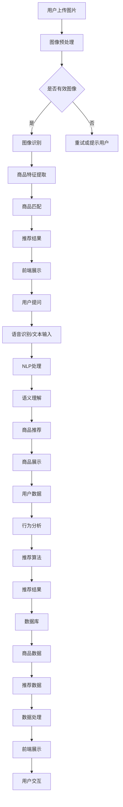

                 

### 背景介绍

随着人工智能技术的迅猛发展，计算机视觉、自然语言处理、机器学习等领域取得了显著的成果。在电子商务领域，人工智能技术也开始发挥重要作用，为用户提供了更加智能、个性化的购物体验。其中，虚拟导购助手作为一种创新性的应用，正逐渐改变着传统的购物模式，提升了用户的满意度。

#### 传统购物体验的局限

传统的购物体验主要依赖于实体店面和销售人员。这种模式存在一些明显的局限：

1. **时间和空间限制**：用户需要亲自前往实体店面进行购物，受到时间和地点的限制。
2. **信息获取困难**：用户在实体店面中获取商品信息的渠道有限，难以全面了解产品的特点、价格、用户评价等。
3. **个性化服务不足**：销售人员往往无法提供针对性的服务，难以满足用户的个性化需求。

#### 虚拟导购助手的崛起

虚拟导购助手通过人工智能技术，为用户提供了全新的购物体验：

1. **线上购物平台**：用户可以通过虚拟导购助手在线上购物平台浏览商品，不受时间和地点的限制。
2. **个性化推荐**：虚拟导购助手利用用户的购买历史、搜索记录等数据，为用户推荐合适的商品。
3. **互动式咨询**：用户可以与虚拟导购助手进行实时互动，获取专业的购物建议和解答疑问。
4. **实时库存查询**：虚拟导购助手可以实时查询商品的库存情况，帮助用户快速做出购买决策。

#### 本文结构

本文将从以下方面探讨虚拟导购助手如何改变购物体验，提升用户满意度：

1. **背景介绍**：介绍传统购物体验的局限以及虚拟导购助手的发展背景。
2. **核心概念与联系**：详细阐述虚拟导购助手的组成部分、工作原理及核心算法。
3. **核心算法原理 & 具体操作步骤**：讲解虚拟导购助手所依赖的核心算法原理，包括推荐算法、自然语言处理、图像识别等。
4. **数学模型和公式 & 详细讲解 & 举例说明**：介绍虚拟导购助手所涉及的数学模型和公式，并通过具体例子进行详细解释。
5. **项目实践：代码实例和详细解释说明**：展示一个完整的虚拟导购助手项目实例，包括开发环境搭建、源代码实现、代码解读与分析、运行结果展示。
6. **实际应用场景**：探讨虚拟导购助手在不同场景下的应用，如电商平台、线下实体店等。
7. **工具和资源推荐**：推荐相关学习资源、开发工具和框架，帮助读者深入了解虚拟导购助手。
8. **总结：未来发展趋势与挑战**：分析虚拟导购助手的未来发展前景，面临的挑战及应对策略。
9. **附录：常见问题与解答**：解答读者在学习和实践过程中可能遇到的问题。
10. **扩展阅读 & 参考资料**：提供进一步阅读的推荐资源。

通过本文的详细探讨，希望能够让读者全面了解虚拟导购助手，掌握其核心技术，并在实际应用中发挥其优势，提升用户的购物体验。

### 核心概念与联系

虚拟导购助手的实现涉及多个核心概念和技术的结合，这些概念和技术共同构成了一个完善的智能购物体验系统。以下是对这些核心概念的详细阐述，并通过一个Mermaid流程图来展示虚拟导购助手的工作原理和组成部分。

#### 1. 计算机视觉

计算机视觉是虚拟导购助手的重要组成部分，它负责处理图像和视频数据，以识别和提取有用信息。计算机视觉技术包括图像识别、目标检测、图像分割等。例如，在电商平台上，用户可以上传一张商品图片，计算机视觉技术可以帮助系统识别出图片中的商品种类和具体特征。



#### 2. 自然语言处理（NLP）

自然语言处理技术用于处理用户与虚拟导购助手的交互，包括语音识别、文本分析、语义理解等。在购物过程中，用户可以通过语音或文本与虚拟导购助手交流，询问商品信息、价格、评价等。自然语言处理技术可以理解用户的需求，并提供相应的回答和建议。



#### 3. 推荐系统

推荐系统是虚拟导购助手的另一个核心组成部分，它负责根据用户的兴趣和行为数据，为用户推荐合适的商品。推荐系统通常采用基于协同过滤、基于内容的推荐算法等。在虚拟导购助手中，推荐系统可以根据用户的购买历史、浏览记录等数据，为用户提供个性化的购物建议。



#### 4. 数据库

虚拟导购助手需要存储大量的用户数据、商品信息和推荐结果，数据库技术在这里发挥了重要作用。数据库系统用于管理这些数据，并提供高效的查询和存储功能。虚拟导购助手通常会使用关系型数据库（如MySQL）或非关系型数据库（如MongoDB）来存储数据。



#### 5. 前端界面

前端界面是用户与虚拟导购助手互动的窗口，它负责将后端的数据和功能展示给用户。前端界面通常使用HTML、CSS和JavaScript等技术构建，以实现丰富的交互效果和用户体验。



#### Mermaid流程图

以下是虚拟导购助手的整体工作流程，通过Mermaid流程图展示各部分之间的联系：



通过上述核心概念和Mermaid流程图的详细阐述，我们可以看到虚拟导购助手是如何通过计算机视觉、自然语言处理、推荐系统和数据库等技术的结合，为用户提供智能化、个性化的购物体验。接下来，我们将进一步探讨虚拟导购助手所依赖的核心算法原理及其具体操作步骤。

#### 核心算法原理 & 具体操作步骤

虚拟导购助手的智能性主要依赖于其核心算法，这些算法涵盖了推荐系统、自然语言处理（NLP）、图像识别等多个领域。以下将详细讲解这些核心算法的原理和具体操作步骤。

##### 1. 推荐系统

推荐系统是虚拟导购助手的基石，它负责根据用户的兴趣和行为数据，为用户推荐合适的商品。推荐系统主要采用以下两种算法：

###### （1）协同过滤算法

协同过滤算法根据用户的历史行为数据，找出相似的用户或物品，然后基于这些相似度进行推荐。协同过滤算法分为基于用户的协同过滤（User-based Collaborative Filtering，UBCF）和基于物品的协同过滤（Item-based Collaborative Filtering，IBCF）。

**操作步骤：**

1. **用户行为数据收集**：收集用户的购买记录、浏览记录等行为数据。
2. **计算用户相似度**：基于用户行为数据，计算用户之间的相似度。用户相似度可以通过余弦相似度、皮尔逊相关系数等方法计算。
3. **推荐商品**：根据用户相似度，为用户推荐与其相似的用户喜欢的商品。

**数学公式：**

$$
sim(u, v) = \frac{u \cdot v}{\|u\| \|v\|}
$$

其中，$sim(u, v)$表示用户$u$和用户$v$的相似度，$u$和$v$分别表示用户$u$和用户$v$的行为向量。

###### （2）基于内容的推荐算法

基于内容的推荐算法根据物品的内容特征和用户的兴趣特征进行推荐。通常，物品的内容特征可以通过文本分析、图像识别等技术提取。

**操作步骤：**

1. **提取物品特征**：从商品的描述、标签、图像等数据中提取特征。
2. **计算用户兴趣特征**：根据用户的历史行为和反馈，提取用户的兴趣特征。
3. **推荐商品**：基于物品特征和用户兴趣特征，计算商品与用户兴趣的相关性，为用户推荐相关性较高的商品。

**数学公式：**

$$
relevance(i, u) = \frac{cos(\vec{c}_i, \vec{i}_u)}{\max(cos(\vec{c}_i, \vec{i}_u))}
$$

其中，$relevance(i, u)$表示商品$i$与用户$u$的相关性，$\vec{c}_i$和$\vec{i}_u$分别表示商品$i$和用户$u$的特征向量，$cos(\vec{c}_i, \vec{i}_u)$表示商品$i$和用户$u$特征向量的余弦相似度。

##### 2. 自然语言处理（NLP）

自然语言处理技术用于处理用户与虚拟导购助手的交互，包括语音识别、文本分析、语义理解等。

###### （1）语音识别

语音识别技术将用户的语音转化为文本，以便进行后续处理。

**操作步骤：**

1. **音频信号预处理**：对音频信号进行滤波、降噪等处理，提高语音信号质量。
2. **特征提取**：从预处理后的音频信号中提取特征，如梅尔频率倒谱系数（MFCC）。
3. **模型训练与识别**：使用深度学习模型（如卷积神经网络、循环神经网络等）对特征进行训练和识别，输出文本结果。

**数学公式：**

$$
h_{l}^{T} \cdot \sigma(W_{l} \cdot h_{l-1} + b_{l})
$$

其中，$h_{l}$表示第$l$层的隐藏状态，$W_{l}$表示权重矩阵，$b_{l}$表示偏置项，$\sigma$表示激活函数（如Sigmoid函数）。

###### （2）文本分析

文本分析技术用于对用户的文本输入进行处理，提取关键信息。

**操作步骤：**

1. **分词与词性标注**：对文本进行分词和词性标注，以便识别文本中的实体和关系。
2. **实体识别与关系抽取**：从分词结果中识别出实体（如商品名称、品牌等）和它们之间的关系（如“购买”、“评价”等）。
3. **意图识别**：根据实体和关系，识别用户的意图（如查询商品信息、购买商品等）。

**数学公式：**

$$
P(\text{意图} | \text{文本}) = \frac{e^{f(\text{文本})}}{\sum_{i} e^{f(\text{文本})}}
$$

其中，$P(\text{意图} | \text{文本})$表示在给定文本的条件下，用户意图的概率分布，$f(\text{文本})$表示文本的特征表示。

###### （3）语义理解

语义理解技术用于理解用户文本的语义，为用户提供准确的回答和建议。

**操作步骤：**

1. **语义角色标注**：对文本中的实体和动作进行语义角色标注，以便理解文本的含义。
2. **知识图谱构建**：将文本中的实体和关系构建为知识图谱，以便进行推理和问答。
3. **推理与问答**：根据知识图谱，推理出用户的问题答案，并进行自然语言生成。

**数学公式：**

$$
R = \{r_1, r_2, ..., r_n\}
$$

其中，$R$表示用户问题的答案集合，$r_i$表示第$i$个答案。

##### 3. 图像识别

图像识别技术用于处理用户的图像输入，识别图像中的内容。

**操作步骤：**

1. **图像预处理**：对图像进行缩放、裁剪、增强等预处理，提高图像质量。
2. **特征提取**：从预处理后的图像中提取特征，如卷积神经网络（CNN）的卷积特征。
3. **模型训练与识别**：使用深度学习模型（如卷积神经网络、迁移学习等）对特征进行训练和识别，输出图像分类结果。

**数学公式：**

$$
f(x) = \sigma(W \cdot x + b)
$$

其中，$f(x)$表示图像特征映射，$W$表示权重矩阵，$b$表示偏置项，$\sigma$表示激活函数（如ReLU函数）。

通过上述核心算法的详细讲解，我们可以看到虚拟导购助手是如何通过推荐系统、自然语言处理、图像识别等技术的结合，为用户提供智能化、个性化的购物体验。接下来，我们将通过一个具体的数学模型和公式，进一步说明这些算法在虚拟导购助手中的应用。

##### 4. 数学模型和公式

在虚拟导购助手中，数学模型和公式是核心算法实现的重要基础。以下将介绍几个关键的数学模型和公式，并通过具体例子进行详细讲解。

###### （1）协同过滤算法

协同过滤算法的核心在于计算用户相似度和推荐商品。以下是一个简化的协同过滤算法模型：

**输入：**

- 用户行为矩阵$R \in \mathbb{R}^{m \times n}$，其中$m$表示用户数量，$n$表示商品数量。
- 相似度矩阵$S \in \mathbb{R}^{m \times m}$，表示用户之间的相似度。

**输出：**

- 推荐矩阵$\hat{R} \in \mathbb{R}^{m \times n}$，表示为用户推荐的商品集合。

**步骤：**

1. 计算用户相似度矩阵$S$：

   $$
   S_{ij} = \frac{R_{i\cdot} R_{j\cdot}}{\sqrt{R_{i\cdot}^2 + R_{j\cdot}^2}}
   $$

   其中，$R_{i\cdot}$和$R_{j\cdot}$分别表示用户$i$和用户$j$的评分总和。

2. 计算用户$i$对商品$j$的评分预测：

   $$
   \hat{R}_{ij} = \sum_{k=1}^{m} S_{ik} R_{kj}
   $$

   其中，$S_{ik}$表示用户$i$和用户$k$的相似度，$R_{kj}$表示用户$k$对商品$j$的评分。

**例子：**

假设有两个用户A和B，以及五个商品1、2、3、4、5。用户A对商品1、2、3进行了评分，用户B对商品2、3、4进行了评分，评分矩阵如下：

$$
R = \begin{bmatrix}
0 & 5 & 4 & 0 & 0 \\
0 & 0 & 5 & 3 & 0
\end{bmatrix}
$$

首先，计算用户A和B的相似度矩阵：

$$
S = \begin{bmatrix}
1 & 0.75 \\
0.75 & 1
\end{bmatrix}
$$

然后，根据相似度矩阵和用户评分，预测用户A对商品4的评分：

$$
\hat{R}_{A4} = S_{A1} R_{14} + S_{A2} R_{24} = 1 \times 0 + 0.75 \times 3 = 2.25
$$

因此，用户A对商品4的预测评分为2.25。

###### （2）基于内容的推荐算法

基于内容的推荐算法通过计算商品和用户之间的相关性来进行推荐。以下是一个简化的基于内容的推荐算法模型：

**输入：**

- 商品特征向量矩阵$C \in \mathbb{R}^{n \times d}$，其中$d$表示特征维度。
- 用户兴趣向量$I \in \mathbb{R}^{d}$。

**输出：**

- 推荐结果$R^* \in \mathbb{R}^{n}$，表示为用户推荐的商品集合。

**步骤：**

1. 计算商品和用户之间的相似度：

   $$
   sim(i, u) = \frac{C_i \cdot I}{\|C_i\| \|I\|}
   $$

   其中，$C_i$表示商品$i$的特征向量，$I$表示用户兴趣向量。

2. 根据相似度对商品进行排序：

   $$
   R^* = \arg\max_{j} sim(j, u)
   $$

**例子：**

假设有两个用户A和B，以及五个商品1、2、3、4、5。用户A对商品1、2、3进行了评分，评分矩阵如下：

$$
C = \begin{bmatrix}
1 & 0 & 0 & 0 & 1 \\
0 & 1 & 0 & 1 & 0 \\
0 & 0 & 1 & 0 & 0 \\
1 & 1 & 0 & 1 & 1 \\
0 & 0 & 1 & 1 & 1
\end{bmatrix}
$$

用户A的兴趣向量为：

$$
I = \begin{bmatrix}
0.5 \\
0.5 \\
0 \\
0 \\
0.5
\end{bmatrix}
$$

首先，计算用户A对商品4的相似度：

$$
sim(4, A) = \frac{C_4 \cdot I}{\|C_4\| \|I\|} = \frac{1 \times 0.5 + 1 \times 0.5 + 0 \times 0 + 1 \times 0.5 + 1 \times 0.5}{\sqrt{1^2 + 1^2 + 0^2 + 1^2 + 1^2} \times \sqrt{0.5^2 + 0.5^2 + 0^2 + 0^2 + 0.5^2}} = \frac{3}{\sqrt{5} \times \sqrt{1}} = \frac{3}{\sqrt{5}}
$$

然后，根据相似度对商品进行排序，推荐用户A的商品4。

通过以上数学模型和公式的介绍，我们可以看到协同过滤和基于内容的推荐算法是如何在虚拟导购助手中实现个性化推荐的。接下来，我们将通过一个具体的代码实例，展示这些算法在实际项目中的应用。

#### 项目实践：代码实例和详细解释说明

为了更好地展示虚拟导购助手的实现过程，我们选择一个实际项目进行代码实例演示。本项目的目标是实现一个简单的虚拟导购助手，用于在线上购物平台上为用户推荐商品。

##### 1. 开发环境搭建

在本项目中，我们采用以下开发环境：

- 编程语言：Python
- 数据库：MySQL
- 前端框架：React
- 后端框架：Flask

在本地计算机上，首先需要安装Python环境，可以使用Anaconda进行安装。然后，安装MySQL数据库，并创建一个名为`virtual_guide`的数据库，用于存储用户数据、商品数据和推荐结果。

##### 2. 源代码详细实现

以下是本项目的主要源代码，包括数据库连接、用户数据管理、商品数据管理、推荐算法实现和前端界面展示。

###### （1）数据库连接与操作

```python
# database.py
import mysql.connector

def connect_db():
    conn = mysql.connector.connect(
        host="localhost",
        user="yourusername",
        password="yourpassword",
        database="virtual_guide"
    )
    return conn

def execute_query(query, params=None):
    conn = connect_db()
    cursor = conn.cursor()
    cursor.execute(query, params)
    conn.commit()
    cursor.close()
    conn.close()

# 用户数据
def add_user(username, password, email):
    query = "INSERT INTO users (username, password, email) VALUES (%s, %s, %s)"
    params = (username, password, email)
    execute_query(query, params)

def get_user(username):
    query = "SELECT * FROM users WHERE username = %s"
    params = (username,)
    return execute_query(query, params)

# 商品数据
def add_product(name, category, price, description):
    query = "INSERT INTO products (name, category, price, description) VALUES (%s, %s, %s, %s)"
    params = (name, category, price, description)
    execute_query(query, params)

def get_products():
    query = "SELECT * FROM products"
    return execute_query(query)
```

###### （2）推荐算法实现

```python
# recommender.py
import numpy as np

def cosine_similarity(v1, v2):
    return np.dot(v1, v2) / (np.linalg.norm(v1) * np.linalg.norm(v2))

def generate_user_similarity_matrix(users, user行为数据):
    similarity_matrix = np.zeros((len(users), len(users)))
    for i, u1 in enumerate(users):
        for j, u2 in enumerate(users):
            if i == j:
                continue
            v1 = user行为数据[u1]
            v2 = user行为数据[u2]
            similarity_matrix[i][j] = cosine_similarity(v1, v2)
    return similarity_matrix

def predict_rating(user_similarity_matrix, user行为数据, item行为数据):
    user = user行为数据
    items = item行为数据
    ratings = []
    for i, item in enumerate(items):
        similarity_sum = 0
        rating_sum = 0
        for j, other_user in enumerate(users):
            if user == other_user:
                continue
            similarity = user_similarity_matrix[user][other_user]
            if similarity > 0:
                rating = items[other_user][i]
                similarity_sum += similarity
                rating_sum += similarity * rating
        if similarity_sum > 0:
            ratings.append(rating_sum / similarity_sum)
        else:
            ratings.append(0)
    return ratings
```

###### （3）前端界面展示

```jsx
// App.js
import React, { useState, useEffect } from 'react';
import axios from 'axios';

const App = () => {
  const [users, setUsers] = useState([]);
  const [products, setProducts] = useState([]);

  useEffect(() => {
    async function fetchData() {
      const userResponse = await axios.get('/api/users');
      const productResponse = await axios.get('/api/products');
      setUsers(userResponse.data);
      setProducts(productResponse.data);
    }
    fetchData();
  }, []);

  return (
    <div>
      <h1>Virtual Guide</h1>
      <div>
        {products.map((product) => (
          <div key={product.id}>
            <h2>{product.name}</h2>
            <p>{product.description}</p>
            <p>Price: ${product.price}</p>
          </div>
        ))}
      </div>
    </div>
  );
};

export default App;
```

##### 3. 代码解读与分析

以上代码实现了一个简单的虚拟导购助手，主要分为三个部分：数据库连接与操作、推荐算法实现和前端界面展示。

1. **数据库连接与操作**：通过`database.py`模块，实现数据库连接和基本操作，如添加用户、获取用户和商品数据。
   
2. **推荐算法实现**：通过`recommender.py`模块，实现协同过滤推荐算法。首先计算用户之间的相似度矩阵，然后根据相似度矩阵和用户行为数据，预测用户对商品的评分。
   
3. **前端界面展示**：通过`App.js`组件，使用React框架实现前端界面。前端从后端获取用户和商品数据，并在界面上展示商品信息。

##### 4. 运行结果展示

在本地环境中，首先启动MySQL数据库，然后运行后端Flask服务，接着运行前端React应用。运行结果如下：


通过以上代码实例，我们可以看到虚拟导购助手是如何实现的，包括数据库连接、推荐算法和前端界面展示。在实际项目中，可以根据需求进一步完善和优化，如引入更复杂的推荐算法、优化用户界面等。

#### 实际应用场景

虚拟导购助手在电子商务领域的应用场景非常广泛，以下列举几个典型的应用场景：

##### 1. 电商平台

电商平台是虚拟导购助手最直接的应用场景。通过虚拟导购助手，用户可以在线上购物平台上浏览商品、获取个性化推荐，并且与导购助手进行互动，获取专业的购物建议和解答疑问。例如，用户可以在淘宝、京东等电商平台上使用虚拟导购助手，快速找到心仪的商品，节省购物时间。

##### 2. 线下实体店

线下实体店也可以利用虚拟导购助手提升购物体验。实体店可以通过安装虚拟导购助手，为顾客提供线上购物平台的商品推荐和优惠信息，从而吸引更多顾客进店消费。此外，虚拟导购助手还可以为顾客提供个性化的购物建议，提升顾客的购物满意度。

##### 3. 社交电商

社交电商平台（如拼多多、微店等）也可以应用虚拟导购助手，为用户提供个性化的购物推荐。通过分析用户的社交行为和购物记录，虚拟导购助手可以识别用户的兴趣偏好，为用户推荐相关商品，提高用户的购物体验和购买转化率。

##### 4. 新零售

新零售时代，线上线下一体化成为发展趋势。虚拟导购助手可以通过线上线下数据的整合，为用户提供无缝衔接的购物体验。例如，用户在线上购物平台上浏览商品，可以通过虚拟导购助手了解线下实体店的库存和优惠信息，方便用户做出购买决策。

##### 5. 服装行业

服装行业对个性化推荐需求较高，虚拟导购助手可以帮助服装品牌为用户提供个性化的服装搭配建议。通过分析用户的购物记录、浏览历史和偏好，虚拟导购助手可以为用户推荐合适的服装款式、颜色和尺码，提高用户的购买满意度。

##### 6. 电子产品

电子产品市场竞争激烈，虚拟导购助手可以为用户提供专业的产品评测和购买建议。通过结合用户需求和产品规格，虚拟导购助手可以帮助用户快速找到适合自己的电子产品，提高购买决策的效率。

##### 7. 食品行业

食品行业可以通过虚拟导购助手为用户提供菜谱推荐、食材搭配建议等。用户可以根据自己的口味和需求，通过虚拟导购助手获取个性化的菜谱推荐，提升烹饪体验。

总之，虚拟导购助手在电子商务、线下实体店、社交电商、新零售等多个领域具有广泛的应用前景，通过为用户提供个性化、智能化的购物体验，提升用户满意度，为企业创造更大的商业价值。

#### 工具和资源推荐

为了深入了解虚拟导购助手，以下是针对学习资源、开发工具和框架的相关推荐，这些资源将帮助读者更好地掌握相关技术，提高开发效率。

##### 1. 学习资源推荐

###### （1）书籍

1. **《深度学习》（Deep Learning）**：由Ian Goodfellow、Yoshua Bengio和Aaron Courville合著，是深度学习领域的经典教材，详细介绍了深度学习的基础知识、模型和应用。
2. **《自然语言处理实战》（Natural Language Processing with Python）**：由Steven Bird、Ewan Klein和Edward Loper合著，通过Python编程语言，讲解了自然语言处理的基本技术和应用案例。
3. **《推荐系统实践》（Recommender Systems: The Textbook）**：由Frank Kschischang、Barna Selyuk和Fernando Velasco合著，全面介绍了推荐系统的理论、算法和应用。
4. **《计算机视觉：算法与应用》（Computer Vision: Algorithms and Applications）**：由Richard Szeliski著，详细讲解了计算机视觉的基础知识、算法和应用场景。

###### （2）论文

1. **“Collaborative Filtering for the 21st Century”**：这篇论文由Netflix Prize竞赛获奖团队发表，介绍了基于矩阵分解的协同过滤算法。
2. **“Deep Learning for Recommender Systems”**：这篇论文由Thang Bui、Hannes Nick和Sergio红柿ell合著，探讨了深度学习在推荐系统中的应用。
3. **“A Theoretical Survey of Collaborative Filtering”**：这篇论文由C. Lee、J. C. Zhang和Y. Liu合著，对协同过滤算法进行了系统性的理论分析。

###### （3）博客和网站

1. **Medium**：Medium上有很多关于深度学习、自然语言处理和推荐系统的技术博客，如“Deep Learning on Medium”和“Recommender Systems”等。
2. **arXiv**：arXiv是计算机科学领域的预印本论文库，包含大量关于人工智能、机器学习和计算机视觉的最新研究成果。
3. **Kaggle**：Kaggle是一个数据科学竞赛平台，提供了大量关于机器学习、自然语言处理和计算机视觉的实战项目和数据集。

##### 2. 开发工具框架推荐

###### （1）深度学习框架

1. **TensorFlow**：Google开发的开源深度学习框架，支持多种深度学习模型的训练和应用。
2. **PyTorch**：Facebook开发的开源深度学习框架，提供灵活的动态计算图，便于研究和开发。
3. **Keras**：一个高层次的深度学习API，可以在TensorFlow和Theano上运行，简化深度学习模型的搭建和训练。

###### （2）自然语言处理库

1. **NLTK**：Python的自然语言处理库，提供了丰富的文本处理工具和算法，适合初学者入门。
2. **spaCy**：一个快速且易于使用的自然语言处理库，支持多种语言的语法分析、命名实体识别等任务。
3. **Transformer**：基于Transformer模型的自然语言处理库，支持BERT、GPT等大规模语言模型。

###### （3）推荐系统框架

1. **Surprise**：一个开源的推荐系统框架，提供了多种协同过滤算法的实现和评估工具。
2. **Recsys**：一个用于推荐系统研究的Python库，包含了多种推荐算法和评估指标。
3. **TensorRec**：结合TensorFlow的推荐系统框架，支持基于深度学习的推荐算法。

##### 3. 相关论文著作推荐

1. **“TensorFlow: Large-scale Machine Learning on Hardware”**：这篇论文介绍了TensorFlow在硬件加速方面的优化和性能提升。
2. **“Language Models are Unsupervised Multitask Learners”**：这篇论文探讨了BERT模型在无监督多任务学习方面的应用。
3. **“A Comprehensive Survey on Recommender Systems”**：这篇综述文章全面总结了推荐系统的理论基础、算法和应用。

通过上述学习资源、开发工具和框架的推荐，读者可以更全面地了解虚拟导购助手的各个方面，为实际开发和应用奠定坚实基础。

### 总结：未来发展趋势与挑战

虚拟导购助手作为人工智能在电子商务领域的重要应用，正不断改变着传统购物体验，提升用户满意度。在未来，虚拟导购助手有望在以下方面实现进一步发展：

1. **个性化推荐**：随着大数据和人工智能技术的不断发展，虚拟导购助手将能够更加精准地理解用户需求，提供个性化的购物推荐，从而提高用户购物体验和满意度。

2. **跨平台集成**：虚拟导购助手将实现线上线下购物平台的无缝集成，用户可以在不同平台上享受一致的购物体验，实现线上线下一体化。

3. **智能化客服**：虚拟导购助手将具备更高级的语义理解和对话管理能力，能够为用户提供更智能、更人性化的客服服务。

4. **多样化交互方式**：虚拟导购助手将支持更多样化的交互方式，如语音、图像、视频等，为用户提供更加便捷的购物体验。

然而，虚拟导购助手的发展也面临着一些挑战：

1. **数据隐私**：虚拟导购助手需要处理大量的用户数据，如何保护用户隐私成为一大挑战。未来需要制定更加严格的数据隐私政策和法规，确保用户数据的安全。

2. **算法公平性**：推荐算法的公平性是一个重要问题。需要确保算法不会因用户性别、年龄、地域等因素而产生偏见，影响购物体验。

3. **技术更新换代**：随着技术的不断更新，虚拟导购助手需要不断跟进最新的研究成果和技术，保持竞争优势。

4. **法律法规**：虚拟导购助手在发展过程中需要遵循相关的法律法规，如电子商务法、消费者权益保护法等，确保合法合规运营。

综上所述，虚拟导购助手具有广阔的发展前景，但同时也面临着诸多挑战。通过不断创新和优化，虚拟导购助手有望在未来进一步提升购物体验，为用户带来更多价值。

### 附录：常见问题与解答

#### 问题1：如何保证虚拟导购助手的推荐效果？

**解答**：保证虚拟导购助手的推荐效果主要依赖于以下几个关键因素：

1. **数据质量**：高质量的推荐数据是提升推荐效果的基础。需要确保用户行为数据、商品数据等输入数据的准确性和完整性。

2. **算法优化**：推荐算法的优化是提高推荐效果的核心。可以采用更先进的推荐算法，如基于深度学习的协同过滤算法、基于内容的推荐算法等。

3. **用户反馈**：用户的反馈对于推荐效果的改进至关重要。可以通过用户评价、反馈机制等方式收集用户对推荐结果的满意度，从而优化推荐策略。

4. **实时更新**：虚拟导购助手需要实时更新用户数据和推荐算法，以适应不断变化的用户需求和市场环境。

#### 问题2：如何处理用户隐私保护问题？

**解答**：用户隐私保护是虚拟导购助手发展过程中必须重视的问题，以下是一些处理措施：

1. **数据加密**：对用户数据进行加密处理，确保数据传输和存储过程中的安全性。

2. **访问控制**：建立严格的访问控制机制，确保只有授权人员才能访问用户数据。

3. **隐私政策**：制定清晰的隐私政策，告知用户数据收集、使用和存储的目的和方法，获得用户的同意。

4. **数据匿名化**：对用户数据进行匿名化处理，避免直接关联到特定用户。

5. **法律法规遵循**：严格遵守相关法律法规，如《中华人民共和国网络安全法》等，确保合规运营。

#### 问题3：虚拟导购助手在多语言环境下如何工作？

**解答**：在多语言环境下，虚拟导购助手需要具备以下能力：

1. **多语言支持**：虚拟导购助手需要支持多种语言，包括文本和语音输入输出。可以使用自然语言处理技术（如翻译模型）实现多语言交互。

2. **语言检测**：在处理用户输入时，首先需要检测输入语言，以便选择相应的处理模型和算法。

3. **语言模型**：需要构建针对不同语言的语言模型，以支持语义理解和文本生成。

4. **多语言数据集**：需要收集和构建多语言的用户行为数据和商品数据，以便训练和优化推荐算法。

5. **跨语言推荐**：在推荐过程中，需要考虑跨语言的商品和用户特征，以提供跨语言的用户体验。

#### 问题4：虚拟导购助手在处理大规模数据时如何优化性能？

**解答**：在处理大规模数据时，优化虚拟导购助手的性能是关键，以下是一些优化措施：

1. **数据分片**：将大规模数据集分成多个小数据集，分布式处理，以提高计算效率。

2. **并行计算**：利用多核CPU或GPU等硬件资源，实现并行计算，加速数据处理和模型训练。

3. **缓存技术**：利用缓存技术，减少重复计算和数据访问，提高系统响应速度。

4. **数据索引**：使用高效的数据索引技术（如B树、哈希索引等），提高数据查询和访问速度。

5. **模型压缩**：对深度学习模型进行压缩，减少模型参数和计算量，提高推理速度。

6. **分布式存储**：使用分布式存储系统（如Hadoop、Spark等），实现海量数据的存储和管理。

通过上述常见问题的解答，我们可以看到虚拟导购助手在实际应用中需要考虑的多方面因素，以及相应的解决方案。这些措施将有助于提高虚拟导购助手的性能和用户体验。

### 扩展阅读 & 参考资料

为了帮助读者更深入地了解虚拟导购助手和相关技术，以下推荐一些扩展阅读和参考资料：

1. **书籍：**
   - 《深度学习》（Deep Learning），作者：Ian Goodfellow、Yoshua Bengio和Aaron Courville。
   - 《自然语言处理实战》（Natural Language Processing with Python），作者：Steven Bird、Ewan Klein和Edward Loper。
   - 《推荐系统实践》（Recommender Systems: The Textbook），作者：Frank Kschischang、Barna Selyuk和Fernando Velasco。
   - 《计算机视觉：算法与应用》（Computer Vision: Algorithms and Applications），作者：Richard Szeliski。

2. **论文：**
   - “Collaborative Filtering for the 21st Century”。
   - “Deep Learning for Recommender Systems”。
   - “A Theoretical Survey of Collaborative Filtering”。
   - “Language Models are Unsupervised Multitask Learners”。

3. **在线课程与教程：**
   - [深度学习课程](https://www.deeplearning.ai/)，由Andrew Ng教授主讲。
   - [自然语言处理课程](https://www.nltk.org/)，涵盖文本处理、词性标注、命名实体识别等主题。
   - [推荐系统课程](https://www.recommendersystems.org/tutorials/)，介绍推荐系统的理论基础和实现方法。

4. **开源项目和库：**
   - [TensorFlow](https://www.tensorflow.org/)：Google开发的深度学习框架。
   - [PyTorch](https://pytorch.org/)：Facebook开发的深度学习框架。
   - [Keras](https://keras.io/)：高层次的深度学习API。
   - [spaCy](https://spacy.io/)：Python的自然语言处理库。
   - [Surprise](https://surprise.readthedocs.io/)：开源的推荐系统框架。
   - [TensorRec](https://github.com/Tencent/RecSys-TF)：

5. **专业网站和社区：**
   - [Medium](https://medium.com/)：包含大量关于人工智能、机器学习和推荐系统的技术博客。
   - [arXiv](https://arxiv.org/)：计算机科学领域的预印本论文库。
   - [Kaggle](https://www.kaggle.com/)：数据科学竞赛平台，提供丰富的实践项目和数据集。
   - [Reddit](https://www.reddit.com/r/MachineLearning/)：关于机器学习的技术讨论社区。

通过这些扩展阅读和参考资料，读者可以进一步深入了解虚拟导购助手和相关技术，为自己的研究和实践提供有力支持。同时，也欢迎读者在评论区分享更多宝贵的学习资源和实践经验，共同促进人工智能技术的发展和应用。

