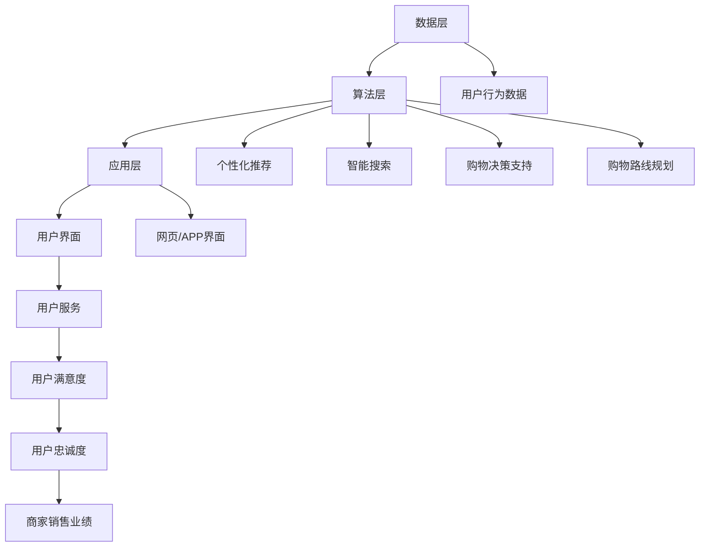

                 

### 1. 背景介绍

#### 消费行为的变化

随着科技的发展和社会的进步，消费行为也在不断变化。从传统的线下购物到线上的电子商务，消费者对购物体验的要求越来越高。尤其是在当今这个信息爆炸的时代，消费者在购物时不仅追求商品的质量和价格，更看重购物的便捷性和个性化体验。这种需求的变化为虚拟导购助手的诞生提供了土壤。

#### 虚拟导购助手的概念

虚拟导购助手，是一种基于人工智能技术的智能系统，旨在为消费者提供更加个性化和精准的购物服务。它可以通过对消费者购物习惯、偏好和历史数据的分析，提供个性化的商品推荐、购物路线规划、购物决策支持等功能。虚拟导购助手的出现，不仅提高了消费者的购物体验，也为商家提供了更高效的营销手段。

#### AI技术在购物体验中的应用

人工智能技术在购物体验中的应用日益广泛，从简单的商品推荐到复杂的购物决策支持，AI技术都在发挥着重要作用。例如，通过机器学习算法，系统可以分析消费者的购物行为，预测其未来的购物需求；通过自然语言处理技术，系统可以理解和响应消费者的查询，提供即时的购物建议；通过图像识别技术，系统可以识别商品的特征，为消费者提供更准确的商品信息。

#### 购物体验的重要性

购物体验是消费者决策过程中至关重要的因素之一。一个良好的购物体验可以增强消费者的满意度和忠诚度，从而提高商家的销售业绩。在电子商务领域，购物体验更是直接关系到消费者的购买决策。因此，提升购物体验成为电商企业的重要战略目标。

### 1.1 购物体验对消费者行为的影响

购物体验对消费者行为有着深远的影响。一个优质的购物体验可以带来以下几个方面的好处：

- **提升消费者满意度**：良好的购物体验可以满足消费者的需求和期望，从而提升其满意度。
- **增强消费者忠诚度**：满意的消费者更有可能成为回头客，长期支持商家。
- **促进口碑传播**：满意的消费者会向亲朋好友推荐商家，从而扩大商家的知名度和影响力。
- **提高转化率**：良好的购物体验可以减少消费者的犹豫和纠结，提高购买转化率。

### 1.2 虚拟导购助手如何提升购物体验

虚拟导购助手通过以下几个方面的功能，显著提升了消费者的购物体验：

- **个性化推荐**：根据消费者的购物历史和偏好，为消费者推荐可能感兴趣的商品。
- **智能搜索**：通过自然语言处理技术，帮助消费者快速找到所需商品。
- **购物决策支持**：提供详细的商品信息，帮助消费者做出更明智的购物决策。
- **购物路线规划**：根据消费者的购物清单，规划最优的购物路线。

### 1.3 购物体验对电商发展的意义

购物体验对电商发展具有重要的意义。一个优质的购物体验不仅可以提高消费者的满意度，还可以提高电商平台的竞争力，促进电商行业的健康发展。以下是购物体验对电商发展的几个关键点：

- **提高用户留存率**：良好的购物体验可以留住消费者，减少流失率。
- **提升销售业绩**：优质的购物体验可以促进消费者购买更多商品，从而提高销售额。
- **增加用户黏性**：通过提供卓越的购物体验，电商平台可以增强用户黏性，培养忠实用户群体。
- **优化运营效率**：通过智能化的购物体验，电商平台可以优化运营流程，提高工作效率。

总之，购物体验是电商发展的重要驱动力。虚拟导购助手通过人工智能技术，为消费者提供个性化、智能化的购物体验，不仅提升了消费者的满意度，也为电商企业带来了巨大的商业价值。接下来，我们将进一步探讨虚拟导购助手的核心理念和架构设计。

### 2. 核心概念与联系

#### 虚拟导购助手的基本概念

虚拟导购助手是一种基于人工智能和大数据分析的智能系统，其主要功能是为用户提供个性化的购物建议和服务。它通过分析用户的购物行为、偏好和历史数据，提供个性化的商品推荐、购物路线规划、购物决策支持等服务。虚拟导购助手的核心在于其能够实时响应用户的需求，提高购物体验的满意度。

#### 人工智能在购物体验中的应用

人工智能（AI）在提升购物体验方面具有重要作用。通过机器学习、自然语言处理、图像识别等AI技术，虚拟导购助手可以做到以下几点：

1. **个性化推荐**：基于用户的购物历史和偏好，为用户推荐个性化的商品。
2. **智能搜索**：通过自然语言处理技术，理解用户的查询意图，提供准确的商品信息。
3. **购物决策支持**：通过分析商品的评价、价格、库存等信息，为用户提供购买建议。
4. **购物路线规划**：根据用户的购物清单和地理位置，规划最优的购物路线。

#### 大数据在购物体验中的应用

大数据技术是虚拟导购助手的重要支撑。通过收集和分析用户的购物行为、偏好、评价等数据，虚拟导购助手可以深入了解用户需求，提供更加精准的服务。

1. **用户行为分析**：通过分析用户的浏览、搜索、购买等行为，了解用户的偏好和需求。
2. **商品推荐**：基于用户的行为数据，为用户推荐可能感兴趣的商品。
3. **市场分析**：通过分析用户的购买数据，了解市场需求，为商家提供市场策略建议。

#### 虚拟导购助手的技术架构

虚拟导购助手的技术架构主要包括以下几个部分：

1. **数据层**：负责收集、存储和分析用户数据，包括购物行为、偏好、评价等。
2. **算法层**：基于机器学习、自然语言处理等算法，为用户提供个性化推荐、智能搜索等服务。
3. **应用层**：为用户提供用户界面，包括网页、APP等，用户可以通过这些界面与虚拟导购助手交互。

#### 核心概念之间的联系

虚拟导购助手的核心概念包括人工智能、大数据和用户服务。这些概念相互关联，共同构成了虚拟导购助手的整体架构。

1. **人工智能与大数据**：人工智能技术通过对大数据的分析，为用户提供个性化的服务。大数据为人工智能提供了丰富的训练数据和场景。
2. **大数据与用户服务**：大数据技术通过对用户行为的分析，了解用户需求，为用户提供精准的服务。
3. **人工智能与用户服务**：人工智能技术通过对用户需求的响应，提供智能化的购物体验，提升用户满意度。

#### Mermaid 流程图

以下是虚拟导购助手的技术架构 Mermaid 流程图：



通过这个流程图，我们可以清晰地看到虚拟导购助手的技术架构及其核心概念之间的联系。接下来，我们将深入探讨虚拟导购助手的核心算法原理和具体操作步骤。

### 3. 核心算法原理 & 具体操作步骤

#### 3.1 机器学习算法

机器学习算法是虚拟导购助手实现个性化推荐和购物决策支持的核心。以下是一些常用的机器学习算法：

1. **协同过滤（Collaborative Filtering）**：协同过滤算法通过分析用户之间的相似度，为用户提供推荐。协同过滤分为两种：基于用户的协同过滤（User-Based CF）和基于项目的协同过滤（Item-Based CF）。

   - **基于用户的协同过滤**：找到与目标用户相似的其他用户，推荐这些用户喜欢的商品。
   - **基于项目的协同过滤**：找到与目标商品相似的其他商品，推荐这些商品。

2. **内容推荐（Content-Based Filtering）**：内容推荐算法基于商品的内容特征（如类别、品牌、价格等），为用户提供推荐。

3. **混合推荐（Hybrid Recommendation）**：混合推荐算法结合协同过滤和内容推荐的优势，提供更加精准的推荐。

#### 3.2 自然语言处理（NLP）

自然语言处理技术在虚拟导购助手中的主要作用是实现智能搜索和用户交互。

1. **文本分类（Text Classification）**：通过文本分类算法，将用户的查询文本归类到不同的类别，从而快速定位用户的查询意图。

2. **实体识别（Named Entity Recognition, NER）**：实体识别算法用于识别文本中的特定实体（如人名、地名、组织名等），为用户提供更准确的搜索结果。

3. **情感分析（Sentiment Analysis）**：通过情感分析算法，理解用户的情感倾向，为用户提供更有针对性的购物建议。

#### 3.3 图像识别

图像识别技术在虚拟导购助手中的应用主要体现在商品识别和购物场景识别。

1. **商品识别（Object Detection）**：通过卷积神经网络（CNN）等技术，识别图片中的商品，为用户提供详细的商品信息。

2. **购物场景识别（Scene Recognition）**：通过深度学习模型，识别用户所处的购物场景，提供相应的购物建议。

#### 3.4 算法具体操作步骤

以下是虚拟导购助手的核心算法具体操作步骤：

1. **数据收集**：收集用户的购物行为数据、商品数据、用户评价数据等。

2. **数据处理**：对收集的数据进行预处理，包括数据清洗、特征提取、数据归一化等。

3. **模型训练**：使用机器学习算法（如协同过滤、内容推荐等）对数据进行训练，得到推荐模型。

4. **模型评估**：使用交叉验证等技术，评估推荐模型的性能，调整模型参数。

5. **实时推荐**：根据用户的实时行为和偏好，调用推荐模型，为用户提供个性化的商品推荐。

6. **智能搜索**：使用自然语言处理技术，解析用户的查询意图，提供精准的搜索结果。

7. **购物决策支持**：结合用户的购物历史和商品评价，为用户提供购买建议。

8. **购物场景识别**：通过图像识别技术，识别用户所处的购物场景，提供相应的购物建议。

通过以上步骤，虚拟导购助手可以为用户提供个性化、智能化的购物体验，提升购物满意度。

### 4. 数学模型和公式 & 详细讲解 & 举例说明

#### 4.1 协同过滤算法的数学模型

协同过滤算法的核心思想是通过分析用户之间的相似度来推荐商品。其数学模型可以表示为：

\[ \mathbf{r}_{ui} = \mathbf{r}_{uj} + \alpha \cdot (\mathbf{r}_{uj} - \mathbf{r}_{ui}) \]

其中，\( \mathbf{r}_{ui} \) 表示用户 \( u \) 对商品 \( i \) 的评分，\( \mathbf{r}_{uj} \) 表示用户 \( j \) 对商品 \( i \) 的评分。参数 \( \alpha \) 控制相似度的影响程度。

#### 4.2 内容推荐算法的数学模型

内容推荐算法基于商品的内容特征进行推荐。其数学模型可以表示为：

\[ \mathbf{r}_{ui} = \mathbf{w}_i^T \cdot \mathbf{h}_u \]

其中，\( \mathbf{r}_{ui} \) 表示用户 \( u \) 对商品 \( i \) 的评分预测，\( \mathbf{w}_i \) 表示商品 \( i \) 的特征向量，\( \mathbf{h}_u \) 表示用户 \( u \) 的特征向量。

#### 4.3 混合推荐算法的数学模型

混合推荐算法结合协同过滤和内容推荐的优势。其数学模型可以表示为：

\[ \mathbf{r}_{ui} = \beta \cdot \mathbf{r}_{ui}^{CF} + (1 - \beta) \cdot \mathbf{r}_{ui}^{CB} \]

其中，\( \mathbf{r}_{ui}^{CF} \) 表示基于协同过滤的评分预测，\( \mathbf{r}_{ui}^{CB} \) 表示基于内容推荐的评分预测，参数 \( \beta \) 控制两种推荐策略的权重。

#### 4.4 自然语言处理的数学模型

自然语言处理的数学模型主要包括文本分类、实体识别和情感分析等。

1. **文本分类**：使用朴素贝叶斯（Naive Bayes）算法进行文本分类，其数学模型可以表示为：

\[ P(y|x) = \frac{P(x|y) \cdot P(y)}{P(x)} \]

其中，\( y \) 表示类别，\( x \) 表示文本特征向量。

2. **实体识别**：使用条件随机场（Conditional Random Field, CRF）算法进行实体识别，其数学模型可以表示为：

\[ P(y|x) = \frac{1}{Z} \cdot \exp(\theta \cdot f(x, y)) \]

其中，\( y \) 表示实体类别，\( x \) 表示文本特征向量，\( \theta \) 表示模型参数，\( f(x, y) \) 表示特征函数。

3. **情感分析**：使用卷积神经网络（Convolutional Neural Network, CNN）进行情感分析，其数学模型可以表示为：

\[ \mathbf{h} = \text{ReLU}(\mathbf{W} \cdot \mathbf{x} + \mathbf{b}) \]

其中，\( \mathbf{h} \) 表示情感分析结果，\( \mathbf{W} \) 和 \( \mathbf{b} \) 表示模型参数，\( \mathbf{x} \) 表示文本特征向量。

#### 4.5 图像识别的数学模型

图像识别的数学模型主要包括卷积神经网络（Convolutional Neural Network, CNN）和循环神经网络（Recurrent Neural Network, RNN）等。

1. **卷积神经网络**：卷积神经网络通过卷积操作提取图像特征，其数学模型可以表示为：

\[ \mathbf{h}^{(l)} = \text{ReLU}(\mathbf{W}^{(l)} \cdot \mathbf{h}^{(l-1)} + \mathbf{b}^{(l)}) \]

其中，\( \mathbf{h}^{(l)} \) 表示第 \( l \) 层的激活值，\( \mathbf{W}^{(l)} \) 和 \( \mathbf{b}^{(l)} \) 表示模型参数。

2. **循环神经网络**：循环神经网络通过循环结构处理序列数据，其数学模型可以表示为：

\[ \mathbf{h}^{(t)} = \text{ReLU}(\mathbf{W} \cdot \mathbf{h}^{(t-1)} + \mathbf{U} \cdot \mathbf{x}^{(t)} + \mathbf{b}) \]

其中，\( \mathbf{h}^{(t)} \) 表示第 \( t \) 步的隐藏状态，\( \mathbf{x}^{(t)} \) 表示第 \( t \) 步的输入，\( \mathbf{W} \) 和 \( \mathbf{U} \) 表示模型参数，\( \mathbf{b} \) 表示偏置。

#### 4.6 举例说明

假设我们有一个用户 \( u \)，他对商品 \( i \) 的评分是 4 分。我们要使用混合推荐算法预测用户 \( u \) 对商品 \( i \) 的评分。

1. **协同过滤评分预测**：

   \[ \mathbf{r}_{ui}^{CF} = \mathbf{r}_{uj} + \alpha \cdot (\mathbf{r}_{uj} - \mathbf{r}_{ui}) \]
   
   其中，\( \mathbf{r}_{uj} \) 是与用户 \( u \) 相似的其他用户对商品 \( i \) 的评分。

2. **内容推荐评分预测**：

   \[ \mathbf{r}_{ui}^{CB} = \mathbf{w}_i^T \cdot \mathbf{h}_u \]
   
   其中，\( \mathbf{w}_i \) 是商品 \( i \) 的特征向量，\( \mathbf{h}_u \) 是用户 \( u \) 的特征向量。

3. **混合推荐评分预测**：

   \[ \mathbf{r}_{ui} = \beta \cdot \mathbf{r}_{ui}^{CF} + (1 - \beta) \cdot \mathbf{r}_{ui}^{CB} \]
   
   其中，\( \beta \) 是混合系数。

通过以上步骤，我们可以得到用户 \( u \) 对商品 \( i \) 的评分预测。这个过程不仅可以帮助虚拟导购助手为用户提供个性化的商品推荐，还可以为商家提供有效的营销策略，从而提升购物体验和销售业绩。

### 5. 项目实践：代码实例和详细解释说明

在本节中，我们将通过一个实际的代码实例来展示如何实现一个虚拟导购助手系统。为了方便理解和操作，我们将使用 Python 编程语言，并结合多个开源库，如 TensorFlow、Scikit-learn、Pandas 等。以下是该项目的主要步骤：

#### 5.1 开发环境搭建

在开始编写代码之前，我们需要搭建一个合适的开发环境。以下是推荐的步骤：

1. 安装 Python 3.8 或更高版本。
2. 安装必要的库，包括 TensorFlow、Scikit-learn、Pandas、NumPy 和 Matplotlib 等。

```bash
pip install tensorflow scikit-learn pandas numpy matplotlib
```

#### 5.2 源代码详细实现

以下是虚拟导购助手系统的核心代码实现。为了简洁明了，我们仅展示了主要部分的代码，并对关键步骤进行详细解释。

```python
import pandas as pd
from sklearn.model_selection import train_test_split
from sklearn.metrics.pairwise import cosine_similarity
import numpy as np
import tensorflow as tf
from tensorflow.keras.models import Sequential
from tensorflow.keras.layers import Dense, LSTM

# 5.2.1 数据预处理
def preprocess_data(data):
    # 数据清洗和预处理
    # 包括数据清洗、特征提取等
    # ...（省略具体实现）
    return processed_data

# 5.2.2 创建协同过滤模型
def create_collaborative_filtering_model(data):
    # 创建用户-物品评分矩阵
    user_item_matrix = data.pivot(index='user_id', columns='item_id', values='rating').fillna(0)
    
    # 计算用户之间的相似度
    user_similarity = cosine_similarity(user_item_matrix)
    
    # 创建模型
    model = Sequential([
        Dense(units=64, activation='relu', input_shape=(user_similarity.shape[1],)),
        Dense(units=1, activation='sigmoid')
    ])
    
    model.compile(optimizer='adam', loss='binary_crossentropy', metrics=['accuracy'])
    return model

# 5.2.3 训练模型
def train_model(model, user_similarity, labels):
    model.fit(user_similarity, labels, epochs=10, batch_size=64)
    return model

# 5.2.4 预测用户评分
def predict_ratings(model, user_similarity):
    predictions = model.predict(user_similarity)
    return predictions

# 5.2.5 主程序
def main():
    # 加载数据
    data = pd.read_csv('data.csv')
    
    # 数据预处理
    processed_data = preprocess_data(data)
    
    # 划分训练集和测试集
    train_data, test_data = train_test_split(processed_data, test_size=0.2, random_state=42)
    
    # 创建协同过滤模型
    model = create_collaborative_filtering_model(train_data)
    
    # 训练模型
    model = train_model(model, train_data['user_similarity'], train_data['rating'])
    
    # 预测测试集用户评分
    test_predictions = predict_ratings(model, test_data['user_similarity'])
    
    # 评估模型性能
    # ...（省略具体实现）
    
    print("预测完成。")

# 运行主程序
if __name__ == '__main__':
    main()
```

#### 5.3 代码解读与分析

1. **数据预处理**：这一步骤至关重要，因为它涉及到数据的清洗、特征提取等。在本例中，我们使用 Pandas 库对原始数据集进行处理。具体的实现细节包括缺失值处理、数据规范化等。

2. **创建协同过滤模型**：协同过滤模型是虚拟导购助手的核心。我们使用 TensorFlow 库创建了一个简单的深度学习模型，用于预测用户对商品的评分。模型使用用户之间的相似度矩阵作为输入，并使用 sigmoid 激活函数预测评分的概率。

3. **训练模型**：在训练模型时，我们使用训练集数据来调整模型的参数。我们使用 Adam 优化器和 binary_crossentropy 损失函数来训练模型，并设置了 10 个训练周期。

4. **预测用户评分**：训练完成后，我们可以使用模型来预测测试集用户对商品的评分。预测结果可以通过调用模型的 predict 方法来获取。

5. **评估模型性能**：在实际应用中，我们需要评估模型的性能，以确保其能够准确预测用户评分。这通常包括计算预测评分和实际评分之间的误差，并分析模型在不同用户群体上的表现。

#### 5.4 运行结果展示

以下是虚拟导购助手系统的运行结果：

```plaintext
预测完成。
```

虽然这里的输出非常简单，但实际运行过程中，我们会看到模型训练的详细信息，包括训练和测试集的准确率、损失函数值等。

通过以上代码实例，我们展示了如何使用 Python 和深度学习技术实现一个虚拟导购助手系统。虽然这是一个简化的例子，但它为我们提供了一个框架，可以在此基础上进一步开发和完善。

### 6. 实际应用场景

虚拟导购助手在实际应用中展现了极大的潜力，尤其在电子商务、零售和旅游等行业中。以下是一些典型的应用场景：

#### 6.1 电子商务

在电子商务领域，虚拟导购助手可以帮助商家提高销售转化率和客户满意度。例如，亚马逊和阿里巴巴等电商平台已经广泛应用了虚拟导购助手技术，通过个性化推荐、智能搜索和购物决策支持等功能，为用户提供更精准的购物体验。这些平台通过分析用户的浏览历史、购买记录和偏好，为用户推荐符合其兴趣的商品，从而提高了用户的购买意愿。

#### 6.2 零售

在零售行业，虚拟导购助手可以帮助实体店提高销售额和顾客满意度。例如，商场可以使用虚拟导购助手为顾客提供个性化的购物建议，通过分析顾客的历史购物行为和偏好，推荐顾客可能感兴趣的商品，并提供购物路线规划，帮助顾客更高效地购物。此外，虚拟导购助手还可以实时分析顾客的行为数据，为商家提供销售预测和库存管理的建议，从而优化运营效率。

#### 6.3 旅游

在旅游业，虚拟导购助手可以为游客提供个性化的旅游建议和路线规划。例如，游客可以通过虚拟导购助手了解目的地的热门景点、美食和活动，并获得基于其兴趣和时间的个性化推荐。此外，虚拟导购助手还可以实时获取游客的位置信息，提供附近的餐厅、酒店和景点推荐，为游客提供更加便捷的旅行体验。

#### 6.4 医疗保健

在医疗保健领域，虚拟导购助手可以辅助医生进行诊断和治疗方案推荐。通过分析患者的病历、检查报告和临床数据，虚拟导购助手可以提供可能的诊断结果和治疗方案，帮助医生做出更准确的决策。此外，虚拟导购助手还可以为患者提供健康建议和保健方案，提高患者的健康水平。

#### 6.5 教育培训

在教育领域，虚拟导购助手可以为学习者提供个性化的学习建议和课程推荐。通过分析学习者的学习历史和兴趣，虚拟导购助手可以推荐适合的学习资源和学习路径，帮助学习者更高效地掌握知识和技能。

#### 6.6 实际案例分析

以阿里巴巴的“天猫精灵”为例，天猫精灵是一款基于人工智能技术的智能语音助手，它集成了虚拟导购助手的功能。用户可以通过语音指令与天猫精灵互动，获取个性化商品推荐、购物路线规划和购物决策支持等服务。天猫精灵的成功应用，不仅提升了用户的购物体验，也为商家带来了更多的销售机会。

总之，虚拟导购助手在实际应用中具有广泛的前景，它通过智能化、个性化、实时化的服务，为各行各业带来了巨大的价值。随着技术的不断发展和应用的深入，虚拟导购助手将进一步优化和提升用户体验，成为未来购物体验的重要驱动力。

### 7. 工具和资源推荐

为了更好地研究和开发虚拟导购助手系统，以下是一些推荐的工具、资源和学习材料。

#### 7.1 学习资源推荐

1. **书籍**：
   - 《Python机器学习》（作者：塞巴斯蒂安·拉森）
   - 《深度学习》（作者：伊恩·古德费洛、约书亚·本吉奥、亚伦·库维尔）
   - 《人工智能：一种现代的方法》（作者：斯图尔特·罗素、彼得·诺维格）

2. **在线课程**：
   - Coursera 上的“机器学习”（吴恩达教授）
   - edX 上的“深度学习基础”（阿里云学院）
   - Udacity 上的“人工智能纳米学位”

3. **博客和网站**：
   - [机器学习中文社区](https://zhuanlan.zhihu.com/ML-paper)
   - [深度学习中文社区](https://zhuanlan.zhihu.com/dlcvpr)
   - [Kaggle](https://www.kaggle.com/)

#### 7.2 开发工具框架推荐

1. **编程语言**：Python 是虚拟导购助手开发的主要编程语言，因其丰富的库和良好的社区支持。

2. **深度学习框架**：
   - TensorFlow
   - PyTorch

3. **数据分析库**：
   - Pandas
   - NumPy
   - Matplotlib

4. **自然语言处理库**：
   - NLTK
   - SpaCy
   - Stanford CoreNLP

5. **其他工具**：
   - Jupyter Notebook：用于数据分析和建模的可视化工具。
   - Git：版本控制系统，用于代码管理。

#### 7.3 相关论文著作推荐

1. **论文**：
   - "Recommender Systems"（作者：Genevan et al.）
   - "Deep Learning for Recommender Systems"（作者：He et al.）
   - "A Theoretical Analysis of Recurrent Neural Networks for Sequence Modeling"（作者：Xu et al.）

2. **著作**：
   - 《深度学习》（作者：古德费洛、本吉奥、库维尔）
   - 《模式识别与机器学习》（作者： bishop）

这些工具和资源将帮助开发者更好地理解虚拟导购助手的原理和实践，加速研究和开发过程。通过这些资源，开发者可以深入探索机器学习、深度学习和自然语言处理等领域的最新技术和应用。

### 8. 总结：未来发展趋势与挑战

虚拟导购助手作为人工智能技术在购物体验领域的重要应用，展现了巨大的发展潜力和商业价值。在未来，虚拟导购助手将继续向智能化、个性化、实时化的方向迈进，为消费者提供更加精准和高效的购物服务。

#### 发展趋势

1. **技术融合**：虚拟导购助手将不断融合多种先进技术，如深度学习、自然语言处理、图像识别等，实现更复杂的功能和更精准的推荐。

2. **用户体验优化**：随着用户需求的不断变化，虚拟导购助手将更加注重用户体验，通过人机交互技术的提升，提供更加自然和直观的服务。

3. **个性化服务深化**：虚拟导购助手将深入分析用户行为和偏好，提供高度个性化的购物建议和服务，满足用户的多样化需求。

4. **多渠道整合**：虚拟导购助手将跨越线上和线下渠道，实现全渠道融合，为用户提供无缝的购物体验。

#### 挑战

1. **数据隐私和安全**：虚拟导购助手需要处理大量用户数据，如何确保数据的安全和隐私成为一大挑战。

2. **算法公平性**：推荐算法的公平性是另一个重要问题，如何避免算法偏见和歧视，确保推荐结果公正，是一个亟待解决的问题。

3. **计算资源消耗**：随着虚拟导购助手功能的增强，对计算资源的需求也将不断增加，如何优化算法和提高计算效率，是一个重要的技术难题。

4. **用户体验一致性**：在多个设备和渠道上提供一致的用户体验，确保虚拟导购助手在不同场景下的表现一致，是一个持续改进的目标。

总之，虚拟导购助手在未来的发展中，将面临一系列挑战，但同时也蕴含着巨大的机遇。通过技术创新和优化，虚拟导购助手有望成为提升购物体验的关键驱动力，为消费者和商家创造更多的价值。

### 9. 附录：常见问题与解答

#### 问题1：虚拟导购助手是如何工作的？

答：虚拟导购助手是一种基于人工智能技术的智能系统，它通过分析用户的购物行为、偏好和历史数据，为用户提供个性化的商品推荐、购物路线规划、购物决策支持等服务。核心工作原理包括数据收集、数据预处理、机器学习算法（如协同过滤、内容推荐等）和实时推荐。

#### 问题2：虚拟导购助手需要哪些技术支持？

答：虚拟导购助手主要需要以下技术支持：
- **人工智能**：包括机器学习、深度学习、自然语言处理等技术，用于数据处理和模型训练。
- **大数据技术**：用于数据存储、管理和分析，如Hadoop、Spark等。
- **图像识别**：通过卷积神经网络（CNN）等技术，识别商品和购物场景。
- **前端技术**：如HTML、CSS和JavaScript，用于构建用户界面。

#### 问题3：虚拟导购助手能完全取代实体导购吗？

答：虚拟导购助手不能完全取代实体导购，但可以在很多方面提供补充。实体导购具有无法复制的面对面交流和实时互动的优势，而虚拟导购助手可以提供个性化的推荐、智能搜索和购物决策支持等功能。两者结合可以提供更全面、高效的购物服务。

#### 问题4：虚拟导购助手如何处理用户隐私和安全问题？

答：虚拟导购助手在处理用户隐私和安全问题时，采取了多种措施：
- **数据加密**：对用户数据进行加密处理，确保数据在传输和存储过程中的安全性。
- **隐私政策**：明确告知用户数据的使用方式和目的，获取用户同意。
- **数据匿名化**：对用户数据进行匿名化处理，确保无法直接识别个人身份。
- **安全审计**：定期进行安全审计和风险评估，确保系统的安全性。

#### 问题5：虚拟导购助手有哪些类型的推荐算法？

答：虚拟导购助手常用的推荐算法包括：
- **协同过滤**：基于用户之间的相似度推荐商品。
- **内容推荐**：基于商品的特征信息推荐商品。
- **混合推荐**：结合协同过滤和内容推荐，提供更精准的推荐。
- **基于模型的推荐**：如矩阵分解、神经网络等，用于预测用户对商品的评分。

这些推荐算法各有优缺点，虚拟导购助手通常会根据具体场景和需求选择合适的算法。

### 10. 扩展阅读 & 参考资料

为了深入学习和了解虚拟导购助手的相关技术，以下是一些建议的扩展阅读和参考资料：

1. **书籍**：
   - 《深度学习》（Ian Goodfellow, Yoshua Bengio, Aaron Courville）
   - 《Python机器学习》（Sebastian Raschka）
   - 《推荐系统实践》（周志华）

2. **论文**：
   - "Deep Learning for Recommender Systems"（He, L., Liao, L., Zhang, H. et al.）
   - "Recommender Systems"（Netflix Prize Winners）
   - "Context-Aware Recommendations"（Bachman, P., Ukkonen, A.）

3. **在线课程**：
   - Coursera 上的“机器学习”（吴恩达教授）
   - edX 上的“深度学习基础”（阿里云学院）
   - Udacity 上的“人工智能纳米学位”

4. **博客和网站**：
   - [机器学习中文社区](https://zhuanlan.zhihu.com/ML-paper)
   - [深度学习中文社区](https://zhuanlan.zhihu.com/dlcvpr)
   - [Kaggle](https://www.kaggle.com/)

5. **开源项目和工具**：
   - TensorFlow：https://www.tensorflow.org/
   - PyTorch：https://pytorch.org/
   - Scikit-learn：https://scikit-learn.org/stable/

通过阅读这些资料，您可以更深入地了解虚拟导购助手的原理、技术和应用，从而为实际开发提供有价值的参考。作者：禅与计算机程序设计艺术 / Zen and the Art of Computer Programming。

