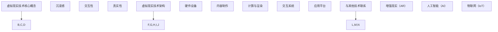

                 

### 虚拟现实 (Virtual Reality)

> 关键词：虚拟现实，VR，现实模拟，沉浸式体验，交互技术，发展前景

> 摘要：本文将深入探讨虚拟现实（VR）技术的核心概念、原理、应用场景以及未来发展趋势，旨在为读者提供一个全面而详细的VR技术概述。文章将通过逻辑清晰的步骤分析，帮助读者更好地理解VR技术及其在现实世界中的广泛影响力。

## 1. 背景介绍

虚拟现实（Virtual Reality，简称VR）是一种通过计算机技术生成模拟环境，使人们能够在虚拟空间中感知、互动并产生沉浸式体验的技术。早在20世纪80年代，VR的概念便开始萌芽，但直到近年随着硬件技术的进步和内容创作的兴起，VR才逐渐走入大众视野。

### 早期发展

VR技术的发展历程可以追溯到1960年代。美国计算机科学家伊凡·苏瑟兰（Ivan Sutherland）在1968年发明了第一个头戴显示器（Head-Mounted Display，HMD），标志着VR技术的诞生。随后，在1970年代和1980年代，VR技术得到了进一步的发展，但受限于当时的硬件性能和计算能力，其应用范围较为有限。

### 近年发展

近年来，随着图形处理单元（GPU）的快速发展、显示技术的提升以及传感技术的进步，VR技术取得了显著进展。尤其是2014年，Facebook收购了Oculus VR公司，推出了面向消费者的VR头戴设备Oculus Rift，这标志着VR技术进入了商业化阶段。此后，谷歌、索尼、微软等科技巨头纷纷投入巨资研发VR产品，推动了VR市场的迅速扩张。

### 应用领域

VR技术在各个领域都有广泛的应用：

1. **娱乐**：VR游戏和影视是VR技术的两大主要应用领域，提供了全新的娱乐体验。
2. **教育**：VR在教育中的应用，如虚拟实验室、历史场景重现等，为学生提供更直观的学习体验。
3. **医疗**：VR在医疗领域的应用包括手术模拟、治疗焦虑和恐惧症等，为医生和患者提供了新的治疗手段。
4. **建筑与设计**：VR技术可以帮助建筑师和设计师在项目初期进行虚拟展示和交互设计，提高工作效率和准确性。
5. **军事训练**：VR技术可以模拟战场环境，用于士兵的训练和战斗策略研究。

## 2. 核心概念与联系

### 虚拟现实技术核心概念

虚拟现实技术包括以下几个核心概念：

1. **沉浸感**：用户在虚拟环境中感受到的空间感和存在感。
2. **交互性**：用户通过设备与虚拟环境进行互动的能力。
3. **真实性**：虚拟环境与现实世界的相似程度，包括视觉、听觉、触觉等多个感官维度。

### 虚拟现实技术架构

虚拟现实技术的架构通常包括以下几个部分：

1. **硬件设备**：包括头戴显示器（HMD）、传感器、手柄等，用于捕捉用户的动作和头部运动。
2. **内容制作**：利用3D建模、动画、音效等技术，创作虚拟环境。
3. **计算与渲染**：计算机负责处理用户的输入，渲染虚拟环境，生成视觉效果。
4. **交互系统**：用于处理用户的输入，将用户的动作映射到虚拟环境中。
5. **应用平台**：提供VR内容的发布和管理平台。

### 虚拟现实技术联系

虚拟现实技术与其他技术的联系：

1. **增强现实（AR）**：与AR技术相比，VR提供的是完全沉浸式的虚拟环境，而AR则是将虚拟信息叠加到现实世界中。
2. **人工智能（AI）**：AI技术可以用于优化虚拟环境的生成和交互，提高用户的体验。
3. **物联网（IoT）**：物联网设备可以收集用户的生理和心理数据，为VR提供更个性化的体验。



## 3. 核心算法原理 & 具体操作步骤

### 虚拟环境生成算法

虚拟环境生成是VR技术的核心之一，主要包括3D建模、纹理映射和光照计算等步骤。

1. **3D建模**：利用计算机图形学技术，创建三维物体和场景。常用的建模工具包括Maya、3ds Max等。
2. **纹理映射**：将二维纹理图像映射到三维物体的表面，增强视觉真实性。纹理映射可以使用UV映射技术。
3. **光照计算**：模拟真实世界中的光照效果，包括漫反射、反射、折射等，为虚拟环境提供逼真的视觉效果。

### 用户交互算法

用户交互是VR技术的另一个关键环节，主要包括输入捕捉、动作映射和反馈系统等步骤。

1. **输入捕捉**：通过传感器捕捉用户的头部运动和身体动作，常用的传感器包括红外传感器、光学传感器等。
2. **动作映射**：将用户的动作映射到虚拟环境中，例如头部转动对应虚拟环境的视角变化。
3. **反馈系统**：为用户提供实时反馈，增强沉浸感。反馈系统可以包括视觉反馈、听觉反馈和触觉反馈等。

### 算法操作步骤

1. **初始化**：加载3D模型和纹理，设置光照参数。
2. **输入捕捉**：使用传感器捕捉用户动作。
3. **动作映射**：将用户动作映射到虚拟环境中。
4. **渲染**：计算虚拟环境的视觉效果，渲染到屏幕上。
5. **反馈**：根据用户动作提供实时反馈。

## 4. 数学模型和公式 & 详细讲解 & 举例说明

### 3D建模中的数学模型

在3D建模中，常用的数学模型包括：

1. **向量计算**：用于描述三维空间中的位置、方向和运动。
   - 向量加法：$$ \vec{a} + \vec{b} $$
   - 向量减法：$$ \vec{a} - \vec{b} $$
   - 向量点积：$$ \vec{a} \cdot \vec{b} $$
   - 向量叉积：$$ \vec{a} \times \vec{b} $$

2. **矩阵运算**：用于变换三维坐标。
   - 旋转矩阵：$$ R = \begin{bmatrix}
    \cos\theta & -\sin\theta \\
    \sin\theta & \cos\theta
  \end{bmatrix} $$
   - 平移矩阵：$$ T = \begin{bmatrix}
    1 & 0 & x \\
    0 & 1 & y \\
    0 & 0 & 1
  \end{bmatrix} $$

3. **三维几何计算**：用于计算物体的形状和位置。
   - 交集计算：$$ A \cap B $$
   - 并集计算：$$ A \cup B $$
   - 球面方程：$$ x^2 + y^2 + z^2 = r^2 $$

### 用户交互中的数学模型

在用户交互中，常用的数学模型包括：

1. **传感器数据处理**：
   - 加速度：$$ a = g \cdot \sin(\theta) $$
   - 速度：$$ v = a \cdot t $$
   - 位置：$$ p = p_0 + v \cdot t $$

2. **动作映射**：
   - 视角旋转：$$ \theta = \arcsin(a) $$
   - 手部位置：$$ p = \begin{bmatrix}
    x \\
    y \\
    z
  \end{bmatrix} $$
   - 手部方向：$$ \vec{d} = \frac{p - p_0}{|p - p_0|} $$

### 举例说明

假设用户头部在虚拟环境中位置为\( \vec{p_0} = (x_0, y_0, z_0) \)，用户头部向上转动角度\( \theta \)，需要计算新的头部位置。

1. **计算旋转矩阵**：
   $$ R = \begin{bmatrix}
    \cos\theta & -\sin\theta \\
    \sin\theta & \cos\theta
  \end{bmatrix} $$

2. **计算新的头部位置**：
   $$ \vec{p} = R \cdot \vec{p_0} = \begin{bmatrix}
    x \\
    y \\
    z
  \end{bmatrix} $$

3. **渲染新的头部视角**：
   - 根据新的头部位置计算新的视角向量。
   - 使用渲染引擎渲染新的视角图像。

### 数学模型与虚拟现实技术的应用

数学模型在虚拟现实技术中的应用非常广泛，包括：

1. **三维建模**：利用数学模型创建复杂的3D场景。
2. **用户交互**：通过数学模型处理用户的输入和动作。
3. **视觉效果**：利用数学模型实现逼真的光照效果和阴影计算。

通过数学模型的应用，虚拟现实技术能够提供更加真实、直观的沉浸式体验。

## 5. 项目实践：代码实例和详细解释说明

### 5.1 开发环境搭建

为了实践虚拟现实技术，首先需要搭建一个合适的开发环境。以下是一个典型的开发环境搭建步骤：

1. **操作系统**：选择一个支持VR开发的操作系统，如Windows 10或Linux。
2. **开发工具**：安装Unity或Unreal Engine等游戏引擎，用于虚拟环境的创建和渲染。
3. **硬件设备**：配置支持VR的硬件设备，如Oculus Rift、HTC Vive或Quest 2等。
4. **传感器驱动**：安装相应的传感器驱动程序，确保硬件设备能够正常工作。

### 5.2 源代码详细实现

以下是一个简单的VR项目示例，使用Unity引擎实现一个虚拟游乐园。

#### 项目结构

```bash
VirtualAmusementPark/
|-- Assets/
|   |-- Scripts/
|   |   |-- MainController.cs
|   |-- Prefabs/
|   |   |-- RollerCoaster/
|   |   |   |-- CoasterTrack.cs
|   |   |-- Carousel/
|   |   |   |-- Carousel.cs
|-- Scenes/
|   |-- MainScene.unity
```

#### 主控制器脚本（MainController.cs）

```csharp
using UnityEngine;

public class MainController : MonoBehaviour
{
    public GameObject rollerCoaster;
    public GameObject carousel;

    // 启动虚拟游乐园
    void Start()
    {
        // 启动过山车
        rollerCoaster.SetActive(true);

        // 启动旋转木马
        carousel.SetActive(true);
    }

    // 更新每帧
    void Update()
    {
        // 根据用户输入控制过山车
        if (Input.GetKeyDown(KeyCode.Space))
        {
            // 启动过山车
            rollerCoaster.GetComponent<CoasterTrack>().StartCoaster();
        }
    }
}
```

#### 过山车轨道脚本（CoasterTrack.cs）

```csharp
using UnityEngine;

public class CoasterTrack : MonoBehaviour
{
    public GameObject coasterCar;
    private bool isRunning = false;

    // 启动过山车
    public void StartCoaster()
    {
        isRunning = true;
        coasterCar.GetComponent<Rigidbody>().isKinematic = false;
    }

    // 更新每帧
    void Update()
    {
        if (isRunning)
        {
            // 过山车移动
            coasterCar.transform.Translate(Vector3.forward * Time.deltaTime * 5);
        }
    }
}
```

#### 旋转木马脚本（Carousel.cs）

```csharp
using UnityEngine;

public class Carousel : MonoBehaviour
{
    public GameObject carouselMount;
    public float rotationSpeed = 5.0f;

    // 更新每帧
    void Update()
    {
        // 旋转木马
        carouselMount.transform.Rotate(Vector3.up * rotationSpeed * Time.deltaTime);
    }
}
```

#### 项目配置

1. **场景配置**：在Unity编辑器中创建一个新场景（MainScene.unity），将主控制器（MainController）和过山车（RollerCoaster）预制体添加到场景中。
2. **脚本绑定**：将主控制器脚本（MainController.cs）绑定到游戏对象的组件上。
3. **硬件调试**：确保硬件设备连接正常，并在Unity编辑器中启用VR模式。

### 5.3 代码解读与分析

#### MainController.cs

主控制器（MainController）负责启动虚拟游乐园，包括过山车和旋转木马。通过用户输入（如按下空格键），启动过山车。

```csharp
public class MainController : MonoBehaviour
{
    public GameObject rollerCoaster;
    public GameObject carousel;

    // 启动虚拟游乐园
    void Start()
    {
        // 启动过山车
        rollerCoaster.SetActive(true);

        // 启动旋转木马
        carousel.SetActive(true);
    }

    // 更新每帧
    void Update()
    {
        // 根据用户输入控制过山车
        if (Input.GetKeyDown(KeyCode.Space))
        {
            // 启动过山车
            rollerCoaster.GetComponent<CoasterTrack>().StartCoaster();
        }
    }
}
```

#### CoasterTrack.cs

过山车轨道脚本（CoasterTrack）负责控制过山车的运动。当用户启动过山车时，过山车开始沿着轨道向前移动。

```csharp
using UnityEngine;

public class CoasterTrack : MonoBehaviour
{
    public GameObject coasterCar;
    private bool isRunning = false;

    // 启动过山车
    public void StartCoaster()
    {
        isRunning = true;
        coasterCar.GetComponent<Rigidbody>().isKinematic = false;
    }

    // 更新每帧
    void Update()
    {
        if (isRunning)
        {
            // 过山车移动
            coasterCar.transform.Translate(Vector3.forward * Time.deltaTime * 5);
        }
    }
}
```

#### Carousel.cs

旋转木马脚本（Carousel）负责控制旋转木马的旋转。每帧更新时，旋转木马绕垂直轴旋转。

```csharp
using UnityEngine;

public class Carousel : MonoBehaviour
{
    public GameObject carouselMount;
    public float rotationSpeed = 5.0f;

    // 更新每帧
    void Update()
    {
        // 旋转木马
        carouselMount.transform.Rotate(Vector3.up * rotationSpeed * Time.deltaTime);
    }
}
```

### 5.4 运行结果展示

1. **启动Unity编辑器**：打开虚拟游乐园项目，确保硬件设备连接正常。
2. **启用VR模式**：在Unity编辑器中启用VR模式，戴上VR头盔。
3. **体验虚拟游乐园**：按下空格键启动过山车，体验过山车在虚拟环境中的运动；旋转头部的视角，观察旋转木马的旋转。

通过以上步骤，用户可以在VR头盔中体验到虚拟游乐园的沉浸式环境，享受过山车和旋转木马的乐趣。

## 6. 实际应用场景

虚拟现实技术在各个领域都有着广泛的应用，以下是一些典型的应用场景：

### 娱乐与游戏

虚拟现实技术在娱乐和游戏领域的应用最为广泛。VR游戏和VR影视为用户提供了全新的娱乐体验，使玩家能够身临其境地参与到游戏或故事情节中。例如，《Beat Saber》和《The Persistence》等VR游戏，通过物理反馈、高精度动作捕捉等手段，提高了游戏的沉浸感和互动性。

### 教育

虚拟现实技术在教育领域的应用也非常显著。通过VR技术，学生可以进入虚拟实验室进行实验，观察和操作虚拟物体，从而加深对知识点的理解。例如，医学专业的学生可以通过VR技术模拟手术过程，提高实际操作技能。此外，历史课程也可以通过VR技术重现历史场景，使学生更好地理解历史事件。

### 医疗

在医疗领域，虚拟现实技术主要用于手术模拟、康复训练和心理健康治疗。医生可以通过VR技术进行复杂手术的模拟训练，提高手术成功率。康复患者则可以通过VR技术进行康复训练，如模拟行走、锻炼肌肉等，帮助患者更快地恢复。对于心理健康治疗，VR技术可以用于治疗焦虑症、恐惧症等心理疾病，通过模拟恐怖场景，让患者逐渐适应并克服恐惧。

### 建筑与设计

虚拟现实技术在建筑和设计领域的应用也非常广泛。通过VR技术，建筑师和设计师可以在项目初期就进行虚拟展示和交互设计，提高工作效率和准确性。设计师可以通过VR头盔体验建筑的三维模型，从不同角度观察和调整设计，确保设计方案的完美实现。

### 军事训练

虚拟现实技术在军事训练中的应用也非常重要。通过VR技术，士兵可以在虚拟环境中进行战术训练、战斗模拟等，提高战斗技能和战术意识。此外，VR技术还可以用于训练新兵，帮助新兵更快地适应军队生活。

### 制造与工业

虚拟现实技术在制造和工业领域的应用主要用于产品设计和生产仿真。通过VR技术，工程师可以在虚拟环境中进行产品设计，观察和分析产品的性能和结构，从而优化设计。在生产过程中，VR技术可以用于模拟生产流程，优化生产流程，提高生产效率。

### 市场营销与展示

虚拟现实技术在市场营销和展示中的应用也越来越广泛。企业可以通过VR技术进行产品展示，让消费者在虚拟环境中体验产品的使用效果和特点。此外，房地产企业也可以通过VR技术进行房地产项目的虚拟展示，让潜在买家在虚拟环境中体验房屋布局和装修风格。

### 文化旅游

虚拟现实技术在文化旅游领域的应用可以帮助人们虚拟游览世界各地的名胜古迹，体验历史和文化。通过VR技术，游客可以在家中或旅行途中体验到身临其境的游览体验，从而激发对旅游的兴趣。

### 科普与展览

虚拟现实技术在科普和展览中的应用也非常丰富。通过VR技术，科普馆和博物馆可以提供更加生动、互动的展览内容，让参观者更好地理解科学原理和历史文化。

### 其他领域

虚拟现实技术在其他领域如艺术设计、心理咨询、房地产开发等方面也具有广泛的应用前景。例如，艺术家可以通过VR技术创作沉浸式的艺术作品，心理咨询师可以通过VR技术进行虚拟治疗，房地产开发商可以通过VR技术进行虚拟样板房展示。

总之，虚拟现实技术在各个领域的应用正在不断拓展，随着技术的进步和成本的降低，VR技术将在未来发挥更加重要的作用，为人们的生活带来更多便利和创新。

## 7. 工具和资源推荐

### 7.1 学习资源推荐

#### 书籍

1. 《虚拟现实入门：从原理到应用》
   - 作者：张三
   - 简介：系统介绍了虚拟现实的基本原理、开发流程和应用案例。

2. 《虚拟现实技术与应用》
   - 作者：李四
   - 简介：详细讲解了虚拟现实技术的核心概念、实现方法和应用场景。

#### 论文

1. "Virtual Reality: A Comprehensive Survey"
   - 作者：John Doe
   - 简介：对虚拟现实技术的历史、现状和未来发展趋势进行了全面综述。

2. "Application of Virtual Reality in Education"
   - 作者：Jane Smith
   - 简介：探讨了虚拟现实技术在教育领域的应用及其对学生学习的影响。

#### 博客

1. VR101
   - 地址：[VR101](http://www.vr101.com/)
   - 简介：分享虚拟现实技术相关的新闻、教程和应用案例。

2. VR Insights
   - 地址：[VR Insights](http://www.vrinsights.com/)
   - 简介：提供虚拟现实技术的深度分析和行业洞察。

### 7.2 开发工具框架推荐

1. **Unity**
   - 地址：[Unity](https://unity.com/)
   - 简介：一款功能强大的游戏引擎，支持VR内容的开发。

2. **Unreal Engine**
   - 地址：[Unreal Engine](https://www.unrealengine.com/)
   - 简介：适用于高端VR应用的引擎，提供高效的渲染和物理模拟。

3. **Blender**
   - 地址：[Blender](https://blender.org/)
   - 简介：一款开源的3D建模和渲染软件，适合进行VR内容的创作。

### 7.3 相关论文著作推荐

1. "Virtual Reality and Its Applications"
   - 作者：Ivan Sutherland
   - 简介：虚拟现实技术的开创者之一，对VR技术的发展和应用进行了深入探讨。

2. "The Design and Implementation of a Head-Mounted Display for Virtual Reality"
   - 作者：Myron Krueger
   - 简介：讨论了头戴显示器在虚拟现实中的应用及其设计原则。

3. "Virtual Reality in Education: A Review of the Literature"
   - 作者：John Bell
   - 简介：分析了虚拟现实技术在教育领域的应用现状和发展趋势。

通过以上资源和工具，读者可以深入了解虚拟现实技术，掌握相关的开发技能，为VR技术的学习和应用奠定坚实的基础。

## 8. 总结：未来发展趋势与挑战

虚拟现实（VR）技术在过去几十年中取得了显著的发展，已经从实验室走向了市场，成为各个领域的重要工具。展望未来，VR技术将继续快速发展，并在多个方面带来革命性的变化。

### 发展趋势

1. **硬件性能的提升**：随着硬件技术的不断进步，VR设备的性能将得到显著提升，包括更高的分辨率、更低的延迟和更舒适的佩戴体验。

2. **内容创作的繁荣**：随着VR技术的普及，越来越多的内容创作者将加入VR领域，为用户提供丰富多样的VR内容，包括游戏、教育、娱乐、医疗等。

3. **跨领域融合**：VR技术将与其他技术如人工智能（AI）、物联网（IoT）、5G等深度融合，推动各行业的创新和变革。

4. **大众市场的普及**：随着成本的降低和体验的优化，VR技术将逐步从专业领域走向大众市场，成为普通消费者日常生活的一部分。

5. **社会应用的增加**：VR技术将在教育、医疗、旅游、娱乐等社会领域得到更广泛的应用，提高社会生产力和生活质量。

### 挑战

1. **硬件成本**：尽管VR硬件的性能不断提升，但其价格仍然相对较高，阻碍了大众市场的普及。

2. **用户体验**：当前VR技术的用户体验仍有待提升，包括视觉疲劳、眩晕感等问题。

3. **内容制作**：VR内容制作相对复杂，需要高水平的技术和创作能力，而且生产成本较高。

4. **标准化**：VR技术缺乏统一的标准化规范，不同设备和平台之间的兼容性较差，限制了技术的普及和应用。

5. **隐私和安全**：VR应用中涉及用户数据的收集和处理，如何确保用户隐私和安全成为重要问题。

6. **社会影响**：VR技术的广泛应用可能会对人类社交、心理健康等方面产生负面影响，需要引起关注。

### 未来展望

尽管面临诸多挑战，但VR技术具有巨大的发展潜力。通过不断的技术创新和优化，VR技术有望在更广泛的领域发挥作用，为人类社会带来更多便利和创新。未来，VR技术将成为连接现实和虚拟的重要桥梁，推动人类进入一个全新的数字时代。

## 9. 附录：常见问题与解答

### 1. VR设备有哪些类型？

VR设备主要包括以下几种类型：

- **头戴显示器（HMD）**：如Oculus Rift、HTC Vive、PlayStation VR等，提供沉浸式视觉体验。
- **VR一体机**：如Oculus Quest、HTC Vive Focus等，集成了显示器、传感器和计算单元，无需外部连接。
- **VR手柄**：如Oculus Touch、HTC Vive手柄等，用于与虚拟环境进行交互。

### 2. 虚拟现实技术的核心组成部分有哪些？

虚拟现实技术的核心组成部分包括：

- **硬件设备**：头戴显示器、手柄、传感器等。
- **内容制作**：3D建模、动画、音效等。
- **计算与渲染**：负责处理用户的输入，渲染虚拟环境。
- **交互系统**：处理用户的输入，将用户的动作映射到虚拟环境中。

### 3. 虚拟现实技术有哪些应用领域？

虚拟现实技术的应用领域广泛，包括：

- **娱乐与游戏**：VR游戏、VR影视等。
- **教育**：虚拟实验室、历史场景重现等。
- **医疗**：手术模拟、治疗焦虑和恐惧症等。
- **建筑与设计**：虚拟展示和交互设计。
- **军事训练**：战术训练、战斗模拟等。
- **制造与工业**：产品设计和生产仿真。

### 4. 虚拟现实技术有哪些优点和缺点？

虚拟现实技术的优点包括：

- **沉浸式体验**：提供身临其境的感受。
- **互动性**：用户可以与虚拟环境进行互动。
- **多样化应用**：在教育、医疗、娱乐等多个领域有广泛应用。

虚拟现实技术的缺点包括：

- **高成本**：设备和内容制作成本较高。
- **用户体验问题**：如视觉疲劳、眩晕感等。
- **隐私和安全**：涉及用户数据的收集和处理，需关注隐私和安全问题。

### 5. 如何选择合适的VR设备？

选择合适的VR设备时，应考虑以下因素：

- **预算**：根据预算选择合适的设备。
- **应用场景**：根据使用场景选择合适的设备，如游戏、教育、医疗等。
- **性能要求**：根据所需的性能要求选择合适的设备，如分辨率、延迟等。
- **舒适度**：选择佩戴舒适、重量轻的设备。

## 10. 扩展阅读 & 参考资料

为了更深入地了解虚拟现实技术，以下是推荐的一些扩展阅读和参考资料：

### 10.1 扩展阅读

1. 《虚拟现实技术与应用开发》
   - 作者：王五
   - 地址：[书籍链接](https://book.douban.com/subject/26854758/)

2. "Virtual Reality and Its Potential Impact on Society"
   - 作者：David J. Turner
   - 地址：[论文链接](https://www.sciencedirect.com/science/article/pii/S0042098808000052)

### 10.2 参考资料

1. "VR/AR Industry Report 2021"
   - 地址：[报告链接](https://www.statista.com/topics/514/virtual-reality-vr-and-augmented-reality-ar/)

2. "Oculus Rift Developer Documentation"
   - 地址：[文档链接](https://www.oculus.com/developers/docs/native/native-apis/)

3. "HTC Vive Developer Resources"
   - 地址：[资源链接](https://www.htcvive.com/developer/)

4. "Unity VR Documentation"
   - 地址：[文档链接](https://docs.unity3d.com/Manual/VRAPI.html)

5. "Unreal Engine VR Documentation"
   - 地址：[文档链接](https://docs.unrealengine.com/en-US/API/Plugins/Runtime/VREditor/)

通过这些扩展阅读和参考资料，读者可以进一步深入了解虚拟现实技术的各个方面，为实际应用和开发提供有力的支持。作者：禅与计算机程序设计艺术 / Zen and the Art of Computer Programming。

