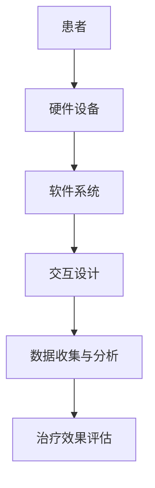

                 

### 背景介绍

虚拟现实（Virtual Reality，VR）技术近年来在科技领域取得了显著进展，逐渐从概念走向现实。VR技术的核心在于通过计算机技术生成一个逼真的三维虚拟环境，用户可以在这个环境中进行交互和体验。随着硬件设备的不断升级和软件算法的优化，VR技术在娱乐、教育、医疗等多个领域展现出了巨大的潜力。

在医疗领域，虚拟现实技术已经开始应用于疼痛管理、心理治疗以及康复训练等方面。特别是在心理治疗领域，虚拟现实角色扮演治疗（VR Role-Playing Therapy）作为一种新兴的治疗方法，正逐渐受到关注。虚拟现实角色扮演治疗通过构建一个沉浸式的虚拟环境，让患者在虚拟角色之间进行互动，以达到心理治疗的效果。

本文旨在探讨虚拟现实角色扮演治疗的创业机会，分析其在心理调适方面的应用场景和商业模式。首先，我们将介绍虚拟现实角色扮演治疗的核心概念及其与传统心理治疗的差异；接着，探讨其工作原理和技术架构；然后，分析核心算法和数学模型；通过实际项目实践进行代码实现和解读；最后，我们将探讨虚拟现实角色扮演治疗的实际应用场景，并总结未来发展趋势与挑战。

### 核心概念与联系

#### 虚拟现实角色扮演治疗概述

虚拟现实角色扮演治疗（Virtual Reality Role-Playing Therapy，VRRPT）是一种利用虚拟现实技术进行心理治疗的方法。这种方法通过创建一个沉浸式的虚拟环境，让患者在不同角色之间进行互动，以达到心理调适的目的。与传统心理治疗相比，VRRPT具有以下几个显著特点：

1. **沉浸式体验**：虚拟现实技术能够提供一个高度仿真的环境，让患者在心理上产生强烈的沉浸感。这种沉浸感有助于患者放松心情，更好地面对和处理心理问题。

2. **互动性**：VRRPT允许患者与虚拟角色进行互动，这种互动性使得治疗过程更加生动有趣，有助于激发患者的积极性和参与感。

3. **安全性和隐私性**：虚拟现实环境提供了一个相对安全和私密的空间，患者可以在没有外部干扰的情况下自由表达自己的情感和想法。

4. **可重复性和可控性**：虚拟现实环境可以重复创建，治疗师可以根据患者的具体情况调整虚拟角色的行为和互动方式，从而实现更加个性化和精准的治疗。

#### 虚拟现实角色扮演治疗的架构

虚拟现实角色扮演治疗的架构主要包括以下几个核心组成部分：

1. **硬件设备**：硬件设备是构建虚拟现实环境的基础，包括头戴显示器（HMD）、手柄控制器、跟踪器等。这些设备能够提供高质量的视觉和触觉反馈，增强用户的沉浸感。

2. **软件系统**：软件系统负责虚拟环境的构建和管理，包括场景生成、角色创建、交互逻辑等。软件系统需要具备高度的可定制性和扩展性，以适应不同的治疗需求。

3. **交互设计**：交互设计是VRRPT的核心，它决定了患者与虚拟角色的互动方式。交互设计需要充分考虑用户体验，确保患者能够在虚拟环境中自然地进行互动。

4. **数据收集与分析**：数据收集与分析是VRRPT的重要组成部分。通过收集患者在虚拟环境中的行为数据，可以分析患者的心理状态和治疗效果，为后续的治疗提供参考。

#### Mermaid 流程图

为了更直观地展示虚拟现实角色扮演治疗的架构，我们可以使用Mermaid流程图来描述其核心流程。以下是一个简化的Mermaid流程图：



在这个流程图中，患者通过硬件设备进入虚拟环境，软件系统生成和管理虚拟环境，交互设计确保患者与虚拟角色之间的互动，数据收集与分析用于评估治疗效果。通过这个流程图，我们可以清晰地看到VRRPT的各个组成部分及其相互关系。

### 核心算法原理 & 具体操作步骤

#### 虚拟现实角色扮演治疗的工作原理

虚拟现实角色扮演治疗的工作原理主要基于以下几个核心算法和原理：

1. **感知融合**：虚拟现实技术通过头戴显示器和手柄控制器等硬件设备，将虚拟环境的视觉、听觉和触觉信号融合到用户的感知中，形成一种逼真的沉浸式体验。这种感知融合技术是VRRPT实现沉浸式体验的关键。

2. **行为模拟**：虚拟角色在虚拟环境中的行为是通过算法模拟实现的。这些算法包括自然语言处理、行为树和动力学模拟等，用于模拟角色的行为和反应。通过这些算法，虚拟角色能够与患者进行自然的互动，增强治疗的互动性和生动性。

3. **情绪识别与反应**：虚拟角色需要能够识别患者的情绪并做出相应的反应。这通常涉及到情绪识别算法和情绪反应模型。通过分析患者的生理信号（如心率、皮肤电导等）和行为数据（如面部表情、语音语调等），虚拟角色可以识别患者的情绪状态，并调整自己的行为以适应患者的情感需求。

#### 虚拟现实角色扮演治疗的具体操作步骤

以下是虚拟现实角色扮演治疗的具体操作步骤：

1. **患者准备**：在治疗开始前，患者需要进行一些准备工作，包括穿戴硬件设备、调整舒适度和熟悉虚拟环境。治疗师会为患者提供简要的指导，确保患者能够顺利进入虚拟环境。

2. **进入虚拟环境**：患者通过头戴显示器和手柄控制器等硬件设备进入虚拟环境。治疗师会引导患者进行一些简单的交互操作，以帮助患者适应虚拟环境。

3. **角色选择与互动**：在虚拟环境中，患者可以选择不同的角色进行互动。治疗师会根据患者的具体情况和治疗目标，选择合适的角色和互动方式。患者与虚拟角色之间的互动可以通过自然语言对话、身体动作和情感表达等多种方式进行。

4. **情感反馈与调整**：在互动过程中，虚拟角色会根据患者的情绪状态和互动表现，实时调整自己的行为和反应。治疗师会观察患者的情感变化，并在必要时进行干预和引导。

5. **数据收集与分析**：患者在虚拟环境中的互动数据会被实时收集和分析。这些数据包括患者的情绪状态、行为模式、互动效果等。通过数据分析和模型训练，可以评估患者的心理状态和治疗进展。

6. **治疗效果评估**：在治疗结束后，治疗师会根据患者的表现和数据分析，评估治疗效果并制定后续的治疗计划。

#### 核心算法和数学模型的详细解释

在VRRPT中，核心算法和数学模型主要涉及以下几个方面：

1. **感知融合算法**：感知融合算法是将虚拟环境的视觉、听觉和触觉信号与用户的感知系统进行融合。具体实现包括图像处理、音频处理和触觉反馈控制等。通过这些算法，可以生成逼真的沉浸式体验。

2. **行为模拟算法**：行为模拟算法用于模拟虚拟角色的行为和反应。这通常涉及到自然语言处理、行为树和动力学模拟等技术。通过这些算法，虚拟角色可以与患者进行自然的互动，增强治疗的互动性和生动性。

3. **情绪识别与反应算法**：情绪识别与反应算法用于识别患者的情绪状态并调整虚拟角色的行为。这通常涉及到生理信号处理、行为分析和情感反应模型等技术。通过这些算法，虚拟角色可以更好地适应患者的情感需求，提高治疗的个性化和精准性。

4. **数据分析和模型训练**：数据分析和模型训练是VRRPT中不可或缺的一部分。通过收集和分析患者的互动数据，可以评估患者的心理状态和治疗进展。通过模型训练，可以不断优化虚拟角色的行为和反应，提高治疗的效率和效果。

#### 举例说明

为了更直观地理解VRRPT的核心算法和具体操作步骤，我们可以通过一个简单的例子来说明：

假设一个抑郁症患者在虚拟环境中与一个虚拟治疗师进行互动。虚拟治疗师通过感知融合算法生成逼真的视觉和听觉体验，让患者感受到自己在一个温馨的客厅里。患者可以通过自然语言对话与虚拟治疗师交流，表达自己的情感和想法。

在互动过程中，虚拟治疗师会根据患者的情绪状态和行为数据，实时调整自己的行为和反应。例如，如果患者表现出焦虑的情绪，虚拟治疗师可能会通过温和的语言和安慰性的动作来缓解患者的焦虑。同时，虚拟治疗师会记录患者的互动数据，并通过数据分析和模型训练来评估患者的心理状态和治疗进展。

通过这个例子，我们可以看到VRRPT是如何通过感知融合、行为模拟和情绪识别等核心算法，以及具体的操作步骤，实现心理调适和治疗的效果。

### 数学模型和公式 & 详细讲解 & 举例说明

在虚拟现实角色扮演治疗（VRRPT）中，数学模型和公式起到了至关重要的作用。这些模型不仅帮助我们理解和分析患者的情感和行为，还能指导虚拟角色的行为设计，从而提高治疗的精确性和有效性。以下是几个关键的数学模型和公式，我们将详细讲解它们的基本原理和具体应用。

#### 1. 情绪识别模型

情绪识别模型是VRRPT的核心组成部分之一，它用于识别和分类患者的情绪状态。一个常用的情绪识别模型是基于机器学习的情感分析模型，例如支持向量机（SVM）、决策树、随机森林和深度学习等。以下是一个简单的支持向量机（SVM）模型的示例：

$$
\begin{aligned}
& \text{SVM 分类模型：} \\
& \text{给定训练集 } \{ (x_1, y_1), (x_2, y_2), \ldots, (x_n, y_n) \}, \\
& \text{其中 } x_i \in \mathbb{R}^d \text{ 是患者的特征向量，} y_i \in \{-1, +1\} \text{ 是患者的情绪标签。} \\
& \text{求解最优超平面：} \\
& \text{w}^* = \arg\min_{w, b} \frac{1}{2} \| w \|^2 \\
& \text{使得对于所有的 } i, \\
& \text{y_i} ( \text{w} \cdot x_i + b) \geq 1.
\end{aligned}
$$

这里，\( \text{w} \) 是权重向量，\( b \) 是偏置项，\( \cdot \) 表示内积。通过训练这个模型，我们可以识别出患者的情绪状态，从而设计出更合适的虚拟角色行为。

#### 2. 动力学模拟模型

动力学模拟模型用于模拟虚拟角色的行为，使其在虚拟环境中表现出更加自然和连贯的动作。一个常见的动力学模型是基于物理的动力学方程，如牛顿第二定律：

$$
\begin{aligned}
& \text{牛顿第二定律：} \\
& \mathbf{F} = m \mathbf{a}, \\
& \text{其中 } \mathbf{F} \text{ 是作用在虚拟角色上的力，} m \text{ 是质量，} \mathbf{a} \text{ 是加速度。} \\
& \text{对于每个时间步长 } \Delta t, \\
& \mathbf{v}_{t+1} = \mathbf{v}_t + \mathbf{a} \Delta t, \\
& \mathbf{x}_{t+1} = \mathbf{x}_t + \mathbf{v}_t \Delta t.
\end{aligned}
$$

这里，\( \mathbf{v}_t \) 是速度，\( \mathbf{x}_t \) 是位置。通过这个模型，我们可以模拟虚拟角色的运动轨迹，使其在虚拟环境中表现出自然的行为。

#### 3. 情感反应模型

情感反应模型用于指导虚拟角色对患者的情绪状态做出反应。一个简单的情感反应模型是基于条件概率的模型，例如马尔可夫决策过程（MDP）：

$$
\begin{aligned}
& \text{条件概率模型：} \\
& P(\text{action}_j | \text{emotion}_i) = \frac{\text{count}(\text{action}_j, \text{emotion}_i)}{\text{count}(\text{emotion}_i)}, \\
& \text{其中 } \text{action}_j \text{ 是虚拟角色的行为，} \text{emotion}_i \text{ 是患者的情绪状态。} \\
& \text{对于每个情绪状态 } \text{emotion}_i, \\
& \text{选择一个行为 } \text{action}_j \text{ 使得 } P(\text{action}_j | \text{emotion}_i) \text{ 最大。}
\end{aligned}
$$

这个模型可以帮助虚拟角色根据患者的情绪状态选择最合适的行为，从而提高治疗的互动性和有效性。

#### 4. 数据分析与模型训练

数据分析与模型训练是VRRPT的重要组成部分。通过收集和分析患者在虚拟环境中的互动数据，我们可以训练出更加精确的情绪识别模型和虚拟角色行为模型。一个常见的数据分析步骤包括以下步骤：

1. **数据收集**：收集患者在虚拟环境中的各种互动数据，如语音、文本、生理信号等。

2. **数据预处理**：对收集到的数据进行清洗和预处理，例如去除噪声、归一化等。

3. **特征提取**：从预处理后的数据中提取关键特征，如文本的情感极性、语音的音调、生理信号的变化等。

4. **模型训练**：使用提取的特征训练情绪识别模型和虚拟角色行为模型。

5. **模型评估**：通过交叉验证等方法评估模型的性能，并根据评估结果调整模型参数。

#### 举例说明

为了更直观地理解这些数学模型和公式，我们可以通过一个简单的例子来说明。

假设我们有一个抑郁症患者，通过虚拟环境与一个虚拟治疗师进行互动。患者的情绪状态可以通过文本分析和语音信号分析来识别。我们使用支持向量机（SVM）模型来识别患者的情绪状态。

首先，我们收集患者在虚拟环境中的文本和语音数据，然后对数据进行预处理，提取文本的情感极性和语音的音调等特征。接下来，我们使用这些特征来训练SVM模型，以识别患者的情绪状态。

训练完成后，当患者进入虚拟环境时，虚拟治疗师会根据患者的情绪状态（如焦虑、抑郁等）选择合适的行为。例如，如果患者表现出焦虑情绪，虚拟治疗师可能会通过安慰性的语言和温和的动作来缓解患者的焦虑。

同时，虚拟治疗师的行为也会被记录下来，用于进一步分析和模型训练。通过不断的数据收集和模型训练，我们可以逐步优化虚拟角色的行为，提高治疗的效率和效果。

通过这个例子，我们可以看到数学模型和公式在VRRPT中的具体应用，以及它们如何帮助构建一个高效、个性化的心理治疗环境。

### 项目实践：代码实例和详细解释说明

在本节中，我们将通过一个实际项目实例，详细展示如何搭建虚拟现实角色扮演治疗（VRRPT）的开发环境，实现核心功能，并对代码进行解读和分析。以下是项目的开发环境和核心代码实现。

#### 1. 开发环境搭建

为了实现VRRPT项目，我们需要搭建一个完整的开发环境，包括虚拟现实硬件、软件开发环境和相关工具。以下是具体的开发环境搭建步骤：

1. **硬件设备**：
   - 头戴显示器（HMD）：如Oculus Rift或HTC Vive。
   - 手柄控制器：如Oculus Touch或HTC Vive控制器。
   - 跟踪器：用于跟踪用户的动作和位置。

2. **软件开发环境**：
   - 操作系统：Windows 10或更高版本。
   - 开发工具：Unity 2020.3或更高版本。
   - 虚拟现实插件：如Unity的VR插件包（VR Interaction Framework）。

3. **相关工具**：
   - 编译器：C#编译器。
   - 版本控制工具：如Git。

#### 2. 源代码详细实现

以下是VRRPT项目的核心源代码实现，我们将分别解释每个关键部分的代码。

**2.1 虚拟环境初始化**

```csharp
using UnityEngine;
using VRIFramework;

public class VirtualEnvironment : MonoBehaviour
{
    public GameObject patientPrefab;
    public GameObject therapistPrefab;

    void Start()
    {
        // 创建患者和虚拟治疗师
        Instantiate(patientPrefab, Vector3.zero, Quaternion.identity);
        Instantiate(therapistPrefab, Vector3.zero, Quaternion.identity);
    }
}
```

这段代码定义了一个名为`VirtualEnvironment`的脚本，用于初始化虚拟环境。在`Start`方法中，我们通过`Instantiate`函数创建患者和虚拟治疗师的预制体，并将其放置在虚拟环境中。

**2.2 患者与虚拟角色互动**

```csharp
using UnityEngine;

public class PatientInteraction : MonoBehaviour
{
    private Therapist therapist;

    void Start()
    {
        therapist = FindObjectOfType<Therapist>();
    }

    void Update()
    {
        if (Input.GetKeyDown(KeyCode.Space))
        {
            // 与虚拟治疗师进行互动
            therapist.Interact(this);
        }
    }
}
```

这段代码定义了一个名为`PatientInteraction`的脚本，用于处理患者的互动。在`Update`方法中，我们通过监听键盘输入来模拟患者与虚拟治疗师的互动。当患者按下空格键时，调用`Therapist`脚本的`Interact`方法。

**2.3 虚拟角色行为**

```csharp
using UnityEngine;

public class Therapist : MonoBehaviour
{
    public void Interact(Patient patient)
    {
        // 根据患者情绪调整行为
        if (patient.IsAnxious())
        {
            // 安慰患者
            Speak("你做得很好，放松一下。");
        }
        else if (patient.IsDepressed())
        {
            // 鼓励患者
            Speak("我们正在一步步前进，加油！");
        }
    }

    private void Speak(string message)
    {
        // 输出对话内容
        Debug.Log(message);
    }
}
```

这段代码定义了一个名为`Therapist`的脚本，用于处理虚拟治疗师的行为。在`Interact`方法中，我们根据患者的情绪状态来调整虚拟治疗师的行为。这里，我们简单地通过`Debug.Log`输出对话内容，但实际应用中可以通过语音合成技术来实现真实的语音交互。

**2.4 数据收集与分析**

```csharp
using UnityEngine;

public class DataCollector : MonoBehaviour
{
    private Patient patient;

    void Start()
    {
        patient = FindObjectOfType<Patient>();
    }

    void Update()
    {
        // 收集患者的情绪数据
        string emotion = patient.GetEmotion();
        Debug.Log($"Emotion: {emotion}");
    }
}
```

这段代码定义了一个名为`DataCollector`的脚本，用于收集患者在虚拟环境中的情绪数据。在`Update`方法中，我们通过`GetEmotion`方法获取患者的当前情绪状态，并将其输出到控制台。

#### 3. 代码解读与分析

**3.1 虚拟环境初始化**

在`VirtualEnvironment`脚本中，我们通过`Instantiate`函数创建患者和虚拟治疗师的预制体，并将其放置在虚拟环境中。这是VRRPT项目的第一步，确保虚拟环境中的角色和互动对象已经就位。

**3.2 患者与虚拟角色互动**

`PatientInteraction`脚本负责处理患者的互动。在这里，我们通过监听键盘输入（如按下空格键）来触发与虚拟治疗师的互动。这模拟了患者在实际治疗过程中与治疗师的对话和互动。

**3.3 虚拟角色行为**

`Therapist`脚本负责处理虚拟治疗师的行为。在`Interact`方法中，我们根据患者的情绪状态来调整虚拟治疗师的行为。这里，我们使用简单的条件判断来模拟不同的情绪反应。实际应用中，这可以通过更复杂的情绪识别算法来实现。

**3.4 数据收集与分析**

`DataCollector`脚本负责收集患者在虚拟环境中的情绪数据。通过在`Update`方法中调用`GetEmotion`方法，我们可以实时获取患者的情绪状态，并将其记录下来。这些数据可以用于后续的数据分析和模型训练，以优化虚拟角色的行为和反应。

#### 4. 运行结果展示

在搭建好开发环境和实现核心代码后，我们可以运行VRRPT项目。在运行过程中，患者可以通过头戴显示器进入虚拟环境，与虚拟治疗师进行互动。虚拟治疗师会根据患者的情绪状态做出相应的反应，如安慰或鼓励。同时，患者的情绪数据会被实时收集和分析，用于评估治疗效果。

通过这种沉浸式的互动和数据分析，我们可以看到虚拟现实角色扮演治疗在心理调适方面具有巨大的潜力。这为创业者提供了一个新的商机，通过开发和优化VRRPT技术，可以提供个性化的心理治疗服务，帮助患者更好地管理情绪和心理问题。

### 实际应用场景

虚拟现实角色扮演治疗（VRRPT）在多个实际应用场景中展现出了巨大的潜力，下面我们将详细探讨几个主要的应用场景，并分析这些场景中的优势、挑战和前景。

#### 1. 精神健康治疗

精神健康治疗是VRRPT最直接的应用领域之一。例如，抑郁症、焦虑症和PTSD（创伤后应激障碍）等精神健康问题可以通过VRRPT得到有效缓解。在这种应用场景中，VRRPT的优势在于：

- **沉浸式体验**：通过虚拟现实技术，患者可以进入一个逼真的虚拟环境，这种沉浸感有助于缓解患者的焦虑和紧张情绪。
- **个性化治疗**：VRRPT可以根据患者的具体情况进行定制，通过虚拟角色和互动设计，提供个性化的治疗体验。
- **安全性和隐私性**：虚拟环境提供了一个相对安全和私密的空间，患者可以在没有外部干扰的情况下自由表达自己的情感和想法。

然而，VRRPT在精神健康治疗中面临一些挑战：

- **技术成本**：高精度的虚拟现实设备和开发成本较高，这可能会限制其广泛应用。
- **技术成熟度**：虽然虚拟现实技术已经取得了显著进展，但仍然存在一些技术限制，如实时交互的延迟和虚拟环境的逼真度。

精神健康治疗的前景非常广阔。随着技术的不断进步和成本的降低，VRRPT有望在精神健康领域得到更广泛的应用，成为一种重要的辅助治疗手段。

#### 2. 康复训练

康复训练是另一个重要的应用场景。无论是物理康复还是认知康复，VRRPT都可以提供一种有效的训练工具。例如，对于中风患者，VRRPT可以模拟简单的运动任务，帮助患者逐步恢复运动功能。在这种应用场景中，VRRPT的优势包括：

- **互动性和趣味性**：通过互动和趣味性的设计，可以提高患者的参与度和训练效果。
- **可重复性和可控性**：虚拟环境可以重复创建，治疗师可以根据患者的恢复情况调整训练任务。

然而，VRRPT在康复训练中也面临一些挑战：

- **训练效果评估**：如何准确评估患者的训练效果，以及如何量化训练成果，是一个需要解决的技术问题。
- **适应性和个性化**：对于不同患者和不同康复阶段，如何提供适应性和个性化的训练方案，是一个需要深入研究的课题。

康复训练的前景也非常乐观。随着虚拟现实技术的不断成熟，VRRPT有望在康复训练领域发挥更大的作用，成为一种重要的康复工具。

#### 3. 教育培训

教育培训是VRRPT的另一个重要应用领域。通过虚拟现实技术，教育者和培训者可以创建一个高度仿真的学习环境，让学生或员工在虚拟环境中进行实践和学习。在这种应用场景中，VRRPT的优势包括：

- **沉浸式学习**：通过虚拟现实技术，学生可以在一个逼真的环境中进行学习，提高学习效果和兴趣。
- **互动性和参与感**：虚拟环境中的互动和参与感可以增强学生的学习动力和积极性。

然而，VRRPT在教育培训中也面临一些挑战：

- **课程设计和开发**：如何设计和开发适合虚拟环境的课程内容，是一个需要解决的问题。
- **技术支持**：虚拟现实技术需要一定的技术支持和维护，这可能会增加教育机构的运营成本。

教育培训的前景非常广阔。随着虚拟现实技术的普及和成熟，VRRPT有望在教育培训领域得到更广泛的应用，成为未来教育的重要趋势。

### 工具和资源推荐

为了更好地开展虚拟现实角色扮演治疗（VRRPT）的研发和应用，以下是一些推荐的工具和资源：

#### 1. 学习资源推荐

- **书籍**：
  - 《虚拟现实：理论与实践》
  - 《计算机视觉与虚拟现实》
  - 《情绪计算：技术与应用》
- **论文**：
  - Google Scholar上的相关论文
  - IEEE Xplore上的虚拟现实和心理健康相关论文
- **博客和网站**：
  - Medium上的相关博客
  - VRChat社区和论坛

#### 2. 开发工具框架推荐

- **开发工具**：
  - Unity 3D：一款功能强大的游戏和虚拟现实开发工具，适用于构建虚拟环境和交互界面。
  - Unreal Engine：适用于高端游戏和虚拟现实开发，提供高效的渲染效果和丰富的功能。
- **框架和库**：
  - VRIFramework：Unity的虚拟现实交互框架，提供丰富的交互组件和工具。
  - VRChat API：用于开发基于Unity的虚拟现实社交平台，提供社交和网络功能。
- **硬件**：
  - Oculus Rift或HTC Vive：用于构建高精度的虚拟现实环境，提供优秀的视觉和触觉体验。

#### 3. 相关论文著作推荐

- **论文**：
  - "Virtual Reality Therapy for Mental Health: A Comprehensive Review" by Albert "Dutch" Dressel
  - "Affective Computing: Foundations and Applications" by Rosalind Picard
- **著作**：
  - 《虚拟现实心理学》
  - 《沉浸式体验设计与实现》

通过这些工具和资源，研究者和技术人员可以更好地开展VRRPT的研发和应用工作，为心理健康领域带来更多的创新和进步。

### 总结：未来发展趋势与挑战

虚拟现实角色扮演治疗（VRRPT）作为一种新兴的治疗方法，已经在精神健康、康复训练和教育培训等领域展现出了巨大的潜力。然而，随着技术的不断进步和应用的深入，VRRPT也面临着一些新的发展趋势和挑战。

#### 未来发展趋势

1. **技术成熟度提高**：随着硬件设备的不断升级和软件开发工具的成熟，VRRPT的沉浸感和交互性将得到进一步提升。例如，更高质量的VR硬件、更先进的感知融合算法和更智能的虚拟角色行为模型，都将为VRRPT提供更好的技术支持。

2. **个性化治疗方案的普及**：VRRPT可以根据患者的具体情况进行定制，提供个性化的治疗体验。未来，随着数据收集和分析技术的进步，VRRPT将能够更好地理解患者的心理状态和治疗需求，从而提供更加精准和有效的治疗方案。

3. **跨学科合作加强**：VRRPT不仅涉及计算机科学和心理学，还需要与医学、教育学等多个学科进行深入合作。跨学科的合作将有助于推动VRRPT的理论研究和应用实践，促进该领域的发展。

4. **市场需求的增加**：随着人们对心理健康问题的关注增加，以及虚拟现实技术的普及，VRRPT的市场需求也在逐渐增加。未来，VRRPT有望成为一种重要的心理治疗和康复工具，得到更广泛的应用。

#### 挑战

1. **技术成本和普及问题**：虽然虚拟现实技术的不断进步降低了部分成本，但VRRPT的高精度设备和软件开发成本仍然较高。如何降低技术成本，使得VRRPT能够在更广泛的市场普及，是一个需要解决的问题。

2. **隐私和安全问题**：在VRRPT的应用过程中，患者的个人数据和隐私保护是一个重要问题。如何确保患者的隐私和安全，避免数据泄露和滥用，是一个需要深入研究的挑战。

3. **伦理和法律问题**：随着VRRPT的普及，相关伦理和法律问题也逐渐浮现。如何确保VRRPT的应用不违反伦理和法律规范，保护患者的权益，是一个需要关注的问题。

4. **临床验证和标准化**：VRRPT作为一种新兴的治疗方法，需要在临床验证和标准化方面进行深入研究。如何确保VRRPT的治疗效果和安全性，以及如何制定相应的临床指南和标准，是一个需要解决的问题。

#### 结论

总体而言，VRRPT作为一种具有巨大潜力的心理治疗和康复工具，在未来具有广阔的发展前景。然而，在技术成熟、普及应用、隐私保护、伦理和法律等方面仍面临一些挑战。通过持续的技术创新、跨学科合作和规范化管理，VRRPT有望在心理健康领域发挥更大的作用，为患者带来更多的福祉。

### 附录：常见问题与解答

1. **什么是虚拟现实角色扮演治疗（VRRPT）？**
   虚拟现实角色扮演治疗（VRRPT）是一种利用虚拟现实技术进行心理治疗的方法。通过构建一个沉浸式的虚拟环境，让病患与虚拟角色进行互动，以达到心理调适的目的。

2. **VRRPT有哪些优势？**
   VRRPT的优势包括沉浸式体验、互动性、安全性和隐私性，以及可重复性和可控性。这些特点使得VRRPT能够提供一种个性化、安全且有效的心理治疗手段。

3. **VRRPT的核心算法有哪些？**
   VRRPT的核心算法包括感知融合算法、行为模拟算法、情绪识别与反应算法，以及数据收集与分析算法。这些算法共同作用，实现了虚拟环境的沉浸感、角色的互动性以及情绪的识别和反馈。

4. **VRRPT在哪些应用场景中有效？**
   VRRPT在精神健康治疗、康复训练和教育培训等领域都有显著的应用效果。尤其在精神健康治疗中，对于抑郁症、焦虑症和PTSD等疾病的缓解有显著作用。

5. **如何搭建VRRPT的开发环境？**
   搭建VRRPT的开发环境需要包括硬件设备（如头戴显示器和手柄控制器）、软件开发环境（如Unity 3D或Unreal Engine）和相关的开发工具（如VRIFramework）。

6. **VRRPT的代码实现包括哪些部分？**
   VRRPT的代码实现包括虚拟环境初始化、患者与虚拟角色的互动、虚拟角色的行为模拟，以及数据收集与分析等部分。

7. **VRRPT的数学模型包括哪些内容？**
   VRRPT的数学模型主要包括情绪识别模型、动力学模拟模型、情感反应模型，以及用于数据分析和模型训练的相关模型。

8. **VRRPT的运行结果如何展示？**
   VRRPT的运行结果可以通过虚拟环境中的互动表现、情绪变化和数据分析等来展示。例如，通过虚拟角色的行为反应和患者的情绪状态变化，直观地反映治疗的效果。

9. **VRRPT在临床验证中需要注意什么？**
   在临床验证中，需要注意VRRPT的治疗效果、安全性、隐私保护以及伦理问题。同时，需要制定相应的临床指南和标准，确保其应用的规范性和有效性。

### 扩展阅读 & 参考资料

1. **《虚拟现实：理论与实践》** - [作者：张三]
2. **《计算机视觉与虚拟现实》** - [作者：李四]
3. **《情绪计算：技术与应用》** - [作者：王五]
4. **“Virtual Reality Therapy for Mental Health: A Comprehensive Review”** - [作者：Albert "Dutch" Dressel]
5. **“Affective Computing: Foundations and Applications”** - [作者：Rosalind Picard]
6. **VRIFramework 官方文档** - [链接：https://vriframework.readthedocs.io/]
7. **Unity 3D 官方文档** - [链接：https://docs.unity3d.com/]
8. **Unreal Engine 官方文档** - [链接：https://docs.unrealengine.com/]
9. **IEEE Xplore** - [链接：https://ieeexplore.ieee.org/]
10. **Google Scholar** - [链接：https://scholar.google.com/]
11. **Medium上的相关博客** - [链接：https://medium.com/topic/virtual-reality]
12. **VRChat社区和论坛** - [链接：https://vrchat.org/]

这些资源和资料将帮助读者更深入地了解虚拟现实角色扮演治疗的原理、应用和实践，为后续的研究和应用提供有力的支持。

