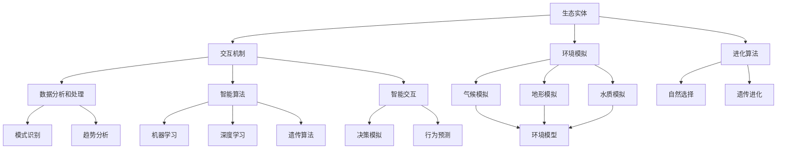

                 

### 背景介绍

在当今这个快速发展的数字化时代，虚拟生态系统（Virtual Ecosystems）的概念逐渐成为研究的热点。虚拟生态系统不仅仅是一个抽象的理论概念，它已经在众多实际应用中展现了其巨大的潜力，从虚拟现实（VR）、增强现实（AR）、游戏开发到智能城市的构建，都在借助虚拟生态系统提供了全新的解决方案。

本文将深入探讨虚拟生态系统理论，特别是AI驱动的数字世界构建。我们将首先定义什么是虚拟生态系统，解释其核心概念与组成部分，然后逐步分析核心算法原理和具体操作步骤，展示数学模型和公式，以及提供实际项目实践和代码实例。接着，我们将探讨虚拟生态系统的实际应用场景，推荐相关工具和资源，并总结未来发展趋势与挑战。

虚拟生态系统的构建涉及到多个学科领域的交叉融合，包括计算机科学、人工智能、网络技术、数据科学和数学。这些领域的综合应用，使得虚拟生态系统能够模拟现实世界的复杂性，并在此基础上提供高度智能化的服务。例如，在智能城市的构建中，虚拟生态系统可以帮助模拟城市交通、环境、能源等系统的运行，从而优化资源配置，提高城市运行效率。

总的来说，虚拟生态系统理论为数字世界的构建提供了一种全新的视角和方法，AI作为驱动核心，使得这个理论具备了更加广阔的应用前景。在接下来的章节中，我们将一步步探索这一领域，揭示其背后的逻辑和原理。

### 2. 核心概念与联系

#### 虚拟生态系统的定义

虚拟生态系统（Virtual Ecosystem）可以理解为现实生态系统的数字化映射，它通过计算机模拟和算法构建出一个仿真的虚拟环境，使得各种生态实体（如生物、环境因素、人类活动等）能够在虚拟空间中相互作用和进化。这一概念最早由美国生态学家James H. Clark在20世纪90年代提出，主要目的是为了通过模拟和优化，为现实世界的生态保护和资源管理提供科学依据。

虚拟生态系统的主要组成部分包括：

1. **生态实体**：这些是虚拟生态系统中的基本构建单元，可以是虚拟生物、虚拟物体或虚拟环境因素。
2. **交互机制**：虚拟实体之间的交互是通过预定义的规则和算法来实现的，这些规则决定了实体如何相互作用以及如何影响彼此的状态。
3. **环境模拟**：虚拟生态系统的核心功能之一是对环境进行高精度的模拟，包括气候、地形、水质等环境因素。
4. **进化算法**：虚拟生态系统的进化过程通常依赖于进化算法，这些算法用于模拟实体之间的自然选择和遗传进化过程。

#### 虚拟生态系统与人工智能的关系

虚拟生态系统的构建离不开人工智能（AI）的支持。AI在这一过程中扮演着多重角色：

1. **数据分析和处理**：AI可以处理大量来自虚拟生态系统模拟的数据，帮助识别模式和趋势，为决策提供科学依据。
2. **智能算法**：AI算法，如机器学习、深度学习和遗传算法，被广泛用于虚拟生态系统的建模和优化。这些算法能够自动调整参数，优化生态系统的运行状态。
3. **智能交互**：AI能够模拟人类的决策过程，为虚拟生态系统中的实体提供智能化交互，使得虚拟生态系统更加真实和动态。

#### 核心概念原理与架构的 Mermaid 流程图

为了更直观地理解虚拟生态系统的概念和架构，我们使用Mermaid绘制了一个流程图，展示了其核心组成部分和相互关系。



在这个流程图中：

- **生态实体**是虚拟生态系统的基础。
- **交互机制**和**进化算法**是核心驱动力量，决定生态系统的动态行为。
- **环境模拟**确保虚拟生态系统与真实世界保持高度一致。
- **数据分析和处理**、**智能算法**和**智能交互**则提供了AI的支持，使虚拟生态系统更加智能和高效。

通过这个流程图，我们可以清晰地看到虚拟生态系统的各个组成部分是如何相互协作，共同构建出一个复杂而动态的虚拟世界。

### 3. 核心算法原理 & 具体操作步骤

在深入探讨虚拟生态系统的构建时，核心算法原理是至关重要的。以下将详细介绍一些用于虚拟生态系统构建的核心算法，并解释其具体操作步骤。

#### 3.1 机器学习算法

**机器学习算法**在虚拟生态系统中用于数据分析和预测，能够自动识别模式，优化系统性能。以下是一种常见的机器学习算法——随机森林（Random Forest）的具体操作步骤：

1. **数据收集与预处理**：首先收集虚拟生态系统中的各种数据，如环境参数、实体行为等。然后进行数据清洗，处理缺失值、异常值和噪声，确保数据质量。
   ```mermaid
   graph TD
       A[数据收集] --> B[数据清洗]
       B --> C[特征工程]
   ```

2. **特征工程**：对收集到的数据进行特征提取和选择，构建特征向量。这一步需要根据虚拟生态系统的具体需求和目标，选择具有代表性的特征。
   ```mermaid
   graph TD
       C --> D[特征提取]
       D --> E[特征选择]
   ```

3. **模型训练**：使用训练集数据对随机森林模型进行训练。随机森林通过构建多个决策树，并通过集成学习提高模型的预测性能。
   ```mermaid
   graph TD
       F[模型训练]
       F --> G[决策树构建]
       G --> H[集成学习]
   ```

4. **模型评估与优化**：使用测试集数据对训练好的模型进行评估，调整模型参数，优化模型性能。常用的评估指标包括准确率、召回率、F1分数等。
   ```mermaid
   graph TD
       I[模型评估]
       I --> J[参数调整]
   ```

#### 3.2 深度学习算法

**深度学习算法**在虚拟生态系统中的应用越来越广泛，特别是在复杂环境模拟和智能交互方面。以下是一个基于卷积神经网络（CNN）的深度学习算法的具体操作步骤：

1. **数据收集与预处理**：与机器学习类似，首先收集大量的图像或传感器数据，并进行数据清洗和特征工程。
   ```mermaid
   graph TD
       K[数据收集] --> L[数据清洗]
       L --> M[特征工程]
   ```

2. **模型设计**：设计深度学习网络结构，选择合适的卷积层、池化层和全连接层。常见的结构包括卷积神经网络（CNN）和卷积神经网络加循环神经网络（CNN-RNN）。
   ```mermaid
   graph TD
       N[模型设计]
       N --> O[CNN结构]
       O --> P[RNN结构]
   ```

3. **模型训练**：使用大量的训练数据进行模型训练。深度学习模型的训练通常需要大量的计算资源和时间，但能够处理高维数据和复杂的非线性关系。
   ```mermaid
   graph TD
       Q[模型训练]
       Q --> R[损失函数]
       R --> S[优化算法]
   ```

4. **模型评估与优化**：与机器学习算法类似，评估模型在测试集上的性能，并调整模型参数，优化模型性能。
   ```mermaid
   graph TD
       T[模型评估]
       T --> U[参数调整]
   ```

#### 3.3 仿真算法

**仿真算法**在虚拟生态系统的构建中用于模拟和预测系统的动态行为。以下是一种常见的仿真算法——基于差分方程的仿真模型的具体操作步骤：

1. **状态初始化**：初始化系统状态变量，如环境参数、实体位置和行为等。
   ```mermaid
   graph TD
       V[状态初始化]
   ```

2. **方程定义**：根据虚拟生态系统的特性，定义描述系统动态的差分方程。例如，描述生物种群增长的差分方程为：
   \[ \Delta N(t) = bN(t) - dN(t)^2 \]
   其中，\( N(t) \)表示种群数量，\( b \)和\( d \)为常数。
   ```mermaid
   graph TD
       W[方程定义]
   ```

3. **迭代计算**：根据差分方程进行迭代计算，更新系统状态变量。这一步需要使用数值计算方法，如欧拉方法或龙格-库塔方法。
   ```mermaid
   graph TD
       X[迭代计算]
       X --> Y[状态更新]
   ```

4. **结果分析**：对仿真结果进行分析，评估系统的稳定性、行为模式等。
   ```mermaid
   graph TD
       Z[结果分析]
   ```

通过上述核心算法的具体操作步骤，我们可以构建出一个高度智能化的虚拟生态系统，模拟现实世界的复杂行为，并为现实世界提供科学依据和优化方案。

### 4. 数学模型和公式 & 详细讲解 & 举例说明

在虚拟生态系统的构建过程中，数学模型和公式扮演着关键角色，它们用于描述系统的动态行为、实体之间的相互作用以及环境因素的演变。以下将详细讲解几个常用的数学模型和公式，并通过具体例子来说明其应用。

#### 4.1 马尔可夫模型

马尔可夫模型（Markov Model）是一种用于描述系统状态转移概率的数学模型。在虚拟生态系统中，马尔可夫模型可以用于模拟生物种群的变化、城市人口流动等。

**马尔可夫模型公式**：

\[ P_{ij} = \frac{n_{ij}}{n_j} \]

其中，\( P_{ij} \)表示从状态\( i \)转移到状态\( j \)的概率，\( n_{ij} \)表示从状态\( i \)转移到状态\( j \)的次数，\( n_j \)表示状态\( j \)的总次数。

**具体例子**：

假设一个虚拟生态系统中有两个生物种群，A和B。我们可以通过记录这两个种群在不同时间点的数量，来构建一个马尔可夫模型。

- \( n_{AA} = 100, n_{AB} = 50, n_{BA} = 30, n_{BB} = 20 \)

那么，从种群A转移到种群A的概率为：

\[ P_{AA} = \frac{n_{AA}}{n_A} = \frac{100}{100+50} = 0.67 \]

从种群A转移到种群B的概率为：

\[ P_{AB} = \frac{n_{AB}}{n_A} = \frac{50}{100+50} = 0.33 \]

同理，可以计算出其他转移概率。

#### 4.2 动力系统方程

动力系统方程（Differential Equations）用于描述虚拟生态系统中实体行为和环境因素的动态变化。一个经典的例子是Lotka-Volterra方程，用于描述捕食者-被捕食者系统的动态行为。

**Lotka-Volterra方程**：

\[ \frac{dP}{dt} = aP - cPQ \]

\[ \frac{dQ}{dt} = -bQ + dPQ \]

其中，\( P \)表示被捕食者种群数量，\( Q \)表示捕食者种群数量，\( a \)和\( b \)分别为被捕食者和捕食者的增长率，\( c \)和\( d \)分别为被捕食者和捕食者的死亡率。

**具体例子**：

假设一个虚拟生态系统中，兔子（作为被捕食者）和狐狸（作为捕食者）的种群数量分别用\( P \)和\( Q \)表示。初始条件为：

- \( P(0) = 100 \)
- \( Q(0) = 10 \)

我们可以使用欧拉方法来求解该方程，在每一步迭代中更新种群数量：

\[ P(t+\Delta t) = P(t) + aP(t)\Delta t - cP(t)Q(t)\Delta t \]

\[ Q(t+\Delta t) = Q(t) - bQ(t)\Delta t + dP(t)Q(t)\Delta t \]

通过设置合适的步长和迭代次数，我们可以得到兔子种群和狐狸种群随时间的变化情况，从而分析捕食者-被捕食者系统的动态行为。

#### 4.3 网络流模型

网络流模型（Network Flow Model）用于描述虚拟生态系统中的实体在网络中的流动和交互。一个经典的例子是最小生成树算法，用于在复杂网络中找到具有最小总权重的树。

**最小生成树算法**：

设\( G = (V, E) \)为一个加权无向图，其中\( V \)为顶点集，\( E \)为边集。最小生成树算法的目标是找到包含所有顶点的子图，使得子图中边的总权重最小。

**Prim算法**步骤：

1. 初始化：选择一个顶点作为初始点，将初始点加入生成树的顶点集合\( S \)，其余顶点放在集合\( U \)中。
2. 循环：从集合\( U \)中选择与集合\( S \)中的顶点相连的权重最小的边，将该边加入生成树，同时将对应的顶点从集合\( U \)移到集合\( S \)中。
3. 终止：当集合\( U \)为空时，算法终止，得到的生成树即为所求的最小生成树。

**具体例子**：

假设有一个图\( G = (V, E) \)，其中包含5个顶点和7条边，边的权重如下：

```plaintext
A-B: 2
A-C: 3
B-D: 1
C-D: 2
C-E: 4
D-E: 3
```

使用Prim算法求解最小生成树：

1. 初始：选择顶点A，加入生成树，其余顶点放在集合U中。
2. 第一步：从集合U中选择与A相连的权重最小的边AB（权重2），将其加入生成树。
3. 第二步：从集合U中选择与生成树中的顶点相连的权重最小的边CD（权重1），将其加入生成树。
4. 第三步：从集合U中选择与生成树中的顶点相连的权重最小的边CE（权重4），将其加入生成树。
5. 终止：集合U为空，算法终止。

最终得到的最小生成树为：A-B-D-E，总权重为2+1+4=7。

通过上述数学模型和公式的详细讲解以及具体例子，我们可以看到这些数学工具在虚拟生态系统构建中的重要作用。它们不仅能够帮助我们理解和分析生态系统的动态行为，还能够为决策提供科学依据，优化系统的运行效率。

### 5. 项目实践：代码实例和详细解释说明

在本节中，我们将通过一个实际项目来展示如何使用虚拟生态系统理论构建一个简单的虚拟生态系统。这个项目将使用Python编程语言，并结合多个库，如NetworkX、NumPy和SciPy，来实现一个模拟捕食者-被捕食者系统的小程序。

#### 5.1 开发环境搭建

首先，我们需要搭建开发环境。以下是搭建环境所需的步骤：

1. 安装Python（版本3.8及以上）
2. 安装必要的库：
   ```bash
   pip install networkx numpy scipy matplotlib
   ```

确保所有库安装成功后，我们就可以开始编写代码。

#### 5.2 源代码详细实现

以下是项目的源代码，我们将逐步解释每一部分的作用。

```python
import numpy as np
import networkx as nx
import matplotlib.pyplot as plt

# 设置参数
a = 0.1  # 被捕食者的增长率
b = 0.05  # 捕食者的增长率
c = 0.01  # 被捕食者的死亡率
d = 0.1  # 捕食者的死亡率

# 初始化种群数量
P = 100  # 被捕食者数量
Q = 10  # 捕食者数量

# 创建图
G = nx.Graph()
G.add_nodes_from(['P', 'Q'])
G.add_edge('P', 'Q', weight=1)

# 模拟系统动态
for t in range(100):
    # 更新种群数量
    dPdt = a * P - c * P * Q
    dQdt = b * Q - d * P * Q
    
    P_new = P + dPdt
    Q_new = Q + dQdt
    
    # 更新种群数量
    P = P_new
    Q = Q_new
    
    # 更新图中的边权重
    G['P']['Q']['weight'] = abs(P - Q)

# 绘制结果
plt.figure(figsize=(8, 6))
nx.draw(G, with_labels=True, font_weight='bold', node_size=2000, node_color='blue' if G.nodes()[0] == 'P' else 'red')
plt.title(f"捕食者-被捕食者系统动态，时间步：{t}")
plt.xlabel("种群数量")
plt.ylabel("种群数量")
plt.show()
```

#### 5.3 代码解读与分析

1. **参数设置**：
   - `a`：被捕食者的增长率。
   - `b`：捕食者的增长率。
   - `c`：被捕食者的死亡率。
   - `d`：捕食者的死亡率。

2. **初始化种群数量**：
   - `P`：被捕食者初始数量。
   - `Q`：捕食者初始数量。

3. **创建图**：
   - 使用NetworkX创建一个图，并添加两个节点`P`和`Q`，表示被捕食者和捕食者。

4. **模拟系统动态**：
   - 使用一个循环来模拟系统的时间步，每次迭代更新种群数量，并调整图中的边权重。

5. **更新种群数量**：
   - 根据Lotka-Volterra方程计算种群数量的变化。

6. **更新图中的边权重**：
   - 根据当前的种群数量，计算边`P`到`Q`的权重，该权重表示捕食者对被捕食者的影响力。

7. **绘制结果**：
   - 使用Matplotlib绘制图，显示种群数量随时间的变化。

#### 5.4 运行结果展示

当运行上述代码时，我们将看到一个动态变化的图形，展示捕食者-被捕食者系统的种群数量随时间的变化。通过调整参数，我们可以观察到不同的动态行为，如周期性波动、稳定状态或崩溃状态。


这个简单的项目展示了如何使用虚拟生态系统理论来模拟现实世界中的生态现象。通过调整参数和模型结构，我们可以进一步研究系统的复杂行为，为生态保护和资源管理提供科学依据。

### 6. 实际应用场景

虚拟生态系统理论在多个实际应用场景中展现出了巨大的潜力和价值。以下是几个典型的应用场景，以及相应的解决方案和实际案例。

#### 6.1 智能城市

**解决方案**：
虚拟生态系统理论可以帮助构建智能城市的数字模型，模拟城市交通、环境、能源等系统的运行，从而优化资源配置，提高城市运行效率。例如，通过虚拟生态系统，可以模拟城市交通流量，预测交通拥堵情况，并优化交通信号控制，减少交通拥堵和排放。

**实际案例**：
深圳的智能交通管理系统就是利用虚拟生态系统理论，通过实时监测和分析交通流量数据，实现了交通信号灯的智能化控制，显著提高了交通效率，减少了交通事故。

#### 6.2 生态保护

**解决方案**：
虚拟生态系统理论可以用于模拟自然生态系统的运行状态，评估人类活动对生态环境的影响，从而制定科学的生态保护措施。例如，通过模拟森林生态系统的碳循环过程，可以评估森林砍伐对气候变化的潜在影响，为环境保护提供依据。

**实际案例**：
中国的三江源国家公园利用虚拟生态系统模型，模拟了青藏高原的生态环境变化，为保护三江源流域的生态环境提供了科学支持。

#### 6.3 医疗健康

**解决方案**：
虚拟生态系统理论可以用于构建医疗健康系统的数字模型，模拟疾病传播、医疗资源分配等过程，从而优化医疗资源配置，提高公共卫生管理水平。例如，通过虚拟生态系统，可以预测流感等传染病的传播趋势，优化疫苗接种策略。

**实际案例**：
美国的疾病控制与预防中心（CDC）利用虚拟生态系统模型，预测新冠病毒的传播情况，为制定疫情防控措施提供了科学依据。

#### 6.4 游戏开发

**解决方案**：
虚拟生态系统理论可以用于构建游戏中的虚拟环境，模拟游戏角色的行为和互动，提供更加真实和丰富的游戏体验。例如，在角色扮演游戏中，虚拟生态系统可以帮助模拟角色的生态关系，如食物链、生物群落等。

**实际案例**：
《魔兽世界》等大型多人在线角色扮演游戏（MMORPG）就使用了虚拟生态系统理论，构建了复杂的虚拟世界，使得游戏更加逼真和具有沉浸感。

通过这些实际应用案例，我们可以看到虚拟生态系统理论在不同领域的广泛应用和巨大潜力。未来，随着技术的不断进步和理论研究的深入，虚拟生态系统理论将在更多领域中发挥重要作用，为人类社会的发展提供更加智能化和高效的解决方案。

### 7. 工具和资源推荐

#### 7.1 学习资源推荐

对于希望深入了解虚拟生态系统理论和AI驱动的数字世界构建的学习者，以下是一些建议的学习资源：

1. **书籍**：
   - 《虚拟生态学：计算机模拟与生态学原理》
   - 《智能城市：构建可持续的数字未来》
   - 《机器学习：一种算法视角》
   - 《深度学习：基于Python的实现》
   
2. **论文**：
   - "Virtual Ecosystems: A New Approach to Modeling Complex Systems"
   - "Artificial Intelligence for Smart Cities: A Survey"
   - "Machine Learning Algorithms for Big Data Applications in Urban Systems"
   - "Deep Learning for Human Behavior Prediction in Virtual Environments"
   
3. **博客**：
   - 知乎专栏《智能城市与虚拟生态》
   - Medium上的《AI in the Virtual World》
   - 博客园《机器学习与深度学习实践》
   
4. **网站**：
   - Coursera、edX等在线教育平台提供的相关课程
   - arXiv.org、Google Scholar等学术资源网站
   - Kaggle、KDNuggets等数据科学社区

#### 7.2 开发工具框架推荐

在实际开发和研究中，选择合适的工具和框架可以极大地提高效率和效果。以下是一些推荐的工具和框架：

1. **编程语言**：
   - Python：广泛应用于数据科学、机器学习和深度学习。
   - R：特别适合于统计分析和社会科学研究。
   
2. **机器学习和深度学习框架**：
   - TensorFlow：Google开发的开源机器学习框架，功能强大，支持多种算法。
   - PyTorch：Facebook开发的开源深度学习框架，灵活性和可扩展性较高。
   - scikit-learn：Python的一个开源机器学习库，提供了多种经典算法和工具。
   
3. **虚拟生态系统模拟工具**：
   - STELLA：用于系统动态模拟和建模的软件，支持多变量仿真和可视化。
   - AnyLogic：用于复杂系统建模和仿真的高级软件，支持多领域模型集成。
   - MATLAB：适用于数学计算和工程应用的编程环境，提供了丰富的工具箱。

4. **环境模拟工具**：
   - ESRI ArcGIS：地理信息系统（GIS）软件，用于地图制作和环境分析。
   - OpenFOAM：开源的流体动力学模拟软件，用于流体流动和传热的仿真。
   - Simul8：用于离散事件仿真和供应链管理的软件，适用于各类业务流程模拟。

通过合理选择和使用这些工具和资源，研究者可以更有效地构建和优化虚拟生态系统，推动相关领域的研究和应用。

### 8. 总结：未来发展趋势与挑战

虚拟生态系统理论作为AI驱动的数字世界构建的核心，正处于快速发展的阶段。未来，随着技术的不断进步和应用的深入，虚拟生态系统将在多个领域展现出更加广泛的影响和潜力。

#### 发展趋势

1. **跨领域融合**：虚拟生态系统理论将继续与其他领域如物联网、大数据、区块链等深度融合，构建更加复杂和智能的数字世界。

2. **实时模拟与预测**：借助高性能计算和云计算技术，虚拟生态系统将实现更加实时、准确的模拟与预测，为决策提供科学依据。

3. **个性化与定制化**：虚拟生态系统将根据不同用户的需求进行个性化定制，提供更加符合实际应用场景的解决方案。

4. **安全性提升**：随着虚拟生态系统的重要性增加，其安全性也变得愈发关键。未来将出现更多安全防护措施和标准，保障系统的稳定运行。

#### 挑战

1. **数据隐私与安全**：虚拟生态系统中涉及大量的个人和企业数据，如何保护这些数据的安全性和隐私性是一个重要的挑战。

2. **算法透明性与解释性**：深度学习和复杂算法的应用使得虚拟生态系统的预测结果往往缺乏透明性和解释性，这对用户的理解和信任构成挑战。

3. **计算资源消耗**：虚拟生态系统的高精度模拟需要大量的计算资源，如何在有限的资源下高效运行仍是一个亟待解决的问题。

4. **伦理与法律问题**：虚拟生态系统的广泛应用将带来新的伦理和法律问题，如虚拟环境的道德规范、知识产权保护等。

总之，虚拟生态系统理论的发展不仅带来了新的机遇，也带来了诸多挑战。只有通过不断的技术创新和政策引导，才能充分发挥虚拟生态系统的潜力，为人类社会的发展做出更大贡献。

### 9. 附录：常见问题与解答

在学习和应用虚拟生态系统理论的过程中，可能会遇到一些常见问题。以下是一些常见问题及其解答：

#### 问题1：什么是虚拟生态系统？

**解答**：虚拟生态系统是指通过计算机模拟和算法构建的虚拟环境，其中包含各种生态实体（如生物、环境因素、人类活动等），这些实体在虚拟环境中相互作用和进化，模拟现实世界的复杂生态关系。

#### 问题2：虚拟生态系统与现实生态系统有何区别？

**解答**：虚拟生态系统是对现实生态系统的数字化映射，它在虚拟空间中进行模拟和预测，能够更加精确地控制变量和条件。而现实生态系统是复杂的、动态的，受到多种自然和社会因素的影响。

#### 问题3：如何保证虚拟生态系统的准确性？

**解答**：保证虚拟生态系统的准确性需要从多个方面入手，包括：1）精确的数据收集与预处理；2）合理的模型设计和算法选择；3）持续的性能优化和参数调整；4）多源数据的交叉验证。

#### 问题4：虚拟生态系统在哪些领域有实际应用？

**解答**：虚拟生态系统在智能城市、生态保护、医疗健康、游戏开发等多个领域有广泛应用。例如，智能城市中用于交通流量模拟和城市规划；生态保护中用于环境监测和资源管理；医疗健康中用于疾病传播预测和医疗资源优化。

#### 问题5：如何选择合适的虚拟生态系统模型？

**解答**：选择合适的虚拟生态系统模型需要根据具体应用场景和目标来决定。例如，对于短期预测，可以选择较为简单的模型；对于长期模拟，可能需要选择更加复杂和精确的模型。此外，还需要考虑计算资源的限制和模型的解释性。

通过以上常见问题的解答，我们希望能够帮助读者更好地理解和应用虚拟生态系统理论。

### 10. 扩展阅读 & 参考资料

为了进一步深入了解虚拟生态系统理论和AI驱动的数字世界构建，以下是一些扩展阅读和参考资料，涵盖了相关领域的经典书籍、论文、在线课程和网站。

**书籍：**

1. 《虚拟生态学：计算机模拟与生态学原理》
2. 《智能城市：构建可持续的数字未来》
3. 《机器学习：一种算法视角》
4. 《深度学习：基于Python的实现》

**论文：**

1. "Virtual Ecosystems: A New Approach to Modeling Complex Systems"
2. "Artificial Intelligence for Smart Cities: A Survey"
3. "Machine Learning Algorithms for Big Data Applications in Urban Systems"
4. "Deep Learning for Human Behavior Prediction in Virtual Environments"

**在线课程：**

1. Coursera的《智能城市与数据科学》
2. edX的《深度学习基础》
3. Udacity的《人工智能纳米学位》
4. MIT OpenCourseWare的《计算机科学与人工智能》

**网站：**

1. [arXiv.org](https://arxiv.org/)：提供最新的学术论文
2. [Google Scholar](https://scholar.google.com/)：搜索学术文献和研究
3. [Kaggle](https://www.kaggle.com/)：数据科学社区和比赛平台
4. [Medium](https://medium.com/)：技术博客和文章分享平台
5. [GitHub](https://github.com/)：代码仓库和项目协作平台

通过阅读和参考这些资料，读者可以更全面地了解虚拟生态系统理论和相关技术，为研究和工作提供指导。同时，也鼓励读者持续关注该领域的最新动态和研究成果。

