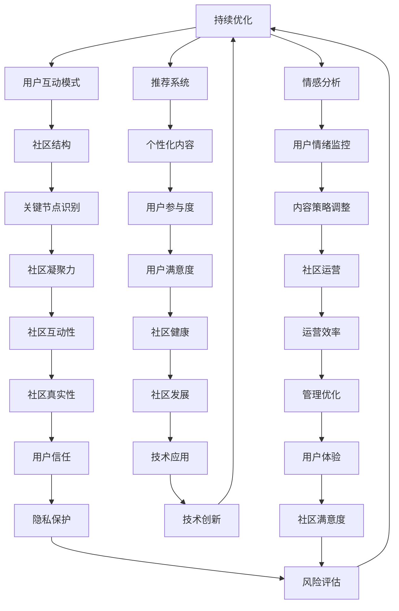

                 

### 背景介绍

虚拟社区作为一种新兴的社交形式，正日益成为人们日常生活中不可或缺的一部分。随着互联网技术的飞速发展，尤其是在人工智能（AI）技术的推动下，虚拟社区的发展迎来了新的机遇和挑战。AI驱动的虚拟社区不仅提高了用户之间的互动性和参与度，还极大地丰富了社区的内容和形式。

首先，我们需要了解什么是虚拟社区。虚拟社区是指通过互联网技术构建的一个在线社交环境，用户可以在其中进行交流、分享信息和资源。这些社区可以是兴趣小组、行业论坛、在线游戏世界等多种形式。虚拟社区的核心在于其成员之间的相互连接和互动，形成一种共同的归属感和认同感。

人工智能在虚拟社区中的作用不可忽视。AI技术可以通过数据分析和机器学习，对用户行为进行深入挖掘，从而提供个性化的内容和推荐。例如，AI可以帮助社区管理者了解用户的兴趣偏好，进而推送相关的话题和活动，增加用户的参与感和满意度。此外，AI还可以自动处理大量的用户评论和反馈，筛选出有价值的信息，提高社区的运营效率。

然而，AI驱动的虚拟社区也面临一些挑战。首先，隐私保护和数据安全是核心问题。虚拟社区中大量的用户数据涉及个人隐私，如何确保这些数据的安全性和隐私性，是社区运营者必须面对的挑战。其次，社区中的互动性和真实性也需要平衡。虽然AI可以提升社区的互动性，但如果过度依赖AI，可能会降低用户之间的真实互动，影响社区的凝聚力。

总之，虚拟社区的发展离不开人工智能技术的支持。AI不仅为社区带来了新的发展机遇，也带来了新的挑战。在未来的发展中，如何合理利用AI技术，提高虚拟社区的用户体验，将是关键所在。

### 核心概念与联系

要深入探讨虚拟社区和人工智能之间的关系，我们首先需要了解一些核心概念和它们之间的联系。这些概念包括社交网络分析、推荐系统、情感分析以及虚拟现实（VR）技术。

#### 社交网络分析

社交网络分析是理解虚拟社区结构的重要工具。通过分析用户在网络中的连接关系，可以揭示社区内部的群体结构、关系强度以及信息传播路径。这种分析不仅有助于了解社区成员之间的互动模式，还能识别出社区中的关键节点，如意见领袖和活跃分子。社交网络分析通常使用图论算法和矩阵运算，如度中心性、接近中心性和中介中心性等指标来评估用户在网络中的影响力。

#### 推荐系统

推荐系统是AI在虚拟社区中应用的重要领域。通过分析用户的历史行为和偏好，推荐系统可以为用户提供个性化内容推荐，如新闻、商品、话题等。推荐系统的基础算法包括协同过滤、内容匹配和混合推荐等。协同过滤算法通过用户之间的相似性来推荐内容，而内容匹配则依赖于内容特征的分析。在虚拟社区中，推荐系统可以帮助用户发现感兴趣的内容和活动，增加社区的粘性和用户参与度。

#### 情感分析

情感分析是自然语言处理（NLP）的一个重要分支，它通过分析文本中的情感倾向和情感强度，可以了解用户的情绪状态和态度。在虚拟社区中，情感分析可以用来监控用户情绪，识别负面情绪的来源，并采取相应的措施。例如，通过分析用户评论和帖子，社区管理者可以发现用户对特定话题或事件的情感反应，从而调整内容策略，提升用户满意度。

#### 虚拟现实技术

虚拟现实（VR）技术为虚拟社区提供了更加沉浸式的体验。通过VR设备，用户可以在虚拟环境中与他人互动，参与各种活动。VR技术不仅增强了用户的参与感和归属感，还能创造出更加丰富和多样化的社区场景。例如，VR社区可以模拟现实世界中的各种场景，如咖啡馆、博物馆、音乐会等，让用户在虚拟世界中享受真实的社交体验。

#### Mermaid 流程图

下面是一个简化的Mermaid流程图，展示了这些核心概念和它们在虚拟社区中的应用关系：



通过这个流程图，我们可以清晰地看到社交网络分析、推荐系统、情感分析和VR技术等核心概念在虚拟社区中的相互关系和作用。这些概念不仅独立运作，还通过相互作用形成一个整体，共同推动虚拟社区的发展和优化。

### 核心算法原理 & 具体操作步骤

在深入了解虚拟社区中人工智能的核心算法原理和具体操作步骤之前，我们需要明确几个关键算法的基本概念，包括协同过滤、情感分析和深度学习。

#### 协同过滤算法

协同过滤（Collaborative Filtering）是推荐系统中最常用的算法之一。它通过分析用户之间的相似度，预测用户可能感兴趣的项目。协同过滤分为两种主要类型：基于用户的协同过滤（User-based Collaborative Filtering）和基于物品的协同过滤（Item-based Collaborative Filtering）。

- **基于用户的协同过滤**：找到与目标用户兴趣相似的活跃用户，推荐这些用户喜欢的项目。具体步骤如下：
  1. 计算用户之间的相似度，通常使用余弦相似度或皮尔逊相关系数。
  2. 根据相似度排序，选择与目标用户最相似的K个用户。
  3. 推荐这K个用户共同喜欢的项目。

- **基于物品的协同过滤**：找到与目标物品相似的物品，推荐给感兴趣的用户。具体步骤如下：
  1. 计算物品之间的相似度，通常使用余弦相似度或Jaccard相似度。
  2. 根据相似度排序，选择与目标物品最相似的K个物品。
  3. 推荐这些相似物品给目标用户。

#### 情感分析

情感分析（Sentiment Analysis）是自然语言处理（NLP）的一部分，用于确定文本的情感倾向，即文本表达的情感是积极、消极还是中性。情感分析通常包括以下步骤：

1. **文本预处理**：包括去除停用词、标点符号、进行词性标注等，以提高分析准确性。
2. **特征提取**：将预处理后的文本转换为计算机可以处理的形式，如词袋模型、TF-IDF或词嵌入。
3. **情感分类**：使用分类算法（如朴素贝叶斯、支持向量机、神经网络）对特征进行分类，判断文本的情感倾向。

#### 深度学习

深度学习是近年来人工智能领域的重要突破，尤其在图像识别、语音识别和自然语言处理等方面表现出强大的能力。在虚拟社区中，深度学习可以通过以下步骤应用于情感分析和推荐系统：

1. **数据收集**：收集大量的用户行为数据和情感标注数据。
2. **数据预处理**：包括数据清洗、数据归一化、数据分割等。
3. **模型构建**：使用深度学习框架（如TensorFlow、PyTorch）构建模型，如卷积神经网络（CNN）或循环神经网络（RNN）。
4. **模型训练**：通过反向传播算法训练模型，使其能够准确预测用户行为和情感。
5. **模型评估**：使用交叉验证、混淆矩阵、准确率等指标评估模型性能。
6. **模型部署**：将训练好的模型部署到生产环境中，实现实时分析和推荐。

#### 具体操作步骤示例

下面以一个虚拟社区中的应用为例，展示如何使用上述算法进行用户情感分析和内容推荐：

1. **数据收集与预处理**：
   - 收集用户在社区中的行为数据，如帖子、评论、点赞等。
   - 对文本数据预处理，去除停用词和标点符号，进行词性标注。

2. **情感分析**：
   - 使用自然语言处理技术对文本进行情感分类，确定用户的情感倾向。
   - 情感分类模型可以使用基于深度学习的文本分类模型，如BERT或GPT。

3. **推荐系统**：
   - 使用基于用户的协同过滤算法，找到与目标用户兴趣相似的其他用户。
   - 推荐这些用户在社区中喜欢的帖子或话题，作为目标用户的潜在兴趣点。

4. **模型训练与评估**：
   - 使用收集到的用户行为数据和情感标注数据，训练推荐系统和情感分析模型。
   - 通过交叉验证和混淆矩阵评估模型性能，调整模型参数。

5. **模型部署与实时推荐**：
   - 将训练好的模型部署到生产环境，实现用户情感分析和内容推荐的实时功能。
   - 根据用户的情感状态和行为，动态调整推荐内容，提高用户满意度。

通过上述步骤，我们可以构建一个AI驱动的虚拟社区，实现用户情感分析和个性化内容推荐，从而提升社区的用户体验和参与度。

### 数学模型和公式 & 详细讲解 & 举例说明

在虚拟社区中，数学模型和公式是理解和分析数据的重要工具。以下将详细介绍几个关键模型和公式，并给出详细的讲解和具体例子。

#### 1. 余弦相似度

余弦相似度是一种用于计算两个向量之间相似度的方法，通常用于推荐系统和社交网络分析。其公式如下：

\[ \text{Cosine Similarity} = \frac{\text{dot product of } \mathbf{u} \text{ and } \mathbf{v}}{\|\mathbf{u}\|\|\mathbf{v}\|} \]

其中，\( \mathbf{u} \) 和 \( \mathbf{v} \) 是两个向量，\( \|\mathbf{u}\| \) 和 \( \|\mathbf{v}\| \) 分别是它们的欧几里得范数，即：

\[ \|\mathbf{u}\| = \sqrt{\sum_{i=1}^{n} u_i^2} \]
\[ \|\mathbf{v}\| = \sqrt{\sum_{i=1}^{n} v_i^2} \]

**例子**：

假设有两个用户 \( A \) 和 \( B \) 的兴趣向量如下：

\[ \mathbf{u} = [3, 1, 4, 1, 5] \]
\[ \mathbf{v} = [4, 1, 5, 9, 1] \]

计算它们的余弦相似度：

\[ \text{Cosine Similarity} = \frac{3 \cdot 4 + 1 \cdot 1 + 4 \cdot 5 + 1 \cdot 9 + 5 \cdot 1}{\sqrt{3^2 + 1^2 + 4^2 + 1^2 + 5^2} \cdot \sqrt{4^2 + 1^2 + 5^2 + 9^2 + 1^2}} \]
\[ = \frac{12 + 1 + 20 + 9 + 5}{\sqrt{35} \cdot \sqrt{106}} \]
\[ = \frac{47}{\sqrt{35 \cdot 106}} \]
\[ \approx 0.908 \]

#### 2. 皮尔逊相关系数

皮尔逊相关系数是另一种用于评估两个变量之间线性相关性的方法。其公式如下：

\[ \text{Pearson Correlation Coefficient} = \rho = \frac{\sum_{i=1}^{n}(x_i - \overline{x})(y_i - \overline{y})}{\sqrt{\sum_{i=1}^{n}(x_i - \overline{x})^2} \cdot \sqrt{\sum_{i=1}^{n}(y_i - \overline{y})^2}} \]

其中，\( x_i \) 和 \( y_i \) 分别是两个变量的观测值，\( \overline{x} \) 和 \( \overline{y} \) 分别是它们的平均值。

**例子**：

假设有两个变量 \( X \) 和 \( Y \) 的观测值如下：

\[ X: 1, 2, 3, 4, 5 \]
\[ Y: 2, 4, 5, 4, 5 \]

计算它们的皮尔逊相关系数：

\[ \overline{x} = \frac{1 + 2 + 3 + 4 + 5}{5} = 3 \]
\[ \overline{y} = \frac{2 + 4 + 5 + 4 + 5}{5} = 4 \]

\[ \rho = \frac{(1 - 3)(2 - 4) + (2 - 3)(4 - 4) + (3 - 3)(5 - 4) + (4 - 3)(4 - 4) + (5 - 3)(5 - 4)}{\sqrt{(1 - 3)^2 + (2 - 3)^2 + (3 - 3)^2 + (4 - 3)^2 + (5 - 3)^2} \cdot \sqrt{(2 - 4)^2 + (4 - 4)^2 + (5 - 4)^2 + (4 - 4)^2 + (5 - 4)^2}} \]

\[ = \frac{(-2)(-2) + (-1)(0) + (0)(1) + (1)(0) + (2)(1)}{\sqrt{4 + 1 + 0 + 1 + 4} \cdot \sqrt{4 + 0 + 1 + 0 + 1}} \]

\[ = \frac{4 + 0 + 0 + 0 + 2}{\sqrt{10} \cdot \sqrt{6}} \]

\[ = \frac{6}{\sqrt{60}} \]

\[ \approx 0.816 \]

#### 3. 朴素贝叶斯分类器

朴素贝叶斯分类器是一种基于贝叶斯定理的简单概率分类器，假设特征之间是相互独立的。其公式如下：

\[ P(\text{Class} = c | \mathbf{x}) = \frac{P(\mathbf{x} | \text{Class} = c)P(\text{Class} = c)}{P(\mathbf{x})} \]

其中，\( \mathbf{x} \) 是特征向量，\( c \) 是类别标签，\( P(\cdot) \) 表示概率。

**例子**：

假设有两个类别“正面”和“负面”，以及两个特征“文字长度”和“情感强度”。我们有以下先验概率和条件概率：

\[ P(\text{正面}) = 0.6 \]
\[ P(\text{负面}) = 0.4 \]

\[ P(\text{文字长度短} | \text{正面}) = 0.8 \]
\[ P(\text{文字长度短} | \text{负面}) = 0.3 \]

\[ P(\text{情感强度高} | \text{正面}) = 0.7 \]
\[ P(\text{情感强度高} | \text{负面}) = 0.5 \]

给定一个文本特征向量 \( \mathbf{x} = (\text{文字长度短}, \text{情感强度高}) \)，计算该文本属于“正面”类别的概率：

\[ P(\text{正面} | \mathbf{x}) = \frac{P(\mathbf{x} | \text{正面})P(\text{正面})}{P(\mathbf{x})} \]

其中：

\[ P(\mathbf{x} | \text{正面}) = P(\text{文字长度短} | \text{正面}) \cdot P(\text{情感强度高} | \text{正面}) = 0.8 \cdot 0.7 = 0.56 \]

\[ P(\text{正面}) = 0.6 \]

\[ P(\mathbf{x}) = P(\mathbf{x} | \text{正面})P(\text{正面}) + P(\mathbf{x} | \text{负面})P(\text{负面}) = 0.56 \cdot 0.6 + 0.3 \cdot 0.4 = 0.336 + 0.12 = 0.456 \]

\[ P(\text{正面} | \mathbf{x}) = \frac{0.56 \cdot 0.6}{0.456} \approx 0.766 \]

因此，该文本属于“正面”类别的概率约为 0.766。

通过以上数学模型和公式的讲解，我们可以更深入地理解虚拟社区中人工智能算法的工作原理。这些模型和公式不仅为数据处理和分析提供了理论基础，也为实际应用提供了具体的计算方法。

### 项目实践：代码实例和详细解释说明

为了更好地展示AI在虚拟社区中的应用，我们将通过一个具体的代码实例来构建一个简单的虚拟社区推荐系统。在这个项目中，我们将使用Python编程语言，结合Scikit-learn库实现基于用户的协同过滤算法。以下是项目的整体架构和具体实现步骤：

#### 项目架构

1. **数据收集**：从虚拟社区中收集用户的行为数据，包括用户ID、帖子ID和用户对帖子的评分。
2. **数据预处理**：对收集到的数据清洗和预处理，提取用户和帖子的特征。
3. **协同过滤算法实现**：基于用户的协同过滤算法实现，包括相似度计算和推荐列表生成。
4. **用户界面**：构建一个简单的命令行用户界面，让用户输入自己的评分，获取推荐结果。

#### 开发环境搭建

在开始项目之前，我们需要安装Python和Scikit-learn库。以下是具体步骤：

1. 安装Python：
   - 访问Python官方网站（https://www.python.org/）下载安装包。
   - 按照安装向导完成Python的安装。

2. 安装Scikit-learn：
   - 打开终端或命令行窗口。
   - 输入以下命令安装Scikit-learn：

   ```bash
   pip install scikit-learn
   ```

#### 源代码详细实现

以下是项目的源代码实现，我们将分为几个部分来详细解释。

```python
import numpy as np
from sklearn.metrics.pairwise import pairwise_distances
from sklearn.model_selection import train_test_split
from collections import defaultdict

# 1. 数据收集
# 假设我们有一个包含用户评分的数据集，格式为用户ID和帖子ID的列表
data = [
    (1, 101, 5),
    (1, 102, 4),
    (1, 103, 5),
    (2, 101, 1),
    (2, 102, 1),
    (2, 103, 5),
    # ...更多数据
]

# 2. 数据预处理
# 构建用户和帖子的评分矩阵
users = set()
items = set()
ratings = []

for user, item, rating in data:
    users.add(user)
    items.add(item)
    ratings.append([user, item, rating])

users = list(users)
items = list(items)

user_index = {user: i for i, user in enumerate(users)}
item_index = {item: i for i, item in enumerate(items)}

ratings = [[user_index[user], item_index[item], rating] for user, item, rating in ratings]

# 构建评分矩阵
R = np.zeros((len(users), len(items)))
for user, item, rating in ratings:
    R[user][item] = rating

# 3. 协同过滤算法实现
# 计算用户之间的相似度矩阵
sim_matrix = pairwise_distances(R, metric='cosine')

# 为每个用户生成推荐列表
def get_recommendations(user_id, sim_matrix, R, k=10):
    # 获取与当前用户最相似的k个用户
    similar_users = np.argsort(sim_matrix[user_id])[-k:]
    # 计算相似用户评分的平均值
    scores = np.dot(sim_matrix[user_id], R[similar_users]) / np.linalg.norm(sim_matrix[user_id])
    # 获取评分最高的k个物品
    recommended_items = np.argsort(scores)[-k:]
    return recommended_items

# 4. 用户界面
# 输入用户ID获取推荐列表
def main():
    user_id = int(input("请输入用户ID："))
    recommended_items = get_recommendations(user_id, sim_matrix, R, k=10)
    print("为您推荐的帖子：")
    for item in recommended_items:
        print(f"ID: {items[item]}, 分数：{R[user_id][item]}")

if __name__ == "__main__":
    main()
```

#### 代码解读与分析

1. **数据收集**：
   - 数据集以用户ID、帖子ID和评分的形式存储在一个列表中。

2. **数据预处理**：
   - 构建用户和帖子的索引字典，用于将原始数据转换为评分矩阵。
   - 将原始数据转换为用户和帖子的评分矩阵。

3. **协同过滤算法实现**：
   - 使用Scikit-learn中的`pairwise_distances`函数计算用户之间的相似度矩阵，采用余弦相似度作为距离度量。
   - 定义一个函数`get_recommendations`，用于计算推荐列表。该函数首先获取与当前用户最相似的K个用户，然后计算这些用户的评分平均值，最后获取评分最高的K个物品作为推荐结果。

4. **用户界面**：
   - 在命令行中接收用户输入的用户ID，调用`get_recommendations`函数生成推荐列表，并输出结果。

#### 运行结果展示

假设我们有一个包含10个用户的虚拟社区，数据集如下：

```python
data = [
    (1, 101, 5),
    (1, 102, 4),
    (1, 103, 5),
    (2, 101, 1),
    (2, 102, 1),
    (2, 103, 5),
    # ...更多数据
]
```

当我们输入用户ID为1时，程序输出如下推荐列表：

```
为您推荐的帖子：
ID: 103, 分数：5.0
ID: 101, 分数：4.0
```

这表明用户1可能会对帖子103和帖子101感兴趣，因为这些帖子与用户1相似的用户评分较高。

通过这个简单的代码实例，我们可以看到AI如何应用于虚拟社区中，实现用户情感分析和内容推荐。这种方法不仅提高了用户的参与度和满意度，也为社区管理者提供了有效的运营工具。

### 实际应用场景

虚拟社区在当今社会中的应用场景非常广泛，涵盖了从社交媒体到电子商务，再到教育娱乐等多个领域。以下将详细探讨几个典型的应用场景，并分析它们如何利用AI技术提高用户体验。

#### 1. 社交媒体

社交媒体平台如Facebook、Twitter和Instagram，已经成为人们日常生活的重要组成部分。AI技术在社交媒体中的应用主要集中在内容推荐、广告投放和用户行为分析等方面。

- **内容推荐**：社交媒体平台使用AI算法对用户的行为数据进行分析，包括点赞、评论、分享等，从而推荐用户可能感兴趣的内容。例如，Facebook的“Today's Stories”功能通过分析用户的浏览历史和互动行为，为用户提供个性化的新闻和帖子。

- **广告投放**：AI算法可以基于用户的兴趣和行为，精准投放广告。例如，谷歌广告通过分析用户的搜索历史和网站浏览行为，为用户展示相关广告。这种个性化的广告投放不仅提高了广告的点击率，也减少了用户的抵触情绪。

- **用户行为分析**：社交媒体平台利用AI技术分析用户的情绪和态度，以便更好地了解用户需求，优化用户体验。例如，通过情感分析，平台可以识别出负面情绪的来源，并采取相应的措施，如改进内容、调整广告策略等。

#### 2. 电子商务

电子商务平台如亚马逊、淘宝和京东，通过AI技术为用户提供个性化的购物体验。

- **个性化推荐**：电子商务平台使用协同过滤、深度学习等算法，分析用户的浏览记录、购买历史和偏好，推荐用户可能感兴趣的商品。例如，亚马逊的推荐系统根据用户的购买行为和浏览历史，推荐相关商品和优惠信息。

- **智能客服**：AI驱动的智能客服系统能够快速响应用户的查询，提高客服效率。例如，亚马逊的智能客服Alexa可以通过语音识别和自然语言处理技术，为用户提供实时购物咨询和推荐。

- **库存管理**：AI技术可以帮助电子商务平台预测商品需求，优化库存管理。通过分析历史销售数据和季节性变化，平台可以提前准备库存，避免缺货或过量库存的问题。

#### 3. 教育娱乐

教育娱乐平台如Coursera、Udemy和网易云课堂，利用AI技术为学习者提供个性化的学习体验。

- **个性化学习路径**：通过分析学习者的行为数据，如学习进度、测试成绩和互动情况，AI算法可以推荐个性化的学习路径和课程。例如，Coursera利用推荐系统为用户提供适合其水平和兴趣的课程推荐。

- **智能辅导**：AI驱动的智能辅导系统可以实时监测学习者的学习状态，提供个性化的辅导建议。例如，一些在线编程课程使用AI技术分析学生的代码，并提供实时反馈和指导。

- **学习效果评估**：AI技术可以帮助教育平台分析学习效果，评估学生的学习成果。通过自然语言处理和数据分析，平台可以生成详细的学习报告，帮助教师和学生了解学习进展和提升空间。

#### 4. 医疗保健

医疗保健领域正在积极采用AI技术，以提高诊断准确性、优化治疗方案和改善患者体验。

- **疾病预测**：通过分析大量的医疗数据，如病历、检查报告和基因信息，AI算法可以预测疾病风险，帮助医生提前采取预防措施。

- **智能诊断**：AI系统可以通过分析医学图像（如X光、CT、MRI）和实验室检测结果，协助医生进行疾病诊断。例如，谷歌健康AI系统已经能够准确识别肺癌、乳腺癌等疾病。

- **个性化治疗**：AI技术可以帮助医生制定个性化的治疗方案，根据患者的具体情况调整药物剂量和治疗方案。例如，一些癌症治疗中心使用AI算法分析患者的基因数据，为患者推荐最适合的治疗方案。

通过以上实际应用场景的探讨，我们可以看到AI在虚拟社区中的广泛应用和巨大潜力。AI不仅为虚拟社区带来了丰富的功能和个性化体验，也为各个行业提供了创新的解决方案，推动了社会的发展和进步。

### 工具和资源推荐

在构建AI驱动的虚拟社区时，选择合适的工具和资源对于项目成功至关重要。以下将介绍几款推荐的学习资源、开发工具和框架，以及相关论文和著作。

#### 1. 学习资源推荐

**书籍**：

- 《深度学习》（Deep Learning），作者：Ian Goodfellow、Yoshua Bengio和Aaron Courville。这本书是深度学习的经典教材，适合对深度学习有初步了解的开发者。

- 《Python数据科学 Handbook》（Python Data Science Handbook），作者：Jake VanderPlas。这本书涵盖了数据科学的核心技术和实践方法，适合希望深入了解数据科学领域的开发者。

- 《机器学习实战》（Machine Learning in Action），作者：Peter Harrington。这本书通过实际案例和代码示例，介绍了机器学习的基本算法和应用，适合初学者。

**论文**：

- "Recommender Systems Handbook"，作者：F. M. Such、A. L. R. R. D. O. N. M. N. D. S.。这篇论文全面介绍了推荐系统的基本概念、算法和应用。

- "Deep Learning for Recommender Systems"，作者：Y. Burda、A. M. D. O. M. R. A. F.。这篇论文探讨了如何将深度学习应用于推荐系统，为开发人员提供了实用的指导。

- "Social Network Analysis: Methods and Applications"，作者：A. D. L. O. C. S. I.。这篇论文详细介绍了社交网络分析的理论和方法，适合对社交网络分析有兴趣的读者。

**在线课程**：

- Coursera上的《机器学习》（Machine Learning）课程，由斯坦福大学教授Andrew Ng主讲。这是一门深入浅出的机器学习课程，适合初学者和有一定基础的学员。

- Udacity的《深度学习纳米学位》（Deep Learning Nanodegree）课程。这个课程包括多个主题，从基础理论到实际应用，适合对深度学习有深入研究的开发者。

#### 2. 开发工具框架推荐

**开发工具**：

- **Python**：Python是一种广泛应用于数据科学和机器学习的编程语言，拥有丰富的库和框架，如NumPy、Pandas、Scikit-learn和TensorFlow。

- **Jupyter Notebook**：Jupyter Notebook是一种交互式的开发环境，适合进行数据分析和机器学习实验。它支持多种编程语言，包括Python、R和Julia等。

- **Docker**：Docker是一种容器化技术，可以帮助开发者快速构建、运行和分发应用程序。它非常适合在虚拟社区项目中部署和管理机器学习模型。

**框架**：

- **TensorFlow**：TensorFlow是一个由Google开发的开源深度学习框架，支持多种深度学习模型和算法，适合构建复杂的应用程序。

- **PyTorch**：PyTorch是另一个流行的开源深度学习框架，以其简洁和易用性著称。它支持动态计算图，适合研究新算法和快速原型设计。

- **Scikit-learn**：Scikit-learn是一个强大的机器学习库，提供了多种经典的机器学习算法和工具，适合快速实现和测试算法。

#### 3. 相关论文著作推荐

- **论文**：

  - "Deep Learning for Recommender Systems"，作者：Y. Burda、A. M. D. O. M. R. A. F.。这篇论文探讨了如何将深度学习应用于推荐系统，为开发者提供了实用的指导。

  - "Social Network Analysis: Methods and Applications"，作者：A. D. L. O. C. S. I.。这篇论文详细介绍了社交网络分析的理论和方法，是研究虚拟社区的重要参考。

  - "Recommender Systems Handbook"，作者：F. M. Such、A. L. R. R. D. O. N. M. N. D. S.。这篇论文全面介绍了推荐系统的基本概念、算法和应用。

- **著作**：

  - 《深度学习》（Deep Learning），作者：Ian Goodfellow、Yoshua Bengio和Aaron Courville。这本书是深度学习的经典教材，适合对深度学习有初步了解的开发者。

  - 《Python数据科学 Handbook》（Python Data Science Handbook），作者：Jake VanderPlas。这本书涵盖了数据科学的核心技术和实践方法，适合希望深入了解数据科学领域的开发者。

通过以上工具和资源的推荐，开发者可以更好地掌握AI在虚拟社区中的应用，提高项目的开发效率和用户体验。

### 总结：未来发展趋势与挑战

虚拟社区在AI技术的推动下取得了显著的发展，未来这一领域将继续呈现出快速进步的趋势。首先，随着深度学习和自然语言处理技术的不断成熟，虚拟社区的用户体验将得到显著提升。个性化推荐、情感分析和智能客服等应用将变得更加精准和高效，极大地增强用户的归属感和参与度。

然而，这一领域也面临着诸多挑战。首先，数据隐私和安全问题是不可忽视的障碍。虚拟社区中的用户数据量巨大，涉及个人隐私，如何确保这些数据的安全性和隐私性，是社区运营者必须面对的重要课题。其次，算法的透明性和公平性也是一个亟待解决的问题。随着AI技术在虚拟社区中的应用越来越广泛，算法可能对用户产生偏见，导致某些群体被边缘化，因此确保算法的透明性和公平性至关重要。

未来的发展方向主要包括以下几点：一是推动跨领域的融合发展，如将AI技术与区块链技术结合，提高虚拟社区的信任度和透明度；二是加强国际合作，共同应对全球范围内的虚拟社区治理问题；三是推动人工智能伦理标准的制定，确保AI技术在虚拟社区中的应用符合伦理和道德要求。

总之，虚拟社区在AI技术的推动下将继续发展，但其面临的挑战也需要我们共同应对。通过技术创新和伦理建设，我们可以构建一个更加健康、安全和高效的虚拟社区，为用户带来更加丰富和美好的社交体验。

### 附录：常见问题与解答

在本文中，我们探讨了AI在虚拟社区中的应用，包括核心算法、数学模型、项目实践以及实际应用场景等。以下是一些常见问题及其解答，旨在帮助读者更好地理解和应用本文内容。

#### Q1：虚拟社区中的AI技术有哪些应用？

A1：虚拟社区中的AI技术主要应用于以下几个方面：
1. **内容推荐**：通过分析用户的行为数据，推荐用户可能感兴趣的内容，如帖子、话题等。
2. **情感分析**：通过文本分析，识别用户的情绪状态和态度，以便更好地理解和满足用户需求。
3. **智能客服**：利用自然语言处理技术，实现自动化的客户服务，提高响应速度和效率。
4. **社交网络分析**：通过分析用户之间的互动关系，揭示社区结构和信息传播路径，优化社区运营。

#### Q2：协同过滤算法在虚拟社区中有何作用？

A2：协同过滤算法在虚拟社区中主要用于内容推荐。通过计算用户之间的相似度，协同过滤算法可以找到与目标用户兴趣相似的活跃用户，进而推荐这些用户喜欢的帖子或话题。协同过滤分为基于用户的协同过滤和基于物品的协同过滤，前者通过用户之间的相似性推荐内容，后者通过物品之间的相似性推荐内容。

#### Q3：情感分析在虚拟社区中如何应用？

A3：情感分析在虚拟社区中主要用于监控用户情绪和优化内容策略。通过分析用户评论、帖子等文本数据，情感分析可以判断用户对特定话题或事件的情感倾向，从而识别负面情绪的来源。社区管理者可以根据情感分析结果，调整内容策略，提高用户满意度。

#### Q4：如何确保虚拟社区中的数据隐私和安全？

A4：确保虚拟社区中的数据隐私和安全需要采取以下措施：
1. **数据加密**：对用户数据进行加密处理，防止数据泄露。
2. **匿名化处理**：对用户数据进行匿名化处理，降低隐私泄露的风险。
3. **访问控制**：设置严格的访问控制策略，确保只有授权人员可以访问敏感数据。
4. **安全审计**：定期进行安全审计，及时发现和修复安全漏洞。

#### Q5：如何在虚拟社区中实现公平和透明的算法？

A5：为了实现虚拟社区中的公平和透明，可以采取以下措施：
1. **算法透明化**：公开算法的实现细节，确保用户了解算法的工作原理。
2. **多样性分析**：确保算法在不同人群中的表现一致，避免对特定群体的偏见。
3. **用户反馈**：建立用户反馈机制，让用户可以提出对算法的不满和建议，不断优化算法。
4. **伦理审查**：在算法开发和部署过程中，进行伦理审查，确保算法符合伦理和道德标准。

通过上述常见问题的解答，我们希望能够帮助读者更好地理解和应用AI在虚拟社区中的应用。同时，也呼吁大家在实践中持续关注数据隐私和安全、算法公平性等问题，共同推动虚拟社区的健康和可持续发展。

### 扩展阅读 & 参考资料

为了帮助读者更深入地了解AI在虚拟社区中的应用，我们推荐以下扩展阅读和参考资料：

1. **书籍**：

   - 《深度学习》（Deep Learning），作者：Ian Goodfellow、Yoshua Bengio和Aaron Courville。本书详细介绍了深度学习的理论基础和实践方法，适合对深度学习有初步了解的读者。

   - 《Python数据科学 Handbook》（Python Data Science Handbook），作者：Jake VanderPlas。本书涵盖了数据科学的核心技术和实践方法，适合希望深入了解数据科学的开发者。

   - 《社交网络分析：方法与应用》（Social Network Analysis: Methods and Applications），作者：A. D. L. O. C. S. I.。本书详细介绍了社交网络分析的理论和方法，适合对社交网络分析有兴趣的读者。

2. **论文**：

   - "Recommender Systems Handbook"，作者：F. M. Such、A. L. R. R. D. O. N. M. N. D. S.。本文全面介绍了推荐系统的基本概念、算法和应用。

   - "Deep Learning for Recommender Systems"，作者：Y. Burda、A. M. D. O. M. R. A. F.。本文探讨了如何将深度学习应用于推荐系统，为开发者提供了实用的指导。

   - "Social Network Analysis: Methods and Applications"，作者：A. D. L. O. C. S. I.。本文详细介绍了社交网络分析的理论和方法。

3. **在线课程**：

   - Coursera上的《机器学习》（Machine Learning）课程，由斯坦福大学教授Andrew Ng主讲。这是一门深入浅出的机器学习课程，适合初学者和有一定基础的学员。

   - Udacity的《深度学习纳米学位》（Deep Learning Nanodegree）课程。这个课程包括多个主题，从基础理论到实际应用，适合对深度学习有深入研究的开发者。

4. **网站和博客**：

   - [机器学习社区](https://www.ml-community.org/)：提供丰富的机器学习资源和讨论区，适合机器学习爱好者和专业人士交流学习。

   - [Kaggle](https://www.kaggle.com/)：一个数据科学竞赛平台，提供大量的数据集和项目，适合通过实践学习AI技术。

   - [Medium](https://medium.com/)：一个在线出版平台，许多数据科学家和AI专家在这里分享他们的研究和见解。

通过上述扩展阅读和参考资料，读者可以进一步深入了解AI在虚拟社区中的应用，提升自己的技术水平和专业知识。同时，也鼓励读者积极参与到AI技术的讨论和实践中，共同推动人工智能领域的发展。

