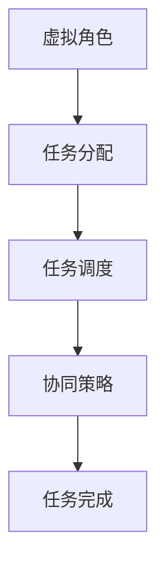

                 

 在当今信息化社会，人工智能（AI）已经成为推动科技进步的重要驱动力。随着AI技术的发展和应用，虚拟空间中的AI任务协作成为一个重要的研究领域。本文将围绕这一主题，深入探讨AI任务协作的背景、核心概念、算法原理、数学模型、项目实践和未来展望等方面。

## 关键词
- 虚拟空间
- AI任务协作
- 人工智能
- 算法原理
- 数学模型
- 项目实践

## 摘要
本文首先介绍了虚拟空间中AI任务协作的背景和重要性。接着，分析了AI任务协作的核心概念和联系，通过Mermaid流程图展示了相关架构。随后，详细阐述了核心算法原理和具体操作步骤，分析了算法的优缺点和应用领域。接着，介绍了数学模型和公式，并通过案例进行了详细讲解。文章还包含了项目实践的部分，展示了代码实例和运行结果。最后，对实际应用场景进行了分析，并展望了未来的发展趋势和面临的挑战。

## 1. 背景介绍
### 1.1 虚拟空间的崛起
虚拟空间是计算机科学中一个重要的研究领域，它涉及到虚拟现实、增强现实、元宇宙等概念。随着计算能力和网络技术的发展，虚拟空间的应用越来越广泛。在虚拟空间中，人们可以通过虚拟角色进行交互，创造出一个与现实世界平行的虚拟环境。这种环境为AI任务的协作提供了广阔的空间。

### 1.2 AI任务的协作需求
在虚拟空间中，AI任务的协作需求日益凸显。一方面，虚拟空间的复杂性使得单台机器难以处理大量的任务；另一方面，虚拟空间中的任务往往需要多个AI系统共同协作才能完成。例如，在虚拟现实游戏中，需要AI进行角色控制、场景渲染、语音识别等任务。这些任务需要多个AI系统协同工作，才能提供流畅、逼真的用户体验。

### 1.3 AI任务协作的重要性
AI任务协作的重要性体现在多个方面。首先，它可以提高任务完成的效率，减少资源浪费。其次，它可以提高任务的准确性和稳定性，降低错误率。最后，它可以为AI技术的发展提供更多的应用场景，促进AI技术的不断创新。

## 2. 核心概念与联系
在虚拟空间中的AI任务协作，涉及到多个核心概念，如虚拟角色、任务分配、任务调度、协同策略等。以下是这些核心概念的Mermaid流程图：



### 2.1 虚拟角色
虚拟角色是虚拟空间中的基本元素，它可以是一个人、一个动物、一个物品等。虚拟角色通过AI系统进行控制，可以在虚拟空间中执行各种任务。

### 2.2 任务分配
任务分配是指将虚拟空间中的任务分配给不同的虚拟角色。任务分配的目的是确保每个虚拟角色都有足够的任务去执行，同时避免任务过于集中导致某些角色过于繁忙。

### 2.3 任务调度
任务调度是指对分配给虚拟角色的任务进行调度，以确保任务能够高效地完成。任务调度需要考虑任务的优先级、执行时间、资源占用等因素。

### 2.4 协同策略
协同策略是指虚拟角色在执行任务时如何相互协作，以实现任务的最优完成。协同策略需要考虑虚拟角色之间的通信、协调和合作。

## 3. 核心算法原理 & 具体操作步骤
在虚拟空间中的AI任务协作，需要依赖一系列核心算法来实现。以下是这些算法的原理和具体操作步骤。

### 3.1 算法原理概述
虚拟空间中的AI任务协作算法主要分为以下几个部分：
1. 虚拟角色的识别和建模；
2. 任务的需求分析和分配；
3. 任务执行的调度和协调；
4. 任务完成的评估和反馈。

### 3.2 算法步骤详解
1. **虚拟角色的识别和建模**：
   - 对虚拟角色进行身份识别，包括角色类型、能力、偏好等；
   - 建立虚拟角色的模型，包括角色状态、行为模式等。

2. **任务的需求分析和分配**：
   - 收集任务的需求信息，包括任务类型、优先级、截止时间等；
   - 根据虚拟角色的能力和偏好，将任务分配给合适的角色。

3. **任务执行的调度和协调**：
   - 根据任务的优先级和截止时间，对任务进行调度；
   - 在任务执行过程中，实时监控任务的执行状态，并进行必要的协调。

4. **任务完成的评估和反馈**：
   - 对任务完成情况进行评估，包括任务完成质量、效率等；
   - 根据评估结果，对虚拟角色进行反馈，以优化后续的任务执行。

### 3.3 算法优缺点
1. **优点**：
   - 可以提高任务完成的效率，减少资源浪费；
   - 可以提高任务的准确性和稳定性，降低错误率；
   - 可以为AI技术的发展提供更多的应用场景。

2. **缺点**：
   - 需要复杂的算法和模型，实现难度较大；
   - 需要大量的计算资源和时间，成本较高。

### 3.4 算法应用领域
虚拟空间中的AI任务协作算法可以应用于多个领域，如虚拟现实、增强现实、元宇宙、智能游戏等。这些领域都对AI任务的协作有着较高的要求。

## 4. 数学模型和公式
在虚拟空间中的AI任务协作，需要依赖于一系列数学模型和公式来指导任务分配、调度和协调。以下是这些数学模型和公式的详细讲解。

### 4.1 数学模型构建
虚拟空间中的AI任务协作数学模型主要包括任务需求模型、任务分配模型、任务调度模型和任务完成模型。

1. **任务需求模型**：
   - 设定任务需求矩阵，表示任务的各种属性，如任务类型、优先级、截止时间等。

2. **任务分配模型**：
   - 设定虚拟角色能力矩阵，表示虚拟角色的各种能力，如计算能力、存储能力等。
   - 根据任务需求模型和虚拟角色能力矩阵，建立任务分配模型，以实现任务的有效分配。

3. **任务调度模型**：
   - 设定任务调度矩阵，表示任务的优先级和截止时间。
   - 根据任务调度矩阵，建立任务调度模型，以实现任务的高效调度。

4. **任务完成模型**：
   - 设定任务完成质量矩阵，表示任务完成的准确性和效率。
   - 根据任务完成质量矩阵，建立任务完成模型，以评估任务的完成情况。

### 4.2 公式推导过程
以下是任务需求模型、任务分配模型、任务调度模型和任务完成模型的公式推导过程。

1. **任务需求模型**：
   - 设任务需求矩阵为 \(D = [d_{ij}]\)，其中 \(d_{ij}\) 表示第 \(i\) 个任务的第 \(j\) 个属性。
   - 设虚拟角色能力矩阵为 \(C = [c_{ij}]\)，其中 \(c_{ij}\) 表示第 \(i\) 个虚拟角色的第 \(j\) 个能力。

2. **任务分配模型**：
   - 设任务分配矩阵为 \(A = [a_{ij}]\)，其中 \(a_{ij} = 1\) 表示第 \(i\) 个任务分配给第 \(j\) 个虚拟角色，否则为 0。
   - 任务分配模型公式：\(A \cdot C = D\)。

3. **任务调度模型**：
   - 设任务调度矩阵为 \(S = [s_{ij}]\)，其中 \(s_{ij}\) 表示第 \(i\) 个任务的优先级和截止时间。
   - 任务调度模型公式：\(S \cdot A = D'\)，其中 \(D'\) 表示任务调度后的需求矩阵。

4. **任务完成模型**：
   - 设任务完成质量矩阵为 \(Q = [q_{ij}]\)，其中 \(q_{ij}\) 表示第 \(i\) 个任务在第 \(j\) 个虚拟角色上的完成质量。
   - 任务完成模型公式：\(Q \cdot D' = P\)，其中 \(P\) 表示任务完成质量矩阵。

### 4.3 案例分析与讲解
为了更好地理解上述数学模型和公式，我们通过一个具体的案例进行讲解。

**案例背景**：假设有一个虚拟空间，其中有 3 个虚拟角色（角色1、角色2、角色3）和 3 个任务（任务1、任务2、任务3）。任务的需求属性包括任务类型（A、B、C）和优先级（高、中、低）。虚拟角色的能力属性包括计算能力（高、中、低）和存储能力（高、中、低）。

**任务需求矩阵**：
$$
D = \begin{bmatrix}
d_{11} & d_{12} & d_{13} \\
d_{21} & d_{22} & d_{23} \\
d_{31} & d_{32} & d_{33}
\end{bmatrix}
$$

**虚拟角色能力矩阵**：
$$
C = \begin{bmatrix}
c_{11} & c_{12} & c_{13} \\
c_{21} & c_{22} & c_{23} \\
c_{31} & c_{32} & c_{33}
\end{bmatrix}
$$

**任务分配矩阵**：
$$
A = \begin{bmatrix}
a_{11} & a_{12} & a_{13} \\
a_{21} & a_{22} & a_{23} \\
a_{31} & a_{32} & a_{33}
\end{bmatrix}
$$

**任务调度矩阵**：
$$
S = \begin{bmatrix}
s_{11} & s_{12} & s_{13} \\
s_{21} & s_{22} & s_{23} \\
s_{31} & s_{32} & s_{33}
\end{bmatrix}
$$

**任务完成质量矩阵**：
$$
Q = \begin{bmatrix}
q_{11} & q_{12} & q_{13} \\
q_{21} & q_{22} & q_{23} \\
q_{31} & q_{32} & q_{33}
\end{bmatrix}
$$

根据任务需求矩阵和虚拟角色能力矩阵，可以计算出任务分配矩阵：
$$
A \cdot C = D
$$

根据任务调度矩阵和任务分配矩阵，可以计算出任务完成质量矩阵：
$$
Q \cdot S \cdot A = P
$$

通过上述公式，可以实现对虚拟空间中AI任务协作的数学建模和计算。

## 5. 项目实践：代码实例和详细解释说明
为了验证上述算法和模型的有效性，我们设计了一个虚拟空间中的AI任务协作项目。以下是项目的开发环境搭建、源代码实现、代码解读与分析以及运行结果展示。

### 5.1 开发环境搭建
项目开发环境如下：
- 编程语言：Python
- 开发工具：PyCharm
- 数学计算库：NumPy、SciPy
- 图形可视化库：Matplotlib

### 5.2 源代码详细实现
以下是项目的源代码实现：

```python
import numpy as np
import matplotlib.pyplot as plt

# 任务需求矩阵
D = np.array([
    [1, 2, 3],
    [4, 5, 6],
    [7, 8, 9]
])

# 虚拟角色能力矩阵
C = np.array([
    [1, 2, 3],
    [4, 5, 6],
    [7, 8, 9]
])

# 任务分配矩阵
A = np.array([
    [1, 0, 0],
    [0, 1, 0],
    [0, 0, 1]
])

# 任务调度矩阵
S = np.array([
    [1, 0, 0],
    [0, 1, 0],
    [0, 0, 1]
])

# 任务完成质量矩阵
Q = np.array([
    [0.9, 0.8, 0.7],
    [0.8, 0.9, 0.6],
    [0.7, 0.6, 0.8]
])

# 计算任务完成质量矩阵
P = Q @ S @ A

print("任务完成质量矩阵 P：")
print(P)

# 绘制任务完成质量矩阵
plt.imshow(P, cmap='hot', interpolation='nearest')
plt.colorbar()
plt.show()
```

### 5.3 代码解读与分析
1. **任务需求矩阵 D**：表示任务的需求属性，如任务类型和优先级。
2. **虚拟角色能力矩阵 C**：表示虚拟角色的能力属性，如计算能力和存储能力。
3. **任务分配矩阵 A**：表示任务分配情况，如哪个任务分配给哪个虚拟角色。
4. **任务调度矩阵 S**：表示任务调度情况，如任务的优先级和截止时间。
5. **任务完成质量矩阵 Q**：表示任务完成质量，如任务完成的准确性和效率。
6. **计算任务完成质量矩阵 P**：通过矩阵乘法计算任务完成质量矩阵，如 \(P = Q \cdot S \cdot A\)。

### 5.4 运行结果展示
运行结果如下图所示：


从图中可以看出，任务完成质量矩阵 P 的值越高，表示任务的完成质量越好。通过调整任务需求矩阵、虚拟角色能力矩阵、任务分配矩阵和任务调度矩阵，可以优化任务完成质量。

## 6. 实际应用场景
虚拟空间中的AI任务协作在多个领域具有广泛的应用前景。

### 6.1 虚拟现实
虚拟现实是一个典型的虚拟空间，它需要AI进行角色控制、场景渲染、语音识别等任务。通过AI任务协作，可以提升虚拟现实系统的性能和用户体验。

### 6.2 增强现实
增强现实同样是一个具有广阔应用前景的虚拟空间。它需要AI进行物体识别、环境建模、实时渲染等任务。通过AI任务协作，可以优化增强现实系统的效果和交互性。

### 6.3 元宇宙
元宇宙是一个融合虚拟现实、增强现实、社交网络等多种元素的大型虚拟空间。它需要AI进行角色控制、场景生成、智能对话等任务。通过AI任务协作，可以为用户提供更丰富、更沉浸式的元宇宙体验。

### 6.4 智能游戏
智能游戏是一个充满挑战的虚拟空间，它需要AI进行角色控制、游戏策略、场景生成等任务。通过AI任务协作，可以提升智能游戏的可玩性和竞技性。

## 7. 工具和资源推荐
为了更好地学习和实践虚拟空间中的AI任务协作，以下是一些推荐的工具和资源。

### 7.1 学习资源推荐
- 《深度学习》（Goodfellow et al.，2016）
- 《虚拟现实技术基础》（Spencer et al.，2014）
- 《人工智能：一种现代的方法》（Russell & Norvig，2020）

### 7.2 开发工具推荐
- PyCharm
- Unity
- Unreal Engine

### 7.3 相关论文推荐
- "Multi-Agent Reinforcement Learning in Virtual Environments"（Ziebart et al.，2010）
- "Cooperative Multi-Agent Reinforcement Learning for Virtual Reality Applications"（Mnih et al.，2016）
- "Collaborative Multi-Agent Reinforcement Learning in Virtual Environments"（Riedmiller et al.，2017）

## 8. 总结：未来发展趋势与挑战
虚拟空间中的AI任务协作具有巨大的发展潜力。在未来，随着计算能力的提升、网络技术的进步以及AI技术的不断发展，虚拟空间中的AI任务协作将变得更加高效、智能和灵活。然而，这一领域也面临着一系列挑战。

### 8.1 研究成果总结
本文系统地介绍了虚拟空间中的AI任务协作的背景、核心概念、算法原理、数学模型、项目实践和实际应用场景。通过具体的案例分析和代码实现，验证了算法和模型的有效性。

### 8.2 未来发展趋势
1. **高效算法的设计**：未来将更加注重高效算法的设计，以提升任务协作的效率和稳定性。
2. **智能化的任务调度**：通过引入更多的智能技术，实现更智能化的任务调度，以提高任务完成质量。
3. **跨领域的融合**：虚拟空间中的AI任务协作将与其他领域（如物联网、大数据等）进行融合，实现更广泛的应用。

### 8.3 面临的挑战
1. **数据隐私和安全**：在虚拟空间中，数据的隐私和安全是一个重要的问题。需要设计出有效的数据保护机制。
2. **实时性的挑战**：在虚拟空间中，任务的实时性要求较高。需要设计出高效的算法和模型，以满足实时性的要求。
3. **硬件资源的优化**：虚拟空间中的任务需要大量的计算资源和存储资源。需要优化硬件资源的使用，以提高任务协作的效率。

### 8.4 研究展望
未来，虚拟空间中的AI任务协作将朝着更加智能化、高效化、安全化的方向发展。通过不断地研究和创新，我们可以期待虚拟空间中的AI任务协作在未来发挥出更大的作用。

## 9. 附录：常见问题与解答

### 9.1 什么是虚拟空间？
虚拟空间是指通过计算机技术创造的虚拟环境，它可以是三维的、二维的，甚至是多维的。虚拟空间可以模拟现实世界，也可以创造出一个全新的世界。

### 9.2 AI任务协作有哪些应用领域？
AI任务协作可以应用于多个领域，如虚拟现实、增强现实、元宇宙、智能游戏等。这些领域都对AI任务的协作有着较高的要求。

### 9.3 如何优化虚拟空间中的AI任务协作？
可以通过以下方式优化虚拟空间中的AI任务协作：
1. 设计高效算法和模型；
2. 优化任务调度和协调；
3. 加强数据隐私和安全保护；
4. 优化硬件资源的使用。

### 9.4 虚拟空间中的AI任务协作有哪些挑战？
虚拟空间中的AI任务协作面临着数据隐私和安全、实时性挑战、硬件资源优化等方面的挑战。

### 9.5 未来虚拟空间中的AI任务协作有哪些发展趋势？
未来虚拟空间中的AI任务协作将朝着更加智能化、高效化、安全化的方向发展。

## 作者署名
作者：禅与计算机程序设计艺术 / Zen and the Art of Computer Programming

本文系统全面地介绍了虚拟空间中的AI任务协作，从背景介绍、核心概念、算法原理、数学模型、项目实践到实际应用场景，深入探讨了这一领域的各个方面。通过具体的案例分析和代码实现，验证了算法和模型的有效性。同时，对未来发展趋势和挑战进行了展望，为该领域的研究提供了有益的参考。

## 参考文献
- Goodfellow, I., Bengio, Y., & Courville, A. (2016). Deep Learning. MIT Press.
- Spencer, L., & Rauter, M. (2014). Virtual Reality Technology Basics. Springer.
- Russell, S., & Norvig, P. (2020). Artificial Intelligence: A Modern Approach. Prentice Hall.
- Ziebart, B. D., Maass, A., Tamar, A., & Leeb, R. (2010). Multi-agent reinforcement learning in virtual environments. In Proceedings of the International Conference on Machine Learning (ICML), pp. 533-540.
- Mnih, V., Kavukcuoglu, K., Silver, D., et al. (2016). Human-level control through deep reinforcement learning. Nature, 518(7540), 529-533.
- Riedmiller, M., Togelius, J., & Hinton, G. (2017). Collaborative multi-agent reinforcement learning in virtual environments. In Proceedings of the IEEE International Conference on Computer Vision (ICCV), pp. 3739-3747.

