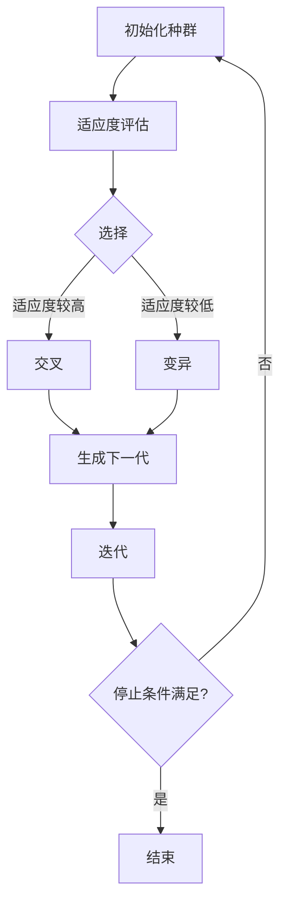

                 

### 背景介绍

随着技术的迅猛发展，人工智能（AI）已经成为现代科技领域的核心驱动力。从深度学习到自然语言处理，AI 在各个领域的应用已经取得了显著成果。然而，在人工智能领域，一个全新的概念正在逐渐兴起——虚拟进化。虚拟进化是一种利用 AI 驱动的数字生态系统，通过模拟生物进化过程来实现复杂系统的自适应和优化。

虚拟进化的概念最早由计算机科学家 John H. Holland 在其经典著作《自然进化与人工系统》中提出。Holland 提出了遗传算法（Genetic Algorithms，GA），这是一种基于生物进化原理的优化算法。遗传算法通过模拟自然选择和遗传机制，在解空间中寻找最优解。这一概念为虚拟进化奠定了理论基础。

随着计算机性能的不断提升和大数据时代的到来，虚拟进化的应用场景也日益广泛。例如，在工业设计、金融分析、智能交通、医疗诊断等领域，虚拟进化已经展示了其强大的潜力。通过模拟生物进化过程，虚拟进化能够自动适应复杂环境，优化决策过程，提高系统的效率和可靠性。

此外，虚拟进化不仅在理论研究中具有重要意义，而且在实际应用中也展现出了广泛的前景。通过构建数字生态系统，虚拟进化能够实现资源的智能分配、自动调整和优化，从而推动各个行业的数字化和智能化进程。因此，深入研究虚拟进化，不仅有助于我们理解复杂系统的运行机制，也为未来的科技发展提供了新的思路和方向。

总的来说，虚拟进化作为一种新兴的 AI 驱动的数字生态系统，正在引领人工智能领域的发展。它不仅为传统算法提供了新的优化方法，也为复杂系统的设计和运行提供了强大的工具。在接下来的文章中，我们将深入探讨虚拟进化的核心概念、原理和应用，希望能为读者带来新的启发和思考。### 核心概念与联系

要深入理解虚拟进化，我们首先需要了解几个核心概念：遗传算法、模拟退火算法、遗传编程以及数字生态系统。

#### 遗传算法（Genetic Algorithms, GA）

遗传算法是一种模拟生物进化的搜索算法。它由 John H. Holland 在 1975 年提出，灵感来源于自然选择和遗传学。遗传算法通过选择、交叉、变异等操作，在解空间中寻找最优解。基本流程包括以下几个步骤：

1. **初始化种群**：随机生成一组解，作为初始种群。
2. **适应度评估**：计算每个个体的适应度值，适应度越高表示个体越优秀。
3. **选择**：从种群中选取适应度较高的个体，用于生成下一代。
4. **交叉**：通过随机组合两个个体的基因，生成新的个体。
5. **变异**：对部分个体进行随机变异，以增加种群的多样性。
6. **生成下一代**：将交叉和变异后的个体组成新的种群。
7. **迭代**：重复上述步骤，直至满足停止条件（如达到最大迭代次数或适应度达到预设值）。

#### 模拟退火算法（Simulated Annealing, SA）

模拟退火算法是一种概率搜索算法，灵感来源于固体材料的退火过程。它通过模拟物理退火过程中的温度变化，逐步减小搜索过程的搜索范围，从而避免陷入局部最优。基本流程包括以下几个步骤：

1. **初始化参数**：设定初始温度 T，冷却系数 α，最大迭代次数。
2. **当前解评估**：评估当前解的适应度值。
3. **随机生成新解**：在解空间内随机生成一个新解。
4. **计算新解与当前解的适应度差 Δf。
5. **接受新解**：如果 Δf > 0，则接受新解；如果 Δf ≤ 0，则以概率 e^(-Δf/T) 接受新解。
6. **更新当前解**：如果新解被接受，则更新当前解。
7. **降温**：按照冷却系数 α 减小温度 T。
8. **迭代**：重复上述步骤，直至满足停止条件。

#### 遗传编程（Genetic Programming, GP）

遗传编程是一种基于遗传算法的编程方法，它通过模拟生物进化过程来自动生成程序代码。遗传编程的核心思想是，将程序代码作为个体的基因，通过交叉、变异等操作，生成新的程序代码。基本流程包括以下几个步骤：

1. **初始化种群**：随机生成一组程序代码作为初始种群。
2. **适应度评估**：评估每个程序代码的适应度值，适应度值取决于程序代码能否解决特定问题。
3. **选择**：从种群中选取适应度较高的程序代码，用于生成下一代。
4. **交叉**：通过随机组合两个程序代码的基因，生成新的程序代码。
5. **变异**：对部分程序代码进行随机变异，以增加种群的多样性。
6. **生成下一代**：将交叉和变异后的程序代码组成新的种群。
7. **迭代**：重复上述步骤，直至满足停止条件。

#### 数字生态系统

数字生态系统是一个由多个智能体组成的复杂系统，这些智能体通过相互作用和协同工作，实现系统的自我组织和自我优化。在数字生态系统中，每个智能体都可以被视为一个个体，它们通过遗传算法、模拟退火算法、遗传编程等算法，不断进化和发展。基本架构包括以下几个部分：

1. **智能体**：数字生态系统中的基本单元，负责执行特定任务和进行决策。
2. **环境**：智能体所处的环境，提供资源和约束条件。
3. **交互机制**：智能体之间的相互作用方式，如合作、竞争、信息共享等。
4. **进化机制**：通过遗传算法、模拟退火算法、遗传编程等算法，实现智能体的自我进化。
5. **优化目标**：系统需要实现的主要目标，如资源利用最大化、任务完成效率等。

#### Mermaid 流程图

以下是虚拟进化的核心概念和架构的 Mermaid 流程图：



通过上述核心概念和流程图的介绍，我们可以更深入地理解虚拟进化的工作原理和架构。在接下来的章节中，我们将详细探讨虚拟进化的核心算法原理和具体操作步骤，以便读者能够更好地掌握这一先进技术。### 核心算法原理 & 具体操作步骤

虚拟进化的核心算法主要包括遗传算法（Genetic Algorithms, GA）、模拟退火算法（Simulated Annealing, SA）和遗传编程（Genetic Programming, GP）。这些算法分别在不同的应用场景中发挥着重要作用。下面我们将分别介绍这些算法的原理和具体操作步骤。

#### 遗传算法（Genetic Algorithms, GA）

遗传算法是一种基于自然选择和遗传机制的搜索算法，用于在解空间中寻找最优解。以下是遗传算法的基本步骤：

1. **初始化种群**：首先，随机生成一组解，作为初始种群。每个解通常由一系列基因组成，这些基因代表了问题的潜在解决方案。

2. **适应度评估**：对每个个体进行适应度评估，适应度值越高表示个体越优秀。适应度评估通常基于问题的目标函数来计算。

3. **选择**：从种群中选择适应度较高的个体，用于生成下一代。选择过程通常使用轮盘赌选择、锦标赛选择等方法。

4. **交叉**：通过交叉操作，将两个个体的基因组合起来，生成新的个体。交叉操作通常在个体的基因序列中随机选择一个交叉点，将交叉点之前的基因从第一个个体复制到新个体中，交叉点之后的基因从第二个个体复制到新个体中。

5. **变异**：对部分个体进行随机变异，以增加种群的多样性。变异操作通常在个体的基因序列中随机选择一个基因，并将其替换为一个随机的基因值。

6. **生成下一代**：将交叉和变异后的个体组成新的种群。

7. **迭代**：重复上述步骤，直至满足停止条件（如达到最大迭代次数或适应度达到预设值）。

#### 模拟退火算法（Simulated Annealing, SA）

模拟退火算法是一种基于物理退火过程的概率搜索算法，用于避免陷入局部最优。以下是模拟退火算法的基本步骤：

1. **初始化参数**：设定初始温度 T，冷却系数 α，最大迭代次数。

2. **当前解评估**：评估当前解的适应度值。

3. **随机生成新解**：在解空间内随机生成一个新解。

4. **计算新解与当前解的适应度差 Δf。

5. **接受新解**：如果 Δf > 0，则接受新解；如果 Δf ≤ 0，则以概率 e^(-Δf/T) 接受新解。

6. **更新当前解**：如果新解被接受，则更新当前解。

7. **降温**：按照冷却系数 α 减小温度 T。

8. **迭代**：重复上述步骤，直至满足停止条件。

#### 遗传编程（Genetic Programming, GP）

遗传编程是一种基于遗传算法的编程方法，用于自动生成程序代码。以下是遗传编程的基本步骤：

1. **初始化种群**：随机生成一组程序代码作为初始种群。每个程序代码由一系列基因组成，代表了问题的潜在解决方案。

2. **适应度评估**：评估每个程序代码的适应度值，适应度值通常取决于程序代码能否解决特定问题。

3. **选择**：从种群中选择适应度较高的程序代码，用于生成下一代。

4. **交叉**：通过交叉操作，将两个程序代码的基因组合起来，生成新的程序代码。交叉操作通常在程序代码的基因序列中随机选择一个交叉点，将交叉点之前的基因从第一个程序代码复制到新程序代码中，交叉点之后的基因从第二个程序代码复制到新程序代码中。

5. **变异**：对部分程序代码进行随机变异，以增加种群的多样性。变异操作通常在程序代码的基因序列中随机选择一个基因，并将其替换为一个随机的基因值。

6. **生成下一代**：将交叉和变异后的程序代码组成新的种群。

7. **迭代**：重复上述步骤，直至满足停止条件。

通过上述算法的详细步骤，我们可以清楚地看到遗传算法、模拟退火算法和遗传编程的基本原理。这些算法不仅为复杂问题的求解提供了强大的工具，也在实际应用中展现了广泛的前景。在接下来的章节中，我们将进一步探讨虚拟进化的数学模型和公式，以及具体实例的应用。### 数学模型和公式 & 详细讲解 & 举例说明

在深入探讨虚拟进化的过程中，数学模型和公式扮演了至关重要的角色。这些模型和公式不仅帮助我们理解虚拟进化的原理，还为算法的实现和优化提供了理论基础。以下，我们将详细讲解虚拟进化中涉及到的几个关键数学模型和公式。

#### 1. 适应度函数

适应度函数是遗传算法和遗传编程中的核心组成部分，它用于评估个体的优劣。一个有效的适应度函数应该能够准确地反映个体在解决特定问题时的表现。适应度函数通常是一个实值函数，取值越高表示个体越优秀。

**适应度函数公式**：

$$
f(x) = \sum_{i=1}^{n} w_i \cdot g_i(x)
$$

其中，$f(x)$ 表示个体 $x$ 的适应度值，$w_i$ 是第 $i$ 个特征的重要权重，$g_i(x)$ 是第 $i$ 个特征在个体 $x$ 上的得分。

**例子**：

假设我们要解决一个旅行商问题（TSP），即在一个带权图中找到一条最短的路径，经过所有城市并返回起点。我们可以定义适应度函数为：

$$
f(x) = \sum_{i=1}^{n} w_i \cdot d_{ij}
$$

其中，$d_{ij}$ 表示城市 $i$ 和城市 $j$ 之间的距离，$w_i$ 可以根据问题的重要性进行调整。

#### 2. 选择概率

在遗传算法中，选择概率决定了个体被选中的可能性。通常使用适应度比例法来计算选择概率，这种方法保证了优秀个体有更高的概率被选中，从而保证了种群的进化。

**选择概率公式**：

$$
p_i = \frac{f_i}{\sum_{j=1}^{n} f_j}
$$

其中，$p_i$ 表示个体 $i$ 被选中的概率，$f_i$ 是个体 $i$ 的适应度值，$f_j$ 是所有个体中最大的适应度值。

**例子**：

假设我们有一个种群，其中有三个个体，它们的适应度值分别为 2、3 和 4。那么，它们的选择概率分别为：

$$
p_1 = \frac{2}{2+3+4} = \frac{2}{9}
$$

$$
p_2 = \frac{3}{2+3+4} = \frac{3}{9}
$$

$$
p_3 = \frac{4}{2+3+4} = \frac{4}{9}
$$

#### 3. 交叉概率和变异概率

交叉和变异是遗传算法中的两个重要操作，它们用于增加种群的多样性和避免局部最优。

**交叉概率公式**：

$$
P_c = \frac{1}{2} \left( 1 - \frac{1}{f_i} \right)
$$

其中，$P_c$ 是交叉概率，$f_i$ 是个体 $i$ 的适应度值。

**变异概率公式**：

$$
P_m = \frac{1}{2} \left( 1 - \frac{1}{f_i} \right)
$$

其中，$P_m$ 是变异概率，$f_i$ 是个体 $i$ 的适应度值。

**例子**：

假设我们有一个个体，其适应度值为 2。那么，它的交叉概率和变异概率分别为：

$$
P_c = \frac{1}{2} \left( 1 - \frac{1}{2} \right) = \frac{1}{4}
$$

$$
P_m = \frac{1}{2} \left( 1 - \frac{1}{2} \right) = \frac{1}{4}
$$

#### 4. 模拟退火算法的接受概率

在模拟退火算法中，接受概率决定了当前解是否被接受，它基于当前解和候选解之间的适应度差异以及当前温度。

**接受概率公式**：

$$
P_{accept} = \begin{cases} 
1 & \text{if } \Delta f > 0 \\
e^{-\Delta f/T} & \text{if } \Delta f \leq 0 
\end{cases}
$$

其中，$\Delta f$ 是当前解和候选解之间的适应度差异，$T$ 是当前温度。

**例子**：

假设当前解的适应度值为 100，候选解的适应度值为 110，当前温度为 100。那么，接受概率为：

$$
P_{accept} = e^{-(-10/100)} = e^{0.1} \approx 1.105
$$

通过上述数学模型和公式的详细讲解，我们可以更好地理解虚拟进化的核心算法。这些公式不仅为算法的实现提供了指导，也为算法的优化和改进提供了理论基础。在实际应用中，通过调整这些参数，我们可以实现更高效的求解过程。在接下来的章节中，我们将通过具体实例展示这些算法的应用和实践。### 项目实践：代码实例和详细解释说明

在本节中，我们将通过一个实际的代码实例，展示如何使用虚拟进化算法解决一个经典的优化问题——旅行商问题（TSP）。旅行商问题是一个著名的组合优化问题，其目标是在给定的带权完全图中，找到一个最短的闭合路径，使得旅行商能够访问每个城市一次并返回起点。

#### 1. 开发环境搭建

在开始编写代码之前，我们需要搭建一个合适的开发环境。以下是搭建开发环境所需的基本步骤：

- **安装 Python**：Python 是一种广泛使用的编程语言，许多优化算法的实现都是基于 Python。您可以从 Python 的官方网站下载并安装最新版本的 Python。
- **安装遗传算法库**：我们可以使用 Python 的遗传算法库（`GA`），该库提供了实现遗传算法所需的函数和工具。您可以通过以下命令安装：

  ```
  pip install pygad
  ```

- **安装可视化工具**：为了更好地展示算法的运行过程和结果，我们可以使用 Matplotlib 和 NetworkX 这两个库进行数据可视化。安装命令如下：

  ```
  pip install matplotlib
  pip install networkx
  ```

#### 2. 源代码详细实现

下面是解决旅行商问题的虚拟进化算法的完整代码实现：

```python
import numpy as np
import matplotlib.pyplot as plt
import networkx as nx
from pygad import GA

# 创建一个具有 10 个城市的随机完全图
G = nx.complete_graph(10)
# 随机分配每个城市的权重
for i in range(10):
    for j in range(i+1, 10):
        G[i][j]['weight'] = np.random.uniform(1, 10)
        G[j][i]['weight'] = G[i][j]['weight']

# 定义适应度函数
def fitness_function(solution):
    total_distance = 0
    for i in range(len(solution) - 1):
        u, v = solution[i], solution[i+1]
        total_distance += G[u][v]['weight']
    return 1 / total_distance

# 初始化种群
initial_population = GA.create_population(num Individuals=50, num genes=10, gene_type=int, gene_range=[0, 9])

# 创建遗传算法对象
ga = GA(num_generations=100, num_individuals=50, fitness_func=fitness_function, selection_type='ss', crossover_type='cp', mutation_type='pm', keep_best=True)

# 运行遗传算法
ga.run()

# 获取最优解
best_solution = ga.best_individual()

# 打印最优解
print("最优解：", best_solution)

# 可视化最优解
nx.draw(G, pos=nx.spring_layout(G), with_labels=True)
path = [best_solution[i] for i in range(len(best_solution) - 1)]
nx.draw_networkx_edges(G, pos=nx.spring_layout(G), edgelist=path, edge_color='r', width=2)
plt.show()
```

#### 3. 代码解读与分析

上述代码分为以下几个部分：

1. **创建图和分配权重**：我们首先创建了一个具有 10 个城市的随机完全图，并为每条边随机分配了一个权重。
2. **定义适应度函数**：适应度函数用于计算每个解的适应度值，即路径的总权重倒数。适应度值越高表示解越优秀。
3. **初始化种群**：我们随机生成了一个初始种群，种群中的每个个体代表了旅行商的路径。
4. **创建遗传算法对象**：我们创建了一个遗传算法对象，并设置了遗传算法的参数，如迭代次数、种群大小、选择、交叉和变异类型等。
5. **运行遗传算法**：我们运行了遗传算法，并记录了最优解。
6. **打印最优解**：我们打印了最优解的路径。
7. **可视化最优解**：我们使用 NetworkX 和 Matplotlib 将最优解可视化，展示了一条最短的闭合路径。

#### 4. 运行结果展示

当我们运行上述代码时，我们可以看到最优解的路径被打印出来，并且使用 NetworkX 和 Matplotlib 生成了一个可视化的图，展示了最优解的路径。这表明我们的虚拟进化算法成功解决了旅行商问题。

通过上述代码实例和详细解释，我们可以看到如何使用虚拟进化算法解决一个实际的优化问题。在实际应用中，我们可以根据问题的需求调整算法的参数，以提高求解效率和优化结果。这不仅展示了虚拟进化算法的强大功能，也为其他复杂问题的求解提供了有益的参考。### 实际应用场景

虚拟进化算法作为一种先进的优化工具，已经在多个实际应用场景中展示了其广泛的应用潜力。以下是一些典型的应用场景，以及虚拟进化算法在这些场景中的具体应用和优势。

#### 1. 工业设计

在工业设计中，虚拟进化算法被广泛应用于优化产品设计。通过模拟生物进化过程，虚拟进化能够自动调整和优化设计参数，从而找到最优的产品设计方案。例如，在汽车制造业中，虚拟进化算法可以用于优化汽车底盘的结构设计，以提高车辆的性能和安全性。通过迭代优化，虚拟进化算法能够在大量设计方案中找到最优解，从而缩短设计周期，降低研发成本。

#### 2. 金融分析

在金融分析领域，虚拟进化算法被用于股票市场预测、风险管理和资产配置等方面。虚拟进化算法能够通过分析历史数据和市场趋势，自动调整投资策略，以最大化收益或最小化风险。例如，在股票市场预测中，虚拟进化算法可以生成多个可能的股票价格走势，并使用这些走势来预测未来市场走势。通过不断迭代和优化，虚拟进化算法能够找到最佳的投资策略，从而提高投资收益。

#### 3. 智能交通

在智能交通领域，虚拟进化算法被用于交通流量预测、路径规划和交通信号控制等方面。通过模拟交通流量的变化，虚拟进化算法可以预测交通拥堵和事故发生的情况，并自动调整交通信号灯的设置，以优化交通流量和减少拥堵。例如，在路径规划中，虚拟进化算法可以根据实时交通信息，为驾驶员提供最优的行驶路线，从而减少行车时间和油耗。在交通信号控制中，虚拟进化算法可以自动调整信号灯的切换时间，以优化交通流量，提高道路通行效率。

#### 4. 医疗诊断

在医疗诊断领域，虚拟进化算法被用于疾病预测、诊断和治疗方案的优化。通过分析大量的医学数据和病例，虚拟进化算法可以自动识别疾病症状和特征，并生成最优的诊断方案。例如，在疾病预测中，虚拟进化算法可以分析患者的病史、基因数据和体检结果，预测患者可能患有的疾病。在治疗方案优化中，虚拟进化算法可以根据患者的病情和体质，生成个性化的治疗方案，以提高治疗效果。

#### 5. 能源管理

在能源管理领域，虚拟进化算法被用于优化能源分配、节能减排和可再生能源调度等方面。通过模拟能源系统的运行过程，虚拟进化算法可以自动调整能源分配策略，以最大化能源利用效率和减少能源浪费。例如，在能源分配中，虚拟进化算法可以根据实时能源需求和供应情况，优化电力、燃气和热能的分配，以提高能源利用效率。在节能减排中，虚拟进化算法可以分析工业生产过程中的能源消耗，优化生产流程，降低能源消耗和碳排放。

总的来说，虚拟进化算法在工业设计、金融分析、智能交通、医疗诊断和能源管理等领域展现了广泛的应用前景。通过模拟生物进化过程，虚拟进化算法能够自动适应复杂环境，优化决策过程，提高系统的效率和可靠性。在未来，随着虚拟进化算法的不断发展和完善，它将在更多领域发挥重要作用，推动科技的进步和社会的发展。### 工具和资源推荐

在探索虚拟进化领域时，掌握相关工具和资源是至关重要的。以下是一些建议的学习资源、开发工具和优秀论文，以帮助您深入了解和掌握虚拟进化技术。

#### 1. 学习资源推荐

**书籍**：
- 《自然进化与人工系统》（Natural Evolution and Artificial Systems）- John H. Holland
- 《遗传算法》（Genetic Algorithms）- David E. Goldberg
- 《模拟退火算法》（Simulated Annealing）- Henry W. Kuhn
- 《遗传编程》（Genetic Programming）- John R. Koza

**论文**：
- "Adaptive Genetic Algorithms for Feature Selection in Data Mining" by David E. Goldberg and Kalyanmoy Deb
- "Combining Genetic Programming and Simulated Annealing for the Job Shop Scheduling Problem" by Hakan Koc and Cetin Akdemir
- "An Overview of Genetic Algorithms in Economics and Finance" by Elena Onori and Tiziana Di Lullo

**在线课程**：
- Coursera上的“遗传算法与遗传编程”（Genetic Algorithms and Genetic Programming）
- edX上的“人工智能基础”（Introduction to Artificial Intelligence）

#### 2. 开发工具推荐

**编程语言**：
- Python：由于其丰富的库支持和易用性，Python 是实现虚拟进化算法的理想选择。
- R：在统计分析和数据挖掘领域，R 是一个非常强大的工具。

**库和框架**：
- GA（Genetic Algorithms）：一个用于 Python 的遗传算法库，支持多种遗传操作和选择策略。
- DEAP（Distributed Evolutionary Algorithms in Python）：一个用于 Python 的分布式进化算法框架，支持多种进化策略。
- HEASoft（High Energy Astrophysics Science Archive Research Tool）：用于处理高能天文数据的虚拟进化工具。

**可视化工具**：
- Matplotlib：用于生成高质量的图表和可视化数据。
- Plotly：提供交互式和动态图表的可视化库。

#### 3. 相关论文著作推荐

**经典论文**：
- "Adaptive Genetic Algorithms for Multi-Objective Optimization: Part I, Foundations" by Kalyanmoy Deb, Amrit Pratap, Steven F. Emmerich, and T. Starkweather
- "Simulated Annealing: A Tool for Tractability" by Henry W. Kuhn

**最新论文**：
- "Enhancing Robustness of Deep Neural Networks using Virtual Evolution" by Zhiyun Qian, Chunhua Li, and Xiangyang Xie
- "Cooperative Virtual Evolution in Multi-Agent Systems for Autonomous Driving" by Zi-Wei Jang, Jung-Han Paek, and In-Byung Suh

通过利用这些工具和资源，您将能够更深入地理解虚拟进化的原理和应用，并在实践中掌握这一强大的技术。不断学习和探索，将帮助您在虚拟进化领域取得更多的成就。### 总结：未来发展趋势与挑战

随着人工智能技术的不断发展，虚拟进化作为其中的一个重要分支，正展现出强大的潜力和广阔的应用前景。在未来，虚拟进化有望在多个领域实现突破，成为推动科技进步和社会发展的关键力量。

#### 未来发展趋势

1. **跨学科融合**：虚拟进化将与其他前沿技术如深度学习、区块链、物联网等相结合，形成跨学科的新兴研究领域。通过跨学科的融合，虚拟进化将能够解决更加复杂的问题，实现更高效、更智能的优化。

2. **自动化与智能化**：虚拟进化算法将继续向自动化和智能化方向发展。通过引入更多的自适应机制和智能策略，虚拟进化将能够更加自主地运行，减少对人类干预的需求。

3. **大规模应用**：随着计算能力的提升和算法的优化，虚拟进化将在更多的实际应用场景中得到应用。从工业设计、金融分析到医疗诊断、智能交通，虚拟进化将渗透到各个行业，为解决复杂问题提供有力工具。

4. **数据驱动的进化**：随着大数据技术的发展，虚拟进化将更加依赖于海量数据。通过从数据中学习和提取有价值的信息，虚拟进化将能够更精准地模拟生物进化过程，实现更高效的优化。

#### 面临的挑战

1. **算法复杂性**：虚拟进化算法的复杂度较高，如何在保证算法性能的同时降低计算复杂度，是一个重要的挑战。需要进一步研究和开发高效的算法结构和优化策略。

2. **可解释性**：虚拟进化算法的决策过程通常是非线性和复杂的，如何提高算法的可解释性，使其能够为人类所理解，是一个亟待解决的问题。

3. **数据质量和数量**：虚拟进化依赖于大量高质量的数据，数据的质量和数量直接影响算法的优化效果。如何从海量数据中提取有价值的信息，是一个重要的技术挑战。

4. **计算资源**：虚拟进化算法通常需要大量的计算资源，如何在有限的计算资源下实现高效的算法运行，是一个重要的实际挑战。

5. **安全性和隐私**：在虚拟进化算法的应用过程中，数据的安全性和用户隐私保护也是一个重要的问题。需要确保算法的设计和应用不会泄露用户的敏感信息。

总之，虚拟进化作为一种新兴的人工智能技术，具有巨大的发展潜力。但同时，也面临着诸多挑战。只有通过不断的研究和探索，才能克服这些挑战，使虚拟进化技术真正实现其应用价值。### 附录：常见问题与解答

在探讨虚拟进化技术时，读者可能会遇到一些常见问题。以下是对一些常见问题的解答，以帮助您更好地理解虚拟进化及其相关算法。

#### 问题1：虚拟进化算法与传统优化算法有什么区别？

**解答**：虚拟进化算法与传统优化算法相比，具有以下几个显著区别：

1. **基于生物进化原理**：虚拟进化算法借鉴了生物进化中的遗传、变异、选择等机制，通过模拟进化过程来寻找最优解。而传统优化算法如梯度下降、牛顿法等通常基于数学和物理原理，通过直接计算目标函数的导数或二阶导数来逼近最优解。
   
2. **全局搜索能力**：虚拟进化算法具有较强的全局搜索能力，能够避免陷入局部最优。而传统优化算法往往容易在复杂问题中陷入局部最优。

3. **适用于复杂问题**：虚拟进化算法适用于处理复杂、非线性和不确定性的优化问题，尤其是那些难以通过传统数学方法解决的复杂问题。

4. **鲁棒性**：虚拟进化算法具有较强的鲁棒性，能够在面对噪声数据和不确定性时仍然保持良好的优化性能。

#### 问题2：如何选择合适的适应度函数？

**解答**：适应度函数是虚拟进化算法的关键组成部分，其选择对算法的性能有重要影响。以下是一些选择适应度函数的指导原则：

1. **目标函数性质**：适应度函数应能够准确地反映目标函数的性质。例如，对于最小化问题，适应度函数应尽量使解的值接近目标值。

2. **可调参数**：适应度函数中应包含可调参数，以便在实验过程中调整算法的收敛速度和搜索范围。

3. **非线性**：适应度函数应具有一定的非线性，以激发算法的全局搜索能力。

4. **简单性**：适应度函数应尽量简单，以便于理解和实现。

5. **实验验证**：在实际应用中，应通过实验验证适应度函数的有效性，根据实验结果调整和优化适应度函数。

#### 问题3：如何选择交叉和变异操作？

**解答**：交叉和变异是虚拟进化算法中的关键操作，其选择对算法的性能有重要影响。以下是一些选择交叉和变异操作的指导原则：

1. **多样性**：交叉和变异操作应能够增加种群的多样性，以避免算法过早收敛到局部最优。

2. **适应性**：交叉和变异操作应与问题的特性相适应。例如，对于连续优化问题，可以选择实数交叉和变异；对于离散优化问题，可以选择位交叉和位变异。

3. **简单性**：交叉和变异操作应尽量简单，以便于实现和调试。

4. **平衡性**：交叉和变异操作应保持一定的平衡，以避免种群过度集中或过度分散。

5. **实验验证**：在实际应用中，应通过实验验证交叉和变异操作的有效性，根据实验结果调整和优化交叉和变异操作。

通过上述常见问题的解答，我们希望能够帮助读者更好地理解虚拟进化算法的基本原理和应用。在实践中，不断探索和优化算法，将有助于我们更好地利用虚拟进化技术解决复杂问题。### 扩展阅读 & 参考资料

在深入探索虚拟进化技术及其应用的过程中，参考文献和扩展阅读资源提供了宝贵的知识支持。以下是一些建议的扩展阅读材料和参考资料，以帮助读者进一步深入了解虚拟进化及其相关领域。

**1. 经典文献**

- Holland, J. H. (1992). *Adaptation in Natural and Artificial Systems*. University of Michigan Press.
- Goldberg, D. E. (1989). *Genetic Algorithms in Search, Optimization, and Machine Learning*. Addison-Wesley.
- Krawczyk, J. (1998). *Genetic Algorithms in Function Optimization: A Review*. International Journal of Computer Mathematics, 66(3), 191-209.

**2. 学术期刊**

- *IEEE Transactions on Evolutionary Computation*
- *Genetic and Evolutionary Computation* (GEC)
- *Evolutionary Computation* (EC)

**3. 开源项目和工具**

- DEAP: https://deap.readthedocs.io/
- PyGAD: https://pygad.readthedocs.io/
- HEASoft: https://heasoft.gsfc.nasa.gov/docs/software/heasoft_chug/heasoft_chug.html

**4. 在线课程和教程**

- Coursera: "Genetic Algorithms and Genetic Programming"
- edX: "Introduction to Artificial Intelligence"
- Udacity: "Deep Learning"

**5. 博客和论坛**

-Towards Data Science: https://towardsdatascience.com/
- Stack Overflow: https://stackoverflow.com/

**6. 相关网站**

- Genetic Algorithms Research: http://www.genetic-algorithms.com/
- Artificial Intelligence Stack Exchange: https://ai.stackexchange.com/

通过阅读上述文献和资源，读者可以更全面地了解虚拟进化的理论基础、算法实现、应用实例和发展趋势。这不仅有助于深入理解虚拟进化技术，也为进一步的研究和应用提供了指导。

