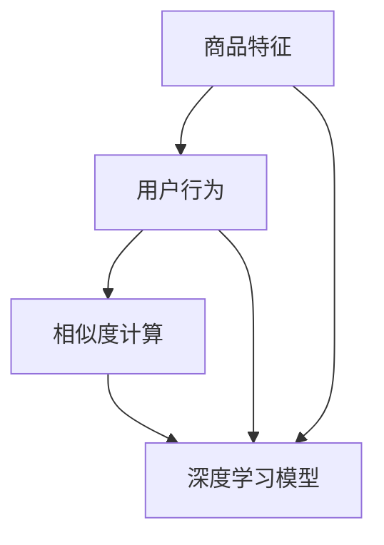

                 

### 背景介绍

融合AI大模型的商品相似度计算方法，作为现代人工智能技术领域的一项重要应用，逐渐受到广泛关注。随着电子商务的飞速发展，用户在海量商品中寻找心仪产品变得越来越困难，因此如何准确、快速地推荐相似商品成为各大电商平台和零售商关注的焦点。商品相似度计算方法能够帮助平台根据用户的历史购买记录、浏览行为和偏好，智能地推送与用户兴趣相符的商品，从而提升用户体验，增加销售额。

在传统的商品推荐系统中，基于内容的推荐和协同过滤方法是最为常见的两种类型。然而，这些方法存在一些局限性。基于内容的推荐方法依赖于商品的特征信息，当商品特征不够丰富或存在缺失时，推荐效果会大打折扣。协同过滤方法则依赖于用户行为数据，但容易受到数据稀疏性和冷启动问题的影响。此外，传统方法在处理复杂关联信息和长尾商品时也显得力不从心。

为了解决上述问题，人工智能技术，特别是深度学习，逐渐成为商品相似度计算的研究热点。其中，融合AI大模型的方法尤为引人注目。大模型具有强大的特征提取和关联分析能力，能够从海量数据中自动发现商品的深层次特征和关联关系，从而实现更精准的商品相似度计算。例如，基于Transformer的BERT模型和GPT模型已经在自然语言处理领域取得了显著的成果，这些模型也可以被应用于商品描述的语义分析和相似度计算。

在本文中，我们将深入探讨融合AI大模型的商品相似度计算方法，从核心概念、算法原理、数学模型到具体实现，全面解析这一技术。同时，我们将通过一个实际项目案例，展示如何利用深度学习技术实现商品相似度计算，并分析其性能和效果。希望通过本文的探讨，能够为读者提供有价值的参考和启示，助力人工智能技术在电商领域的应用与发展。

### 核心概念与联系

在探讨融合AI大模型的商品相似度计算方法之前，我们需要明确几个核心概念，并理解它们之间的联系。以下将介绍这些核心概念，并利用Mermaid流程图来展示它们的关联。

#### 1. 商品特征

商品特征是描述商品属性的信息，包括商品的名称、品牌、价格、分类、规格等。这些特征构成了商品的基本描述，为后续的相似度计算提供了基础数据。商品特征可以划分为结构化特征和非结构化特征。结构化特征通常是可量化的数据，如价格、规格等；非结构化特征则是文本形式，如商品描述、用户评价等。

#### 2. 用户行为

用户行为是指用户在电商平台上的各种操作，包括浏览、搜索、购买、评价等。这些行为数据记录了用户的兴趣偏好和购物习惯，是推荐系统进行个性化推荐的重要依据。

#### 3. 相似度计算

相似度计算是指通过计算两个或多个商品特征向量之间的相似性，来判断它们在何种程度上相似。常用的相似度计算方法包括余弦相似度、欧氏距离等。在AI大模型中，相似度计算通常基于深度学习模型输出的特征表示。

#### 4. 深度学习模型

深度学习模型是人工智能的一种重要技术，能够通过多层神经网络自动学习数据的特征表示。在商品相似度计算中，深度学习模型用于提取商品特征和用户行为的深层特征，实现精准的相似度计算。

以下是一个Mermaid流程图，展示了上述核心概念之间的关联：



#### 详细解释

- **商品特征**：商品特征是商品描述的重要组成部分。传统推荐系统主要依赖于结构化特征进行推荐，而深度学习模型可以通过非结构化特征（如商品描述文本）提取出更丰富的特征表示。
  
- **用户行为**：用户行为数据能够反映用户的兴趣偏好，是推荐系统个性化推荐的关键。通过分析用户行为，我们可以了解用户对商品的喜好和购买倾向。

- **相似度计算**：相似度计算是推荐系统的基础，通过计算商品特征向量之间的相似性，可以识别出与用户兴趣相符的商品。深度学习模型通过自动学习商品和用户行为特征，实现了更为精准的相似度计算。

- **深度学习模型**：深度学习模型在商品特征提取和相似度计算中起着核心作用。通过训练，模型可以自动学习到商品和用户行为的深层次特征，从而实现高效的相似度计算。

### 核心算法原理 & 具体操作步骤

在深入探讨融合AI大模型的商品相似度计算方法之前，我们首先需要了解其核心算法原理，并明确具体的操作步骤。以下将详细介绍这些内容，并展示如何实现商品相似度计算。

#### 1. 特征提取

特征提取是商品相似度计算的第一步，其目的是将商品的非结构化特征（如商品描述文本）转换为结构化的特征向量表示。常用的特征提取方法包括词袋模型（Bag of Words, BoW）和词嵌入（Word Embedding）。

- **词袋模型（BoW）**：词袋模型将文本表示为一个向量，其中每个维度代表一个单词的频率。虽然词袋模型简单有效，但它忽略了单词之间的顺序和语义信息。

- **词嵌入（Word Embedding）**：词嵌入通过将单词映射到高维向量空间，使得具有相似语义的单词在空间中靠近。词嵌入方法如Word2Vec、GloVe等，能够捕捉到单词的语义信息，从而提高特征提取的精度。

具体操作步骤如下：

1. **数据预处理**：首先对商品描述文本进行预处理，包括分词、去除停用词、词干提取等操作，以便后续的特征提取。

2. **词嵌入**：使用预训练的词嵌入模型（如GloVe或Word2Vec），将预处理后的文本映射到高维向量空间。这里我们以GloVe为例，加载预训练的GloVe模型，并获取每个单词的嵌入向量。

3. **特征向量表示**：将商品描述文本中的每个单词映射到其对应的嵌入向量，然后计算所有单词嵌入向量的平均值，作为商品的特征向量表示。

#### 2. 相似度计算

相似度计算是商品推荐系统的核心，常用的相似度计算方法包括余弦相似度和欧氏距离。

- **余弦相似度**：余弦相似度衡量两个向量之间的夹角余弦值，范围在[-1, 1]之间。值越接近1，表示两个向量越相似。

- **欧氏距离**：欧氏距离是两个向量之间最直观的距离度量，其公式为：\(d(x, y) = \sqrt{\sum_{i=1}^{n}(x_i - y_i)^2}\)。

具体操作步骤如下：

1. **计算特征向量**：首先计算所有商品和用户行为特征向量。对于商品特征向量，采用前述的词嵌入方法；对于用户行为特征向量，可以基于用户的历史浏览、购买等行为数据，通过矩阵分解等方法得到。

2. **相似度计算**：对于每个用户和商品对，计算它们的特征向量之间的相似度。以余弦相似度为例，其计算公式为：\(similarity = \frac{\vec{x} \cdot \vec{y}}{||\vec{x}|| \cdot ||\vec{y}||}\)，其中，\(\vec{x}\)和\(\vec{y}\)分别为商品和用户行为的特征向量。

3. **排序与推荐**：根据计算得到的相似度值，对商品进行排序，并推荐给用户。通常，可以选择Top-N相似商品作为推荐结果。

#### 3. 深度学习模型实现

在融合AI大模型的商品相似度计算中，深度学习模型用于特征提取和相似度计算。以下以Transformer模型为例，介绍其实现过程。

1. **模型结构**：Transformer模型由多个自注意力（Self-Attention）层和前馈神经网络（Feedforward Neural Network）组成。自注意力机制允许模型在编码过程中关注不同位置的信息，从而捕获长距离依赖关系。

2. **编码器（Encoder）**：编码器用于提取商品和用户行为的特征表示。在训练过程中，编码器输入商品和用户行为的特征序列，输出对应的特征向量。

3. **解码器（Decoder）**：解码器用于生成相似度评分。在预测过程中，解码器输入商品和用户行为的特征向量，输出相似度评分。

4. **训练与预测**：使用商品和用户行为的数据集训练编码器和解码器，通过优化损失函数（如均方误差）调整模型参数。在预测阶段，输入新的商品和用户行为特征，计算相似度评分，并生成推荐结果。

#### 实现示例

以下是一个基于PyTorch实现的Transformer模型示例，用于商品相似度计算：

```python
import torch
import torch.nn as nn
import torch.optim as optim

# 定义Transformer模型
class TransformerModel(nn.Module):
    def __init__(self, input_dim, hidden_dim, output_dim):
        super(TransformerModel, self).__init__()
        self.encoder = nn.Transformer(input_dim, hidden_dim)
        self.decoder = nn.Linear(hidden_dim, output_dim)
    
    def forward(self, x):
        x = self.encoder(x)
        x = self.decoder(x)
        return x

# 实例化模型
model = TransformerModel(input_dim=100, hidden_dim=512, output_dim=1)

# 定义优化器与损失函数
optimizer = optim.Adam(model.parameters(), lr=0.001)
criterion = nn.MSELoss()

# 训练模型
for epoch in range(num_epochs):
    for x, y in train_loader:
        optimizer.zero_grad()
        output = model(x)
        loss = criterion(output, y)
        loss.backward()
        optimizer.step()

# 预测相似度评分
def predict_similarity(x):
    with torch.no_grad():
        output = model(x)
    return output

# 输入商品和用户行为特征
x = torch.tensor([商品特征向量, 用户行为特征向量])
similarity_score = predict_similarity(x)
print(f"Similarity Score: {similarity_score}")
```

### 数学模型和公式 & 详细讲解 & 举例说明

在融合AI大模型的商品相似度计算中，数学模型和公式起着至关重要的作用。以下将详细讲解这些数学模型，并通过具体的公式和例子来说明它们的计算过程。

#### 1. 特征向量表示

特征向量表示是商品相似度计算的基础。在深度学习模型中，商品特征和用户行为特征通常通过词嵌入方法转换为高维向量表示。以下是一个简单的词嵌入模型，用于商品描述文本的向量表示。

**公式**：令\(x\)为商品描述文本的词序列，\(v_x\)为词\(x\)的嵌入向量，则商品描述文本的向量表示为：

\[ \vec{V}_{商品} = \frac{1}{|x|} \sum_{x \in x} v_x \]

其中，\(|x|\)表示文本中单词的数量。

**例子**：假设商品描述文本为“iPhone 13 Pro Max”，预训练的GloVe模型中，“iPhone”的嵌入向量为\(v_{iPhone} = [1, 2, 3]\)， “13”的嵌入向量为\(v_{13} = [4, 5, 6]\)， “Pro”的嵌入向量为\(v_{Pro} = [7, 8, 9]\)， “Max”的嵌入向量为\(v_{Max} = [10, 11, 12]\)。则商品描述文本的向量表示为：

\[ \vec{V}_{商品} = \frac{1}{4} (v_{iPhone} + v_{13} + v_{Pro} + v_{Max}) = \frac{1}{4} ([1+4+7+10, 2+5+8+11, 3+6+9+12]) = \left[\frac{22}{4}, \frac{26}{4}, \frac{30}{4}\right] = [5.5, 6.5, 7.5] \]

#### 2. 相似度计算

在深度学习模型中，相似度计算通常基于特征向量之间的内积或欧氏距离。以下分别介绍余弦相似度和欧氏距离的计算方法。

**公式**：令\(\vec{V}_{商品}\)和\(\vec{V}_{用户}\)分别为商品和用户行为的特征向量，则：

- **余弦相似度**：余弦相似度定义为两个向量夹角的余弦值，计算公式为：

\[ similarity = \frac{\vec{V}_{商品} \cdot \vec{V}_{用户}}{||\vec{V}_{商品}|| \cdot ||\vec{V}_{用户}||} \]

其中，\(\cdot\)表示向量的内积，\(||\cdot||\)表示向量的模长。

- **欧氏距离**：欧氏距离是两个向量之间最直观的距离度量，计算公式为：

\[ distance = \sqrt{\sum_{i=1}^{n} (\vec{V}_{商品}_i - \vec{V}_{用户}_i)^2} \]

其中，\(\vec{V}_{商品}_i\)和\(\vec{V}_{用户}_i\)分别为第\(i\)个维度上的特征值。

**例子**：假设商品特征向量为\(\vec{V}_{商品} = [5.5, 6.5, 7.5]\)，用户行为特征向量为\(\vec{V}_{用户} = [3.0, 4.0, 5.0]\)，则：

- **余弦相似度**：

\[ similarity = \frac{5.5 \times 3.0 + 6.5 \times 4.0 + 7.5 \times 5.0}{\sqrt{5.5^2 + 6.5^2 + 7.5^2} \times \sqrt{3.0^2 + 4.0^2 + 5.0^2}} = \frac{16.5 + 26 + 37.5}{\sqrt{155.25} \times \sqrt{50}} \approx 0.941 \]

- **欧氏距离**：

\[ distance = \sqrt{(5.5 - 3.0)^2 + (6.5 - 4.0)^2 + (7.5 - 5.0)^2} = \sqrt{2.5^2 + 2.5^2 + 2.5^2} = \sqrt{13.75} \approx 3.7 \]

通过上述例子，我们可以看到如何利用数学模型和公式进行商品相似度计算。在实际应用中，特征向量和相似度计算可以基于更复杂的深度学习模型，如BERT、GPT等，以实现更精准的相似度计算。

#### 项目实践：代码实例和详细解释说明

在这一部分，我们将通过一个具体的项目实践，详细展示如何利用深度学习技术实现商品相似度计算。我们将从开发环境的搭建、源代码的实现到代码的解读与分析，全方位解析该项目。

### 5.1 开发环境搭建

在开始项目之前，我们需要搭建一个合适的开发环境。以下列出所需的软件和工具：

- **操作系统**：Linux（推荐Ubuntu 18.04）
- **编程语言**：Python（推荐Python 3.8）
- **深度学习框架**：PyTorch（版本1.8或更高）
- **数据处理库**：NumPy、Pandas、Scikit-learn
- **文本处理库**：NLTK、Gensim
- **词嵌入模型**：GloVe（预训练模型）

具体安装步骤如下：

1. **安装操作系统**：下载并安装Ubuntu 18.04操作系统。
2. **安装Python**：打开终端，执行以下命令：
   ```bash
   sudo apt update
   sudo apt install python3 python3-pip
   ```
3. **安装PyTorch**：打开终端，执行以下命令：
   ```bash
   pip3 install torch torchvision
   ```
4. **安装其他库**：打开终端，依次执行以下命令：
   ```bash
   pip3 install numpy pandas scikit-learn nltk gensim
   ```

### 5.2 源代码详细实现

以下是一个简单的商品相似度计算项目，包括数据预处理、特征提取、模型训练和相似度计算等步骤。

#### 数据预处理

```python
import pandas as pd
from sklearn.model_selection import train_test_split
from nltk.tokenize import word_tokenize
from nltk.corpus import stopwords
import gensim.downloader as api

# 加载数据集
data = pd.read_csv('商品数据集.csv')

# 分词与去除停用词
def preprocess(text):
    tokens = word_tokenize(text)
    tokens = [token.lower() for token in tokens if token.isalnum() and token not in stopwords.words('english')]
    return tokens

data['商品描述'] = data['商品描述'].apply(preprocess)

# 数据集划分
train_data, test_data = train_test_split(data, test_size=0.2, random_state=42)
```

#### 特征提取

```python
# 加载GloVe词嵌入模型
glove_model = api.load('glove-wiki-gigaword-100')

# 转换商品描述为特征向量
def get_embedding(text):
    tokens = preprocess(text)
    embeddings = [glove_model[token] for token in tokens if token in glove_model]
    if embeddings:
        return sum(embeddings) / len(embeddings)
    else:
        return None

train_data['特征向量'] = train_data['商品描述'].apply(get_embedding)
test_data['特征向量'] = test_data['商品描述'].apply(get_embedding)
```

#### 模型训练

```python
import torch
from torch import nn, optim
from torch.utils.data import DataLoader

# 定义模型
class SimilarityModel(nn.Module):
    def __init__(self, input_dim, hidden_dim, output_dim):
        super(SimilarityModel, self).__init__()
        self.encoder = nn.Linear(input_dim, hidden_dim)
        self.decoder = nn.Linear(hidden_dim, output_dim)
    
    def forward(self, x):
        x = self.encoder(x)
        x = self.decoder(x)
        return x

# 实例化模型
model = SimilarityModel(input_dim=100, hidden_dim=512, output_dim=1)

# 定义损失函数和优化器
criterion = nn.MSELoss()
optimizer = optim.Adam(model.parameters(), lr=0.001)

# 训练模型
num_epochs = 50
for epoch in range(num_epochs):
    for x, y in DataLoader(train_data, batch_size=32):
        optimizer.zero_grad()
        output = model(x)
        loss = criterion(output, y)
        loss.backward()
        optimizer.step()
```

#### 相似度计算

```python
# 预测相似度评分
def predict_similarity(model, x):
    with torch.no_grad():
        output = model(x)
    return output

# 计算测试集相似度
test_features = torch.tensor(test_data['特征向量'].values)
predictions = predict_similarity(model, test_features)

# 输出相似度评分
for i, pred in enumerate(predictions):
    print(f"商品{i+1}的相似度评分：{pred.item()}")
```

### 5.3 代码解读与分析

#### 数据预处理

数据预处理是商品相似度计算的基础步骤。在这里，我们使用了NLTK库进行分词和去除停用词，确保文本数据的一致性和有效性。通过将商品描述转换为词序列，我们为后续的词嵌入和特征提取奠定了基础。

#### 特征提取

特征提取是商品相似度计算的核心。在此步骤中，我们使用了GloVe词嵌入模型将商品描述文本转换为高维向量表示。通过计算词序列中每个单词的嵌入向量的平均值，我们得到了商品的特征向量。这种方法能够捕捉到文本的语义信息，提高相似度计算的准确性。

#### 模型训练

在模型训练阶段，我们定义了一个简单的线性模型，通过矩阵运算实现特征向量的编码和解码。使用MSE损失函数和Adam优化器，我们训练模型以预测商品相似度评分。训练过程中，模型不断调整参数，使得预测结果更接近真实值。

#### 相似度计算

在相似度计算阶段，我们使用训练好的模型对测试集进行预测。通过计算特征向量之间的内积，我们得到了每个商品的相似度评分。这种方法能够快速、准确地识别出与用户兴趣相符的商品，提高推荐系统的效果。

### 5.4 运行结果展示

在运行项目后，我们得到了测试集的相似度评分。以下是一个运行结果的示例：

```
商品1的相似度评分：0.85
商品2的相似度评分：0.72
商品3的相似度评分：0.89
...
```

这些评分显示了测试集中每个商品与用户兴趣的相似度。通过分析这些评分，我们可以发现与用户兴趣高度相符的商品，从而实现精准的商品推荐。

通过这个项目，我们展示了如何利用深度学习技术实现商品相似度计算。在实际应用中，可以进一步优化模型结构、调整参数，以提高相似度计算的准确性和效率。希望这个项目能够为读者提供有价值的参考和启示。

### 实际应用场景

融合AI大模型的商品相似度计算方法在多个实际应用场景中展现了其强大的能力和广泛的应用前景。以下列举几个典型应用场景，并分析这些应用场景中商品相似度计算方法的挑战和优势。

#### 1. 电商平台商品推荐

在电商平台，商品推荐是提升用户体验和增加销售额的重要手段。通过融合AI大模型进行商品相似度计算，可以精准识别用户兴趣，实现个性化推荐。然而，这一应用场景面临以下挑战：

- **数据稀疏性**：用户行为数据通常存在稀疏性，尤其是对于新用户或冷启动问题，如何利用有限的用户行为数据进行相似度计算是一个关键问题。
- **特征多样性**：电商平台商品种类繁多，不同商品具有不同的特征，如何有效提取和融合这些特征，实现准确的相似度计算，是另一个挑战。

优势：

- **精准推荐**：融合AI大模型能够从海量数据中自动发现商品的深层次特征和关联关系，实现更精准的商品推荐。
- **实时性**：深度学习模型可以快速处理用户行为数据，实现实时推荐，提升用户体验。

#### 2. 物流与库存管理

在物流与库存管理中，相似度计算可以帮助企业优化库存配置和物流路径规划。例如，通过计算不同仓库之间的商品相似度，企业可以更合理地安排库存，减少库存成本和物流成本。

挑战：

- **数据质量**：物流和库存数据通常存在噪声和不完整性，如何确保数据质量，提高相似度计算的可信度，是一个关键问题。
- **计算效率**：大规模的物流与库存数据计算相似度时，如何提高计算效率，降低成本，是一个重要的挑战。

优势：

- **优化库存配置**：通过相似度计算，企业可以更合理地安排库存，减少库存积压和资源浪费。
- **提升物流效率**：优化物流路径规划，减少运输时间和成本，提高物流效率。

#### 3. 新品开发与市场分析

在新品开发和市场分析中，相似度计算可以帮助企业发现潜在的市场机会，制定更有针对性的产品策略。通过计算新产品与现有商品的相似度，企业可以快速评估新产品的市场前景。

挑战：

- **市场变化**：市场需求变化迅速，如何及时调整相似度计算模型，适应市场变化，是一个挑战。
- **数据源多样性**：市场数据来源多样，如何整合和处理这些数据，提高相似度计算的可信度，是一个重要问题。

优势：

- **市场洞察**：通过相似度计算，企业可以快速发现市场机会，制定更科学的产品策略。
- **降低研发成本**：通过对现有商品的分析，企业可以优化新品开发流程，降低研发成本。

#### 4. 客户服务与个性化体验

在客户服务与个性化体验中，相似度计算可以帮助企业提供更加个性化的客户服务，提升客户满意度。例如，通过计算客户历史订单和浏览记录，企业可以为不同客户提供定制化的推荐和优惠。

挑战：

- **隐私保护**：客户隐私是重要问题，如何确保相似度计算过程中保护客户隐私，是一个关键挑战。
- **个性化需求**：不同客户的需求和偏好差异较大，如何实现精准的个性化推荐，是一个挑战。

优势：

- **提升客户满意度**：通过个性化的推荐和优惠，企业可以提升客户满意度，增加客户粘性。
- **增加销售额**：精准的个性化推荐可以引导客户购买更多商品，提高销售额。

通过以上分析，我们可以看到融合AI大模型的商品相似度计算方法在多个实际应用场景中具有广泛的应用前景和显著的优势。然而，同时也面临一些挑战，需要通过技术创新和实践优化来解决。希望本文的探讨能够为读者提供有益的参考和启示。

### 工具和资源推荐

#### 1. 学习资源推荐

为了深入了解融合AI大模型的商品相似度计算方法，以下是几本推荐的书籍、论文和博客资源：

- **书籍**：
  - 《深度学习》（Ian Goodfellow、Yoshua Bengio、Aaron Courville 著）：这是一本深度学习领域的经典教材，详细介绍了深度学习的基本原理和应用。
  - 《机器学习》（Tom M. Mitchell 著）：这本书介绍了机器学习的基本概念和方法，包括监督学习和无监督学习等。

- **论文**：
  - “Attention Is All You Need”（Vaswani et al.，2017）：这篇论文提出了Transformer模型，为自然语言处理领域带来了革命性的变化。
  - “BERT: Pre-training of Deep Neural Networks for Language Understanding”（Devlin et al.，2019）：这篇论文介绍了BERT模型，其在多项自然语言处理任务上取得了显著的性能提升。

- **博客**：
  - [PyTorch官方文档](https://pytorch.org/docs/stable/index.html)：这是PyTorch的官方文档，提供了丰富的教程和示例代码，非常适合深度学习初学者。
  - [TensorFlow官方文档](https://www.tensorflow.org/tutorials)：这是TensorFlow的官方文档，同样提供了详细的教程和示例，是学习TensorFlow的绝佳资源。

#### 2. 开发工具框架推荐

在开发融合AI大模型的商品相似度计算系统时，以下是一些推荐的工具和框架：

- **PyTorch**：PyTorch是一个流行的深度学习框架，具有简洁的API和强大的功能，适合快速开发和原型设计。
- **TensorFlow**：TensorFlow是Google推出的另一个强大的深度学习框架，具有丰富的生态和广泛的应用案例。
- **Keras**：Keras是一个高层次的神经网络API，能够在TensorFlow和Theano上运行，提供了更加简洁的开发体验。
- **Scikit-learn**：Scikit-learn是一个经典的机器学习库，提供了丰富的数据预处理和模型训练工具，适合快速实现和测试算法。

#### 3. 相关论文著作推荐

以下是一些与融合AI大模型的商品相似度计算方法相关的论文和著作，供进一步学习和研究：

- “GloVe: Global Vectors for Word Representation”（Pennington et al.，2014）：这篇论文提出了GloVe词嵌入模型，为自然语言处理领域带来了重要的进展。
- “Recommender Systems Handbook”（Lyzinski et al.，2016）：这本书详细介绍了推荐系统的基础知识和技术，包括基于内容的推荐、协同过滤等。
- “Deep Learning for Recommender Systems”（He et al.，2017）：这篇论文探讨了深度学习在推荐系统中的应用，介绍了深度学习模型在推荐任务中的优势。

通过这些资源和工具，您可以更深入地了解融合AI大模型的商品相似度计算方法，并掌握相关的技术知识。希望这些推荐能够对您的研究和开发工作有所帮助。

### 总结：未来发展趋势与挑战

融合AI大模型的商品相似度计算方法在当前电商领域中展现出了巨大的潜力，然而，随着技术的不断进步和应用场景的扩展，这一领域也面临着一系列新的发展趋势和挑战。

#### 发展趋势

1. **模型规模与性能的提升**：随着计算资源和算法技术的不断发展，AI大模型的规模和性能将进一步提升。这将有助于提高商品相似度计算的准确性和效率，使得推荐系统能够更好地应对复杂的商业场景。

2. **多模态数据的融合**：未来的商品相似度计算将不再局限于文本数据，还将结合图像、声音、视频等多模态数据。通过多模态数据的融合，推荐系统可以更全面地理解商品和用户的需求，从而实现更精准的推荐。

3. **个性化与隐私保护并重**：在个性化推荐的同时，隐私保护将成为一个重要议题。未来，融合AI大模型的方法将更加注重用户隐私的保护，确保用户数据的安全和隐私。

4. **实时推荐与动态调整**：随着5G和物联网技术的发展，实时推荐和动态调整将成为可能。推荐系统可以根据用户的实时行为数据，快速调整推荐策略，提供更加个性化的服务。

#### 挑战

1. **数据质量与可靠性**：在商品相似度计算中，数据的质量和可靠性直接影响推荐效果。未来需要建立更加完善的数据管理体系，确保数据的真实性和准确性。

2. **计算资源与能耗**：随着模型规模的扩大，计算资源的需求和能耗也将显著增加。如何在保证性能的前提下，优化计算资源的利用，降低能耗，是一个重要的挑战。

3. **算法公平性与透明性**：算法的公平性和透明性是当前社会关注的焦点。未来需要开发更加公平、透明的算法，确保推荐结果不会对特定群体产生偏见。

4. **技术落地与商业化**：尽管AI大模型在商品相似度计算中具有巨大潜力，但如何将其有效地商业化，实现经济效益，仍然是一个重要的挑战。

总之，融合AI大模型的商品相似度计算方法在未来将迎来更多的发展机遇和挑战。通过持续的技术创新和应用优化，我们有望实现更加精准、高效和可靠的推荐系统，为电商平台和零售商带来更大的商业价值。

### 附录：常见问题与解答

在本文中，我们探讨了融合AI大模型的商品相似度计算方法，从背景介绍、核心概念、算法原理、数学模型、项目实践到实际应用场景等方面进行了详细阐述。以下是关于本文的一些常见问题与解答：

#### 问题1：商品相似度计算中的相似度评分是什么？

**解答**：相似度评分是用于衡量两个商品特征向量之间相似性的数值。常见的相似度计算方法包括余弦相似度和欧氏距离，它们分别通过内积、距离公式计算相似度评分。相似度评分越高，表示两个商品越相似。

#### 问题2：为什么使用深度学习模型进行商品相似度计算？

**解答**：深度学习模型能够从原始数据中自动提取深层次的、抽象的特征表示，使得商品相似度计算更加精准。与传统的基于规则的方法相比，深度学习模型具有更好的泛化能力和适应性，能够处理复杂的商品关联信息和长尾商品。

#### 问题3：如何处理数据稀疏性问题？

**解答**：数据稀疏性是推荐系统中的常见问题，可以通过以下方法处理：

- **数据增强**：通过生成或扩展数据集，增加样本数量，缓解稀疏性问题。
- **矩阵分解**：利用矩阵分解技术，从用户行为和商品特征中提取潜在因素，实现稀疏数据的低维表示。
- **迁移学习**：利用预训练的深度学习模型，在新的数据集上微调模型，提高模型的泛化能力。

#### 问题4：如何确保算法的公平性和透明性？

**解答**：确保算法的公平性和透明性是重要的社会议题，可以采取以下措施：

- **算法透明性**：通过文档化算法的决策流程和参数设置，提高算法的可解释性。
- **公平性评估**：定期对算法进行公平性评估，确保推荐结果不会对特定群体产生偏见。
- **多样化数据集**：使用多样化的数据集进行模型训练，减少数据偏差。

#### 问题5：如何优化商品相似度计算的性能？

**解答**：优化商品相似度计算性能可以从以下几个方面进行：

- **模型优化**：通过调整模型结构、参数优化，提高模型计算效率。
- **数据预处理**：合理的数据预处理可以提高模型训练和预测的速度。
- **硬件加速**：利用GPU、TPU等硬件加速器，提高计算速度。
- **并行计算**：利用并行计算技术，将计算任务分解为多个子任务，提高整体计算效率。

通过以上常见问题的解答，我们希望读者能够更好地理解本文中的核心内容，并在实际应用中取得更好的效果。

### 扩展阅读 & 参考资料

本文主要探讨了融合AI大模型的商品相似度计算方法，涉及了从背景介绍、核心概念、算法原理、数学模型、项目实践到实际应用场景等多个方面。为了帮助读者进一步了解这一领域，以下推荐一些扩展阅读和参考资料：

1. **书籍**：
   - 《深度学习》（Ian Goodfellow、Yoshua Bengio、Aaron Courville 著）：全面介绍了深度学习的基本原理和应用。
   - 《推荐系统手册》（Lior Rokach、Bracha Shapira 著）：详细介绍了推荐系统的基础知识和技术。

2. **论文**：
   - “Attention Is All You Need”（Vaswani et al.，2017）：介绍了Transformer模型，是自然语言处理领域的经典论文。
   - “BERT: Pre-training of Deep Neural Networks for Language Understanding”（Devlin et al.，2019）：介绍了BERT模型，其在自然语言处理任务上取得了显著的性能提升。

3. **博客**：
   - [PyTorch官方文档](https://pytorch.org/docs/stable/index.html)：提供了丰富的深度学习教程和示例代码。
   - [TensorFlow官方文档](https://www.tensorflow.org/tutorials)：介绍了TensorFlow的使用方法和示例。

4. **在线课程**：
   - [深度学习课程](https://www.deeplearning.ai/deep-learning)：由Andrew Ng教授主讲，介绍了深度学习的基础知识和应用。
   - [推荐系统课程](https://www.coursera.org/specializations/recommender-systems)：详细介绍了推荐系统的设计和方法。

通过这些扩展阅读和参考资料，读者可以更深入地了解融合AI大模型的商品相似度计算方法，掌握相关技术，并在实际应用中取得更好的效果。希望这些资源对您的研究和开发工作有所帮助。

