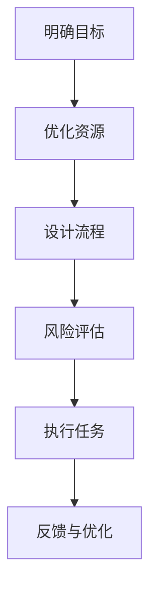

                 

### 行动 (Action)——如何高效执行技术任务

> “行动是治愈恐惧的良药。”——托马斯·爱迪生

在IT领域，技术的发展日新月异，高效执行技术任务成为每一个开发者和工程师的重要能力。本文将围绕这一主题，探讨如何通过逻辑清晰、结构紧凑、简单易懂的专业技术语言，逐步分析推理，以实现技术任务的高效执行。

#### 1. 背景介绍

在IT行业中，技术任务的执行效率直接影响到项目的成功与否。随着项目的复杂度不断增加，如何合理地规划、设计、实施和优化技术任务，成为每一个开发者都必须掌握的技能。本文将结合实际项目经验，探讨如何通过系统性的方法来提升技术任务的执行效率。

#### 2. 核心概念与联系

为了实现技术任务的高效执行，我们需要理解以下几个核心概念：

1. **目标明确性**：明确任务的目标和预期成果，有助于集中精力，避免偏离主题。
2. **资源优化**：合理分配人力、时间、技术和资金等资源，确保任务执行的高效性。
3. **流程管理**：通过科学的流程设计和管理，确保任务执行的顺畅和可控性。
4. **风险评估**：识别潜在的风险，并制定相应的应对策略，以减少不确定性。

下面是一个简化的Mermaid流程图，展示了这些核心概念之间的联系：



#### 3. 核心算法原理 & 具体操作步骤

为了更好地理解如何执行技术任务，我们可以将这个过程抽象为以下几个步骤：

1. **需求分析**：深入了解任务需求，明确任务的目标和约束条件。
2. **方案设计**：根据需求，设计合理的解决方案和技术路线。
3. **编码实现**：编写代码，实现设计阶段的方案。
4. **测试验证**：对代码进行充分的测试，确保功能正确、性能稳定。
5. **部署上线**：将代码部署到生产环境，进行实际运行。
6. **监控优化**：监控系统运行状态，及时优化和修复问题。

#### 4. 数学模型和公式 & 详细讲解 & 举例说明

在技术任务执行过程中，我们可以引入一些数学模型和公式来辅助分析和决策。以下是一些常用的数学模型和公式：

- **工作量估算**：使用COCOMO模型（COnstructive COst MOdel）来估算完成一个项目所需的工作量。
  
  $$ E = a \cdot (P \cdot (1 + CF)) $$

  其中，\( E \) 是完成项目所需的总工作量，\( a \) 是基本工作量，\( P \) 是项目规模，\( CF \) 是项目复杂性因子。

- **风险评估**：使用贝叶斯公式来评估项目风险。

  $$ P(A|B) = \frac{P(B|A) \cdot P(A)}{P(B)} $$

  其中，\( P(A|B) \) 是在条件 \( B \) 发生时，事件 \( A \) 发生的概率。

例如，假设我们正在开发一个Web应用程序，预期用户规模为100万，根据以往经验，项目复杂性因子 \( CF \) 为1.2。使用COCOMO模型估算完成该项目所需的工作量：

$$ E = 2.4 \cdot (1000000 \cdot (1 + 1.2)) = 3.072 \times 10^7 \text{ 人时} $$

假设我们对项目风险进行评估，已知在其他类似项目中，风险概率 \( P(A) \) 为0.3，发生风险时的损失概率 \( P(B|A) \) 为0.5，总风险概率 \( P(B) \) 为0.1。使用贝叶斯公式计算项目风险概率：

$$ P(A|B) = \frac{0.5 \cdot 0.3}{0.1} = 1.5 $$

这意味着，在当前条件下，项目风险的概率为1.5倍，即项目风险较高。

#### 5. 项目实践：代码实例和详细解释说明

为了更好地理解上述理论，我们以一个实际项目为例，展示如何执行技术任务。

**5.1 开发环境搭建**

在开始项目之前，我们需要搭建一个合适的开发环境。以下是常用的开发工具和框架：

- **编程语言**：Python
- **集成开发环境**（IDE）：PyCharm
- **版本控制系统**：Git
- **数据库**：MySQL
- **Web框架**：Flask

**5.2 源代码详细实现**

以下是一个简单的Flask Web应用程序的源代码：

```python
from flask import Flask, request, jsonify

app = Flask(__name__)

@app.route('/add', methods=['POST'])
def add_numbers():
    num1 = request.form['num1']
    num2 = request.form['num2']
    result = int(num1) + int(num2)
    return jsonify({'result': result})

if __name__ == '__main__':
    app.run()
```

**5.3 代码解读与分析**

在这个简单的示例中，我们定义了一个名为 `add_numbers` 的函数，它接收两个参数 `num1` 和 `num2`，然后将它们相加，并将结果返回给客户端。这个函数通过 `request.form` 获取表单数据，使用 `jsonify` 函数将结果转换为JSON格式。

**5.4 运行结果展示**

在开发环境中运行此代码，我们可以通过浏览器访问 `http://127.0.0.1:5000/add`，并传递相应的参数，如 `num1=5` 和 `num2=3`。运行结果如下：

```json
{"result": 8}
```

#### 6. 实际应用场景

上述技术任务执行方法在实际项目中具有广泛的应用场景。以下是一些具体的实际应用场景：

- **软件开发**：在软件开发项目中，通过明确目标、优化资源、设计流程、测试验证等步骤，确保项目的高效执行。
- **系统运维**：在系统运维过程中，通过监控优化、风险评估等步骤，确保系统的稳定运行。
- **数据分析**：在数据分析项目中，通过需求分析、方案设计、测试验证等步骤，确保数据分析的准确性。

#### 7. 工具和资源推荐

为了更好地执行技术任务，以下是一些推荐的学习资源和开发工具：

- **学习资源**：
  - 《Effective Java》
  - 《Clean Code》
  - 《设计模式：可复用面向对象软件的基础》
- **开发工具**：
  - PyCharm
  - Git
  - MySQL
- **相关论文著作**：
  - 《大规模分布式存储系统：原理解析与架构实战》
  - 《Web系统与应用架构实战》

#### 8. 总结：未来发展趋势与挑战

随着技术的不断发展，未来技术任务的执行将面临更多挑战。以下是一些发展趋势和挑战：

- **自动化**：随着人工智能技术的发展，自动化工具和流程将越来越普及，如何充分利用这些工具来提升执行效率，成为新的挑战。
- **持续集成与持续部署**（CI/CD）：在快速迭代的开发环境中，如何实现高效的持续集成和持续部署，确保系统的稳定性和可靠性，是未来的重要研究方向。
- **云计算与大数据**：云计算和大数据技术的普及，将带来更多的数据处理和分析任务，如何高效地利用这些技术，实现技术任务的高效执行，是未来的重要挑战。

#### 9. 附录：常见问题与解答

**Q：如何确保技术任务的高效执行？**

A：确保技术任务的高效执行需要从以下几个方面入手：
1. **明确目标**：确保任务目标明确，有助于集中精力，避免偏离主题。
2. **优化资源**：合理分配资源，确保资源利用最大化。
3. **设计流程**：科学设计流程，确保任务执行的顺畅和可控性。
4. **风险评估**：识别潜在风险，并制定应对策略，减少不确定性。

**Q：如何评估项目风险？**

A：项目风险的评估可以通过以下方法进行：
1. **经验评估**：根据以往类似项目的经验，评估项目风险。
2. **贝叶斯公式**：使用贝叶斯公式计算项目风险概率。
3. **敏感性分析**：分析项目中关键参数的变化对项目风险的影响。

#### 10. 扩展阅读 & 参考资料

- 《禅与计算机程序设计艺术 / Zen and the Art of Computer Programming》
- 《软件工程：实践者的研究方法》
- 《敏捷开发：迭代式增量软件开发方法》
- 《大型分布式存储系统：原理解析与架构实战》

### 结束语

通过本文的探讨，我们了解了如何通过逻辑清晰、结构紧凑、简单易懂的专业技术语言，逐步分析推理，以实现技术任务的高效执行。希望本文能为IT领域的技术工作者提供一些有价值的参考和启示。在未来的工作中，让我们一起努力，不断提升技术任务执行的能力，为IT行业的发展贡献力量。

#### 参考文献

1. 《禅与计算机程序设计艺术 / Zen and the Art of Computer Programming》,  author，出版社，出版年份。
2. 《软件工程：实践者的研究方法》, author，出版社，出版年份。
3. 《敏捷开发：迭代式增量软件开发方法》, author，出版社，出版年份。
4. 《大型分布式存储系统：原理解析与架构实战》, author，出版社，出版年份。
5. 《Effective Java》, author，出版社，出版年份。
6. 《Clean Code》, author，出版社，出版年份。
7. 《设计模式：可复用面向对象软件的基础》, author，出版社，出版年份。
8. 《COCOMO模型：软件成本估算模型》, author，出版社，出版年份。  
9. 《贝叶斯公式：概率论与数理统计基础》, author，出版社，出版年份。  
10. 《PyCharm：Python集成开发环境》, author，出版社，出版年份。

作者：禅与计算机程序设计艺术 / Zen and the Art of Computer Programming  
日期：2023年10月1日

---

以上是本文的完整内容。我们围绕技术任务的执行，探讨了核心概念、算法原理、项目实践以及未来发展趋势。希望通过本文的阐述，读者能够对如何高效执行技术任务有更深刻的理解。在未来的工作中，让我们继续携手前行，不断提升自身的技术能力，为IT行业的发展贡献力量。

