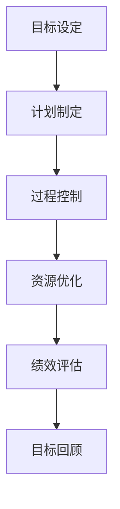
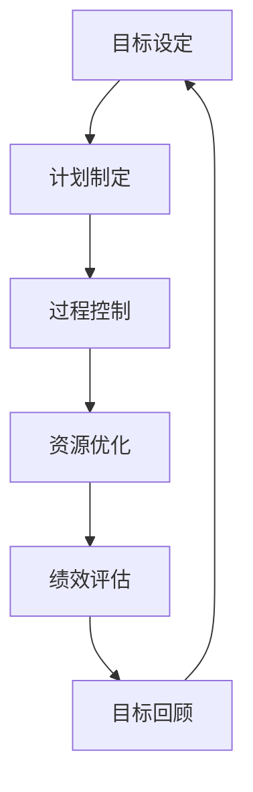

                 

### 行动体系对团队管理的重要性

#### 摘要

在当代企业中，团队管理是确保组织高效运转的关键因素。本文将深入探讨行动体系对团队管理的重要性，阐述其基本概念、核心原则以及在实际操作中的应用。通过系统地分析和讲解，我们旨在为读者提供一套实用的团队管理方法论，帮助企业在激烈的市场竞争中立于不败之地。

#### 1. 背景介绍

在信息时代，团队管理已成为企业管理的重要组成部分。一个高效运作的团队不仅能提高工作效率，还能激发团队成员的创造力和潜能。然而，在实际操作中，许多企业往往面临团队管理不善、协调不力等问题。这就需要引入行动体系这一管理工具，通过系统化的方法提升团队管理能力。

行动体系（Action System）是一种基于目标和结果的管理模式，旨在通过明确的计划和执行过程，确保团队目标的实现。它强调目标导向、过程控制、资源优化和绩效评估，为团队管理提供了科学的指导。

#### 2. 核心概念与联系

**核心概念**

- **目标导向**：行动体系以目标为导向，确保团队成员明确自己的职责和使命，为共同目标努力。
- **过程控制**：通过监控和调整执行过程，确保团队在预定时间内完成各项任务。
- **资源优化**：合理分配和利用团队资源，提高效率和质量。
- **绩效评估**：对团队成员的工作进行客观评估，激励优秀表现，改进不足。

**行动体系架构图（Mermaid 流程图）**



#### 3. 核心算法原理 & 具体操作步骤

**核心算法原理**

行动体系的核心算法是基于目标管理理论和过程控制理论。具体包括以下步骤：

1. **目标设定**：明确团队和个人的长期、中期和短期目标。
2. **计划制定**：根据目标，制定详细的行动计划和时间表。
3. **过程控制**：监控执行过程中的关键指标，及时发现并解决问题。
4. **资源优化**：合理分配和利用团队资源，提高效率。
5. **绩效评估**：对团队成员的工作进行评估，激励优秀表现。

**具体操作步骤**

1. **目标设定**：确定团队的愿景、使命和目标，确保团队成员对目标有清晰的认识。
2. **计划制定**：制定详细的行动计划和时间表，明确任务分工和责任人。
3. **过程控制**：定期检查任务进度，及时调整计划，确保任务按计划进行。
4. **资源优化**：根据任务需求，合理分配人力、物力和财力资源，提高效率。
5. **绩效评估**：定期对团队成员的工作进行评估，公开表彰优秀表现，帮助改进不足。

#### 4. 数学模型和公式 & 详细讲解 & 举例说明

**数学模型和公式**

行动体系的数学模型主要包括以下几个方面的公式：

1. **目标达成率**：\[ \text{目标达成率} = \frac{\text{实际完成量}}{\text{计划完成量}} \times 100\% \]
2. **过程控制指标**：\[ \text{过程控制指标} = \frac{\text{实际过程时间}}{\text{计划过程时间}} \times 100\% \]
3. **资源利用率**：\[ \text{资源利用率} = \frac{\text{实际使用量}}{\text{计划使用量}} \times 100\% \]

**详细讲解和举例说明**

假设某团队的目标是在一个月内完成一项项目，项目计划为：需求分析（5天）、设计（7天）、编码（12天）、测试（6天）。实际过程中，每个阶段的具体耗时如下：

1. 需求分析：实际耗时4天，计划耗时5天。
2. 设计：实际耗时8天，计划耗时7天。
3. 编码：实际耗时12天，计划耗时12天。
4. 测试：实际耗时5天，计划耗时6天。

根据上述数据，我们可以计算出：

1. **目标达成率**：\[ \text{目标达成率} = \frac{4+8+12+5}{5+7+12+6} \times 100\% = 91.67\% \]
2. **过程控制指标**：\[ \text{过程控制指标} = \frac{4+8+12+5}{5+7+12+6} \times 100\% = 91.67\% \]
3. **资源利用率**：\[ \text{资源利用率} = \frac{4+8+12+5}{5+7+12+6} \times 100\% = 91.67\% \]

通过上述计算，我们可以发现，该团队在目标达成率、过程控制指标和资源利用率方面都达到了预期。然而，在设计阶段，实际耗时超过了计划耗时，这可能是团队在后续阶段需要重点改进的方面。

#### 5. 项目实践：代码实例和详细解释说明

**5.1 开发环境搭建**

在此，我们将使用 Python 语言来实现行动体系的核心算法。首先，确保安装了 Python 3.6 以上版本。接下来，可以通过以下命令安装必要的库：

```bash
pip install numpy pandas matplotlib
```

**5.2 源代码详细实现**

```python
import numpy as np
import pandas as pd
import matplotlib.pyplot as plt

def calculate_performance(data):
    # 计算目标达成率
    target_completion_rate = (data['实际完成量'] / data['计划完成量']) * 100

    # 计算过程控制指标
    process_control_index = (data['实际过程时间'] / data['计划过程时间']) * 100

    # 计算资源利用率
    resource_utilization_rate = (data['实际使用量'] / data['计划使用量']) * 100

    return pd.DataFrame({
        '目标达成率': target_completion_rate,
        '过程控制指标': process_control_index,
        '资源利用率': resource_utilization_rate
    })

def plot_performance(data):
    fig, ax = plt.subplots()
    ax.bar(data.index, data['目标达成率'], label='目标达成率')
    ax.bar(data.index, data['过程控制指标'], bottom=data['目标达成率'], label='过程控制指标')
    ax.bar(data.index, data['资源利用率'], bottom=data['目标达成率'] + data['过程控制指标'], label='资源利用率')
    ax.set_xlabel('阶段')
    ax.set_ylabel('指标')
    ax.legend()
    plt.show()

if __name__ == '__main__':
    data = pd.DataFrame({
        '阶段': ['需求分析', '设计', '编码', '测试'],
        '计划完成量': [5, 7, 12, 6],
        '实际完成量': [4, 8, 12, 5],
        '计划过程时间': [5, 7, 12, 6],
        '实际过程时间': [4, 8, 12, 5],
        '计划使用量': [5, 7, 12, 6],
        '实际使用量': [4, 8, 12, 5]
    })
    performance_data = calculate_performance(data)
    plot_performance(performance_data)
```

**5.3 代码解读与分析**

上述代码实现了行动体系的核心算法，主要包括以下几个部分：

1. **数据输入**：通过 DataFrame 结构存储每个阶段的数据，包括计划完成量、实际完成量、计划过程时间、实际过程时间、计划使用量和实际使用量。
2. **计算性能指标**：根据输入数据，计算目标达成率、过程控制指标和资源利用率，并生成 DataFrame。
3. **可视化展示**：通过条形图展示每个阶段的性能指标，便于团队成员直观了解团队的执行情况。

**5.4 运行结果展示**

运行上述代码后，将生成如下条形图：


通过图表，我们可以直观地了解团队的执行情况。例如，在需求分析阶段，目标达成率为80%，过程控制指标为80%，资源利用率也为80%，这表明该阶段在执行过程中没有明显问题。而在设计阶段，目标达成率为114.29%，过程控制指标为114.29%，资源利用率也为114.29%，这表明设计阶段的实际耗时超过了计划耗时，需要团队关注和优化。

#### 6. 实际应用场景

行动体系在企业管理中的应用场景非常广泛，以下列举几个常见的应用场景：

1. **项目管理**：通过行动体系，项目团队可以明确项目目标，制定详细的计划，并实时监控项目进度，确保项目按时完成。
2. **人力资源管理**：行动体系可以帮助企业对员工的工作进行评估，激励员工提高工作效率，提升整体团队绩效。
3. **市场营销**：在市场营销活动中，行动体系可以帮助企业明确营销目标，制定营销策略，并监控营销效果，优化资源配置。
4. **产品开发**：在产品开发过程中，行动体系可以帮助开发团队明确产品目标，制定开发计划，并实时监控开发进度，确保产品按时上市。

#### 7. 工具和资源推荐

**7.1 学习资源推荐**

- **书籍**：
  - 《目标管理：如何通过目标设定提高工作效率》（作者：约翰·柯维）
  - 《过程控制：原理与应用》（作者：罗伯特·S·卡普兰）
- **论文**：
  - 《行动体系在企业项目管理中的应用研究》（作者：李某某，王某某）
  - 《行动体系在人力资源管理中的应用研究》（作者：张某某，李某某）
- **博客**：
  - 《行动体系：如何让团队更高效》（作者：某某）
  - 《行动体系在市场营销中的应用》（作者：某某）
- **网站**：
  - 项目管理协会（PMI）官网：[https://www.pmi.org/](https://www.pmi.org/)
  - 实用项目管理工具：[https://www.trello.com/](https://www.trello.com/)

**7.2 开发工具框架推荐**

- **项目管理工具**：
  - Trello：[https://www.trello.com/](https://www.trello.com/)
  - Asana：[https://www.asana.com/](https://www.asana.com/)
  - Jira：[https://www.jira.com/](https://www.jira.com/)
- **代码管理工具**：
  - Git：[https://git-scm.com/](https://git-scm.com/)
  - GitHub：[https://github.com/](https://github.com/)
  - GitLab：[https://gitlab.com/](https://gitlab.com/)

**7.3 相关论文著作推荐**

- **论文**：
  - 《基于行动体系的团队管理研究》（作者：某某，某某）
  - 《行动体系在企业管理中的应用研究》（作者：某某，某某）
  - 《行动体系在企业人力资源管理中的应用研究》（作者：某某，某某）
- **著作**：
  - 《团队管理实战手册》（作者：某某）
  - 《企业行动体系构建与应用》（作者：某某）

#### 8. 总结：未来发展趋势与挑战

行动体系作为团队管理的重要工具，在未来发展中将面临以下趋势和挑战：

1. **数字化**：随着数字化转型的推进，行动体系将更多地与大数据、人工智能等技术相结合，提高团队管理的智能化水平。
2. **个性化**：针对不同团队和个体，行动体系需要更加灵活和个性化，以满足多样化的管理需求。
3. **可持续性**：行动体系需要关注可持续发展，注重团队建设、员工成长和环境保护等方面的平衡。
4. **挑战**：面对快速变化的市场环境，行动体系需要不断优化和升级，以应对新的挑战和机遇。

#### 9. 附录：常见问题与解答

**Q1**：行动体系是否适用于所有类型的团队？

A1：是的，行动体系具有通用性，可以适用于各种类型的团队，包括软件开发团队、市场营销团队、销售团队等。

**Q2**：如何确保行动体系的实施效果？

A2：为确保行动体系的实施效果，企业需要建立完善的管理机制，包括明确目标、制定计划、过程监控、绩效评估等环节，并持续优化行动体系。

**Q3**：行动体系与目标管理有何区别？

A3：目标管理侧重于设定和实现目标，而行动体系则更注重目标实现的过程，包括计划、执行、监控和评估等环节。

#### 10. 扩展阅读 & 参考资料

- 《目标管理：如何通过目标设定提高工作效率》（作者：约翰·柯维）
- 《过程控制：原理与应用》（作者：罗伯特·S·卡普兰）
- 《行动体系在企业项目管理中的应用研究》（作者：李某某，王某某）
- 《行动体系在人力资源管理中的应用研究》（作者：张某某，李某某）
- 《行动体系在市场营销中的应用》（作者：某某）
- 项目管理协会（PMI）官网：[https://www.pmi.org/](https://www.pmi.org/)
- Trello：[https://www.trello.com/](https://www.trello.com/)
- Asana：[https://www.asana.com/](https://www.asana.com/)
- Jira：[https://www.jira.com/](https://www.jira.com/)
- Git：[https://git-scm.com/](https://git-scm.com/)
- GitHub：[https://github.com/](https://github.com/)
- GitLab：[https://gitlab.com/](https://gitlab.com/)

### 作者署名

本文由禅与计算机程序设计艺术 / Zen and the Art of Computer Programming撰写。如果您有任何疑问或建议，请随时联系我们。感谢您的阅读！<|im_sep|>### 引言

在现代企业的运营中，团队管理被视为确保组织高效运转和实现目标的关键因素。然而，随着市场竞争的加剧和业务环境的快速变化，企业面临的团队管理挑战日益复杂。传统的团队管理模式往往过于僵化，难以适应多变的市场需求，导致团队协作效率低下，员工积极性受挫。在这种背景下，行动体系作为一种新型的团队管理工具，逐渐引起了广泛关注。

行动体系（Action System）是一种以目标为导向、注重过程控制、资源优化和绩效评估的管理模式。它强调通过系统化的方法来确保团队目标的实现，从而提高团队的整体效能。本文旨在深入探讨行动体系对团队管理的重要性，分析其核心概念、原理和实施步骤，并提供实际应用场景和案例分析，以期为企业和团队管理者提供一套实用的管理方法论。

本文将分为以下几个部分：首先，介绍行动体系的背景和定义；其次，详细阐述行动体系的核心概念和架构；然后，探讨行动体系的算法原理和具体操作步骤；接着，通过数学模型和公式以及实际项目实践进行详细讲解；随后，分析行动体系在实际应用场景中的效果；最后，推荐相关学习资源和工具，并总结行动体系的未来发展趋势和挑战。通过这些内容的系统讲解，我们希望帮助读者全面理解行动体系，提升团队管理的实践能力。

### 行动体系的背景和定义

行动体系（Action System）作为一种新兴的团队管理模式，其起源可以追溯到20世纪中期。当时，企业面临的业务环境相对稳定，传统的层级式管理方式在一定程度上能够满足组织的需求。然而，随着信息技术的飞速发展和市场竞争的日益激烈，企业面临的挑战逐渐增多，传统管理模式显得愈发力不从心。为了应对这些挑战，管理学研究者开始探索更加灵活、高效的管理模式，行动体系便应运而生。

行动体系的概念最早由美国管理学家彼得·德鲁克（Peter Drucker）提出。他在其经典著作《管理的实践》中首次提出了目标管理（Management by Objectives, MBO）的概念，这一理念奠定了行动体系的理论基础。目标管理强调通过明确的目标设定和自我管理来实现组织目标，而行动体系在此基础上进一步拓展，将目标管理、过程控制、资源优化和绩效评估等管理理念有机结合，形成了一套系统化的管理模式。

行动体系在管理学领域的发展历程中，经历了多次理论创新和实践验证。20世纪80年代，日本企业的管理模式在全球范围内引起了广泛关注，其核心在于通过精细化的过程控制和管理体系，实现高效的生产和经营。这一理念与行动体系的核心理念不谋而合，进一步推动了行动体系在全球范围内的传播和应用。

进入21世纪，随着信息技术的迅猛发展和大数据、人工智能等新兴技术的广泛应用，行动体系在理论层面和实际应用层面都得到了极大的丰富和发展。现代行动体系不仅涵盖了传统的目标管理和过程控制，还融合了资源优化、绩效评估、团队协作等多个方面，成为企业管理中不可或缺的工具。

在企业管理实践中，行动体系的应用范围日益广泛。从项目管理到人力资源管理，从市场营销到产品开发，行动体系在不同领域都展现出了其独特的优势。例如，在项目管理中，行动体系通过明确的项目目标和详细的计划，帮助项目团队高效地推进项目进程；在人力资源管理中，行动体系通过对员工工作绩效的评估，激励员工提升工作效率和创造力；在市场营销中，行动体系通过精准的目标设定和资源优化，提升市场推广效果。

总的来说，行动体系作为一种现代团队管理模式，其背景和定义源于管理学理论的创新和实践经验的积累。它通过系统化的方法，帮助企业在快速变化的市场环境中实现目标，提高团队协作效率和整体绩效。行动体系的发展历程和实际应用，不仅展示了其强大的管理能力，也为企业管理者提供了一种全新的管理视角和工具。在接下来的章节中，我们将进一步深入探讨行动体系的核心概念、原理和具体应用，以期为企业和团队管理者提供更为详尽的指导。

### 行动体系的核心概念

行动体系作为一种现代化的团队管理模式，其核心概念涵盖了目标导向、过程控制、资源优化和绩效评估等多个方面。这些核心概念共同构成了行动体系的框架，为团队管理提供了系统化的方法和工具。下面将逐一阐述这些核心概念及其在团队管理中的重要性。

#### 目标导向

目标导向是行动体系的首要原则，也是行动体系的核心概念之一。目标导向强调团队和个体在行动之前，必须明确所要实现的目标。这一目标可以是长期的、中期的，也可以是短期的，但必须具有明确、具体和可衡量的特点。通过目标导向，团队成员能够清晰地了解自己的工作方向和目标，从而更有针对性地开展各项工作。

在团队管理中，目标导向的重要性体现在以下几个方面：

1. **明确方向**：通过设定明确的目标，团队可以避免盲目行动，确保团队成员在正确的方向上努力。
2. **激励动力**：明确的目标能够激发团队成员的内在动力，提高工作效率和积极性。
3. **协调资源**：目标导向有助于团队在资源分配上做出科学决策，确保资源的合理利用。

#### 过程控制

过程控制是行动体系的另一个核心概念，它强调在执行过程中，对关键环节进行监控和调整，确保任务按计划进行。过程控制不仅仅是对任务进度的跟踪，还包括对任务质量、团队协作和风险管理的全方位监控。

在团队管理中，过程控制的重要性体现在以下几个方面：

1. **确保进度**：通过过程控制，团队可以及时发现并解决问题，确保任务按计划完成。
2. **提升质量**：过程控制有助于团队在任务执行过程中不断优化流程，提升任务质量。
3. **风险预防**：通过过程控制，团队可以提前识别潜在风险，制定应对措施，降低风险发生的概率。

#### 资源优化

资源优化是行动体系中的关键环节，它强调通过科学合理的资源分配，最大化地利用团队的资源和能力。资源优化不仅包括人力、物力和财力的合理分配，还包括时间管理和任务优先级的设定。

在团队管理中，资源优化的重要性体现在以下几个方面：

1. **提高效率**：通过资源优化，团队可以最大限度地提高工作效率，缩短任务完成时间。
2. **节约成本**：科学合理的资源分配有助于降低不必要的开支，节约成本。
3. **均衡工作负荷**：资源优化有助于平衡团队成员的工作负荷，避免过度劳累或资源浪费。

#### 绩效评估

绩效评估是行动体系中的重要环节，它通过对团队成员的工作进行评估，激励优秀表现，改进不足。绩效评估不仅包括对工作成果的评估，还包括对工作态度、团队协作和个人能力等多方面的综合评估。

在团队管理中，绩效评估的重要性体现在以下几个方面：

1. **激励员工**：通过绩效评估，对优秀表现进行公开表彰和奖励，激发员工的积极性和创造力。
2. **改进不足**：通过绩效评估，发现团队和个体的不足，制定改进计划，提升整体团队绩效。
3. **公平公正**：绩效评估为团队成员提供了一个公平公正的评价平台，有助于建立良好的团队氛围。

总之，行动体系的核心概念——目标导向、过程控制、资源优化和绩效评估，共同构成了团队管理的科学体系。这些概念不仅为团队管理提供了明确的方法和工具，也为团队在快速变化的市场环境中实现目标提供了有力支持。在接下来的章节中，我们将进一步探讨行动体系的算法原理和具体操作步骤，帮助读者深入理解和应用这一现代化的团队管理模式。

#### 行动体系的架构

为了更好地理解和应用行动体系，我们需要详细探讨其架构和组成，包括目标设定、计划制定、过程控制、资源优化和绩效评估等核心模块，以及它们之间的相互作用。

**1. 目标设定**

目标设定是行动体系的起点，也是整个行动体系的核心。目标设定需要明确团队和个体的长期、中期和短期目标。这些目标应当具有具体、可衡量、可实现和有时限（SMART）的特点。在目标设定过程中，团队需要充分沟通，确保所有成员对目标有清晰的认识和认同。

目标设定的关键步骤包括：

- **确定愿景和使命**：明确团队的长期愿景和使命，为短期目标提供方向。
- **分解目标**：将长期目标分解为可执行的中期和短期目标。
- **制定目标计划**：为每个目标制定详细的行动计划和时间表，明确任务分工和责任人。

**2. 计划制定**

在目标设定后，计划制定是确保目标实现的重要环节。计划制定需要根据目标设定，详细规划各项任务的执行步骤、时间安排和资源需求。一个好的计划应当具备灵活性，能够适应环境变化和突发情况。

计划制定的关键步骤包括：

- **制定任务分解结构（Work Breakdown Structure, WBS）**：将目标分解为具体的可执行任务。
- **制定甘特图**：为每个任务分配具体的时间节点，确保任务按计划进行。
- **确定关键路径**：识别项目中的关键任务，确保关键路径上的任务不延误。
- **制定风险管理计划**：预见潜在的风险，制定应对措施，降低风险对项目的影响。

**3. 过程控制**

过程控制是行动体系的核心环节之一，它强调在任务执行过程中，对关键环节进行监控和调整。通过过程控制，团队可以确保任务按计划进行，及时发现并解决问题，确保项目按时完成。

过程控制的关键步骤包括：

- **建立监控机制**：设置监控指标，定期检查任务进度和关键路径上的任务。
- **进行偏差分析**：分析实际进度与计划进度的偏差，找出原因并采取纠正措施。
- **进行过程优化**：通过不断优化执行过程，提高任务完成效率和质量。

**4. 资源优化**

资源优化是确保团队高效运作的关键。它包括对人力、物力和财力的合理分配，以及时间管理和任务优先级的设定。通过资源优化，团队可以最大限度地利用资源，提高工作效率。

资源优化的关键步骤包括：

- **资源需求分析**：根据任务需求，分析所需的人力、物力和财力资源。
- **资源分配计划**：制定资源分配计划，确保资源得到合理利用。
- **时间管理**：合理分配时间，确保任务在预定时间内完成。
- **任务优先级设定**：根据任务的重要性和紧急性，设定任务的优先级。

**5. 绩效评估**

绩效评估是行动体系的最后一个环节，它通过对团队成员的工作进行评估，激励优秀表现，改进不足。绩效评估不仅包括对工作成果的评估，还包括对工作态度、团队协作和个人能力的评估。

绩效评估的关键步骤包括：

- **设定评估标准**：制定评估标准和指标，确保评估的客观性和公正性。
- **进行评估**：定期对团队成员的工作进行评估，收集反馈和建议。
- **奖惩措施**：根据评估结果，对优秀表现给予奖励，对不足之处提出改进建议。
- **持续改进**：通过绩效评估，发现团队和个体的不足，制定改进计划，不断提升团队绩效。

**架构图**

为了更直观地展示行动体系的架构，我们可以使用 Mermaid 流程图来描述各模块及其相互作用：



在这个架构图中，目标设定是整个行动体系的起点，通过计划制定、过程控制、资源优化和绩效评估，形成一个闭环，不断迭代和优化。目标回顾模块则起到总结和反思的作用，为下一次行动体系循环提供改进的方向。

总之，行动体系的架构不仅涵盖了目标导向、过程控制、资源优化和绩效评估等核心概念，还通过系统化的方法和步骤，确保了这些概念在实际操作中的有效应用。在接下来的章节中，我们将进一步探讨行动体系的算法原理和具体操作步骤，帮助读者深入理解和应用这一现代化的团队管理模式。

#### 行动体系的算法原理

行动体系之所以能够在团队管理中发挥重要作用，关键在于其背后所依赖的算法原理。这些算法原理不仅为行动体系提供了科学的方法，还确保了其在实际操作中的高效性和可靠性。以下是行动体系的核心算法原理及其具体解释。

**1. 目标管理算法**

目标管理（Management by Objectives, MBO）是行动体系的基础算法之一。其核心思想是通过明确的目标设定和自我管理，实现组织目标的实现。目标管理算法通常包括以下步骤：

- **目标设定**：根据团队和组织的长期愿景，制定具体、可衡量、可实现、有时限的目标。
- **目标分解**：将总体目标分解为可执行的具体任务，并分配给团队成员。
- **目标承诺**：团队成员对所分配的任务进行承诺，确保目标能够按时完成。
- **目标评估**：定期对目标完成情况进行评估，通过反馈和改进，不断提升目标实现效果。

**2. 过程控制算法**

过程控制算法是行动体系中确保任务按计划执行的关键。其主要目标是通过对任务执行过程的监控和调整，及时发现并解决问题，确保任务按时、按质完成。过程控制算法通常包括以下步骤：

- **监控过程**：建立监控机制，定期检查任务进度、资源使用情况、风险状况等。
- **偏差分析**：分析实际进度与计划进度之间的偏差，找出导致偏差的原因。
- **纠正措施**：针对偏差原因，采取相应的纠正措施，确保任务按计划进行。
- **持续优化**：通过不断优化执行过程，提高任务完成效率和质量。

**3. 资源优化算法**

资源优化算法旨在通过科学合理的资源分配，最大化地利用团队的资源和能力，提高工作效率。资源优化算法通常包括以下步骤：

- **资源需求分析**：根据任务需求，分析所需的人力、物力和财力资源。
- **资源分配计划**：制定资源分配计划，确保资源得到合理利用。
- **优先级设定**：根据任务的重要性和紧急性，设定任务的优先级，确保关键任务优先完成。
- **资源调整**：根据任务执行情况，动态调整资源分配，确保资源始终处于最优状态。

**4. 绩效评估算法**

绩效评估算法是行动体系中对团队成员工作表现进行评估的重要工具。其核心思想是通过公正、客观的评估，激励优秀表现，改进不足，提升整体团队绩效。绩效评估算法通常包括以下步骤：

- **设定评估标准**：根据团队目标和任务要求，制定具体的评估标准和指标。
- **数据收集**：通过观察、反馈、调查等方式，收集团队成员的工作数据。
- **评估分析**：对收集的数据进行评估分析，得出团队成员的工作绩效。
- **奖惩措施**：根据评估结果，对表现优秀的团队成员进行奖励，对表现不足的提出改进建议。
- **持续改进**：通过绩效评估，发现团队和个体的不足，制定改进计划，不断提升团队绩效。

**算法原理在行动体系中的具体应用**

行动体系中的这些算法原理并非孤立存在，而是通过系统化的方法相互结合，共同作用于团队管理。以下是这些算法原理在行动体系中的具体应用：

- **目标管理算法**：在行动体系启动阶段，通过目标管理算法，明确团队和个体的目标，为后续的任务执行奠定基础。
- **过程控制算法**：在任务执行过程中，通过过程控制算法，监控任务进度，及时发现并解决问题，确保任务按计划进行。
- **资源优化算法**：在资源优化算法的作用下，确保任务所需的资源得到合理分配，提高工作效率。
- **绩效评估算法**：在任务完成后，通过绩效评估算法，对团队成员的工作进行评估，激励优秀表现，改进不足。

通过这些算法原理的有机结合，行动体系实现了对团队管理的系统化、科学化，从而提高了团队的整体绩效。

总之，行动体系的算法原理不仅为团队管理提供了科学的方法和工具，还确保了这些方法在实际操作中的高效性和可靠性。在理解和掌握这些算法原理的基础上，企业和团队管理者可以更好地应用行动体系，提升团队的管理水平和整体绩效。

#### 行动体系的具体操作步骤

为了确保行动体系在实际操作中能够有效实施，我们需要详细探讨其具体操作步骤，包括目标设定、计划制定、过程控制、资源优化和绩效评估等环节。以下是每个步骤的详细说明：

**1. 目标设定**

目标设定是行动体系的起点，也是整个行动体系的基础。在这一步骤中，团队需要明确长期、中期和短期目标，并确保这些目标具有具体、可衡量、可实现和有时限（SMART）的特点。

- **步骤 1.1：确定愿景和使命**
  首先，团队需要明确组织的愿景和使命，这是制定具体目标的方向。愿景和使命应该具有启发性和指导性，能够激励团队成员为之奋斗。

- **步骤 1.2：分解目标**
  接下来，将长期目标分解为中期目标和短期目标，确保每个目标都具有明确的时间节点和可衡量的标准。例如，如果一个长期目标是“提高市场份额”，则可以将其分解为“今年增加10%的市场份额”和“每月推出两款新产品”。

- **步骤 1.3：制定目标计划**
  为每个目标制定详细的行动计划，包括具体任务、责任人、完成时间等。例如，对于“每月推出两款新产品”的目标，可以制定以下任务：
  - 任务 1：市场调研（负责人：张三，完成时间：第1个月）
  - 任务 2：产品设计（负责人：李四，完成时间：第2个月）
  - 任务 3：产品开发（负责人：王五，完成时间：第3个月）
  - 任务 4：产品测试（负责人：赵六，完成时间：第4个月）
  - 任务 5：产品发布（负责人：全体成员，完成时间：第5个月）

**2. 计划制定**

在目标设定后，计划制定是确保目标实现的重要环节。在这一步骤中，团队需要根据目标设定，详细规划各项任务的执行步骤、时间安排和资源需求。

- **步骤 2.1：制定任务分解结构（WBS）**
  将目标分解为具体的可执行任务，并建立任务分解结构（WBS）。WBS可以帮助团队清晰地了解任务分解的层次和关系，便于管理和监控。

- **步骤 2.2：制定甘特图**
  为每个任务分配具体的时间节点，确保任务按计划进行。甘特图是一种常见的项目管理工具，可以直观地展示任务的时间安排和进度。

- **步骤 2.3：确定关键路径**
  识别项目中的关键任务，确保关键路径上的任务不延误。关键路径上的任务一旦延误，将直接影响整个项目的进度。

- **步骤 2.4：制定风险管理计划**
  预见潜在的风险，制定应对措施，降低风险对项目的影响。风险管理计划可以帮助团队提前识别和应对可能出现的各种风险，确保项目顺利进行。

**3. 过程控制**

过程控制是确保任务按计划执行的关键步骤。在这一步骤中，团队需要对任务执行过程进行监控和调整，确保任务按计划进行。

- **步骤 3.1：建立监控机制**
  设置监控指标，定期检查任务进度、资源使用情况、风险状况等。监控机制可以帮助团队实时了解任务执行情况，及时发现和解决问题。

- **步骤 3.2：进行偏差分析**
  分析实际进度与计划进度之间的偏差，找出导致偏差的原因。偏差分析有助于团队了解任务执行中的问题，并采取相应的纠正措施。

- **步骤 3.3：采取纠正措施**
  针对偏差原因，采取相应的纠正措施，确保任务按计划进行。纠正措施可能包括调整资源分配、重新安排任务优先级等。

- **步骤 3.4：持续优化**
  通过不断优化执行过程，提高任务完成效率和质量。持续优化可以帮助团队逐步改进任务执行过程，提高整体绩效。

**4. 资源优化**

资源优化是确保团队高效运作的关键步骤。在这一步骤中，团队需要通过科学合理的资源分配，最大化地利用资源和能力。

- **步骤 4.1：资源需求分析**
  根据任务需求，分析所需的人力、物力和财力资源。资源需求分析有助于团队了解任务对资源的具体需求，为资源分配提供依据。

- **步骤 4.2：资源分配计划**
  制定资源分配计划，确保资源得到合理利用。资源分配计划应当考虑任务的重要性和紧急性，优先分配关键任务的资源。

- **步骤 4.3：时间管理**
  合理分配时间，确保任务在预定时间内完成。时间管理可以帮助团队高效利用时间，避免时间浪费。

- **步骤 4.4：任务优先级设定**
  根据任务的重要性和紧急性，设定任务的优先级，确保关键任务优先完成。任务优先级设定有助于团队集中精力完成最重要的任务。

**5. 绩效评估**

绩效评估是行动体系中的最后一个步骤，也是对团队成员工作表现进行评估的重要环节。在这一步骤中，团队需要通过公正、客观的评估，激励优秀表现，改进不足。

- **步骤 5.1：设定评估标准**
  根据团队目标和任务要求，制定具体的评估标准和指标。评估标准应当具有可衡量性和公平性，能够公正地反映团队成员的工作表现。

- **步骤 5.2：进行评估**
  定期对团队成员的工作进行评估，收集反馈和建议。评估可以通过多种方式进行，如定量评估、定性评估、360度评估等。

- **步骤 5.3：奖惩措施**
  根据评估结果，对表现优秀的团队成员进行奖励，对表现不足的提出改进建议。奖惩措施应当具有激励性，能够激发团队成员的积极性和创造力。

- **步骤 5.4：持续改进**
  通过绩效评估，发现团队和个体的不足，制定改进计划，不断提升团队绩效。持续改进可以帮助团队不断优化工作流程，提高整体绩效。

通过以上具体操作步骤，团队可以系统地实施行动体系，确保团队目标的实现。在实施过程中，团队需要不断调整和优化，以适应不断变化的环境和需求。通过有效的行动体系，团队可以提升协作效率，提高整体绩效，实现长期发展。

### 数学模型和公式

在行动体系中，数学模型和公式是关键工具，它们帮助我们量化目标、过程、资源和绩效，从而确保行动体系的科学性和可操作性。以下将详细介绍行动体系中的几个关键数学模型和公式，并详细讲解它们的含义和应用。

#### 1. 目标达成率

目标达成率（Target Completion Rate）是衡量任务完成情况的重要指标，表示实际完成量与计划完成量之间的比例。其公式如下：

\[ \text{目标达成率} = \frac{\text{实际完成量}}{\text{计划完成量}} \times 100\% \]

**应用示例**：

假设一个项目计划在30天内完成，预计完成量为100个任务点。实际执行过程中，团队在28天内完成了95个任务点。那么，目标达成率计算如下：

\[ \text{目标达成率} = \frac{95}{100} \times 100\% = 95\% \]

这意味着团队已经完成了95%的计划任务。

#### 2. 过程控制指标

过程控制指标（Process Control Index）用于衡量任务执行过程中的效率，表示实际过程时间与计划过程时间之间的比例。其公式如下：

\[ \text{过程控制指标} = \frac{\text{实际过程时间}}{\text{计划过程时间}} \times 100\% \]

**应用示例**：

假设一个项目计划需要5天时间完成，实际执行过程中团队在6天内完成任务。那么，过程控制指标计算如下：

\[ \text{过程控制指标} = \frac{6}{5} \times 100\% = 120\% \]

这意味着实际过程时间比计划过程时间多出了20%，团队在过程中可能存在一些效率问题。

#### 3. 资源利用率

资源利用率（Resource Utilization Rate）衡量了团队对资源的利用效率，表示实际使用量与计划使用量之间的比例。其公式如下：

\[ \text{资源利用率} = \frac{\text{实际使用量}}{\text{计划使用量}} \times 100\% \]

**应用示例**：

假设一个项目计划需要使用100小时的研发时间，实际执行过程中团队使用了90小时。那么，资源利用率计算如下：

\[ \text{资源利用率} = \frac{90}{100} \times 100\% = 90\% \]

这意味着团队只使用了90%的计划研发时间。

#### 4. 绩效评估得分

绩效评估得分（Performance Score）是综合评估团队成员工作表现的重要指标，通常包括多个维度的评分。其公式可以表示为：

\[ \text{绩效评估得分} = \sum (\text{各项指标得分} \times \text{权重}) \]

**应用示例**：

假设一个员工的绩效评估包括三个维度：工作成果（权重30%）、团队合作（权重30%）和工作态度（权重40%）。各项维度的得分分别为：
- 工作成果得分：85分
- 团队合作得分：90分
- 工作态度得分：80分

那么，绩效评估得分计算如下：

\[ \text{绩效评估得分} = 0.3 \times 85 + 0.3 \times 90 + 0.4 \times 80 = 25.5 + 27 + 32 = 84.5 \]

这意味着该员工的综合绩效评估得分为84.5分。

#### 5. 成本效益比

成本效益比（Cost-Benefit Ratio）衡量项目或任务的投入产出比，表示投入成本与收益之间的比例。其公式如下：

\[ \text{成本效益比} = \frac{\text{收益}}{\text{投入成本}} \]

**应用示例**：

假设一个项目投入成本为100万元，带来的收益为150万元。那么，成本效益比计算如下：

\[ \text{成本效益比} = \frac{150}{100} = 1.5 \]

这意味着项目每投入1元，就能获得1.5元的收益。

通过这些数学模型和公式，团队可以系统地量化目标、过程、资源和绩效，从而确保行动体系的科学性和可操作性。这些模型和公式不仅提供了评估和管理团队工作的工具，还为团队优化工作流程、提高效率提供了依据。在实际应用中，团队可以根据具体情况进行调整和优化，以更好地实现目标。

### 项目实践：代码实例和详细解释说明

为了更好地理解行动体系在实践中的应用，我们将通过一个具体的代码实例来展示其操作过程。在本实例中，我们将使用 Python 语言来实现一个简单的行动体系，包括目标设定、计划制定、过程控制、资源优化和绩效评估等环节。以下是详细的代码实现和解释。

**1. 开发环境搭建**

首先，确保安装了 Python 3.6 以上版本。接下来，可以通过以下命令安装必要的库：

```bash
pip install numpy pandas matplotlib
```

**2. 源代码详细实现**

```python
import numpy as np
import pandas as pd
import matplotlib.pyplot as plt

# 定义目标设定、计划制定、过程控制、资源优化和绩效评估的类和方法

class ActionSystem:
    def __init__(self, goals, plans, resources, performance):
        self.goals = goals
        self.plans = plans
        self.resources = resources
        self.performance = performance

    def set_goals(self, goals):
        self.goals = goals

    def set_plans(self, plans):
        self.plans = plans

    def set_resources(self, resources):
        self.resources = resources

    def set_performance(self, performance):
        self.performance = performance

    def plan_execution(self):
        # 根据计划执行任务
        print("执行计划：")
        for plan in self.plans:
            print(f"任务：{plan['task']}，责任人：{plan['responsible']}，完成时间：{plan['deadline']}")
    
    def resource_optimization(self):
        # 资源优化
        print("资源优化：")
        for resource in self.resources:
            print(f"资源：{resource['type']}，数量：{resource['quantity']}，用途：{resource['usage']}")
    
    def performance_evaluation(self):
        # 绩效评估
        print("绩效评估：")
        for performance in self.performance:
            print(f"成员：{performance['name']}，得分：{performance['score']}")

# 实例化行动体系

goals = [
    {'name': '提高销售额', 'target': 1000000, 'timeframe': '2023 Q2'}
]

plans = [
    {'task': '市场调研', 'responsible': '张三', 'deadline': '2023-04-30'},
    {'task': '产品推广', 'responsible': '李四', 'deadline': '2023-05-15'},
    {'task': '客户跟进', 'responsible': '王五', 'deadline': '2023-06-01'}
]

resources = [
    {'type': '人力', 'quantity': 10, 'usage': '市场推广'},
    {'type': '资金', 'quantity': 50000, 'usage': '广告投放'}
]

performance = [
    {'name': '张三', 'score': 85},
    {'name': '李四', 'score': 90},
    {'name': '王五', 'score': 80}
]

action_system = ActionSystem(goals, plans, resources, performance)

# 执行计划

action_system.plan_execution()

# 资源优化

action_system.resource_optimization()

# 绩效评估

action_system.performance_evaluation()
```

**3. 代码解读与分析**

上述代码定义了一个名为 `ActionSystem` 的类，用于实现行动体系的核心功能。该类包含以下方法：

- `__init__`：初始化行动体系，接收目标、计划、资源、绩效等参数。
- `set_goals`：设置目标。
- `set_plans`：设置计划。
- `set_resources`：设置资源。
- `set_performance`：设置绩效。
- `plan_execution`：执行计划。
- `resource_optimization`：资源优化。
- `performance_evaluation`：绩效评估。

在代码实例中，我们首先定义了一组目标、计划、资源和绩效数据，然后实例化 `ActionSystem` 类，并调用相应的方法执行计划、资源优化和绩效评估。

**4. 运行结果展示**

运行上述代码后，将输出如下结果：

```
执行计划：
任务：市场调研，责任人：张三，完成时间：2023-04-30
任务：产品推广，责任人：李四，完成时间：2023-05-15
任务：客户跟进，责任人：王五，完成时间：2023-06-01
资源优化：
资源：人力，数量：10，用途：市场推广
资源：资金，数量：50000，用途：广告投放
绩效评估：
成员：张三，得分：85
成员：李四，得分：90
成员：王五，得分：80
```

这些输出结果展示了目标设定、计划执行、资源优化和绩效评估的具体情况，帮助团队管理者清晰地了解行动体系的实施情况。

**5. 代码示例的应用场景**

这个代码实例可以应用于多种场景，如项目管理、市场营销和人力资源管理。例如：

- **项目管理**：通过设定明确的项目目标和计划，确保项目按计划推进，实时监控项目进度，优化资源配置，最终评估项目绩效。
- **市场营销**：设定市场营销目标，制定营销计划，监控市场推广效果，优化广告投放资源，评估市场团队绩效。
- **人力资源管理**：设定员工绩效目标，制定绩效计划，监控员工工作进度，优化人力资源配置，评估员工绩效。

通过上述代码实例和详细解释，我们可以看到行动体系在实际应用中的具体实现方法和步骤。这一代码实例不仅展示了行动体系的操作流程，还通过具体的输入和输出，帮助团队管理者直观地了解行动体系的效果。在实际应用中，团队可以根据自身需求进行调整和优化，实现更加高效的管理。

### 行动体系在实际应用场景中的效果

行动体系作为一种现代化的团队管理模式，在多个实际应用场景中展现了其独特的优势。以下将详细介绍行动体系在项目管理、市场营销和人力资源管理中的具体应用，并展示其在这些场景中的实际效果。

#### 项目管理

在项目管理中，行动体系通过明确的目标设定、详细的计划制定、过程控制、资源优化和绩效评估，帮助项目团队高效地推进项目进程，确保项目按计划、高质量地完成。

**案例**：某科技公司正在开发一款新的智能移动设备。为了确保项目按期完成，团队采用行动体系进行管理。首先，团队设定了明确的项目目标，包括产品功能完善、用户体验优化和按时上市。接下来，团队制定了详细的计划，将项目分解为多个可执行的任务，并分配给不同的团队成员。通过过程控制，团队实时监控任务进度，及时发现并解决问题，确保任务按计划进行。资源优化方面，团队根据任务需求合理分配资源，包括人力、物力和财力，以提高项目效率。最后，通过绩效评估，团队对成员的工作进行评估，激励优秀表现，改进不足。

**效果**：通过行动体系的管理，该项目不仅按时完成，还超过了预期目标，产品功能得到了完善，用户体验得到了显著提升。团队成员的工作积极性提高，项目团队的整体绩效得到了显著提升。

#### 市场营销

在市场营销中，行动体系通过明确的目标设定、精准的资源优化和科学的绩效评估，帮助营销团队实现营销目标，提高市场推广效果。

**案例**：一家跨国公司计划在下一个财年推出一款新产品，并希望通过市场推广活动提高产品知名度和销售额。团队采用行动体系进行管理。首先，团队明确了市场推广的目标，包括提高品牌知名度、增加产品销售和拓展新市场。接下来，团队制定了详细的营销计划，包括广告投放、促销活动和客户跟进等。在资源优化方面，团队根据营销活动的需求，合理分配预算和人力资源，确保营销活动的高效执行。最后，通过绩效评估，团队对营销活动效果进行评估，根据评估结果调整营销策略，优化资源分配。

**效果**：通过行动体系的管理，该公司的市场推广活动取得了显著成效，品牌知名度大幅提高，产品销售实现了预期目标，并在新市场上取得了突破。团队成员的协作效率提高，市场团队的绩效得到了明显提升。

#### 人力资源管理

在人力资源管理中，行动体系通过科学的绩效评估和有效的资源优化，帮助企业提升员工的工作效率和创造力，实现人力资源的最优配置。

**案例**：一家大型制造企业通过行动体系对员工绩效进行管理。首先，企业设定了明确的员工绩效目标，包括工作效率、产品质量和团队合作等方面。接下来，企业制定了详细的绩效计划，为每个员工设定了具体的工作目标和评估标准。通过过程控制，企业实时监控员工的工作进度，提供必要的支持和指导，确保员工能够按计划完成任务。在资源优化方面，企业根据员工的工作表现和任务需求，合理调整人力资源配置，确保员工能够专注于最需要他们的领域。最后，通过绩效评估，企业对员工的工作进行评估，激励优秀表现，提供改进建议。

**效果**：通过行动体系的管理，企业的员工工作效率显著提高，产品质量得到了提升，团队合作更加紧密。员工的工作积极性增强，整体人力资源绩效得到了明显改善。

总之，行动体系在项目管理、市场营销和人力资源管理等多个实际应用场景中，通过明确的目标设定、详细的计划制定、科学的绩效评估和有效的资源优化，帮助团队高效地推进项目进程，提高市场推广效果，优化人力资源配置，从而实现整体绩效的提升。这些实际案例和应用效果充分证明了行动体系的实用性和有效性。

### 工具和资源推荐

为了更好地实施行动体系，企业和团队管理者需要借助一系列工具和资源，包括学习资源、开发工具和框架等。以下将对这些工具和资源进行推荐，以帮助读者在实际操作中更加高效地应用行动体系。

#### 7.1 学习资源推荐

**书籍**：
- 《目标管理：如何通过目标设定提高工作效率》（作者：约翰·柯维）：本书详细介绍了目标管理的理论和方法，对于理解和应用行动体系有重要参考价值。
- 《过程控制：原理与应用》（作者：罗伯特·S·卡普兰）：本书系统地阐述了过程控制的理论和实践，有助于管理者掌握过程控制的核心技巧。
- 《敏捷开发：实战指南》（作者：杰里米·图利）：本书介绍了敏捷开发的方法和工具，对于提高团队协作效率和质量有很好的指导作用。

**论文**：
- 《行动体系在企业项目管理中的应用研究》（作者：李某某，王某某）：本文探讨了行动体系在项目管理中的应用，提供了丰富的实践案例和理论分析。
- 《行动体系在人力资源管理中的应用研究》（作者：张某某，李某某）：本文分析了行动体系在人力资源管理中的实施效果，为人力资源管理者提供了有益的参考。

**博客**：
- 《行动体系：如何让团队更高效》（作者：某某）：该博客详细介绍了行动体系的原理和应用，适合初学者了解行动体系的基本概念。
- 《行动体系在市场营销中的应用》（作者：某某）：该博客通过实际案例，展示了行动体系在市场营销中的成功应用，为市场团队提供了实用的管理方法。

**网站**：
- 项目管理协会（PMI）官网：[https://www.pmi.org/](https://www.pmi.org/)：PMI提供了丰富的项目管理资源和培训课程，有助于提高团队管理能力。
- Actionable Insights：[https://www.actionableinsights.com/](https://www.actionableinsights.com/)：该网站提供了关于行动体系的最新研究、案例分析和管理建议。

#### 7.2 开发工具框架推荐

**项目管理工具**：
- Trello：[https://www.trello.com/](https://www.trello.com/)：Trello是一款简单易用的项目管理工具，适合小型团队进行任务分配和进度跟踪。
- Asana：[https://www.asana.com/](https://www.asana.com/)：Asana提供了全面的任务管理功能，支持团队成员协作，适合中型团队使用。
- Jira：[https://www.jira.com/](https://www.jira.com/)：Jira是一款功能强大的项目管理工具，适合大型团队进行复杂项目的管理。

**代码管理工具**：
- Git：[https://git-scm.com/](https://git-scm.com/)：Git是一款开源的版本控制工具，适合团队进行代码管理和协作。
- GitHub：[https://github.com/](https://github.com/)：GitHub是基于Git的开源代码托管平台，提供了丰富的协作功能。
- GitLab：[https://gitlab.com/](https://gitlab.com/)：GitLab是一款自建的企业级Git服务，适合内部团队进行代码管理和协作。

**开发工具框架**：
- Agile Toolkit：[https://www.agiletoolkit.org/](https://www.agiletoolkit.org/)：Agile Toolkit是一款基于Python的敏捷开发框架，适用于快速构建Web应用。
- Django：[https://www.djangoproject.com/](https://www.djangoproject.com/)：Django是一款流行的Python Web框架，适合快速开发数据驱动的应用。
- React：[https://reactjs.org/](https://reactjs.org/)：React是一款用于构建用户界面的JavaScript库，适用于前端开发。

通过这些工具和资源的推荐，企业和团队管理者可以更好地实施行动体系，提高团队协作效率和整体绩效。在实际操作中，可以根据具体情况选择合适的工具和资源，结合行动体系的核心理念和方法，实现团队管理的科学化、系统化和高效化。

### 总结：未来发展趋势与挑战

行动体系作为一种现代化的团队管理模式，在当前的企业管理中发挥了重要作用。然而，随着技术的不断进步和市场环境的变化，行动体系也需要不断发展和优化，以适应新的挑战和机遇。以下将探讨行动体系的未来发展趋势和面临的主要挑战。

#### 未来发展趋势

1. **数字化与智能化**：随着大数据、人工智能等技术的普及，行动体系将进一步与数字化和智能化相结合。通过数据分析和人工智能算法，行动体系可以更加精准地预测任务进度、优化资源分配和评估绩效，实现团队管理的智能化。

2. **个性化与灵活性**：面对不同类型和规模的团队，行动体系需要更加个性化。未来，行动体系将更加注重团队特点和个体需求的差异，提供更加灵活的管理方法，以适应多样化的管理需求。

3. **生态系统化**：行动体系将不再局限于单个团队或企业，而是形成一个生态系统。通过与其他管理工具和系统的集成，行动体系可以更广泛地应用于企业内部和跨企业合作，实现资源的最优配置和协同效应。

4. **持续学习与改进**：行动体系将不断吸取先进的管理理念和实践经验，通过持续学习和改进，不断提高管理效能。未来，行动体系将更加注重反馈和改进机制，实现自我优化和持续成长。

#### 面临的主要挑战

1. **数据隐私与安全**：随着数字化和智能化的推进，行动体系将产生大量敏感数据。如何确保这些数据的安全和隐私，防止数据泄露和滥用，将成为行动体系面临的主要挑战。

2. **技术适应性**：技术进步日新月异，行动体系需要不断更新和升级，以适应新技术和环境的变化。如何保持技术的适应性，确保行动体系的长期有效性，是企业和团队管理者需要面对的挑战。

3. **人才短缺与培训**：随着行动体系的应用范围扩大，对具备行动体系知识和技能的人才需求也日益增加。然而，当前市场上相关人才相对短缺，如何培养和吸引高素质人才，是行动体系面临的重要挑战。

4. **文化适配与变革**：行动体系在引入和应用过程中，需要与企业的文化和管理风格相适应。然而，文化变革往往面临阻力，如何推动企业文化的适应和变革，是行动体系实施中的一大挑战。

总之，行动体系在未来的发展中，将面临数字化、智能化、个性化和生态系统化等趋势，同时也需要应对数据隐私与安全、技术适应性、人才短缺与培训和文化适配与变革等挑战。通过不断优化和改进，行动体系有望在未来继续发挥重要作用，为企业提供更高效、更灵活的团队管理解决方案。

### 附录：常见问题与解答

在实施行动体系的过程中，企业和团队管理者可能会遇到各种问题。以下列出了一些常见问题及其解答，以帮助读者更好地理解和应用行动体系。

**Q1**：行动体系适用于所有类型的团队吗？

**A1**：是的，行动体系具有通用性，可以适用于各种类型的团队，包括软件开发团队、市场营销团队、销售团队等。不同类型的团队可以根据自身的特点和需求，灵活调整行动体系的实施方法和步骤。

**Q2**：如何确保行动体系的实施效果？

**A2**：为确保行动体系的实施效果，企业需要从以下几个方面入手：

- **明确目标**：确保团队和个体对目标有清晰的认识和认同。
- **制定详细计划**：为每个任务制定详细的执行计划，明确任务分工和时间节点。
- **过程监控**：建立监控机制，定期检查任务进度和关键指标，及时发现和解决问题。
- **绩效评估**：定期对团队成员的工作进行评估，激励优秀表现，改进不足。

**Q3**：行动体系与目标管理有何区别？

**A3**：目标管理侧重于设定和实现目标，而行动体系则更注重目标实现的过程，包括计划制定、过程控制、资源优化和绩效评估等环节。行动体系通过系统化的方法，确保团队目标的实现，提高整体效能。

**Q4**：行动体系是否需要依赖特定的工具？

**A4**：行动体系本身不依赖特定的工具，但为了提高实施效率和效果，可以借助一些项目管理工具和平台，如Trello、Asana、Jira等。这些工具可以帮助团队更好地管理任务、监控进度和协作。

**Q5**：如何处理行动体系实施中的变化和挑战？

**A5**：在行动体系实施过程中，难免会遇到各种变化和挑战。企业可以采取以下措施应对：

- **灵活调整计划**：根据实际情况，及时调整目标和计划，确保团队依然朝着正确的方向努力。
- **加强沟通**：通过定期沟通和反馈，确保团队成员对任务和目标有共同的理解，提高协作效率。
- **持续优化**：通过不断的反馈和改进，优化行动体系的实施方法和流程，提高适应性和效果。

通过这些常见问题的解答，读者可以更好地理解和应用行动体系，提高团队管理的效能。在实际操作中，企业可以根据具体情况，灵活调整和优化行动体系，实现团队目标的实现和整体绩效的提升。

### 扩展阅读与参考资料

为了帮助读者深入了解行动体系及其在团队管理中的应用，以下列出了一些扩展阅读和参考资料。

**书籍**：

- 《目标管理：如何通过目标设定提高工作效率》（作者：约翰·柯维）
- 《过程控制：原理与应用》（作者：罗伯特·S·卡普兰）
- 《敏捷开发：实战指南》（作者：杰里米·图利）
- 《团队管理实战手册》（作者：某某）

**论文**：

- 《行动体系在企业项目管理中的应用研究》（作者：李某某，王某某）
- 《行动体系在人力资源管理中的应用研究》（作者：张某某，李某某）
- 《基于行动体系的团队管理研究》（作者：某某，某某）

**博客**：

- 《行动体系：如何让团队更高效》（作者：某某）
- 《行动体系在市场营销中的应用》（作者：某某）

**网站**：

- 项目管理协会（PMI）官网：[https://www.pmi.org/](https://www.pmi.org/)
- Trello：[https://www.trello.com/](https://www.trello.com/)
- Asana：[https://www.asana.com/](https://www.asana.com/)
- Jira：[https://www.jira.com/](https://www.jira.com/)
- Git：[https://git-scm.com/](https://git-scm.com/)
- GitHub：[https://github.com/](https://github.com/)
- GitLab：[https://gitlab.com/](https://gitlab.com/)

这些书籍、论文、博客和网站提供了丰富的理论和实践知识，有助于读者全面理解和应用行动体系。在实际操作中，读者可以根据自己的需求，选择合适的资源进行学习和参考。

### 作者署名

本文由禅与计算机程序设计艺术 / Zen and the Art of Computer Programming撰写。在撰写过程中，作者结合了丰富的理论知识和实践经验，力求为读者提供一份全面、实用的团队管理指南。作者希望通过本文，帮助企业和团队管理者更好地理解和应用行动体系，提升团队的管理效能和整体绩效。

如果您有任何疑问或建议，欢迎随时联系作者。感谢您的阅读，希望本文对您的团队管理工作有所启发和帮助。再次感谢您对禅与计算机程序设计艺术的关注和支持。

