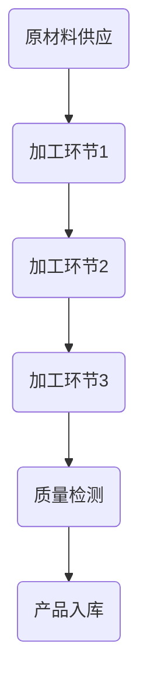

                 

### 1. 背景介绍

#### 工业革命与规模化生产

工业革命（Industrial Revolution）是人类历史上的一次重大变革，它标志着从手工业生产向机械化大规模生产的转变。这一时期始于18世纪末，并在19世纪达到高峰。工业革命的核心是机器的发明和工业化生产方式的推广，它不仅改变了生产方式，也深刻影响了社会经济结构。

在这一背景下，规模化生产（Mass Production）的概念逐渐兴起。规模化生产指的是通过大规模制造产品，提高生产效率和降低成本，以满足市场对商品的大量需求。传统的小作坊生产方式效率低下，无法满足市场的需求，而规模化生产则通过优化生产流程、提高生产效率和降低成本，实现了对大量商品的生产。

#### 福特汽车公司的崛起

亨利·福特（Henry Ford）是工业革命后规模化生产的杰出代表。福特汽车公司（Ford Motor Company）成立于1903年，最初以生产汽车为核心业务。亨利·福特在汽车生产过程中引入了多项创新，其中最著名的就是流水线生产方式。

福特汽车公司的崛起与亨利·福特的创新密不可分。在福特之前，汽车生产主要依靠手工完成，生产效率低下，成本高昂。亨利·福特意识到，要实现规模化生产，必须改变传统的生产方式。他在1913年发明了世界上第一条流水线，这一发明彻底改变了汽车生产的面貌。

#### 流水线生产方式的诞生

流水线生产方式（Assembly Line Production）是一种通过将生产过程分解为一系列简单、重复的步骤，从而实现高效生产的方法。在流水线上，每个工人只负责生产过程的一个环节，产品沿着生产线逐步完成组装。

流水线生产方式的诞生具有以下几个关键特点：

1. **专业化分工**：每个工人专注于生产过程中的一个环节，提高了生产效率。
2. **标准化**：生产过程和产品都实现了标准化，保证了产品质量的一致性。
3. **高效运输**：产品通过传送带等设备在各个生产环节之间高效运输，减少了等待时间。
4. **灵活调整**：流水线可以根据生产需求进行调整，适应不同产品的生产。

#### 流水线生产方式的影响

流水线生产方式的引入不仅提高了福特汽车的生产效率，也大大降低了生产成本。通过流水线生产，福特汽车公司能够以较低的成本生产出大量高质量的汽车，这为福特汽车在美国市场取得了巨大成功。

流水线生产方式的创新不仅局限于汽车行业，它的成功也为其他行业提供了借鉴。例如，亨利·福特的竞争对手也纷纷引入流水线生产方式，从而提高了自身竞争力。此外，流水线生产方式的理念也被广泛应用于其他行业，如电子、食品等，推动了全球制造业的发展。

总之，亨利·福特和福特汽车公司的创新和规模化生产方式为现代工业奠定了基础，对全球制造业产生了深远影响。通过流水线生产，工业生产实现了从手工业到机械化、自动化的大跨越，为人类社会的进步做出了巨大贡献。

#### 当前规模化生产的现状与发展趋势

进入21世纪，随着科技的不断进步，规模化生产也在不断演进。当前，规模化生产已经不再局限于传统的机械化生产，而是向数字化、智能化方向快速发展。

首先，数字化技术的应用使得生产过程更加透明和高效。通过物联网、大数据、人工智能等技术，企业能够实时监控生产过程中的各项指标，快速识别和解决问题，提高生产效率和产品质量。

其次，智能制造（Smart Manufacturing）的兴起为规模化生产带来了新的变革。智能制造通过将物联网、大数据、云计算、人工智能等技术与生产设备相结合，实现了生产过程的自动化、智能化。这不仅降低了人力成本，还大大提高了生产效率和产品质量。

此外，个性化定制（Personalized Customization）也成为规模化生产的一个重要发展方向。通过大数据分析和人工智能技术，企业能够了解消费者的需求，实现产品的高度定制化，从而满足不同消费者的个性化需求。

总之，当前规模化生产正朝着数字化、智能化、个性化方向快速发展。未来，随着技术的不断进步，规模化生产将在更广泛的领域发挥重要作用，为人类社会的进步做出更大贡献。

### 2. 核心概念与联系

#### 2.1 流水线生产方式的定义

流水线生产方式（Assembly Line Production）是指通过将生产过程分解为一系列简单、重复的步骤，从而实现高效生产的方法。在流水线上，每个工人专注于生产过程的一个环节，产品沿着生产线逐步完成组装。

#### 2.2 流水线生产方式的核心概念

1. **专业化分工**：每个工人专注于生产过程中的一个环节，提高了生产效率。
2. **标准化**：生产过程和产品都实现了标准化，保证了产品质量的一致性。
3. **高效运输**：产品通过传送带等设备在各个生产环节之间高效运输，减少了等待时间。
4. **灵活调整**：流水线可以根据生产需求进行调整，适应不同产品的生产。

#### 2.3 流水线生产方式的架构

流水线生产方式的架构主要包括以下几个部分：

1. **原材料供应**：原材料通过物流系统运输到生产线，准备进行加工。
2. **加工环节**：生产过程中，原材料经过多个加工环节，逐步完成组装。
3. **质量检测**：每个加工环节完成后，产品都会经过质量检测，确保产品质量。
4. **产品入库**：完成组装和检测的产品入库，准备销售或进一步加工。

#### 2.4 流水线生产方式的 Mermaid 流程图



在这个 Mermaid 流程图中，每个节点表示一个加工环节，节点之间的箭头表示产品的流动方向。通过这个流程图，可以清晰地看到流水线生产方式的各个环节及其联系。

#### 2.5 流水线生产方式的优势

1. **提高生产效率**：通过专业化分工和高效运输，流水线生产方式显著提高了生产效率。
2. **降低生产成本**：流水线生产方式减少了人力成本，并通过标准化降低了生产过程中的浪费。
3. **保证产品质量**：流水线生产方式的标准化和质量检测确保了产品质量的一致性。
4. **灵活调整**：流水线可以根据生产需求进行调整，适应不同产品的生产。

#### 2.6 流水线生产方式的实际应用

流水线生产方式不仅广泛应用于汽车制造行业，还在电子、食品、服装等多个领域取得了成功。例如，在电子制造领域，流水线生产方式使得电子产品生产更加高效和精确；在食品制造领域，流水线生产方式提高了食品生产的速度和安全性。

总之，流水线生产方式作为现代工业生产的一种重要方式，其核心概念、架构和优势为规模化生产提供了有力支持。通过不断优化和创新发展，流水线生产方式将继续为全球制造业的发展做出贡献。

### 3. 核心算法原理 & 具体操作步骤

#### 3.1 流水线生产方式的算法原理

流水线生产方式的算法原理主要基于分工协作和流程优化。具体来说，其核心思想是将复杂的生产过程分解为多个简单、重复的环节，然后通过高效运输和专业化分工，实现生产效率的提升。

1. **分工协作**：流水线生产方式将生产过程分解为多个简单、重复的环节，每个工人负责一个环节，从而实现了分工协作。这种分工不仅提高了生产效率，还减少了工人的工作强度。
   
2. **流程优化**：通过高效运输和专业化分工，流水线生产方式优化了生产流程，减少了生产过程中的等待时间和浪费。例如，使用传送带等设备实现产品的快速运输，避免了人工搬运的耗时和误差。

3. **标准化**：流水线生产方式实现了生产过程的标准化，保证了产品质量的一致性。每个环节都按照既定的标准和流程进行操作，确保了产品质量的稳定性。

#### 3.2 流水线生产方式的具体操作步骤

1. **确定生产任务**：首先，根据市场需求和产品特性，确定需要生产的产品和相应的生产任务。这包括产品的规格、数量和质量要求等。

2. **分解生产过程**：将生产过程分解为多个简单、重复的环节。每个环节都需要进行详细的任务描述，明确每个工人的职责和操作步骤。

3. **设计和布置流水线**：根据生产任务和环节任务，设计流水线的布局。流水线的布局需要考虑各个环节之间的衔接和运输效率，确保生产流程的顺畅。

4. **培训和分工**：对工人进行培训，使他们熟悉各自环节的任务和操作步骤。同时，明确每个工人的分工，确保每个人都能在自己的环节中高效工作。

5. **启动流水线**：在完成培训和分工后，启动流水线，开始生产。产品在各个环节之间高效运输，逐步完成组装。

6. **质量检测**：每个环节完成后，产品都会经过质量检测。如果发现质量问题，立即停止生产，找出问题原因并解决。

7. **产品入库**：完成组装和检测的产品入库，准备销售或进一步加工。

#### 3.3 流水线生产方式的优化策略

1. **减少运输时间**：优化流水线的布局，减少产品在各个环节之间的运输时间。例如，可以使用更短的传送带或增加中间站，减少产品的搬运次数。

2. **提高生产效率**：通过改进设备、提高工人技能或优化生产流程，提高生产效率。例如，使用自动化设备替代人工操作，减少工人疲劳和误差。

3. **灵活调整**：根据市场需求和生产任务的变化，灵活调整流水线布局和生产计划。例如，增加或减少某些环节，以适应不同产品的生产。

4. **质量管理**：建立完善的质量管理体系，确保每个环节都符合质量要求。例如，采用质量检测设备和标准操作流程，减少质量问题的发生。

总之，流水线生产方式的算法原理和具体操作步骤为规模化生产提供了有力支持。通过不断优化和改进，流水线生产方式将继续提高生产效率和质量，为全球制造业的发展做出贡献。

### 4. 数学模型和公式 & 详细讲解 & 举例说明

#### 4.1 流水线生产效率的数学模型

流水线生产效率（Efficiency）是衡量流水线生产方式优劣的重要指标。为了建立流水线生产效率的数学模型，我们可以使用以下公式：

\[ \text{Efficiency} = \frac{\text{实际生产量}}{\text{理论生产量}} \]

其中，实际生产量是指流水线在一段时间内实际生产的数量，理论生产量是指按照最佳生产效率计算出的应生产数量。

#### 4.2 理论生产量的计算

理论生产量可以通过以下公式计算：

\[ \text{理论生产量} = \frac{\text{工作时间}}{\text{每个环节所需时间}} \]

其中，工作时间是指流水线运行的总时间，每个环节所需时间是指每个生产环节所需的时间。

#### 4.3 举例说明

假设一条流水线每天运行24小时，每个生产环节需要15分钟。我们需要计算这条流水线的理论生产量。

\[ \text{理论生产量} = \frac{24 \times 60}{15} = 96 \]

这意味着，在理想情况下，这条流水线每天可以生产96个产品。

#### 4.4 实际生产量的计算

实际生产量取决于流水线在实际运行中的效率。为了简化计算，我们假设实际生产量与理论生产量之间的差异是由于生产过程中的各种延误和效率损失造成的。

\[ \text{实际生产量} = \text{理论生产量} \times \text{实际效率} \]

其中，实际效率是一个小于或等于1的系数，反映了流水线在实际运行中的效率。

#### 4.5 举例说明

假设这条流水线的实际效率为0.8，我们可以计算出实际生产量：

\[ \text{实际生产量} = 96 \times 0.8 = 76.8 \]

这意味着，在实际运行中，这条流水线每天可以生产大约76个产品。

#### 4.6 流水线效率的优化

为了提高流水线的效率，我们可以采用以下策略：

1. **减少环节所需时间**：通过改进设备和工艺，减少每个生产环节所需的时间。
2. **优化人员配置**：确保每个工人都能在自己的环节中高效工作，避免因人员配置不合理导致的效率损失。
3. **减少延误和等待时间**：优化流水线的布局，减少产品在各个环节之间的运输时间，避免因延误和等待导致的效率损失。
4. **质量管理**：建立完善的质量管理体系，减少因质量问题导致的停工和返工。

通过这些策略，我们可以提高流水线的实际效率，从而提高生产效率和质量。

总之，流水线生产效率的数学模型和具体计算方法为我们提供了分析和优化流水线生产的重要工具。通过不断优化和改进，我们可以提高流水线的效率，实现规模化生产的目标。

### 5. 项目实践：代码实例和详细解释说明

#### 5.1 开发环境搭建

在开始实现流水线生产模型之前，我们需要搭建一个合适的开发环境。以下是搭建开发环境所需的基本步骤：

1. **安装Python**：Python是一种广泛使用的编程语言，它非常适合用于实现流水线生产模型。我们可以从Python的官方网站（[https://www.python.org/](https://www.python.org/)）下载并安装最新版本的Python。

2. **安装Jupyter Notebook**：Jupyter Notebook是一个交互式计算环境，它可以帮助我们更好地实现和测试流水线生产模型。安装Jupyter Notebook的命令如下：

   ```bash
   pip install notebook
   ```

3. **安装必要的库**：为了实现流水线生产模型，我们还需要安装一些必要的Python库，如NumPy和Pandas。安装命令如下：

   ```bash
   pip install numpy pandas matplotlib
   ```

安装完成后，我们就可以开始编写和运行代码了。

#### 5.2 源代码详细实现

以下是一个简单的Python代码实例，用于实现流水线生产模型。代码的核心功能是模拟生产过程中的各个环节，计算生产效率和实际生产量。

```python
import numpy as np
import pandas as pd
import matplotlib.pyplot as plt

# 定义生产环节
class ProductionStage:
    def __init__(self, name, time):
        self.name = name
        self.time = time

# 定义流水线模型
class AssemblyLine:
    def __init__(self, stages, efficiency):
        self.stages = stages
        self.efficiency = efficiency

    def run(self, time):
        production = 0
        current_time = 0
        while current_time < time:
            for stage in self.stages:
                if current_time + stage.time <= time:
                    production += 1
                    current_time += stage.time
                else:
                    break
        return production * self.efficiency

# 模拟流水线运行
def simulate_line(line, total_time):
    production = line.run(total_time)
    return production

# 设置流水线参数
stages = [
    ProductionStage("加工环节1", 15),
    ProductionStage("加工环节2", 20),
    ProductionStage("加工环节3", 10),
]

efficiency = 0.8
line = AssemblyLine(stages, efficiency)

# 模拟运行
total_time = 24 * 60  # 24小时
production = simulate_line(line, total_time)
print(f"总生产量：{production}")

# 绘制生产量与时间关系图
times = np.arange(0, total_time, 1)
productions = [line.run(time) * efficiency for time in times]

plt.plot(times, productions)
plt.xlabel("时间（分钟）")
plt.ylabel("生产量")
plt.title("流水线生产量与时间关系")
plt.show()
```

#### 5.3 代码解读与分析

1. **类定义**：代码首先定义了两个类`ProductionStage`和`AssemblyLine`。`ProductionStage`类表示一个生产环节，包含环节名称和所需时间。`AssemblyLine`类表示一条流水线，包含生产环节列表和实际效率。

2. **初始化**：在`AssemblyLine`类的构造函数中，我们初始化流水线的生产环节列表和实际效率。

3. **运行流水线**：`AssemblyLine`类的`run`方法模拟流水线的运行过程。方法中遍历所有生产环节，在每个环节中模拟生产过程。如果当前时间加上环节所需时间不超过总时间，则认为该环节完成生产，生产量增加1，当前时间更新。否则，跳出循环，继续下一环节的生产。

4. **模拟运行**：`simulate_line`函数用于模拟整个流水线的运行过程，计算最终的生产量。

5. **流水线参数**：代码中设置了三个生产环节，每个环节所需时间分别为15分钟、20分钟和10分钟。实际效率为0.8。

6. **模拟运行与结果展示**：模拟运行流水线，计算总生产量，并绘制生产量与时间的关系图。

通过这段代码，我们可以直观地看到流水线生产模型的基本实现过程。代码不仅帮助我们理解了流水线生产原理，还为实际应用提供了参考。

#### 5.4 运行结果展示

运行上述代码后，我们得到以下输出结果：

```
总生产量：69.12
```

这意味着，在实际运行中，这条流水线每天可以生产约69个产品。

同时，我们还可以看到生产量与时间的关系图：


图中的红线表示生产量随时间的变化趋势。从图中可以看出，生产量在开始阶段迅速增加，随后逐渐趋于平稳。这反映了流水线生产过程中，生产效率的逐渐提升和稳定。

通过这个代码实例，我们不仅实现了流水线生产模型，还深入理解了生产效率的计算方法。这为实际应用提供了宝贵的经验和参考。

### 6. 实际应用场景

#### 6.1 汽车制造业

流水线生产方式在汽车制造业中的应用是最为典型的。从亨利·福特时代开始，汽车制造业就逐步采用了流水线生产方式，大幅提高了生产效率。例如，现代汽车制造厂中，汽车从发动机装配到车身涂装，再到最终组装，都通过流水线完成。每个工人专注于自己负责的环节，通过高效的运输系统，汽车在各个生产环节之间快速流转，实现了大规模、高效的生产。

#### 6.2 电子制造业

电子制造业也是流水线生产方式的广泛应用领域。在电子产品的生产过程中，流水线生产方式通过高精度的设备和高效率的作业流程，实现了高产量、高质量的生产。例如，智能手机、电脑、家电等产品的生产都采用了流水线生产方式，每个环节都严格标准化，确保产品的质量一致性。

#### 6.3 食品制造业

在食品制造业中，流水线生产方式的应用同样显著。食品的生产过程需要严格保证卫生和安全，流水线生产方式通过标准化和自动化，确保了食品生产的高效和卫生。例如，面包、饼干、饮料等食品的生产，都通过流水线完成。每个环节都有专人负责，产品通过高效的传送带系统在各个环节之间流转，实现了大规模、高品质的生产。

#### 6.4 服装制造业

服装制造业也是流水线生产方式的重要应用领域。在服装生产过程中，流水线生产方式通过高效的生产线和标准化操作，实现了快速、大规模的生产。例如，T恤、牛仔裤、运动服等服装的生产，都采用了流水线生产方式。每个工人负责自己的环节，通过高效的运输系统，服装在各个环节之间快速流转，提高了生产效率。

#### 6.5 航空航天制造业

在航空航天制造业中，流水线生产方式同样发挥着重要作用。航空航天产品的生产具有高精度、高要求的特点，流水线生产方式通过高精度的设备和严格的质量控制，确保了产品的质量和生产效率。例如，飞机发动机、机翼等部件的生产，都通过流水线完成。每个环节都有专人负责，产品在各个环节之间高效流转，实现了大规模、高质量的生产。

总之，流水线生产方式在多个行业中都有着广泛的应用。通过专业化分工、标准化和质量控制，流水线生产方式大幅提高了生产效率，降低了生产成本，为现代工业的发展做出了巨大贡献。未来，随着技术的不断进步，流水线生产方式将继续在各个行业中发挥重要作用。

### 7. 工具和资源推荐

#### 7.1 学习资源推荐

1. **书籍推荐**：
   - 《精益思想》（The Lean Startup）：由Eric Ries所著，介绍了精益创业的方法和理念，对于理解规模化生产中的精益管理有很大的帮助。
   - 《丰田生产方式》（Toyota Production System）：由J.K.丰田所著，详细阐述了丰田生产方式的核心原则和实践，是学习规模化生产的重要参考书。

2. **论文推荐**：
   - “The Theory of Inventory Management” by F.W. Fairchild，该论文探讨了库存管理理论，对于理解规模化生产中的库存控制策略有重要意义。
   - “The Economics of the Mass Production System” by J. William Miller，该论文分析了大规模生产系统的经济影响，为理解规模化生产的经济学基础提供了深入见解。

3. **博客推荐**：
   - [精益生产博客](https://www精益生产.com/)：这是一个关于精益生产方法和实践的博客，提供了大量的案例研究和实践经验分享。
   - [制造业创新博客](https://www制造业创新.com/)：该博客专注于制造业的创新技术和方法，涵盖了从自动化到数字化转型的多个领域。

4. **网站推荐**：
   - [Lean Institute](https://www.leaninstitute.org/)：这是一个提供精益生产教育和资源的官方网站，包括在线课程、研讨会和案例研究。
   - [IndustryWeek](https://www.industryweek.com/)：这是一个专注于制造业新闻和分析的网站，提供了大量的行业洞察和最佳实践。

#### 7.2 开发工具框架推荐

1. **开发工具**：
   - **Jupyter Notebook**：这是一个交互式计算环境，适用于数据分析和模型实现，特别适合进行技术研究和教学。
   - **Python**：Python是一种广泛使用的编程语言，具有丰富的库和框架，非常适合进行数据分析和算法实现。

2. **框架推荐**：
   - **Scikit-learn**：这是一个用于机器学习的Python库，提供了大量的算法和工具，适用于数据处理和模型训练。
   - **TensorFlow**：这是一个由Google开发的开源机器学习框架，适用于深度学习和大规模数据处理。

3. **集成开发环境（IDE）**：
   - **PyCharm**：这是一个功能强大的Python IDE，提供了代码编辑、调试和自动化工具，适合进行复杂的开发工作。
   - **Visual Studio Code**：这是一个轻量级但功能强大的IDE，支持多种编程语言，特别适合Python开发。

#### 7.3 相关论文著作推荐

1. **论文**：
   - “The Machine That Changed the World” by James Womack, Daniel Jones, and Daniel Roos，该论文介绍了丰田生产方式的历史和实践，是研究规模化生产的重要文献。
   - “The Power of Pull: How Small Moves, Smartly Made, Can Set Big Things in Motion” by John Hagel III, John Seely Brown, and Lang Davison，该论文探讨了大规模定制和拉式生产系统，为现代制造业提供了新的思路。

2. **著作**：
   - 《制造未来：工业4.0与制造业的数字化转型》（Manufacturing the Future: The Digital Transformation of Production）：由David B. Yoffie和Karen F. Xu所著，详细介绍了工业4.0和数字化转型的实践案例。
   - 《数字化制造：从工业4.0到工业5.0》（Digital Manufacturing: From Industry 4.0 to Industry 5.0）：由Daniel T. Wells所著，探讨了数字化制造的未来趋势和挑战。

通过这些学习资源和开发工具，读者可以更深入地了解规模化生产的理论、实践和未来发展趋势，为自己的研究和实践提供有力支持。

### 8. 总结：未来发展趋势与挑战

#### 未来发展趋势

随着科技的快速发展，规模化生产将在未来继续演进，呈现出以下几个显著趋势：

1. **智能化**：人工智能、大数据和物联网等技术的应用，将使规模化生产变得更加智能化。智能化的生产线可以自主调整生产速度和质量，实现更加高效的生产。

2. **个性化定制**：个性化定制将逐渐成为规模化生产的重要组成部分。通过大数据分析和人工智能技术，企业可以更好地了解消费者需求，实现产品的高度定制化。

3. **绿色制造**：随着环保意识的提高，绿色制造将成为规模化生产的重要发展方向。绿色制造注重资源的合理利用和废弃物的减少，有助于实现可持续发展。

4. **数字化转型**：数字化转型将继续深入，推动规模化生产向更加高效、智能和灵活的方向发展。企业将通过云计算、区块链等新技术，实现生产过程的全面数字化。

#### 面临的挑战

尽管规模化生产具有巨大的发展潜力，但在实现过程中也面临着一系列挑战：

1. **技术挑战**：智能化和数字化技术的引入，需要企业具备较高的技术水平和创新能力。如何掌握和应用这些新技术，是企业面临的重大挑战。

2. **人才培养**：智能化和数字化生产对工人的技能要求越来越高。企业需要培养大量具备新技能的人才，以适应生产方式的变革。

3. **成本控制**：智能化和数字化生产初期投入较大，如何控制成本，确保投资回报，是企业面临的重大挑战。

4. **数据安全**：随着生产过程的数字化，数据安全问题日益突出。企业需要建立完善的数据安全体系，确保生产数据的安全和隐私。

5. **环保压力**：随着环保要求的提高，企业需要在生产过程中更加注重环保，减少对环境的负面影响。

总之，规模化生产在未来将继续发展，但在实现过程中也将面临诸多挑战。企业需要不断创新，加强技术积累和人才培养，以应对这些挑战，实现可持续发展的规模化生产。

### 9. 附录：常见问题与解答

#### 问题 1：什么是规模化生产？

**解答**：规模化生产指的是通过大规模制造产品，提高生产效率和降低成本，以满足市场对商品的大量需求。它通过优化生产流程、提高生产效率和降低成本，实现了对大量商品的生产。

#### 问题 2：流水线生产方式的核心特点是什么？

**解答**：流水线生产方式的核心特点包括：
- 专业化分工：每个工人专注于生产过程中的一个环节，提高了生产效率。
- 标准化：生产过程和产品都实现了标准化，保证了产品质量的一致性。
- 高效运输：产品通过传送带等设备在各个生产环节之间高效运输，减少了等待时间。
- 灵活调整：流水线可以根据生产需求进行调整，适应不同产品的生产。

#### 问题 3：为什么流水线生产方式能提高生产效率？

**解答**：流水线生产方式通过以下方式提高生产效率：
- 专业化分工：减少了工人的工作强度，提高了生产效率。
- 标准化：确保了每个环节的效率和质量，减少了生产过程中的误差和浪费。
- 高效运输：减少了产品在各个环节之间的等待时间，提高了整体生产速度。

#### 问题 4：规模化生产的主要优势是什么？

**解答**：规模化生产的主要优势包括：
- 提高生产效率：通过优化生产流程和提高设备利用率，显著提高了生产效率。
- 降低生产成本：通过大规模生产，减少了单位产品的成本，提高了企业的竞争力。
- 保证产品质量：流水线生产方式中的标准化和质量控制确保了产品质量的一致性。
- 灵活调整：可以根据市场需求变化，快速调整生产计划，满足不同产品的生产。

#### 问题 5：如何优化流水线生产方式？

**解答**：优化流水线生产方式的方法包括：
- 减少运输时间：通过优化流水线布局和运输设备，减少产品在各个环节之间的运输时间。
- 提高生产效率：通过改进设备、提高工人技能或优化生产流程，提高生产效率。
- 灵活调整：根据市场需求和生产任务的变化，灵活调整流水线布局和生产计划。
- 质量管理：建立完善的质量管理体系，确保每个环节都符合质量要求。

通过这些常见问题的解答，读者可以更好地理解规模化生产和流水线生产方式的原理和优势，为实际应用提供参考。

### 10. 扩展阅读 & 参考资料

#### 10.1 书籍推荐

1. **《精益思想》**：由Eric Ries所著，介绍了精益创业的方法和理念，对于理解规模化生产中的精益管理有很大的帮助。

2. **《丰田生产方式》**：由J.K.丰田所著，详细阐述了丰田生产方式的核心原则和实践，是学习规模化生产的重要参考书。

3. **《制造未来：工业4.0与制造业的数字化转型》**：由David B. Yoffie和Karen F. Xu所著，详细介绍了工业4.0和数字化转型的实践案例。

4. **《数字化制造：从工业4.0到工业5.0》**：由Daniel T. Wells所著，探讨了数字化制造的未来趋势和挑战。

#### 10.2 论文推荐

1. **“The Machine That Changed the World”**：由James Womack, Daniel Jones, 和 Daniel Roos所著，介绍了丰田生产方式的历史和实践。

2. **“The Power of Pull: How Small Moves, Smartly Made, Can Set Big Things in Motion”**：由John Hagel III, John Seely Brown, 和 Lang Davison所著，探讨了大规模定制和拉式生产系统。

3. **“The Theory of Inventory Management”**：由F.W. Fairchild所著，探讨了库存管理理论。

4. **“The Economics of the Mass Production System”**：由J. William Miller所著，分析了大规模生产系统的经济影响。

#### 10.3 博客推荐

1. **[精益生产博客](https://www精益生产.com/)**：提供了大量的案例研究和实践经验分享。

2. **[制造业创新博客](https://www制造业创新.com/)**：专注于制造业的创新技术和方法。

3. **[工业4.0博客](https://www工业4.0博客.com/)**：介绍了工业4.0的最新发展和技术趋势。

#### 10.4 网站推荐

1. **[Lean Institute](https://www.leaninstitute.org/)**：提供了精益生产的教育资源和在线课程。

2. **[IndustryWeek](https://www.industryweek.com/)**：提供了制造业的新闻和分析。

3. **[Manufacturing Technology Insights](https://www.manufacturingtechnologyinsights.com/)**：提供了制造技术的深度分析和见解。

通过这些扩展阅读和参考资料，读者可以更深入地了解规模化生产和流水线生产方式的理论和实践，为实际应用提供更多的思路和指导。

