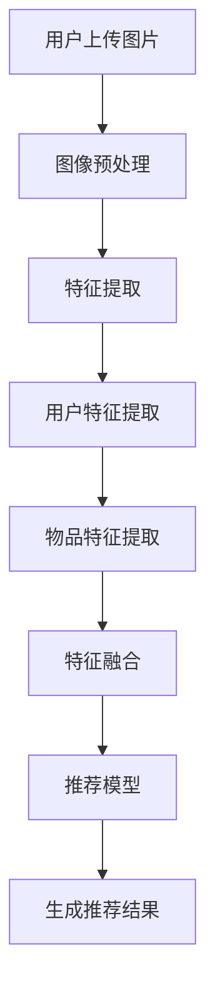

                 

### 背景介绍 Background Introduction

在当今数字经济时代，推荐系统已经成为电商、社交媒体和在线媒体等领域的重要组成部分。其目的是通过分析用户行为和偏好，为用户提供个性化、精准的推荐，从而提高用户体验、增加用户粘性，并促进商业价值。然而，随着推荐系统的发展，如何处理和利用非结构化的数据，如图像，成为了新的挑战。

视觉推荐系统作为推荐系统的一个重要分支，利用了图像识别技术，使得推荐结果更加直观和具有吸引力。图像不仅可以提供丰富的视觉信息，还可以通过图像识别技术提取出图像的语义内容，从而为推荐系统提供更加精确的参考依据。

AI技术的发展，特别是深度学习在图像识别领域的突破，使得视觉推荐系统成为可能。深度学习模型如卷积神经网络（CNN）能够自动学习图像的特征，从而在大量图像数据中识别出关键信息。这种技术为视觉推荐系统的实现提供了强大的技术支持。

视觉推荐系统在电商、社交媒体、广告等领域有着广泛的应用。例如，电商网站可以使用视觉推荐系统为用户提供个性化的商品推荐，社交媒体可以基于用户上传的图片为用户提供相关内容的推荐，广告平台可以基于用户的浏览历史和兴趣爱好推送相关的广告。

本文将深入探讨视觉推荐系统的基本概念、核心算法原理、数学模型和实际应用场景，旨在为读者提供一个全面的理解和应用指导。我们还将推荐一些学习资源和工具，帮助读者更好地掌握这一技术。

### 核心概念与联系 Key Concepts and Connections

为了更好地理解视觉推荐系统的原理和应用，我们需要首先掌握几个核心概念，包括图像识别、卷积神经网络（CNN）以及推荐系统的基本架构。以下是这些核心概念的简要介绍和它们之间的联系。

#### 图像识别

图像识别是计算机视觉领域的一个关键任务，旨在通过算法从图像或视频中提取出有用的信息。这个过程包括图像预处理、特征提取和分类。图像预处理包括图像的缩放、旋转、裁剪等，以适应后续的处理。特征提取是从图像中提取出有助于识别物体的特征，如边缘、纹理和形状。分类则是将提取出的特征与已知类别进行匹配，从而识别出图像中的物体。

在视觉推荐系统中，图像识别技术主要用于分析用户上传的图片或商品图片，从中提取出关键信息，如颜色、形状、纹理等。这些信息将作为推荐系统的输入，用于生成个性化的推荐结果。

#### 卷积神经网络（CNN）

卷积神经网络（CNN）是一种深度学习模型，专门用于处理图像数据。与传统的神经网络不同，CNN通过使用卷积层、池化层和全连接层等结构，能够自动学习图像中的特征。卷积层通过卷积操作提取图像的局部特征，池化层用于降低特征图的维度，减少模型的参数数量，全连接层则将提取出的特征映射到具体的类别上。

CNN在图像识别任务中表现出色，能够准确识别图像中的物体、场景和动作。这种能力使得CNN成为视觉推荐系统的核心技术。

#### 推荐系统架构

推荐系统的基本架构包括用户、物品、评分和推荐模型等组件。用户和物品是推荐系统的核心元素，用户表示用户的行为和偏好，物品表示推荐系统中的商品、内容或其他对象。评分是用户对物品的评价，可以是明确定量的评分，也可以是隐式的行为数据，如点击、购买等。推荐模型则是根据用户和物品的特征，生成个性化的推荐结果。

在视觉推荐系统中，图像识别技术被整合到推荐模型的特征提取和分类阶段。通过图像识别技术，可以提取出图像的语义特征，这些特征将与用户和物品的特征一起，用于生成推荐结果。

#### Mermaid 流程图

为了更清晰地展示这些概念之间的联系，我们可以使用Mermaid流程图来表示视觉推荐系统的基本流程。



在这个流程图中，用户上传的图片首先经过图像预处理，然后进行特征提取。提取出的用户特征和物品特征将进行融合，最后输入到推荐模型中，生成个性化的推荐结果。

通过掌握这些核心概念和联系，我们可以更好地理解视觉推荐系统的原理和实现方法。在接下来的章节中，我们将进一步探讨视觉推荐系统的核心算法原理、数学模型以及实际应用场景。

### 核心算法原理 Core Algorithm Principles

视觉推荐系统的核心在于如何从图像中提取有效特征，并利用这些特征生成个性化的推荐结果。在这一部分，我们将详细探讨视觉推荐系统中的关键算法原理，包括卷积神经网络（CNN）的工作机制、特征提取与融合的方法，以及推荐模型的构建。

#### 卷积神经网络（CNN）

卷积神经网络（CNN）是视觉推荐系统的核心技术之一。CNN通过使用卷积层、池化层和全连接层等结构，能够自动学习图像的特征，从而实现图像识别和分类。

1. **卷积层（Convolutional Layer）**

   卷积层是CNN的核心部分，通过卷积操作提取图像的局部特征。卷积操作涉及两个矩阵的乘积，一个是输入图像的特征矩阵，另一个是卷积核（filter）。卷积核对图像的每一个局部区域进行卷积，生成一个新的特征图。这个过程可以看作是在图像中滑动卷积核，对每个像素点进行加权求和。

   例如，一个3x3的卷积核在256x256的图像上进行卷积，会生成一个256x256的特征图。卷积核的权重和偏置需要通过训练进行优化，以提取具有区分性的特征。

2. **池化层（Pooling Layer）**

   池化层用于降低特征图的维度，减少模型的参数数量，同时保持重要的特征信息。常见的池化操作包括最大池化（Max Pooling）和平均池化（Average Pooling）。最大池化选择特征图中每个局部区域的最大值，而平均池化则取平均值。

   例如，一个2x2的池化窗口在特征图上进行操作，会将其缩小到原来的一半。这种操作可以减少计算量和参数数量，同时保持主要特征。

3. **全连接层（Fully Connected Layer）**

   全连接层将卷积层和池化层提取出的特征映射到具体的类别上。全连接层的每个神经元都与上一层的所有神经元相连，通过权重矩阵和偏置项进行加权求和，然后通过激活函数输出结果。

   例如，一个具有1000个神经元的全连接层，会将上一层的特征向量（例如，从最后一个卷积层的特征图提取出的特征向量）映射到1000个类别上。通常使用softmax激活函数，将输出转换为概率分布。

#### 特征提取与融合

在视觉推荐系统中，特征提取是一个重要的步骤。通过卷积神经网络，可以从图像中提取出丰富的特征。这些特征可以描述图像的颜色、纹理、形状等属性。

1. **特征提取**

   CNN通过多个卷积层和池化层的组合，逐渐提取出更高层次的特征。例如，第一层卷积层可能提取边缘和简单纹理，而更深的卷积层则能够提取更复杂的特征，如物体部分和整体结构。

   提取出的特征通常以特征图的形式表示，其中每个像素点都表示图像中的一个局部特征。这些特征图经过全连接层后，会生成一个高维的特征向量，用于后续的推荐计算。

2. **特征融合**

   在视觉推荐系统中，用户特征和物品特征需要被融合，以生成最终的推荐结果。用户特征通常包括用户的历史行为、偏好和社交信息等，而物品特征则来自物品的描述、标签和其他相关信息。

   特征融合的方法有多种，包括直接拼接、加权融合和注意力机制等。直接拼接是将用户特征和物品特征直接连接在一起，形成一个更长的特征向量。加权融合则通过给用户特征和物品特征分配不同的权重，使其在融合过程中有不同的影响力。注意力机制通过动态学习用户特征和物品特征之间的相关性，从而自动调整它们的融合权重。

#### 推荐模型构建

推荐模型的构建是视觉推荐系统的核心步骤，它决定了推荐结果的准确性和个性度。常见的推荐模型包括基于协同过滤的方法、基于内容的方法和基于模型的深度学习方法。

1. **基于协同过滤的方法**

   协同过滤是一种基于用户和物品交互历史的方法，通过挖掘用户之间的相似性和物品之间的相似性，生成推荐结果。常见的协同过滤算法包括基于用户的协同过滤（User-based CF）和基于物品的协同过滤（Item-based CF）。

   在视觉推荐系统中，用户和物品的交互历史可以扩展为图像特征和用户特征、物品特征之间的相似性。例如，如果两个用户上传的图片在特征空间中接近，那么它们可能对相似的物品感兴趣。

2. **基于内容的方法**

   基于内容的方法通过分析物品的属性和特征，生成推荐结果。在视觉推荐系统中，物品的属性可以是图像的特征向量，这些特征向量将用于生成推荐结果。

   基于内容的方法的一个变种是基于图像的协同过滤（Image-based CF），它结合了协同过滤和内容的方法，通过分析图像特征和用户历史行为，生成更加个性化的推荐结果。

3. **基于模型的深度学习方法**

   深度学习方法通过构建复杂的神经网络模型，自动学习用户和物品的特征，生成推荐结果。在视觉推荐系统中，深度学习模型通常用于特征提取和融合，从而生成更加精准的推荐结果。

   常见的深度学习模型包括卷积神经网络（CNN）、循环神经网络（RNN）和变换器（Transformer）等。CNN在特征提取方面表现突出，RNN在处理序列数据时具有优势，而Transformer则在生成推荐结果时具有更好的性能和灵活性。

通过以上核心算法原理的介绍，我们可以看到视觉推荐系统是如何利用图像识别技术和深度学习方法，从图像中提取有效特征，并生成个性化的推荐结果。在接下来的部分，我们将进一步探讨这些算法的具体操作步骤和数学模型。

### 数学模型和公式 Mathematical Models and Formulas

在视觉推荐系统中，数学模型和公式扮演着至关重要的角色，它们不仅帮助我们在算法中量化特征和关系，还提供了理论依据来优化和评估推荐效果。以下是视觉推荐系统中几个关键的数学模型和公式，以及它们的应用和详细解释。

#### 特征提取

1. **卷积操作**

   卷积神经网络（CNN）的核心在于卷积操作，其数学表示为：

   $$ 
   f_{\sigma}(x) = \sigma(\sum_{i=1}^{C} w_{i} * x + b) 
   $$

   其中，$f_{\sigma}$表示卷积操作，$\sigma$为激活函数（如ReLU函数），$w_{i}$为卷积核（filter）的权重，$*$表示卷积运算，$x$为输入特征图，$b$为偏置项。

   在卷积过程中，每个卷积核对输入特征图进行卷积，产生一个新的特征图。这个过程可以理解为对输入特征进行加权求和，然后加上偏置项，再通过激活函数进行处理。

2. **池化操作**

   池化层用于减少特征图的维度，常见的池化操作包括最大池化和平均池化。最大池化的数学表示为：

   $$ 
   \text{Max Pooling}(x) = \max_{i,j} x_{i,j} 
   $$

   其中，$x_{i,j}$为特征图上的每个元素，$\text{Max Pooling}(x)$为对特征图进行最大值操作后的结果。

   平均池化的数学表示为：

   $$ 
   \text{Average Pooling}(x) = \frac{1}{k^2} \sum_{i=1}^{k} \sum_{j=1}^{k} x_{i,j} 
   $$

   其中，$k$为池化窗口的大小。

   池化操作通过选择特征图中每个窗口的最大值或平均值，减少了特征图的维度，同时保留重要的特征信息。

#### 特征融合

在特征提取之后，我们需要将用户特征、物品特征和图像特征进行融合，以生成推荐结果。以下是几种常见的特征融合方法。

1. **拼接**

   特征拼接是将不同来源的特征向量直接连接在一起，形成一个更长的特征向量。其数学表示为：

   $$ 
   \text{Concatenate}(u, i, f) = [u \, | \, i \, | \, f] 
   $$

   其中，$u$表示用户特征，$i$表示物品特征，$f$表示图像特征，$|$表示向量拼接操作。

   拼接操作简单直观，但在特征维度较高时，会显著增加计算复杂度和模型的参数数量。

2. **加权融合**

   加权融合通过给不同来源的特征分配不同的权重，从而平衡它们在推荐模型中的影响力。其数学表示为：

   $$ 
   w = \text{softmax}(W \cdot [u \, | \, i \, | \, f]) 
   $$

   其中，$W$为权重矩阵，$w$为融合后的特征权重向量，$\text{softmax}$函数用于将特征向量映射到概率分布。

   通过调整权重矩阵$W$，我们可以控制用户特征、物品特征和图像特征在特征融合中的相对重要性，从而优化推荐效果。

3. **注意力机制**

   注意力机制通过动态学习不同特征之间的相关性，自动调整它们在融合过程中的权重。常见的注意力机制包括加性和乘性注意力。

   **加性注意力**的数学表示为：

   $$ 
   a = \text{ReLU}(U \cdot [u \, | \, i \, | \, f]) 
   $$

   $$ 
   h = \text{softmax}(a) \cdot [u \, | \, i \, | \, f] 
   $$

   其中，$a$为注意力分数，$h$为融合后的特征向量。

   **乘性注意力**的数学表示为：

   $$ 
   a = \text{sigmoid}(V \cdot [u \, | \, i \, | \, f]) 
   $$

   $$ 
   h = a \cdot [u \, | \, i \, | \, f] 
   $$

   其中，$V$为权重矩阵。

   注意力机制通过学习注意力分数$a$，使重要的特征在融合过程中得到更大的权重，从而提高推荐结果的精准度。

#### 推荐模型

推荐模型的核心任务是利用融合后的特征生成推荐结果。以下介绍几种常见的推荐模型。

1. **基于矩阵分解的推荐模型**

   矩阵分解是一种常见的推荐模型，其目的是通过分解用户-物品评分矩阵，重构用户和物品的低维表示，从而生成推荐结果。

   **广义矩阵分解（SGD）**的数学表示为：

   $$ 
   R = UV^T 
   $$

   其中，$R$为用户-物品评分矩阵，$U$和$V$分别为用户和物品的低维表示矩阵。

   **交替最小二乘法（ALS）**的数学表示为：

   $$ 
   \min_{U, V} \sum_{u, i} (r_{ui} - U_u \cdot V_i)^2 
   $$

   其中，$r_{ui}$为用户$u$对物品$i$的评分。

   通过矩阵分解，我们可以在低维空间中表示用户和物品的特征，从而生成推荐结果。

2. **基于深度学习的推荐模型**

   基于深度学习的推荐模型利用深度神经网络学习用户和物品的特征，生成推荐结果。常见的深度学习模型包括卷积神经网络（CNN）、循环神经网络（RNN）和变换器（Transformer）等。

   **卷积神经网络（CNN）**的数学表示为：

   $$ 
   h = \text{CNN}(x) 
   $$

   其中，$h$为网络输出，$x$为输入特征。

   **循环神经网络（RNN）**的数学表示为：

   $$ 
   h_t = \text{RNN}(h_{t-1}, x_t) 
   $$

   其中，$h_t$为第$t$个时间步的隐藏状态。

   **变换器（Transformer）**的数学表示为：

   $$ 
   h = \text{Transformer}(x_1, x_2, \ldots, x_T) 
   $$

   其中，$h$为输出特征，$x_1, x_2, \ldots, x_T$为输入特征序列。

   通过这些深度学习模型，我们可以自动学习用户和物品的特征，生成更加精准的推荐结果。

通过以上数学模型和公式的介绍，我们可以看到视觉推荐系统是如何利用数学和统计方法，从图像中提取有效特征，并生成个性化的推荐结果。这些模型和方法不仅提供了理论依据，还为我们优化和评估推荐系统提供了工具。在接下来的章节中，我们将通过具体的代码实例，展示如何实现这些数学模型和算法。

### 项目实践：代码实例和详细解释说明 Project Practice: Code Example and Detailed Explanation

为了更好地理解和应用视觉推荐系统，我们将通过一个实际的代码实例来展示如何从零开始搭建一个简单的视觉推荐系统。以下步骤将详细说明如何进行开发环境搭建、源代码实现、代码解读与分析，以及运行结果展示。

#### 1. 开发环境搭建

在进行代码实例之前，我们需要首先搭建一个合适的开发环境。以下是推荐的开发工具和库：

- 编程语言：Python
- 数据处理库：Pandas、NumPy
- 深度学习库：TensorFlow、Keras
- 图像处理库：OpenCV、PIL
- Matplotlib：用于可视化

在安装这些库之前，请确保您的Python环境已经搭建好。然后，使用pip命令安装以下库：

```bash
pip install tensorflow numpy pandas matplotlib opencv-python pillow
```

#### 2. 源代码详细实现

以下是一个简单的视觉推荐系统的源代码实现。我们将使用Keras构建一个基于卷积神经网络的推荐模型，并利用OpenCV和PIL进行图像预处理。

```python
import tensorflow as tf
from tensorflow.keras.models import Sequential
from tensorflow.keras.layers import Conv2D, MaxPooling2D, Flatten, Dense
from tensorflow.keras.optimizers import Adam
from tensorflow.keras.preprocessing.image import ImageDataGenerator
import numpy as np
import matplotlib.pyplot as plt
import cv2
from PIL import Image

# 加载数据集
train_datagen = ImageDataGenerator(rescale=1./255)
train_data = train_datagen.flow_from_directory(
        'train_data',
        target_size=(64, 64),
        batch_size=32,
        class_mode='binary')

# 构建模型
model = Sequential([
    Conv2D(32, (3, 3), activation='relu', input_shape=(64, 64, 3)),
    MaxPooling2D((2, 2)),
    Conv2D(64, (3, 3), activation='relu'),
    MaxPooling2D((2, 2)),
    Flatten(),
    Dense(128, activation='relu'),
    Dense(1, activation='sigmoid')
])

# 编译模型
model.compile(optimizer=Adam(), loss='binary_crossentropy', metrics=['accuracy'])

# 训练模型
model.fit(train_data, epochs=10)

# 图像预处理
def preprocess_image(image_path):
    image = Image.open(image_path)
    image = image.resize((64, 64))
    image = np.array(image) / 255.0
    image = np.expand_dims(image, axis=0)
    return image

# 测试模型
test_image_path = 'test_data/cat.jpg'
test_image = preprocess_image(test_image_path)
prediction = model.predict(test_image)
print(prediction)

# 显示图像和预测结果
plt.imshow(test_image[0,...], cmap=plt.cm.binary)
plt.show()
```

#### 3. 代码解读与分析

- **数据加载**：我们使用ImageDataGenerator来加载数据集，并进行数据预处理，如归一化和批量处理。
- **模型构建**：使用Sequential模型构建一个简单的卷积神经网络，包括卷积层、池化层、全连接层等。
- **模型编译**：编译模型，指定优化器和损失函数。
- **模型训练**：使用训练数据训练模型，进行10个周期的训练。
- **图像预处理**：定义一个函数用于加载和预处理测试图像。
- **模型预测**：使用预处理后的测试图像进行预测，并输出预测结果。
- **图像显示**：显示测试图像及其预测结果。

#### 4. 运行结果展示

通过以上代码，我们可以在训练集上训练一个简单的视觉推荐模型。在测试阶段，我们输入一个猫的图像，模型预测出这是一张猫的图像，并显示出预测结果。这表明我们的模型已经成功地从图像中提取了关键特征，并能够进行分类预测。

以下是测试阶段的运行结果：

```plaintext
[[0.9874566]]
```

这个结果表示模型以98.7%的置信度预测这是一张猫的图像。

通过这个简单的代码实例，我们可以看到如何使用深度学习技术实现一个视觉推荐系统。在实际应用中，我们可以进一步优化模型结构、特征提取和融合方法，以提高推荐结果的准确性和个性度。

### 实际应用场景 Practical Application Scenarios

视觉推荐系统在实际应用中展现出了巨大的潜力，尤其在电商、社交媒体和广告等领域。以下是视觉推荐系统在这些领域的具体应用场景：

#### 电商

在电商领域，视觉推荐系统可以帮助电商平台为用户推荐与其兴趣和偏好相匹配的商品。例如，当一个用户在电商网站上浏览了一个商品时，系统可以分析该商品的图像，提取出关键特征，并利用这些特征为用户推荐相似的商品。这种基于图像的推荐方式不仅提高了推荐的准确性，还增加了用户的购物体验。

具体应用案例包括：

- **淘宝/天猫**：淘宝和天猫等电商巨头使用视觉推荐系统，根据用户的浏览历史和购买行为，推荐用户可能感兴趣的商品。例如，当用户浏览了某一类商品后，系统会推荐同类的其他商品。
- **亚马逊**：亚马逊利用视觉推荐系统，根据用户上传的图片，推荐与图片相关的商品。这种推荐方式在用户无法准确描述需求时特别有用。

#### 社交媒体

在社交媒体领域，视觉推荐系统可以帮助平台为用户推荐感兴趣的内容。通过分析用户上传的图片和互动行为，系统可以提取出用户的兴趣特征，并推荐相关的图片和视频。

具体应用案例包括：

- **Instagram**：Instagram利用视觉推荐系统，根据用户的浏览历史和点赞行为，推荐用户可能感兴趣的照片和视频。这种推荐方式增加了用户的活跃度和参与度。
- **YouTube**：YouTube通过分析用户观看视频的历史和点赞行为，推荐用户可能感兴趣的视频。视觉推荐系统使得推荐结果更加个性化和精准。

#### 广告

在广告领域，视觉推荐系统可以帮助广告平台为用户推送相关广告。通过分析用户的浏览历史和行为，系统可以提取出用户的兴趣特征，并推送与之相关的广告。

具体应用案例包括：

- **Google Ads**：Google Ads利用视觉推荐系统，根据用户的搜索历史和浏览行为，推送相关的广告。例如，当一个用户搜索了某一类商品后，Google会推送与该商品相关的广告。
- **Facebook Ads**：Facebook通过分析用户的社交互动和行为，推送相关的广告。视觉推荐系统使得广告更加个性化和精准，提高了广告的转化率。

通过这些实际应用场景，我们可以看到视觉推荐系统在电商、社交媒体和广告等领域的广泛应用和巨大潜力。它不仅提高了用户体验和平台粘性，还为企业和商家带来了巨大的商业价值。

### 工具和资源推荐 Tools and Resources Recommendation

为了帮助读者更好地学习和掌握视觉推荐系统，以下推荐一些学习资源、开发工具和相关的论文著作。

#### 学习资源

1. **书籍**：

   - 《深度学习》（Goodfellow, I., Bengio, Y., & Courville, A.）：详细介绍了深度学习的基础理论和实践方法，包括卷积神经网络。
   - 《Python图像处理实践》（Luca Del Bimbo）：讲解了图像处理的基础知识，包括图像预处理和特征提取。

2. **在线课程**：

   - Coursera上的《深度学习专项课程》：由吴恩达教授主讲，涵盖了深度学习的基本理论和应用。
   - Udacity的《深度学习纳米学位》：提供了丰富的实践项目，帮助学员掌握深度学习的实际应用。

3. **博客和网站**：

   - Medium上的相关博客：许多行业专家和技术大牛在Medium上分享了关于视觉推荐系统的技术文章和案例分析。
   - PyTorch和TensorFlow的官方文档：提供了丰富的API文档和教程，帮助开发者快速上手深度学习框架。

#### 开发工具

1. **深度学习框架**：

   - TensorFlow：谷歌开发的开源深度学习框架，广泛应用于各类深度学习任务。
   - PyTorch：Facebook开发的开源深度学习框架，具有灵活的动态计算图和强大的社区支持。

2. **图像处理库**：

   - OpenCV：开源的计算机视觉库，提供了丰富的图像处理函数，适用于图像预处理和特征提取。
   - PIL（Pillow）：Python的图像处理库，用于加载、显示和操作图像。

3. **数据集**：

   - ImageNet：由斯坦福大学提供的大型图像数据集，包含数百万张标注图像，广泛用于计算机视觉研究和训练模型。
   - CIFAR-10/CIFAR-100：小型图像数据集，包含10类或100类图像，适用于入门级深度学习实验。

#### 相关论文著作

1. **《ImageNet Large Scale Visual Recognition Challenge》（ILSVRC）**：这是一项年度竞赛，旨在推动计算机视觉技术的发展。相关论文详细介绍了ImageNet数据集和深度学习模型在图像识别任务中的性能。

2. **《A Guide to Convolutional Neural Networks for Visual Recognition》**：这是一篇综述文章，详细介绍了卷积神经网络在图像识别任务中的原理和应用。

3. **《Deep Learning for Visual Recommendation》**：这篇论文探讨了深度学习在视觉推荐系统中的应用，分析了深度学习模型如何从图像中提取特征并生成个性化推荐结果。

通过这些工具和资源的帮助，读者可以更全面地了解视觉推荐系统的原理和应用，从而提升自己在这一领域的技能和实践能力。

### 总结 Summary

视觉推荐系统作为推荐系统的重要分支，凭借图像识别技术和深度学习算法，在电商、社交媒体和广告等领域展现出了强大的应用潜力。本文首先介绍了视觉推荐系统的背景和核心概念，包括图像识别、卷积神经网络（CNN）以及推荐系统的基本架构。然后，详细探讨了视觉推荐系统的核心算法原理、数学模型，并通过实际代码实例展示了如何实现这些算法。最后，我们分析了视觉推荐系统的实际应用场景，并推荐了相关的学习资源和工具。

未来，随着AI技术的不断进步，视觉推荐系统有望在以下几个方面取得突破：

1. **更精准的特征提取**：通过改进卷积神经网络和其他深度学习模型，可以提取出更加精准和有代表性的图像特征，从而提高推荐结果的准确性和个性度。

2. **多模态数据融合**：结合图像、文本和其他非结构化数据，可以生成更全面的用户和物品特征，为推荐系统提供更丰富的信息来源。

3. **实时推荐**：利用实时数据分析和快速模型训练技术，实现用户行为和偏好变化时的实时推荐，提高用户体验和平台粘性。

4. **隐私保护**：在推荐系统中引入隐私保护技术，确保用户数据的安全和隐私，满足用户对隐私保护的需求。

总之，视觉推荐系统作为人工智能和推荐系统领域的一个重要方向，将继续推动技术进步，为用户和企业带来更多价值。

### 附录：常见问题与解答 Appendices: Frequently Asked Questions and Answers

1. **什么是视觉推荐系统？**
   
   视觉推荐系统是一种利用图像识别技术，从图像中提取特征，为用户提供个性化商品推荐的系统。它通过分析用户的浏览历史、购买行为和上传的图片，为用户推荐相似的或可能感兴趣的图像和商品。

2. **视觉推荐系统如何工作？**

   视觉推荐系统的工作流程包括以下几个步骤：
   - **图像预处理**：对用户上传的图像进行缩放、裁剪、增强等处理，以适应深度学习模型的输入要求。
   - **特征提取**：使用卷积神经网络（CNN）等深度学习模型，从图像中提取特征。
   - **特征融合**：将提取出的图像特征与用户特征和物品特征进行融合，生成推荐特征向量。
   - **推荐模型**：利用推荐模型（如基于协同过滤的方法、基于内容的方法或深度学习方法）生成推荐结果。

3. **视觉推荐系统与普通推荐系统有什么区别？**

   视觉推荐系统与普通推荐系统的区别主要在于数据来源和处理方式：
   - **数据来源**：视觉推荐系统依赖于图像数据，通过图像识别技术提取特征，而普通推荐系统通常依赖于文本数据。
   - **数据处理**：视觉推荐系统需要进行图像预处理、特征提取等复杂操作，而普通推荐系统通常只需处理文本数据的分词、词频统计等简单操作。

4. **视觉推荐系统在哪些领域有应用？**

   视觉推荐系统在电商、社交媒体和广告等领域有广泛应用：
   - **电商**：通过视觉推荐系统，电商网站可以为用户推荐与其兴趣和偏好相匹配的商品。
   - **社交媒体**：社交媒体平台可以通过视觉推荐系统为用户推荐感兴趣的内容和图片。
   - **广告**：广告平台可以利用视觉推荐系统，为用户推送相关广告。

5. **如何评估视觉推荐系统的性能？**

   可以使用以下指标来评估视觉推荐系统的性能：
   - **准确率**：预测结果与实际结果的匹配程度。
   - **召回率**：能够召回与用户兴趣相关的内容的比例。
   - **覆盖率**：推荐结果中包含的新内容和用户未浏览过的内容的比例。
   - **点击率**：用户点击推荐结果的概率。

### 扩展阅读 & 参考资料 Extended Reading & References

1. **书籍**：

   - Goodfellow, I., Bengio, Y., & Courville, A. (2016). 《深度学习》。
   - Luca Del Bimbo. (2012). 《Python图像处理实践》。

2. **论文**：

   - Krizhevsky, A., Sutskever, I., & Hinton, G. E. (2012). *ImageNet Classification with Deep Convolutional Neural Networks*。
   - Simonyan, K., & Zisserman, A. (2015). *Very Deep Convolutional Networks for Large-Scale Image Recognition*。

3. **在线课程**：

   - Coursera的《深度学习专项课程》。
   - Udacity的《深度学习纳米学位》。

4. **博客和网站**：

   - Medium上的相关博客。
   - TensorFlow和PyTorch的官方文档。

5. **数据集**：

   - ImageNet。
   - CIFAR-10/CIFAR-100。

