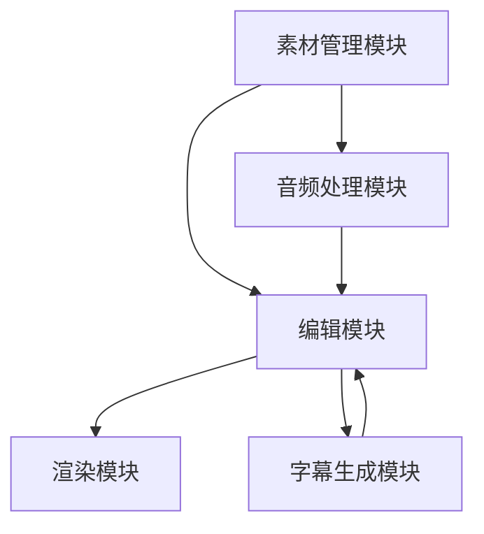

                 

### 文章标题

《视频编辑软件：人人都是内容创作者》

#### 关键词

- 视频编辑软件
- 内容创作
- 视频处理技术
- 创作工具
- 用户体验
- 创意表达

#### 摘要

本文将深入探讨视频编辑软件的现状及其对现代内容创作者的影响。我们将从背景介绍入手，逐步分析视频编辑软件的核心概念、算法原理、数学模型，并通过实际项目实践展示其应用。同时，本文还将介绍相关工具和资源，展望视频编辑软件的未来发展趋势和挑战。

## 1. 背景介绍

### 1.1 视频编辑软件的发展历程

视频编辑软件的起源可以追溯到上世纪80年代，那时计算机性能较低，视频编辑主要依赖专业设备。随着时间的推移，计算机性能的提升和数字视频技术的普及，视频编辑软件逐渐走向大众市场。如今，视频编辑软件已经成为每个人都能使用的工具，使得人人都可以成为内容创作者。

### 1.2 现代内容创作者的需求

随着互联网的快速发展，现代内容创作者面临着激烈的竞争。他们需要不断提高创作水平，以吸引观众的注意力。视频编辑软件为内容创作者提供了丰富的创意工具和高效的编辑流程，帮助他们更好地表达自己的观点和情感。

## 2. 核心概念与联系

### 2.1 视频编辑软件的核心概念

视频编辑软件的核心概念包括视频剪辑、特效添加、音频处理和字幕生成等。这些概念相互关联，共同构成了一个完整的视频创作流程。

### 2.2 视频编辑软件的架构

视频编辑软件通常采用模块化架构，包括以下主要模块：

- **素材管理模块**：用于管理视频、音频、图片等素材。
- **编辑模块**：提供视频剪辑、特效添加等功能。
- **渲染模块**：将编辑好的视频渲染为最终格式。

### 2.3 Mermaid 流程图



## 3. 核心算法原理 & 具体操作步骤

### 3.1 视频剪辑算法原理

视频剪辑算法主要涉及视频序列的分割、拼接和调整。其核心原理是基于时间轴的操作，通过对视频片段进行裁剪、拼接和调整，实现视频内容的编辑。

### 3.2 具体操作步骤

1. **导入素材**：将视频、音频、图片等素材导入到编辑软件中。
2. **剪辑视频**：使用剪辑工具对视频进行分割、裁剪和拼接。
3. **添加特效**：使用特效库为视频添加各种视觉效果。
4. **音频处理**：调整音频的音量、音调和声道。
5. **字幕生成**：输入字幕文本，并设置字体、颜色和位置。
6. **渲染输出**：将编辑好的视频渲染为最终格式，如MP4、AVI等。

## 4. 数学模型和公式 & 详细讲解 & 举例说明

### 4.1 视频剪辑的数学模型

视频剪辑的数学模型主要涉及时间轴的操作。设视频时长为\( T \)，剪辑后的视频时长为\( T' \)，则有：

\[ T' = T - \Delta t \]

其中，\( \Delta t \) 为剪辑过程中删除的时间。

### 4.2 举例说明

假设一个视频时长为60秒，剪辑后时长为30秒，那么：

\[ \Delta t = 60 - 30 = 30 \]

这意味着视频剪辑过程中删除了30秒的内容。

### 4.3 LaTeX 公式

以下是关于视频剪辑的 LaTeX 公式：

$$
T' = T - \Delta t
$$

## 5. 项目实践：代码实例和详细解释说明

### 5.1 开发环境搭建

在本项目中，我们将使用 Python 编写视频编辑脚本。首先，需要安装以下依赖库：

```bash
pip install opencv-python numpy moviepy
```

### 5.2 源代码详细实现

以下是一个简单的视频剪辑脚本示例：

```python
import cv2
import numpy as np

# 导入视频
video = cv2.VideoCapture('input.mp4')

# 创建输出视频
fourcc = cv2.VideoWriter_fourcc(*'mp4v')
out = cv2.VideoWriter('output.mp4', fourcc, 30.0, (640, 480))

# 剪辑视频
start_time = 10  # 剪辑开始时间（秒）
end_time = 30    # 剪辑结束时间（秒）

while True:
    ret, frame = video.read()
    if not ret:
        break

    # 计算时间差
    current_time = video.get(cv2.CAP_PROP_POS_MSEC) / 1000
    if current_time < start_time or current_time > end_time:
        continue

    # 写入输出视频
    out.write(frame)

# 释放资源
video.release()
out.release()
```

### 5.3 代码解读与分析

1. **导入依赖库**：脚本首先导入 OpenCV、NumPy 和 MoviePy 依赖库。
2. **导入视频**：使用`cv2.VideoCapture`函数导入输入视频。
3. **创建输出视频**：使用`cv2.VideoWriter`函数创建输出视频。
4. **剪辑视频**：遍历视频帧，根据开始时间和结束时间对视频进行剪辑。
5. **写入输出视频**：将剪辑后的视频帧写入输出视频。
6. **释放资源**：最后，释放视频读取器和写入器资源。

### 5.4 运行结果展示

运行上述脚本后，将生成一个剪辑后的输出视频文件`output.mp4`。通过播放输出视频，可以看到剪辑后的视频内容。

## 6. 实际应用场景

视频编辑软件在以下实际应用场景中具有广泛的应用：

- **社交媒体**：个人和团队在社交媒体上发布短视频。
- **教育领域**：教师制作教学视频，提高教学效果。
- **市场营销**：企业制作宣传视频，提升品牌影响力。
- **娱乐行业**：电影制作公司进行后期制作和特效添加。

## 7. 工具和资源推荐

### 7.1 学习资源推荐

- **书籍**：《视频剪辑技术》
- **论文**：《视频编辑算法研究》
- **博客**：[OpenCV 官方博客](https://opencv.org/)
- **网站**：[YouTube 视频编辑教程](https://www.youtube.com/)

### 7.2 开发工具框架推荐

- **视频编辑软件**：Adobe Premiere Pro、Final Cut Pro、剪映
- **编程库**：OpenCV、MoviePy、FFmpeg

### 7.3 相关论文著作推荐

- **论文**：《基于深度学习的视频编辑算法研究》
- **著作**：《视频编辑技术与应用》

## 8. 总结：未来发展趋势与挑战

随着人工智能技术的不断发展，视频编辑软件将更加智能化和自动化。未来，视频编辑软件将面临以下挑战：

- **算法优化**：提高视频编辑算法的效率和质量。
- **用户界面**：优化用户界面，提高用户体验。
- **多平台支持**：支持更多平台和设备，满足不同用户需求。

## 9. 附录：常见问题与解答

### 9.1 如何选择合适的视频编辑软件？

- 根据个人需求选择专业级或入门级视频编辑软件。
- 考虑软件的易用性、功能丰富性和性能。

### 9.2 视频剪辑过程中如何提高效率？

- 使用批量处理功能，一次处理多个视频文件。
- 学习并掌握常用的视频编辑技巧，减少重复操作。

## 10. 扩展阅读 & 参考资料

- **书籍**：《视频编辑技术大全》
- **论文**：《视频编辑技术最新研究进展》
- **网站**：[视频编辑技术论坛](https://www.videotechnologyforum.com/)

---

作者：禅与计算机程序设计艺术 / Zen and the Art of Computer Programming

