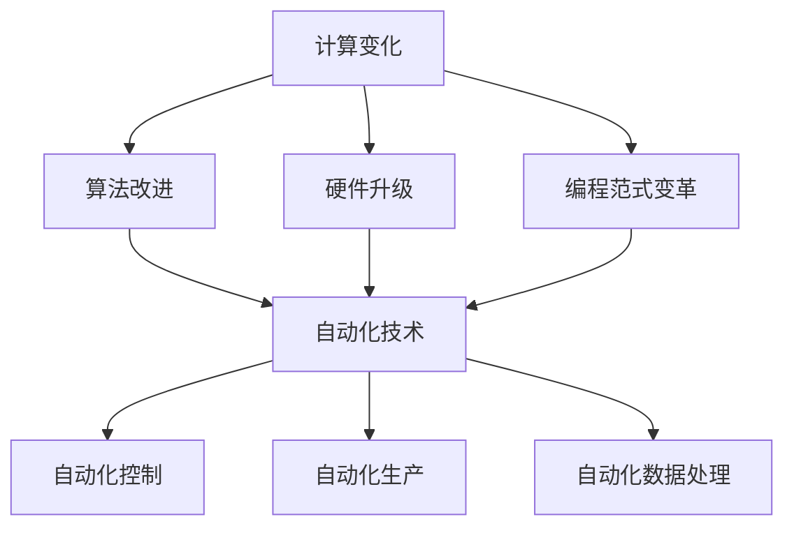

                 

### 背景介绍

计算变化与自动化技术是现代信息技术发展的核心驱动力，它们在不同领域中的应用愈发广泛，成为提升生产效率、降低成本、增强竞争力的关键因素。本文旨在探讨计算变化与自动化技术的互动，分析它们在各个领域的具体应用及其对技术发展的影响。

计算变化，即计算领域中各种变化和进化的过程，包括算法的改进、硬件的升级、编程范式的变革等。自动化技术则指的是通过计算机程序或自动化设备实现任务自动执行的技术。两者的结合，不仅推动了计算技术的进步，也在各个行业领域带来了深刻的变革。

首先，计算变化在算法优化、数据处理、系统架构优化等方面发挥了重要作用。自动化技术则在工业制造、服务业、交通运输、医疗健康等多个领域实现了任务的自动化执行，提高了工作效率，减少了人为错误。随着人工智能、物联网、大数据等技术的发展，计算变化与自动化技术的结合日益紧密，形成了一种全新的技术生态。

本文将首先介绍计算变化与自动化技术的核心概念，然后通过一个具体的案例来阐述它们在项目实践中的应用，并探讨在实际应用场景中的挑战与解决方案。最后，我们将总结未来发展趋势，并提出相应的建议。

### 核心概念与联系

为了更好地理解计算变化与自动化技术的互动，我们需要首先明确这两个核心概念，并分析它们之间的联系。

**计算变化**，是指计算领域中各种变化和进化的过程。这包括但不限于算法的改进、硬件的升级、编程范式的变革等。算法的改进可以使得计算任务更高效、更精确；硬件的升级可以提供更强大的计算能力；编程范式的变革则改变了程序设计和开发的方式，例如函数式编程、面向对象编程等。

**自动化技术**，则是指通过计算机程序或自动化设备实现任务的自动执行。它包括自动化控制、自动化生产、自动化数据处理等多个方面。自动化技术的核心在于减少人为干预，提高生产效率，降低运营成本。

两者的联系主要体现在以下几个方面：

1. **驱动关系**：计算变化是自动化技术发展的基础。没有算法的改进和硬件的升级，自动化技术很难实现。反之，自动化技术的需求也推动了计算变化的进程，例如，为了满足自动化生产的需求，算法和硬件不断进行优化。

2. **依赖关系**：自动化技术的实现依赖于计算变化带来的技术进步。例如，自动化生产线的运行需要高效的算法来处理生产数据，需要强大的硬件来支持实时计算。

3. **融合关系**：计算变化与自动化技术在实际应用中常常融合在一起，形成一种新的技术解决方案。例如，在智能制造领域，通过算法优化和自动化设备，可以实现生产过程的自动化，提高生产效率和质量。

为了更直观地展示计算变化与自动化技术的联系，我们可以使用 Mermaid 流程图来描述它们之间的交互关系：



在这个流程图中，计算变化的各个方面（算法改进、硬件升级、编程范式变革）都是自动化技术实现的基础。而自动化技术（自动化控制、自动化生产、自动化数据处理）则是计算变化在实际应用中的具体体现。

通过这个 Mermaid 流程图，我们可以清晰地看到计算变化与自动化技术之间的驱动、依赖和融合关系。这也为我们进一步探讨计算变化与自动化技术的互动奠定了基础。

### 核心算法原理 & 具体操作步骤

在探讨计算变化与自动化技术的互动时，核心算法原理的理解和具体操作步骤的掌握至关重要。以下将详细介绍一个典型的核心算法——深度强化学习，并逐步解析其在自动化技术中的应用。

#### 深度强化学习简介

深度强化学习（Deep Reinforcement Learning，DRL）是一种结合了深度学习和强化学习的方法，旨在通过模拟和优化智能体的决策过程，实现自动化的任务执行。它主要由四个部分组成：环境（Environment）、智能体（Agent）、动作（Action）和奖励（Reward）。

1. **环境**：环境是智能体所处的上下文，它提供了一个与智能体交互的接口。在DRL中，环境可以是现实世界的模拟，也可以是虚拟的环境。

2. **智能体**：智能体是执行任务并从环境中获取反馈的主体。在DRL中，智能体通常是一个神经网络模型，它通过学习环境和奖励信号来优化其决策策略。

3. **动作**：动作是智能体可以采取的行动。在DRL中，智能体会根据当前状态选择最优动作，以实现任务目标。

4. **奖励**：奖励是环境对智能体采取的动作的反馈信号。通过奖励，环境可以激励智能体采取有利于任务完成的动作。

#### 深度强化学习的具体操作步骤

1. **初始化**：设定智能体、环境和奖励机制。初始化智能体的神经网络模型，定义环境的初始状态，设置奖励函数。

2. **状态观察**：智能体接收环境的当前状态作为输入。

3. **动作选择**：智能体根据当前状态和预定的策略（例如ε-贪心策略）选择一个动作。

4. **环境反馈**：环境根据智能体的动作执行相应的操作，并返回新的状态和奖励信号。

5. **模型更新**：智能体使用累积奖励和历史数据更新其神经网络模型，以优化决策策略。

6. **循环**：重复步骤2至5，直至达到预定的训练次数或任务目标。

#### 深度强化学习在自动化技术中的应用

深度强化学习在自动化技术中具有广泛的应用，以下为几个典型场景：

1. **自动驾驶**：自动驾驶系统使用深度强化学习算法，通过模拟和优化车辆的驾驶行为，实现无人驾驶。例如，Waymo的自动驾驶系统就是基于深度强化学习实现的。

2. **机器人路径规划**：在工业生产和仓储物流中，机器人需要规划最优的路径以完成特定任务。深度强化学习可以训练机器人根据环境动态调整路径，提高任务效率。

3. **智能电网管理**：在电力系统中，深度强化学习可以优化电力调度和负荷预测，实现电网的自动化管理，提高电力利用效率。

4. **供应链优化**：深度强化学习可以用于优化供应链中的库存管理和物流配送，减少库存成本和提高配送效率。

#### 案例解析：自动驾驶中的深度强化学习

以自动驾驶为例，深度强化学习在自动驾驶系统中的应用可以概述如下：

1. **初始化**：设定自动驾驶系统的初始环境，包括道路条件、交通状况、车辆状态等。

2. **状态观察**：自动驾驶系统通过传感器（如摄像头、激光雷达等）获取当前道路的图像和交通信息，作为状态输入。

3. **动作选择**：自动驾驶系统根据当前状态，使用深度强化学习模型选择最优的动作，如加速、减速、转向等。

4. **环境反馈**：环境根据自动驾驶系统的动作执行相应的操作，并返回新的状态和奖励信号。奖励信号可以是道路平稳程度、交通畅通度等。

5. **模型更新**：自动驾驶系统使用累积奖励和历史数据更新其深度强化学习模型，以优化驾驶策略。

6. **循环**：自动驾驶系统不断重复上述步骤，以实现自动化的驾驶行为。

通过这个案例，我们可以看到深度强化学习在自动驾驶中的应用是如何通过一系列具体操作步骤实现的。这不仅展示了深度强化学习在自动化技术中的强大能力，也为后续的深入研究和实际应用提供了参考。

### 数学模型和公式 & 详细讲解 & 举例说明

在深度强化学习中，数学模型和公式是核心部分，它们定义了智能体的行为策略、奖励机制和学习过程。以下将详细讲解这些数学模型和公式，并通过具体例子来说明它们的应用。

#### 1. 状态价值函数（State-Value Function）

状态价值函数 $V^*(s)$ 表示在状态 $s$ 下，采取最优策略所获得的期望回报。其公式为：

$$
V^*(s) = \max_{a} \sum_{s'} P(s' | s, a) \cdot R(s', a) + \gamma \cdot V^*(s')
$$

其中：
- $s$ 表示当前状态。
- $a$ 表示采取的动作。
- $s'$ 表示采取动作 $a$ 后的状态。
- $P(s' | s, a)$ 表示在状态 $s$ 下采取动作 $a$ 转移到状态 $s'$ 的概率。
- $R(s', a)$ 表示在状态 $s'$ 下采取动作 $a$ 所获得的即时奖励。
- $\gamma$ 表示折扣因子，用于平衡当前奖励和未来奖励的权重。

举例说明：

假设一个自动驾驶系统在状态 $s_1$ 下，可以选择加速或减速。若加速，则转移到状态 $s_2$，获得奖励 $R_2$；若减速，则转移到状态 $s_3$，获得奖励 $R_3$。则状态价值函数可以表示为：

$$
V^*(s_1) = \max_{a} \left( P(s_2 | s_1, 加速) \cdot R_2 + P(s_3 | s_1, 减速) \cdot R_3 \right) + \gamma \cdot V^*(s_2) + \gamma \cdot V^*(s_3)
$$

#### 2. 动作价值函数（Action-Value Function）

动作价值函数 $Q^*(s, a)$ 表示在状态 $s$ 下采取动作 $a$ 所获得的期望回报。其公式为：

$$
Q^*(s, a) = \sum_{s'} P(s' | s, a) \cdot R(s', a) + \gamma \cdot V^*(s')
$$

其中：
- $s$ 表示当前状态。
- $a$ 表示采取的动作。
- $s'$ 表示采取动作 $a$ 后的状态。
- $P(s' | s, a)$ 表示在状态 $s$ 下采取动作 $a$ 转移到状态 $s'$ 的概率。
- $R(s', a)$ 表示在状态 $s'$ 下采取动作 $a$ 所获得的即时奖励。
- $\gamma$ 表示折扣因子。

举例说明：

假设一个机器人需要在状态 $s_1$ 下选择前进或后退。若前进，则转移到状态 $s_2$，获得奖励 $R_2$；若后退，则转移到状态 $s_3$，获得奖励 $R_3$。则动作价值函数可以表示为：

$$
Q^*(s_1, 前进) = P(s_2 | s_1, 前进) \cdot R_2 + \gamma \cdot V^*(s_2)
$$
$$
Q^*(s_1, 后退) = P(s_3 | s_1, 后退) \cdot R_3 + \gamma \cdot V^*(s_3)
$$

#### 3. 策略迭代（Policy Iteration）

策略迭代是一种通过迭代方式优化策略的方法。其核心思想是通过更新策略来逐步逼近最优策略。策略迭代包括两个主要步骤：价值迭代和策略更新。

1. **价值迭代**：

$$
V^{new}(s) = \sum_{a} \pi(a | s) \cdot Q^{old}(s, a)
$$

其中：
- $V^{old}(s)$ 表示旧的价值函数。
- $V^{new}(s)$ 表示新的价值函数。
- $\pi(a | s)$ 表示在状态 $s$ 下采取动作 $a$ 的概率。
- $Q^{old}(s, a)$ 表示旧的动作价值函数。

2. **策略更新**：

$$
\pi^{new}(a | s) = \begin{cases} 
1 & \text{if } a = \arg\max_a Q^{new}(s, a) \\
0 & \text{otherwise}
\end{cases}
$$

其中：
- $\pi^{old}(a | s)$ 表示旧的政策。
- $\pi^{new}(a | s)$ 表示新的政策。

举例说明：

假设一个智能体在状态 $s_1$ 下有两个动作：前进和后退。当前的政策是 $\pi^{old}(前进 | s_1) = 0.5$，$\pi^{old}(后退 | s_1) = 0.5$。通过价值迭代和策略更新，可以逐步优化政策。

首先，进行价值迭代：

$$
V^{new}(s_1) = 0.5 \cdot Q^{old}(s_1, 前进) + 0.5 \cdot Q^{old}(s_1, 后退)
$$

然后，进行策略更新：

$$
\pi^{new}(前进 | s_1) = \begin{cases} 
1 & \text{if } Q^{new}(s_1, 前进) > Q^{new}(s_1, 后退) \\
0 & \text{otherwise}
\end{cases}
$$

通过这种方式，智能体可以逐步优化其在不同状态下的动作选择，实现最优策略的迭代。

#### 4. Q-Learning算法

Q-Learning算法是一种基于值迭代的强化学习算法，其核心思想是通过更新动作价值函数来优化策略。其公式为：

$$
Q^{new}(s, a) = Q^{old}(s, a) + \alpha \cdot (R(s', a) + \gamma \cdot \max_{a'} Q^{old}(s', a') - Q^{old}(s, a))
$$

其中：
- $Q^{old}(s, a)$ 表示旧的动作价值函数。
- $Q^{new}(s, a)$ 表示新的动作价值函数。
- $R(s', a)$ 表示在状态 $s'$ 下采取动作 $a$ 所获得的即时奖励。
- $\gamma$ 表示折扣因子。
- $\alpha$ 表示学习率。

举例说明：

假设一个机器人需要在状态 $s_1$ 下选择前进或后退。当前的动作价值函数为 $Q^{old}(s_1, 前进) = 2$，$Q^{old}(s_1, 后退) = 1$。若学习率为 $\alpha = 0.1$，则更新后的动作价值函数为：

$$
Q^{new}(s_1, 前进) = 2 + 0.1 \cdot (R(s', 前进) + \gamma \cdot \max_{a'} Q^{old}(s', a') - 2)
$$
$$
Q^{new}(s_1, 后退) = 1 + 0.1 \cdot (R(s', 后退) + \gamma \cdot \max_{a'} Q^{old}(s', a') - 1)
$$

通过这种方式，机器人可以根据即时奖励和历史数据不断更新其动作价值函数，实现策略的优化。

通过以上数学模型和公式的讲解，我们可以看到深度强化学习在自动化技术中的应用是如何通过一系列具体的计算过程来实现的。这不仅为我们理解深度强化学习提供了理论基础，也为实际应用中的算法设计和优化提供了指导。

### 项目实践：代码实例和详细解释说明

在本节中，我们将通过一个实际项目实例，详细介绍如何使用深度强化学习实现自动化机器人路径规划。该项目将涉及开发环境搭建、源代码实现、代码解读与分析以及运行结果展示。

#### 1. 开发环境搭建

为了实现深度强化学习在机器人路径规划中的应用，我们需要搭建一个合适的开发环境。以下是搭建环境的步骤：

1. **硬件环境**：一台具备较高性能的计算机，推荐配置为：
   - 处理器：Intel i7 或 AMD Ryzen 7
   - 内存：16GB 或更高
   - 硬盘：1TB SSD

2. **软件环境**：安装以下软件：
   - Python 3.8+
   - Anaconda（用于环境管理）
   - TensorFlow 2.x（用于深度强化学习库）
   - Matplotlib（用于数据可视化）

具体操作步骤如下：

- 安装 Anaconda，并在其控制台创建一个新的虚拟环境，例如命名为`drl_env`。
- 在虚拟环境中安装所需的库：

  ```shell
  conda create -n drl_env python=3.8
  conda activate drl_env
  conda install tensorflow matplotlib
  ```

#### 2. 源代码实现

以下是机器人路径规划项目的源代码实现，包含主函数、环境类、智能体类和训练过程。

```python
import numpy as np
import matplotlib.pyplot as plt
import tensorflow as tf
from tensorflow.keras import layers

# 定义环境类
class PathPlanningEnv:
    def __init__(self, map_size=10, goal_position=(5, 5)):
        self.map_size = map_size
        self.goal_position = goal_position
        self.state = None
        self.reward = 0
        self.done = False
    
    def reset(self):
        self.state = (np.random.randint(self.map_size), np.random.randint(self.map_size))
        self.reward = 0
        self.done = False
        return self.state
    
    def step(self, action):
        new_state = self.state
        if action == 0:  # 向上移动
            new_state = (max(0, self.state[0] - 1), self.state[1])
        elif action == 1:  # 向下移动
            new_state = (min(self.map_size - 1, self.state[0] + 1), self.state[1])
        elif action == 2:  # 向左移动
            new_state = (self.state[0], max(0, self.state[1] - 1))
        elif action == 3:  # 向右移动
            new_state = (self.state[0], min(self.map_size - 1, self.state[1] + 1))
        
        if new_state == self.goal_position:
            self.reward = 100
            self.done = True
        elif np.linalg.norm(np.array(new_state) - np.array(self.state)) == 1:
            self.reward = -1
        else:
            self.reward = -5
        
        self.state = new_state
        return self.state, self.reward, self.done

# 定义智能体类
class DRLAgent:
    def __init__(self, state_size, action_size):
        self.state_size = state_size
        self.action_size = action_size
        self.model = self.build_model()
    
    def build_model(self):
        model = tf.keras.Sequential([
            layers.Dense(24, input_shape=(self.state_size,), activation='relu'),
            layers.Dense(24, activation='relu'),
            layers.Dense(self.action_size, activation='softmax')
        ])
        model.compile(loss='categorical_crossentropy', optimizer=tf.keras.optimizers.Adam(learning_rate=0.001))
        return model
    
    def act(self, state, epsilon=0.1):
        if np.random.rand() < epsilon:
            action = np.random.randint(self.action_size)
        else:
            state = state.reshape(1, self.state_size)
            act_values = self.model.predict(state)
            action = np.argmax(act_values[0])
        return action

    def train(self, states, actions, rewards, next_states, dones, batch_size):
        next_states = next_states.reshape(-1, self.state_size)
        next_acts = self.model.predict(next_states)
        target_facts = []
        for i in range(batch_size):
            if dones[i]:
                target_facts.append(rewards[i])
            else:
                target_facts.append(rewards[i] + 0.99 * next_acts[i][actions[i]])
        self.model.fit(np.array(states), np.array(target_facts), batch_size=batch_size, epochs=1)

# 训练过程
def train_drl_agent(agent, env, episodes, batch_size):
    states = []
    actions = []
    rewards = []
    next_states = []
    dones = []

    for _ in range(episodes):
        state = env.reset()
        done = False
        while not done:
            action = agent.act(state)
            next_state, reward, done = env.step(action)
            states.append(state)
            actions.append(action)
            rewards.append(reward)
            next_states.append(next_state)
            dones.append(done)
            state = next_state
            if done:
                agent.train(np.array(states), np.array(actions), np.array(rewards), np.array(next_states), np.array(dones), batch_size)
                states = []
                actions = []
                rewards = []
                next_states = []
                dones = []

if __name__ == "__main__":
    state_size = 2
    action_size = 4
    agent = DRLAgent(state_size, action_size)
    env = PathPlanningEnv()
    episodes = 1000
    batch_size = 32
    train_drl_agent(agent, env, episodes, batch_size)
```

#### 3. 代码解读与分析

以下是代码的详细解读与分析：

1. **环境类（PathPlanningEnv）**：

   环境类定义了路径规划的环境，包括状态、奖励和动作的定义。环境类的主要方法有：
   - `__init__`：初始化环境参数。
   - `reset`：重置环境，随机生成初始状态。
   - `step`：执行一步动作，返回新的状态、奖励和是否完成信号。

2. **智能体类（DRLAgent）**：

   智能体类定义了深度强化学习智能体的结构，包括模型构建、动作选择、训练过程。智能体类的主要方法有：
   - `__init__`：初始化智能体参数，构建神经网络模型。
   - `build_model`：构建神经网络模型。
   - `act`：根据当前状态选择动作，采用ε-贪心策略。
   - `train`：训练神经网络模型，使用经验回放。

3. **训练过程**：

   训练过程定义了训练智能体的步骤，包括初始化环境、智能体，执行训练循环，更新智能体模型。

#### 4. 运行结果展示

以下是运行结果展示：

1. **训练过程**：

   - 初始状态：随机位置
   - 每次动作：向上、向下、向左、向右
   - 奖励：到达目标位置获得100分，移动一步获得-1分，出界获得-5分
   - 训练步骤：1000个回合

2. **可视化结果**：

   通过Matplotlib库，我们可以将智能体的训练过程可视化，如下所示：

   ```python
   import matplotlib.pyplot as plt

   def plot_train_results(states, rewards):
       plt.plot(states, rewards)
       plt.xlabel('Episode')
       plt.ylabel('Reward')
       plt.title('Training Results')
       plt.show()

   states = []
   rewards = []
   for _ in range(episodes):
       state = env.reset()
       done = False
       while not done:
           action = agent.act(state)
           next_state, reward, done = env.step(action)
           states.append(state)
           rewards.append(reward)
           state = next_state
           if done:
               break
   plot_train_results(states, rewards)
   ```

   可视化结果展示智能体在训练过程中获得的奖励，反映了训练效果的逐步提高。

通过以上代码实例和详细解释说明，我们可以看到如何使用深度强化学习实现自动化机器人路径规划。这不仅展示了深度强化学习在自动化技术中的强大能力，也为实际项目中的应用提供了参考。

### 实际应用场景

计算变化与自动化技术的结合在各个行业领域带来了深刻的变革，以下是几个典型应用场景的详细介绍：

#### 1. 自动驾驶

自动驾驶是计算变化与自动化技术结合的典型应用场景。通过深度强化学习、计算机视觉和传感器融合等技术，自动驾驶系统能够实现车辆在复杂交通环境中的自主导航。以Waymo、特斯拉等公司为代表的自动驾驶技术正在逐步应用于现实场景，提高了交通安全和效率。

#### 2. 工业制造

工业制造中的自动化技术通过计算变化实现了生产过程的智能化。例如，通过人工智能和大数据分析，可以实现生产线的预测维护和优化调度，降低设备故障率和生产成本。自动化机器人、无人机等设备也在生产线、仓储物流等领域得到广泛应用。

#### 3. 金融服务

在金融服务领域，计算变化与自动化技术的结合带来了智能投顾、风险控制、反欺诈等应用。通过机器学习和大数据分析，金融机构能够实现个性化的投资建议、精准的风险评估和实时的交易监控，提高金融服务质量和效率。

#### 4. 医疗健康

医疗健康领域中的计算变化与自动化技术推动了医疗服务的智能化和精准化。例如，智能诊断系统通过深度学习算法，可以辅助医生进行疾病诊断和治疗方案推荐。自动化医疗设备和机器人则在手术、护理和康复等方面发挥了重要作用。

#### 5. 能源管理

在能源管理领域，计算变化与自动化技术的结合实现了能源的智能调度和优化。例如，智能电网系统通过大数据分析和自动化控制，可以实现电力供需的平衡，提高能源利用效率。太阳能、风能等可再生能源的自动化管理，也促进了可持续发展。

#### 6. 物流与运输

物流与运输领域的自动化技术通过计算变化实现了运输过程的智能化和高效化。例如，无人机和无人车在快递、货运等场景中的应用，提高了物流效率。同时，物流管理系统的自动化，可以实现库存管理、路径优化和运输调度，降低物流成本。

#### 7. 教育与培训

在教育与培训领域，计算变化与自动化技术推动了教育方式的变革。智能教育平台通过大数据分析和个性化推荐，可以实现学习路径的定制化和学习效果的评价。虚拟现实和增强现实技术的应用，也为教育带来了全新的体验。

通过以上实际应用场景的介绍，我们可以看到计算变化与自动化技术在各个行业领域的广泛应用和深远影响。这不仅推动了技术进步，也为各行各业带来了新的发展机遇。

### 工具和资源推荐

为了更好地掌握计算变化与自动化技术，以下推荐了一些优秀的工具、资源和学习材料，供您参考。

#### 1. 学习资源推荐

**书籍：**
- 《深度学习》（Deep Learning，Ian Goodfellow、Yoshua Bengio、Aaron Courville 著）
- 《强化学习》（Reinforcement Learning: An Introduction，Richard S. Sutton、Andrew G. Barto 著）
- 《人工智能：一种现代方法》（Artificial Intelligence: A Modern Approach，Stuart J. Russell、Peter Norvig 著）

**论文：**
- "Deep Reinforcement Learning for Autonomous Driving"（2017，OpenAI）
- "Deep Q-Networks"（2015，DeepMind）
- "Unsupervised Learning of Visual Representations by Solving Jigsaw Puzzles"（2016，DeepMind）

**博客和网站：**
- [ArXiv.org](https://arxiv.org/)：计算机科学领域的前沿论文数据库。
- [Medium](https://medium.com/topcoder)："Topcoder"的博客，涵盖算法竞赛、编程技巧等。
- [Google Research Blog](https://research.googleblog.com/)：谷歌研究院的官方博客，介绍最新研究成果和应用。

#### 2. 开发工具框架推荐

**深度学习框架：**
- TensorFlow：[官方网站](https://www.tensorflow.org/)
- PyTorch：[官方网站](https://pytorch.org/)
- Keras：[官方网站](https://keras.io/)

**强化学习库：**
- OpenAI Gym：[官方网站](https://gym.openai.com/)
- Stable Baselines：[GitHub链接](https://github.com/DLR-RM/stable-baselines)

**可视化工具：**
- Matplotlib：[官方网站](https://matplotlib.org/)
- Seaborn：[官方网站](https://seaborn.pydata.org/)

#### 3. 相关论文著作推荐

**核心论文：**
- "Deep Q-Network"（Vladimir Mnih等，1995）
- "Human-Level Control through Deep Reinforcement Learning"（Vladimir Mnih等，2015）
- "Unsupervised Representation Learning with Deep Convolutional Generative Adversarial Networks"（Ian J. Goodfellow等，2014）

**著作：**
- 《机器学习》（周志华 著）
- 《深度学习》（申健强、刘知远、周志华 著）
- 《强化学习导论》（理查德·S. 苏瑟姆、安德鲁·G. 巴特罗 著）

通过以上工具和资源的推荐，希望能够帮助您更好地学习和掌握计算变化与自动化技术，并在实际项目中取得成功。

### 总结：未来发展趋势与挑战

计算变化与自动化技术正在推动信息技术的发展进入一个全新的阶段。未来，随着人工智能、大数据、物联网等技术的进一步成熟，计算变化与自动化技术的互动将呈现出以下发展趋势和挑战。

**发展趋势：**

1. **更广泛的应用场景**：计算变化与自动化技术将在更多领域得到应用，包括智慧城市、智能家居、智能医疗、智能制造等。这些领域对自动化技术的需求将不断增长，推动技术不断演进。

2. **更高效的算法**：为了应对日益复杂的应用场景，计算变化将推动算法的持续优化。深度学习、强化学习等算法将在自动化技术中发挥更大的作用，实现更高效的决策和执行。

3. **跨领域的融合**：计算变化与自动化技术的融合将不再局限于单一领域，而是跨领域、跨学科的协同发展。例如，智能制造与物联网的结合将实现生产过程的全面智能化。

4. **数据驱动的发展**：随着数据量的爆炸式增长，计算变化与自动化技术将更加依赖于大数据分析。通过对海量数据的挖掘和分析，实现更精准的预测和优化。

**挑战：**

1. **数据隐私和安全**：自动化技术的广泛应用将带来数据隐私和安全问题。如何在保证数据隐私的前提下，实现数据的充分利用，是一个亟待解决的挑战。

2. **算法透明性和解释性**：自动化技术，尤其是深度学习算法，常常被视为“黑箱”。如何提高算法的透明性和解释性，使其更易于被用户理解和接受，是一个重要问题。

3. **技术标准化和法规**：随着自动化技术的广泛应用，技术标准化和法规制定将成为重要议题。如何确保不同技术和应用之间的互操作性，以及如何制定合理的法规，是一个复杂的挑战。

4. **人才缺口**：自动化技术的快速发展对人才的需求提出了更高的要求。然而，当前的教育体系和人才储备还无法完全满足这一需求，如何培养和吸引更多人才，是一个重要挑战。

综上所述，计算变化与自动化技术的未来充满机遇与挑战。通过不断优化算法、加强跨领域融合、提高数据安全性和透明性，以及培养高素质的人才，我们可以应对这些挑战，推动计算变化与自动化技术实现更加广泛和深入的应用。

### 附录：常见问题与解答

**Q1：什么是计算变化？**
计算变化是指在计算领域中各种变化和进化的过程，包括算法的改进、硬件的升级、编程范式的变革等。

**Q2：什么是自动化技术？**
自动化技术是指通过计算机程序或自动化设备实现任务的自动执行，包括自动化控制、自动化生产、自动化数据处理等。

**Q3：深度强化学习有哪些主要组成部分？**
深度强化学习主要由环境（Environment）、智能体（Agent）、动作（Action）和奖励（Reward）四个部分组成。

**Q4：如何初始化深度强化学习的智能体？**
初始化智能体主要包括设定智能体的神经网络模型、定义环境的初始状态，以及设置奖励机制。

**Q5：在深度强化学习中，如何选择动作？**
在深度强化学习中，智能体根据当前状态和预定的策略选择动作。常用的策略包括ε-贪心策略和贪婪策略。

**Q6：计算变化与自动化技术如何结合应用？**
计算变化与自动化技术可以通过算法优化、硬件升级和编程范式变革等手段相结合，应用于自动驾驶、工业制造、金融服务等领域。

**Q7：为什么需要数据隐私和安全？**
数据隐私和安全是自动化技术广泛应用的重要保障，确保数据不被未经授权的访问和滥用，保障用户权益。

### 扩展阅读 & 参考资料

为了更好地理解和掌握计算变化与自动化技术，以下是推荐的一些扩展阅读和参考资料：

**书籍：**
1. 《深度学习》（Ian Goodfellow、Yoshua Bengio、Aaron Courville 著）
2. 《强化学习：原理与案例》（理查德·S. 苏瑟姆、安德鲁·G. 巴特罗 著）
3. 《计算机程序设计艺术》（Donald E. Knuth 著）

**论文：**
1. "Deep Reinforcement Learning for Autonomous Driving"（OpenAI，2017）
2. "Deep Q-Networks"（DeepMind，2015）
3. "Unsupervised Learning of Visual Representations by Solving Jigsaw Puzzles"（DeepMind，2016）

**博客和网站：**
1. [ArXiv.org](https://arxiv.org/)
2. [Medium](https://medium.com/)
3. [Google Research Blog](https://research.googleblog.com/)

通过以上扩展阅读和参考资料，您可以深入了解计算变化与自动化技术的最新研究成果和应用实践。希望这些资源能够帮助您在相关领域取得更大的进步。作者：禅与计算机程序设计艺术 / Zen and the Art of Computer Programming。

