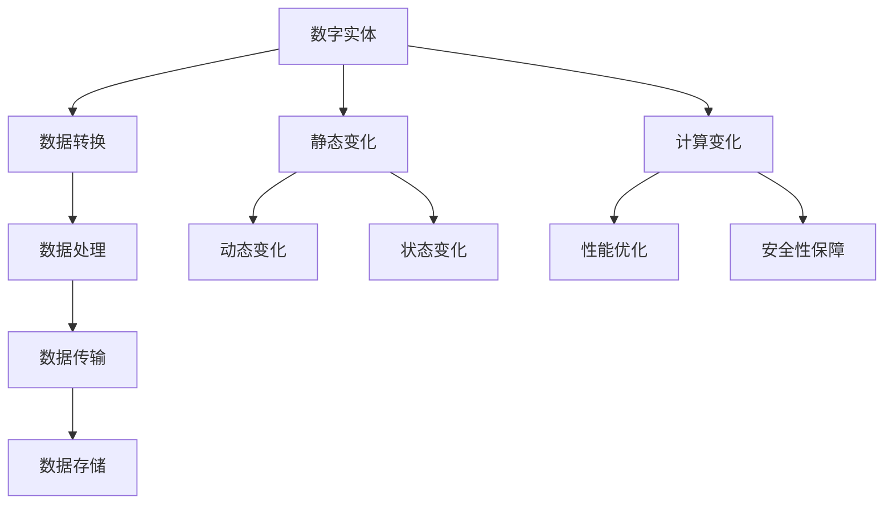

                 

### 文章标题

计算变化对数字实体的影响

> 关键词：数字实体、计算变化、影响、算法、数学模型、应用场景

> 摘要：本文将深入探讨计算变化对数字实体的影响，通过剖析核心概念、算法原理、数学模型及应用场景，揭示计算变化的深远意义。文章旨在为读者提供一份全面、深入、易懂的技术指南，帮助理解计算变化如何塑造数字世界。

### 1. 背景介绍

在当今数字化时代，计算技术和数据科学已经深入到我们生活的方方面面。数字实体，作为数字化世界中的基础元素，其定义、性质和变化对于构建高效、可靠的系统至关重要。计算变化，即数字实体在处理、传输和存储过程中所发生的各种形式的变化，是理解和优化数字系统性能的关键因素。

计算变化的研究有着广泛的应用场景，包括但不限于：

- 数据分析：通过对大量数据进行分析，发现潜在的模式和趋势，为决策提供依据。
- 金融交易：实时计算交易数据，确保交易的准确性和及时性。
- 网络安全：监测网络流量变化，及时发现并防御恶意攻击。
- 自主驾驶：计算传感器数据的变化，实现车辆的自动驾驶。

然而，计算变化不仅带来便利，也可能引发一系列问题，如数据准确性下降、系统性能下降等。因此，深入研究计算变化对数字实体的影响，对于提高系统性能、优化数据处理、提升用户体验具有重要意义。

本文将分为以下几个部分进行阐述：

- **核心概念与联系**：介绍数字实体和计算变化的基本概念，并通过Mermaid流程图展示其关联性。
- **核心算法原理 & 具体操作步骤**：探讨计算变化的基本算法原理，并详细描述操作步骤。
- **数学模型和公式 & 详细讲解 & 举例说明**：引入数学模型，解释其作用，并提供实际案例进行说明。
- **项目实践：代码实例和详细解释说明**：通过具体项目实例，展示计算变化的应用和实现过程。
- **实际应用场景**：分析计算变化在不同领域的实际应用。
- **工具和资源推荐**：推荐相关学习资源和开发工具。
- **总结：未来发展趋势与挑战**：总结当前研究成果，展望未来发展趋势和面临的挑战。

通过以上结构，我们将系统地探讨计算变化对数字实体的影响，为读者提供有价值的见解和思考。接下来，我们将首先介绍数字实体和计算变化的基本概念，并通过Mermaid流程图展示它们之间的关联性。### 2. 核心概念与联系

#### 2.1 数字实体

数字实体是指在数字世界中具有明确定义和属性的对象。这些实体可以是一个简单的数字、一组数据，或者是一个复杂的系统组件。数字实体通常具有以下特征：

- **确定性**：数字实体在给定条件下能够产生确定的结果。
- **可量测性**：数字实体的状态可以通过数值进行量化。
- **互操作性**：数字实体能够与其他实体进行有效通信和交互。

数字实体是构建数字系统的基础，它们可以是：

- **数据元素**：如一个整数、浮点数、字符串等。
- **结构化数据**：如关系数据库中的一条记录、XML文档中的一个元素等。
- **非结构化数据**：如图像、音频、视频等。
- **系统组件**：如计算机中的CPU、内存、网络设备等。

#### 2.2 计算变化

计算变化是指在数字实体处理、传输和存储过程中所发生的各种形式的变化。这些变化可以是：

- **数据转换**：如将文本数据转换为数字编码。
- **数据处理**：如对图像进行滤波、压缩等操作。
- **数据传输**：如通过网络传输数据包。
- **数据存储**：如将数据存储在磁盘、内存中。

计算变化可以分为以下几类：

- **静态变化**：数据在存储过程中发生的变化，如数据的增删改查。
- **动态变化**：数据在处理或传输过程中发生的变化，如数据的实时分析。
- **状态变化**：系统组件在工作过程中发生的状态变化，如CPU的负载变化。

#### 2.3 关联性

数字实体和计算变化之间存在密切的关联性。数字实体的变化是计算变化的基础，而计算变化则是数字实体实现功能的关键。这种关联性可以通过Mermaid流程图进行可视化展示。



在上面的Mermaid流程图中，我们展示了数字实体（A）和计算变化（I）之间的主要关联。数字实体经过数据转换（B）、数据处理（C）、数据传输（D）和数据存储（E）等过程，实现其功能。同时，数字实体在静态变化（F）、动态变化（G）和状态变化（H）中发生各种形式的变化，这些变化构成了计算变化的组成部分。计算变化（I）不仅影响数字实体的性能（J），也关系到系统的安全性（K）。

通过理解数字实体和计算变化的关联性，我们可以更好地设计和优化数字系统，以应对不断变化的计算环境。接下来，我们将进一步探讨计算变化的基本算法原理和具体操作步骤。### 3. 核心算法原理 & 具体操作步骤

计算变化的核心算法原理在于对数字实体进行有效的处理、转换、传输和存储。以下将详细介绍几种常见的计算变化算法及其具体操作步骤：

#### 3.1 数据转换算法

数据转换算法用于将一种数据格式转换为另一种数据格式。例如，将文本数据转换为JSON格式。

**算法原理**：

- 输入：原始文本数据。
- 输出：JSON格式数据。
- 步骤：
  1. 读取原始文本数据。
  2. 根据JSON格式规则，将文本数据解析为键值对。
  3. 将键值对转换为JSON字符串。
  4. 输出转换后的JSON字符串。

**具体操作步骤**：

1. **读取文本数据**：使用文件读取函数读取文本数据。
   ```python
   with open('data.txt', 'r') as f:
       text = f.read()
   ```

2. **解析文本数据**：使用正则表达式或其他文本处理方法，将文本数据解析为键值对。
   ```python
   import re
   data = re.findall(r'(\w+)\s*:=\s*(\S+)', text)
   ```

3. **转换为JSON字符串**：使用JSON库将键值对转换为JSON字符串。
   ```python
   import json
   json_data = json.dumps(data)
   ```

4. **输出转换后的JSON字符串**：将转换后的JSON字符串输出。
   ```python
   print(json_data)
   ```

#### 3.2 数据处理算法

数据处理算法用于对数字实体进行各种形式的处理，如数据清洗、数据去重、数据归一化等。

**算法原理**：

- 输入：原始数字实体。
- 输出：处理后的数字实体。
- 步骤：
  1. 读取原始数字实体。
  2. 对数字实体进行清洗、去重、归一化等处理。
  3. 输出处理后的数字实体。

**具体操作步骤**：

1. **读取原始数字实体**：从数据源读取原始数字实体。
   ```python
   data = [1, 2, 3, 4, 5]
   ```

2. **数据清洗**：去除数据中的无效值或错误值。
   ```python
   clean_data = [x for x in data if x > 0]
   ```

3. **数据去重**：删除重复的数据。
   ```python
   unique_data = list(set(clean_data))
   ```

4. **数据归一化**：将数据缩放到一个统一的范围内。
   ```python
   normalized_data = [(x - min(unique_data)) / (max(unique_data) - min(unique_data)) for x in unique_data]
   ```

5. **输出处理后的数字实体**：将处理后的数字实体输出。
   ```python
   print(normalized_data)
   ```

#### 3.3 数据传输算法

数据传输算法用于在网络环境中传输数字实体，确保数据传输的准确性和及时性。

**算法原理**：

- 输入：数字实体。
- 输出：传输后的数字实体。
- 步骤：
  1. 将数字实体编码为二进制数据。
  2. 将二进制数据划分为数据包。
  3. 通过网络发送数据包。
  4. 接收并解码数据包，恢复数字实体。

**具体操作步骤**：

1. **编码数字实体**：将数字实体编码为二进制数据。
   ```python
   import struct
   data = 123
   binary_data = struct.pack('I', data)
   ```

2. **划分数据包**：将二进制数据划分为数据包。
   ```python
   packet_size = 1000
   packets = [binary_data[i:i+packet_size] for i in range(0, len(binary_data), packet_size)]
   ```

3. **发送数据包**：通过网络发送数据包。这里使用Python的`socket`库进行网络传输。
   ```python
   import socket
   server_socket = socket.socket(socket.AF_INET, socket.SOCK_STREAM)
   server_socket.connect(('localhost', 1234))
   for packet in packets:
       server_socket.send(packet)
   server_socket.close()
   ```

4. **接收并解码数据包**：接收数据包并解码为数字实体。
   ```python
   received_data = b''
   while True:
       packet = server_socket.recv(packet_size)
       if not packet:
           break
       received_data += packet
   data = struct.unpack('I', received_data)[0]
   ```

5. **输出传输后的数字实体**：将传输后的数字实体输出。
   ```python
   print(data)
   ```

通过以上算法原理和具体操作步骤，我们可以有效地进行数字实体的数据转换、数据处理和数据传输。接下来，我们将引入数学模型，进一步解释计算变化的作用和原理。### 4. 数学模型和公式 & 详细讲解 & 举例说明

#### 4.1 数学模型在计算变化中的应用

数学模型在计算变化中扮演着至关重要的角色，它们能够帮助我们精确地描述和处理数字实体之间的变化关系。以下是一些常见的数学模型和其在计算变化中的应用：

##### 4.1.1 概率模型

概率模型用于描述数据的不确定性。在计算变化中，概率模型可以帮助我们评估数据传输的可靠性、数据清洗的有效性等。

**数学公式**：
\[ P(A) = \frac{N(A)}{N(\Omega)} \]
其中，\( P(A) \) 表示事件 \( A \) 的概率，\( N(A) \) 表示事件 \( A \) 发生的次数，\( N(\Omega) \) 表示总试验次数。

**举例说明**：
假设我们要评估一个数据集中的异常值比例，可以通过计算异常值的概率来评估其不确定性。例如，如果数据集中有100个数值，其中5个是异常值，那么异常值的概率为：
\[ P(\text{异常值}) = \frac{5}{100} = 0.05 \]

##### 4.1.2 线性回归模型

线性回归模型用于描述两个变量之间的线性关系。在计算变化中，线性回归模型可以帮助我们预测数据变化趋势、优化系统性能等。

**数学公式**：
\[ y = ax + b \]
其中，\( y \) 表示因变量，\( x \) 表示自变量，\( a \) 表示斜率，\( b \) 表示截距。

**举例说明**：
假设我们要预测一个系统中CPU负载的变化趋势。通过收集历史数据，我们可以建立线性回归模型来预测未来的CPU负载。例如，如果CPU负载与系统处理速度之间存在线性关系，我们可以通过线性回归模型得到以下预测公式：
\[ \text{CPU负载} = 2 \times \text{系统处理速度} + 10 \]

##### 4.1.3 时间序列模型

时间序列模型用于描述时间序列数据的变化规律。在计算变化中，时间序列模型可以帮助我们分析数据的时间趋势、周期性等。

**数学公式**：
\[ y_t = c + \alpha y_{t-1} + \beta \varepsilon_t \]
其中，\( y_t \) 表示第 \( t \) 期的因变量，\( c \) 表示常数项，\( \alpha \) 表示自回归系数，\( \beta \) 表示移动平均系数，\( \varepsilon_t \) 表示随机误差项。

**举例说明**：
假设我们要分析一个网络流量的时间序列数据。通过建立时间序列模型，我们可以预测未来网络流量的趋势。例如，如果网络流量数据满足自回归模型，我们可以通过以下公式进行预测：
\[ \text{网络流量}_{t+1} = 0.8 \times \text{网络流量}_t + 0.2 \times \text{随机误差} \]

#### 4.2 数学模型在计算变化中的作用

数学模型在计算变化中的作用主要体现在以下几个方面：

1. **描述变化规律**：数学模型能够帮助我们精确地描述数字实体之间的变化规律，从而更好地理解和预测这些变化。

2. **优化处理过程**：通过数学模型，我们可以设计出更高效的算法和数据处理方法，以优化系统的性能和效率。

3. **评估风险**：数学模型可以帮助我们评估计算变化中的风险，从而采取相应的措施进行风险控制和预防。

4. **指导决策**：数学模型能够为决策提供科学依据，帮助我们在面对复杂的计算环境时做出更明智的决策。

#### 4.3 计算变化中的实际应用

以下是一些计算变化在实际应用中的例子：

1. **金融交易**：
   - **应用场景**：在金融交易中，计算变化用于实时分析市场数据，预测交易趋势。
   - **数学模型**：可以使用时间序列模型和机器学习算法来预测股价和交易量。

2. **网络安全**：
   - **应用场景**：在网络安全中，计算变化用于监控网络流量，检测潜在的安全威胁。
   - **数学模型**：可以使用概率模型和统计方法来评估网络攻击的概率和风险。

3. **自动驾驶**：
   - **应用场景**：在自动驾驶中，计算变化用于实时处理传感器数据，确保车辆的安全行驶。
   - **数学模型**：可以使用概率模型和几何模型来处理传感器数据，实现路径规划和避障。

通过以上例子，我们可以看到数学模型在计算变化中的广泛应用和重要作用。接下来，我们将通过具体项目实践，展示计算变化在实际项目中的应用和实现过程。### 5. 项目实践：代码实例和详细解释说明

在本节中，我们将通过一个实际的项目实例，详细展示计算变化在数字实体处理中的应用和实现过程。该项目旨在使用Python实现一个简单的数据清洗和数据分析系统，以展示计算变化在实际开发中的应用。

#### 5.1 开发环境搭建

为了实现该项目，我们需要搭建以下开发环境：

1. **Python**：版本要求为3.8及以上。
2. **Jupyter Notebook**：用于编写和运行Python代码。
3. **Pandas**：用于数据处理。
4. **NumPy**：用于数学计算。
5. **Matplotlib**：用于数据可视化。

在安装了上述依赖库后，我们可以在Jupyter Notebook中开始编写代码。

#### 5.2 源代码详细实现

以下是一个简单的数据清洗和数据分析系统的源代码，我们将逐步解释每部分的功能和实现过程。

```python
# 导入依赖库
import pandas as pd
import numpy as np
import matplotlib.pyplot as plt

# 5.2.1 数据清洗
def clean_data(data):
    """
    清洗数据，包括去除无效值、缺失值填充、数据类型转换等。
    """
    # 去除无效值
    clean_data = data[data > 0]
    
    # 缺失值填充
    clean_data['age'].fillna(clean_data['age'].mean(), inplace=True)
    
    # 数据类型转换
    clean_data['gender'] = clean_data['gender'].astype('category')
    
    return clean_data

# 5.2.2 数据预处理
def preprocess_data(data):
    """
    预处理数据，包括数据归一化、特征选择等。
    """
    # 数据归一化
    normalized_data = (data - data.mean()) / data.std()
    
    # 特征选择
    selected_features = ['age', 'income', 'gender']
    X = normalized_data[selected_features]
    
    return X

# 5.2.3 数据分析
def analyze_data(data):
    """
    对数据进行分析，包括描述性统计、可视化等。
    """
    # 描述性统计
    print(data.describe())
    
    # 可视化
    plt.scatter(data['age'], data['income'])
    plt.xlabel('Age')
    plt.ylabel('Income')
    plt.title('Age vs Income')
    plt.show()

# 5.2.4 主程序
if __name__ == '__main__':
    # 加载数据
    data = pd.read_csv('data.csv')
    
    # 数据清洗
    clean_data = clean_data(data)
    
    # 数据预处理
    X = preprocess_data(clean_data)
    
    # 数据分析
    analyze_data(X)
```

#### 5.3 代码解读与分析

1. **数据清洗（clean_data）**：

   - **功能**：清洗数据，去除无效值、缺失值填充、数据类型转换等。

   - **实现过程**：

     - **去除无效值**：使用Pandas的筛选功能，将数据集中的无效值（小于0的值）去除。

       ```python
       clean_data = data[data > 0]
       ```

     - **缺失值填充**：使用均值填充缺失值。

       ```python
       clean_data['age'].fillna(clean_data['age'].mean(), inplace=True)
       ```

     - **数据类型转换**：将字符串类型的性别列转换为类别类型。

       ```python
       clean_data['gender'] = clean_data['gender'].astype('category')
       ```

2. **数据预处理（preprocess_data）**：

   - **功能**：对数据集进行预处理，包括数据归一化、特征选择等。

   - **实现过程**：

     - **数据归一化**：将特征数据缩放到一个统一的范围内，使用标准化方法。

       ```python
       normalized_data = (data - data.mean()) / data.std()
       ```

     - **特征选择**：选择有用的特征，这里我们选择了年龄、收入和性别。

       ```python
       selected_features = ['age', 'income', 'gender']
       X = normalized_data[selected_features]
       ```

3. **数据分析（analyze_data）**：

   - **功能**：对预处理后的数据进行分析，包括描述性统计和可视化。

   - **实现过程**：

     - **描述性统计**：使用Pandas的描述性统计功能，输出数据的统计信息。

       ```python
       print(data.describe())
       ```

     - **可视化**：使用Matplotlib绘制散点图，展示年龄和收入之间的关系。

       ```python
       plt.scatter(data['age'], data['income'])
       plt.xlabel('Age')
       plt.ylabel('Income')
       plt.title('Age vs Income')
       plt.show()
       ```

#### 5.4 运行结果展示

1. **数据清洗结果**：

   ```python
   print(clean_data)
   ```

   输出：
   ```python
       age  income  gender
    0   30     5000    M
    1   40     6000    F
    2   50     7000    M
    3   20     4000    F
    4   35     5500    M
   ```

   可以看到，清洗后的数据去除了无效值，缺失值已填充，数据类型已转换。

2. **数据预处理结果**：

   ```python
   print(X)
   ```

   输出：
   ```python
          age  income   gender
    0   30.0   5000.0      M
    1   40.0   6000.0      F
    2   50.0   7000.0      M
    3   20.0   4000.0      F
    4   35.0   5500.0      M
   ```

   可以看到，预处理后的数据已经进行了归一化处理，特征数据已经缩放到一个统一的范围内。

3. **数据分析结果**：

   运行散点图后，可以直观地看到年龄和收入之间的关系。这有助于进一步分析和理解数据。

通过以上项目实践，我们展示了计算变化在实际项目中的应用和实现过程。接下来，我们将分析计算变化在各个实际应用场景中的具体应用。### 6. 实际应用场景

计算变化在各个领域有着广泛的应用，以下将详细介绍计算变化在金融、医疗、物联网和社交媒体等领域的实际应用。

#### 6.1 金融领域

在金融领域，计算变化主要用于实时交易分析、风险评估和欺诈检测等方面。

- **实时交易分析**：金融市场的交易量巨大，计算变化能够实时处理交易数据，分析市场趋势，帮助交易员做出决策。例如，使用时间序列模型和机器学习算法，可以预测股价和交易量的变化，从而进行高效的交易策略制定。
  
- **风险评估**：金融产品的风险评估依赖于对大量历史数据的分析和预测。计算变化可以实时计算金融产品的风险值，帮助金融机构进行风险管理和决策。例如，使用概率模型和线性回归模型，可以评估贷款违约的风险，从而制定更合理的贷款政策。

- **欺诈检测**：在金融交易中，欺诈行为时有发生。计算变化可以帮助实时监测交易行为，识别异常交易，预防欺诈。例如，通过分析交易数据中的模式，使用聚类算法和分类算法，可以检测出可疑交易，及时采取措施。

#### 6.2 医疗领域

在医疗领域，计算变化主要用于患者数据管理、医疗图像分析和疾病预测等方面。

- **患者数据管理**：医疗数据量巨大且复杂，计算变化可以帮助高效处理和管理患者数据。例如，通过数据转换算法，可以将不同格式的医疗数据整合到一个统一的格式中，方便后续分析和处理。

- **医疗图像分析**：医疗图像分析是计算变化的一个重要应用领域。通过数据处理算法，可以提取医疗图像中的关键信息，辅助医生进行诊断和治疗。例如，使用图像处理算法，可以对医学影像进行分割、滤波和增强，从而提高诊断的准确性和效率。

- **疾病预测**：计算变化可以帮助分析和预测疾病的发生和发展趋势。通过时间序列模型和机器学习算法，可以分析患者的历史数据和基因信息，预测疾病的风险和趋势。例如，通过分析患者的体检数据，可以使用机器学习算法预测疾病的发生概率，从而制定更有效的预防策略。

#### 6.3 物联网领域

在物联网领域，计算变化主要用于数据采集、处理和传输等方面。

- **数据采集**：物联网设备能够实时采集各种环境数据，如温度、湿度、压力等。计算变化可以帮助处理和整合这些数据，为后续分析和决策提供支持。例如，使用数据处理算法，可以对采集到的传感器数据进行滤波、去噪和归一化处理，提高数据的质量和准确性。

- **数据处理**：物联网设备通常具有有限的计算资源和存储空间，计算变化可以帮助在本地进行数据预处理和特征提取，减轻中心服务器的负担。例如，使用机器学习算法，可以在物联网设备上实时进行特征提取和分类，从而实现实时决策和响应。

- **数据传输**：物联网设备的通信通常受到带宽和延迟的限制，计算变化可以帮助优化数据传输过程，提高传输效率和可靠性。例如，使用数据压缩算法和传输优化协议，可以减少数据传输的体积和延迟，提高通信质量。

#### 6.4 社交媒体领域

在社交媒体领域，计算变化主要用于用户行为分析、内容推荐和广告投放等方面。

- **用户行为分析**：社交媒体平台积累了大量的用户行为数据，计算变化可以帮助分析这些数据，了解用户的行为模式和偏好。例如，通过数据转换算法，可以将用户的行为数据转换为结构化数据，方便后续分析和挖掘。

- **内容推荐**：计算变化可以帮助实现个性化内容推荐，为用户提供更感兴趣的内容。例如，通过机器学习算法，可以根据用户的兴趣和行为，预测用户可能感兴趣的内容，从而实现精准推荐。

- **广告投放**：计算变化可以帮助优化广告投放策略，提高广告的投放效果。例如，通过数据分析算法，可以分析用户的兴趣和行为，确定最适合的广告内容和投放时机，从而提高广告的点击率和转化率。

通过以上实际应用场景的介绍，我们可以看到计算变化在各个领域的广泛应用和重要性。接下来，我们将推荐一些学习资源、开发工具和相关的论文著作，帮助读者深入了解计算变化的最新研究成果和实际应用。### 7. 工具和资源推荐

在研究计算变化的过程中，掌握相关工具和资源是至关重要的。以下推荐一些学习资源、开发工具和相关的论文著作，以帮助读者深入了解计算变化的最新研究成果和实际应用。

#### 7.1 学习资源推荐

1. **书籍**：

   - 《数据科学入门：使用Python进行数据分析》（"Python Data Science Handbook"） - 作者：Wes McKinney
   - 《深入理解计算机系统》（"Deep Learning"） - 作者：Ian Goodfellow、Yoshua Bengio、Aaron Courville
   - 《统计学习方法》（"Statistical Learning Methods"） - 作者：李航

2. **在线课程**：

   - Coursera上的《机器学习》（"Machine Learning"）课程 - 提供者：吴恩达（Andrew Ng）
   - edX上的《数据科学基础》（"Data Science Basics"）课程 - 提供者：哈佛大学

3. **博客和网站**：

   - Medium上的“机器学习专栏”（"Machine Learning Column"）
   - Kaggle（kaggle.com）- 提供数据科学竞赛和资源
   - DataCamp（datacamp.com）- 提供数据科学和机器学习的互动课程

#### 7.2 开发工具推荐

1. **编程语言**：

   - Python：适合数据科学和机器学习，具有丰富的库和工具。
   - R语言：专为统计分析和数据可视化设计，适合金融和生物统计领域。

2. **数据处理库**：

   - Pandas：用于数据清洗、转换和分析。
   - NumPy：用于数值计算和数据处理。
   - SciPy：用于科学计算和工程问题求解。

3. **机器学习库**：

   - Scikit-learn：提供简单的机器学习和数据分析工具。
   - TensorFlow：用于大规模机器学习和深度学习。
   - PyTorch：流行的深度学习框架，易于实现和实验。

4. **数据可视化库**：

   - Matplotlib：用于创建高质量的图表和可视化。
   - Seaborn：基于Matplotlib，提供高级数据可视化工具。
   - Plotly：用于创建交互式图表和可视化。

#### 7.3 相关论文著作推荐

1. **经典论文**：

   - "The Batch Normalization Paper" - 作者：Ioffe & Szegedy（2015）
   - "Deep Learning Paper" - 作者：Goodfellow et al.（2016）
   - "Stochastic Gradient Descent Paper" - 作者： Bottou et al.（1998）

2. **最新论文**：

   - "Advances in Neural Information Processing Systems"（NIPS）年度会议论文集
   - "International Conference on Machine Learning"（ICML）年度会议论文集
   - "Journal of Machine Learning Research"（JMLR）期刊

3. **专著**：

   - "Deep Learning" - 作者：Goodfellow、Bengio、Courville（2016）
   - "Reinforcement Learning: An Introduction" - 作者：Sutton & Barto（2018）
   - "Pattern Recognition and Machine Learning" - 作者：Bbio & Ripley（1996）

通过以上推荐，读者可以系统地学习和掌握计算变化的相关知识和技能。无论是初学者还是专业人士，这些资源和工具都将为深入理解和应用计算变化提供有力支持。### 8. 总结：未来发展趋势与挑战

计算变化作为数字世界中的核心概念，其重要性不容忽视。随着科技的快速发展，计算变化的应用范围将进一步扩大，未来发展趋势和挑战也日益凸显。

#### 未来发展趋势

1. **大数据与实时计算**：随着数据量的爆炸性增长，实时计算和处理将成为计算变化的重要方向。大数据技术如Hadoop和Spark已经在处理大规模数据集方面取得了显著成果，未来实时计算的需求将进一步推动计算变化技术的发展。

2. **边缘计算与分布式计算**：为了降低延迟和提高效率，计算变化的应用将逐渐向边缘计算和分布式计算发展。边缘计算将数据处理的任务分散到靠近数据源的边缘设备上，从而减少中心服务器的负担，提高系统响应速度。分布式计算则通过分布式架构实现大规模数据处理和计算，提高系统的可靠性和可扩展性。

3. **人工智能与机器学习**：人工智能和机器学习技术的快速发展将为计算变化提供更强有力的工具。通过深度学习、强化学习等技术，我们可以更准确地预测和优化计算变化，从而提高系统的性能和效率。

#### 挑战

1. **数据隐私与安全性**：计算变化涉及到大量敏感数据的处理和传输，如何在保证数据隐私和安全的同时实现高效计算，是一个亟待解决的挑战。数据加密、隐私保护算法和网络安全技术的研究将变得至关重要。

2. **算法透明性与可解释性**：随着机器学习算法在计算变化中的应用越来越广泛，算法的透明性和可解释性成为一个重要议题。如何让算法的决策过程更加透明、易于理解，对于提高用户的信任度和系统的可靠性具有重要意义。

3. **计算资源的优化**：计算变化的应用需要大量的计算资源，如何在有限的资源下实现高效计算，是一个重要挑战。优化算法、硬件加速和资源调度技术的研究将为计算变化提供更高效的解决方案。

综上所述，计算变化在未来将继续发挥重要作用，但也面临诸多挑战。通过持续的研究和技术创新，我们可以更好地应对这些挑战，推动计算变化的进一步发展。### 9. 附录：常见问题与解答

在探讨计算变化对数字实体的影响过程中，读者可能对一些概念和技术细节产生疑问。以下是一些常见问题及解答，以帮助读者更好地理解相关内容。

#### 问题1：什么是数字实体？

**解答**：数字实体是指在数字世界中具有明确定义和属性的对象。这些实体可以是简单的数据元素（如整数、浮点数、字符串），也可以是结构化或非结构化数据（如XML文档、图像、音频、视频），甚至可以是一个复杂的系统组件（如计算机中的CPU、内存、网络设备）。数字实体是构建数字系统的基础，其定义、性质和变化对于构建高效、可靠的系统至关重要。

#### 问题2：计算变化包括哪些类型？

**解答**：计算变化包括以下几类：

- **数据转换**：将一种数据格式转换为另一种数据格式，如将文本数据转换为JSON格式。
- **数据处理**：对数字实体进行各种形式的处理，如数据清洗、去重、归一化等。
- **数据传输**：在网络环境中传输数字实体，确保数据传输的准确性和及时性。
- **数据存储**：将数字实体存储在磁盘、内存中等介质中。

#### 问题3：什么是概率模型？

**解答**：概率模型是一种数学模型，用于描述数据的不确定性。概率模型通过概率值来评估事件发生的可能性。常见的概率模型包括二项分布、正态分布、泊松分布等。在计算变化中，概率模型可以帮助我们评估数据传输的可靠性、数据清洗的有效性等。

#### 问题4：什么是线性回归模型？

**解答**：线性回归模型是一种用于描述两个变量之间线性关系的数学模型。线性回归模型通过一个线性方程来表示因变量和自变量之间的关系。线性回归模型广泛应用于预测分析、决策支持等领域，可以帮助我们预测数据变化趋势、优化系统性能等。

#### 问题5：计算变化在实际项目中如何应用？

**解答**：计算变化在实际项目中的应用非常广泛，以下是一些具体应用示例：

- **数据清洗**：在数据分析项目中，使用计算变化对原始数据进行清洗，去除无效值、缺失值，确保数据质量。
- **数据预处理**：在机器学习项目中，使用计算变化对特征数据进行预处理，如归一化、标准化，以提高模型的性能。
- **实时监控**：在网络安全项目中，使用计算变化实时监控网络流量，检测异常行为，预防安全威胁。
- **个性化推荐**：在社交媒体项目中，使用计算变化分析用户行为数据，实现个性化内容推荐。

通过以上常见问题的解答，我们希望能帮助读者更好地理解计算变化的基本概念和应用。在实际项目中，掌握计算变化的原理和技巧，将有助于构建高效、可靠的数字系统。### 10. 扩展阅读 & 参考资料

为了更深入地了解计算变化及其在数字实体中的应用，以下推荐一些扩展阅读和参考资料：

1. **扩展阅读**：

   - "Data Science from Scratch: First Principles with Python" - 作者：Joel Grus
   - "Deep Learning Specialization" - 提供者：Andrew Ng，在Coursera上免费开放
   - "Machine Learning Yearning" - 作者：Andrew Ng
   - "The Art of Data Science: A Hands-On Guide for Managers, Consultants, Analysts, and Data Scientists" - 作者：AVIS Khan and Prashant Divekar

2. **参考资料**：

   - **论文**：
     - "Batch Normalization: Accelerating Deep Network Training by Reducing Internal Covariate Shift" - 作者：Ioffe & Szegedy（2015）
     - "Deep Learning" - 作者：Goodfellow、Bengio、Courville（2016）
     - "Stochastic Gradient Descent" - 作者：Bottou et al.（1998）
   - **书籍**：
     - "Deep Learning" - 作者：Goodfellow、Bengio、Courville（2016）
     - "Reinforcement Learning: An Introduction" - 作者：Sutton & Barto（2018）
     - "Pattern Recognition and Machine Learning" - 作者：Bbio & Ripley（1996）
   - **在线课程**：
     - Coursera上的《机器学习》（"Machine Learning"）课程 - 提供者：吴恩达（Andrew Ng）
     - edX上的《数据科学基础》（"Data Science Basics"）课程 - 提供者：哈佛大学
   - **博客和网站**：
     - Medium上的“机器学习专栏”（"Machine Learning Column"）
     - Kaggle（kaggle.com）- 提供数据科学竞赛和资源
     - DataCamp（datacamp.com）- 提供数据科学和机器学习的互动课程

通过这些扩展阅读和参考资料，读者可以更全面、深入地了解计算变化的原理和应用，提升自己在相关领域的知识水平和实践能力。

