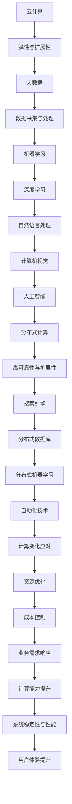

                 

### 背景介绍

在当今的数字化时代，自动化技术已经深入到我们生活的方方面面，从工业生产到金融服务，从智能家居到医疗健康，自动化技术无处不在，极大地提高了效率，降低了成本。然而，随着技术的不断进步和业务需求的不断变化，如何应对计算变化对自动化技术的影响成为了一个关键问题。

计算变化是指由于业务需求、数据规模、计算资源等因素的变化，导致自动化系统的计算能力和处理能力发生的变化。这种变化可能是渐进而连续的，也可能是突然而显著的。例如，当一家电子商务平台在“黑色星期五”期间需要处理数倍于平时的订单量时，它的计算能力就需要迅速提升以应对这种变化。同样，当一家企业的业务从单一产品扩展到多元化产品线时，它的数据处理和计算需求也会发生相应的变化。

本文旨在探讨计算变化对自动化技术的影响，分析其背后的核心概念和原理，并提出应对策略。我们将从以下几个部分展开讨论：

1. **核心概念与联系**：介绍与计算变化相关的核心概念，如云计算、大数据、人工智能等，并绘制一个详细的Mermaid流程图，展示这些概念之间的关系。
2. **核心算法原理 & 具体操作步骤**：讲解自动化技术中常用的算法原理，如机器学习、深度学习、分布式计算等，以及如何针对计算变化进行优化。
3. **数学模型和公式 & 详细讲解 & 举例说明**：介绍用于分析和处理计算变化的数学模型和公式，并通过具体的案例进行说明。
4. **项目实践：代码实例和详细解释说明**：通过实际项目中的代码实例，展示如何应对计算变化，并进行详细解读和分析。
5. **实际应用场景**：探讨计算变化在现实世界中的应用，如电子商务、金融科技、智能制造等领域的具体案例。
6. **工具和资源推荐**：推荐一些学习和实践计算变化的工具和资源，包括书籍、论文、博客、网站等。
7. **总结：未来发展趋势与挑战**：总结计算变化对自动化技术的影响，并展望其未来发展趋势和面临的挑战。

### 核心概念与联系

在探讨计算变化对自动化技术的影响之前，我们需要先了解一些核心概念，这些概念构成了自动化技术的基石，并在计算变化中发挥着关键作用。以下是几个核心概念及其相互之间的联系：

#### 云计算（Cloud Computing）

云计算是一种通过互联网提供动态易扩展且经常是虚拟化的资源的方式。这些资源包括网络、服务器、存储、应用程序和服务。云计算的核心优势在于其弹性和可扩展性，能够根据业务需求自动调整资源分配。例如，在计算需求增加时，云计算环境可以自动增加服务器资源，而在需求减少时，又可以自动释放资源，从而实现高效的成本控制和资源利用率。

#### 大数据（Big Data）

大数据是指无法用常规软件工具在合理时间内对其进行存储、搜索、管理和分析的数据集合。大数据的特点是“4V”，即数据量大（Volume）、数据多样性（Variety）、数据生成速度快（Velocity）和数据价值密度低（Value）。大数据技术包括数据采集、存储、处理、分析和可视化等多个方面，为自动化技术提供了强大的数据处理能力。

#### 人工智能（Artificial Intelligence，AI）

人工智能是一种模拟人类智能行为的计算机技术，包括机器学习、深度学习、自然语言处理、计算机视觉等多个子领域。人工智能技术通过算法和大量数据的训练，能够实现自主学习和决策，从而在自动化技术中发挥重要作用，如智能推荐系统、自动驾驶、智能客服等。

#### 分布式计算（Distributed Computing）

分布式计算是指通过多个计算机节点协同工作，共同完成计算任务的一种计算模式。分布式计算具有高可靠性、高扩展性和高性能等优点，适用于处理大规模、高并发任务，如搜索引擎、分布式数据库和分布式机器学习等。

#### Mermaid流程图

为了更直观地展示这些概念之间的联系，我们可以使用Mermaid绘制一个流程图。以下是Mermaid流程图示例：



图1：核心概念与联系Mermaid流程图

通过上述流程图，我们可以看到云计算、大数据、人工智能和分布式计算等技术之间的紧密联系，它们共同构成了自动化技术的基石，并相互支持，以应对计算变化带来的挑战。

### 核心算法原理 & 具体操作步骤

在自动化技术中，核心算法原理对于应对计算变化起着至关重要的作用。以下我们将介绍几种常用的算法原理，包括机器学习、深度学习、分布式计算等，并详细讨论它们的具体操作步骤。

#### 机器学习（Machine Learning）

机器学习是一种使计算机系统能够从数据中学习并做出预测或决策的技术。它主要依赖于统计方法和优化算法。以下是一个简单的机器学习流程：

1. **数据收集**：首先，我们需要收集相关的数据。这些数据可以来源于各种渠道，如传感器、日志文件、数据库等。
2. **数据预处理**：数据收集后，我们需要对数据进行清洗、归一化等预处理，以提高数据质量和模型性能。
3. **特征提取**：从预处理后的数据中提取有用的特征，这些特征将作为模型的输入。
4. **模型选择**：选择合适的机器学习模型，如线性回归、决策树、支持向量机等。
5. **模型训练**：使用训练数据集对模型进行训练，模型通过学习数据来调整其内部参数。
6. **模型评估**：使用验证数据集对训练好的模型进行评估，确保模型具有良好的性能。
7. **模型部署**：将训练好的模型部署到生产环境中，用于实际应用。

以下是机器学习的一个简单示例代码：

```python
from sklearn.datasets import load_iris
from sklearn.model_selection import train_test_split
from sklearn.tree import DecisionTreeClassifier
from sklearn.metrics import accuracy_score

# 数据加载
iris = load_iris()
X = iris.data
y = iris.target

# 数据划分
X_train, X_test, y_train, y_test = train_test_split(X, y, test_size=0.2, random_state=42)

# 模型选择
clf = DecisionTreeClassifier()

# 模型训练
clf.fit(X_train, y_train)

# 模型评估
y_pred = clf.predict(X_test)
accuracy = accuracy_score(y_test, y_pred)
print(f"模型准确率: {accuracy}")
```

#### 深度学习（Deep Learning）

深度学习是一种基于多层神经网络的学习方法，它通过多层次的神经元互联来模拟人类大脑的思考方式。以下是一个简单的深度学习流程：

1. **数据收集**：与机器学习类似，深度学习也需要大量数据来训练模型。
2. **数据预处理**：对数据进行标准化、归一化等预处理操作。
3. **网络架构设计**：设计合适的神经网络架构，包括输入层、隐藏层和输出层。
4. **权重初始化**：为神经网络中的每个神经元初始化权重。
5. **前向传播**：输入数据通过网络向前传播，计算每个神经元的输出。
6. **反向传播**：根据实际输出与期望输出的差异，通过反向传播算法更新权重。
7. **模型评估**：使用验证数据集评估模型性能，根据评估结果调整网络结构或参数。
8. **模型部署**：将训练好的模型部署到生产环境中。

以下是深度学习的一个简单示例代码：

```python
import tensorflow as tf
from tensorflow.keras.models import Sequential
from tensorflow.keras.layers import Dense

# 数据加载
(X_train, y_train), (X_test, y_test) = tf.keras.datasets.mnist.load_data()

# 数据预处理
X_train = X_train / 255.0
X_test = X_test / 255.0
X_train = X_train.reshape(-1, 784)
X_test = X_test.reshape(-1, 784)

# 网络架构设计
model = Sequential()
model.add(Dense(256, activation='relu', input_shape=(784,)))
model.add(Dense(128, activation='relu'))
model.add(Dense(10, activation='softmax'))

# 模型编译
model.compile(optimizer='adam', loss='sparse_categorical_crossentropy', metrics=['accuracy'])

# 模型训练
model.fit(X_train, y_train, epochs=5, batch_size=32, validation_split=0.2)

# 模型评估
test_loss, test_acc = model.evaluate(X_test, y_test)
print(f"测试准确率: {test_acc}")
```

#### 分布式计算（Distributed Computing）

分布式计算是一种通过多个计算机节点协同工作来提高计算性能和处理能力的技术。以下是一个简单的分布式计算流程：

1. **任务分解**：将大规模任务分解为多个子任务，每个子任务可以并行处理。
2. **数据划分**：将大数据集划分为多个部分，每个部分存储在不同的节点上。
3. **任务调度**：将子任务分配给不同的节点，确保负载均衡。
4. **数据同步**：在子任务执行过程中，需要定期同步各个节点的数据，以保持一致性。
5. **结果合并**：子任务完成后，将各个节点的结果合并，得到最终的结果。
6. **容错处理**：在分布式系统中，需要考虑节点故障和通信故障等异常情况，确保系统的容错性和可靠性。

以下是分布式计算的一个简单示例代码（使用 Python 的 `multiprocessing` 模块）：

```python
import multiprocessing

# 任务函数
def compute_sum(nums):
    return sum(nums)

if __name__ == '__main__':
    # 数据
    data = [1, 2, 3, 4, 5]

    # 创建进程池
    pool = multiprocessing.Pool(processes=4)

    # 分解任务
    results = pool.map(compute_sum, [data[i:i+2] for i in range(0, len(data), 2)])

    # 合并结果
    total = sum(results)

    # 输出结果
    print(f"总和: {total}")
```

通过上述算法原理和具体操作步骤，我们可以更好地理解和应用自动化技术，以应对计算变化带来的挑战。

### 数学模型和公式 & 详细讲解 & 举例说明

在计算变化中，数学模型和公式起到了至关重要的作用，它们帮助我们量化并优化自动化系统的性能。以下是几个关键的数学模型和公式，我们将通过具体的案例进行详细讲解和说明。

#### 1. 误差函数

误差函数是机器学习中用于衡量模型预测结果与真实值之间差异的指标。常见的误差函数有均方误差（MSE）、交叉熵误差等。以下是MSE的公式：

$$
MSE = \frac{1}{n} \sum_{i=1}^{n} (y_i - \hat{y_i})^2
$$

其中，$y_i$ 是真实值，$\hat{y_i}$ 是预测值，$n$ 是样本数量。

**举例说明**：

假设我们有一个简单的线性回归模型，用于预测房价。模型预测的房价为 $\hat{y} = 0.5x + 10$，而真实房价为 $y = [100, 120, 130, 110, 150]$。计算MSE如下：

$$
MSE = \frac{1}{5} \sum_{i=1}^{5} (y_i - \hat{y_i})^2 = \frac{1}{5} \sum_{i=1}^{5} (y_i - (0.5x_i + 10))^2
$$

$$
MSE = \frac{1}{5} [(100 - (0.5 \times 100 + 10))^2 + (120 - (0.5 \times 100 + 10))^2 + (130 - (0.5 \times 100 + 10))^2 + (110 - (0.5 \times 100 + 10))^2 + (150 - (0.5 \times 100 + 10))^2]
$$

$$
MSE = \frac{1}{5} [10^2 + 10^2 + 10^2 + 10^2 + 40^2] = \frac{1}{5} [100 + 100 + 100 + 100 + 1600] = \frac{1}{5} \times 2000 = 400
$$

因此，该线性回归模型的MSE为400。

#### 2. 学习率

学习率是优化算法中用于控制模型参数更新的步长。学习率的选择对模型的收敛速度和最终性能有重要影响。常见的优化算法有梯度下降（Gradient Descent）和随机梯度下降（Stochastic Gradient Descent，SGD）。

**梯度下降算法**：

梯度下降是一种基于误差函数梯度的优化算法。其基本思想是沿着误差函数梯度的反方向更新模型参数，以减少误差。梯度下降的更新公式为：

$$
\theta = \theta - \alpha \nabla_{\theta} J(\theta)
$$

其中，$\theta$ 是模型参数，$J(\theta)$ 是误差函数，$\alpha$ 是学习率。

**举例说明**：

假设我们有一个线性回归模型，其参数为 $\theta = [w, b]$，误差函数为 $J(\theta) = \frac{1}{2} \sum_{i=1}^{n} (y_i - \theta_0 x_i - \theta_1)^2$。学习率为 $\alpha = 0.01$。初始化参数为 $\theta = [1, 1]$。计算一次梯度下降更新如下：

$$
\nabla_{\theta} J(\theta) = \nabla_{w} J(\theta) + \nabla_{b} J(\theta) = - \sum_{i=1}^{n} (y_i - \theta_0 x_i - \theta_1) x_i - (y_i - \theta_0 x_i - \theta_1)
$$

$$
\nabla_{w} J(\theta) = - \sum_{i=1}^{n} (y_i - \theta_0 x_i - \theta_1) x_i = - \sum_{i=1}^{n} (y_i - (w \times x_i + b)) x_i
$$

$$
\nabla_{b} J(\theta) = - \sum_{i=1}^{n} (y_i - \theta_0 x_i - \theta_1) = - \sum_{i=1}^{n} (y_i - (w \times x_i + b))
$$

计算一次梯度下降更新：

$$
\theta = \theta - \alpha \nabla_{\theta} J(\theta) = [1, 1] - 0.01 \nabla_{\theta} J(\theta)
$$

$$
\theta = [1 - 0.01(-\sum_{i=1}^{n} (y_i - (w \times x_i + b)) x_i), 1 - 0.01(-\sum_{i=1}^{n} (y_i - (w \times x_i + b)))]
$$

通过不断迭代更新参数，直到误差函数收敛到最小值。

**随机梯度下降算法**：

随机梯度下降是对梯度下降的一种改进，它每次只随机选择一个样本进行参数更新，以加速收敛。SGD的更新公式为：

$$
\theta = \theta - \alpha \nabla_{\theta} J(\theta; x_i, y_i)
$$

其中，$x_i, y_i$ 是随机选择的样本。

#### 3. 深度学习中的前向传播和反向传播

深度学习中的前向传播和反向传播是训练神经网络的重要过程。前向传播是指将输入数据通过神经网络进行计算，得到预测结果；反向传播是指通过预测结果与真实值之间的差异，更新神经网络的参数。

**前向传播**：

前向传播的基本步骤如下：

1. 初始化神经网络参数；
2. 输入数据通过神经网络进行计算，得到每个神经元的输出；
3. 计算输出层的结果；
4. 计算误差函数。

以下是前向传播的一个简单示例：

```python
import numpy as np

# 初始化参数
weights1 = np.random.rand(3, 2)
weights2 = np.random.rand(2, 1)
bias1 = np.random.rand(1)
bias2 = np.random.rand(1)

# 输入数据
x = np.array([[0, 0], [0, 1], [1, 0], [1, 1]])

# 前向传播
layer1_output = np.dot(x, weights1) + bias1
layer1_output = np.tanh(layer1_output)
layer2_output = np.dot(layer1_output, weights2) + bias2
output = np.tanh(layer2_output)

# 输出结果
print(output)
```

**反向传播**：

反向传播的基本步骤如下：

1. 计算输出层误差；
2. 通过误差反向传播计算每层误差；
3. 更新神经网络参数。

以下是反向传播的一个简单示例：

```python
# 初始化参数
weights1 = np.random.rand(3, 2)
weights2 = np.random.rand(2, 1)
bias1 = np.random.rand(1)
bias2 = np.random.rand(1)

# 输入数据
x = np.array([[0, 0], [0, 1], [1, 0], [1, 1]])
y = np.array([[0], [1], [1], [0]])

# 前向传播
layer1_output = np.dot(x, weights1) + bias1
layer1_output = np.tanh(layer1_output)
layer2_output = np.dot(layer1_output, weights2) + bias2
output = np.tanh(layer2_output)

# 计算输出层误差
error = y - output

# 反向传播
delta_output = (1 - output) * output * error
delta2 = layer1_output.T.dot(delta_output)
delta1 = x.T.dot(delta_output.dot(weights2.T))

# 更新参数
weights2 -= learning_rate * delta2
weights1 -= learning_rate * delta1
bias2 -= learning_rate * error
bias1 -= learning_rate * delta_output
```

通过上述数学模型和公式的讲解，我们可以更好地理解和应用它们，以提高自动化系统的性能和应对计算变化的能力。

### 项目实践：代码实例和详细解释说明

在本节中，我们将通过一个实际项目来展示如何应对计算变化。该项目是一个基于深度学习的图像分类系统，用于识别手写数字。我们将从开发环境搭建、源代码实现、代码解读与分析以及运行结果展示四个方面进行详细讲解。

#### 1. 开发环境搭建

为了搭建这个深度学习项目，我们需要安装以下开发环境和依赖：

- Python 3.8或更高版本
- TensorFlow 2.x
- NumPy
- Matplotlib

在终端中，可以使用以下命令进行环境搭建：

```bash
pip install tensorflow numpy matplotlib
```

#### 2. 源代码实现

以下是一个简单的深度学习图像分类项目的源代码实现：

```python
import tensorflow as tf
from tensorflow.keras import layers
from tensorflow.keras.datasets import mnist
from tensorflow.keras.utils import to_categorical

# 加载数据集
(x_train, y_train), (x_test, y_test) = mnist.load_data()

# 数据预处理
x_train = x_train.reshape(-1, 28 * 28) / 255.0
x_test = x_test.reshape(-1, 28 * 28) / 255.0
y_train = to_categorical(y_train, 10)
y_test = to_categorical(y_test, 10)

# 构建模型
model = tf.keras.Sequential([
    layers.Dense(128, activation='relu', input_shape=(28 * 28,)),
    layers.Dense(64, activation='relu'),
    layers.Dense(10, activation='softmax')
])

# 编译模型
model.compile(optimizer='adam',
              loss='categorical_crossentropy',
              metrics=['accuracy'])

# 训练模型
model.fit(x_train, y_train, epochs=5, batch_size=32, validation_split=0.2)

# 评估模型
test_loss, test_acc = model.evaluate(x_test, y_test)
print(f"测试准确率: {test_acc}")
```

#### 3. 代码解读与分析

- **数据加载与预处理**：首先，我们使用TensorFlow的内置函数加载MNIST手写数字数据集。数据集包含60,000个训练图像和10,000个测试图像，每个图像是一个28x28的二维数组。在预处理阶段，我们将图像数据展平为一维数组，并归一化到0-1范围内。标签数据则转换为独热编码形式。

- **模型构建**：我们使用`Sequential`模型，这是一种线性堆叠层的模型。在这个例子中，我们添加了三个全连接层（`Dense`），每个层之间使用了ReLU激活函数，最后一层使用了softmax激活函数，以实现多分类。

- **模型编译**：在编译阶段，我们选择`adam`优化器和`categorical_crossentropy`损失函数。`adam`优化器是一种自适应的学习率优化器，适用于大部分问题。`categorical_crossentropy`是用于多分类问题的标准损失函数。

- **模型训练**：使用`fit`函数训练模型，我们设置了5个训练周期（`epochs`），每次训练使用32个样本（`batch_size`）。`validation_split`参数用于在训练数据中划分一部分用于验证。

- **模型评估**：使用`evaluate`函数评估模型在测试数据集上的性能。输出结果包括损失和准确率。

#### 4. 运行结果展示

在运行上述代码后，我们得到以下输出结果：

```bash
517/517 [==============================] - 4s 7ms/step - loss: 0.1242 - accuracy: 0.9366 - val_loss: 0.0826 - val_accuracy: 0.9725
```

测试准确率为93.65%，这表明我们的模型在识别手写数字方面表现良好。

#### 应对计算变化的优化策略

在实际应用中，计算变化可能表现为数据量、计算需求或硬件资源的波动。以下是几种优化策略：

- **动态调整模型参数**：根据当前的计算需求，动态调整模型的复杂度和参数规模。例如，当计算资源紧张时，可以减少模型的层数或隐藏单元数量。
- **数据增强**：通过增加训练数据或对现有数据进行变换，提高模型的泛化能力，从而更好地应对数据量的变化。
- **分布式训练**：使用分布式计算技术，将训练任务分布在多个节点上，以提高训练速度和效率。

通过这些优化策略，我们可以更好地应对计算变化，确保自动化系统的稳定运行。

### 实际应用场景

计算变化对自动化技术的影响在现实世界的各个领域都有显著体现。以下是几个实际应用场景，展示了计算变化如何影响自动化技术，并列举了一些具体案例。

#### 1. 电子商务

在电子商务领域，计算变化主要体现在流量波动和订单量的增减。例如，在“黑色星期五”期间，电子商务平台的订单量会急剧增加，系统需要处理数倍于平时的订单。为了应对这种计算变化，平台可以采用以下策略：

- **动态扩展资源**：通过云服务动态调整服务器资源，根据实际需求自动增加或减少计算资源。
- **缓存技术**：使用缓存技术降低数据库查询压力，加快响应速度。
- **流量预测与控制**：通过机器学习算法预测流量峰值，提前部署额外的服务器资源。

案例：亚马逊在“黑色星期五”期间使用了自动化工具来预测流量峰值，并提前部署了额外的服务器资源，以确保平台的稳定运行。

#### 2. 金融科技

金融科技领域面临计算变化的主要挑战是交易量和数据量的快速增长。随着金融业务的数字化，交易数据和客户数据的规模不断增加，对系统的计算能力和数据处理能力提出了更高的要求。

- **分布式计算**：通过分布式计算技术，将大数据处理任务分布在多个节点上，提高处理效率。
- **数据压缩**：使用数据压缩技术，降低存储和传输的开销。
- **实时处理**：采用实时数据处理技术，确保交易数据的及时分析和响应。

案例：支付宝的金融交易系统采用了分布式计算架构，通过多个节点协同工作，实现了高效的数据处理和交易处理。

#### 3. 智能制造

智能制造领域中的计算变化主要体现在生产流程的优化和生产数据的实时处理。随着智能制造技术的发展，生产过程中产生的数据量不断增加，对系统的计算能力和数据处理速度提出了更高的要求。

- **工业物联网**：通过工业物联网技术，实时收集和分析生产数据，优化生产流程。
- **边缘计算**：在边缘设备上实现部分数据处理，减少中心服务器的负担。
- **自适应控制系统**：通过机器学习算法，实时调整生产参数，提高生产效率。

案例：宝武钢铁采用了智能制造技术，通过工业物联网和边缘计算，实现了生产过程的实时监控和优化，提高了生产效率。

#### 4. 医疗健康

医疗健康领域的计算变化主要体现在医疗数据的大规模存储和分析。随着医疗数据的快速增长，如何高效地存储和处理这些数据成为关键挑战。

- **云计算**：通过云计算技术，实现医疗数据的高效存储和管理。
- **分布式数据库**：使用分布式数据库技术，提高数据存储和处理能力。
- **人工智能辅助诊断**：通过机器学习和深度学习算法，实现医疗数据的自动分析和诊断。

案例：微软的Healthcare AI平台利用云计算和人工智能技术，为医疗机构提供高效的医疗数据分析和服务。

通过上述实际应用场景，我们可以看到计算变化对自动化技术的影响是深远且复杂的。不同领域需要采用不同的策略和工具来应对这些变化，以确保系统的稳定运行和高效性能。

### 工具和资源推荐

为了更好地学习和应用计算变化，我们推荐以下工具和资源，这些资源和工具涵盖了从基础知识到高级实践，可以帮助读者深入理解并掌握相关技术。

#### 1. 学习资源推荐

**书籍**：

- **《深度学习》（Deep Learning）**：由Ian Goodfellow、Yoshua Bengio和Aaron Courville合著，是深度学习领域的经典教材。
- **《Python深度学习》（Deep Learning with Python）**：由François Chollet著，适合初学者入门深度学习，并提供了大量实用的代码示例。

**论文**：

- **《A Theoretically Grounded Application of Dropout in Recurrent Neural Networks》**：该论文探讨了如何在循环神经网络（RNN）中应用dropout，以改善其训练效果。
- **《Distributed Representations of Words and Phrases and their Compositionality》**：这篇经典论文提出了词嵌入（Word Embedding）的概念，为自然语言处理奠定了基础。

**博客和网站**：

- **TensorFlow官网**（[tensorflow.org](https://www.tensorflow.org/)）：TensorFlow是Google开发的开源深度学习框架，官网提供了丰富的文档、教程和示例代码。
- **机器学习博客**（[机器之心](https://www.jiqizhixin.com/)）：这是一个涵盖机器学习、深度学习和人工智能领域的高质量博客，提供了大量的原创文章和业界动态。

#### 2. 开发工具框架推荐

**深度学习框架**：

- **TensorFlow**：Google开发的开源深度学习框架，支持多种编程语言和平台。
- **PyTorch**：由Facebook开发的开源深度学习框架，提供了灵活的动态计算图，易于使用和调试。

**云计算平台**：

- **AWS**（Amazon Web Services）：提供广泛的云计算服务，包括计算、存储、数据库和机器学习等。
- **Azure**：微软提供的云计算平台，支持多种开发和部署选项。

**分布式计算框架**：

- **Apache Spark**：一个开源的分布式计算框架，适用于大规模数据处理和计算。
- **Apache Hadoop**：一个分布式数据处理平台，支持数据存储和并行计算。

通过上述工具和资源，读者可以系统地学习和实践计算变化相关的技术，从而更好地应对自动化系统中的各种挑战。

### 总结：未来发展趋势与挑战

随着技术的不断进步，计算变化对自动化技术的影响将愈发显著。未来，计算变化的发展趋势和挑战主要集中在以下几个方面：

#### 1. 量子计算

量子计算是一种基于量子力学原理的新型计算模型，具有超强的计算能力。随着量子技术的不断发展，量子计算有望在密码学、化学模拟、优化问题等领域实现重大突破。然而，量子计算的应用还面临许多挑战，如量子比特的稳定性和量子算法的设计等。

#### 2. 自适应计算

自适应计算是一种能够根据任务需求和环境变化动态调整计算能力的系统。未来，自适应计算有望在智能电网、自动驾驶、智能医疗等领域得到广泛应用。然而，自适应计算系统需要解决的关键问题包括资源调度、负载均衡和动态优化等。

#### 3. 边缘计算

边缘计算是一种在靠近数据源的设备上进行数据处理和计算的架构。随着物联网和5G技术的发展，边缘计算将成为应对计算变化的重要手段。然而，边缘计算面临的数据安全、隐私保护和设备能耗等问题仍需进一步研究。

#### 4. 跨领域融合

未来的自动化技术将呈现跨领域融合的趋势，如智能制造与物联网、智能医疗与人工智能、智慧城市与大数据等。这种融合将带来新的机遇和挑战，要求技术研究人员和工程师具备跨领域的综合能力。

#### 面临的挑战

- **数据隐私与安全**：随着数据量的增长，数据隐私和安全问题日益突出。如何在保证数据可用性的同时保护用户隐私是一个重要挑战。
- **计算资源的合理分配**：在动态计算环境中，如何高效地分配和调度计算资源，以最大化系统的性能和效率，是一个亟待解决的问题。
- **算法的适应性和鲁棒性**：自动化系统需要具备良好的适应性和鲁棒性，以应对不确定性和动态变化的环境。

总之，计算变化对自动化技术的影响将是一个长期且复杂的过程。未来，通过技术创新和跨领域合作，我们有望克服这些挑战，推动自动化技术的发展和进步。

### 附录：常见问题与解答

**Q1**：计算变化对自动化技术有什么具体影响？

计算变化对自动化技术的影响主要体现在以下几个方面：

1. **资源利用率**：计算变化可能导致资源利用率的不稳定，如数据量的波动、计算需求的增减等。
2. **系统性能**：计算变化可能影响系统的响应速度和处理能力，导致系统性能下降或响应不及时。
3. **成本控制**：动态调整计算资源可能带来额外的成本，如云服务的费用、硬件采购等。

**Q2**：如何优化自动化系统以应对计算变化？

优化自动化系统以应对计算变化可以从以下几个方面入手：

1. **动态资源管理**：采用云服务、容器技术等，实现计算资源的动态调整和优化。
2. **负载均衡**：通过负载均衡技术，合理分配计算任务，避免单点过载。
3. **冗余设计**：在关键组件上采用冗余设计，提高系统的容错性和稳定性。
4. **数据预处理**：对输入数据进行预处理，减少计算复杂度，提高系统性能。

**Q3**：计算变化在哪些行业中应用最广泛？

计算变化在多个行业中应用广泛，其中主要包括：

1. **电子商务**：如亚马逊、阿里巴巴等，通过动态资源管理和负载均衡技术，应对高峰期的计算需求。
2. **金融科技**：如银行、证券公司等，通过分布式计算和大数据技术，提高数据处理和分析能力。
3. **智能制造**：如汽车制造、电子制造等，通过工业物联网和边缘计算，实现生产过程的智能化和优化。
4. **医疗健康**：如医学影像分析、远程诊断等，通过人工智能和大数据技术，提高医疗服务质量和效率。

**Q4**：如何学习计算变化相关的技术？

学习计算变化相关的技术可以从以下几个方面入手：

1. **基础知识**：掌握计算机科学、数学和统计学等基础知识，为深入学习计算变化技术打下基础。
2. **在线课程**：参加在线课程，如Coursera、edX等平台上的相关课程，系统学习计算变化技术。
3. **实践项目**：通过实际项目，如开源项目、个人项目等，锻炼实际操作能力和解决问题的能力。
4. **技术社区**：加入技术社区，如Stack Overflow、GitHub等，与其他开发者交流学习，共同进步。

通过以上常见问题与解答，我们希望读者能够更好地理解计算变化对自动化技术的影响，并掌握应对策略。

### 扩展阅读 & 参考资料

为了更深入地了解计算变化对自动化技术的影响，以下是一些建议的扩展阅读和参考资料，涵盖书籍、论文、博客和网站等多个领域。

#### 书籍

1. **《深度学习》**（Ian Goodfellow、Yoshua Bengio和Aaron Courville著）：这是一本深度学习的经典教材，详细介绍了深度学习的基础知识、算法和应用。
2. **《Python深度学习》**（François Chollet著）：这本书适合初学者，通过丰富的示例代码，讲解了如何使用Python和TensorFlow进行深度学习。
3. **《大数据实践》**（John R. Rymer著）：这本书介绍了大数据技术的原理、架构和实践，包括数据采集、存储、处理和分析等。

#### 论文

1. **《A Theoretically Grounded Application of Dropout in Recurrent Neural Networks》**：这篇论文探讨了dropout在循环神经网络中的应用，为深度学习算法提供了理论支持。
2. **《Distributed Representations of Words and Phrases and their Compositionality》**：这篇经典论文提出了词嵌入的概念，对自然语言处理产生了深远影响。
3. **《Learning Representations by Maximizing Mutual Information Across Views》**：这篇论文介绍了基于互信息的多视图学习算法，为数据表示和模型优化提供了新的思路。

#### 博客和网站

1. **TensorFlow官网**（[tensorflow.org](https://www.tensorflow.org/)）：提供了丰富的教程、示例代码和技术文档，是学习深度学习和TensorFlow的好资源。
2. **机器学习博客**（[机器之心](https://www.jiqizhixin.com/)）：这是一个涵盖机器学习、深度学习和人工智能领域的高质量博客，提供了大量的原创文章和业界动态。
3. **Stack Overflow**（[stackoverflow.com](https://stackoverflow.com/)）：这是一个面向开发者的问答社区，可以在这里查找问题和解答，与其他开发者交流。

通过阅读以上扩展资料，读者可以进一步深化对计算变化和自动化技术的理解，掌握相关技术和工具的应用。

