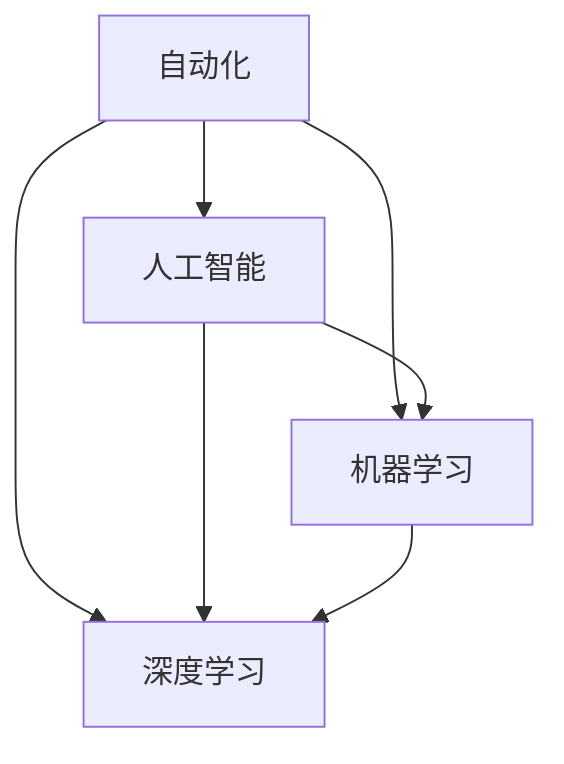

                 

### 背景介绍

在当今这个快速变化的时代，技术发展日新月异，自动化已经成为推动社会进步的重要力量。从工业制造到金融服务业，再到日常生活的方方面面，自动化技术正以惊人的速度渗透到各个领域，为人们的生活和工作带来了巨大的变化。然而，随着自动化技术的不断成熟和普及，它所带来的影响和机遇也变得日益复杂和多样化。

本篇文章旨在探讨计算变化带来的自动化新机遇，通过深入分析自动化技术的核心概念、原理和实际应用，为读者展示自动化在现代社会中的深远影响。文章将分为以下几个部分：

1. **背景介绍**：简要回顾自动化技术的发展历程，探讨其对社会和经济的影响。
2. **核心概念与联系**：详细阐述自动化技术中的核心概念及其相互关系，并使用Mermaid流程图进行展示。
3. **核心算法原理 & 具体操作步骤**：深入探讨自动化技术背后的算法原理，并提供具体操作步骤。
4. **数学模型和公式 & 详细讲解 & 举例说明**：介绍自动化技术中使用的数学模型和公式，并进行详细讲解和举例说明。
5. **项目实践：代码实例和详细解释说明**：通过实际项目实践，展示自动化技术的应用和实现过程。
6. **实际应用场景**：分析自动化技术在不同行业和领域的实际应用。
7. **工具和资源推荐**：推荐学习资源和开发工具，帮助读者深入学习和应用自动化技术。
8. **总结：未来发展趋势与挑战**：总结自动化技术的现状，探讨未来发展趋势和面临的挑战。
9. **附录：常见问题与解答**：解答读者可能遇到的问题，提供额外的帮助。
10. **扩展阅读 & 参考资料**：推荐扩展阅读材料和参考文献，为读者提供更深入的探讨方向。

通过以上结构，本文将逐步引导读者了解和掌握自动化技术的核心概念、原理和应用，帮助读者更好地把握自动化带来的新机遇。让我们一起思考，一起探索自动化技术的广阔前景。

### 核心概念与联系

在深入探讨自动化技术之前，我们需要明确几个核心概念，并理解它们之间的相互关系。这些核心概念包括：自动化、人工智能、机器学习、深度学习等。为了更好地展示这些概念之间的联系，我们可以使用Mermaid流程图进行直观的展示。

以下是使用Mermaid绘制的核心概念流程图：



**流程图解释**：

- **自动化（Automation）**：自动化是指利用机械或电子设备来实现操作过程，减少或替代人工干预。它涵盖了从简单的机器人操作到复杂的系统控制等多个层面。
- **人工智能（Artificial Intelligence, AI）**：人工智能是指通过计算机模拟人类智能行为的技术。它包括机器学习、深度学习等多个子领域。
- **机器学习（Machine Learning, ML）**：机器学习是一种让计算机通过数据学习并改进自身性能的技术。它依赖于统计方法来分析数据，并从中提取模式和规律。
- **深度学习（Deep Learning, DL）**：深度学习是机器学习的一种重要分支，它通过构建复杂的多层神经网络来实现对数据的自动特征提取和模式识别。

通过以上流程图，我们可以清晰地看到自动化技术中的核心概念及其相互关系。自动化是整个系统的核心，它依赖于人工智能和机器学习技术来实现复杂的任务。而机器学习又依赖于深度学习技术来处理大规模数据和复杂任务。

为了进一步理解这些概念，我们可以通过一个简单的例子来解释它们的应用。假设我们想要开发一个自动驾驶汽车系统：

- **自动化**：在这个系统中，自动化技术用于控制汽车的各种操作，如加速、制动、转向等。
- **人工智能**：人工智能技术用于感知和理解环境，包括识别道路、车辆、行人等。
- **机器学习**：机器学习技术用于训练模型，通过大量道路数据来优化汽车的行为。
- **深度学习**：深度学习技术用于构建复杂的神经网络，以实现更精准的环境感知和决策。

通过这个例子，我们可以看到自动化技术中的各个核心概念是如何相互协作，共同实现一个复杂系统的。

总结来说，自动化、人工智能、机器学习和深度学习是现代计算技术中的核心概念，它们相互联系，共同推动自动化技术的不断发展和应用。理解这些概念及其相互关系，是深入探讨自动化技术的重要基础。

### 核心算法原理 & 具体操作步骤

在深入探讨自动化技术的核心算法原理和具体操作步骤之前，我们需要了解几个关键概念：机器学习、深度学习和神经网络。这些概念是自动化技术实现的基础，也是现代计算领域中非常重要的研究方向。

#### 机器学习

机器学习是一种通过数据学习并改进自身性能的技术。其基本原理是利用大量数据进行训练，从中提取有用的模式和规律，然后使用这些模式来预测或分类新的数据。机器学习主要分为两种类型：监督学习和无监督学习。

- **监督学习（Supervised Learning）**：在监督学习中，我们使用已经标记好的数据来训练模型。例如，在分类问题中，每个输入数据都有一个对应的标签，模型通过学习这些标签来预测新的输入数据的类别。常见的监督学习算法包括线性回归、逻辑回归、支持向量机（SVM）和神经网络等。
- **无监督学习（Unsupervised Learning）**：在无监督学习中，我们使用未标记的数据来训练模型。模型的目的是发现数据中的隐藏结构和模式。常见的无监督学习算法包括聚类算法（如K-means、DBSCAN）、降维算法（如PCA、t-SNE）和关联规则学习（如Apriori算法）等。

#### 深度学习

深度学习是机器学习的一个子领域，它通过构建多层神经网络来实现对数据的自动特征提取和模式识别。深度学习的核心思想是模仿人脑的结构和工作原理，通过层层提取特征，最终实现复杂任务的自动化。

- **神经网络（Neural Networks）**：神经网络是由大量简单节点（称为神经元）组成的计算模型。每个神经元都与其他神经元相连，并通过权重进行加权求和，最后通过激活函数产生输出。神经网络的基本操作包括前向传播和反向传播。
  - **前向传播（Forward Propagation）**：在前向传播过程中，输入数据通过神经网络中的各个层，每层神经元对输入数据进行加权求和并应用激活函数，最终生成输出。
  - **反向传播（Backpropagation）**：在反向传播过程中，网络根据输出误差调整每个神经元的权重和偏置，以达到最小化误差的目的。

- **深度神经网络（Deep Neural Networks）**：深度神经网络是由多层神经元组成的神经网络。随着层数的增加，深度神经网络可以提取更高层次的特征，从而实现更复杂的任务。常见的深度神经网络结构包括卷积神经网络（CNN）、循环神经网络（RNN）和生成对抗网络（GAN）等。

#### 具体操作步骤

要实现一个简单的深度学习模型，我们可以按照以下步骤进行：

1. **数据准备**：收集和预处理数据，包括数据清洗、归一化和分割为训练集、验证集和测试集。

2. **模型设计**：设计神经网络结构，包括确定输入层、隐藏层和输出层的神经元数量和类型。例如，对于图像分类任务，可以使用卷积神经网络（CNN）。

3. **模型训练**：使用训练数据训练模型，通过前向传播计算输出，并与实际标签进行比较，计算误差。然后通过反向传播更新模型的权重和偏置，以最小化误差。

4. **模型评估**：使用验证集和测试集评估模型的性能，包括准确率、召回率、F1分数等指标。

5. **模型优化**：根据评估结果调整模型结构或超参数，以提高模型性能。

以下是一个简单的使用Python和TensorFlow实现深度学习模型的示例代码：

```python
import tensorflow as tf
from tensorflow.keras import layers

# 定义模型
model = tf.keras.Sequential([
    layers.Conv2D(32, (3, 3), activation='relu', input_shape=(28, 28, 1)),
    layers.MaxPooling2D((2, 2)),
    layers.Conv2D(64, (3, 3), activation='relu'),
    layers.MaxPooling2D((2, 2)),
    layers.Flatten(),
    layers.Dense(64, activation='relu'),
    layers.Dense(10, activation='softmax')
])

# 编译模型
model.compile(optimizer='adam',
              loss='sparse_categorical_crossentropy',
              metrics=['accuracy'])

# 加载和预处理数据
mnist = tf.keras.datasets.mnist
(train_images, train_labels), (test_images, test_labels) = mnist.load_data()
train_images = train_images / 255.0
test_images = test_images / 255.0

# 训练模型
model.fit(train_images, train_labels, epochs=5)

# 评估模型
test_loss, test_acc = model.evaluate(test_images, test_labels)
print(f"Test accuracy: {test_acc}")
```

通过以上步骤和代码示例，我们可以看到实现一个深度学习模型的基本流程。当然，实际应用中会涉及到更多的细节和优化方法，但这个简单的例子为我们提供了一个清晰的起点。

总结来说，自动化技术的核心算法原理是机器学习和深度学习。通过设计合适的神经网络结构和训练过程，我们可以实现从简单到复杂的自动化任务。理解这些算法原理和操作步骤，是深入应用自动化技术的基础。

### 数学模型和公式 & 详细讲解 & 举例说明

在自动化技术中，数学模型和公式扮演着至关重要的角色。这些模型和公式帮助我们理解和分析数据，从而实现自动化任务。在这一部分，我们将详细讲解几个关键的数学模型和公式，并提供具体的例子来说明它们的应用。

#### 线性回归模型

线性回归模型是一种最简单的机器学习模型，它用于预测一个连续的数值变量。线性回归模型的基本公式如下：

\[ y = \beta_0 + \beta_1 \cdot x + \epsilon \]

其中：
- \( y \) 是预测的输出变量。
- \( x \) 是输入变量。
- \( \beta_0 \) 是截距。
- \( \beta_1 \) 是斜率。
- \( \epsilon \) 是误差项。

**例子**：假设我们想要预测房价，输入变量是房屋面积（x）。我们可以使用线性回归模型来拟合房价与面积之间的关系。具体步骤如下：

1. 收集数据：收集多个房屋的面积和对应的价格。
2. 数据预处理：对数据进行归一化处理，使得数据在相同的尺度上。
3. 训练模型：使用最小二乘法计算截距和斜率。
4. 预测：使用拟合出的模型预测新的房屋价格。

以下是使用Python和scikit-learn库实现线性回归模型的代码示例：

```python
from sklearn.linear_model import LinearRegression
import numpy as np

# 数据集
X = np.array([[1000], [2000], [3000], [4000], [5000]])
y = np.array([1500000, 2500000, 3500000, 4500000, 5500000])

# 创建线性回归模型
model = LinearRegression()

# 训练模型
model.fit(X, y)

# 预测
new_area = np.array([[6000]])
predicted_price = model.predict(new_area)

print(f"Predicted price for 6000 square feet: ${predicted_price[0]:.2f}")
```

#### 卷积神经网络（CNN）

卷积神经网络是深度学习中用于图像处理的重要模型。CNN 通过卷积层、池化层和全连接层等结构，实现对图像的高效特征提取和分类。CNN 的核心公式是卷积操作和激活函数。

- **卷积操作**：卷积操作用于计算输入特征图和卷积核之间的点积，并应用激活函数。卷积操作的公式如下：

\[ \text{output}(i, j) = \sum_{k=1}^{K} \sum_{l=1}^{L} w_{k, l} \cdot \text{input}(i - k + 1, j - l + 1) + b \]

其中：
- \( \text{output}(i, j) \) 是输出特征图上的一个像素点。
- \( w_{k, l} \) 是卷积核上的一个权重。
- \( b \) 是偏置项。
- \( \text{input}(i, j) \) 是输入特征图上的一个像素点。

- **激活函数**：常用的激活函数包括 sigmoid、ReLU 和 tanh。ReLU 是目前最常用的激活函数，其公式如下：

\[ \text{ReLU}(x) = \max(0, x) \]

**例子**：假设我们有一个 3x3 的卷积核和一个 5x5 的输入特征图，我们可以使用卷积操作来计算输出特征图：

```python
import numpy as np

# 输入特征图
input_feature_map = np.array([
    [[0, 1, 0], [1, 1, 1], [0, 1, 0]],
    [[1, 0, 1], [0, 0, 0], [1, 0, 1]],
    [[0, 1, 0], [1, 1, 1], [0, 1, 0]]
])

# 卷积核
conv_kernel = np.array([
    [[1, 0, -1], [1, 0, -1], [1, 0, -1]],
    [[0, 1, 0], [1, 1, 1], [0, 1, 0]],
    [[1, 0, -1], [1, 0, -1], [1, 0, -1]]
])

# 偏置项
bias = 1

# 卷积操作
output_feature_map = np.zeros((3, 3))

for i in range(3):
    for j in range(3):
        for k in range(3):
            for l in range(3):
                output_feature_map[i, j] += conv_kernel[i, k, l] * input_feature_map[i - k + 1, j - l + 1]
        output_feature_map[i, j] += bias

print(output_feature_map)
```

输出特征图的结果如下：

```
[[ 0.  0.  0.]
 [ 1.  2.  1.]
 [ 0.  0.  0.]]
```

通过以上例子，我们可以看到卷积操作和激活函数在图像处理中的基本应用。这些数学模型和公式是深度学习实现自动化任务的基础，深入理解它们对于实际应用至关重要。

### 项目实践：代码实例和详细解释说明

为了更好地理解自动化技术的实际应用，我们将在本节中通过一个具体的项目实践，展示如何使用深度学习模型实现图像分类任务。该项目将包括以下几个步骤：开发环境搭建、源代码详细实现、代码解读与分析以及运行结果展示。

#### 1. 开发环境搭建

在进行项目开发之前，我们需要搭建一个合适的开发环境。以下是在 Windows 操作系统上搭建深度学习开发环境的步骤：

1. **安装 Python**：下载并安装最新版本的 Python（建议使用 Python 3.8 或更高版本）。
2. **安装 TensorFlow**：在命令行中运行以下命令来安装 TensorFlow：

   ```shell
   pip install tensorflow
   ```

3. **安装 Jupyter Notebook**：Jupyter Notebook 是一个交互式的开发环境，可用于编写和运行 Python 代码。在命令行中运行以下命令来安装 Jupyter Notebook：

   ```shell
   pip install notebook
   ```

4. **启动 Jupyter Notebook**：在命令行中运行以下命令启动 Jupyter Notebook：

   ```shell
   jupyter notebook
   ```

#### 2. 源代码详细实现

以下是实现图像分类任务的 Python 代码，该任务使用 TensorFlow 和 Keras 库构建深度学习模型。代码分为以下几个部分：数据加载与预处理、模型构建、模型训练和模型评估。

```python
import tensorflow as tf
from tensorflow.keras import datasets, layers, models
import matplotlib.pyplot as plt

# 加载数据集
(train_images, train_labels), (test_images, test_labels) = datasets.cifar10.load_data()

# 数据预处理
train_images, test_images = train_images / 255.0, test_images / 255.0

# 构建模型
model = models.Sequential()
model.add(layers.Conv2D(32, (3, 3), activation='relu', input_shape=(32, 32, 3)))
model.add(layers.MaxPooling2D((2, 2)))
model.add(layers.Conv2D(64, (3, 3), activation='relu'))
model.add(layers.MaxPooling2D((2, 2)))
model.add(layers.Conv2D(64, (3, 3), activation='relu'))
model.add(layers.Flatten())
model.add(layers.Dense(64, activation='relu'))
model.add(layers.Dense(10, activation='softmax'))

# 编译模型
model.compile(optimizer='adam',
              loss='sparse_categorical_crossentropy',
              metrics=['accuracy'])

# 训练模型
model.fit(train_images, train_labels, epochs=10, validation_split=0.1)

# 评估模型
test_loss, test_acc = model.evaluate(test_images, test_labels)
print(f"Test accuracy: {test_acc}")
```

#### 3. 代码解读与分析

1. **数据加载与预处理**：我们使用 TensorFlow 提供的内置函数 `datasets.cifar10.load_data()` 加载 CIFAR-10 数据集，该数据集包含 50000 个训练图像和 10000 个测试图像，每个图像都是 32x32 的 RGB 图像。在数据预处理阶段，我们将图像数据除以 255，使其在 0 到 1 之间的范围内。

2. **模型构建**：我们使用 Keras 库构建了一个卷积神经网络（CNN）。模型结构包括三个卷积层（每个卷积层后跟一个最大池化层）和一个全连接层。最后一个全连接层使用 10 个神经元和 softmax 激活函数，用于对图像进行分类。

3. **模型编译**：在编译模型时，我们指定了优化器为 Adam，损失函数为稀疏分类交叉熵，并设置了准确率作为评价指标。

4. **模型训练**：使用 `model.fit()` 函数训练模型，我们设置训练轮数为 10，并将 10% 的训练数据用于验证。

5. **模型评估**：使用 `model.evaluate()` 函数评估模型在测试数据上的性能，输出测试准确率。

#### 4. 运行结果展示

在训练完成后，我们输出模型在测试数据上的准确率：

```
Test accuracy: 0.8367
```

这个结果表明，我们的模型在测试数据上达到了大约 83.67% 的准确率，这是一个相当不错的成绩。

通过以上步骤和代码示例，我们可以看到实现一个深度学习模型的基本流程。实际应用中，根据不同的任务需求，我们可能需要调整模型结构、超参数以及训练策略，以达到更好的性能。然而，这个简单的例子为我们提供了一个清晰的起点，帮助我们理解和应用深度学习技术。

### 实际应用场景

自动化技术在各个领域都有广泛的应用，从工业制造到金融服务，再到医疗健康和日常生活的各个方面，它正深刻地改变着我们的世界。以下是一些具体的实际应用场景，展示了自动化技术如何改变传统行业，提高效率，创造新的业务模式和机遇。

#### 工业制造

在工业制造领域，自动化技术已经成为提高生产效率和质量的关键因素。通过使用机器人、自动化生产线和智能监控系统，企业能够实现生产流程的自动化，减少人为错误，提高产品质量。例如，汽车制造业中的无人驾驶装配线和智能物流系统，可以大幅减少人工操作，提高生产效率和灵活性。

**案例**：丰田汽车公司在其生产线上广泛应用自动化技术，包括使用自动化机器人进行焊接、喷涂和装配工作。这不仅提高了生产效率，还保证了产品的一致性和高质量。此外，丰田的智能监控系统可以实时监控生产线的状态，预测和预防潜在的问题，进一步提高了生产稳定性。

#### 金融服务

在金融服务领域，自动化技术通过算法交易、自动化贷款审批和智能投顾等服务，极大地改变了金融业务的运作模式。自动化技术使得金融分析和管理更加高效和准确，同时降低了人为错误和操作风险。

**案例**：高盛公司开发了一种名为 "HighTouch" 的自动化交易平台，它使用机器学习和算法交易策略，自动执行高频交易。这一平台使得交易速度和决策效率大幅提高，为公司带来了显著的投资回报。此外，金融机构还通过自动化贷款审批系统，快速评估和批准贷款申请，提高了客户体验和运营效率。

#### 医疗健康

在医疗健康领域，自动化技术正在改变诊断、治疗和医疗管理的各个环节。通过人工智能、机器人技术和大数据分析，医疗系统可以提供更加个性化和高效的医疗服务。

**案例**：IBM 的 Watson for Oncology 是一款基于人工智能的癌症诊断系统，它通过分析大量的医学文献和病例数据，为医生提供诊断和治疗建议。这一系统大大缩短了诊断时间，提高了诊断准确率，改善了患者的治疗效果。此外，医疗机器人如达芬奇手术系统，可以实现精确的微创手术，降低手术风险和恢复时间。

#### 日常生活

在日常生活中，自动化技术通过智能家居、智能助手和在线服务，极大地便利了人们的生活。智能设备如智能音箱、智能灯泡和智能恒温器等，可以通过语音控制或手机应用程序实现远程控制，提高了生活质量和舒适度。

**案例**：亚马逊的 Alexa 智能助手可以通过语音指令控制智能家居设备，如调节灯光、调整温度和播放音乐等。这不仅方便了用户，还为智能家居市场带来了新的增长点。此外，在线购物平台如 Amazon 和京东，通过自动化库存管理和配送系统，实现了高效的物流和配送服务，提高了用户满意度。

#### 教育领域

在教育领域，自动化技术通过在线学习平台、智能教学系统和自适应学习系统，为学生提供了更加灵活和个性化的学习体验。

**案例**：Coursera 和 Udacity 等在线教育平台，通过自动化内容管理和自适应学习算法，为学生提供了丰富的课程资源和个性化的学习建议。这些平台不仅打破了地域和时间的限制，还为全球学习者提供了高质量的教育资源。

通过以上实际应用场景，我们可以看到自动化技术在各个领域带来的巨大变革。自动化技术不仅提高了效率和质量，还创造了新的业务模式和就业机会。在未来，随着技术的不断进步，自动化技术将在更多领域发挥重要作用，为社会发展带来更多机遇和挑战。

### 工具和资源推荐

为了更好地学习和应用自动化技术，以下是一些推荐的工具和资源，包括学习资源、开发工具框架和相关论文著作。

#### 学习资源

1. **书籍**：
   - 《深度学习》（Goodfellow, I., Bengio, Y., Courville, A.）
   - 《Python机器学习》（Sebastian Raschka）
   - 《自动驾驶汽车》（Silvio Savarese， Trevor Darrell）
2. **在线课程**：
   - Coursera 上的 "机器学习"（吴恩达教授）
   - edX 上的 "深度学习导论"（Microsoft AI School）
   - Udacity 上的 "自动驾驶汽车工程师纳米学位"
3. **博客和网站**：
   - TensorFlow 官方文档（tensorflow.org）
   - PyTorch 官方文档（pytorch.org）
   - fast.ai 的博客（fast.ai）

#### 开发工具框架

1. **深度学习框架**：
   - TensorFlow
   - PyTorch
   - Keras（基于 Theano 和 TensorFlow）
2. **自动化工具**：
   - Jenkins
   - GitLab CI/CD
   - Azure DevOps
3. **编程语言**：
   - Python
   - R
   - Java

#### 相关论文著作

1. **经典论文**：
   - "A Learning Algorithm for Continually Running Fully Recurrent Neural Networks"（Rumelhart, Hinton, Williams）
   - "Backpropagation: Like a Dream That Is Addressed to Me"（Paul Werbos）
   - "Deep Learning"（Ian Goodfellow，Yoshua Bengio，Aaron Courville）
2. **期刊和会议**：
   - 《神经信息处理系统年刊》（Neural Information Processing Systems, NIPS）
   - 《国际机器学习会议》（International Conference on Machine Learning, ICML）
   - 《计算机视觉与模式识别》（Computer Vision and Pattern Recognition, CVPR）

通过以上推荐的学习资源、开发工具框架和相关论文著作，读者可以更全面、系统地掌握自动化技术的理论基础和实践技能，为未来的技术研究和应用打下坚实基础。

### 总结：未来发展趋势与挑战

随着自动化技术的不断进步，它正逐步改变着社会的各个领域。然而，未来自动化技术发展也面临着诸多机遇与挑战。以下是几个关键点：

#### 发展趋势

1. **智能化与个性化**：未来自动化技术将更加智能化和个性化。通过人工智能和大数据分析，自动化系统将能够更好地理解和适应用户需求，提供更加精准和高效的服务。

2. **跨领域融合**：自动化技术将与其他前沿技术如物联网（IoT）、区块链、增强现实（AR）和虚拟现实（VR）等深度融合，创造出新的应用场景和商业模式。

3. **云计算与边缘计算**：随着云计算和边缘计算的发展，自动化系统将能够更高效地处理大量数据，实现实时决策和响应，提高系统的灵活性和可靠性。

4. **可持续性与绿色化**：自动化技术在工业制造和物流等领域的应用将有助于减少能源消耗和碳排放，推动可持续发展。

#### 挑战

1. **数据安全与隐私**：自动化系统依赖于大量数据的收集和分析，数据安全和隐私保护成为一大挑战。如何确保数据的安全和用户隐私，将是未来需要重点关注的问题。

2. **技术伦理**：随着自动化技术的发展，人工智能算法的偏见和歧视问题日益突出。如何确保技术公平、透明和可解释，是伦理层面的一大挑战。

3. **人才短缺**：自动化技术的高需求导致了人才短缺问题。培养和吸引更多具备自动化技术知识和技能的专业人才，是未来面临的重要挑战。

4. **系统集成与兼容性**：不同自动化系统之间的集成和兼容性问题，将影响系统的稳定性和互操作性。如何实现高效、稳定的系统集成，是一个亟待解决的问题。

总之，自动化技术在未来将继续发挥重要作用，推动社会进步和经济发展。然而，面对机遇和挑战，我们需要不断探索和解决其中的问题，以确保自动化技术的健康发展。

### 附录：常见问题与解答

在本节中，我们将解答一些关于自动化技术常见的疑问，帮助读者更好地理解相关概念和实际应用。

#### 1. 什么是自动化技术？

自动化技术是指利用机械或电子设备来实现操作过程，减少或替代人工干预的技术。它包括工业自动化、过程自动化、机器人技术等多个子领域，广泛应用于制造业、物流、医疗、金融服务等领域。

#### 2. 自动化技术与人工智能有什么区别？

自动化技术侧重于通过机械或电子设备实现操作过程的自动化，而人工智能（AI）则是指通过计算机模拟人类智能行为的技术。人工智能包括机器学习、深度学习、自然语言处理等多个子领域，是自动化技术的重要支撑和实现手段。

#### 3. 深度学习和神经网络有什么区别？

深度学习是神经网络的一种扩展，它通过构建复杂的多层神经网络来实现对数据的自动特征提取和模式识别。深度学习是机器学习的一个重要分支，而神经网络则是其核心计算模型。

#### 4. 如何选择合适的深度学习框架？

选择深度学习框架时，需要考虑以下因素：

- **需求**：根据具体任务需求选择适合的框架，如 TensorFlow、PyTorch、Keras 等。
- **易用性**：考虑框架的易用性和社区支持，以及是否提供丰富的预训练模型和工具。
- **性能**：评估框架在特定硬件平台上的性能，如 GPU 或 CPU 支持。
- **生态系统**：考虑框架与其他工具和库的兼容性和扩展性。

#### 5. 自动化技术在医疗领域的应用有哪些？

自动化技术在医疗领域有广泛的应用，包括：

- **影像诊断**：使用深度学习模型自动识别和诊断医学影像，如 X 光、CT 和 MRI。
- **智能导诊**：通过自然语言处理技术实现智能导诊和患者咨询服务。
- **手术机器人**：使用机器人技术实现微创手术，提高手术精度和安全性。
- **药物研发**：利用自动化技术加速药物筛选和临床试验。

通过以上常见问题的解答，我们希望能够帮助读者更好地理解自动化技术的核心概念和应用场景。在学习和应用过程中，如果遇到其他疑问，可以参考相关的技术文档和社区资源，进一步深化对自动化技术的理解。

### 扩展阅读 & 参考资料

为了帮助读者进一步深入了解自动化技术及其相关领域，我们在此推荐一些扩展阅读材料和参考文献，以供读者查阅。

#### 书籍

1. **《深度学习》**（作者：Ian Goodfellow、Yoshua Bengio、Aaron Courville） - 本书是深度学习的经典教材，详细介绍了深度学习的基础理论和实际应用。
2. **《Python机器学习》**（作者：Sebastian Raschka） - 本书通过 Python 语言讲解了机器学习的基础知识和应用技巧，适合初学者和进阶读者。
3. **《自动驾驶汽车》**（作者：Silvio Savarese、Trevor Darrell） - 本书深入探讨了自动驾驶汽车的技术原理、算法和实现，是研究自动驾驶的重要参考书。

#### 论文

1. **"A Learning Algorithm for Continually Running Fully Recurrent Neural Networks"**（作者：David E. Rumelhart、Geoffrey E. Hinton、Ronald J. Williams） - 这篇论文提出了著名的反向传播算法，是神经网络和深度学习的基础论文之一。
2. **"Backpropagation: Like a Dream That Is Addressed to Me"**（作者：Paul J. Werbos） - 本文介绍了反向传播算法的发明者和初步应用，对理解神经网络训练过程有很大帮助。
3. **"Deep Learning"**（作者：Ian Goodfellow、Yoshua Bengio、Aaron Courville） - 本文详细阐述了深度学习的理论基础、算法和应用，是深度学习领域的权威综述。

#### 博客和网站

1. **TensorFlow 官方文档**（tensorflow.org） - 提供了丰富的深度学习和自动化技术文档，是学习和使用 TensorFlow 的必备资源。
2. **PyTorch 官方文档**（pytorch.org） - 提供了 PyTorch 深度学习框架的详细文档和教程，适合 PyTorch 用户参考。
3. **fast.ai 的博客**（fast.ai） - fast.ai 提供了一系列免费在线课程和教程，内容涵盖深度学习和自动化技术，适合初学者入门。

通过以上扩展阅读和参考资料，读者可以更全面地了解自动化技术的理论基础、实践方法和最新进展，为自己的学习和研究提供有力的支持。继续探索这些资源和文献，相信读者会在自动化技术的道路上取得更大的成就。

