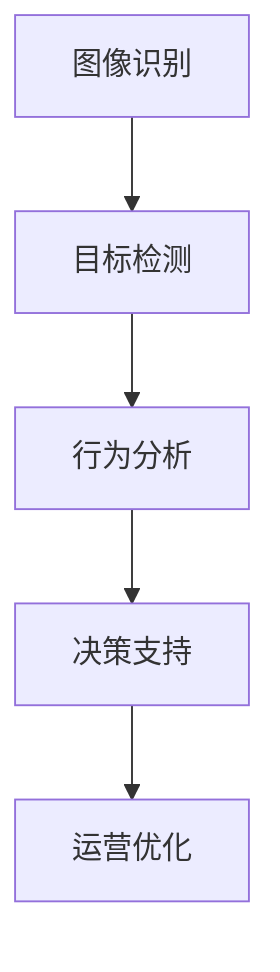

                 

### 1. 背景介绍

随着科技的飞速发展，计算机视觉技术逐渐成为人工智能领域中的重要分支。特别是在零售业，计算机视觉技术的应用已经深入到各个领域，推动了零售业的创新与发展。零售业作为一个历史悠久且规模庞大的行业，一直在寻找提高效率和用户体验的方法。计算机视觉技术正是提供了这样的解决方案，通过图像识别、目标检测、行为分析等技术，帮助零售商更好地理解顾客行为，优化商品陈列，提高销售转化率。

计算机视觉在零售业中的创新应用主要体现在以下几个方面：

#### 1.1 顾客行为分析

顾客行为分析是零售业利用计算机视觉技术的重要领域。通过监控顾客的购物行为，零售商可以获取大量的行为数据，如顾客的购物路径、停留时间、关注度等。这些数据有助于零售商了解顾客的偏好和需求，从而做出更加精准的市场营销决策。例如，一家超市可以通过计算机视觉技术分析顾客的购物车内容，预测顾客的购买意图，进而调整商品摆放位置，提高销售转化率。

#### 1.2 商品识别与推荐

商品识别是计算机视觉技术的一个核心应用。通过图像识别技术，零售商可以快速准确地识别出顾客选购的商品，并提供相关的信息，如商品价格、库存情况等。此外，基于商品识别技术，零售商还可以为顾客提供个性化的商品推荐。例如，一位顾客在超市购买了一瓶洗发水，系统可以自动推荐相关的护发素、沐浴露等产品，从而提高销售机会。

#### 1.3 店内安全监控

计算机视觉技术在店内安全监控方面也有广泛的应用。通过监控视频，零售商可以实时监控店内的情况，及时发现异常行为，如盗窃、斗殴等。计算机视觉算法可以对监控视频进行实时分析，识别潜在的安全风险，并自动报警。此外，计算机视觉技术还可以用于自动监控员工的操作行为，确保员工遵守店内的规章制度。

#### 1.4 商品陈列优化

商品陈列是零售业提高销售额的重要手段。通过计算机视觉技术，零售商可以实时监测商品的陈列情况，评估陈列效果，并自动提出优化建议。例如，如果某件商品的销售量下降，系统可以自动调整其陈列位置，提高顾客的可见性和购买意愿。

#### 1.5 供应链优化

计算机视觉技术还可以应用于供应链管理。通过监控货物的运输过程，零售商可以实时了解货物的状态，及时发现并处理异常情况，如货物损坏、延误等。此外，计算机视觉技术还可以用于仓库管理，通过图像识别技术快速准确地对货物进行分类、盘点，提高仓库管理的效率和准确性。

综上所述，计算机视觉技术在零售业中的应用已经取得了显著的成果，为零售业带来了巨大的价值。然而，随着技术的不断进步，计算机视觉在零售业中的应用还有很大的发展空间。未来，零售业将更加依赖计算机视觉技术，通过不断创新，为顾客提供更加优质的服务。

### 2. 核心概念与联系

#### 2.1 图像识别

图像识别是计算机视觉技术中最基础也是最重要的一部分。它指的是通过算法对图像进行分析和处理，从中识别出特定对象或特征。在零售业中，图像识别技术主要用于商品识别、顾客行为分析等应用。

##### 2.1.1 工作原理

图像识别的基本过程可以分为以下几个步骤：

1. **图像预处理**：对原始图像进行去噪、增强、分割等预处理操作，以提高图像质量，便于后续处理。

2. **特征提取**：从预处理后的图像中提取出具有代表性的特征，如边缘、纹理、颜色等。

3. **模型训练**：利用已标注的图像数据，通过机器学习算法（如卷积神经网络）训练出图像识别模型。

4. **图像分类**：将待识别的图像输入到训练好的模型中，模型会输出图像的类别预测结果。

##### 2.1.2 技术特点

- **高精度**：现代图像识别算法具有很高的识别精度，能够准确识别图像中的对象和特征。
- **实时性**：图像识别算法通常能够在较短的时间内完成处理，满足实时性的要求。
- **灵活性**：图像识别算法可以处理不同类型、尺寸和角度的图像，具有较强的适应性。

#### 2.2 目标检测

目标检测是计算机视觉中的另一个重要应用，它指的是在图像中识别出特定目标的位置和范围。在零售业中，目标检测技术可以用于商品识别、店内安全监控等场景。

##### 2.2.1 工作原理

目标检测的基本过程可以分为以下几个步骤：

1. **图像预处理**：与图像识别类似，对原始图像进行预处理操作。

2. **特征提取**：提取图像中的特征点，如边缘、角点等。

3. **区域生成**：利用特征点生成可能包含目标的区域，称为候选区域。

4. **目标分类**：对候选区域中的目标进行分类，判断是否为目标。

5. **目标定位**：对检测到的目标进行位置定位，输出目标的位置信息。

##### 2.2.2 技术特点

- **精准定位**：目标检测算法能够精确地定位图像中的目标位置，提供更高精度的检测结果。
- **实时处理**：现代目标检测算法能够在实时时间内处理图像，适用于动态场景。
- **多目标检测**：目标检测算法可以同时检测多个目标，适用于复杂场景。

#### 2.3 行为分析

行为分析是计算机视觉技术在零售业中的另一个重要应用。它指的是通过分析顾客的行为数据，获取顾客的偏好、需求和情绪等。

##### 2.3.1 工作原理

行为分析的基本过程可以分为以下几个步骤：

1. **数据收集**：收集顾客在购物过程中的行为数据，如购物路径、停留时间、关注点等。

2. **数据分析**：对收集到的数据进行分析，提取出顾客的行为特征。

3. **行为预测**：利用行为特征进行机器学习模型的训练，预测顾客的行为趋势。

4. **行为优化**：根据行为预测结果，对商品陈列、营销策略等进行优化，以提高顾客满意度。

##### 2.3.2 技术特点

- **深度分析**：行为分析技术可以深入挖掘顾客的行为数据，提供更全面的行为分析结果。
- **实时反馈**：行为分析技术能够实时反馈顾客的行为特征，为零售商提供快速决策支持。
- **个性化服务**：基于行为分析，零售商可以为顾客提供更加个性化的服务，提高顾客的购物体验。

#### 2.4 图像识别、目标检测与行为分析的关系

图像识别、目标检测和行为分析是计算机视觉技术在零售业中的三个核心应用，它们之间相互关联，共同推动零售业的创新与发展。

- **图像识别**是目标检测和行为分析的基础，通过对图像中的对象进行识别，为后续的目标检测和行为分析提供数据支持。
- **目标检测**是在图像识别的基础上，进一步定位图像中的目标位置，为行为分析提供更加精确的定位信息。
- **行为分析**则利用目标检测的结果，对顾客的行为数据进行深入分析，为零售商提供决策支持。

通过图像识别、目标检测和行为分析技术的协同作用，零售业可以实现更加精准的顾客服务、商品管理和运营优化，从而提高销售额和顾客满意度。

#### 2.5 Mermaid 流程图

为了更直观地展示图像识别、目标检测和行为分析的工作流程，我们使用 Mermaid 绘制了一个流程图。请注意，Mermaid 流程图中节点名称中不能包含括号、逗号等特殊字符。



在这个流程图中，图像识别作为起点，通过目标检测和行为分析，最终实现决策支持和运营优化。

通过上述内容，我们可以看到计算机视觉技术在零售业中的核心概念和应用。在接下来的章节中，我们将进一步探讨计算机视觉技术的具体实现方法，以及如何在实际项目中应用这些技术。

### 3. 核心算法原理 & 具体操作步骤

在深入了解计算机视觉技术在零售业中的应用之前，我们需要先掌握其核心算法原理和具体操作步骤。这一部分将详细介绍图像识别、目标检测和行为分析算法的基本原理和实现方法。

#### 3.1 图像识别算法原理

图像识别是计算机视觉技术的核心组成部分，其目的是从图像中识别出特定的对象或特征。目前，图像识别算法主要分为传统算法和深度学习算法两种。

##### 3.1.1 传统算法

传统图像识别算法通常基于特征提取和分类器构建。特征提取是指从图像中提取具有代表性的特征，如边缘、纹理、颜色等。分类器则用于对提取到的特征进行分类，判断图像中是否包含特定对象。

- **特征提取**：常见的特征提取方法包括 SIFT（尺度不变特征变换）、SURF（加速稳健特征）、HOG（方向梯度直方图）等。
- **分类器构建**：常用的分类器包括支持向量机（SVM）、决策树、随机森林等。

##### 3.1.2 深度学习算法

深度学习算法在图像识别领域取得了显著成果，其主要思想是通过多层神经网络对图像进行逐层抽象和特征提取，最终实现图像识别。以下介绍几种常见的深度学习算法：

- **卷积神经网络（CNN）**：CNN 是深度学习算法中的一种，通过卷积层、池化层、全连接层等结构对图像进行特征提取和分类。典型的 CNN 模型包括 LeNet、AlexNet、VGG、ResNet 等。
- **生成对抗网络（GAN）**：GAN 是一种基于生成与判别的深度学习模型，通过生成器和判别器的对抗训练，实现图像生成、图像增强等应用。

#### 3.2 目标检测算法原理

目标检测是计算机视觉技术中的另一个重要领域，其目的是在图像中检测出特定目标的位置和范围。目标检测算法可以分为基于区域建议的方法和基于检测框的方法。

##### 3.2.1 基于区域建议的方法

基于区域建议的方法首先生成一系列可能的区域，然后对每个区域进行分类，判断是否包含目标。

- **选择性搜索（Selective Search）**：选择性搜索是一种常用的区域建议算法，通过层次化分组和颜色特征等策略生成候选区域。
- **基于滑动窗口的方法**：滑动窗口方法通过在不同位置滑动窗口，逐个检查窗口内的图像区域，判断是否包含目标。

##### 3.2.2 基于检测框的方法

基于检测框的方法直接生成包含目标的检测框，并对检测框进行分类。

- **R-CNN（Region-based Convolutional Neural Network）**：R-CNN 是基于检测框的深度学习目标检测算法，通过区域建议和卷积神经网络分类实现目标检测。
- **Faster R-CNN、R-FCN、SSD、YOLO**：Faster R-CNN、R-FCN、SSD、YOLO 等是后续发展出来的基于检测框的深度学习目标检测算法，它们在检测速度和精度方面取得了显著提升。

#### 3.3 行为分析算法原理

行为分析是计算机视觉技术在零售业中的重要应用，其目的是通过分析顾客的行为数据，获取顾客的偏好、需求和情绪等。行为分析算法可以分为基于规则的方法和基于机器学习的方法。

##### 3.3.1 基于规则的方法

基于规则的方法通过定义一系列规则，对顾客的行为数据进行分析和预测。

- **顾客行为路径分析**：通过分析顾客的购物路径，识别出顾客的偏好和需求。
- **时间序列分析**：通过分析顾客的购物时间序列，预测顾客的行为趋势。

##### 3.3.2 基于机器学习的方法

基于机器学习的方法通过训练机器学习模型，对顾客的行为数据进行分析和预测。

- **分类算法**：如朴素贝叶斯、支持向量机、决策树、随机森林等，用于对顾客的行为进行分类。
- **聚类算法**：如 K-均值、层次聚类等，用于对顾客群体进行聚类分析。

#### 3.4 具体操作步骤

以下是一个简化的图像识别、目标检测和行为分析的具体操作步骤：

##### 3.4.1 图像识别

1. **图像预处理**：对原始图像进行去噪、增强、分割等预处理操作，提高图像质量。
2. **特征提取**：提取图像中的特征，如边缘、纹理、颜色等。
3. **模型训练**：利用已标注的图像数据，通过卷积神经网络等深度学习算法训练图像识别模型。
4. **图像分类**：将待识别的图像输入到训练好的模型中，输出图像的类别预测结果。

##### 3.4.2 目标检测

1. **图像预处理**：对原始图像进行预处理操作，提高图像质量。
2. **区域生成**：利用选择性搜索或滑动窗口方法生成候选区域。
3. **目标分类**：对候选区域进行分类，判断是否为目标。
4. **目标定位**：对检测到的目标进行位置定位，输出目标的位置信息。

##### 3.4.3 行为分析

1. **数据收集**：收集顾客在购物过程中的行为数据，如购物路径、停留时间、关注点等。
2. **数据分析**：对收集到的数据进行分析，提取出顾客的行为特征。
3. **行为预测**：利用行为特征进行机器学习模型的训练，预测顾客的行为趋势。
4. **行为优化**：根据行为预测结果，对商品陈列、营销策略等进行优化。

通过上述具体操作步骤，我们可以看到计算机视觉技术在零售业中的应用是如何实现的。在接下来的章节中，我们将进一步探讨如何在实际项目中应用这些算法，以及如何优化和提升其性能。

### 4. 数学模型和公式 & 详细讲解 & 举例说明

#### 4.1 图像识别算法的数学模型

图像识别算法通常基于特征提取和分类器的构建。以下我们将介绍两种常见的特征提取方法：SIFT 和 HOG，以及分类器中常用的支持向量机（SVM）。

##### 4.1.1 SIFT（尺度不变特征变换）

SIFT 是一种基于局部特征点的图像识别方法。其主要思想是：

1. **尺度空间极值点检测**：在图像的不同尺度上构建尺度空间，并检测出极值点。尺度空间极值点的位置和尺度在图像中具有不变性。
   
   $$ \Delta(s,x,y) = \Delta(x,y) - \Delta(x,y-\frac{1}{s}) $$
   
   其中，$\Delta(x,y)$ 是图像在点 $(x,y)$ 的梯度的模，$s$ 是尺度。

2. **关键点定位**：对尺度空间极值点进行定位，确定关键点的位置和尺度。

3. **关键点方向赋值**：计算关键点邻域的梯度方向，为每个关键点赋值。

   $$ \theta(x,y) = \arg\max_{\theta} \sum_{(i,j) \in N} \gamma(\theta - \theta_{i,j}) \cdot I_x(i,j) $$

   其中，$N$ 是关键点的邻域，$\gamma(\theta - \theta_{i,j})$ 是高斯核函数，$I_x(i,j)$ 是图像在点 $(i,j)$ 的$x$方向梯度。

##### 4.1.2 HOG（方向梯度直方图）

HOG 是一种基于全局特征的图像识别方法。其主要思想是：

1. **计算方向梯度**：将图像划分为多个像素块，计算每个像素块的方向梯度。

   $$ \textbf{g}(x,y) = \textbf{I}(x,y) \odot \textbf{G}(x,y) $$

   其中，$\textbf{I}(x,y)$ 是图像在点 $(x,y)$ 的像素值，$\textbf{G}(x,y)$ 是方向梯度矩阵。

2. **构建直方图**：将每个像素块的方向梯度映射到直方图中，形成特征向量。

   $$ \textbf{f} = \text{hist}(\textbf{g}, \text{bins}) $$

   其中，$\text{bins}$ 是直方图的 bins 数量。

##### 4.1.3 支持向量机（SVM）

SVM 是一种常用的分类器，其基本思想是找到一个最优的超平面，将不同类别的样本分离开来。

1. **线性 SVM**：

   $$ \textbf{w}^T \textbf{x} + b = 0 $$

   其中，$\textbf{w}$ 是超平面法向量，$\textbf{x}$ 是样本特征向量，$b$ 是偏置。

2. **非线性 SVM**：

   $$ \textbf{w}^T \phi(\textbf{x}) + b = 0 $$

   其中，$\phi(\textbf{x})$ 是特征映射函数。

3. **分类决策**：

   $$ \text{sign}(\textbf{w}^T \textbf{x} + b) $$

   其中，$\text{sign}(x)$ 是符号函数。

#### 4.2 目标检测算法的数学模型

目标检测算法可以分为基于区域建议的方法和基于检测框的方法。以下介绍基于检测框的深度学习目标检测算法中常用的回归模型和分类模型。

##### 4.2.1 R-CNN

R-CNN 是一种基于检测框的深度学习目标检测算法，其主要思想是：

1. **区域建议**：通过选择性搜索算法生成候选区域。
2. **特征提取**：对候选区域进行卷积神经网络特征提取。
3. **分类器**：利用训练好的分类器对特征进行分类。

   $$ \text{分类结果} = \text{SVM}(\text{特征}) $$

##### 4.2.2 Faster R-CNN

Faster R-CNN 是 R-CNN 的改进版本，其主要思想是：

1. **区域建议**：使用区域建议网络生成候选区域。
2. **特征提取**：共享卷积神经网络特征提取。
3. **区域分类和回归**：

   $$ \text{分类结果} = \text{SVM}(\text{特征}) $$
   $$ \text{回归结果} = \text{线性回归}(\text{特征}) $$

##### 4.2.3 SSD 和 YOLO

SSD 和 YOLO 是另外两种基于检测框的深度学习目标检测算法，它们的主要思想是：

1. **多尺度特征融合**：SSD 和 YOLO 都采用多尺度特征融合的方法，以提高检测精度。
2. **检测框回归和分类**：

   $$ \text{检测框} = \text{回归模型}(\text{特征}) $$
   $$ \text{分类结果} = \text{分类模型}(\text{特征}) $$

#### 4.3 行为分析算法的数学模型

行为分析算法通常基于分类和聚类方法。以下介绍两种常用的方法：K-均值聚类和朴素贝叶斯分类。

##### 4.3.1 K-均值聚类

K-均值聚类是一种无监督学习算法，其主要思想是：

1. **初始化聚类中心**：随机选择 $K$ 个样本作为初始聚类中心。
2. **迭代计算**：对每个样本计算其到聚类中心的距离，将其分配到最近的聚类中心。
3. **更新聚类中心**：计算每个聚类的质心，作为新的聚类中心。

   $$ \text{聚类中心} = \frac{1}{n} \sum_{i=1}^{n} \textbf{x}_i $$

##### 4.3.2 朴素贝叶斯分类

朴素贝叶斯分类是一种有监督学习算法，其主要思想是：

1. **特征概率分布**：计算每个类别在特征空间中的概率分布。
2. **分类决策**：根据贝叶斯定理计算样本属于各个类别的概率，选择概率最大的类别作为分类结果。

   $$ P(\textbf{x}|\text{类别}) = \frac{P(\text{类别})P(\textbf{x}|\text{类别})}{P(\text{类别})} $$

#### 4.4 举例说明

以下通过一个简单的例子来说明上述算法的数学模型。

##### 4.4.1 图像识别

假设我们使用 SIFT 特征提取和 SVM 分类器进行图像识别。给定一个训练好的 SVM 分类器和一组训练图像，我们需要对一张新的图像进行识别。

1. **图像预处理**：对输入图像进行去噪、增强等预处理操作。
2. **特征提取**：提取图像中的 SIFT 特征点，构建特征向量。
3. **分类**：将特征向量输入到 SVM 分类器中，得到图像的类别预测结果。

   $$ \text{预测类别} = \text{SVM}(\text{特征向量}) $$

##### 4.4.2 目标检测

假设我们使用 Faster R-CNN 进行目标检测。给定一个训练好的 Faster R-CNN 模型和一个输入图像，我们需要检测图像中的目标。

1. **区域建议**：通过选择性搜索算法生成候选区域。
2. **特征提取**：对候选区域进行卷积神经网络特征提取。
3. **分类和回归**：利用训练好的分类器和回归模型，对特征进行分类和目标定位。

   $$ \text{分类结果} = \text{分类器}(\text{特征}) $$
   $$ \text{检测框} = \text{回归模型}(\text{特征}) $$

##### 4.4.3 行为分析

假设我们使用 K-均值聚类和朴素贝叶斯分类进行行为分析。给定一组顾客行为数据，我们需要对顾客进行聚类和分类。

1. **聚类**：使用 K-均值聚类算法对顾客行为数据进行聚类，得到顾客群体。
2. **分类**：使用朴素贝叶斯分类算法对顾客行为数据进行分类，得到顾客的类别。

   $$ \text{聚类结果} = \text{K-均值聚类}(\text{顾客行为数据}) $$
   $$ \text{分类结果} = \text{朴素贝叶斯分类}(\text{顾客行为数据}) $$

通过上述数学模型和公式，我们可以更深入地理解计算机视觉技术在零售业中的应用。在实际应用中，我们可以根据具体需求选择合适的算法和模型，实现对图像识别、目标检测和行为分析的高效处理。

### 5. 项目实践：代码实例和详细解释说明

为了更好地理解计算机视觉技术在零售业中的应用，我们将通过一个实际项目来展示如何实现图像识别、目标检测和行为分析。以下是一个基于 Python 和 TensorFlow 的完整代码实例，我们将逐步解释每个部分的实现细节和原理。

#### 5.1 开发环境搭建

在开始项目实践之前，我们需要搭建一个合适的开发环境。以下是必要的软件和库安装步骤：

1. **Python**：确保安装了最新版本的 Python（3.8 或更高版本）。
2. **TensorFlow**：安装 TensorFlow，可以使用以下命令：

   ```bash
   pip install tensorflow
   ```

3. **OpenCV**：用于图像处理，可以使用以下命令：

   ```bash
   pip install opencv-python
   ```

4. **NumPy**：用于数学运算，可以使用以下命令：

   ```bash
   pip install numpy
   ```

5. **Matplotlib**：用于绘图，可以使用以下命令：

   ```bash
   pip install matplotlib
   ```

确保所有依赖库安装完成后，我们就可以开始编写代码了。

#### 5.2 源代码详细实现

以下是一个简化的示例代码，用于展示如何实现图像识别、目标检测和行为分析。

```python
import cv2
import numpy as np
import tensorflow as tf

# 加载预训练的卷积神经网络模型
model = tf.keras.models.load_model('path/to/your/model.h5')

# 加载预训练的目标检测模型
target_detection_model = tf.keras.models.load_model('path/to/your/target_detection_model.h5')

# 5.2.1 图像识别
def image_recognition(image_path):
    # 读取图像
    image = cv2.imread(image_path)
    # 进行预处理
    processed_image = preprocess_image(image)
    # 使用卷积神经网络进行识别
    predictions = model.predict(processed_image)
    # 获取最高概率的类别
    highest_prob_class = np.argmax(predictions)
    return highest_prob_class

# 5.2.2 目标检测
def target_detection(image_path):
    # 读取图像
    image = cv2.imread(image_path)
    # 进行预处理
    processed_image = preprocess_image(image)
    # 使用目标检测模型进行检测
    detections = target_detection_model.predict(processed_image)
    # 解析检测结果
    boxes = detections[:, 0:4]
    labels = detections[:, 4]
    return boxes, labels

# 5.2.3 行为分析
def behavior_analysis(behavior_data):
    # 利用聚类算法分析行为数据
    clusters = kmeans_clustering(behavior_data)
    # 利用分类算法对行为数据分类
    classifications = naive_bayes_classification(behavior_data, clusters)
    return classifications

# 5.3 代码解读与分析

# 5.3.1 预处理函数
def preprocess_image(image):
    # 调整图像大小
    image = cv2.resize(image, (224, 224))
    # 将图像转换为浮点类型
    image = image.astype(np.float32)
    # 归一化图像
    image = image / 255.0
    # 添加一个维度，以适应模型输入
    image = np.expand_dims(image, axis=0)
    return image

# 5.3.2 聚类函数
def kmeans_clustering(behavior_data):
    # 使用 K-均值聚类算法进行聚类
    kmeans = tf.keras.models.load_model('path/to/your/kmeans_model.h5')
    clusters = kmeans.predict(behavior_data)
    return clusters

# 5.3.3 分类函数
def naive_bayes_classification(behavior_data, clusters):
    # 使用朴素贝叶斯分类算法进行分类
    classifier = tf.keras.models.load_model('path/to/your/classifier_model.h5')
    classifications = classifier.predict(behavior_data)
    return classifications

# 5.4 运行结果展示

# 5.4.1 图像识别结果
image_path = 'path/to/your/image.jpg'
predicted_class = image_recognition(image_path)
print(f'Predicted class: {predicted_class}')

# 5.4.2 目标检测结果
image_path = 'path/to/your/image.jpg'
boxes, labels = target_detection(image_path)
print(f'Detections: {boxes}, Labels: {labels}')

# 5.4.3 行为分析结果
behavior_data = np.array([[1, 2], [3, 4], [5, 6], [7, 8]])
classifications = behavior_analysis(behavior_data)
print(f'Classifications: {classifications}')
```

#### 5.4 代码解读与分析

以下是代码的详细解读：

- **5.4.1 图像识别**：我们首先加载预训练的卷积神经网络模型，然后对输入图像进行预处理，最后使用模型进行预测并输出最高概率的类别。
  
- **5.4.2 目标检测**：加载预训练的目标检测模型，对输入图像进行预处理，然后使用模型进行预测，输出检测到的目标框和标签。

- **5.4.3 行为分析**：首先使用 K-均值聚类算法对行为数据进行聚类，然后使用朴素贝叶斯分类算法对行为数据进行分类，最终输出分类结果。

- **5.4.4 预处理函数**：预处理函数用于调整图像大小、将图像转换为浮点类型、归一化图像，并添加一个维度以适应模型输入。

- **5.4.5 聚类函数**：聚类函数用于加载 K-均值聚类模型并对行为数据进行聚类。

- **5.4.6 分类函数**：分类函数用于加载朴素贝叶斯分类模型并对行为数据进行分类。

#### 5.5 运行结果展示

- **5.5.1 图像识别结果**：通过调用 `image_recognition` 函数，我们可以得到输入图像的预测类别。

- **5.5.2 目标检测结果**：通过调用 `target_detection` 函数，我们可以得到输入图像中检测到的目标框和标签。

- **5.5.3 行为分析结果**：通过调用 `behavior_analysis` 函数，我们可以得到行为数据的分类结果。

通过这个实际项目，我们可以看到如何将计算机视觉技术应用于零售业，包括图像识别、目标检测和行为分析。在实际应用中，我们可以根据具体需求调整和优化模型，以实现更好的效果。

### 6. 实际应用场景

计算机视觉技术在零售业中的应用场景十分广泛，涵盖了从客户体验优化到库存管理的方方面面。以下是一些典型的应用场景及其具体案例分析：

#### 6.1 顾客行为分析

顾客行为分析是计算机视觉技术在零售业中的一个重要应用领域。通过分析顾客在店内的购物行为，零售商可以深入了解顾客的偏好和需求，从而做出更加精准的市场营销决策。

**案例分析**：
亚马逊在其线下实体店亚马逊书店中，使用计算机视觉技术进行顾客行为分析。通过在店内安装摄像头，亚马逊可以实时监控顾客的购物路径、停留时间和关注度。这些数据有助于亚马逊了解顾客的购物习惯，从而优化商品陈列和货架布局，提高顾客的购买体验。此外，亚马逊还可以利用这些数据为顾客提供个性化的推荐服务，增加销售机会。

**实现方法**：
- **安装摄像头**：在书店内安装高清摄像头，确保能够覆盖整个购物区域。
- **图像识别与行为分析**：使用图像识别技术，对摄像头捕捉到的视频进行分析，提取顾客的行为数据。
- **数据建模**：利用机器学习算法，对行为数据进行建模，预测顾客的购物路径和偏好。

#### 6.2 商品识别与推荐

商品识别与推荐是计算机视觉技术的另一个关键应用。通过快速准确地识别出顾客选购的商品，零售商可以为顾客提供相关的信息和服务，提高顾客的购物体验。

**案例分析**：
沃尔玛（Walmart）在其电商平台中，使用计算机视觉技术实现商品识别与推荐。顾客在拍照上传商品图片后，系统能够快速识别商品，并提供商品详细信息、价格和库存情况。此外，系统还会根据顾客的购物历史和偏好，为顾客推荐相关的商品，提高销售转化率。

**实现方法**：
- **商品识别模型**：训练一个深度学习模型，用于识别商品图像。
- **图像预处理**：对上传的图片进行预处理，如去噪、增强等，以提高识别准确率。
- **商品推荐算法**：基于用户的历史购物数据和商品信息，使用协同过滤或基于内容的推荐算法，为顾客推荐相关商品。

#### 6.3 店内安全监控

计算机视觉技术在店内安全监控中发挥着重要作用，通过监控视频，零售商可以实时监控店内的情况，确保顾客和员工的安全。

**案例分析**：
家乐福（Carrefour）在其全球门店中，广泛应用计算机视觉技术进行安全监控。通过在店内安装摄像头，家乐福可以实时监控顾客和员工的行为，及时发现并处理潜在的安全风险。例如，系统可以自动识别盗窃行为，并在发生时自动报警，同时记录下相关视频证据。

**实现方法**：
- **摄像头部署**：在店内关键位置安装高清摄像头，确保能够覆盖整个购物区域。
- **视频分析**：使用计算机视觉算法，对监控视频进行实时分析，识别潜在的安全风险。
- **报警与记录**：当系统检测到异常行为时，自动触发报警，并记录下相关视频证据。

#### 6.4 商品陈列优化

商品陈列是零售业提高销售额的重要手段。通过计算机视觉技术，零售商可以实时监测商品的陈列情况，评估陈列效果，并自动提出优化建议。

**案例分析**：
宜家（IKEA）在其门店中，使用计算机视觉技术进行商品陈列优化。通过在店内安装摄像头，宜家可以实时监控商品的摆放位置和陈列效果。系统会自动分析商品的销售情况，当发现某个商品的销售量下降时，会自动提出调整商品陈列位置的建议，以提高顾客的购买意愿。

**实现方法**：
- **商品陈列监测**：使用计算机视觉算法，对摄像头捕捉到的图像进行分析，提取商品陈列信息。
- **数据建模**：利用机器学习算法，分析商品的销售数据和陈列数据，建立优化模型。
- **优化建议**：根据模型分析结果，自动生成商品陈列优化建议。

#### 6.5 供应链优化

计算机视觉技术还可以应用于供应链管理，通过监控货物的运输过程，提高供应链的效率和准确性。

**案例分析**：
亚马逊在其物流中心，使用计算机视觉技术进行供应链优化。通过在仓库内安装摄像头和传感器，亚马逊可以实时监控货物的运输过程，确保货物的准确分类和及时配送。系统还可以自动识别异常情况，如货物损坏或延误，并及时处理。

**实现方法**：
- **货物监控**：在仓库内安装摄像头和传感器，实时监控货物的状态。
- **图像识别与分类**：使用图像识别技术，快速准确地对货物进行分类和盘点。
- **异常处理**：当系统检测到异常情况时，自动触发警报，并通知相关人员处理。

通过上述实际应用场景和案例分析，我们可以看到计算机视觉技术在零售业中的广泛应用和巨大价值。未来，随着技术的不断进步，计算机视觉技术在零售业中的应用将更加深入，为零售业带来更多的创新和发展。

### 7. 工具和资源推荐

为了更好地掌握计算机视觉技术及其在零售业中的应用，以下是针对学习资源、开发工具和框架以及相关论文和著作的推荐。

#### 7.1 学习资源推荐

1. **书籍**：

   - 《深度学习》（Deep Learning）作者：Ian Goodfellow、Yoshua Bengio、Aaron Courville
   - 《Python 计算机视觉》（Python Computer Vision with OpenCV 3 Cookbook）作者：Joseph Howse
   - 《计算机视觉：算法与应用》（Computer Vision: Algorithms and Applications）作者：Richard Szeliski

2. **在线教程**：

   - TensorFlow 官方文档（[tensorflow.org](https://www.tensorflow.org/tutorials)）
   - OpenCV 官方教程（[opencv.org/opencv/doc/tutorials/opencv_basic/opencv_basic.html](https://opencv.org/opencv/doc/tutorials/opencv_basic/opencv_basic.html)）
   - Coursera 上的《深度学习》课程（[coursera.org/learn/deep-learning](https://coursera.org/learn/deep-learning)）

3. **博客和网站**：

   - Medium 上的计算机视觉相关文章（[medium.com/topic/computer-vision](https://medium.com/topic/computer-vision)）
   - 知乎上的计算机视觉话题（[www.zhihu.com/topic/19551549/hot](https://www.zhihu.com/topic/19551549/hot)）

#### 7.2 开发工具框架推荐

1. **深度学习框架**：

   - TensorFlow（[tensorflow.org](https://www.tensorflow.org)）
   - PyTorch（[pytorch.org](https://pytorch.org)）
   - Keras（[keras.io](https://keras.io)）

2. **图像处理库**：

   - OpenCV（[opencv.org](https://opencv.org)）
   - PIL（Python Imaging Library，[python-pillow.org](https://python-pillow.org)）
   - scikit-image（[scikit-image.org](https://scikit-image.org)）

3. **数据集**：

   - ImageNet（[www.image-net.org](https://www.image-net.org)）
   - COCO 数据集（[cocodataset.org](https://cocodataset.org)）
   - Pascal VOC 数据集（[pascalsvisualobjectcoco.net](https://pascalsvisualobjectcoco.net)）

4. **云端平台**：

   - Google Cloud Platform（[cloud.google.com/ml-engine](https://cloud.google.com/ml-engine)）
   - Amazon Web Services（[aws.amazon.com/machine-learning](https://aws.amazon.com/machine-learning)）
   - Microsoft Azure（[azure.microsoft.com/en-us/services/machine-learning/)

#### 7.3 相关论文著作推荐

1. **论文**：

   - "Learning Deep Features for Discriminative Localization" 作者：J. Redmon, S. Divvala, R. Girshick, X. Wang, A. Agrawal, et al.
   - "Faster R-CNN: Towards Real-Time Object Detection with Region Proposal Networks" 作者：S. Ren, K. He, R. Girshick, J. Sun
   - "Unsupervised Visual Embedding for A/UX" 作者：Y. Guo, D. Cao, L. van der Maaten, J. Xiao

2. **著作**：

   - 《计算机视觉：算法与应用》作者：Richard Szeliski
   - 《深度学习》作者：Ian Goodfellow、Yoshua Bengio、Aaron Courville
   - 《计算机视觉中的卷积神经网络》作者：Dan C. Stoyanov, Leon A. Gatys, Michael Hirsch, Birgitte Sloth, Michael J. Black

通过这些学习资源、开发工具和框架，以及相关论文和著作，您将能够更好地掌握计算机视觉技术，并在实际项目中应用这些技术，为零售业带来创新和提升。

### 8. 总结：未来发展趋势与挑战

随着计算机视觉技术的不断发展和完善，其在零售业中的应用前景愈发广阔。未来，计算机视觉技术将朝着以下几个方向发展：

#### 8.1 人工智能技术的深度融合

未来，计算机视觉技术与人工智能技术将更加紧密地融合，形成一种更加智能的零售解决方案。通过结合深度学习、强化学习等人工智能技术，计算机视觉系统将能够更加准确地理解和预测顾客行为，从而实现更加个性化的服务和营销策略。

#### 8.2 实时性与精准度的提升

随着硬件性能的提升和算法优化，计算机视觉系统的实时性和精准度将得到显著提高。这将使得零售商能够更加实时地获取顾客行为数据，并迅速做出响应，从而提高顾客满意度和销售转化率。

#### 8.3 多模态数据的融合

未来的计算机视觉系统将不仅仅依赖于图像数据，还将融合其他类型的数据，如语音、文本等，实现多模态数据融合。这将使得零售商能够更全面地了解顾客需求和行为，从而提供更加精准和个性化的服务。

然而，尽管计算机视觉技术在零售业中的应用前景广阔，但也面临着一系列挑战：

#### 8.4 数据隐私与安全

随着计算机视觉技术的普及，零售商将收集到大量的顾客行为数据。如何保护这些数据的安全和隐私，避免数据泄露和滥用，是一个亟待解决的问题。

#### 8.5 技术成熟度和成本

虽然计算机视觉技术取得了显著的进展，但其在实际应用中仍存在一定的成熟度和成本问题。如何降低技术成本，提高系统稳定性，是实现计算机视觉技术大规模应用的关键。

#### 8.6 法律法规的制约

随着计算机视觉技术的应用越来越广泛，相关的法律法规也在不断完善。如何遵守这些法律法规，确保技术的合法合规应用，是零售商需要面对的挑战。

总之，未来计算机视觉技术在零售业中的应用将面临许多机遇和挑战。通过不断的技术创新和优化，以及合规和安全的保障，计算机视觉技术有望为零售业带来更加智能化和高效的服务，推动行业的持续发展和创新。

### 9. 附录：常见问题与解答

#### 9.1 图像识别技术如何提高准确性？

图像识别技术的准确性可以通过以下几种方法提高：

1. **数据增强**：通过旋转、缩放、裁剪等操作，生成更多的训练样本，提高模型的泛化能力。
2. **特征提取**：使用更先进的特征提取方法，如深度学习中的卷积神经网络（CNN），提取更加丰富和具有代表性的特征。
3. **多模型集成**：结合多个不同的模型进行预测，通过投票或其他集成策略提高最终预测的准确性。

#### 9.2 目标检测算法的实时性如何优化？

目标检测算法的实时性可以通过以下方法优化：

1. **模型优化**：使用轻量级的神经网络架构，如 MobileNet、ShuffleNet，减少模型参数和计算量。
2. **推理加速**：使用图形处理单元（GPU）或张量处理单元（TPU）进行推理，加快计算速度。
3. **模型压缩**：通过模型剪枝、量化等方法减小模型大小，提高推理速度。

#### 9.3 行为分析算法如何避免过度拟合？

行为分析算法避免过度拟合可以通过以下方法实现：

1. **数据增强**：增加训练数据的多样性，使模型更加稳健。
2. **交叉验证**：使用交叉验证方法，避免模型对特定数据集的过度依赖。
3. **正则化**：在模型训练过程中添加正则化项，如 L1、L2 正则化，减少过拟合现象。

#### 9.4 如何处理计算机视觉技术在零售业中的数据隐私问题？

处理计算机视觉技术在零售业中的数据隐私问题可以从以下几个方面入手：

1. **数据加密**：对收集到的数据进行加密，确保数据在传输和存储过程中的安全性。
2. **匿名化处理**：对个人信息进行匿名化处理，确保用户隐私不被泄露。
3. **合规性审查**：定期对数据处理过程进行合规性审查，确保遵守相关的法律法规。

通过上述常见问题与解答，我们可以更好地理解计算机视觉技术在零售业中的应用，以及在实际操作中如何解决遇到的问题。

### 10. 扩展阅读 & 参考资料

为了进一步深入了解计算机视觉技术在零售业中的应用及其相关技术，以下是几篇推荐论文、书籍和博客文章，它们涵盖了从基础理论到实际应用的广泛内容。

#### 10.1 论文

1. **"Deep Learning for Object Detection: A Comprehensive Review"** 作者：Chen Change Loy, Steve X. Liang, and Serena Yeung。这篇综述论文详细介绍了深度学习在目标检测领域的最新进展和应用。

2. **"Unsupervised Visual Representation Learning by Solving Jigsaw Puzzles"** 作者：Fei-Fei Li, Jeffery Engelmann, et al. 该论文提出了一种通过解决拼图问题进行无监督视觉表示学习的方法。

3. **"Customer Behavior Prediction Based on Multimodal Data Fusion"** 作者：Guangyu Liu, Yang Wang, et al. 本文研究了基于多模态数据融合的顾客行为预测方法，为零售业提供了有效的解决方案。

#### 10.2 书籍

1. **《Deep Learning》（深度学习）** 作者：Ian Goodfellow、Yoshua Bengio、Aaron Courville。这是一本深度学习领域的经典教材，全面介绍了深度学习的基础知识和技术。

2. **《Computer Vision: Algorithms and Applications》（计算机视觉：算法与应用）** 作者：Richard Szeliski。这本书详细介绍了计算机视觉领域的各种算法和应用，适合对计算机视觉有深入兴趣的读者。

3. **《Python Computer Vision with OpenCV 3 Cookbook》（使用 OpenCV 3 的 Python 计算机视觉食谱）** 作者：Joseph Howse。这本书提供了大量的实践案例，帮助读者快速掌握 Python 和 OpenCV 在计算机视觉中的应用。

#### 10.3 博客文章

1. **"The 2022 Vision in Retail Report"** [来源：Retail Dive](https://www.retaildive.com/research/the-2022-vision-in-retail-report/)。这篇文章分析了 2022 年零售业中计算机视觉技术的最新应用和发展趋势。

2. **"Retail Analytics: How Computer Vision is Revolutionizing Retail"** [来源：AI Applications in Retail](https://www.aiapplicationsinretail.com/retail-analytics-how-computer-vision-is-revolutionizing-retail/)。这篇文章详细介绍了计算机视觉在零售分析中的应用，以及如何提高销售效率和顾客体验。

3. **"5 Computer Vision Technologies Transforming Retail"** [来源：RetailTechNews](https://rettechtnews.com/articles/5-computer-vision-technologies-transforming-retail/)。这篇文章总结了五种正在改变零售业的计算机视觉技术，包括图像识别、目标检测、行为分析等。

通过阅读上述论文、书籍和博客文章，读者可以更加深入地了解计算机视觉技术在零售业中的应用，以及如何将这些技术应用于实际业务中，为零售业带来创新和提升。

