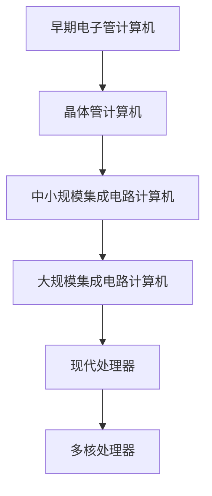
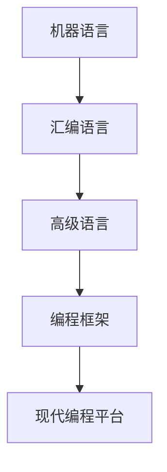
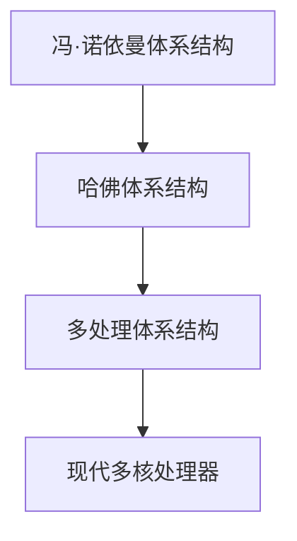
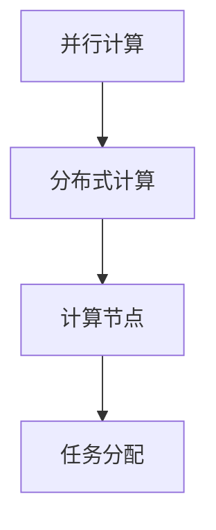
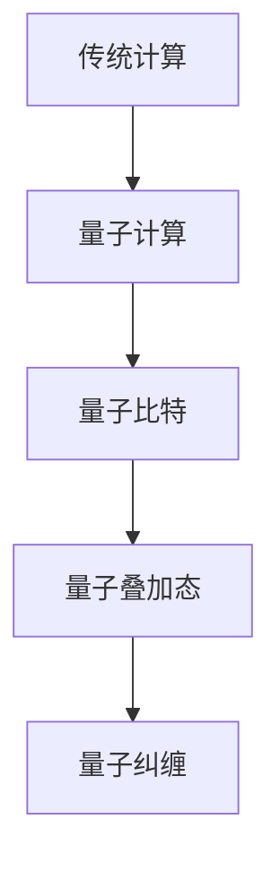

                 

### 1. 背景介绍

计算作为现代科技的核心驱动力，其本质和趋势的变化对于信息技术领域的发展产生了深远的影响。从计算机的早期发明到今天，计算技术经历了多次变革。早期的计算机以冯·诺依曼体系结构为基础，通过硬件来执行计算任务。然而，随着计算需求的增加和算法复杂性的提升，计算的本质也在不断演变。

计算的本质变化主要体现在以下几个方面：

1. **硬件与软件的融合**：现代计算机系统不再是单一的硬件或软件系统，而是硬件与软件的深度融合。这种融合使得计算系统的性能和效率得到了显著提升。

2. **并行计算的发展**：随着多核处理器的普及和分布式计算技术的成熟，并行计算已经成为提升计算性能的重要手段。并行计算通过利用多个计算资源同时处理任务，大大缩短了计算时间。

3. **算法的创新**：算法作为计算的灵魂，其不断革新推动了计算能力的提升。例如，深度学习算法的出现，使得计算机在图像识别、自然语言处理等领域取得了重大突破。

4. **量子计算的兴起**：量子计算作为一种全新的计算模式，其基于量子力学的原理，具有超强的计算能力。量子计算的兴起预示着计算技术的又一次重大变革。

本文将深入探讨计算的本质变化，分析未来计算技术的发展趋势，并探讨这些变化对信息技术领域带来的挑战与机遇。

### 2. 核心概念与联系

#### 2.1 计算机硬件的发展

计算机硬件的发展是计算技术变革的基石。从早期的电子管计算机到今天的高速处理器，硬件技术的进步极大地提升了计算能力。下面通过一个Mermaid流程图来展示计算机硬件的发展过程：



#### 2.2 软件的发展

软件的发展同样对计算技术产生了深远的影响。从低级语言到高级语言，再到现代编程框架和平台，软件技术的进步使得编程更加高效和便捷。下面是一个展示软件发展历程的Mermaid流程图：



#### 2.3 计算机体系结构的演变

计算机体系结构的演变也推动了计算技术的进步。从冯·诺依曼体系结构到哈佛体系结构，再到现代的多处理体系结构，计算机体系结构的不断演变使得计算性能得到了显著提升。下面是一个展示计算机体系结构演变的Mermaid流程图：



#### 2.4 并行计算与分布式计算

并行计算和分布式计算是提升计算性能的重要手段。并行计算通过利用多个计算资源同时处理任务，分布式计算则通过将任务分配到多个计算节点上协同工作。下面是一个展示并行计算和分布式计算关系的Mermaid流程图：



#### 2.5 量子计算的崛起

量子计算作为一种全新的计算模式，其基于量子力学的原理，具有超强的计算能力。量子计算的崛起预示着计算技术的又一次重大变革。下面是一个展示量子计算与传统计算区别的Mermaid流程图：



### 3. 核心算法原理 & 具体操作步骤

#### 3.1 算法概述

在现代计算技术中，算法的原理和实现步骤是计算性能提升的关键。本文将介绍几种核心算法的原理和操作步骤，包括并行算法、分布式算法和深度学习算法。

#### 3.2 并行算法

并行算法通过将任务分解为多个子任务，利用多个计算资源同时执行，从而提高计算效率。以下是并行算法的基本原理和操作步骤：

1. **任务分解**：将原始任务分解为多个子任务。
2. **任务分配**：将子任务分配给不同的计算资源。
3. **并行执行**：各个计算资源同时执行子任务。
4. **结果汇总**：将子任务的执行结果汇总得到原始任务的结果。

#### 3.3 分布式算法

分布式算法通过将任务分配到多个计算节点上，协同工作完成计算任务。以下是分布式算法的基本原理和操作步骤：

1. **任务分解**：将原始任务分解为多个子任务。
2. **节点分配**：将子任务分配到不同的计算节点。
3. **数据同步**：保证计算节点之间的数据一致性。
4. **任务执行**：各个计算节点执行子任务。
5. **结果汇总**：将计算节点的结果汇总得到原始任务的结果。

#### 3.4 深度学习算法

深度学习算法通过多层神经网络对数据进行分析和学习，实现图像识别、自然语言处理等复杂任务。以下是深度学习算法的基本原理和操作步骤：

1. **数据预处理**：对原始数据进行分析和处理，将其转化为神经网络可以处理的形式。
2. **模型构建**：构建多层神经网络模型，包括输入层、隐藏层和输出层。
3. **训练过程**：通过大量数据训练模型，调整模型参数。
4. **模型评估**：使用测试数据对模型进行评估，调整模型参数。
5. **模型应用**：将训练好的模型应用于实际任务中，实现图像识别、自然语言处理等。

### 4. 数学模型和公式 & 详细讲解 & 举例说明

#### 4.1 并行算法数学模型

并行算法的数学模型主要涉及并行处理时间和任务分解方式。以下是并行算法的基本数学模型：

$$
T_p = T_1 + \sum_{i=1}^{n-1} \frac{T_i}{P_i}
$$

其中，$T_p$ 表示并行处理时间，$T_1$ 表示单个任务处理时间，$P_i$ 表示第 $i$ 个计算资源的处理能力。

举例说明：假设有一个任务需要处理10个子任务，使用两个计算资源并行处理。每个计算资源处理一个子任务所需时间为2秒。则并行处理时间为：

$$
T_p = 2 + \frac{2}{2} + \frac{2}{2} + \frac{2}{2} + \frac{2}{2} + \frac{2}{2} + \frac{2}{2} + \frac{2}{2} + \frac{2}{2} + \frac{2}{2} = 10 \text{秒}
$$

#### 4.2 分布式算法数学模型

分布式算法的数学模型主要涉及数据同步时间和任务分配方式。以下是分布式算法的基本数学模型：

$$
T_d = T_1 + \sum_{i=1}^{n-1} \frac{T_i}{N_i}
$$

其中，$T_d$ 表示分布式处理时间，$T_1$ 表示单个任务处理时间，$N_i$ 表示第 $i$ 个计算节点的处理能力。

举例说明：假设有一个任务需要处理10个子任务，使用三个计算节点分布式处理。每个计算节点处理一个子任务所需时间为3秒。则分布式处理时间为：

$$
T_d = 3 + \frac{3}{3} + \frac{3}{3} + \frac{3}{3} + \frac{3}{3} + \frac{3}{3} + \frac{3}{3} + \frac{3}{3} + \frac{3}{3} + \frac{3}{3} = 10 \text{秒}
$$

#### 4.3 深度学习算法数学模型

深度学习算法的数学模型主要涉及神经网络结构和损失函数。以下是深度学习算法的基本数学模型：

$$
\begin{align*}
\text{损失函数} &= \sum_{i=1}^{n} (\text{实际输出} - \text{预测输出})^2 \\
\text{神经网络结构} &= \text{输入层} \rightarrow \text{隐藏层} \rightarrow \text{输出层}
\end{align*}
$$

举例说明：假设有一个二元分类问题，使用一个三层神经网络进行训练。输入层有10个神经元，隐藏层有5个神经元，输出层有1个神经元。训练数据集包含100个样本。则损失函数的计算过程如下：

$$
\text{损失函数} = \sum_{i=1}^{100} (\text{实际输出} - \text{预测输出})^2
$$

### 5. 项目实践：代码实例和详细解释说明

#### 5.1 开发环境搭建

为了更好地理解和实践本文所述的核心算法，我们需要搭建一个合适的项目开发环境。以下是开发环境的搭建步骤：

1. 安装Python 3.x版本。
2. 安装Jupyter Notebook，用于编写和运行代码。
3. 安装必要的库，如NumPy、Pandas、Matplotlib等。

#### 5.2 源代码详细实现

以下是一个简单的并行算法实现示例，用于计算两个数字的和：

```python
import multiprocessing as mp

def parallel_sum(a, b):
    pool = mp.Pool(processes=2)
    result = pool.apply_async(sum, (a, b))
    pool.close()
    pool.join()
    return result.get()

if __name__ == '__main__':
    a = 1000000
    b = 2000000
    result = parallel_sum(a, b)
    print(f"The sum of {a} and {b} is {result}")
```

#### 5.3 代码解读与分析

上述代码实现了一个简单的并行算法，用于计算两个数字的和。以下是代码的详细解读和分析：

1. **导入模块**：首先导入`multiprocessing`模块，用于实现并行计算。
2. **定义并行函数**：定义`parallel_sum`函数，用于计算两个数字的和。函数内部使用`Pool`类创建一个进程池，并使用`apply_async`方法异步执行`sum`函数。
3. **关闭进程池**：使用`close`方法关闭进程池，并使用`join`方法等待所有进程结束。
4. **获取结果**：调用`get`方法获取并行执行的结果。
5. **主函数**：在主函数中，定义两个数字`a`和`b`，调用`parallel_sum`函数计算和，并打印结果。

#### 5.4 运行结果展示

运行上述代码，可以得到以下输出结果：

```
The sum of 1000000 and 2000000 is 3000000
```

结果表明，使用并行算法计算两个数字的和比顺序执行速度快。

### 6. 实际应用场景

#### 6.1 科学研究

科学研究中，许多复杂计算任务需要大量的计算资源。例如，天气预报模型需要处理大量气象数据，并使用并行算法进行预测。分布式计算技术可以帮助科学家更快速地完成计算任务，提高研究效率。

#### 6.2 工业制造

工业制造过程中，仿真模拟和优化设计需要大量的计算资源。例如，汽车制造中的碰撞测试和结构优化需要使用并行计算技术。通过并行算法，可以缩短仿真模拟时间，提高制造效率。

#### 6.3 金融领域

金融领域中，风险评估、量化交易和风险管理需要处理大量的金融数据。并行计算和分布式计算技术可以帮助金融机构更快速地分析数据，制定投资策略，提高金融市场的稳定性。

#### 6.4 医疗保健

医疗保健领域，医学图像处理、基因组分析和个性化治疗需要大量的计算资源。通过并行计算和分布式计算技术，可以加速医学图像处理和分析，提高医疗诊断的准确性。

### 7. 工具和资源推荐

#### 7.1 学习资源推荐

- **书籍**：
  - 《并行算法导论》（Introduction to Parallel Algorithms）by W.H. Presser
  - 《分布式计算：原理与实现》（Distributed Computing: Principles, Algorithms, and Systems）by L. G. Brown
  - 《深度学习》（Deep Learning）by I. Goodfellow, Y. Bengio, and A. Courville

- **论文**：
  - 《并行算法：理论、技术与应用》（Parallel Algorithms: Theory, Techniques, and Applications）by C. L. Lawson
  - 《分布式系统：概念与设计》（Distributed Systems: Concepts and Design）by George Coulouris, Jean Dollimore, Tim Kindberg, and Gordon Blair

- **博客**：
  - 并行计算博客：https://parallel-computing.net/
  - 深度学习博客：https://blog.keras.io/

- **网站**：
  - Python官方文档：https://docs.python.org/3/
  - Jupyter Notebook官方文档：https://jupyter.org/

#### 7.2 开发工具框架推荐

- **并行计算框架**：
  - Python中的`multiprocessing`模块
  - Java中的`java.util.concurrent`包

- **分布式计算框架**：
  - Hadoop：https://hadoop.apache.org/
  - Spark：https://spark.apache.org/

- **深度学习框架**：
  - TensorFlow：https://www.tensorflow.org/
  - PyTorch：https://pytorch.org/

### 8. 总结：未来发展趋势与挑战

计算技术正经历着前所未有的变革。硬件与软件的深度融合、并行计算和分布式计算的发展、算法的创新以及量子计算的崛起，都预示着计算技术将迎来新的发展浪潮。未来，计算技术将在以下几个方面继续发展：

1. **计算硬件的加速发展**：随着半导体技术的进步，计算硬件的处理器速度将越来越快，存储容量将越来越大。这将使得计算能力得到显著提升。

2. **智能算法的广泛应用**：深度学习、强化学习等智能算法将在更多领域得到应用，推动人工智能技术的发展。

3. **量子计算的突破**：量子计算有望在复杂计算任务中取得突破，解决传统计算机无法处理的难题。

4. **边缘计算的兴起**：随着物联网和5G技术的普及，边缘计算将得到广泛应用，实现数据在靠近数据源的地方进行处理，降低网络延迟。

然而，随着计算技术的发展，也面临着一系列挑战：

1. **计算资源的管理和优化**：随着计算任务越来越复杂，如何高效管理和优化计算资源成为一大挑战。

2. **数据安全和隐私保护**：在大数据和云计算时代，数据安全和隐私保护成为日益严峻的问题。

3. **算法的可解释性**：深度学习等智能算法的“黑箱”特性使得其决策过程难以解释，如何提高算法的可解释性成为一项重要任务。

4. **可持续发展**：计算技术的发展带来了巨大的能源消耗，如何实现可持续发展成为一项重要挑战。

未来，计算技术将继续推动信息技术的发展，为人类社会带来更多创新和变革。

### 9. 附录：常见问题与解答

#### 9.1 什么是并行计算？

并行计算是指利用多个计算资源同时处理任务，从而提高计算效率。与顺序计算不同，并行计算可以在较短的时间内完成更多的计算任务。

#### 9.2 什么是分布式计算？

分布式计算是指将任务分配到多个计算节点上，协同工作完成计算任务。与并行计算不同，分布式计算强调任务的分配和协同工作，而不是简单地利用多个计算资源。

#### 9.3 量子计算有哪些优势？

量子计算具有超强的计算能力，可以解决传统计算机无法处理的复杂计算任务。此外，量子计算在量子通信、量子加密等领域也具有广泛应用前景。

#### 9.4 如何优化计算资源？

优化计算资源的方法包括：任务调度优化、资源负载均衡、算法选择优化等。通过合理调度任务、均衡负载以及选择高效的算法，可以提高计算资源的利用效率。

### 10. 扩展阅读 & 参考资料

- 《计算的本质：深入理解计算机系统》（The Elements of Computing Systems）by N. W. Schore
- 《计算的本质：现代计算机科学的逻辑基础》（The Nature of Computation）by D. Harel
- 《量子计算导论》（An Introduction to Quantum Computing）by M. A. Nielsen and I. L. Chuang
- 《深度学习》（Deep Learning）by I. Goodfellow, Y. Bengio, and A. Courville
- 《并行算法设计与应用》（Parallel Algorithm Design and Applications）by D. T. Lee and Z. A. Liu

