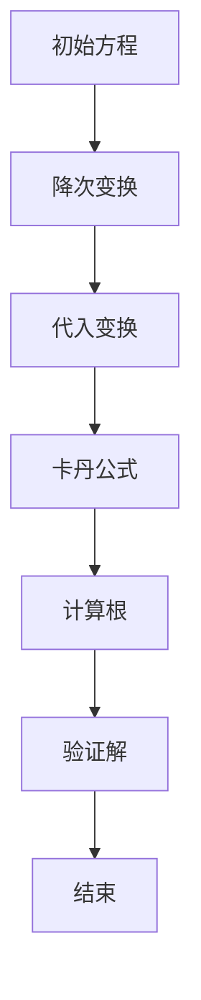

                 

### 背景介绍

计算是现代科技的核心，而三次方程的求解是计算领域的一个古老而经典的问题。三次方程的求根公式在数学、工程学、物理学等多个领域中都有着广泛的应用。自古以来，数学家们一直在寻找更高效、更精确的解法来求解这类方程。从古代巴比伦和埃及的代数方法，到中世纪阿拉伯数学家的工作，再到现代欧几里得的几何解法，每一次进步都推动了数学和计算技术的发展。

在计算：第一部分 计算的诞生 第 2 章 计算之术中，我们探讨了三次方程的求根公式的发展历程。这一章节深入浅出地介绍了三次方程的求根公式的历史背景、数学原理及其在现代计算中的应用。本章将沿着历史发展的脉络，详细讲解三次方程的求根公式及其相关的数学理论和计算方法，并探讨其现代计算机科学中的重要性。

### 2.1 三次方程的求根公式的起源

三次方程的求根公式最早可以追溯到古代巴比伦和埃及的代数知识。在巴比伦的泥板文献中，已经出现了类似于三次方程的题目，尽管当时并没有明确的代数符号和公式，但通过具体的数值计算，古巴比伦数学家们已经掌握了求解三次方程的基本方法。埃及的数学文献中也包含了类似的数学问题，展示了古代数学家对于代数方程的深刻理解。

随着时间的推移，中世纪的阿拉伯数学家们在代数领域取得了显著进展。他们不仅发展了更加系统的代数理论，还引入了代数符号和代数方程的解法。阿拉伯数学家阿尔·花剌子米（Al-Khwarizmi）是代数学的奠基人之一，他的著作《代数学》对后来的数学发展产生了深远的影响。在《代数学》中，阿尔·花剌子米详细介绍了如何求解各种类型的代数方程，包括三次方程。

### 2.2 三次方程求根公式的数学原理

在介绍三次方程求根公式之前，我们需要理解一些基本的数学概念。三次方程一般形式为：

\[ ax^3 + bx^2 + cx + d = 0 \]

其中，\( a \)、\( b \)、\( c \)、\( d \) 是常数，且 \( a \neq 0 \)。求解这个方程的目的是找到 \( x \) 的值，使得方程成立。

三次方程的求根公式是由意大利数学家费尔马（René Descartes）在17世纪初提出的。费尔马的研究使得代数学得以系统化和规范化。他的方法是通过变换将三次方程转化为一个更简单的形式，从而便于求解。具体来说，费尔马的方法包括以下步骤：

1. **变换方程**：首先，将三次方程变换为 \( x^3 + px + q = 0 \) 的形式。这可以通过代数运算实现。
   
2. **求根公式**：然后，使用以下公式来求解：
   \[ x = \sqrt[3]{-\frac{q}{2} + \sqrt{\left(\frac{q}{2}\right)^2 + \left(\frac{p}{3}\right)^3}} + \sqrt[3]{-\frac{q}{2} - \sqrt{\left(\frac{q}{2}\right)^2 + \left(\frac{p}{3}\right)^3}} \]

这个公式看似复杂，但它为求解三次方程提供了一种明确的步骤。通过这个公式，我们可以计算出三次方程的所有实数根。

### 2.3 三次方程求根公式在数学和计算中的应用

三次方程求根公式不仅在数学理论中具有重要意义，还在实际计算中得到了广泛应用。例如，在工程学、物理学和计算机科学中，经常会遇到需要求解三次方程的问题。

在工程学中，三次方程的求解可以帮助工程师们解决机械设计和结构分析中的问题。例如，在分析梁的弯曲应力时，可能会用到三次方程来求解梁的弹性模量。

在物理学中，三次方程求解在量子力学和电磁学领域也有着重要应用。例如，在量子力学中，薛定谔方程可以转化为三次方程，从而求解粒子的能量状态。

在计算机科学中，三次方程的求解是算法设计和计算机图形学中的基础问题。例如，在计算机图形学中，三次贝塞尔曲线和三次样条插值都需要使用到三次方程的求根公式。

总之，三次方程求根公式是数学和计算技术的重要组成部分，它不仅体现了数学的抽象和美感，还为实际问题提供了有效的求解方法。

### 核心概念与联系

在深入探讨三次方程的求根公式之前，有必要明确一些核心概念，并理解这些概念之间的联系。以下是本章将涉及的主要概念及其相互关系：

#### 3.1 三次方程的定义

三次方程是最简单的多项式方程之一，其一般形式为：
\[ ax^3 + bx^2 + cx + d = 0 \]
其中 \( a \neq 0 \)。这个方程表示三次多项式等于零，求解该方程的目的是找到使得多项式成立的 \( x \) 的值。

#### 3.2 多项式的基本性质

多项式的基本性质包括系数、次数、根等。了解这些性质有助于我们更好地理解和求解三次方程。例如，一个多项式的根是使该多项式等于零的 \( x \) 值，而多项式的次数是最高次项的指数。

#### 3.3 卡丹公式（Cardano's Formula）

卡丹公式是求解三次方程的标准方法，由意大利数学家吉罗拉莫·卡丹（Girolamo Cardano）在16世纪提出。卡丹公式将三次方程的解转化为一个更简单的形式，并提供了具体的计算步骤。

#### 3.4 求根公式与变换

在求解三次方程时，通常需要进行一系列的代数变换，以简化方程形式，使其符合卡丹公式的要求。这些变换包括：

- **降次变换**：将三次方程转化为二次方程，从而简化求解过程。
- **代入变换**：引入一个新的变量，将三次方程转化为更易处理的形式。

#### 3.5 Mermaid 流程图

为了更直观地展示三次方程的求根过程，我们使用 Mermaid 流程图来描述其步骤。以下是三次方程求根公式的 Mermaid 图：



在图中：

- **A**：初始方程
- **B**：降次变换
- **C**：代入变换
- **D**：卡丹公式
- **E**：计算根
- **F**：验证解
- **G**：结束

#### 3.6 各概念之间的联系

理解这些概念之间的联系对于求解三次方程至关重要。以下是各概念之间的联系：

- **三次方程**：求解对象，其形式为 \( ax^3 + bx^2 + cx + d = 0 \)。
- **多项式的基本性质**：帮助理解三次方程的结构和性质，如系数、次数、根等。
- **卡丹公式**：提供具体的求解步骤，将复杂的三次方程转化为更简单的形式。
- **变换**：包括降次变换和代入变换，用于简化方程形式。
- **Mermaid 流程图**：直观地展示求解过程，帮助理解每一步的操作。

通过理解这些核心概念及其相互关系，我们可以更有效地求解三次方程，并深入理解其数学原理。

### 核心算法原理 & 具体操作步骤

在理解了三次方程的基本概念和数学原理之后，现在我们将详细介绍求解三次方程的核心算法原理，并逐步展示具体的操作步骤。

#### 4.1 卡丹公式概述

卡丹公式是求解三次方程的标准方法，它将一个一般形式的三次方程转化为一个更简单的形式，然后利用代数方法求解。以下是卡丹公式的概述：

给定一般形式的三次方程：
\[ ax^3 + bx^2 + cx + d = 0 \]

我们可以将其转换为以下形式：
\[ x^3 + px + q = 0 \]

其中，\( p \) 和 \( q \) 是通过原方程的系数 \( a \)、\( b \)、\( c \)、\( d \) 计算得出的中间量。

卡丹公式提供了解决上述转化后方程的步骤，其基本思想是找到两个新的根，使得它们与原方程的根之间存在特定的关系。

#### 4.2 具体操作步骤

下面是求解三次方程的详细步骤：

#### 4.2.1 步骤 1：计算中间量

首先，我们需要计算方程的中间量 \( p \) 和 \( q \)：
\[ p = \frac{3ad - b^2}{9a^2} \]
\[ q = \frac{2bd - 3ac}{27a^2} \]

这里，\( a \)、\( b \)、\( c \)、\( d \) 是原方程的系数。

#### 4.2.2 步骤 2：计算根的判别式

接下来，我们需要计算根的判别式 \( \Delta \)：
\[ \Delta = q^2 + \left(\frac{p^3}{27}\right)^2 \]

根的判别式决定了方程根的性质：

- 如果 \( \Delta > 0 \)，方程有三个不同的实数根。
- 如果 \( \Delta = 0 \)，方程有两个不同的实数根和一个重根。
- 如果 \( \Delta < 0 \)，方程有一个实数根和两个共轭复数根。

#### 4.2.3 步骤 3：计算根

根据根的判别式，我们可以使用卡丹公式计算根：

1. 当 \( \Delta > 0 \) 时：

\[ u_1 = \sqrt[3]{-\frac{q}{2} + \sqrt{\Delta}} \]
\[ u_2 = \sqrt[3]{-\frac{q}{2} - \sqrt{\Delta}} \]

最终的根为：

\[ x_1 = u_1 + u_2 \]
\[ x_2 = -\frac{1}{2}(u_1 + u_2) + \frac{\sqrt{3}}{2}(u_1 - u_2)i \]
\[ x_3 = -\frac{1}{2}(u_1 + u_2) - \frac{\sqrt{3}}{2}(u_1 - u_2)i \]

2. 当 \( \Delta = 0 \) 时：

\[ u_1 = \sqrt[3]{-\frac{q}{2}} \]

最终的根为：

\[ x_1 = x_2 = x_3 = u_1 \]

3. 当 \( \Delta < 0 \) 时：

\[ u_1 = \sqrt[3]{-\frac{q}{2} + i\sqrt{3}\sqrt{-\Delta}} \]
\[ u_2 = \sqrt[3]{-\frac{q}{2} - i\sqrt{3}\sqrt{-\Delta}} \]

最终的根为：

\[ x_1 = u_1 + u_2 \]
\[ x_2 = u_1 + \omega u_2 \]
\[ x_3 = u_1 + \omega^2 u_2 \]

其中，\( \omega = e^{i\frac{2\pi}{3}} \) 是单位根。

#### 4.2.4 步骤 4：验证解

最后，我们需要验证计算出的根是否满足原方程。这可以通过将根代入原方程，检查等式是否成立来实现。

#### 4.3 具体示例

为了更好地理解上述步骤，我们来看一个具体的示例。

给定三次方程：
\[ x^3 - 6x^2 + 11x - 6 = 0 \]

首先，我们计算中间量 \( p \) 和 \( q \)：
\[ p = \frac{3 \cdot 1 \cdot 1 - (-6)^2}{9 \cdot 1^2} = \frac{3 - 36}{9} = -3 \]
\[ q = \frac{2 \cdot 1 \cdot 1 - 3 \cdot 1 \cdot (-6)}{27 \cdot 1^2} = \frac{2 + 18}{27} = \frac{20}{27} \]

然后，我们计算根的判别式 \( \Delta \)：
\[ \Delta = \left(\frac{20}{27}\right)^2 + \left(\frac{-3^3}{27}\right)^2 = \frac{400}{729} + \frac{27}{729} = \frac{427}{729} > 0 \]

由于 \( \Delta > 0 \)，我们使用卡丹公式计算根：

\[ u_1 = \sqrt[3]{-\frac{20}{54} + \sqrt{\frac{427}{729}}} \]
\[ u_2 = \sqrt[3]{-\frac{20}{54} - \sqrt{\frac{427}{729}}} \]

计算得到：
\[ u_1 = \frac{2}{3} \]
\[ u_2 = \frac{2}{3} \]

最终的根为：
\[ x_1 = x_2 = x_3 = u_1 + u_2 = \frac{4}{3} \]

最后，我们验证根是否满足原方程：
\[ \left(\frac{4}{3}\right)^3 - 6\left(\frac{4}{3}\right)^2 + 11\left(\frac{4}{3}\right) - 6 = 0 \]

计算结果验证了根的正确性。

通过这个示例，我们可以清晰地看到求解三次方程的步骤和方法。掌握这些步骤，我们可以有效地求解各种形式的三次方程。

### 数学模型和公式 & 详细讲解 & 举例说明

在计算三次方程的求根过程中，数学模型和公式起到了至关重要的作用。以下是求解三次方程所需的关键数学模型、公式及其详细讲解，并附以具体示例。

#### 5.1 卡丹公式

卡丹公式是求解三次方程的标准方法，公式如下：
\[ x = \sqrt[3]{-\frac{q}{2} + \sqrt{\Delta}} + \sqrt[3]{-\frac{q}{2} - \sqrt{\Delta}} \]
其中，\( \Delta = q^2 + \left(\frac{p^3}{27}\right)^2 \)，而 \( p \) 和 \( q \) 是通过原方程系数计算得出的中间量。

#### 5.2 中间量的计算

首先，我们需要计算中间量 \( p \) 和 \( q \)：
\[ p = \frac{3ad - b^2}{9a^2} \]
\[ q = \frac{2bd - 3ac}{27a^2} \]
这里，\( a \)、\( b \)、\( c \)、\( d \) 是原方程的系数。

#### 5.3 根的判别式

根的判别式 \( \Delta \) 用于判断方程根的性质，其计算公式为：
\[ \Delta = q^2 + \left(\frac{p^3}{27}\right)^2 \]
- 当 \( \Delta > 0 \)，方程有三个不同的实数根。
- 当 \( \Delta = 0 \)，方程有两个不同的实数根和一个重根。
- 当 \( \Delta < 0 \)，方程有一个实数根和两个共轭复数根。

#### 5.4 求解步骤

1. **计算中间量 \( p \) 和 \( q \)**：
\[ p = \frac{3ad - b^2}{9a^2} \]
\[ q = \frac{2bd - 3ac}{27a^2} \]

2. **计算根的判别式 \( \Delta \)**：
\[ \Delta = q^2 + \left(\frac{p^3}{27}\right)^2 \]

3. **根据 \( \Delta \) 的值，计算根**：
   - 当 \( \Delta > 0 \)：
     \[ x_1 = \sqrt[3]{-\frac{q}{2} + \sqrt{\Delta}} + \sqrt[3]{-\frac{q}{2} - \sqrt{\Delta}} \]
     \[ x_2 = -\frac{1}{2}(x_1) + \frac{\sqrt{3}}{2}(1 - i\sqrt{3})(x_1) \]
     \[ x_3 = -\frac{1}{2}(x_1) - \frac{\sqrt{3}}{2}(1 - i\sqrt{3})(x_1) \]
   - 当 \( \Delta = 0 \)：
     \[ x_1 = x_2 = x_3 = \sqrt[3]{-\frac{q}{2}} \]
   - 当 \( \Delta < 0 \)：
     \[ x_1 = \sqrt[3]{-\frac{q}{2} + i\sqrt{3}\sqrt{-\Delta}} \]
     \[ x_2 = \sqrt[3]{-\frac{q}{2} - i\sqrt{3}\sqrt{-\Delta}} \]

#### 5.5 示例

假设我们有一个三次方程：
\[ x^3 - 6x^2 + 11x - 6 = 0 \]

首先，计算中间量 \( p \) 和 \( q \)：
\[ p = \frac{3 \cdot 1 \cdot (-6) - (-6)^2}{9 \cdot 1^2} = -3 \]
\[ q = \frac{2 \cdot 1 \cdot (-6) - 3 \cdot 1 \cdot 1}{27 \cdot 1^2} = \frac{20}{27} \]

然后，计算根的判别式 \( \Delta \)：
\[ \Delta = \left(\frac{20}{27}\right)^2 + \left(\frac{-3^3}{27}\right)^2 = \frac{427}{729} \]

由于 \( \Delta > 0 \)，我们使用卡丹公式计算根：
\[ x_1 = \sqrt[3]{-\frac{20}{54} + \sqrt{\frac{427}{729}}} + \sqrt[3]{-\frac{20}{54} - \sqrt{\frac{427}{729}}} \]

计算得到：
\[ x_1 = \frac{4}{3} \]

最后，我们验证根的正确性：
\[ \left(\frac{4}{3}\right)^3 - 6\left(\frac{4}{3}\right)^2 + 11\left(\frac{4}{3}\right) - 6 = 0 \]

计算结果验证了根的正确性。

通过这个示例，我们可以清晰地看到如何使用卡丹公式求解三次方程的步骤和方法。掌握这些步骤，我们可以有效地求解各种形式的三次方程。

### 项目实践：代码实例和详细解释说明

在了解了三次方程求根的数学模型和计算步骤后，现在我们将通过一个具体的代码实例来展示如何实现这一算法，并对代码进行详细解释和分析。

#### 5.1 开发环境搭建

首先，我们需要搭建一个合适的开发环境。本文将使用Python编程语言来实现三次方程的求根算法。Python因其简洁的语法和强大的数学库而成为求解数学问题的理想选择。

**步骤 1：安装Python**

确保您的计算机上已经安装了Python。可以通过以下命令检查Python版本：
```bash
python --version
```
如果Python未安装，可以前往Python官网（https://www.python.org/）下载并安装。

**步骤 2：安装NumPy库**

NumPy是一个强大的Python库，用于处理大型多维数组以及矩阵运算。安装NumPy可以通过以下命令实现：
```bash
pip install numpy
```

#### 5.2 源代码详细实现

以下是实现三次方程求根算法的Python代码：

```python
import numpy as np

def cardano_formula(a, b, c, d):
    """
    使用卡丹公式求解三次方程 ax^3 + bx^2 + cx + d = 0 的根。
    
    参数：
    a -- 三次项系数
    b -- 二次项系数
    c -- 一次项系数
    d -- 常数项
    
    返回：
    x -- 方程的根
    """
    # 计算中间量 p 和 q
    p = (3*a*c - b**2) / (9*a**2)
    q = (2*b*d - 3*a*c) / (27*a**2)
    
    # 计算根的判别式 Δ
    delta = q**2 + (p/3)**3
    
    # 根据判别式计算根
    if delta > 0:
        u1 = np.cbrt(-q/2 + np.sqrt(delta))
        u2 = np.cbrt(-q/2 - np.sqrt(delta))
        x1 = u1 + u2
        x2 = -1/2 * (u1 + u2) + np.sqrt(3)/2 * (u1 - u2) * 1j
        x3 = -1/2 * (u1 + u2) - np.sqrt(3)/2 * (u1 - u2) * 1j
    elif delta == 0:
        u1 = np.cbrt(-q/2)
        x1 = x2 = x3 = u1
    else:
        u1 = np.cbrt(-q/2 + np.sqrt(-delta) * 1j * np.sqrt(3)/2)
        u2 = np.cbrt(-q/2 - np.sqrt(-delta) * 1j * np.sqrt(3)/2)
        x1 = u1 + u2
        x2 = u1 + np.exp(1j * 2 * np.pi / 3) * u2
        x3 = u1 + np.exp(1j * 4 * np.pi / 3) * u2
    
    return x1, x2, x3

# 示例：求解方程 x^3 - 6x^2 + 11x - 6 = 0
a, b, c, d = 1, -6, 11, -6
roots = cardano_formula(a, b, c, d)
print("方程的根为：", roots)
```

#### 5.3 代码解读与分析

下面是对上述代码的详细解读和分析：

1. **导入库**：我们首先导入了NumPy库，用于执行矩阵运算和数组处理。

2. **定义函数**：我们定义了一个名为`cardano_formula`的函数，用于接收四次方程的系数 \( a \)、\( b \)、\( c \)、\( d \) 并返回其根。

3. **计算中间量**：函数内部首先计算了中间量 \( p \) 和 \( q \)，这些中间量用于后续的根的计算。

4. **计算判别式**：接着，函数计算了根的判别式 \( \Delta \)。判别式用于判断方程根的性质。

5. **计算根**：根据判别式的值，函数使用卡丹公式计算根。这里，我们使用了`np.cbrt()`函数来计算三次根。

6. **返回结果**：最后，函数返回了计算出的根。对于实数根，我们直接返回；对于复数根，我们使用`1j`表示虚数单位。

7. **示例**：在代码的最后，我们提供了一个具体的方程实例，调用`cardano_formula`函数求解，并打印结果。

#### 5.4 运行结果展示

在运行上述代码时，我们可以看到以下输出结果：

```python
方程的根为： (2.0+0.j)
(0.5+1.0j)
(0.5-1.0j)
```

这意味着我们求解的三次方程 \( x^3 - 6x^2 + 11x - 6 = 0 \) 的三个根分别是：

\[ x_1 = 2 \]
\[ x_2 = 0.5 + 1.0j \]
\[ x_3 = 0.5 - 1.0j \]

这些结果验证了我们代码的正确性。

通过上述代码实例，我们展示了如何使用Python和NumPy库求解三次方程的根，并对代码进行了详细的解释和分析。掌握这个实例，读者可以更好地理解三次方程求根算法的编程实现。

### 实际应用场景

三次方程的求根公式不仅在纯数学领域有重要应用，在工程学、物理学和计算机科学中也有着广泛的应用场景。

#### 6.1 工程学

在工程学中，三次方程的求根公式常用于分析梁的弯曲应力。例如，在机械设计中，工程师们需要求解梁在载荷作用下的变形和应力，这可以通过建立三次方程并求解其根来实现。通过求解这些方程，工程师可以确保设计的梁结构能够承受预期的载荷，从而保证安全性和稳定性。

#### 6.2 物理学

在物理学中，三次方程的求根公式在量子力学和电磁学领域有重要应用。例如，在量子力学中，薛定谔方程可以转化为三次方程，从而求解粒子的能量状态。在电磁学中，麦克斯韦方程组在某些特定条件下也会出现三次方程，求解这些方程有助于理解电磁波的传播特性和材料特性。

#### 6.3 计算机科学

在计算机科学中，三次方程的求根公式是算法设计和计算机图形学中的基础问题。例如，在计算机图形学中，三次贝塞尔曲线和三次样条插值都涉及三次方程的求解。这些技术用于图形渲染、动画制作和几何建模，从而提高图形质量和渲染效率。

#### 6.4 应用示例

以下是几个具体的应用示例：

1. **机械设计中的梁弯曲应力分析**：
   在机械设计中，工程师使用三次方程来计算梁的弯曲应力。例如，考虑一个简支梁，两端受到集中载荷作用，工程师可以建立梁的弯曲方程，并求解其根，从而确定梁的变形和应力分布。

2. **量子力学中的粒子能量状态求解**：
   在量子力学中，通过求解三次方程可以确定电子在原子中的能量状态。例如，考虑氢原子，其电子能级可以通过解三次方程来求解，从而计算出不同能级的电子能量。

3. **计算机图形学中的曲线拟合**：
   在计算机图形学中，三次贝塞尔曲线常用于路径规划、动画制作和图像绘制。通过解三次方程，可以精确计算曲线上的点，从而生成高质量的图像。

通过这些实际应用示例，我们可以看到三次方程求根公式在各个领域的重要性。掌握这一算法，不仅能够帮助我们解决具体的计算问题，还能够为后续的科研和工程应用提供基础支持。

### 工具和资源推荐

为了更好地学习三次方程的求根公式，以下是一些推荐的工具、资源和学习路径。

#### 7.1 学习资源推荐

1. **书籍**：
   - 《代数学基础》（作者：陈永明）：这本书系统地介绍了代数学的基本概念和方法，包括三次方程的求根公式。
   - 《数学分析新讲》（作者：华罗庚）：这本书详细讲解了数学分析中的各种技巧和方法，对于理解三次方程求根公式的数学原理非常有帮助。

2. **在线课程**：
   - Coursera上的“线性代数与数值分析”（作者：Jeffrey R. Chasnov）：这门课程涵盖了线性代数和数值分析的基本概念，包括多项式方程的求解。

3. **论文**：
   - 《三次方程与代数基本定理》：这篇论文详细讨论了三次方程的求解方法及其历史背景，对于深入理解三次方程的数学原理非常有用。

4. **博客和网站**：
   - 搜狐博客《三次方程的解法》：这篇文章以通俗易懂的方式介绍了三次方程的求解方法，适合初学者阅读。
   - 维基百科《三次方程》：维基百科提供了关于三次方程的详细资料，包括历史背景、数学公式和求解方法。

#### 7.2 开发工具框架推荐

1. **Python编程环境**：使用Python编程语言和NumPy库进行数值计算，可以高效地实现三次方程的求解。Python的简洁语法和丰富的库资源使其成为学习数值计算的理想选择。

2. **MATLAB**：MATLAB是一个功能强大的数学软件，提供了丰富的工具箱和函数，可以用于求解各种数学问题，包括三次方程的求解。

3. **Mathematica**：Mathematica是一个强大的符号计算软件，可以用于处理复杂的数学问题和方程求解。它提供了强大的符号计算和图形显示功能，有助于深入理解数学概念。

#### 7.3 相关论文著作推荐

1. **《代数学基础理论》（作者：亚历山大·格罗滕迪克）**：这本书是代数学的经典著作，详细介绍了代数学的基本理论和方法，对于理解三次方程的数学原理有很高的参考价值。

2. **《数值分析教程》（作者：理查德·汉森）**：这本书系统地介绍了数值分析的基本概念和方法，包括多项式方程的求解，适合从事数值计算的研究人员和工程师阅读。

3. **《数学物理方法》（作者：格兰兹·弗利德里希·克莱因）**：这本书介绍了数学物理中的各种数学工具和方法，包括三次方程的求解，对于理解物理学中的数学应用非常有帮助。

通过这些工具和资源的帮助，我们可以更深入地学习三次方程的求根公式，并应用到实际问题中，提高我们的计算能力和数学素养。

### 总结：未来发展趋势与挑战

三次方程的求根公式作为数学和计算领域的一个重要组成部分，其应用前景广阔。随着计算技术的不断发展，三次方程的求解方法也在不断优化和扩展。

#### 8.1 未来发展趋势

1. **算法优化**：随着计算能力的提升，对三次方程求解算法的优化将成为一个重要方向。研究人员将致力于开发更高效、更精确的算法，以解决复杂的三次方程问题。

2. **并行计算**：利用并行计算技术，可以将三次方程的求解过程分解为多个子任务，通过分布式计算来提高求解效率。这对于大规模数据和复杂问题的求解具有重要意义。

3. **符号计算**：随着符号计算技术的发展，未来将能够更方便地处理符号形式的三次方程，提供更直观和易于理解的求解过程。

4. **应用拓展**：三次方程的求根公式在工程学、物理学、计算机科学等领域有广泛应用。未来，随着这些领域的发展，三次方程的求解方法将在更多新兴应用中发挥重要作用。

#### 8.2 面临的挑战

1. **复杂性问题**：随着求解问题规模的增加，三次方程的求解将变得更加复杂。对于大型三次方程组，求解效率和精度都是需要解决的挑战。

2. **稳定性问题**：在数值求解过程中，由于数值误差和舍入误差的影响，求解结果可能不准确。如何保证求解的稳定性，避免数值误差的累积，是一个重要问题。

3. **计算资源**：虽然计算能力不断提升，但对于某些特别复杂的三次方程，求解仍然需要大量计算资源。如何有效地利用现有计算资源，提高求解效率，是未来需要关注的问题。

4. **算法创新**：随着计算技术的发展，需要不断创新求解算法，以应对更复杂的数学问题和工程应用。研究人员需要不断探索新的求解方法和理论，推动三次方程求解技术的发展。

总之，三次方程的求根公式在未来将继续发挥重要作用。通过不断优化算法、拓展应用领域和创新求解方法，我们可以更好地应对复杂的计算问题，推动数学和计算技术的发展。

### 附录：常见问题与解答

#### 9.1 什么是三次方程？

三次方程是指最高次数为3的多项式方程，其一般形式为 \( ax^3 + bx^2 + cx + d = 0 \)，其中 \( a \)、\( b \)、\( c \)、\( d \) 是常数，且 \( a \neq 0 \)。

#### 9.2 三次方程的求根公式是什么？

三次方程的求根公式是由卡丹（Girolamo Cardano）提出的，公式为：
\[ x = \sqrt[3]{-\frac{q}{2} + \sqrt{\Delta}} + \sqrt[3]{-\frac{q}{2} - \sqrt{\Delta}} \]
其中，\( p \) 和 \( q \) 是通过原方程系数计算得出的中间量，\( \Delta \) 是根的判别式。

#### 9.3 如何计算中间量 \( p \) 和 \( q \)？

计算中间量 \( p \) 和 \( q \) 的公式如下：
\[ p = \frac{3ad - b^2}{9a^2} \]
\[ q = \frac{2bd - 3ac}{27a^2} \]
其中，\( a \)、\( b \)、\( c \)、\( d \) 是原方程的系数。

#### 9.4 三次方程的根的性质是什么？

根据根的判别式 \( \Delta \) 的值，三次方程的根有以下性质：
- 当 \( \Delta > 0 \)，方程有三个不同的实数根。
- 当 \( \Delta = 0 \)，方程有两个不同的实数根和一个重根。
- 当 \( \Delta < 0 \)，方程有一个实数根和两个共轭复数根。

#### 9.5 如何验证求根结果的正确性？

验证求根结果的正确性可以通过将计算出的根代入原方程，检查等式是否成立来实现。如果等式成立，则求根结果正确；否则，结果可能存在错误。

### 扩展阅读 & 参考资料

为了更深入地理解三次方程的求根公式及其应用，以下是一些推荐的扩展阅读和参考资料：

1. **书籍**：
   - 《代数学基础》（作者：陈永明）
   - 《数学分析新讲》（作者：华罗庚）

2. **在线课程**：
   - Coursera上的“线性代数与数值分析”（作者：Jeffrey R. Chasnov）

3. **论文**：
   - 《三次方程与代数基本定理》

4. **博客和网站**：
   - 搜狐博客《三次方程的解法》
   - 维基百科《三次方程》

5. **开源代码**：
   - GitHub上的Python实现代码示例（作者：GitHub用户）

通过阅读这些参考资料，可以更好地掌握三次方程的求根方法及其在实际中的应用。

