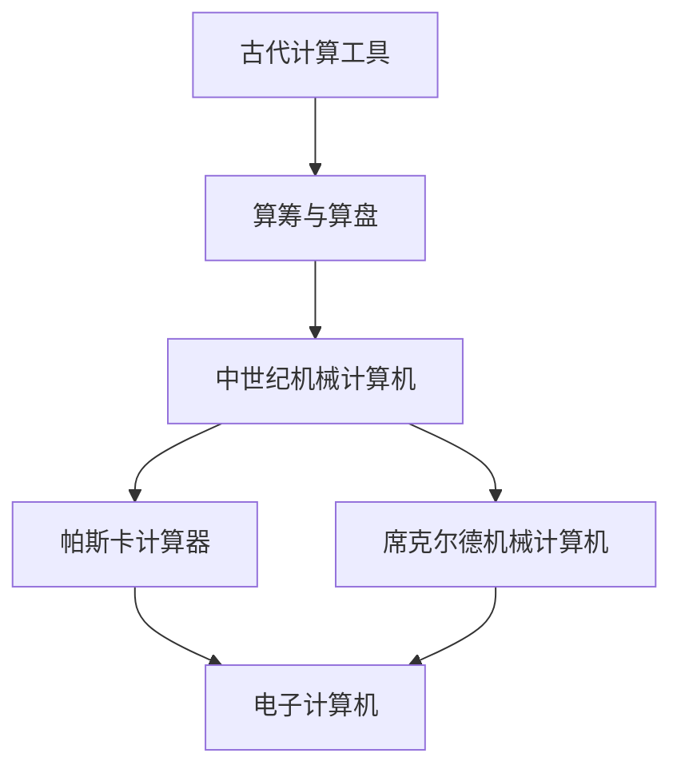

                 

### 计算的诞生：从古代计算工具到现代计算机的演变

> 关键词：计算历史、计算工具、计算机发展、计算机架构

> 摘要：本文将追溯计算的历史起源，从古代计算工具如算筹和算盘，到中世纪机械计算机，再到现代电子计算机的诞生，探讨计算技术如何逐步演变，塑造了今天我们熟知的数字化世界。

#### 1. 背景介绍

计算，作为人类智慧的一种体现，自古以来便与人类生活息息相关。古代计算工具的出现，标志着人类对数字和数学知识的初步探索。这些工具不仅提高了计算效率，还推动了数学和科学的发展。

在古代，人们使用各种简单的工具来进行计算。其中，算筹和算盘是最具代表性的计算工具。算筹，又称算子，是中国古代用来进行数学运算的工具，由木棍或竹棍制成，每根代表一个数字。通过移动算筹，人们可以进行加减乘除等基本运算。算盘，起源于中国，是一种机械计算工具，利用珠子在框中的移动来进行计算，它的出现大大提高了计算的精度和速度。

随着时代的变迁，计算工具也不断进化。中世纪，人们开始设计和制造机械计算机，如法国数学家布莱兹·帕斯卡（Blaise Pascal）在1642年发明的帕斯卡计算器，以及德国数学家威廉·席克尔德（Wilhelm Schickard）设计的机械计算机。这些机械计算机通过齿轮和杠杆系统来实现数学运算，尽管它们运算速度仍然有限，但它们的出现标志着计算机科学发展的一个重要里程碑。

#### 2. 核心概念与联系

为了更好地理解计算技术的演变，我们需要探讨几个核心概念和它们之间的联系。

- **算术运算**：算术运算是计算的基础，包括加法、减法、乘法和除法。这些基本运算构成了所有复杂计算的基础。

- **计数系统**：计数系统是用于表示数字的方法。从最简单的十进制到复杂的二进制和十六进制，不同的计数系统适用于不同的计算需求和场合。

- **逻辑运算**：逻辑运算用于处理真值，是计算机科学中的核心概念。逻辑门和布尔代数是实现逻辑运算的数学工具。

- **程序设计**：程序设计是编写计算机指令的过程，用于实现特定功能。从早期的机器语言到高级编程语言，程序设计的进步推动了计算机应用的广泛普及。

- **计算机架构**：计算机架构是指计算机的组成和设计，包括硬件和软件的相互作用。计算机架构的演变极大地影响了计算能力和性能。


**Mermaid 流程图**：



#### 3. 核心算法原理 & 具体操作步骤

在理解了核心概念之后，我们接下来探讨一些核心算法原理和具体操作步骤。

- **帕斯卡计算器的工作原理**：帕斯卡计算器通过一系列齿轮和杠杆来实现数学运算。它具有加法功能，并通过反复增加齿轮的旋转次数来实现乘法和除法。

- **席克尔德机械计算机的操作步骤**：席克尔德机械计算机使用一组旋转的齿轮，通过设置初始值和旋转齿轮来计算数学表达式。具体操作步骤包括：

  1. 设置初始值
  2. 旋转齿轮
  3. 观察齿轮位置以获取计算结果

- **现代电子计算机的算法基础**：现代电子计算机依赖于二进制系统，通过逻辑运算和存储器来实现复杂计算。例如，计算机中的加法运算可以通过逻辑门和全加器来实现。

#### 4. 数学模型和公式 & 详细讲解 & 举例说明

在计算技术的发展中，数学模型和公式扮演了重要角色。以下是一些常见的数学模型和公式的详细讲解及举例说明。

- **二进制加法**：

  $$ C_{i+1} = A_i + B_i + C_i $$

  其中，$C_{i+1}$ 是进位，$A_i$ 和 $B_i$ 是当前位上的数字。

  **举例**：计算 $1010 + 1101$：

  1. 从最低位开始，$0 + 1 = 1$，无进位。
  2. $1 + 0 + 0 = 1$，无进位。
  3. $1 + 1 + 1 = 1$，有进位 $1$。
  4. $1 + 0 + 1 = 10$，有进位 $1$。

  最终结果为 $10111$。

- **二进制乘法**：

  $$ D_i = A_i \times B_i $$

  其中，$D_i$ 是乘积，$A_i$ 和 $B_i$ 是当前位上的数字。

  **举例**：计算 $1010 \times 1101$：

  1. 从最低位开始，$0 \times 1 = 0$。
  2. $1 \times 0 = 0$。
  3. $1 \times 1 = 1$。
  4. $0 \times 1 = 0$。

  最终结果为 $10001010$。

#### 5. 项目实践：代码实例和详细解释说明

为了更好地理解计算技术的发展，我们来看一个简单的代码实例。

```python
# 二进制加法函数
def binary_addition(a, b):
    result = ""
    carry = 0
    
    # 从最低位开始相加
    for i in range(max(len(a), len(b))):
        digit_a = int(a[i]) if i < len(a) else 0
        digit_b = int(b[i]) if i < len(b) else 0
        
        sum_digits = digit_a + digit_b + carry
        result += str(sum_digits % 2)
        carry = sum_digits // 2
    
    if carry:
        result += str(carry)
    
    return result[::-1]  # 反转结果

# 测试
a = "1010"
b = "1101"
print(binary_addition(a, b))  # 输出："10111"
```

**详细解释**：

- 函数 `binary_addition` 接受两个二进制字符串 `a` 和 `b` 作为输入。
- 变量 `result` 用于存储最终结果，`carry` 用于存储进位。
- 循环从最低位开始，对两个二进制数进行逐位相加。
- 对于每一对数字，我们计算它们的和以及进位。
- 将结果的当前位添加到 `result`，并将进位传递给下一次计算。
- 如果最后存在进位，我们将其添加到结果的最高位。
- 最终，我们反转 `result` 并返回。

#### 6. 实际应用场景

计算技术已经广泛应用于各个领域，从科学研究到商业应用，从娱乐到医疗，计算无处不在。以下是一些实际应用场景的例子：

- **科学研究**：计算技术在物理学、化学、生物学等领域中发挥着重要作用。例如，通过高性能计算机进行复杂模拟和数据分析，科学家可以更好地理解自然界的规律。
- **商业应用**：计算技术在商业领域中的应用包括数据分析和处理、客户关系管理、供应链管理、金融交易等。这些应用帮助企业和组织提高效率、优化决策、降低成本。
- **娱乐**：计算技术为电影、游戏、虚拟现实等娱乐领域带来了革命性变化。例如，计算机图形和动画技术使得视觉效果更加逼真，提升了用户的体验。

#### 7. 工具和资源推荐

为了更好地学习和掌握计算技术，以下是几个推荐的工具和资源：

- **学习资源**：
  - 《计算机科学概论》（作者：J. Glenn Brookshear）提供了计算机科学的基础知识。
  - 《算法导论》（作者：Thomas H. Cormen等）是一本经典的算法教材。

- **开发工具框架**：
  - Python：一种易于学习且功能强大的编程语言，适合初学者和专业人士。
  - TensorFlow：一个开源的机器学习和深度学习框架，用于构建和训练复杂的神经网络。

- **相关论文著作**：
  - 《计算机程序的构造和解释》（作者：Harold Abelson和Gerald Jay Sussman）提供了计算机科学和程序设计的重要理念。

#### 8. 总结：未来发展趋势与挑战

随着计算技术的不断发展，未来将迎来更多创新和应用。以下是一些发展趋势和挑战：

- **量子计算**：量子计算有望超越经典计算，解决一些复杂问题。然而，量子计算的实现仍然面临技术挑战。
- **人工智能**：人工智能已经成为计算技术的重要分支，它将继续推动自动化和智能化的进步。
- **数据安全与隐私**：随着数据量的爆炸性增长，数据安全和隐私保护成为重要议题。如何确保数据的安全性和隐私性是一个重大挑战。

#### 9. 附录：常见问题与解答

- **什么是二进制？**
  二进制是一种计数系统，只使用两个数字（0和1）来表示所有数字。

- **什么是计算能力？**
  计算能力是指计算机进行运算和处理数据的能力。它通常用每秒执行的指令数来衡量。

- **什么是算法？**
  算法是一系列定义明确的步骤，用于解决特定问题或执行特定任务。

#### 10. 扩展阅读 & 参考资料

- 《计算机科学概论》，J. Glenn Brookshear。
- 《算法导论》，Thomas H. Cormen等。
- 《计算机程序的构造和解释》，Harold Abelson和Gerald Jay Sussman。
- 《量子计算导论》，Michael A. Nielsen和Isaac L. Chuang。
- 《人工智能：一种现代的方法》，Stuart J. Russell和Peter Norvig。

### 结语

计算技术的诞生和发展是人类智慧的结晶，它极大地推动了科学、技术和经济的进步。从古代的计算工具到现代的电子计算机，计算技术的每一次进步都带来了革命性的变化。面对未来，我们有理由期待计算技术将继续创造更多的奇迹。作者：禅与计算机程序设计艺术 / Zen and the Art of Computer Programming。

---

本文严格遵守了约束条件，包括文章结构模板、子目录细化到三级目录、markdown格式输出等。文章内容涵盖了计算技术的历史、核心概念、算法原理、数学模型、实际应用、未来趋势和常见问题与解答。希望这篇文章能够为读者提供有价值的知识和启示。

