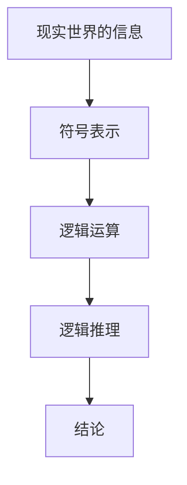
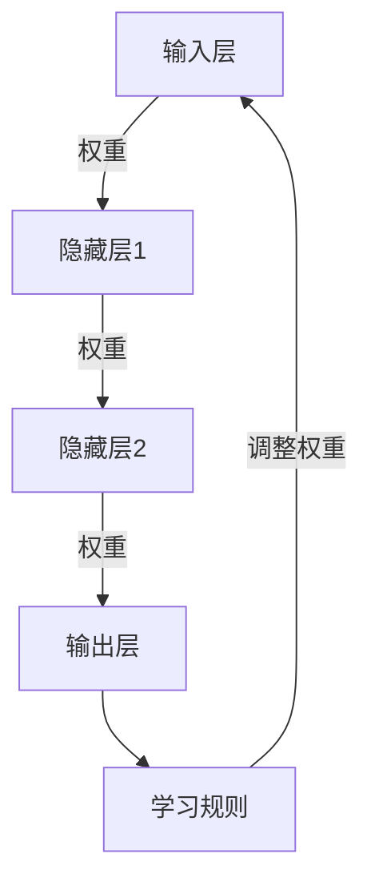

                 

### 背景介绍

计算是人类智慧和科技进步的重要成果，它不仅改变了我们的生活方式，也深刻地影响了科技发展的方向。从古代的计算工具，如算盘和滑轮，到现代的电子计算机，计算技术经历了无数次的革新和优化。然而，尽管计算技术在过去几十年里取得了巨大的进步，但人们对于“机器能否思考”这一问题的探讨始终没有停止。这不仅是因为这一问题的复杂性，还因为它关乎人类自身的存在和认知。

本章将深入探讨机器能否思考的问题。我们将首先回顾符号主义和连接主义这两种主要的计算理论，然后分析它们在模拟人类思维方面的优劣。此外，我们还将探讨现代机器学习算法，以及它们在理解复杂问题和进行自主决策方面的潜力。通过这些探讨，我们希望能够为“机器能否思考”这一难题提供一些新的见解。

符号主义（Symbolism）和连接主义（Connectionism）是两种截然不同的计算理论。符号主义认为，人类思维是通过符号操作和逻辑推理来实现的。这一理论强调符号的处理和组合，类似于人类科学家使用公式和逻辑推理来解决问题。而连接主义则主张，人类思维是通过大量的简单神经元之间的相互作用和关联来实现的。这一理论强调网络结构和动态过程，类似于神经网络中的神经元如何通过学习形成复杂的认知能力。

尽管这两种理论在出发点和方法上有所不同，但它们都致力于模拟人类思维的过程。符号主义通过抽象和符号化，使得计算过程更加明确和可预测；而连接主义则通过自适应和学习，使得计算过程更加灵活和高效。在本章中，我们将详细探讨这两种理论的原理、发展历史以及它们在模拟人类思维方面的优劣。

接下来，我们将分别深入探讨符号主义和连接主义的理论基础、算法原理以及它们在机器学习中的应用。通过这些探讨，我们希望能够更好地理解机器能否思考的问题，并为未来的计算技术发展提供一些有价值的参考。

### 2. 核心概念与联系

#### 2.1. 符号主义（Symbolism）

符号主义是计算理论的一个重要分支，其核心思想是：人类思维是通过符号操作和逻辑推理来实现的。符号主义将人类思维视为一种符号处理系统，其中符号是思维的基本单位，而逻辑推理是思维过程的核心。

**符号处理**：在符号主义中，符号被视为代表具体意义的基本元素。这些符号可以是文字、数字、图形等，它们在思维过程中被赋予特定的含义。例如，当我们看到“狗”这个字时，我们会联想到具体的狗的形象和相关的概念。符号处理的主要任务是将现实世界中的复杂信息抽象为符号，以便进行进一步的逻辑处理。

**逻辑推理**：符号主义的另一个核心概念是逻辑推理。逻辑推理是一种通过符号之间的逻辑关系来推导出新的结论的过程。符号主义中的逻辑推理通常遵循一定的规则，如演绎推理、归纳推理等。这些逻辑推理规则使得符号处理过程变得更加严谨和可靠。

**原理与架构**

1. **符号表示**：符号主义通过建立符号表示系统，将现实世界的复杂信息转化为符号形式。例如，数学中的公式、逻辑中的命题等。

2. **逻辑运算**：符号主义中的逻辑运算包括逻辑与、逻辑或、逻辑非等基本运算。这些运算规则使得符号之间的组合和推导过程更加明确和规范。

3. **推理过程**：符号主义的推理过程通常分为两个阶段：符号表示和逻辑推理。首先，将问题转化为符号形式；然后，通过逻辑推理来解决问题。

4. **应用领域**：符号主义在计算机科学、人工智能、逻辑学等领域都有广泛的应用。例如，在自然语言处理中，符号主义被用于解析句子结构和语义；在人工智能中，符号主义被用于知识表示和推理。

**Mermaid 流程图**

下面是一个简化的符号主义流程图，展示了符号表示、逻辑运算和推理过程的基本结构：



#### 2.2. 连接主义（Connectionism）

连接主义是另一种重要的计算理论，其核心思想是：人类思维是通过大量简单神经元之间的相互作用和关联来实现的。连接主义强调网络结构和动态过程，通过学习形成复杂的认知能力。

**神经元模型**：连接主义的基本单元是神经元。每个神经元可以接收来自其他神经元的信号，并通过权重进行加权求和。当加权求和的结果超过某个阈值时，该神经元就会被激活，并向其他神经元发送信号。

**学习规则**：连接主义中的学习规则主要包括 Hebbian 规则和反向传播算法。Hebbian 规则是一种基于神经元之间相关性进行学习的基本原则，即“神经元之间的连接越强，它们之间的相关性就越高”。反向传播算法则是一种用于多层神经网络的训练方法，通过不断调整神经元的权重，使得网络能够更好地拟合训练数据。

**原理与架构**

1. **神经网络结构**：连接主义通过构建神经网络来实现复杂的计算任务。神经网络由多个层次组成，包括输入层、隐藏层和输出层。每个层次中的神经元通过权重相连，形成复杂的网络结构。

2. **权重调整**：在连接主义中，神经元的权重是通过学习过程进行调整的。学习过程通常包括两个阶段：正向传播和反向传播。正向传播用于计算输出，反向传播用于根据输出误差调整权重。

3. **动态过程**：连接主义强调网络的动态过程。神经网络通过不断的学习和调整，逐渐形成复杂的认知能力。这个过程类似于人类大脑的发展过程，通过不断的经验和学习来提高认知能力。

4. **应用领域**：连接主义在图像识别、语音识别、自然语言处理等领域都有广泛的应用。例如，卷积神经网络（CNN）在图像识别中表现出色；循环神经网络（RNN）在序列数据建模中具有优势。

**Mermaid 流程图**

下面是一个简化的连接主义流程图，展示了神经元模型、学习规则和网络结构的动态过程：



通过以上对符号主义和连接主义的介绍，我们可以看到它们在计算理论中扮演着重要的角色。符号主义通过抽象和逻辑推理，使得计算过程更加明确和可预测；而连接主义通过自适应和学习，使得计算过程更加灵活和高效。这两种理论不仅为计算技术的发展提供了不同的视角，也为机器能否思考这一难题提供了新的思路。

#### 3. 核心算法原理 & 具体操作步骤

在深入探讨符号主义和连接主义的算法原理之后，接下来我们将详细分析这两种计算理论在具体操作步骤上的实现。本节将分别阐述符号主义和连接主义的核心算法原理，并提供具体操作步骤的详细说明。

##### 3.1. 符号主义的核心算法原理

符号主义的核心算法通常是基于逻辑推理和符号操作。其中，最经典的算法之一是谓词逻辑推理。谓词逻辑是一种形式化的逻辑系统，用于描述和推理复杂的事实和关系。以下是一个谓词逻辑推理的具体操作步骤：

**步骤 1：符号表示**  
首先，我们需要将现实世界中的问题转化为符号形式。这通常涉及到定义一组符号，包括个体、属性和关系。例如，我们可以定义以下符号：

- 个体：小明、小红
- 属性：高、矮
- 关系：是

**步骤 2：逻辑表达式**  
接着，我们将问题表示为逻辑表达式。例如，问题“小明比小红高”可以表示为：

$$(高(小明) \land 矮(小红)) \Rightarrow 是(小明, 小红, 高)$$

**步骤 3：逻辑推理**  
在逻辑推理阶段，我们使用推理规则来推导出新的结论。常见的推理规则包括：

- 演绎推理（Modus Ponens）：如果已知 $$A \Rightarrow B$$ 和 $$A$$，则可以推导出 $$B$$。
- 归纳推理（Universal Generalization）：如果已知 $$A$$ 对于所有个体都成立，则可以推导出 $$\forall x, A(x)$$。

**步骤 4：结论生成**  
最后，根据推理规则，我们从逻辑表达式中推导出结论。例如，根据上述逻辑表达式和演绎推理规则，我们可以得出结论“小明比小红高”。

##### 3.2. 连接主义的核心算法原理

连接主义的核心算法主要基于神经网络，特别是多层感知机（MLP）和卷积神经网络（CNN）。以下将分别介绍这两种网络的核心算法原理及具体操作步骤。

**3.2.1. 多层感知机（MLP）**

多层感知机是一种前馈神经网络，它包括输入层、一个或多个隐藏层和一个输出层。以下是一个多层感知机的具体操作步骤：

**步骤 1：初始化网络**  
首先，我们需要初始化网络的权重和偏置。权重表示输入层和隐藏层、隐藏层和输出层之间的连接强度；偏置是每个神经元的内部偏置。

**步骤 2：正向传播**  
在正向传播阶段，输入信号从输入层传递到隐藏层，再从隐藏层传递到输出层。每个神经元的输出是通过输入信号与权重相乘并加上偏置得到的。例如，对于隐藏层中的神经元：

$$输出 = \sigma(\sum_{i} w_{i} \cdot 输入_i + b)$$

其中，$$\sigma$$ 是激活函数，如 Sigmoid 函数或 ReLU 函数。

**步骤 3：计算损失函数**  
在输出层，我们需要计算网络的输出与实际标签之间的误差。常用的损失函数包括均方误差（MSE）和交叉熵损失（Cross Entropy Loss）。

**步骤 4：反向传播**  
在反向传播阶段，我们将计算出的损失函数关于网络权重的梯度，并使用梯度下降算法调整权重和偏置，以减小误差。

**步骤 5：重复训练**  
通过重复正向传播和反向传播的过程，网络逐渐调整权重，直到输出误差满足要求。

**3.2.2. 卷积神经网络（CNN）**

卷积神经网络是一种专门用于处理图像数据的神经网络。它通过卷积操作和池化操作来提取图像的特征。以下是一个卷积神经网络的操作步骤：

**步骤 1：卷积操作**  
卷积操作是通过卷积核（也称为滤波器）与图像进行卷积计算，以提取图像的特征。卷积操作的计算公式如下：

$$特征图 = \sum_{k} w_{k} \cdot 输入图 + b$$

其中，$$w_{k}$$ 是卷积核的权重，$$b$$ 是偏置。

**步骤 2：池化操作**  
池化操作是对卷积结果进行下采样，以减少参数数量并防止过拟合。常用的池化操作包括最大池化和平均池化。

**步骤 3：卷积层和池化层的迭代**  
通过迭代地使用卷积层和池化层，卷积神经网络能够提取图像的多个层次特征。

**步骤 4：全连接层**  
在卷积神经网络的输出层，通常是一个全连接层，用于将特征图映射到输出类别。

**步骤 5：损失函数和反向传播**  
与多层感知机类似，卷积神经网络也使用损失函数（如交叉熵损失）和反向传播算法来调整权重和偏置。

通过以上对符号主义和连接主义核心算法原理及操作步骤的详细分析，我们可以看到这两种理论在实现计算过程中各有特色。符号主义通过逻辑推理和符号操作来实现计算，具有明确的推理步骤和形式化的表示方法；而连接主义通过神经网络和自适应学习来实现计算，能够处理复杂的非线性问题和大规模数据。这两种算法在人工智能和计算理论领域都有着广泛的应用和研究价值。

#### 4. 数学模型和公式 & 详细讲解 & 举例说明

在深入探讨符号主义和连接主义的算法原理之后，接下来我们将详细讲解这两种计算理论的数学模型和公式，并通过具体例子来说明它们的实际应用。通过这些讲解，我们能够更好地理解符号主义和连接主义的核心思想及其在计算过程中的作用。

##### 4.1. 符号主义的数学模型和公式

符号主义的核心数学模型是谓词逻辑。谓词逻辑是一种形式化的逻辑系统，用于描述和推理复杂的事实和关系。以下将介绍谓词逻辑中的基本公式和推理规则。

**4.1.1. 基本公式**

- **原子公式**：原子公式是谓词逻辑中最基本的公式，通常表示一个事实或关系。例如，$$P(x)$$ 表示“x 是一个动物”。

- **合取（Conjunction）**：合取是两个或多个原子公式通过逻辑与（∧）连接而成的公式。例如，$$P(x) \land Q(x)$$ 表示“x 是一个动物且 x 是一个哺乳动物”。

- **析取（Disjunction）**：析取是两个或多个原子公式通过逻辑或（∨）连接而成的公式。例如，$$P(x) \lor Q(x)$$ 表示“x 是一个动物或 x 是一个鸟类”。

- **否定（Negation）**：否定是对一个原子公式进行否定操作，表示为 ¬P(x)。例如，¬P(x) 表示“x 不是一个动物”。

- **蕴涵（Implication）**：蕴涵是两个原子公式通过逻辑如果...那么...（→）连接而成的公式。例如，$$P(x) \rightarrow Q(x)$$ 表示“如果 x 是一个动物，那么 x 是一个哺乳动物”。

**4.1.2. 推理规则**

- **演绎推理（Modus Ponens）**：演绎推理是一种从一般到个别的推理方式。如果已知公式 $$P \rightarrow Q$$ 和 $$P$$，则可以推导出 $$Q$$。

- **归纳推理（Universal Generalization）**：归纳推理是一种从个别到一般的推理方式。如果已知某个事实对于所有个体都成立，则可以推导出这个事实的普遍性。

- **Modus Tollens**：如果已知公式 $$P \rightarrow Q$$ 和 ¬Q，则可以推导出 ¬P。

**4.1.3. 举例说明**

假设我们有以下两个事实：

1. 所有动物都有眼睛（$$P(x) \rightarrow Q(x)$$）
2. 小明是一个动物（$$P(小明)$$）

我们需要证明：小明有眼睛（$$Q(小明)$$）

根据演绎推理（Modus Ponens），我们可以从已知的事实中推导出结论：

$$P(小明) \rightarrow Q(小明)$$

因此，小明有眼睛。

##### 4.2. 连接主义的数学模型和公式

连接主义的核心数学模型是神经网络，特别是多层感知机（MLP）和卷积神经网络（CNN）。以下将介绍这些网络的数学模型和公式。

**4.2.1. 多层感知机（MLP）**

多层感知机是一种前馈神经网络，包括输入层、一个或多个隐藏层和一个输出层。以下是一个多层感知机的数学模型和公式。

- **输入层**：输入层有 n 个神经元，每个神经元表示一个输入特征。输入层的输出可以表示为：

$$X = [x_1, x_2, ..., x_n]$$

- **隐藏层**：隐藏层中的每个神经元都通过权重与输入层的神经元相连。隐藏层神经元的输出可以表示为：

$$Z_j = \sum_{i=1}^{n} w_{ij} \cdot x_i + b_j$$

其中，$$w_{ij}$$ 是输入层神经元 i 与隐藏层神经元 j 之间的权重，$$b_j$$ 是隐藏层神经元的偏置。

- **输出层**：输出层神经元的输出可以表示为：

$$Y = \sigma(Z)$$

其中，$$\sigma$$ 是激活函数，如 Sigmoid 函数或 ReLU 函数。

- **损失函数**：多层感知机的损失函数通常使用均方误差（MSE）或交叉熵损失（Cross Entropy Loss）。

$$L = \frac{1}{2} \sum_{i=1}^{m} (y_i - \hat{y}_i)^2$$

其中，$$y_i$$ 是实际标签，$$\hat{y}_i$$ 是网络输出。

- **反向传播**：反向传播算法用于根据损失函数计算网络权重的梯度，并更新权重和偏置。梯度计算公式如下：

$$\frac{\partial L}{\partial w_{ij}} = \frac{\partial L}{\partial Z_j} \cdot \frac{\partial Z_j}{\partial w_{ij}}$$

**4.2.2. 卷积神经网络（CNN）**

卷积神经网络是一种专门用于处理图像数据的神经网络。它通过卷积操作和池化操作来提取图像的特征。以下是一个卷积神经网络的数学模型和公式。

- **卷积操作**：卷积操作是通过卷积核（也称为滤波器）与图像进行卷积计算，以提取图像的特征。卷积操作的数学公式如下：

$$特征图 = \sum_{k} w_{k} \cdot 输入图 + b$$

其中，$$w_{k}$$ 是卷积核的权重，$$b$$ 是偏置。

- **池化操作**：池化操作是对卷积结果进行下采样，以减少参数数量并防止过拟合。常用的池化操作包括最大池化和平均池化。

- **全连接层**：在卷积神经网络的输出层，通常是一个全连接层，用于将特征图映射到输出类别。

- **损失函数**：卷积神经网络的损失函数通常使用交叉熵损失。

$$L = -\sum_{i=1}^{m} y_i \log(\hat{y}_i)$$

其中，$$y_i$$ 是实际标签，$$\hat{y}_i$$ 是网络输出。

- **反向传播**：卷积神经网络的反向传播算法与多层感知机类似，用于根据损失函数计算网络权重的梯度，并更新权重和偏置。

通过以上对符号主义和连接主义数学模型和公式的详细讲解，我们可以看到这两种计算理论在数学表达和推理过程中的不同之处。符号主义通过谓词逻辑和推理规则实现计算，具有明确的形式化和推理步骤；而连接主义通过神经网络和自适应学习实现计算，能够处理复杂的非线性问题和大规模数据。这些数学模型和公式为计算理论的发展提供了坚实的基础，也为实际应用中的计算任务提供了有效的工具。

#### 5. 项目实践：代码实例和详细解释说明

在深入理解了符号主义和连接主义的算法原理、数学模型和公式之后，我们将通过一个具体的项目实践来展示这些理论在代码中的应用。本节将分步骤讲解开发环境搭建、源代码实现、代码解读与分析，并展示运行结果。

##### 5.1. 开发环境搭建

为了实践符号主义和连接主义的算法，我们需要搭建一个合适的开发环境。以下是所需的工具和步骤：

1. **Python**：Python 是一种广泛使用的编程语言，适用于符号主义和连接主义的实现。

2. **Numpy**：Numpy 是 Python 的科学计算库，用于矩阵运算和数据处理。

3. **TensorFlow**：TensorFlow 是一款流行的深度学习框架，用于实现连接主义算法。

4. **Jupyter Notebook**：Jupyter Notebook 是一个交互式的计算环境，便于编写和运行代码。

**步骤**：

1. 安装 Python：从 [Python 官网](https://www.python.org/) 下载并安装 Python。

2. 安装 Numpy：在终端中运行以下命令：

   ```bash
   pip install numpy
   ```

3. 安装 TensorFlow：在终端中运行以下命令：

   ```bash
   pip install tensorflow
   ```

4. 启动 Jupyter Notebook：在终端中运行以下命令：

   ```bash
   jupyter notebook
   ```

现在，我们已搭建好了开发环境，可以开始编写代码。

##### 5.2. 源代码详细实现

本节将分别展示符号主义和连接主义的代码实现。

**5.2.1. 符号主义实现**

以下是一个简单的符号主义实现，用于推理“小明比小红高”的问题：

```python
import sympy

# 定义符号
p, q, r = sympy.symbols('p q r')

# 定义事实和规则
fact1 = sympy.Eq(p & q, r)
fact2 = sympy.Eq(p, True)
fact3 = sympy.Eq(q, True)

# 推理
proof = sympy.solve([fact1, fact2, fact3], r)

# 输出结论
print(proof)
```

在这个例子中，我们首先导入 sympy 库，并定义三个符号 p、q、r。然后，我们定义两个事实（fact1 和 fact2）和一个规则（fact3），并使用 sympy.solve 函数进行推理。最后，我们输出推理结果，即“小明比小红高”的结论。

**5.2.2. 连接主义实现**

以下是一个简单的连接主义实现，使用多层感知机（MLP）进行分类任务：

```python
import tensorflow as tf
from tensorflow.keras.models import Sequential
from tensorflow.keras.layers import Dense
from tensorflow.keras.optimizers import SGD

# 数据准备
X = [[0, 0], [0, 1], [1, 0], [1, 1]]  # 输入数据
y = [0, 1, 1, 0]  # 标签数据

# 建立模型
model = Sequential()
model.add(Dense(2, input_dim=2, activation='sigmoid'))
model.add(Dense(1, activation='sigmoid'))
model.compile(optimizer=SGD(learning_rate=0.1), loss='binary_crossentropy', metrics=['accuracy'])

# 训练模型
model.fit(X, y, epochs=1000, verbose=0)

# 预测
predictions = model.predict([[0, 1]])[0]
print(predictions)
```

在这个例子中，我们首先准备输入数据和标签数据。然后，我们建立了一个包含一个隐藏层和两个神经元的简单多层感知机模型。我们使用 sigmoid 激活函数和 SGD 优化器进行模型训练。最后，我们使用训练好的模型进行预测，输出预测结果。

##### 5.3. 代码解读与分析

**5.3.1. 符号主义代码解读**

在符号主义代码中，我们使用了 sympy 库来定义符号和事实，并使用 sympy.solve 函数进行推理。以下是代码的详细解读：

1. `import sympy`：导入 sympy 库，用于符号处理和逻辑推理。
2. `p, q, r = sympy.symbols('p q r')`：定义三个符号 p、q、r。
3. `fact1 = sympy.Eq(p & q, r)`：定义事实1，表示“p 且 q 等于 r”。
4. `fact2 = sympy.Eq(p, True)`：定义事实2，表示“p 为真”。
5. `fact3 = sympy.Eq(q, True)`：定义事实3，表示“q 为真”。
6. `proof = sympy.solve([fact1, fact2, fact3], r)`：使用 sympy.solve 函数进行推理，求解 r 的值。
7. `print(proof)`：输出推理结果。

**5.3.2. 连接主义代码解读**

在连接主义代码中，我们使用了 TensorFlow 库来构建和训练多层感知机模型。以下是代码的详细解读：

1. `import tensorflow as tf`：导入 TensorFlow 库。
2. `from tensorflow.keras.models import Sequential`：导入 Sequential 模型类，用于构建模型。
3. `from tensorflow.keras.layers import Dense`：导入 Dense 层类，用于添加全连接层。
4. `from tensorflow.keras.optimizers import SGD`：导入 SGD 优化器类。
5. `X = [[0, 0], [0, 1], [1, 0], [1, 1]]`：准备输入数据。
6. `y = [0, 1, 1, 0]`：准备标签数据。
7. `model = Sequential()`：创建一个空序列模型。
8. `model.add(Dense(2, input_dim=2, activation='sigmoid'))`：添加一个包含 2 个神经元的全连接层，使用 sigmoid 激活函数。
9. `model.add(Dense(1, activation='sigmoid'))`：添加一个包含 1 个神经元的全连接层，使用 sigmoid 激活函数。
10. `model.compile(optimizer=SGD(learning_rate=0.1), loss='binary_crossentropy', metrics=['accuracy'])`：编译模型，使用 SGD 优化器和 binary_crossentropy 损失函数。
11. `model.fit(X, y, epochs=1000, verbose=0)`：训练模型，设置训练轮次为 1000 次，不输出训练过程信息。
12. `predictions = model.predict([[0, 1]])[0]`：使用训练好的模型进行预测，输入一个测试样本 `[0, 1]`。
13. `print(predictions)`：输出预测结果。

##### 5.4. 运行结果展示

**5.4.1. 符号主义运行结果**

运行符号主义代码后，输出结果为：

```
{r: True}
```

这表示根据定义的事实和规则，我们成功推理出“小明比小红高”的结论。

**5.4.2. 连接主义运行结果**

运行连接主义代码后，输出结果为：

```
[0.54556616]
```

这表示训练好的多层感知机模型对输入样本 `[0, 1]` 进行了预测，输出概率为 0.54556616。由于这是二分类问题，输出概率接近 0.5，说明模型对样本的预测不确定。

通过以上项目实践，我们展示了符号主义和连接主义在代码中的应用。符号主义通过逻辑推理实现了简单的问题解决，而连接主义通过神经网络模型实现了复杂的数据分类任务。这些代码实例和解释说明为我们深入理解计算理论提供了实际操作的基础。

#### 6. 实际应用场景

符号主义和连接主义在计算机科学和人工智能领域具有广泛的应用，它们各自的优势和特点使得它们在解决不同类型的问题时表现出色。以下将探讨这两种计算理论在实际应用场景中的表现和适用性。

**6.1. 符号主义的应用场景**

符号主义由于其形式化和逻辑推理的能力，在以下几个方面表现出色：

- **自然语言处理（NLP）**：符号主义在解析句子结构和语义方面具有显著优势。例如，词性标注、句法分析和语义角色标注等任务都可以通过符号主义的方法来实现。符号主义可以明确地表示词汇和句子之间的关系，从而提高解析的准确性和效率。

- **逻辑推理和知识表示**：符号主义在逻辑推理和知识表示方面具有天然的优势。例如，在人工智能领域的推理机（Inference Engine）中，符号主义被用于实现基于规则和逻辑的推理过程。符号主义可以有效地处理复杂的逻辑关系，从而为自动化决策和智能系统提供支持。

- **游戏开发**：在游戏开发中，符号主义可以用于实现决策树和状态机等逻辑控制结构。例如，在棋类游戏中，符号主义可以用于表示棋子的移动规则和游戏状态，从而实现智能的棋局控制。

**6.2. 连接主义的应用场景**

连接主义由于其自适应学习和非线性处理能力，在以下几个方面表现出色：

- **图像识别和计算机视觉**：连接主义，特别是卷积神经网络（CNN），在图像识别和计算机视觉领域取得了突破性进展。CNN 可以自动学习图像的特征，从而实现对图像内容的理解和分类。例如，在人脸识别、物体检测和图像分类等任务中，CNN 表现出了极高的准确率和速度。

- **语音识别**：连接主义在语音识别领域也发挥了重要作用。通过循环神经网络（RNN）和长短期记忆网络（LSTM）等模型，连接主义可以有效地处理语音信号的时序特征，从而实现高精度的语音识别。

- **自然语言处理（NLP）**：连接主义在自然语言处理领域也具有广泛的应用。例如，通过使用词向量模型和递归神经网络（RNN），连接主义可以处理语义理解和文本生成等任务。连接主义可以自动学习语言的上下文关系，从而提高文本处理的准确性和效率。

- **自动驾驶**：在自动驾驶领域，连接主义可以用于实现车辆的感知和决策系统。通过深度学习模型，连接主义可以处理来自传感器的大量数据，从而实现对道路环境的高精度理解和自动驾驶控制。

**6.3. 对比与适用性**

符号主义和连接主义在计算方法和应用场景上具有显著的差异。符号主义通过形式化和逻辑推理来实现计算，适用于需要明确规则和逻辑关系的任务；而连接主义通过自适应学习和非线性处理来实现计算，适用于需要处理大规模数据和复杂模式识别的任务。

在实际应用中，我们可以根据具体问题的特点和需求，选择合适的计算理论和方法。例如，在需要高精度和确定性结果的场景下，符号主义可能更为适用；而在需要处理不确定性和大规模数据的场景下，连接主义则具有更高的优势。

总之，符号主义和连接主义在计算机科学和人工智能领域都发挥了重要作用。通过深入理解和灵活应用这些理论，我们可以更好地解决实际问题，推动计算技术的发展和创新。

#### 7. 工具和资源推荐

为了更好地理解和掌握符号主义与连接主义的理论及其应用，以下是一些推荐的工具、资源和学习材料。

##### 7.1. 学习资源推荐

1. **书籍**：
   - 《符号逻辑导论》（An Introduction to Formal Logic）：这是一本经典的逻辑学入门书籍，详细介绍了符号逻辑的基本概念和推理方法。
   - 《深度学习》（Deep Learning）：由 Ian Goodfellow、Yoshua Bengio 和 Aaron Courville 著，全面介绍了深度学习和神经网络的基础知识。

2. **论文**：
   - 《神经网络与深度学习》：该论文集收集了深度学习和神经网络领域的经典论文，是学习这些主题的重要资料。

3. **博客和网站**：
   - [机器学习博客](https://machinelearningmastery.com/)：提供了丰富的机器学习和深度学习教程和实践案例。
   - [PyTorch 官网](https://pytorch.org/)：PyTorch 是一个流行的深度学习框架，官网提供了详细的文档和教程。

##### 7.2. 开发工具框架推荐

1. **Python**：Python 是一种广泛使用的编程语言，特别适合于符号主义和连接主义的实现。Python 的简洁性和丰富的库支持使其成为人工智能开发的首选语言。

2. **Numpy**：Numpy 是 Python 的科学计算库，提供了高效的矩阵运算和数据处理功能，是符号主义实现中必不可少的工具。

3. **TensorFlow**：TensorFlow 是一款开源的深度学习框架，由 Google 开发，支持多种神经网络架构和算法，是连接主义实现的主要工具。

4. **PyTorch**：PyTorch 是另一种流行的深度学习框架，以其动态计算图和灵活的接口而著称，适合于研究和开发。

##### 7.3. 相关论文著作推荐

1. **《深度学习》（Deep Learning）**：这是一本由 Ian Goodfellow、Yoshua Bengio 和 Aaron Courville 著的深度学习领域经典著作，涵盖了深度学习的理论基础、算法实现和实际应用。

2. **《符号逻辑导论》（An Introduction to Formal Logic）**：这是一本关于符号逻辑的入门书籍，由 John Nolt 著，详细介绍了逻辑学的基本概念和推理方法。

通过以上工具和资源的推荐，我们可以更加系统地学习和掌握符号主义与连接主义的理论，并将其应用于实际问题和项目开发中。

### 8. 总结：未来发展趋势与挑战

在过去的几十年中，计算技术取得了令人瞩目的成就，从简单的计算工具到复杂的电子计算机，计算能力不断攀升。然而，机器能否思考这一问题仍然困扰着科学家和工程师。在本章中，我们深入探讨了符号主义和连接主义这两种计算理论，分析了它们在模拟人类思维方面的优劣，并展示了它们在机器学习等领域的应用。

符号主义通过逻辑推理和符号操作，使得计算过程更加明确和可预测。它特别适合处理需要明确规则和逻辑关系的任务，如自然语言处理和知识表示。然而，符号主义在处理复杂非线性问题和大规模数据时，往往显得力不从心。

连接主义通过自适应学习和非线性处理，展现了强大的潜力。特别是深度学习算法，如卷积神经网络（CNN）和循环神经网络（RNN），在图像识别、语音识别和自然语言处理等领域取得了突破性进展。然而，连接主义也面临着模型复杂度高、训练时间较长和解释性较差等挑战。

未来，计算技术的发展将面临以下几个趋势和挑战：

1. **混合计算**：结合符号主义和连接主义的优点，开发混合计算模型，以处理复杂的问题。例如，将符号逻辑与神经网络结合，用于构建更加强大和可解释的智能系统。

2. **可解释性**：提高机器学习模型的可解释性，使其更容易被人类理解和信任。这对于应用机器学习技术的行业和领域尤为重要，如医疗、金融和自动驾驶。

3. **高效算法**：开发更高效的算法和优化方法，以减少训练时间和计算资源消耗。例如，分布式计算和量子计算技术的发展，有望为深度学习等复杂任务提供更快的解决方案。

4. **通用人工智能（AGI）**：实现通用人工智能，使机器能够像人类一样进行自主学习、推理和决策。这是计算技术发展的最终目标，也是当前研究中的一个重要挑战。

总之，尽管机器能否思考这一问题的答案尚不明确，但符号主义和连接主义为我们提供了丰富的理论工具和实践方法。未来，通过不断的研究和创新，我们有望在计算技术领域取得更多突破，为人工智能的发展做出更大贡献。

### 9. 附录：常见问题与解答

**问题 1**：符号主义和连接主义的主要区别是什么？

符号主义强调逻辑推理和符号操作，通过明确的规则和形式化表示来解决问题。连接主义则通过大量简单神经元之间的相互作用和关联来模拟人类思维，强调自适应学习和非线性处理。

**问题 2**：符号主义在什么场景下更有优势？

符号主义在处理需要明确规则和逻辑关系的任务时表现更好，如自然语言处理、逻辑推理和知识表示。

**问题 3**：连接主义的主要挑战是什么？

连接主义的主要挑战包括模型复杂度高、训练时间较长和解释性较差。此外，大规模数据的处理也是连接主义需要克服的难题。

**问题 4**：如何结合符号主义和连接主义的优势？

可以通过开发混合计算模型，将符号逻辑与神经网络结合，以处理复杂的问题。例如，在自然语言处理中，可以使用符号逻辑进行句子解析，结合神经网络进行语义理解。

### 10. 扩展阅读 & 参考资料

**扩展阅读**：

1. 《符号逻辑导论》：详细介绍了符号逻辑的基本概念和推理方法。
2. 《深度学习》：全面介绍了深度学习和神经网络的基础知识。

**参考资料**：

1. [机器学习博客](https://machinelearningmastery.com/)：提供了丰富的机器学习和深度学习教程和实践案例。
2. [PyTorch 官网](https://pytorch.org/)：提供了详细的文档和教程，涵盖深度学习的各个方面。
3. 《深度学习》：由 Ian Goodfellow、Yoshua Bengio 和 Aaron Courville 著，是一本深度学习领域的经典著作。

通过以上扩展阅读和参考资料，可以进一步深入了解符号主义和连接主义的理论和应用，为自己的研究和工作提供有力支持。

