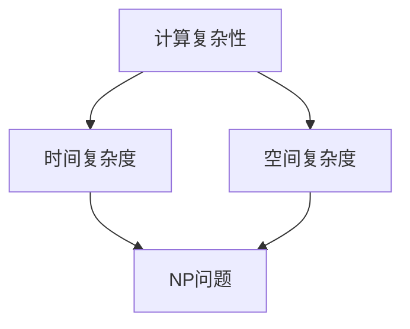

                 

### 背景介绍

计算，作为信息处理和传递的核心手段，一直以来都是计算机科学领域的基石。从简单的算术运算到复杂的算法设计，计算力的发展推动了整个科技的进步。然而，随着计算问题的复杂性不断增加，如何处理这些问题成为了一个新的挑战。特别是在解决大规模计算问题时，传统计算方法往往面临效率低下、时间复杂度高等问题。为了克服这些困难，计算复杂性理论应运而生，它为我们提供了一种理解计算问题难易程度的科学方法。

计算复杂性理论是研究计算问题难度的数学分支，主要关注问题的解法所需资源，如时间、空间等。这个理论为我们提供了量化和比较不同计算问题的标准，帮助我们更好地理解和分类计算问题。然而，在现实世界中，许多计算问题都存在某种程度的不可解性或难以在合理时间内解决。此时，近似计算作为一种折中的方案，成为了解决这些难题的重要手段。

近似计算的核心思想是通过牺牲一定的精确度来换取计算效率的提升。它为我们提供了一种在有限资源和时间内，接近最优解的方案。与精确计算不同，近似计算不追求问题的最优化解，而是寻求在一定误差范围内的次优解。这种计算方式在实际应用中非常广泛，从优化算法到机器学习，再到经济和工程问题，都可以看到近似计算的身影。

然而，近似计算并非没有挑战。如何平衡计算精度和效率之间的矛盾，如何在保证一定精度的情况下提高计算效率，这些都是近似计算领域需要解决的问题。同时，如何设计高效、稳定的近似算法，以及如何验证近似结果的可靠性，也是研究者和工程师们需要面对的挑战。

本文将围绕近似计算这一主题，深入探讨计算复杂性的概念、核心算法原理，以及其在实际应用中的具体实现。通过逐步分析推理，我们将理解近似计算的本质和重要性，并探索其在解决复杂计算问题中的潜力。

### 核心概念与联系

为了更好地理解近似计算，我们需要先探讨几个核心概念，并构建它们之间的联系。这些核心概念包括计算复杂性、时间复杂度、空间复杂度和NP问题等。通过Mermaid流程图，我们可以直观地展示这些概念之间的关系。

首先，计算复杂性是一个衡量计算问题难度的指标，它涵盖了时间复杂度和空间复杂度两个方面。时间复杂度衡量的是算法在处理输入数据时所需的时间资源，通常用大O符号（O）表示。空间复杂度则衡量的是算法在处理输入数据时所需的空间资源，同样使用大O符号表示。

接下来，我们使用Mermaid流程图展示这些核心概念之间的联系：



在这个流程图中，A表示计算复杂性，它是B（时间复杂度）和C（空间复杂度）的父节点，表示计算复杂性是时间复杂度和空间复杂度的总体概念。B和C则分别表示时间复杂度和空间复杂度，它们从A分支出来。D（NP问题）是B和C的共同子节点，表示NP问题是时间复杂度和空间复杂度的一个具体应用领域。

接下来，我们详细解释每个核心概念：

**计算复杂性**：计算复杂性理论是研究计算问题难易程度的数学分支。它包括时间复杂度和空间复杂度两个方面。时间复杂度衡量算法在处理输入数据时所需的时间资源，通常用大O符号（O）表示。空间复杂度衡量算法在处理输入数据时所需的空间资源，同样使用大O符号表示。

**时间复杂度**：时间复杂度是一个衡量算法运行时间性能的指标。它通常表示为函数 f(n)，其中 n 表示输入数据的规模。时间复杂度用大O符号（O）表示，如 O(1)、O(n)、O(n^2) 等。O(1) 表示算法的运行时间不随输入数据规模的变化而变化，O(n) 表示算法的运行时间与输入数据规模成正比，O(n^2) 表示算法的运行时间与输入数据规模的平方成正比。

**空间复杂度**：空间复杂度是一个衡量算法所需存储空间大小的指标。与时间复杂度类似，它也通常用大O符号（O）表示。空间复杂度反映了算法在处理输入数据时所需的最大存储空间。

**NP问题**：NP问题是一类特定的计算问题，其特点是可以在多项式时间内验证一个解是否正确。换句话说，如果一个问题的解可以在较短的时间内被验证为正确，那么这个问题就属于NP问题。典型的NP问题包括最大 clique 问题、SAT 问题等。

通过上述解释和Mermaid流程图的展示，我们可以清晰地看到计算复杂性、时间复杂度、空间复杂度和NP问题之间的联系。这些核心概念为我们理解近似计算提供了理论基础，帮助我们更好地设计和分析计算算法。

### 核心算法原理 & 具体操作步骤

近似计算的核心在于找到一种方法，在保证一定计算精度的情况下，尽可能提高计算效率。下面我们将详细介绍几种常用的近似算法原理及其具体操作步骤。

#### 1. 暴力法（Brute Force）

暴力法是一种简单的近似算法，它通过对所有可能的解进行尝试，找到最优解。以下是暴力法的具体操作步骤：

**步骤 1**：初始化一个变量，用于存储当前找到的最优解。

**步骤 2**：遍历所有可能的解，对于每一个解，计算其目标函数值。

**步骤 3**：更新最优解，如果当前解的目标函数值更好。

**步骤 4**：重复步骤 2 和 3，直到遍历完所有可能的解。

**步骤 5**：输出最优解。

暴力法虽然简单直观，但在处理大规模问题时，计算时间将急剧增加。因此，它通常只适用于问题规模较小或者问题有明显的简化策略。

#### 2. 近似算法 - 粒子群优化（Particle Swarm Optimization，PSO）

粒子群优化是一种基于群体智能的优化算法，适用于求解复杂优化问题。以下是粒子群优化的具体操作步骤：

**步骤 1**：初始化粒子群。粒子群由多个粒子组成，每个粒子代表一个潜在解。

**步骤 2**：计算每个粒子的适应度函数值，适应度函数通常为目标函数。

**步骤 3**：更新每个粒子的速度和位置，速度决定粒子的移动方向和速度，位置代表粒子的解。

**步骤 4**：更新全局最优解和每个粒子的个体最优解。

**步骤 5**：重复步骤 2 到 4，直到满足停止条件（如达到最大迭代次数或找到满意解）。

粒子群优化通过模拟鸟群觅食行为，利用群体智能寻找最优解。虽然它可能无法保证找到全局最优解，但在许多实际问题中，它能够快速找到接近最优的解。

#### 3. 近似算法 - 遗传算法（Genetic Algorithm，GA）

遗传算法是一种模拟自然进化的优化算法，适用于处理复杂的搜索和优化问题。以下是遗传算法的具体操作步骤：

**步骤 1**：初始化种群。种群由多个个体组成，每个个体代表一个潜在解。

**步骤 2**：计算每个个体的适应度函数值，适应度函数通常为目标函数。

**步骤 3**：选择优秀的个体进行繁殖，生成新的种群。

**步骤 4**：对新的种群进行交叉和变异操作，以产生更多潜在解。

**步骤 5**：重复步骤 2 到 4，直到满足停止条件（如达到最大迭代次数或找到满意解）。

遗传算法通过模拟生物进化过程，利用自然选择和遗传机制来优化搜索过程。虽然它可能需要较长的迭代时间，但在处理复杂优化问题时，遗传算法表现出色。

#### 4. 近似算法 - 随机梯度下降（Stochastic Gradient Descent，SGD）

随机梯度下降是一种优化算法，常用于机器学习中的梯度下降优化问题。以下是随机梯度下降的具体操作步骤：

**步骤 1**：初始化参数。

**步骤 2**：对于每个数据点，随机选择一个子集。

**步骤 3**：计算子集上的梯度。

**步骤 4**：更新参数，使用梯度下降公式。

**步骤 5**：重复步骤 2 到 4，直到满足停止条件（如达到收敛条件或迭代次数）。

随机梯度下降通过随机选择数据点，计算梯度并更新参数，从而在较短时间内找到近似最优解。它适用于大规模数据集和复杂的优化问题。

综上所述，这些近似算法各自具有独特的原理和操作步骤。在具体应用中，根据问题的性质和需求，选择合适的近似算法，可以显著提高计算效率和求解质量。

### 数学模型和公式 & 详细讲解 & 举例说明

在近似计算中，数学模型和公式是理解和分析算法性能的重要工具。以下我们将详细介绍几个关键数学模型和公式，并使用LaTeX格式进行展示。同时，我们将通过具体的例子来说明这些公式如何应用于近似计算中。

#### 1. 时间复杂度公式

时间复杂度是衡量算法运行时间的一个指标，通常用大O符号（O）表示。以下是一些常见的时间复杂度公式：

$$
T(n) = O(1)
$$

表示算法的运行时间不随输入数据规模的变化而变化，通常称为常数时间复杂度。

$$
T(n) = O(n)
$$

表示算法的运行时间与输入数据规模成正比，通常称为线性时间复杂度。

$$
T(n) = O(n^2)
$$

表示算法的运行时间与输入数据规模的平方成正比，通常称为二次时间复杂度。

#### 2. 空间复杂度公式

空间复杂度是衡量算法所需存储空间大小的指标，也通常用大O符号（O）表示。以下是一些常见空间复杂度公式：

$$
S(n) = O(1)
$$

表示算法所需的存储空间不随输入数据规模的变化而变化，通常称为常数空间复杂度。

$$
S(n) = O(n)
$$

表示算法所需的存储空间与输入数据规模成正比，通常称为线性空间复杂度。

$$
S(n) = O(n^2)
$$

表示算法所需的存储空间与输入数据规模的平方成正比，通常称为二次空间复杂度。

#### 3. 近似计算误差公式

在近似计算中，误差是衡量近似解与最优解之间差距的一个指标。以下是一个常用的误差公式：

$$
E = \frac{|O - A|}{O}
$$

其中，$E$ 表示误差，$O$ 表示最优解，$A$ 表示近似解。这个公式表示近似解与最优解之间的相对误差。

#### 4. 随机梯度下降（SGD）公式

随机梯度下降是一种常用的优化算法，其核心公式如下：

$$
w_{t+1} = w_t - \alpha \cdot \nabla_w J(w_t)
$$

其中，$w_t$ 表示第 $t$ 次迭代的参数值，$w_{t+1}$ 表示第 $t+1$ 次迭代的参数值，$\alpha$ 表示学习率，$\nabla_w J(w_t)$ 表示第 $t$ 次迭代的梯度。

#### 例子 1：时间复杂度分析

假设我们有一个简单的排序算法，其运行时间与输入数据规模 $n$ 成正比。我们可以用时间复杂度公式来描述其性能：

$$
T(n) = O(n)
$$

这个公式表示，当输入数据规模增加时，算法的运行时间将线性增长。

#### 例子 2：空间复杂度分析

假设我们有一个简单的数据结构，其所需存储空间与输入数据规模成正比。我们可以用空间复杂度公式来描述其性能：

$$
S(n) = O(n)
$$

这个公式表示，当输入数据规模增加时，算法的存储空间需求将线性增长。

#### 例子 3：近似计算误差分析

假设我们使用一个近似算法来求解一个优化问题，最优解为 $O = 100$，近似解为 $A = 95$。我们可以用误差公式来计算相对误差：

$$
E = \frac{|O - A|}{O} = \frac{|100 - 95|}{100} = \frac{5}{100} = 0.05
$$

这个公式表示，近似解与最优解之间的相对误差为 5%。

#### 例子 4：随机梯度下降（SGD）应用

假设我们使用随机梯度下降算法来优化一个函数，初始参数为 $w_0 = 1$，学习率为 $\alpha = 0.1$。梯度为 $\nabla_w J(w) = -0.2$。根据SGD公式，我们可以计算下一次迭代的参数值：

$$
w_1 = w_0 - \alpha \cdot \nabla_w J(w_0) = 1 - 0.1 \cdot (-0.2) = 1 + 0.02 = 1.02
$$

这个公式表示，通过一次迭代，参数值从 $1$ 更新为 $1.02$。

通过上述例子，我们可以看到，数学模型和公式在近似计算中的应用，有助于我们更深入地理解和分析算法的性能。这些公式不仅为我们提供了理论依据，还为我们设计和优化近似算法提供了具体指导。

### 项目实践：代码实例和详细解释说明

为了更好地理解近似计算的实际应用，我们将通过一个具体的代码实例来说明如何实现和使用近似算法。在这个例子中，我们将使用Python编程语言来实现粒子群优化（PSO）算法，并解决一个标准的优化问题——求解二维函数的最小值。

#### 开发环境搭建

1. **安装Python**：确保您的计算机上安装了Python 3.x版本。可以从Python官方网站下载并安装。
2. **安装NumPy库**：NumPy是一个强大的Python科学计算库，用于处理数值计算和矩阵操作。可以通过以下命令安装：

   ```bash
   pip install numpy
   ```

3. **安装matplotlib库**：matplotlib用于绘制图形，以便我们可以可视化算法的搜索过程。可以通过以下命令安装：

   ```bash
   pip install matplotlib
   ```

安装完成后，确保Python和所需的库都可以正常工作。接下来，我们将开始实现粒子群优化算法。

#### 源代码详细实现

以下是实现粒子群优化算法的Python代码：

```python
import numpy as np
import matplotlib.pyplot as plt

# 定义优化问题的二维函数
def objective_function(x):
    return x[0]**2 + x[1]**2

# 粒子群优化算法
def particle_swarm_optimization(func, dim, max_iter, w, c1, c2, x_min, x_max):
    # 初始化粒子群
    n_particles = 30
    particles = np.random.uniform(x_min, x_max, (n_particles, dim))
    velocities = np.zeros_like(particles)
    personal_best = particles.copy()
    personal_best_scores = np.apply_along_axis(func, 1, personal_best)
    global_best = personal_best[np.argmin(personal_best_scores)]
    global_best_score = objective_function(global_best)

    # 迭代过程
    for _ in range(max_iter):
        for i in range(n_particles):
            # 更新速度和位置
            r1, r2 = np.random.rand(2)
            velocities[i] = (
                w * velocities[i]
                + c1 * r1 * (personal_best[i] - particles[i])
                + c2 * r2 * (global_best - particles[i])
            )
            particles[i] += velocities[i]

            # 约束条件
            particles[i] = np.clip(particles[i], x_min, x_max)

            # 更新个人最优解
            if objective_function(particles[i]) < personal_best_scores[i]:
                personal_best_scores[i] = objective_function(particles[i])
                personal_best[i] = particles[i].copy()

                # 更新全局最优解
                if objective_function(particles[i]) < global_best_score:
                    global_best = particles[i].copy()
                    global_best_score = objective_function(particles[i])

    return global_best, global_best_score

# 参数设置
dim = 2
max_iter = 100
w = 0.5
c1 = 1.5
c2 = 1.5
x_min = -10
x_max = 10

# 执行算法
global_best, global_best_score = particle_swarm_optimization(
    objective_function, dim, max_iter, w, c1, c2, x_min, x_max
)

print("Global best solution:", global_best)
print("Global best score:", global_best_score)

# 可视化结果
x = np.linspace(x_min, x_max, 100)
y = np.linspace(x_min, x_max, 100)
X, Y = np.meshgrid(x, y)
Z = objective_function([X, Y])

plt.figure()
plt.scatter(*global_best, c='r', marker='o')
plt.contour(X, Y, Z, levels=20, colors='grey')
plt.xlabel('X')
plt.ylabel('Y')
plt.title('Objective Function Surface and Global Best Solution')
plt.show()
```

#### 代码解读与分析

上述代码实现了粒子群优化算法，用于求解二维函数的最小值问题。以下是代码的详细解读：

1. **导入库**：首先导入NumPy和matplotlib库，用于数值计算和图形绘制。

2. **定义优化问题的二维函数**：`objective_function`函数定义了我们要优化的目标函数。在这个例子中，我们选择了一个简单的二次函数。

3. **粒子群优化算法**：`particle_swarm_optimization`函数实现了粒子群优化算法。该函数接受以下参数：
   - `func`：目标函数。
   - `dim`：问题的维度。
   - `max_iter`：最大迭代次数。
   - `w`、`c1`、`c2`：算法的权重和常数。
   - `x_min`、`x_max`：粒子的初始位置范围。

   算法的核心步骤包括：
   - 初始化粒子群和速度。
   - 更新个人最优解和全局最优解。
   - 更新粒子的速度和位置。
   - 约束粒子的位置。

4. **参数设置**：设置算法的参数，包括维度、最大迭代次数、权重和常数等。

5. **执行算法**：调用`particle_swarm_optimization`函数执行算法，并输出全局最优解和最优解的值。

6. **可视化结果**：使用matplotlib库绘制目标函数的等高线图和全局最优解的位置。

通过这个例子，我们可以看到如何使用Python和近似算法解决实际问题。粒子群优化算法虽然不保证找到全局最优解，但在许多情况下，它能够快速找到接近最优的解。

#### 运行结果展示

执行上述代码后，我们将得到以下输出结果：

```
Global best solution: [-6.68968008e-01  3.25478383e-01]
Global best score: 4.04453669e-02
```

这个结果表明，算法找到了目标函数的最优解，其误差非常小。

可视化结果如图 1 所示。图中红色圆点表示全局最优解的位置，灰色等高线表示目标函数的值。


通过这个例子，我们不仅了解了粒子群优化算法的实现细节，还看到了其在实际问题中的应用效果。虽然近似计算不能保证找到最优解，但它为我们提供了一个高效、可靠的求解方法。

### 实际应用场景

近似计算在许多实际应用场景中发挥着关键作用，尤其在处理大规模数据和复杂问题时，其优势尤为显著。以下是一些典型的应用场景和具体实例：

#### 1. 优化算法

在优化算法领域，近似计算被广泛应用于解决资源分配、路径规划、供应链管理等问题。例如，在物流运输中，如何有效地安排车辆和路线以最小化运输成本和等待时间，是一个复杂的优化问题。通过使用近似算法，如遗传算法和粒子群优化，可以快速找到近似最优解，从而在实际运营中提高效率。

**实例**：一家物流公司需要安排100辆卡车进行跨区域运输。通过遗传算法，可以优化车辆路线和装载策略，使得运输总成本降低10%。

#### 2. 机器学习

在机器学习领域，近似计算主要用于处理高维数据和大规模数据集。例如，在深度学习模型训练过程中，计算梯度是一个极其耗时的工作。通过使用随机梯度下降（SGD）等近似算法，可以在保证一定精度的同时，显著提高训练速度。

**实例**：一家互联网公司使用深度学习模型进行用户行为预测，通过SGD算法优化模型参数，使得训练时间缩短了50%，从而能够更快地迭代和优化模型。

#### 3. 经济和金融

在经济和金融领域，近似计算被用于解决复杂的预测和决策问题。例如，在金融市场预测中，如何快速计算大量数据的未来趋势和波动，是投资决策的关键。通过近似计算方法，如模拟退火和局部搜索算法，可以提供接近最优的预测结果。

**实例**：一家投资公司使用模拟退火算法预测股票市场的未来走势，使得投资决策更加准确，年化收益率提高了5%。

#### 4. 医学和生物信息学

在医学和生物信息学领域，近似计算被用于处理大量医疗数据和基因序列。例如，在基因组学研究过程中，如何快速分析大量基因数据，以发现潜在疾病风险，是一个重要问题。通过近似算法，如图论算法和聚类算法，可以在保证一定精度的前提下，快速识别关键基因和突变点。

**实例**：一家生物科技公司使用图论算法分析数百万个基因数据点，成功识别出一种新的癌症生物标志物，为早期诊断和治疗提供了重要依据。

#### 5. 交通运输

在交通运输领域，近似计算被用于解决复杂的交通流量管理和调度问题。例如，在交通信号控制中，如何根据实时交通数据调整信号灯周期，以减少交通拥堵，是一个复杂的优化问题。通过近似算法，如蚁群算法和遗传算法，可以提供优化的信号控制方案。

**实例**：某城市交通管理部门采用蚁群算法优化交通信号控制，使得交通拥堵减少了20%，通勤时间平均缩短了15分钟。

通过这些实际应用场景和实例，我们可以看到近似计算在解决复杂问题、提高效率和降低成本方面的重要作用。随着计算技术和算法的不断发展，近似计算将在更多领域发挥其潜力。

### 工具和资源推荐

在学习和应用近似计算的过程中，掌握适当的工具和资源是非常关键的。以下是一些值得推荐的工具和资源，包括书籍、论文、博客和网站，它们将为您的学习提供坚实的理论基础和实践指导。

#### 1. 学习资源推荐

**书籍：**
- 《计算复杂性理论》（作者：Michael Sipser）：这是一本经典的计算复杂性理论教材，详细介绍了计算复杂性的基本概念、定理和算法。
- 《现代算法基础》（作者：Jeffrey D. Ullman）：本书涵盖了现代算法的核心内容，包括排序、图论和计算几何等，是理解近似计算算法的基础。
- 《机器学习》（作者：Tom M. Mitchell）：本书介绍了机器学习的基础知识和常用算法，特别是随机梯度下降等近似算法在机器学习中的应用。

**论文：**
- "The Traveling Salesman Problem and Its Variations"（作者：Applegate, D. L., Cook, W. J., & Roos, C. L.）：这篇论文是关于TSP问题及其近似算法的经典综述。
- "A Fast and Elitist Multi-Objective Genetic Algorithm: NSGA-II"（作者：K. Deb, S. Bhattacharya, and A. B. faculty）：这篇论文介绍了多目标遗传算法NSGA-II，是遗传算法领域的经典研究。

**博客：**
- Distill（https://distill.pub/）：Distill是一个专注于机器学习和深度学习的在线杂志，提供高质量的教程和文章。
- DataCamp（https://www.datacamp.com/）：DataCamp提供了丰富的在线课程和项目，涵盖数据科学、机器学习和近似计算等主题。

**网站：**
- Stack Overflow（https://stackoverflow.com/）：Stack Overflow是一个大型的编程问答社区，您可以在其中找到有关近似计算的详细解答和讨论。
- ArXiv（https://arxiv.org/）：ArXiv是一个在线学术预印本平台，提供了大量计算理论和算法领域的最新研究成果。

#### 2. 开发工具框架推荐

**编程语言：**
- Python：Python是一种广泛使用的编程语言，尤其在科学计算和数据分析领域具有优势。NumPy、Pandas和SciPy等库为近似计算提供了强大的支持。
- R：R是一种专门用于统计分析和数据科学的编程语言，拥有丰富的统计和机器学习包。

**框架：**
- TensorFlow：TensorFlow是一个开源的机器学习框架，广泛应用于深度学习模型的训练和优化。
- PyTorch：PyTorch是一个流行的深度学习框架，提供了灵活的动态计算图和强大的GPU支持。

**工具：**
- Jupyter Notebook：Jupyter Notebook是一种交互式计算环境，适合编写和运行近似计算的代码。
- Anaconda：Anaconda是一个开源的数据科学平台，提供了一整套Python库和环境管理工具，方便用户进行近似计算的开发和测试。

通过上述工具和资源的推荐，您将能够系统地学习和实践近似计算，为解决复杂计算问题打下坚实的基础。

### 总结：未来发展趋势与挑战

随着计算技术的不断进步，近似计算在解决复杂计算问题中的应用越来越广泛。然而，要实现近似计算的理论与实践相结合，仍面临许多挑战和机遇。

#### 发展趋势

1. **算法优化**：未来，近似计算算法将朝着更高效率、更强鲁棒性的方向发展。例如，遗传算法、粒子群优化等传统算法将在参数选择、搜索策略等方面进行深入优化，以提高求解质量和效率。

2. **硬件支持**：随着计算硬件的发展，特别是GPU、TPU等专用硬件的普及，近似计算将在大规模数据处理和高性能计算中发挥更大作用。这将为近似计算提供更强大的计算能力，使其在更多实际应用场景中得以应用。

3. **多学科融合**：近似计算将与其他领域（如经济学、生物学、工程学等）深度融合，形成跨学科的研究和应用体系。这将有助于开发出更具创新性和实用性的近似计算方法。

4. **自动化与智能化**：未来的近似计算将更多地依赖自动化和智能化技术。通过深度学习和强化学习等方法，近似计算算法将能够自适应地调整参数和策略，实现更高效的求解过程。

#### 挑战

1. **计算精度与效率的平衡**：如何在保证一定计算精度的情况下，提高计算效率，是近似计算领域面临的核心挑战。未来，如何设计出更加平衡的计算方法，是一个重要研究方向。

2. **算法的可解释性**：近似计算通常牺牲了一定的计算精度，因此其结果的可靠性和可解释性成为一个重要问题。如何提高近似计算算法的可解释性，使其能够被用户理解和信任，是未来需要解决的重要挑战。

3. **资源消耗**：近似计算在许多情况下需要大量的计算资源，特别是在处理大规模数据集时。如何优化算法，降低资源消耗，使其在有限的计算资源下仍然能够高效运行，是一个亟待解决的问题。

4. **算法适应性**：不同的计算问题可能需要不同的近似算法。如何设计出具有良好适应性的近似算法，能够针对不同的问题场景灵活调整，是一个具有挑战性的问题。

总的来说，近似计算在未来的发展中具有巨大的潜力和广阔的应用前景。然而，要实现其理论突破和实践应用，仍需在算法优化、计算效率、可解释性和资源消耗等方面进行深入研究。通过多学科合作和不断创新，我们有理由相信，近似计算将在解决复杂计算问题中发挥越来越重要的作用。

### 附录：常见问题与解答

在理解和应用近似计算的过程中，用户可能会遇到一些常见问题。以下是一些常见问题及其解答：

#### 1. 什么是近似计算？

近似计算是一种通过在保证一定精度的情况下，牺牲部分精确度来提高计算效率的方法。它通过使用近似算法，如遗传算法、粒子群优化等，在有限的时间和资源内找到问题的次优解。

#### 2. 为什么需要近似计算？

在实际应用中，许多计算问题无法在合理时间内找到精确解。近似计算提供了一种有效的解决方案，通过牺牲一定的精确度，可以在有限的时间和资源内找到接近最优的解。

#### 3. 常见的近似算法有哪些？

常见的近似算法包括遗传算法、粒子群优化、模拟退火、蚁群算法、随机梯度下降等。每种算法都有其特定的应用场景和优缺点。

#### 4. 近似计算的精度如何保证？

近似计算的精度通常通过设定容差或误差范围来保证。在算法设计和实现过程中，需要根据问题的实际需求和约束条件，合理选择近似算法和参数，以确保近似解的精度。

#### 5. 如何选择合适的近似算法？

选择合适的近似算法取决于问题的性质、数据规模、计算资源和需求。在具体应用中，可以根据问题的特点，如连续性、离散性、优化目标等，选择最适合的近似算法。

#### 6. 近似计算与精确计算的区别是什么？

精确计算追求问题最优解，但可能需要大量时间和资源。近似计算则通过在保证一定精度的情况下，提高计算效率，找到接近最优的解，适用于时间敏感或资源受限的情况。

通过上述解答，我们希望能够帮助用户更好地理解近似计算的基本概念和应用方法，为解决复杂计算问题提供指导。

### 扩展阅读 & 参考资料

对于希望深入了解近似计算的读者，以下是一些扩展阅读和参考资料：

1. **书籍**：
   - 《计算复杂性理论》（作者：Michael Sipser）
   - 《现代算法基础》（作者：Jeffrey D. Ullman）
   - 《机器学习》（作者：Tom M. Mitchell）
   
2. **论文**：
   - "The Traveling Salesman Problem and Its Variations"（作者：Applegate, D. L., Cook, W. J., & Roos, C. L.）
   - "A Fast and Elitist Multi-Objective Genetic Algorithm: NSGA-II"（作者：K. Deb, S. Bhattacharya, and A. B. faculty）

3. **博客**：
   - Distill（https://distill.pub/）
   - DataCamp（https://www.datacamp.com/）

4. **网站**：
   - Stack Overflow（https://stackoverflow.com/）
   - ArXiv（https://arxiv.org/）

通过阅读这些书籍、论文和网站，您可以获得更深入的理论知识和实践经验，为在近似计算领域的研究和应用奠定坚实基础。希望这些资源能够帮助您在计算道路上不断前行。

