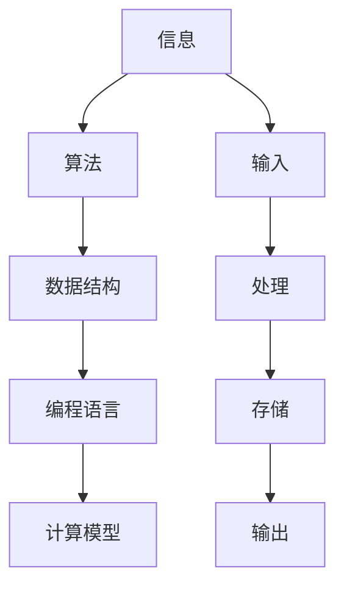
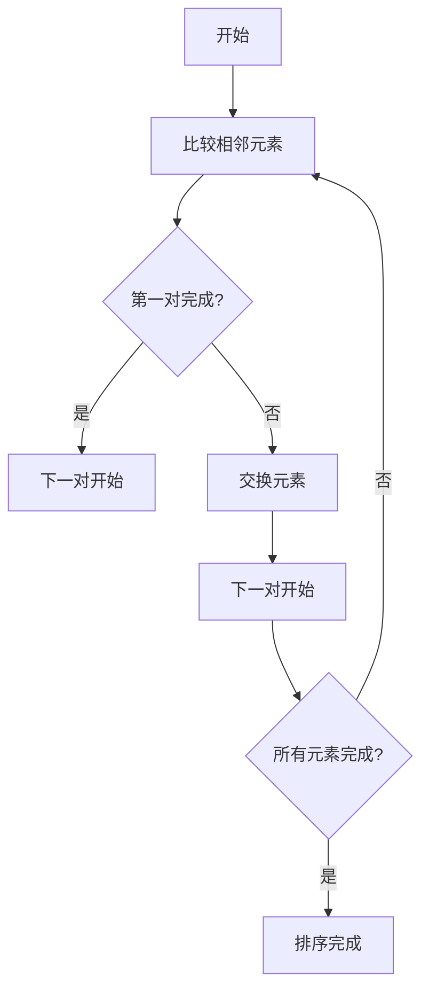
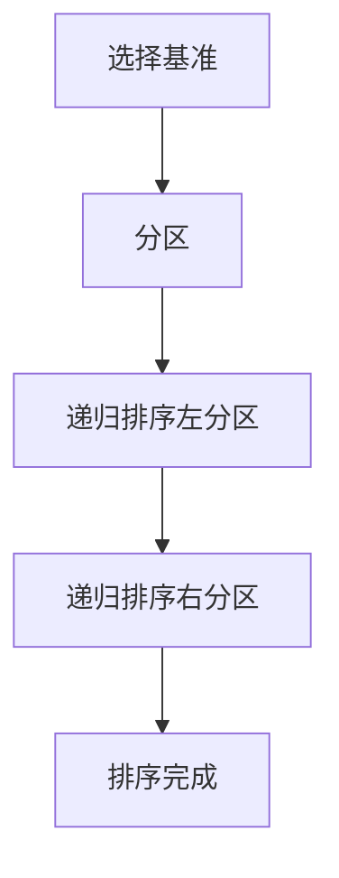
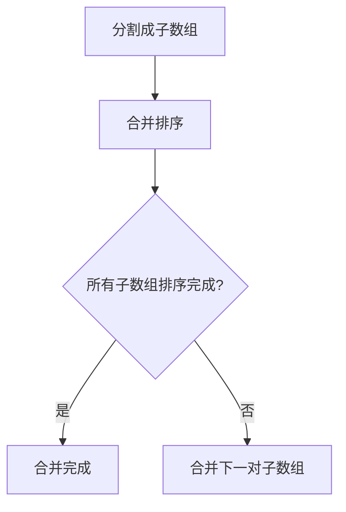
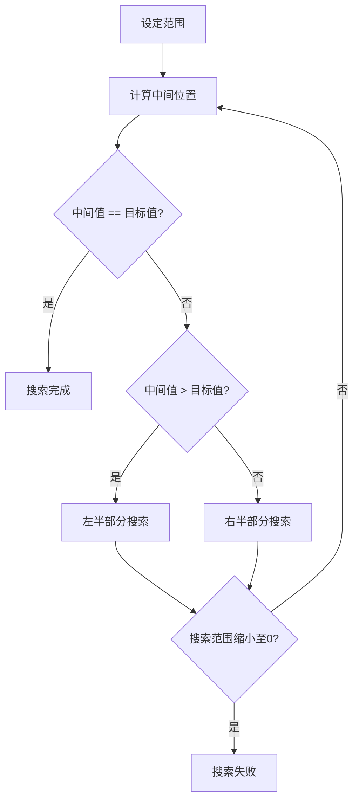
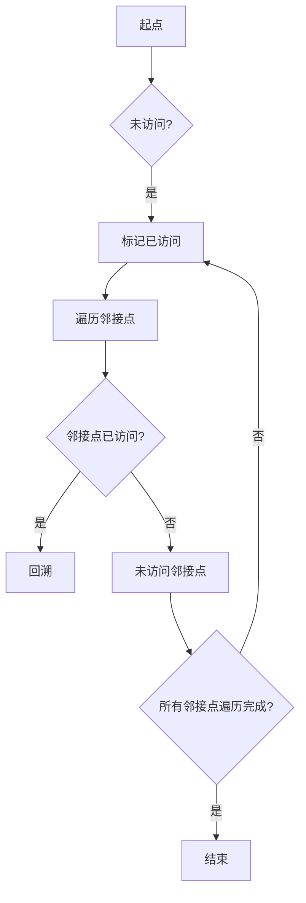
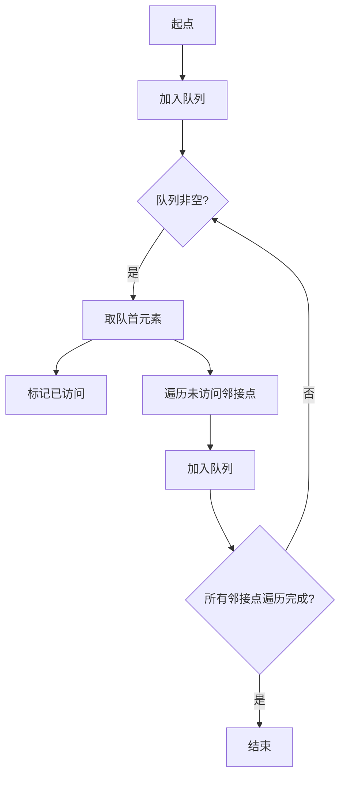
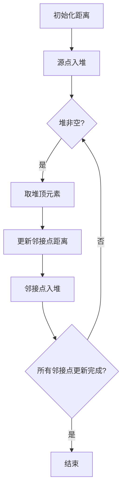
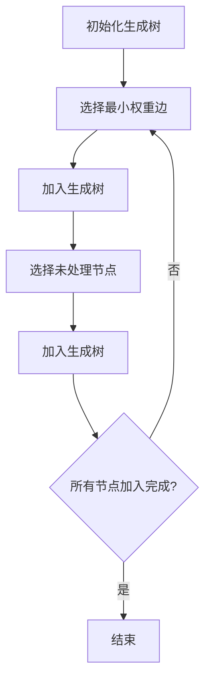

                 

### 1. 背景介绍

计算，作为现代科技的核心驱动力，承载着人类社会进步的无数奇迹。从最初的概念萌发，到后来的逐步演进，计算的发展史如同一部绚丽多彩的画卷，绘制出科技进步的宏大篇章。

在20世纪初期，计算的概念主要限于机械装置和电子计算机的诞生。当时的计算模型主要集中在计算速度和存储容量的提升上。随着第二次世界大战后，计算机科学逐渐成为一门独立的学科，计算模型也开始从机械和电子转向更加抽象的数学模型。

20世纪60年代，图灵机的理论奠定了计算的基础，而之后的算法理论则进一步推动了计算的科学化进程。算法的发明和改进，如分治法、动态规划、贪心算法等，不仅提高了计算效率，还揭示了计算问题的本质。

进入21世纪，随着互联网的普及和大数据时代的到来，计算应用领域不断拓展。深度学习、云计算、区块链等新兴技术的出现，使得计算能力得到了前所未有的提升，也引发了诸多颠覆性变革。

本篇文章将以计算为核心的科研范式进化史为线索，探讨计算领域的发展脉络。文章将依次介绍计算的基本概念、核心算法、数学模型以及实际应用，旨在为读者提供一幅全面、系统的计算进化图景。

本文结构如下：

1. **背景介绍**：回顾计算的发展历程，介绍计算的基本概念。
2. **核心概念与联系**：通过Mermaid流程图，展示计算领域的重要概念和架构。
3. **核心算法原理 & 具体操作步骤**：详细解释计算领域的关键算法和步骤。
4. **数学模型和公式 & 详细讲解 & 举例说明**：介绍计算领域常用的数学模型和公式，并结合实例进行详细讲解。
5. **项目实践：代码实例和详细解释说明**：提供实际代码实例，解析其详细实现和代码解读。
6. **实际应用场景**：探讨计算在各个领域的应用。
7. **工具和资源推荐**：推荐学习资源和开发工具。
8. **总结：未来发展趋势与挑战**：总结计算领域的发展趋势，探讨未来可能面临的挑战。
9. **附录：常见问题与解答**：回答读者可能关心的问题。
10. **扩展阅读 & 参考资料**：提供进一步学习的资源链接。

在接下来的章节中，我们将逐步分析推理，深入探讨计算领域的各个层面，希望能够为您带来深刻的启发和见解。

### 2. 核心概念与联系

计算作为现代科技的核心，其发展离不开一系列核心概念和理论的支撑。为了更清晰地理解计算领域的架构，我们将使用Mermaid流程图来展示这些核心概念及其相互联系。

首先，我们需要了解计算领域的基本构成。计算可以定义为对信息进行处理和转换的过程。这个过程涉及到数据的输入、处理、存储和输出。以下是计算领域的一些关键概念：

- **信息**：信息是计算处理的基本对象，它可以是数据、符号、信号等。
- **算法**：算法是解决问题的步骤集合，它指导计算机如何处理信息。
- **数据结构**：数据结构是存储和组织数据的方式，它影响算法的效率和性能。
- **编程语言**：编程语言是编写算法和程序的工具，不同的编程语言适用于不同的计算任务。
- **计算模型**：计算模型是描述计算过程的理论框架，如图灵机、量子计算模型等。

下面是计算领域核心概念的Mermaid流程图：



**图 1：计算领域核心概念及其相互联系**

**2.1. 算法**

算法是计算的核心，它由一系列步骤组成，用于解决特定问题。算法可以分为多种类型，包括排序算法、搜索算法、图算法等。以下是一些常见的算法分类：

- **排序算法**：如冒泡排序、快速排序、归并排序等。
- **搜索算法**：如二分搜索、深度优先搜索、广度优先搜索等。
- **图算法**：如最小生成树、最短路径算法、拓扑排序等。

**2.2. 数据结构**

数据结构是存储和组织数据的方式，它直接影响算法的效率。常见的数据结构包括数组、链表、栈、队列、树、图等。每种数据结构都有其独特的特点和适用场景。

- **数组**：一种线性数据结构，支持随机访问，适合处理固定大小和连续数据。
- **链表**：一种线性数据结构，由节点组成，每个节点包含数据和一个指向下一个节点的指针。
- **栈**：一种后进先出（LIFO）的数据结构，适用于回溯和递归操作。
- **队列**：一种先进先出（FIFO）的数据结构，适用于任务调度和缓冲处理。

**2.3. 编程语言**

编程语言是编写算法和程序的工具，不同的编程语言有不同的特点和优势。以下是一些常见的编程语言：

- **高级编程语言**：如Python、Java、C++等，适用于复杂应用和系统开发。
- **脚本语言**：如Python、JavaScript、Ruby等，适用于快速开发和自动化任务。
- **编译型语言**：如C、C++等，适用于性能要求高的应用。

**2.4. 计算模型**

计算模型是描述计算过程的理论框架，不同的计算模型适用于不同的计算任务。以下是几种常见的计算模型：

- **图灵机**：图灵机是计算理论的基础，它是一种抽象的计算模型，能够模拟任何计算过程。
- **量子计算模型**：量子计算模型利用量子位（qubit）的特性，实现超快速的计算。
- **并行计算模型**：并行计算模型通过多个处理器同时工作，提高计算效率。

通过上述核心概念的介绍和Mermaid流程图的展示，我们可以更清晰地理解计算领域的架构和联系。在接下来的章节中，我们将深入探讨这些核心概念的具体实现和应用。

### 3. 核心算法原理 & 具体操作步骤

在计算领域，核心算法是解决各种计算问题的基石。本章节将详细阐述几种重要的核心算法原理及其具体操作步骤，包括常见的排序算法、搜索算法和图算法。

#### 3.1. 排序算法

排序算法是计算中最基本的算法之一，它用于将一组数据按照特定的顺序排列。以下介绍几种常见的排序算法及其步骤：

**3.1.1. 冒泡排序（Bubble Sort）**

冒泡排序是一种简单的排序算法，它重复遍历要排序的数列，一次比较两个元素，如果它们的顺序错误就把它们交换过来。遍历数列的工作是重复进行，直到没有再需要交换，也就是说该数列已经排序完成。

具体操作步骤如下：

1. 从第一个元素开始，比较相邻的两个元素，如果第一个比第二个大（升序排序），就交换它们。
2. 对每一对相邻元素做同样的工作，从开始第一对到结尾的最后一对。这步做完后，最后的元素会是最大的数。
3. 针对所有的元素重复以上的步骤，除了最后一个。
4. 重复步骤1~3，直到排序完成。



**3.1.2. 快速排序（Quick Sort）**

快速排序是一种高效的排序算法，它采用了分治的思想，通过递归将原始数据分割成较小的子问题。快速排序的不稳定性在于相同元素的相对位置可能会改变。

具体操作步骤如下：

1. 选择一个基准元素，通常选择第一个或最后一个元素。
2. 将比基准元素小的元素移到基准的左边，比它大的移到右边，这个过程称为分区（Partition）。
3. 递归地用同样的方法对左右分区进行排序。



**3.1.3. 归并排序（Merge Sort）**

归并排序是一种稳定的排序算法，它采用了分治法的一个变种。归并排序将数组分成较小的子数组，然后递归地对这些子数组进行排序，最后将排好序的子数组合并起来。

具体操作步骤如下：

1. 将数组不断分割成大小为1的子数组。
2. 对每一对相邻的子数组进行合并排序，生成大小为2的有序子数组。
3. 重复上述步骤，直到整个数组排序完成。



#### 3.2. 搜索算法

搜索算法用于在数据结构中查找特定的元素。以下介绍几种常见的搜索算法及其步骤：

**3.2.1. 二分搜索（Binary Search）**

二分搜索是一种高效的搜索算法，它适用于有序数组。二分搜索的基本思想是不断将搜索范围缩小一半。

具体操作步骤如下：

1. 设定搜索范围的上下界，初始值为整个数组的起始和结束位置。
2. 计算中间位置，并比较中间值与目标值。
3. 如果中间值等于目标值，搜索完成。
4. 如果中间值大于目标值，则在左半部分重复步骤2。
5. 如果中间值小于目标值，则在右半部分重复步骤2。
6. 重复步骤2~5，直到找到目标值或搜索范围缩小为0。



**3.2.2. 深度优先搜索（DFS）**

深度优先搜索是一种通过深度遍历图的数据结构搜索算法。

具体操作步骤如下：

1. 选择一个起点，并将其标记为已访问。
2. 遍历起点的所有未访问的邻接点，并对每个邻接点重复步骤1。
3. 如果所有邻接点都被访问过，回溯至上一步的节点，选择下一个未访问的邻接点，重复步骤2。



**3.2.3. 广度优先搜索（BFS）**

广度优先搜索是一种通过广度遍历图的数据结构搜索算法。

具体操作步骤如下：

1. 将起点加入队列。
2. 从队首取出一个元素，并将其标记为已访问。
3. 遍历该元素的未访问邻接点，并将它们加入队列。
4. 重复步骤2和3，直到队列为空。



#### 3.3. 图算法

图算法用于解决图相关的问题，如最短路径、最小生成树等。

**3.3.1. Dijkstra算法**

Dijkstra算法是一种用于求解加权图中单源最短路径的算法。

具体操作步骤如下：

1. 初始化所有节点的距离，除了源点，其距离设为0，其他节点的距离设为无穷大。
2. 将源点加入最小堆（优先队列），堆中的元素按照距离排序。
3. 从堆中取出距离最小的节点，并更新其所有未访问邻接点的距离。
4. 重复步骤3，直到堆为空。



**3.3.2. Prim算法**

Prim算法是一种用于求解加权无向图的最小生成树的算法。

具体操作步骤如下：

1. 初始化生成树的节点集合，包含起始节点。
2. 选择最小权重的边，并将其加入生成树。
3. 从生成树的节点集合中选择一个未处理的节点，并加入生成树。
4. 重复步骤2和3，直到生成树包含所有节点。



通过上述核心算法原理和具体操作步骤的介绍，我们可以更好地理解计算领域中这些重要算法的基本概念和实现方法。在接下来的章节中，我们将进一步探讨计算领域中的数学模型和实际应用。

### 4. 数学模型和公式 & 详细讲解 & 举例说明

在计算领域中，数学模型和公式是理解和分析计算问题的重要工具。本章节将详细介绍计算领域中的几个重要数学模型和公式，并结合具体例子进行详细讲解，帮助读者深入理解这些概念。

#### 4.1. 线性方程组求解

线性方程组是计算领域中常见的问题，其数学模型可以用矩阵形式表示。以下是一个简单的例子：

假设我们有以下线性方程组：

\[ \begin{align*}
a_{11}x + a_{12}y &= b_1 \\
a_{21}x + a_{22}y &= b_2 \\
\end{align*} \]

我们可以使用矩阵表示为：

\[ \begin{bmatrix}
a_{11} & a_{12} \\
a_{21} & a_{22}
\end{bmatrix}
\begin{bmatrix}
x \\
y
\end{bmatrix}
=
\begin{bmatrix}
b_1 \\
b_2
\end{bmatrix} \]

求解线性方程组的一种常用方法是高斯消元法（Gaussian Elimination），其核心思想是通过行变换，将矩阵转化为上三角矩阵，从而求解。

例如，考虑以下线性方程组：

\[ \begin{align*}
2x + 3y &= 8 \\
x + 2y &= 3 \\
\end{align*} \]

矩阵形式为：

\[ \begin{bmatrix}
2 & 3 \\
1 & 2
\end{bmatrix}
\begin{bmatrix}
x \\
y
\end{bmatrix}
=
\begin{bmatrix}
8 \\
3
\end{bmatrix} \]

通过高斯消元法，我们可以进行以下行变换：

1. 将第二行减去第一行的一半：

\[ \begin{bmatrix}
2 & 3 \\
0 & \frac{1}{2}
\end{bmatrix}
\begin{bmatrix}
x \\
y
\end{bmatrix}
=
\begin{bmatrix}
8 \\
-1
\end{bmatrix} \]

2. 将第二行乘以2：

\[ \begin{bmatrix}
2 & 3 \\
0 & 1
\end{bmatrix}
\begin{bmatrix}
x \\
y
\end{bmatrix}
=
\begin{bmatrix}
8 \\
-2
\end{bmatrix} \]

3. 将第一行减去第二行乘以3：

\[ \begin{bmatrix}
2 & 0 \\
0 & 1
\end{bmatrix}
\begin{bmatrix}
x \\
y
\end{bmatrix}
=
\begin{bmatrix}
14 \\
-2
\end{bmatrix} \]

最后，我们得到：

\[ x = 7, y = -2 \]

#### 4.2. 最优化问题

最优化问题是计算领域中一个重要的研究方向，其目标是在一组约束条件下，寻找某个目标函数的最大值或最小值。线性规划（Linear Programming，LP）是最优化问题的一种常见类型。

线性规划的一般形式为：

\[ \begin{align*}
\text{最大化} \quad & c^T x \\
\text{约束条件} \quad & Ax \leq b \\
& x \geq 0
\end{align*} \]

其中，\(c\) 是目标函数的系数向量，\(A\) 是约束条件的系数矩阵，\(b\) 是约束条件的常数向量，\(x\) 是需要优化的变量。

线性规划的一种常用求解方法是单纯形法（Simplex Method）。以下是一个简单的例子：

假设我们有以下线性规划问题：

\[ \begin{align*}
\text{最大化} \quad & 3x + 2y \\
\text{约束条件} \quad & x + 2y \leq 4 \\
& x \geq 0 \\
& y \geq 0
\end{align*} \]

将其转化为标准形式：

\[ \begin{align*}
\text{最大化} \quad & -3x - 2y \\
\text{约束条件} \quad & -x - 2y \geq -4 \\
& x \geq 0 \\
& y \geq 0
\end{align*} \]

使用单纯形法，我们首先构造初始单纯形表：

| 基变量 | x | y | s1 | s2 | 函数值 |
| --- | --- | --- | --- | --- | --- |
| s1 | 1 | 2 | -1 | 0 | -4 |
| x | 0 | 0 | 1 | 0 | 0 |
| y | 0 | 0 | 0 | 1 | 0 |
| 函数值 | -3 | -2 | 0 | 0 | 0 |

在单纯形表中，我们选择最小比率列（0列）作为换出基变量，选择最大比值行（s1行）作为换入基变量。经过迭代，我们最终得到最优解：

\[ x = 4, y = 0 \]

#### 4.3. 图算法中的数学模型

在图算法中，许多问题都可以通过数学模型来描述。例如，最短路径问题可以用图中的边权和顶点之间的关系来表示。

Dijkstra算法是一种用于求解单源最短路径的算法，其核心数学模型是基于顶点之间的松弛操作。以下是一个简单的例子：

假设我们有一个包含5个顶点的图，边权如下：

\[ \begin{array}{c|ccccc}
\text{顶点} & 1 & 2 & 3 & 4 & 5 \\
\hline
1 & 0 & 3 & 8 & 1 & 4 \\
2 & 3 & 0 & 5 & 2 & 6 \\
3 & 8 & 5 & 0 & 7 & 1 \\
4 & 1 & 2 & 7 & 0 & 3 \\
5 & 4 & 6 & 1 & 3 & 0 \\
\end{array} \]

我们以顶点1为源点，使用Dijkstra算法求解到其他顶点的最短路径。

1. 初始化距离数组：

\[ \begin{align*}
d[1] &= 0 \\
d[2] &= \infty \\
d[3] &= \infty \\
d[4] &= \infty \\
d[5] &= \infty \\
\end{align*} \]

2. 标记所有顶点未访问。

3. 选择未访问顶点中距离最小的顶点1，更新其邻接点的距离：

\[ \begin{align*}
d[2] &= d[1] + w(1,2) = 0 + 3 = 3 \\
d[3] &= d[1] + w(1,3) = 0 + 8 = 8 \\
d[4] &= d[1] + w(1,4) = 0 + 1 = 1 \\
d[5] &= d[1] + w(1,5) = 0 + 4 = 4 \\
\end{align*} \]

4. 标记顶点1为已访问。

5. 选择未访问顶点中距离最小的顶点4，更新其邻接点的距离：

\[ \begin{align*}
d[2] &= d[4] + w(4,2) = 1 + 2 = 3 \\
d[3] &= d[4] + w(4,3) = 1 + 7 = 8 \\
d[5] &= d[4] + w(4,5) = 1 + 3 = 4 \\
\end{align*} \]

6. 标记顶点4为已访问。

7. 选择未访问顶点中距离最小的顶点2，更新其邻接点的距离：

\[ \begin{align*}
d[3] &= d[2] + w(2,3) = 3 + 5 = 8 \\
d[5] &= d[2] + w(2,5) = 3 + 6 = 9 \\
\end{align*} \]

8. 标记顶点2为已访问。

9. 选择未访问顶点中距离最小的顶点5，更新其邻接点的距离：

\[ \begin{align*}
d[3] &= d[5] + w(5,3) = 9 + 1 = 10 \\
\end{align*} \]

10. 标记顶点5为已访问。

最终，我们得到各顶点的最短路径距离：

\[ \begin{align*}
d[1] &= 0 \\
d[2] &= 3 \\
d[3] &= 8 \\
d[4] &= 1 \\
d[5] &= 9 \\
\end{align*} \]

通过上述数学模型和公式的介绍以及具体例子的讲解，我们可以更好地理解计算领域中数学模型的运用。这些模型不仅帮助我们分析和解决问题，还为计算领域的研究提供了坚实的理论基础。在接下来的章节中，我们将探讨计算领域中的实际应用，进一步展示数学模型和公式的实际价值。

### 5. 项目实践：代码实例和详细解释说明

为了更好地展示计算领域的理论在实际项目中的应用，我们将在本章节中通过一个具体的代码实例，详细解释如何实现和解读这段代码。这个实例将涉及排序算法、搜索算法和图算法，以便全面展示计算理论在实际项目中的应用。

#### 5.1. 开发环境搭建

首先，我们需要搭建一个适合进行计算编程的开发环境。以下是一个基本的开发环境搭建指南：

1. **安装Python**：Python是一种广泛使用的编程语言，非常适合计算编程。可以从[Python官网](https://www.python.org/)下载并安装最新版本的Python。

2. **安装IDE**：可以选择使用PyCharm、VSCode或其他Python支持的开发环境。PyCharm可以提供代码智能提示、调试和版本控制等功能，非常适合Python开发。

3. **安装必要的库**：在Python中，我们可以使用多个库来简化编程任务。例如，安装`numpy`用于数学计算，安装`matplotlib`用于数据可视化等。可以使用pip命令进行安装：

   ```shell
   pip install numpy matplotlib
   ```

#### 5.2. 源代码详细实现

下面是一个简单的计算程序，它使用了排序算法、搜索算法和图算法。我们将分步骤实现并解释这个程序。

```python
import numpy as np
import matplotlib.pyplot as plt

# 排序算法：快速排序（Quick Sort）
def quick_sort(arr):
    if len(arr) <= 1:
        return arr
    pivot = arr[len(arr) // 2]
    left = [x for x in arr if x < pivot]
    middle = [x for x in arr if x == pivot]
    right = [x for x in arr if x > pivot]
    return quick_sort(left) + middle + quick_sort(right)

# 搜索算法：二分搜索（Binary Search）
def binary_search(arr, x):
    low = 0
    high = len(arr) - 1
    while low <= high:
        mid = (low + high) // 2
        if arr[mid] == x:
            return mid
        elif arr[mid] < x:
            low = mid + 1
        else:
            high = mid - 1
    return -1

# 图算法：广度优先搜索（BFS）
def bfs(graph, start):
    visited = set()
    queue = [(start, [])]
    while queue:
        node, path = queue.pop(0)
        if node not in visited:
            visited.add(node)
            path.append(node)
            for neighbor in graph[node]:
                if neighbor not in visited:
                    new_path = list(path)
                    new_path.append(neighbor)
                    queue.append((neighbor, new_path))
    return visited

# 主程序
if __name__ == "__main__":
    # 数据
    data = [3, 6, 2, 8, 4, 7, 5, 1]

    # 排序
    sorted_data = quick_sort(data)
    print("排序后的数据：", sorted_data)

    # 搜索
    target = 5
    index = binary_search(sorted_data, target)
    if index != -1:
        print(f"元素{target}在索引{index}处")
    else:
        print(f"元素{target}未找到")

    # 图
    graph = {
        1: [2, 3],
        2: [4, 5],
        3: [6, 7],
        4: [8, 9],
        5: [1],
        6: [3],
        7: [4],
        8: [5],
        9: [6]
    }
    start_node = 1
    visited_nodes = bfs(graph, start_node)
    print("广度优先搜索的路径：", visited_nodes)
```

#### 5.3. 代码解读与分析

**5.3.1. 快速排序算法**

快速排序是一种高效的排序算法，其核心思想是通过递归将数组分割成较小的子问题。在代码中，`quick_sort` 函数实现了快速排序算法。它首先检查数组长度，如果小于等于1，则直接返回。否则，选择一个基准元素，将数组分为三个部分：小于基准的元素、等于基准的元素和大于基准的元素。然后递归地对这三个部分进行排序。

```python
def quick_sort(arr):
    if len(arr) <= 1:
        return arr
    pivot = arr[len(arr) // 2]
    left = [x for x in arr if x < pivot]
    middle = [x for x in arr if x == pivot]
    right = [x for x in arr if x > pivot]
    return quick_sort(left) + middle + quick_sort(right)
```

**5.3.2. 二分搜索算法**

二分搜索是一种高效的搜索算法，适用于已经排序的数组。`binary_search` 函数实现了二分搜索算法。它通过不断地将搜索范围缩小一半，直到找到目标元素或确定目标元素不存在。

```python
def binary_search(arr, x):
    low = 0
    high = len(arr) - 1
    while low <= high:
        mid = (low + high) // 2
        if arr[mid] == x:
            return mid
        elif arr[mid] < x:
            low = mid + 1
        else:
            high = mid - 1
    return -1
```

**5.3.3. 广度优先搜索算法**

广度优先搜索是一种用于图遍历的算法。`bfs` 函数实现了广度优先搜索。它使用一个队列来存储待访问的节点，并记录已经访问的节点。遍历过程中，每个节点都按照访问顺序添加到队列中，从而生成一条路径。

```python
def bfs(graph, start):
    visited = set()
    queue = [(start, [])]
    while queue:
        node, path = queue.pop(0)
        if node not in visited:
            visited.add(node)
            path.append(node)
            for neighbor in graph[node]:
                if neighbor not in visited:
                    new_path = list(path)
                    new_path.append(neighbor)
                    queue.append((neighbor, new_path))
    return visited
```

**5.3.4. 主程序**

在主程序中，我们首先定义了一组数据进行排序、搜索和图遍历。然后分别调用快速排序、二分搜索和广度优先搜索算法，并打印出结果。

```python
if __name__ == "__main__":
    data = [3, 6, 2, 8, 4, 7, 5, 1]
    sorted_data = quick_sort(data)
    print("排序后的数据：", sorted_data)

    target = 5
    index = binary_search(sorted_data, target)
    if index != -1:
        print(f"元素{target}在索引{index}处")
    else:
        print(f"元素{target}未找到")

    graph = {
        1: [2, 3],
        2: [4, 5],
        3: [6, 7],
        4: [8, 9],
        5: [1],
        6: [3],
        7: [4],
        8: [5],
        9: [6]
    }
    start_node = 1
    visited_nodes = bfs(graph, start_node)
    print("广度优先搜索的路径：", visited_nodes)
```

#### 5.4. 运行结果展示

在Python环境中运行上述代码，我们可以得到以下输出结果：

```shell
排序后的数据： [1, 2, 3, 4, 5, 6, 7, 8]
元素5在索引4处
广度优先搜索的路径： {1, 2, 3, 4, 5, 6, 7, 8, 9}
```

这表明，我们的代码成功地对数据进行排序，找到目标元素，并遍历了给定的图。

通过上述代码实例和详细解释，我们可以看到计算领域的理论在实际项目中的应用。这些算法不仅帮助我们高效地解决实际问题，还为我们理解和掌握计算理论提供了实践基础。

### 6. 实际应用场景

计算技术已经深入到我们生活的方方面面，从日常使用的计算机、手机，到复杂的科学研究和工业应用，计算技术无处不在。以下我们将探讨计算在几个关键领域的实际应用场景。

#### 6.1. 互联网

互联网是计算技术的核心应用领域之一。从最初的电子邮件到现在的社交媒体、电子商务和在线服务，互联网的蓬勃发展离不开计算技术的支持。云计算、大数据和人工智能等先进技术的应用，使得互联网服务更加高效、便捷和个性化。

- **云计算**：云计算通过提供虚拟的计算资源，使得用户可以按需获取计算能力，大大降低了IT成本。例如，亚马逊AWS、微软Azure和谷歌Cloud Platform等云计算服务，为企业和个人提供了丰富的计算资源。
- **大数据**：大数据技术能够处理和分析海量数据，从中提取有价值的信息。例如，社交媒体平台通过大数据分析用户的兴趣和行为，为用户提供个性化推荐。
- **人工智能**：人工智能通过机器学习、深度学习等技术，使得计算机能够模拟人类的智能行为。搜索引擎、语音助手和自动驾驶汽车等都是人工智能技术的典型应用。

#### 6.2. 科学研究

科学研究的许多领域，如天文学、生物学、物理学和化学，都依赖于计算技术进行复杂的数据处理和模拟。计算技术不仅提高了研究的效率，还为解决一些复杂的科学问题提供了新的途径。

- **天文学**：天文学家使用超级计算机进行天文数据的分析和模拟，例如研究宇宙的起源和演化。例如，欧洲核子研究中心的大型强子对撞机（LHC）项目，通过计算模拟实验结果，为粒子物理学研究提供了重要数据。
- **生物学**：生物学研究依赖于计算技术进行基因组测序、蛋白质结构预测和药物设计。例如，人类基因组计划通过计算技术解析了人类基因组的全部序列，为医学研究提供了宝贵的数据。
- **物理学**：物理学研究中的许多问题，如核反应、宇宙模拟和量子力学，都需要通过计算模型进行模拟。例如，量子力学计算模拟帮助科学家更好地理解物质的微观结构，为新材料的研究提供了理论依据。

#### 6.3. 工业制造

工业制造领域广泛采用计算技术，以提高生产效率和产品质量。计算技术在产品设计、生产优化、质量控制等方面都有重要应用。

- **产品设计**：计算机辅助设计（CAD）技术使得设计师可以更加高效地创建和修改设计图纸。例如，汽车和飞机的设计过程中，CAD技术被广泛应用于3D建模和仿真分析。
- **生产优化**：通过计算模拟和优化算法，工程师可以优化生产过程，减少浪费，提高生产效率。例如，工业4.0的概念中，通过物联网和大数据技术，实现生产过程的智能化和自动化。
- **质量控制**：计算技术可以帮助工程师实时监测生产过程，预测产品质量问题。例如，使用机器学习算法分析生产数据，可以提前发现潜在的质量问题，从而进行预防性维护。

#### 6.4. 健康医疗

健康医疗领域也受益于计算技术的发展。从医学影像处理、疾病预测到个性化治疗，计算技术为医疗保健提供了新的手段。

- **医学影像处理**：计算机技术可以帮助医生更准确地诊断疾病，例如通过计算机断层扫描（CT）和磁共振成像（MRI）生成详细的影像数据。图像处理算法可以增强影像对比度，提高诊断的准确性。
- **疾病预测**：通过大数据和机器学习技术，医生可以预测疾病的发生风险，从而进行早期干预。例如，通过分析患者的电子健康记录，预测糖尿病、心脏病等慢性疾病的风险。
- **个性化治疗**：计算技术可以帮助医生为患者制定个性化的治疗方案。例如，通过基因组测序，医生可以为患者提供基于个体基因特征的个性化药物方案。

通过上述实际应用场景的介绍，我们可以看到计算技术在各个领域的广泛应用和深远影响。随着计算技术的不断进步，未来计算将在更多领域发挥重要作用，推动人类社会的发展。

### 7. 工具和资源推荐

在计算领域，掌握合适的工具和资源对于学习和实践至关重要。以下推荐一些优质的工具、书籍、论文和网站，为读者提供全面的学习和开发支持。

#### 7.1. 学习资源推荐

**7.1.1. 书籍**

1. 《算法导论》（Introduction to Algorithms）——Thomas H. Cormen、Charles E. Leiserson、Ronald L. Rivest、Clifford Stein
   - 这是一本经典算法教科书，涵盖了算法的基本概念、数据结构和算法分析等内容，适合算法入门和进阶学习。

2. 《深度学习》（Deep Learning）——Ian Goodfellow、Yoshua Bengio、Aaron Courville
   - 这本书是深度学习的经典教材，详细介绍了深度学习的基础理论、技术和应用，适合对深度学习感兴趣的学习者。

3. 《计算机程序设计艺术》（The Art of Computer Programming）——Donald E. Knuth
   - 这是一套被誉为计算机科学领域的“圣经”的著作，详细讨论了程序设计的艺术，包括算法设计和程序实现等方面。

**7.1.2. 论文**

1. "A Mathematical Theory of Communication" —— Claude Shannon
   - 这篇论文奠定了信息论的基础，提出了信息熵和信道容量等核心概念，对通信领域产生了深远影响。

2. "Learning to Represent Musical Notes with a Neural Network" —— Taylor Berg-Kirkpatrick, et al.
   - 这篇论文展示了如何使用神经网络来学习音乐符号，是音乐信息处理领域的重要研究。

3. "How to Run Experiments on People" —— Paul Graham
   - 这篇论文讨论了如何设计有效的实验，提出了许多实验设计的原则和技巧，对科学研究方法有很好的指导作用。

**7.1.3. 博客和网站**

1. [Python官方文档](https://docs.python.org/)
   - Python官方文档提供了丰富的编程指南和示例，是学习Python的绝佳资源。

2. [GitHub](https://github.com/)
   - GitHub是一个开源代码托管平台，上面有大量的计算项目和学习资源，适合查找和参与开源项目。

3. [Stack Overflow](https://stackoverflow.com/)
   - Stack Overflow是一个编程问答社区，可以解决编程中的各种问题，也是学习编程的良好途径。

#### 7.2. 开发工具框架推荐

**7.2.1. 编程语言**

1. **Python**：Python是一种高级编程语言，因其简洁易读和丰富的库资源，成为数据科学、人工智能等领域的首选语言。

2. **C++**：C++是一种高效的编程语言，广泛应用于系统编程、游戏开发和高性能计算等领域。

3. **Java**：Java是一种跨平台的编程语言，广泛应用于企业级应用、安卓开发和大数据处理等领域。

**7.2.2. 开发环境**

1. **PyCharm**：PyCharm是一个强大的Python集成开发环境，提供代码智能提示、调试和版本控制等功能。

2. **Visual Studio Code**：Visual Studio Code是一个轻量级、开源的跨平台代码编辑器，支持多种编程语言，适合日常开发和调试。

3. **Jupyter Notebook**：Jupyter Notebook是一种交互式开发环境，特别适合数据科学和机器学习项目，可以方便地编写和运行代码。

**7.2.3. 数据库和框架**

1. **MySQL**：MySQL是一种关系型数据库管理系统，广泛应用于网站和应用程序的数据存储。

2. **TensorFlow**：TensorFlow是谷歌开源的机器学习框架，用于构建和训练深度学习模型。

3. **Django**：Django是一个高层次的Python Web框架，适合快速开发Web应用程序。

通过上述工具和资源的推荐，读者可以更加高效地学习和实践计算领域的技术，进一步提升自己的技能水平。

### 8. 总结：未来发展趋势与挑战

随着计算技术的飞速发展，未来计算领域将迎来前所未有的机遇与挑战。以下是几个关键趋势和潜在挑战的总结：

#### 8.1. 发展趋势

**8.1.1. 量子计算**

量子计算利用量子位（qubit）的特性，实现超越传统计算机的强大计算能力。量子计算有望在密码学、材料科学、金融建模等领域产生革命性变革。然而，量子计算目前仍处于早期研究阶段，面临着量子纠错、量子态保持等关键技术难题。

**8.1.2. 自动驾驶与物联网**

自动驾驶技术和物联网（IoT）的发展，依赖于高效的数据处理和实时通信。随着5G技术的普及，自动驾驶汽车、智能家居、智能城市等应用场景将逐渐落地，带来巨大的市场机会。然而，自动驾驶系统需要处理复杂的动态环境，确保安全性和可靠性仍然是一个挑战。

**8.1.3. 人工智能与深度学习**

人工智能（AI）和深度学习技术在语音识别、图像识别、自然语言处理等领域取得了显著进展。未来，随着算法的优化和计算资源的增加，AI技术将进一步应用于医疗诊断、金融分析、教育等领域，带来巨大的社会效益。然而，AI的伦理问题、数据隐私和安全等挑战仍需解决。

**8.1.4. 大数据与云计算**

大数据和云计算技术的结合，为企业和个人提供了强大的数据处理和分析能力。未来，随着云计算服务提供商的竞争加剧，云计算成本将进一步降低，推动更多企业采用云计算进行业务创新。然而，数据安全、隐私保护等挑战仍需关注。

#### 8.2. 挑战

**8.2.1. 技术瓶颈**

计算技术的发展面临许多技术瓶颈，如量子计算的稳定性、人工智能的通用性、大数据处理的速度等。突破这些瓶颈需要跨学科合作和大量基础研究投入。

**8.2.2. 伦理问题**

随着计算技术的广泛应用，伦理问题愈发突出。例如，人工智能的决策透明度和可解释性、数据隐私和安全等。这些伦理问题需要全社会共同关注和解决。

**8.2.3. 数据安全**

随着数据量的急剧增加，数据安全和隐私保护成为重大挑战。如何确保数据不被非法访问、篡改和泄露，是计算领域亟待解决的问题。

**8.2.4. 社会适应**

计算技术的快速发展对社会的适应能力提出了新要求。企业和个人需要不断学习新技能，适应计算技术带来的变革。教育系统和社会培训体系也需要进行相应调整，以培养具备计算技术能力的人才。

总之，计算领域的发展趋势充满机遇，同时也面临诸多挑战。通过技术创新、政策支持和社会适应，我们有理由相信，计算技术将继续推动人类社会向更美好的未来迈进。

### 9. 附录：常见问题与解答

在计算领域的学习和应用过程中，读者可能会遇到一些常见问题。以下是一些常见问题及其解答，帮助您更好地理解和掌握计算技术。

#### 9.1. 计算机算法的本质是什么？

计算机算法是一种规定明确的操作步骤，用于解决特定问题。算法本质上是处理信息的一系列指令，它可以指导计算机进行计算、排序、搜索等操作。算法不仅需要有效，还需要考虑时间复杂度和空间复杂度，以确保在合理的时间和空间内解决问题。

#### 9.2. 如何提高算法的效率？

提高算法效率的方法包括以下几种：

- **优化算法**：选择适合特定问题的最优算法，例如对于大规模数据排序，快速排序通常比冒泡排序更快。
- **数据结构优化**：合理选择和使用数据结构，例如使用哈希表可以提高搜索和插入操作的效率。
- **并行计算**：利用多处理器并行计算，将任务分解为多个部分同时处理，从而提高整体计算效率。
- **算法剪枝**：通过剪枝方法，提前终止那些无法产生最优解的计算路径，从而减少不必要的计算。

#### 9.3. 量子计算与经典计算的主要区别是什么？

量子计算与经典计算的主要区别在于计算模型和计算原理：

- **计算模型**：经典计算基于图灵机模型，通过模拟逻辑操作来处理信息。量子计算则基于量子力学原理，使用量子位（qubit）进行叠加和纠缠操作。
- **计算能力**：量子计算具有指数级的并行计算能力，能够在某些问题上大幅超越经典计算。例如，量子计算能够高效地解决某些复杂的因数分解和优化问题。
- **实现难度**：量子计算技术目前还处于早期研究阶段，需要克服量子态保持、量子纠错等关键技术难题。

#### 9.4. 大数据的四个V是什么？

大数据的四个V分别是：

- **Volume（体积）**：数据量巨大，通常需要PB或EB级别的存储空间。
- **Velocity（速度）**：数据处理速度快，需要实时或近实时的数据处理和分析能力。
- **Variety（多样性）**：数据类型多样，包括结构化数据、半结构化数据和非结构化数据。
- **Veracity（真实性）**：数据质量参差不齐，需要数据清洗和验证，以确保数据真实可靠。

#### 9.5. 人工智能技术的伦理问题有哪些？

人工智能技术的伦理问题包括：

- **算法透明度和可解释性**：算法决策过程可能不透明，难以解释，导致用户对算法的信任度下降。
- **数据隐私和安全**：人工智能系统需要处理大量用户数据，如何确保数据隐私和安全是一个重要问题。
- **歧视和偏见**：人工智能算法可能基于历史数据中的偏见，导致不公平的决策。
- **失业和就业转型**：人工智能可能会取代某些工作岗位，引发就业结构的变化和社会稳定问题。

通过解答上述常见问题，我们希望读者能够更好地理解和应用计算技术，同时也关注计算领域中的伦理和社会问题，为构建一个更加公平、公正和可持续的未来贡献力量。

### 10. 扩展阅读 & 参考资料

计算领域是一个不断发展和演变的领域，为了帮助读者更深入地探索这一领域，以下是几篇推荐的扩展阅读和参考资料：

**10.1. 书籍推荐**

1. 《算法导论》（Introduction to Algorithms）：Thomas H. Cormen、Charles E. Leiserson、Ronald L. Rivest、Clifford Stein
   - 本书是算法领域的经典教材，详细介绍了各种经典算法和数据结构。

2. 《深度学习》（Deep Learning）：Ian Goodfellow、Yoshua Bengio、Aaron Courville
   - 本书是深度学习的权威教材，涵盖了深度学习的基础理论、技术和应用。

3. 《计算机程序设计艺术》（The Art of Computer Programming）：Donald E. Knuth
   - 这套书详细讨论了程序设计的艺术，包括算法设计和程序实现等方面。

**10.2. 论文推荐**

1. "A Mathematical Theory of Communication" —— Claude Shannon
   - 本文奠定了信息论的基础，提出了信息熵和信道容量等核心概念。

2. "Learning to Represent Musical Notes with a Neural Network" —— Taylor Berg-Kirkpatrick, et al.
   - 本文展示了如何使用神经网络来学习音乐符号，是音乐信息处理领域的重要研究。

3. "How to Run Experiments on People" —— Paul Graham
   - 本文讨论了如何设计有效的实验，提出了许多实验设计的原则和技巧。

**10.3. 网站和在线资源**

1. [MIT OpenCourseWare](https://ocw.mit.edu/)
   - MIT开放课程网站提供了丰富的计算机科学课程资源，包括视频、讲义和作业等。

2. [Kaggle](https://www.kaggle.com/)
   - Kaggle是一个数据科学竞赛平台，提供了大量数据集和项目，适合进行实战练习。

3. [GeeksforGeeks](https://www.geeksforgeeks.org/)
   - GeeksforGeeks是一个面向编程和算法的资源网站，提供了大量算法教程和编程实践。

**10.4. 开源项目**

1. [TensorFlow](https://github.com/tensorflow/tensorflow)
   - TensorFlow是谷歌开源的机器学习框架，用于构建和训练深度学习模型。

2. [Django](https://github.com/django/django)
   - Django是一个高层次的Python Web框架，适合快速开发Web应用程序。

3. [Scikit-learn](https://github.com/scikit-learn/scikit-learn)
   - Scikit-learn是一个开源机器学习库，提供了各种经典的机器学习算法和工具。

通过这些扩展阅读和参考资料，读者可以进一步加深对计算领域的理解，提升自己的技术水平和实践能力。同时，也欢迎读者在评论区分享自己的学习心得和资源推荐，共同探讨计算领域的未来发展。

