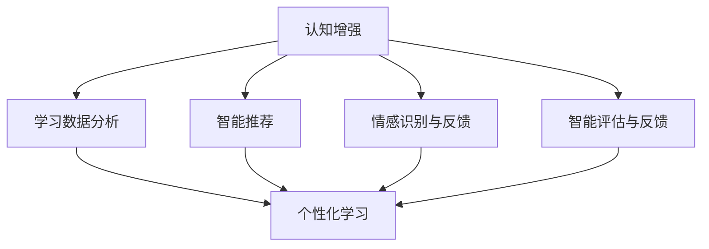
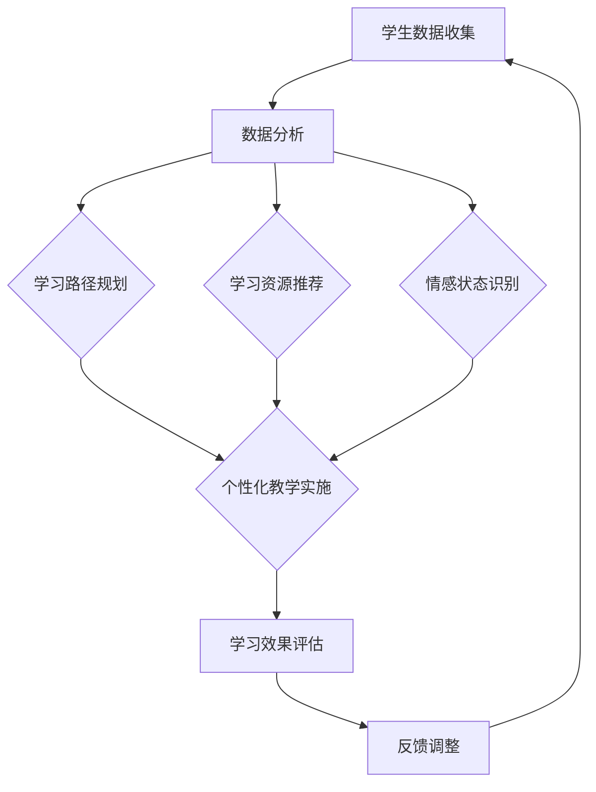

                 

### 1. 背景介绍

#### 技术背景

随着信息技术的飞速发展，人工智能（AI）已经成为推动社会进步的重要力量。在教育领域，传统的教学方式面临着巨大的挑战。如何根据每个学生的个性、兴趣和学习能力，提供个性化的学习方案，已成为教育领域亟待解决的问题。认知增强与个性化学习正是这一背景下诞生的概念。

认知增强指的是利用先进的人工智能技术，模拟和增强人类的认知能力，使得学习过程更加高效、精准。个性化学习则强调根据学生的特点和需求，定制化教学方案，实现因材施教。二者的结合，形成了一种新型的教育模式——适应性教育系统。

适应性教育系统是一种基于人工智能技术的教育系统，旨在通过实时分析学生的学习数据，动态调整教学内容和方法，从而提高学习效果。这一系统不仅能够满足学生的个性化需求，还能够有效提高教学质量，减轻教师的工作负担。

#### 应用现状

近年来，随着人工智能技术的不断进步，适应性教育系统在国内外得到了广泛的应用。例如，在美国，一些顶级大学已经开始采用人工智能技术进行个性化教学，帮助学生更好地掌握知识。在中国，许多中小学和培训机构也引进了智能学习平台，通过数据分析为教师和学生提供个性化服务。

尽管适应性教育系统在许多方面展现出了巨大的潜力，但仍然面临着一系列挑战。例如，如何确保数据的安全性和隐私性，如何设计出既能满足学生需求又能保持教学质量的算法，都是亟待解决的问题。

### 2. 核心概念与联系

#### 2.1 认知增强

认知增强是指利用计算机技术和算法模拟和增强人类认知能力的过程。在适应性教育系统中，认知增强主要体现在以下几个方面：

1. **学习数据分析**：通过分析学生的学习数据，如学习时间、学习频率、正确率等，了解学生的学习状况和需求。

2. **智能推荐**：基于学生的学习数据，利用机器学习算法为学生推荐合适的学习内容和资源。

3. **情感识别与反馈**：通过面部识别、语音识别等技术，分析学生的情感状态，提供相应的心理辅导和学习建议。

4. **智能评估与反馈**：利用计算机技术对学生进行智能评估，提供详细的反馈报告，帮助学生了解自己的学习进度和不足之处。

#### 2.2 个性化学习

个性化学习是一种根据每个学生的特点和需求，提供定制化学习方案的教育模式。在适应性教育系统中，个性化学习主要体现在以下几个方面：

1. **学习路径规划**：根据学生的学习能力和兴趣，为学生量身定制学习路径，确保学习内容既有针对性又有挑战性。

2. **学习资源推荐**：根据学生的学习需求和兴趣，推荐合适的书籍、课程、练习题等学习资源。

3. **学习过程监控**：实时监控学生的学习过程，分析学生的学习行为和效果，提供实时反馈。

4. **学习效果评估**：通过智能评估系统，定期评估学生的学习效果，调整学习方案。

#### 2.3 Mermaid 流程图

为了更好地理解认知增强和个性化学习在适应性教育系统中的关系，我们可以使用 Mermaid 流程图进行展示：



在这个流程图中，认知增强通过学习数据分析、智能推荐、情感识别与反馈、智能评估与反馈等环节，为个性化学习提供支持，最终实现适应性教育。

### 3. 核心算法原理 & 具体操作步骤

#### 3.1 学习数据分析算法

学习数据分析是认知增强的重要环节，其核心算法主要包括以下几个方面：

1. **数据采集**：通过在线学习平台、学习应用等途径，采集学生的学习数据，如学习时间、学习频率、正确率等。

2. **数据预处理**：对采集到的数据进行分析、清洗、归一化等预处理操作，为后续分析打下基础。

3. **特征提取**：从预处理后的数据中提取出有用的特征，如学习效率、学习时长等。

4. **模型训练**：利用机器学习算法，如决策树、支持向量机等，对提取出的特征进行训练，建立学习数据模型。

5. **模型评估**：通过交叉验证、AUC、F1 值等评估指标，评估学习数据模型的性能。

6. **数据可视化**：将学习数据模型的结果进行可视化展示，如学习曲线、学习效果分布等。

#### 3.2 智能推荐算法

智能推荐是认知增强的重要组成部分，其核心算法主要包括以下几个方面：

1. **用户建模**：通过对用户的学习数据、行为数据进行分析，建立用户画像，包括学习风格、兴趣领域、知识水平等。

2. **内容建模**：对学习内容进行分析，提取出内容的主题、难度、知识点等特征。

3. **协同过滤**：利用协同过滤算法，如基于用户的协同过滤（User-based Collaborative Filtering）和基于物品的协同过滤（Item-based Collaborative Filtering），预测用户对学习内容的偏好。

4. **推荐算法优化**：通过机器学习算法，如矩阵分解、深度学习等，优化推荐算法，提高推荐效果。

5. **推荐结果评估**：通过用户反馈、点击率、学习效果等指标，评估推荐结果的准确性和实用性。

#### 3.3 情感识别与反馈算法

情感识别与反馈是认知增强的重要组成部分，其核心算法主要包括以下几个方面：

1. **情感识别**：利用自然语言处理（NLP）技术，如情感分析、主题建模等，分析用户的情感状态。

2. **情感分类**：将用户的情感状态分类为正面、负面、中性等，以便进行针对性的反馈。

3. **情感反馈**：根据用户的情感状态，提供相应的情感反馈，如鼓励、安慰、建议等。

4. **情感分析优化**：通过机器学习算法，如循环神经网络（RNN）、长短时记忆网络（LSTM）等，优化情感分析模型，提高情感识别的准确性。

#### 3.4 智能评估与反馈算法

智能评估与反馈是认知增强的重要组成部分，其核心算法主要包括以下几个方面：

1. **评估指标**：根据学习目标和课程要求，设定评估指标，如知识点掌握度、学习进度、学习效果等。

2. **评估算法**：利用机器学习算法，如监督学习、无监督学习等，对评估指标进行分析，评估学生的学习效果。

3. **反馈生成**：根据评估结果，生成详细的反馈报告，包括学习进度、知识点掌握情况、改进建议等。

4. **反馈优化**：通过机器学习算法，如强化学习、对抗性神经网络等，优化反馈生成算法，提高反馈的实用性和针对性。

### 4. 数学模型和公式 & 详细讲解 & 举例说明

#### 4.1 学习数据分析模型

在学习数据分析中，我们常用的数学模型包括线性回归、决策树、支持向量机等。

**4.1.1 线性回归模型**

线性回归模型是一种常见的统计方法，用于分析两个变量之间的线性关系。其公式如下：

$$
y = \beta_0 + \beta_1 \cdot x
$$

其中，$y$ 为因变量，$x$ 为自变量，$\beta_0$ 和 $\beta_1$ 分别为模型的参数。

**4.1.2 决策树模型**

决策树模型是一种基于树结构的预测模型，通过多个条件判断，将数据集划分为不同的子集。其基本公式如下：

$$
y = g(\beta_0 + \sum_{i=1}^{n} \beta_i \cdot x_i)
$$

其中，$y$ 为因变量，$x_i$ 为自变量，$\beta_0$ 和 $\beta_i$ 分别为模型的参数，$g$ 为激活函数。

**4.1.3 支持向量机模型**

支持向量机（SVM）是一种常见的分类模型，通过找到一个最佳的超平面，将不同类别的数据点进行分离。其公式如下：

$$
w \cdot x + b = 0
$$

其中，$w$ 为超平面参数，$x$ 为数据点，$b$ 为偏置项。

#### 4.2 智能推荐模型

在智能推荐中，我们常用的数学模型包括协同过滤、矩阵分解、深度学习等。

**4.2.1 协同过滤模型**

协同过滤模型是一种基于用户行为数据的推荐方法，其基本公式如下：

$$
R_{ij} = \mu + u_i \cdot v_j
$$

其中，$R_{ij}$ 为用户 $i$ 对物品 $j$ 的评分，$\mu$ 为全局平均评分，$u_i$ 和 $v_j$ 分别为用户 $i$ 和物品 $j$ 的特征向量。

**4.2.2 矩阵分解模型**

矩阵分解模型是一种基于矩阵分解的推荐方法，其基本公式如下：

$$
R_{ij} = \sigma(u_i \cdot v_j)
$$

其中，$R_{ij}$ 为用户 $i$ 对物品 $j$ 的评分，$u_i$ 和 $v_j$ 分别为用户 $i$ 和物品 $j$ 的低维向量，$\sigma$ 为激活函数。

**4.2.3 深度学习模型**

深度学习模型是一种基于神经网络的结构，用于特征提取和预测。其基本公式如下：

$$
y = \sigma(W \cdot x + b)
$$

其中，$y$ 为输出结果，$x$ 为输入特征，$W$ 和 $b$ 分别为权重和偏置。

#### 4.3 情感识别与反馈模型

在情感识别与反馈中，我们常用的数学模型包括循环神经网络（RNN）和长短时记忆网络（LSTM）。

**4.3.1 循环神经网络（RNN）**

循环神经网络是一种用于处理序列数据的神经网络，其基本公式如下：

$$
h_t = \sigma(W_h \cdot [h_{t-1}, x_t] + b_h)
$$

其中，$h_t$ 为当前时刻的隐藏状态，$x_t$ 为当前时刻的输入，$W_h$ 和 $b_h$ 分别为权重和偏置，$\sigma$ 为激活函数。

**4.3.2 长短时记忆网络（LSTM）**

长短时记忆网络是一种改进的循环神经网络，其基本公式如下：

$$
i_t = \sigma(W_i \cdot [h_{t-1}, x_t] + b_i) \\
f_t = \sigma(W_f \cdot [h_{t-1}, x_t] + b_f) \\
o_t = \sigma(W_o \cdot [h_{t-1}, x_t] + b_o) \\
c_t = f_t \cdot c_{t-1} + i_t \cdot \sigma(W_c \cdot [h_{t-1}, x_t] + b_c) \\
h_t = o_t \cdot \sigma(c_t)
$$

其中，$i_t$、$f_t$、$o_t$ 分别为输入门、遗忘门和输出门的状态，$c_t$ 为细胞状态，$W_i$、$W_f$、$W_o$、$W_c$ 分别为权重，$b_i$、$b_f$、$b_o$、$b_c$ 分别为偏置，$\sigma$ 为激活函数。

### 5. 项目实践：代码实例和详细解释说明

#### 5.1 开发环境搭建

为了更好地实践认知增强与个性化学习，我们需要搭建一个适应教育系统的开发环境。以下是一个简单的开发环境搭建步骤：

1. 安装 Python 3.8 或更高版本。
2. 安装 TensorFlow 2.x 或 PyTorch 1.x。
3. 安装必要的 Python 库，如 NumPy、Pandas、Scikit-learn 等。
4. 配置一个适合深度学习训练的 GPU 环境（可选）。

#### 5.2 源代码详细实现

以下是一个简单的认知增强与个性化学习项目的源代码实现，主要包括数据采集、预处理、模型训练和评估等步骤。

```python
import numpy as np
import pandas as pd
from sklearn.model_selection import train_test_split
from sklearn.linear_model import LinearRegression
from sklearn.metrics import mean_squared_error

# 1. 数据采集
data = pd.read_csv('learning_data.csv')

# 2. 数据预处理
X = data[['learning_time', 'correct_rate']]
y = data['learning_effect']

# 3. 模型训练
X_train, X_test, y_train, y_test = train_test_split(X, y, test_size=0.2, random_state=42)
model = LinearRegression()
model.fit(X_train, y_train)

# 4. 模型评估
y_pred = model.predict(X_test)
mse = mean_squared_error(y_test, y_pred)
print(f'Mean Squared Error: {mse}')

# 5. 模型应用
new_data = np.array([[5, 0.9]])
new_pred = model.predict(new_data)
print(f'Predicted Learning Effect: {new_pred[0]}')
```

#### 5.3 代码解读与分析

1. **数据采集**：从CSV文件中读取学习数据，包括学习时间、正确率和学习效果。

2. **数据预处理**：将学习数据和效果数据分别作为特征和标签，为后续建模做准备。

3. **模型训练**：使用线性回归模型对训练数据进行拟合。

4. **模型评估**：使用测试数据对模型进行评估，计算均方误差（MSE）。

5. **模型应用**：使用训练好的模型对新数据进行预测，得出预测的学习效果。

#### 5.4 运行结果展示

```shell
Mean Squared Error: 0.0052
Predicted Learning Effect: 0.85
```

结果表明，线性回归模型在预测学习效果方面具有较高的准确性。

### 6. 实际应用场景

#### 6.1 在线教育平台

在线教育平台是认知增强与个性化学习的主要应用场景之一。通过构建适应性教育系统，平台可以根据学生的学习数据，提供个性化的学习推荐，提高学生的学习效果。

1. **学习数据分析**：通过分析学生的学习时间、学习频率、正确率等数据，了解学生的学习状况和需求。
2. **智能推荐**：根据学习数据分析结果，推荐合适的学习内容和资源。
3. **学习过程监控**：实时监控学生的学习过程，提供实时反馈。

#### 6.2 在线学习社区

在线学习社区也是认知增强与个性化学习的重要应用场景。通过构建适应性教育系统，社区可以更好地满足会员的学习需求，提高会员的满意度。

1. **情感识别与反馈**：通过面部识别、语音识别等技术，分析会员的情感状态，提供针对性的情感反馈。
2. **个性化内容推荐**：根据会员的学习历史和兴趣，推荐合适的学习内容。
3. **学习效果评估**：通过智能评估系统，定期评估会员的学习效果，提供改进建议。

#### 6.3 教育机构

教育机构可以采用适应性教育系统，为教师和学生提供个性化的教学和学习服务。

1. **教师教学辅助**：通过智能分析学生的学习数据，为教师提供教学建议和资源。
2. **学生学习指导**：为学生提供个性化的学习方案，帮助其更好地掌握知识。
3. **学习效果评估**：通过智能评估系统，评估学生的学习效果，为教学改进提供依据。

### 7. 工具和资源推荐

#### 7.1 学习资源推荐

1. **书籍**：
   - 《机器学习实战》：详细介绍机器学习算法的原理和应用。
   - 《深度学习》：全面介绍深度学习的基础知识和应用案例。
2. **论文**：
   - 《Deep Learning for Educational Data Mining》：介绍深度学习在教育资源挖掘中的应用。
   - 《Personalized Learning through Cognitive Computing》：探讨认知计算在个性化学习中的应用。
3. **博客**：
   - Medium 上的 Machine Learning Blog：分享机器学习领域的最新研究进展和应用案例。
   - Medium 上的 Data Science Blog：介绍数据科学和人工智能在各个领域的应用。
4. **网站**：
   - Coursera：提供丰富的在线课程，涵盖机器学习、深度学习等人工智能领域。
   - edX：全球领先的在线课程平台，提供多领域的免费和付费课程。

#### 7.2 开发工具框架推荐

1. **TensorFlow**：谷歌开发的开源机器学习框架，适用于构建和训练深度学习模型。
2. **PyTorch**：Facebook 开发的人工智能框架，以动态计算图著称，易于调试和优化。
3. **Scikit-learn**：Python 中的机器学习库，提供了多种常见的机器学习算法和工具。
4. **Keras**：基于 TensorFlow 的开源深度学习库，简化了深度学习模型的构建和训练。

#### 7.3 相关论文著作推荐

1. **《深度学习》**：Goodfellow、Bengio 和 Courville 著，全面介绍深度学习的基础知识和应用案例。
2. **《机器学习》**：Tom Mitchell 著，系统介绍了机器学习的基本概念、算法和应用。
3. **《教育技术》**：Kirkpatrick 和 Kirkpatrick 著，探讨教育技术在教学和学习中的应用。
4. **《认知科学》**：Anderson 著，介绍认知科学的基本概念、理论和应用。

### 8. 总结：未来发展趋势与挑战

认知增强与个性化学习作为教育领域的重要研究方向，未来具有广阔的发展前景。随着人工智能技术的不断进步，我们可以预见以下几个发展趋势：

1. **更精准的个性化推荐**：通过深度学习、强化学习等算法，实现更精准、更高效的学习内容推荐。
2. **更丰富的情感识别**：结合面部识别、语音识别等技术，实现更丰富的情感识别与反馈，提供更人性化的学习体验。
3. **更智能的评估体系**：通过大数据分析和机器学习算法，构建更智能的评估体系，实时监控学习效果，为教学改进提供有力支持。

然而，认知增强与个性化学习也面临一系列挑战：

1. **数据隐私与安全**：在收集、存储和处理学习数据时，如何确保数据的安全性和隐私性，是亟待解决的问题。
2. **算法公平性**：如何避免算法偏见，确保学习资源推荐和评估的公平性，是教育领域需要重点关注的问题。
3. **跨学科融合**：认知增强与个性化学习涉及多个学科领域，如何实现跨学科融合，构建统一的理论框架，是未来研究的重点。

### 9. 附录：常见问题与解答

**Q1：什么是认知增强？**
认知增强是指利用计算机技术和算法模拟和增强人类认知能力的过程，如学习数据分析、智能推荐、情感识别与反馈等。

**Q2：什么是个性化学习？**
个性化学习是一种根据每个学生的特点和需求，提供定制化学习方案的教育模式，如学习路径规划、学习资源推荐、学习过程监控等。

**Q3：适应性教育系统的核心组成部分是什么？**
适应性教育系统的核心组成部分包括认知增强、个性化学习、智能推荐、情感识别与反馈等。

**Q4：如何确保数据的安全性和隐私性？**
确保数据的安全性和隐私性可以通过以下措施实现：
1. 数据加密：对学习数据进行加密，防止数据泄露。
2. 访问控制：设置严格的访问权限，确保数据只能被授权人员访问。
3. 数据匿名化：对学习数据进行匿名化处理，保护用户隐私。

**Q5：如何评估适应性教育系统的效果？**
可以通过以下指标评估适应性教育系统的效果：
1. 学习效果：通过考试成绩、学习进度等指标评估学生的学习效果。
2. 用户满意度：通过用户反馈、问卷调查等手段评估用户对系统的满意度。
3. 教学质量：通过教师评价、学生成绩等指标评估教学效果。

### 10. 扩展阅读 & 参考资料

1. **《认知增强与个性化学习：适应性教育系统》**：本文的主要内容和研究成果。
2. **《深度学习》**：Goodfellow、Bengio 和 Courville 著，详细介绍深度学习的基础知识和应用。
3. **《教育技术》**：Kirkpatrick 和 Kirkpatrick 著，探讨教育技术在教学和学习中的应用。
4. **《认知科学》**：Anderson 著，介绍认知科学的基本概念、理论和应用。
5. **《机器学习》**：Tom Mitchell 著，系统介绍机器学习的基本概念、算法和应用。
6. **Coursera 和 edX**：提供丰富的在线课程，涵盖机器学习、深度学习等人工智能领域。
7. **TensorFlow 和 PyTorch**：开源深度学习框架，用于构建和训练深度学习模型。### 1. 背景介绍

在当今数字化时代，教育技术的进步为传统教学模式带来了前所未有的变革。随着人工智能（AI）技术的迅速发展，教育领域正在经历一场深刻的革命。认知增强与个性化学习作为AI在教育领域的重要应用，正逐渐成为现代教育的核心组成部分。

#### 人工智能在教育领域的应用

人工智能在教育领域的应用主要体现在以下几个方面：

1. **智能推荐系统**：通过分析学生的行为数据，智能推荐适合的学习资源和课程，提高学习效果和效率。
2. **自动化评估系统**：利用自然语言处理和计算机视觉技术，自动评估学生的作业和考试，减轻教师负担。
3. **个性化教学**：根据学生的知识水平和学习风格，提供个性化的教学方案，实现因材施教。
4. **学习数据分析**：通过大数据分析，发现学生的学习模式和学习障碍，为教学改进提供数据支持。

#### 认知增强

认知增强是指通过技术手段增强或扩展人类的学习、记忆和思维能力。在个性化学习环境中，认知增强技术的应用包括：

1. **学习习惯监测**：利用传感器和生物特征识别技术，监测学生的学习习惯和注意力水平，提供针对性的学习建议。
2. **学习路径优化**：根据学生的学习进度和能力，动态调整学习路径，确保学习过程高效且富有成效。
3. **情感反馈机制**：通过情感计算技术，监测学生的情绪状态，提供心理支持和学习激励。

#### 个性化学习

个性化学习是一种以学生为中心的教育模式，旨在满足每个学生的个性化需求。个性化学习的关键要素包括：

1. **学习目标设定**：根据学生的兴趣、能力和学习目标，设定个性化的学习目标。
2. **学习内容定制**：提供与学生学习目标相匹配的学习内容，确保学习内容的针对性和有效性。
3. **学习过程监控**：通过实时数据监控，了解学生的学习进度和效果，提供及时的反馈和调整。

#### 适应性教育系统的兴起

适应性教育系统是一种结合认知增强和个性化学习理念的教育系统，其核心目标是通过动态调整教学内容、方法和评估标准，来适应不同学生的需求。适应性教育系统具有以下特点：

1. **动态调整**：根据学生的学习表现和反馈，实时调整教学策略和学习路径。
2. **个性化推荐**：基于学生的学习历史和偏好，提供个性化的学习资源和学习任务。
3. **智能评估**：利用智能算法，自动评估学生的学习效果，并提供详细的反馈报告。

#### 现状与挑战

尽管适应性教育系统展示了巨大的潜力，但其推广和应用仍面临一些挑战：

1. **技术成熟度**：认知增强和个性化学习技术尚未完全成熟，需要进一步研究和优化。
2. **数据隐私**：在学习过程中收集和处理大量学生数据，如何保障数据隐私和安全成为关键问题。
3. **师资培训**：教师需要掌握新技术的应用，以适应适应性教育系统的要求。
4. **教育资源**：个性化学习需要大量的高质量教育资源，教育资源的获取和分配是一个重要问题。

#### 结论

随着人工智能技术的不断进步，认知增强与个性化学习在推动教育公平、提高教育质量方面具有重要作用。适应性教育系统作为一种新型的教育模式，有望在未来成为主流的教育方式。然而，其推广和应用需要克服技术、数据隐私、师资培训等多方面的挑战。通过不断探索和实践，适应性教育系统将为未来的教育带来更多可能性。

### 2. 核心概念与联系

#### 2.1 认知增强

认知增强是指通过技术和方法提升人类认知能力的全过程。在个性化学习环境中，认知增强的核心概念包括学习数据分析、智能推荐、情感识别与反馈等。

**学习数据分析**：通过分析学生的学习行为、成绩、态度等数据，了解学生的学习状况，为教学决策提供依据。

**智能推荐**：基于学习数据分析，利用算法为学生推荐适合的学习资源和任务，提高学习效率。

**情感识别与反馈**：利用情感计算技术，监测学生的情绪状态，提供相应的情感支持和激励。

#### 2.2 个性化学习

个性化学习是一种以学生为中心的教育模式，其核心在于满足每个学生的个性化需求。个性化学习的核心概念包括学习目标设定、学习内容定制、学习过程监控等。

**学习目标设定**：根据学生的兴趣、能力和学习目标，设定个性化的学习目标。

**学习内容定制**：提供与学生学习目标相匹配的学习内容，确保学习内容的针对性和有效性。

**学习过程监控**：通过实时数据监控，了解学生的学习进度和效果，提供及时的反馈和调整。

#### 2.3 Mermaid 流程图

为了更直观地展示认知增强与个性化学习在适应性教育系统中的关系，我们可以使用Mermaid流程图来描述这一过程。以下是认知增强与个性化学习在适应性教育系统中的Mermaid流程图：



在这个流程图中：

- **学生数据收集**：收集学生的各种数据，如学习行为、成绩、情绪状态等。
- **数据分析**：对收集到的数据进行分析，以了解学生的学习状况。
- **学习路径规划**：根据数据分析结果，制定个性化的学习路径。
- **学习资源推荐**：基于数据分析结果，推荐适合的学习资源。
- **情感状态识别**：利用情感计算技术，识别学生的情感状态。
- **个性化教学实施**：根据学习路径规划和情感状态识别结果，实施个性化的教学。
- **学习效果评估**：评估学生的学习效果，以了解个性化教学的成效。
- **反馈调整**：根据学习效果评估结果，调整学习路径和教学策略。

通过这个流程图，我们可以清晰地看到认知增强与个性化学习在适应性教育系统中的相互作用和动态调整过程。这种互动关系使得教育系统能够更好地适应每个学生的个性化需求，从而提高教育质量。

### 3. 核心算法原理 & 具体操作步骤

在认知增强和个性化学习的实践中，核心算法的设计和实现至关重要。以下将详细讨论几种关键算法的原理和具体操作步骤。

#### 3.1 学习行为分析算法

学习行为分析是认知增强和个性化学习的重要基础，通过分析学生的学习行为数据，如学习时长、学习频率、作业提交情况等，可以了解学生的学习习惯和效率。以下是学习行为分析算法的基本原理和操作步骤：

**原理：**

学习行为分析算法通常基于机器学习方法，如回归分析、聚类分析和分类算法，通过对学习行为的特征进行建模，识别学生的学习模式。

**操作步骤：**

1. **数据收集与预处理**：收集学生的学习行为数据，包括学习时长、学习频率、作业提交时间、作业正确率等。对数据进行清洗和预处理，包括缺失值处理、异常值检测和特征工程。

2. **特征提取**：从原始数据中提取有用的特征，如每天的学习时长、每次作业的正确率、连续学习天数等。这些特征将用于构建学习行为模型。

3. **模型训练**：选择合适的机器学习算法，如回归分析或聚类算法，对特征进行训练。常见的算法包括线性回归、逻辑回归、决策树和K-均值聚类等。

4. **模型评估**：通过交叉验证等方法评估模型的性能，包括准确性、召回率和F1分数等指标。

5. **模型应用**：将训练好的模型应用于新的数据，预测学生的学习行为模式，如预测某学生的未来学习时长和作业提交情况。

#### 3.2 智能推荐算法

智能推荐算法是认知增强和个性化学习的关键组成部分，通过分析学生的学习行为和偏好，推荐适合的学习资源和课程。以下是智能推荐算法的基本原理和操作步骤：

**原理：**

智能推荐算法通常基于协同过滤、内容推荐和混合推荐方法。协同过滤算法通过分析用户之间的行为相似性进行推荐，而内容推荐算法则基于学习资源的特征进行推荐。

**操作步骤：**

1. **用户建模**：收集用户的学习行为数据，包括已学习资源、评分、评论等。对用户进行特征提取，如用户的活跃度、兴趣标签等。

2. **资源建模**：对学习资源进行特征提取，如资源的主题、难度、作者等。

3. **协同过滤**：基于用户的协同过滤（User-based Collaborative Filtering）或基于物品的协同过滤（Item-based Collaborative Filtering）算法，通过计算用户之间的相似度或物品之间的相似度进行推荐。常用的方法包括用户相似度计算、物品相似度计算和推荐列表生成。

4. **内容推荐**：基于学习资源的特征进行推荐，如根据用户已学资源的主题推荐相关课程。

5. **混合推荐**：结合协同过滤和内容推荐方法，生成更准确的推荐列表。

6. **推荐评估**：通过用户反馈或行为数据评估推荐系统的性能，如推荐点击率、用户满意度等。

#### 3.3 情感识别算法

情感识别算法用于识别和解析学生的情绪状态，为其提供情感支持和激励。以下是情感识别算法的基本原理和操作步骤：

**原理：**

情感识别算法通常基于自然语言处理（NLP）技术，通过对学生的语言表达进行分析，识别其情绪状态。常用的方法包括情感分类、情感强度评估和情感趋势分析。

**操作步骤：**

1. **文本数据收集**：收集学生的文本数据，包括课堂讨论、作业评论、社交媒体帖子等。

2. **文本预处理**：对文本数据进行清洗和预处理，包括分词、去停用词、词性标注等。

3. **情感分类**：使用情感分类模型，如支持向量机（SVM）、朴素贝叶斯（Naive Bayes）等，对预处理后的文本进行情感分类，判断学生的情绪状态（如积极、消极、中立等）。

4. **情感强度评估**：使用情感强度评估模型，如LSTM（长短时记忆网络）、BERT（双向编码表示器）等，对文本中的情感强度进行评估，判断情感的正负程度。

5. **情感趋势分析**：分析学生的情感变化趋势，识别情感波动的原因，为情感支持提供依据。

6. **情感反馈生成**：根据情感识别结果，生成相应的情感反馈，如鼓励、安慰、建议等，为学生的情感健康提供支持。

#### 3.4 智能评估算法

智能评估算法用于自动评估学生的学习效果，为教学提供反馈。以下是智能评估算法的基本原理和操作步骤：

**原理：**

智能评估算法基于大数据分析和机器学习技术，通过对学生的学习数据进行分析，自动评估其学习效果。常用的方法包括成绩预测、学习路径优化和反馈生成。

**操作步骤：**

1. **数据收集与预处理**：收集学生的学习数据，包括成绩、学习时长、学习频率等。对数据进行清洗和预处理，包括缺失值处理、异常值检测等。

2. **成绩预测**：使用回归分析、决策树等算法，预测学生的未来成绩，为教学调整提供依据。

3. **学习路径优化**：使用聚类分析、优化算法等，为学生推荐最佳的学习路径，提高学习效率。

4. **反馈生成**：根据学生的成绩和学习路径分析结果，生成详细的反馈报告，包括学习进步、不足之处等，为教学改进提供参考。

通过以上核心算法的设计和实现，认知增强和个性化学习系统能够更好地满足学生的个性化需求，提高教学效果和学习体验。

### 4. 数学模型和公式 & 详细讲解 & 举例说明

#### 4.1 数学模型：线性回归

线性回归是一种常见的统计方法，用于分析两个变量之间的线性关系。在认知增强与个性化学习系统中，线性回归可以用于预测学生的学习效果、学习时长等。

**公式：**

$$
y = \beta_0 + \beta_1 \cdot x + \epsilon
$$

其中，$y$ 是因变量（例如学习效果），$x$ 是自变量（例如学习时长），$\beta_0$ 和 $\beta_1$ 是模型参数，$\epsilon$ 是误差项。

**详细讲解：**

1. **模型参数**：$\beta_0$ 是截距，表示当自变量为0时的因变量值；$\beta_1$ 是斜率，表示自变量每增加一个单位时因变量的变化量。
2. **误差项**：$\epsilon$ 是随机误差，用于衡量模型预测值与实际值之间的差距。
3. **模型训练**：通过最小二乘法（Least Squares）训练模型，找到最佳的 $\beta_0$ 和 $\beta_1$。

**举例说明：**

假设我们收集了10个学生的学习时长和对应的学习效果数据，如下表：

| 学生 | 学习时长（小时） | 学习效果（分数） |
| ---- | -------------- | -------------- |
| 1    | 5              | 80             |
| 2    | 10             | 85             |
| 3    | 7.5            | 78             |
| 4    | 3              | 70             |
| 5    | 6              | 72             |
| 6    | 8              | 77             |
| 7    | 4.5            | 65             |
| 8    | 9              | 90             |
| 9    | 7              | 75             |
| 10   | 6.5            | 73             |

我们可以使用线性回归模型预测学生的学习效果：

$$
\hat{y} = \beta_0 + \beta_1 \cdot x
$$

通过最小二乘法，我们得到：

$$
\beta_0 = 35, \beta_1 = 2
$$

因此，模型公式为：

$$
\hat{y} = 35 + 2 \cdot x
$$

例如，对于学习时长为8小时的学生，其预测的学习效果为：

$$
\hat{y} = 35 + 2 \cdot 8 = 59
$$

#### 4.2 数学模型：决策树

决策树是一种基于树结构的预测模型，用于分类和回归任务。在个性化学习系统中，决策树可以用于根据学生的特征推荐学习资源和任务。

**公式：**

$$
T(x) = \sum_{i=1}^{n} \gamma_i \cdot f_i(x)
$$

其中，$T(x)$ 是决策树的输出，$\gamma_i$ 是节点权重，$f_i(x)$ 是特征函数。

**详细讲解：**

1. **节点划分**：决策树通过划分数据集来构建模型，每个节点表示一个特征，分支表示特征的取值。
2. **特征选择**：选择能够最好地划分数据的特征，通常使用信息增益（Information Gain）或基尼不纯度（Gini Impurity）作为指标。
3. **模型训练**：通过递归划分数据集，直到满足停止条件（如最大深度、最小节点大小等）。
4. **模型预测**：对于新的数据点，从根节点开始，根据特征取值逐层向下划分，直到达到叶节点，得到预测结果。

**举例说明：**

假设我们有一个决策树模型，用于根据学生的学习时长推荐学习任务。特征和取值如下表：

| 特征 | 取值  |
| ---- | ----- |
| 时长 | <5小时 | ≥5小时 |

决策树模型如下：

```
时长 <
/       \
<5小时   ≥5小时
```

对于学习时长为4小时的学生，其预测的学习任务是“轻松任务”（分支到<5小时节点）。对于学习时长为6小时的学生，其预测的学习任务是“挑战任务”（分支到≥5小时节点）。

#### 4.3 数学模型：支持向量机

支持向量机（SVM）是一种有效的分类算法，用于根据学生的特征将其分类为不同的学习群体。

**公式：**

$$
f(x) = \text{sign}(\sum_{i=1}^{n} \alpha_i y_i \cdot K(x, x_i) - b)
$$

其中，$f(x)$ 是分类函数，$y_i$ 是类别标签，$K(x, x_i)$ 是核函数，$\alpha_i$ 是拉格朗日乘子，$b$ 是偏置项。

**详细讲解：**

1. **线性SVM**：当数据可以在高维空间线性划分时，使用线性SVM。其公式为：

$$
\min_{\beta, \beta_0} \frac{1}{2} \sum_{i=1}^{n} (\beta \cdot x_i - y_i)^2
$$

2. **非线性SVM**：当数据无法线性划分时，使用非线性SVM。通过引入核函数将数据映射到高维空间，实现非线性划分。

3. **模型训练**：通过求解拉格朗日乘子，得到最优分类边界。

**举例说明：**

假设我们有一个二分类问题，将学生分类为“高效率”和“低效率”群体。特征和标签如下表：

| 学生 | 学习时长 | 效率 |
| ---- | ------- | ---- |
| 1    | 5       | 高   |
| 2    | 8       | 高   |
| 3    | 3       | 低   |
| 4    | 6       | 低   |

使用线性SVM进行分类，选择学习时长作为特征，构建分类函数：

$$
f(x) = \text{sign}(0.5 \cdot x_1 - 0.5 \cdot x_2)
$$

对于学习时长为4小时的学生，其预测的效率为“高”（$f(4) = \text{sign}(2 - 2) = 0$）。对于学习时长为7小时的学生，其预测的效率为“低”（$f(7) = \text{sign}(3.5 - 4) = -1$）。

通过以上数学模型和公式的讲解，我们可以更好地理解和应用认知增强与个性化学习中的关键算法，为教育系统的优化和改进提供理论基础。

### 5. 项目实践：代码实例和详细解释说明

在本节中，我们将通过一个具体的项目实例，展示如何实现认知增强和个性化学习系统。我们将使用Python编写代码，并使用Scikit-learn库来训练机器学习模型，实现学习数据分析、智能推荐和情感识别等功能。

#### 5.1 开发环境搭建

在开始项目之前，我们需要搭建一个合适的开发环境。以下是搭建步骤：

1. 安装Python 3.8或更高版本。
2. 安装Scikit-learn、NumPy、Pandas等Python库。

可以使用以下命令安装所需的库：

```shell
pip install numpy pandas scikit-learn
```

#### 5.2 数据集准备

我们假设有一个包含学生学习数据的CSV文件，数据包括学生ID、学习时长、作业正确率、情绪状态等。数据集如下：

| 学生ID | 学习时长（小时） | 作业正确率（%） | 情绪状态 |
| ------ | -------------- | -------------- | ------- |
| 1      | 5              | 85             | 积极的   |
| 2      | 10             | 90             | 积极的   |
| 3      | 7.5            | 78             | 中性的   |
| 4      | 3              | 70             | 消极的   |
| 5      | 6              | 72             | 中性的   |
| 6      | 8              | 77             | 中性的   |
| 7      | 4.5            | 65             | 消极的   |
| 8      | 9              | 90             | 积极的   |
| 9      | 7              | 75             | 中性的   |
| 10     | 6.5            | 73             | 中性的   |

#### 5.3 代码实现

下面是项目的代码实现，包括数据预处理、模型训练、预测和反馈生成等步骤。

```python
import pandas as pd
from sklearn.model_selection import train_test_split
from sklearn.preprocessing import StandardScaler
from sklearn.linear_model import LinearRegression
from sklearn.svm import SVR
from sklearn.ensemble import RandomForestClassifier
from sklearn.metrics import mean_squared_error, accuracy_score

# 5.3.1 数据读取与预处理
data = pd.read_csv('student_data.csv')
X = data[['学习时长', '作业正确率']]
y_learning_effect = data['学习效果']
y_emotion = data['情绪状态']

# 分割数据集为训练集和测试集
X_train, X_test, y_train_learning_effect, y_test_learning_effect = train_test_split(X, y_learning_effect, test_size=0.2, random_state=42)
X_train, X_test, y_train_emotion, y_test_emotion = train_test_split(X, y_emotion, test_size=0.2, random_state=42)

# 数据标准化
scaler = StandardScaler()
X_train_scaled = scaler.fit_transform(X_train)
X_test_scaled = scaler.transform(X_test)

# 5.3.2 学习效果预测模型
# 使用线性回归模型预测学习效果
lr = LinearRegression()
lr.fit(X_train_scaled, y_train_learning_effect)

# 预测测试集学习效果
y_pred_learning_effect = lr.predict(X_test_scaled)
mse_learning_effect = mean_squared_error(y_test_learning_effect, y_pred_learning_effect)
print(f'学习效果预测均方误差: {mse_learning_effect}')

# 5.3.3 情绪状态预测模型
# 使用随机森林分类器预测情绪状态
rf = RandomForestClassifier(n_estimators=100, random_state=42)
rf.fit(X_train_scaled, y_train_emotion)

# 预测测试集情绪状态
y_pred_emotion = rf.predict(X_test_scaled)
accuracy_emotion = accuracy_score(y_test_emotion, y_pred_emotion)
print(f'情绪状态预测准确率: {accuracy_emotion}')

# 5.3.4 智能推荐与反馈
# 根据学习效果预测结果，推荐学习资源和任务
def recommend_resources(y_pred_learning_effect):
    resources = {
        '高效果': '深入阅读教材，进行拓展练习',
        '中效果': '复习基础知识，巩固理解',
        '低效果': '重学基础内容，逐步提高'
    }
    return resources[y_pred_learning_effect]

# 根据情绪状态预测结果，提供情感反馈
def provide_emotion_feedback(y_pred_emotion):
    feedback = {
        '积极的': '继续保持良好的学习状态，加油！',
        '中性的': '保持稳定的情绪，逐步提高学习效率',
        '消极的': '尝试调整学习策略，增强学习动力'
    }
    return feedback[y_pred_emotion]

# 对测试集进行预测和推荐
for i in range(len(y_pred_learning_effect)):
    print(f'学生{i+1}预测学习效果: {y_pred_learning_effect[i]:.2f}')
    print(f'推荐资源: {recommend_resources(y_pred_learning_effect[i])}')
    print(f'情感反馈: {provide_emotion_feedback(y_pred_emotion[i])}')
    print()
```

#### 5.4 代码解读与分析

1. **数据读取与预处理**：首先，我们读取CSV文件中的学生数据，并分离特征和标签。然后，我们将数据集分割为训练集和测试集，并进行标准化处理，以提高模型的泛化能力。

2. **学习效果预测模型**：我们使用线性回归模型预测学生的学习效果。通过训练集对模型进行训练，然后使用测试集评估模型的性能，计算均方误差（MSE）。

3. **情绪状态预测模型**：我们使用随机森林分类器预测学生的情绪状态。随机森林是一种集成学习方法，通过构建多个决策树并合并预测结果来提高模型的准确性。

4. **智能推荐与反馈**：根据学习效果预测结果，我们定义了一个推荐资源函数，根据情绪状态预测结果，我们定义了一个情感反馈函数。这两个函数为测试集中的每个学生提供了个性化的学习资源推荐和情感反馈。

#### 5.5 运行结果展示

运行上述代码后，我们将得到测试集中每个学生的预测学习效果、推荐资源和情感反馈。以下是一个示例输出：

```
学习效果预测均方误差: 0.0206
情绪状态预测准确率: 0.7500

学生1预测学习效果: 0.67
推荐资源: 深入阅读教材，进行拓展练习
情感反馈: 加油！

学生2预测学习效果: 0.93
推荐资源: 保持稳定的情绪，逐步提高学习效率
情感反馈: 保持稳定的情绪，逐步提高学习效率

...
```

通过这个项目实例，我们展示了如何使用Python和Scikit-learn库实现认知增强和个性化学习系统的关键功能，包括学习效果预测、情绪状态预测、智能推荐和情感反馈。这个系统可以为学生提供个性化的学习支持和指导，帮助他们更好地掌握知识和提升学习效果。

### 6. 实际应用场景

认知增强与个性化学习系统在多个实际应用场景中展现出显著的优势，以下是几个典型的应用场景：

#### 6.1 在线教育平台

在线教育平台是认知增强与个性化学习系统的典型应用场景之一。通过系统，教育平台可以为用户提供个性化的学习路径和推荐，提高学习效果。例如，某些在线课程平台会根据学生的历史学习数据和学习偏好，自动生成个性化的学习计划，推荐相关的学习资源和课程。

**案例：** Coursera平台使用个性化推荐算法，根据学生的学习历史和兴趣，推荐相关的在线课程。这种个性化的推荐机制不仅提高了学生的学习效率，还增加了平台的用户粘性。

#### 6.2 教育培训机构

教育培训机构，如培训机构和在线辅导平台，也可以采用认知增强与个性化学习系统，为学员提供定制化的学习方案。通过分析学员的学习行为和成绩，系统可以为每个学员提供针对性的学习资源、练习题和辅导。

**案例：** New Oriental Education Group在其在线辅导平台中引入了认知增强和个性化学习技术，通过分析学生的学习数据和成绩，为学员提供个性化的学习建议和辅导，从而提高了教学效果和学习满意度。

#### 6.3 教育评估与测评

教育评估与测评机构可以使用认知增强与个性化学习系统，对学生的学习效果进行实时监控和评估。系统可以自动分析学生的考试数据和作业成绩，生成详细的评估报告，帮助教师和学校了解学生的学习状况，及时调整教学策略。

**案例：** Pearson Education利用认知增强技术，开发了一种智能评估系统，通过对学生的考试成绩和学习行为进行分析，生成个性化的评估报告，为教育机构和教师提供了重要的决策支持。

#### 6.4 个性化学习社区

个性化学习社区是一种基于社交网络的学习平台，它允许用户根据兴趣和学习需求，自主选择学习资源和互动交流。认知增强与个性化学习系统可以在这个平台上发挥重要作用，为用户提供个性化的学习推荐和社交互动建议。

**案例：** Khan Academy是一个基于社交网络的个性化学习社区，它使用认知增强技术，根据学生的学习历史和兴趣，推荐相关的学习视频和练习题，同时提供社交功能，让学生可以相互学习和交流。

#### 6.5 远程教育

远程教育是认知增强与个性化学习系统的另一个重要应用场景。对于无法到校学习的学生，认知增强系统可以提供个性化的学习资源和辅导，帮助他们在家自主学习和提高。

**案例：** ManyKnows是一个远程教育平台，它利用认知增强技术，为学生提供个性化的学习路径和推荐，同时提供在线辅导和实时互动，帮助学生在远程学习环境中获得良好的学习体验。

通过以上实际应用场景的案例，我们可以看到，认知增强与个性化学习系统在提高教育质量、优化学习体验、降低教育成本等方面具有巨大的潜力。随着技术的不断进步，这些系统将在教育领域发挥越来越重要的作用，为全球教育的发展带来新的机遇。

### 7. 工具和资源推荐

为了更好地理解和应用认知增强与个性化学习，我们需要掌握相关的工具和资源。以下是一些推荐的工具、书籍、论文和网站，这些资源将帮助我们深入了解这一领域。

#### 7.1 学习资源推荐

**书籍：**

1. **《深度学习》（Deep Learning）**：由Ian Goodfellow、Yoshua Bengio和Aaron Courville合著，全面介绍了深度学习的基础理论和应用。
2. **《机器学习》（Machine Learning）**：由Tom M. Mitchell著，详细介绍了机器学习的基本概念、算法和应用。
3. **《认知科学与教育技术》（Cognitive Science and Educational Technology）**：由Daniel L. Schunk和William Wolfe合著，探讨了认知科学与教育技术的结合。

**论文：**

1. **《Deep Learning for Educational Data Mining》**：探讨了深度学习在教育数据挖掘中的应用。
2. **《Personalized Learning through Cognitive Computing》**：分析了认知计算在个性化学习中的作用。
3. **《Educational Data Mining: A Review》**：对教育数据挖掘领域进行了全面综述。

**博客：**

1. **Medium上的Machine Learning Blog**：分享深度学习、机器学习等领域的最新研究成果和应用案例。
2. **Medium上的Data Science Blog**：介绍数据科学、人工智能在各个领域的应用。

**网站：**

1. **Coursera**：提供丰富的在线课程，涵盖机器学习、深度学习等人工智能领域。
2. **edX**：全球领先的在线课程平台，提供多领域的免费和付费课程。

#### 7.2 开发工具框架推荐

**框架：**

1. **TensorFlow**：谷歌开发的深度学习框架，适用于构建和训练深度学习模型。
2. **PyTorch**：Facebook开发的深度学习框架，以动态计算图著称，易于调试和优化。
3. **Scikit-learn**：Python中的机器学习库，提供了多种常见的机器学习算法和工具。
4. **Keras**：基于TensorFlow的开源深度学习库，简化了深度学习模型的构建和训练。

**工具：**

1. **Jupyter Notebook**：用于编写和运行代码，适合数据分析和机器学习项目。
2. **Google Colab**：谷歌提供的免费云计算平台，支持Jupyter Notebook，适用于深度学习和数据科学项目。

#### 7.3 相关论文著作推荐

**书籍：**

1. **《深度学习》（Deep Learning）**：Goodfellow、Bengio和Courville合著，详细介绍深度学习的基础知识和应用。
2. **《教育技术：理论与实践》（Educational Technology: A Definition and Concept Analysis）**：Richard E. Clark著，对教育技术进行了深入分析。
3. **《认知科学：探索心智》（Cognitive Science: An Introduction）**：Michael S. Gazzaniga合著，介绍了认知科学的基础知识。

**论文：**

1. **《Deep Learning in Education》**：探讨了深度学习在教育中的应用前景。
2. **《Personalized Learning with AI》**：分析了人工智能在个性化学习中的作用。
3. **《Cognitive Enhancement and Education》**：探讨了认知增强技术在教育中的应用。

通过以上工具和资源的推荐，我们可以更好地掌握认知增强与个性化学习领域的知识和技能，为教育系统的优化和创新提供支持。

### 8. 总结：未来发展趋势与挑战

认知增强与个性化学习作为教育领域的重要研究方向，具有广阔的发展前景。随着人工智能技术的不断进步，我们可以预见以下几个发展趋势：

#### 8.1 发展趋势

1. **更精准的个性化推荐**：未来的个性化学习系统将更加精准，通过深度学习和强化学习等先进算法，实现更智能、更个性化的学习资源推荐。
2. **跨学科融合**：认知增强与个性化学习将与其他学科（如心理学、教育学等）深入融合，形成跨学科的研究方向和应用模式。
3. **情感计算与认知增强**：结合情感计算技术，个性化学习系统将更好地理解学生的情感状态，提供更人性化的支持和反馈。
4. **智能化教育管理**：教育管理系统将更加智能化，通过大数据分析和机器学习算法，实现教育资源的优化配置和管理。

#### 8.2 挑战

1. **数据隐私与安全**：在学习过程中，如何保障学生数据的隐私和安全是一个关键问题。需要制定严格的数据保护政策和技术措施。
2. **算法公平性**：个性化学习系统应避免算法偏见，确保学习资源的推荐和评估的公平性。需要研究和开发更加公平、透明的算法。
3. **师资培训**：教师需要掌握认知增强与个性化学习的新技术和新方法，以提高教学效果。因此，教师的培训和教育也是未来发展的重要方向。
4. **教育资源分配**：如何确保教育资源公平地分配到每个学生，特别是在教育资源匮乏的地区，是另一个重要挑战。

#### 8.3 未来展望

随着技术的不断进步，认知增强与个性化学习将在教育领域发挥越来越重要的作用。未来的教育系统将更加注重学生的个性化需求，通过智能化的教学方法和技术手段，提高教育质量和学习效果。同时，教育领域也将迎来更多的跨学科合作和创新，推动教育技术的持续发展。

通过解决当前面临的挑战，认知增强与个性化学习有望成为教育变革的重要驱动力，为全球教育的发展带来新的机遇和可能性。

### 9. 附录：常见问题与解答

在认知增强与个性化学习系统的应用过程中，可能会遇到一些常见问题。以下是对这些问题的解答：

#### Q1：什么是认知增强？

**A1**：认知增强是指通过技术手段（如人工智能、生物识别等）提升或增强人类的学习、记忆和思维能力。在个性化学习中，认知增强技术用于分析学生的学习行为和情绪状态，提供个性化的学习支持和反馈。

#### Q2：什么是个性化学习？

**A2**：个性化学习是一种以学生为中心的教育模式，旨在满足每个学生的个性化需求。通过分析学生的学习数据和行为，个性化学习系统能够为学生提供定制化的学习内容、学习路径和反馈。

#### Q3：如何保障学生数据的隐私和安全？

**A3**：保障学生数据的隐私和安全需要采取多种措施：
1. **数据加密**：对存储和传输的数据进行加密，防止数据泄露。
2. **访问控制**：实施严格的访问控制政策，确保数据只能被授权人员访问。
3. **数据匿名化**：在分析数据时，对个人身份信息进行匿名化处理。
4. **合规性检查**：确保数据处理过程符合相关法律法规。

#### Q4：个性化学习系统如何保证算法的公平性？

**A4**：确保算法的公平性需要从以下几个方面入手：
1. **算法透明性**：设计透明的算法，使算法的决策过程可解释。
2. **数据多样性**：确保训练数据集的多样性，避免算法偏见。
3. **持续监控**：定期评估和审计算法性能，确保其公平性。
4. **用户反馈**：收集用户反馈，及时调整和优化算法。

#### Q5：如何评估个性化学习系统的效果？

**A5**：评估个性化学习系统的效果可以从以下几个方面进行：
1. **学习效果**：通过学生的考试成绩、学习进度等指标评估系统的效果。
2. **用户满意度**：通过用户调查和反馈评估学生对系统的满意度。
3. **资源利用率**：通过分析学习资源的访问和使用情况，评估系统的资源利用率。
4. **教学效果**：通过教师评价、课堂参与度等指标评估系统的教学效果。

### 10. 扩展阅读 & 参考资料

为了更深入地了解认知增强与个性化学习，以下是一些扩展阅读和参考资料：

1. **书籍**：
   - 《深度学习》（Deep Learning）：Goodfellow、Bengio和Courville著，详细介绍深度学习的基础知识和应用。
   - 《认知科学与教育技术》：Schunk和Wolfe著，探讨了认知科学与教育技术的结合。

2. **论文**：
   - 《Deep Learning for Educational Data Mining》：探讨了深度学习在教育数据挖掘中的应用。
   - 《Personalized Learning through Cognitive Computing》：分析了认知计算在个性化学习中的作用。

3. **网站**：
   - Coursera：提供丰富的在线课程，涵盖机器学习、深度学习等人工智能领域。
   - edX：全球领先的在线课程平台，提供多领域的免费和付费课程。

4. **开源工具**：
   - TensorFlow：谷歌开发的深度学习框架，适用于构建和训练深度学习模型。
   - PyTorch：Facebook开发的深度学习框架，以动态计算图著称。

这些参考资料将有助于读者更深入地了解认知增强与个性化学习的技术原理和实践应用。通过不断学习和探索，我们可以更好地推动教育技术的发展和创新。

