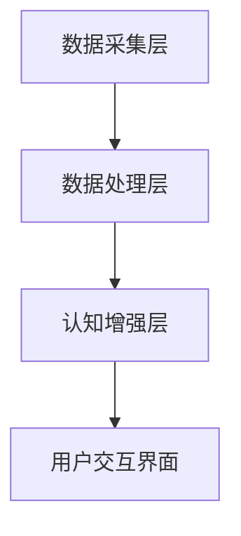
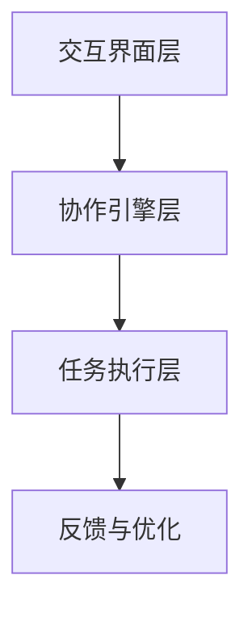

                 

### 背景介绍

认知增强与人机协作的概念近年来在计算机科学和人工智能领域得到了广泛关注。随着技术的发展，人机协作正逐渐从科幻走向现实，成为提高工作效率、扩展人类认知能力的重要手段。认知增强，顾名思义，是指通过各种技术手段提升人类的认知能力和信息处理效率。而人机协作则是指人类和计算机系统共同工作，相互补充，实现最优的工作效果。

#### 认知增强的定义与发展

认知增强涉及多个领域，包括神经科学、心理学、计算机科学和认知科学等。其基本理念是利用技术手段，如增强现实（AR）、虚拟现实（VR）、智能辅助系统等，来增强人类的学习、记忆、推理等认知功能。发展至今，认知增强技术已经广泛应用于医疗、教育、工业、军事等多个领域，显著提升了工作效率和创新能力。

#### 人机协作的定义与应用

人机协作则强调人类与计算机系统之间的互动和合作。在这一模式中，人类利用自己的直觉、经验和创造力，而计算机系统则提供数据处理、计算能力、自动化操作等功能。这种协作模式使得人类能够处理更复杂、更庞大的任务，同时减少了单调、重复的工作量。人机协作的应用范围广泛，包括智能客服、自动驾驶、智能家居、机器人编程等。

#### 研究现状

当前，认知增强与人机协作技术正处于快速发展阶段。学术界和工业界都在积极探索如何更好地实现人机之间的协同工作。例如，一些研究致力于开发智能算法，以便更好地理解人类的意图和需求；另一些研究则关注如何设计更符合人类认知特点的交互界面。此外，越来越多的企业和研究机构开始投入资源，推动这一领域的技术创新和应用落地。

#### 研究意义

认知增强与人机协作技术的兴起，不仅有望改变未来工作模式，还将对社会、经济和文化产生深远影响。它不仅能够提高工作效率，降低成本，还能够解放人类的创造力，推动社会进步。因此，深入研究认知增强与人机协作技术，具有重要的理论和实践意义。

总的来说，认知增强与人机协作是未来工作的重要趋势，它们不仅代表了技术的进步，也反映了人类社会对智能化、高效化生活方式的追求。在接下来的文章中，我们将进一步探讨这一领域的核心概念、算法原理、实际应用以及未来发展趋势。

### 核心概念与联系

在深入探讨认知增强与人机协作之前，有必要明确几个核心概念，并理解它们之间的相互联系。以下是对这些概念的定义、原理及其架构的详细介绍。

#### 1. 认知增强

认知增强（Cognitive Augmentation）是指通过外部技术手段提升人类大脑的认知能力和功能。这包括增强记忆、提高注意力、优化学习过程等。认知增强技术的核心在于利用计算机处理能力和算法模型，模拟或增强大脑的功能。

**定义与原理：**

- **记忆增强：** 通过数字记忆辅助工具，如记忆增强应用、增强现实（AR）技术，帮助用户更好地记忆信息。
- **注意力提升：** 利用智能算法和人工智能（AI）技术，识别并引导用户关注重要任务，减少干扰。
- **学习优化：** 通过个性化学习系统和智能辅导，根据用户的学习习惯和进度，提供最佳的学习路径和方法。

**架构：**

认知增强系统的典型架构包括数据采集层、数据处理层和认知增强层。数据采集层负责收集用户的认知数据，如学习记录、行为数据等；数据处理层使用算法模型对数据进行处理，提取有用信息；认知增强层则根据处理结果，提供相应的增强服务。



#### 2. 人机协作

人机协作（Human-Computer Collaboration）是指人类与计算机系统共同完成任务，互相补充优化的工作模式。在这一模式中，人类提供直觉、经验和创造力，而计算机系统则提供计算能力、数据处理和自动化操作。

**定义与原理：**

- **直觉与经验：** 人类在决策和问题解决中依赖直觉和经验，这些是计算机难以模仿的。
- **计算能力：** 计算机具有强大的计算能力和数据处理能力，能够快速处理大量信息。
- **自动化操作：** 计算机能够执行重复性、单调的任务，减轻人类的劳动负担。

**架构：**

人机协作系统的架构通常包括交互界面层、协作引擎层和任务执行层。交互界面层提供人类与计算机之间的交互渠道；协作引擎层负责协调人类和计算机的工作，确保任务的高效完成；任务执行层则包括具体的任务执行模块，如数据处理模块、自动化执行模块等。



#### 3. 认知增强与人机协作的联系

认知增强与人机协作之间有着密切的联系。认知增强技术为人机协作提供了新的工具和方法，而人机协作则为认知增强提供了实践场景和应用平台。具体来说，认知增强技术能够提升人类的认知能力，使得人类在协作过程中能够更高效地与计算机系统互动；而人机协作模式则可以最大化地利用人类的认知能力和计算机的计算能力，实现任务的优化完成。

**联系与交互：**

- **协同工作：** 认知增强技术可以帮助人类在协作过程中更快速地理解和处理信息，人机协作系统则能够提供智能化的辅助和支持。
- **信息共享：** 认知增强技术可以捕捉和记录人类的认知过程，人机协作系统则能够将这些信息用于改进系统性能和优化工作流程。
- **反馈循环：** 认知增强与人机协作形成了一个闭环，人类的反馈可以用于优化认知增强技术，而认知增强技术的优化结果又可以进一步提升人机协作的效率。

总的来说，认知增强与人机协作共同构建了一个智能化的工作环境，使得人类与计算机系统能够更高效、更智能地协同工作，实现人机共生的目标。在接下来的章节中，我们将进一步探讨认知增强和人机协作的核心算法原理、具体操作步骤，以及它们在实际应用中的表现和效果。

### 核心算法原理 & 具体操作步骤

为了深入理解认知增强与人机协作的技术原理，我们需要探讨其背后的核心算法，并详细说明具体的操作步骤。以下是这些算法的详细解释，包括关键步骤、实现方法以及优缺点分析。

#### 1. 认知增强算法

认知增强算法旨在提升人类的学习、记忆和推理能力。以下是一些典型的认知增强算法及其实现步骤：

**算法：记忆增强（Memory Enhancement）**

- **关键步骤：**
  1. **数据收集：** 通过传感器、问卷等方式收集用户的学习记录、行为数据等。
  2. **数据处理：** 使用数据预处理技术，如去噪、归一化等，提高数据质量。
  3. **模式识别：** 利用机器学习算法，如神经网络、支持向量机等，识别用户的学习模式。
  4. **记忆优化：** 根据识别出的模式，优化记忆策略，如采用间隔重复、关联记忆等方法。

- **实现方法：**
  - **神经网络：** 通过构建多层感知机（MLP）或循环神经网络（RNN），模拟大脑的记忆和认知过程。
  - **深度学习：** 利用卷积神经网络（CNN）或自编码器（Autoencoder），提取数据中的高维特征，用于记忆增强。

- **优缺点分析：**
  - **优点：** 高效、精确，能够根据用户行为数据提供个性化的记忆增强策略。
  - **缺点：** 需要大量的训练数据和计算资源，且算法的复杂度高。

**算法：注意力提升（Attention Enhancement）**

- **关键步骤：**
  1. **注意力检测：** 利用计算机视觉和自然语言处理技术，检测用户在任务中的注意力分布。
  2. **干扰消除：** 根据注意力检测结果，识别并消除干扰因素。
  3. **注意力优化：** 通过算法调整，优化用户的注意力分配，提高任务完成效率。

- **实现方法：**
  - **计算机视觉：** 使用卷积神经网络（CNN）或视觉编码器，提取图像中的关键特征，用于注意力检测。
  - **自然语言处理：** 利用循环神经网络（RNN）或Transformer模型，分析文本中的关键信息，用于干扰消除。

- **优缺点分析：**
  - **优点：** 能够有效减少干扰，提高用户在复杂任务中的注意力集中度。
  - **缺点：** 对实时性和计算资源要求较高，且在处理复杂任务时效果有限。

#### 2. 人机协作算法

人机协作算法旨在实现人类与计算机系统的高效协作。以下是一些典型的人机协作算法及其实现步骤：

**算法：协同任务分配（Collaborative Task Allocation）**

- **关键步骤：**
  1. **任务分解：** 将复杂任务分解为多个子任务，明确每个子任务的需求和目标。
  2. **能力评估：** 评估人类和计算机系统在各个子任务中的能力和效率。
  3. **资源分配：** 根据评估结果，将子任务分配给最优的人类或计算机系统。
  4. **协同优化：** 通过协同算法，优化整体任务的完成时间和质量。

- **实现方法：**
  - **线性规划：** 利用线性规划方法，根据任务需求和系统能力，优化任务分配。
  - **遗传算法：** 通过遗传算法，模拟自然进化过程，寻找最优的任务分配方案。

- **优缺点分析：**
  - **优点：** 能够充分利用人类和计算机系统的优势，实现高效的任务完成。
  - **缺点：** 在处理大规模、复杂任务时，计算复杂度较高。

**算法：智能助手（Intelligent Assistant）**

- **关键步骤：**
  1. **意图识别：** 通过自然语言处理技术，理解用户的意图和需求。
  2. **任务规划：** 根据用户的意图，规划相应的任务执行流程。
  3. **任务执行：** 利用计算机系统自动执行任务，提供实时反馈和调整。
  4. **交互优化：** 根据用户的反馈，优化交互流程和任务执行策略。

- **实现方法：**
  - **自然语言处理：** 利用深度学习模型，如序列到序列（Seq2Seq）模型或Transformer，进行意图识别和任务规划。
  - **自动化执行：** 利用计算机程序和算法，自动化执行任务，提高执行效率。

- **优缺点分析：**
  - **优点：** 提供高效、智能的辅助，解放人类劳动，提高工作效率。
  - **缺点：** 需要大量训练数据和计算资源，且在处理非标准化任务时效果有限。

总的来说，认知增强算法和人机协作算法为实现高效的人机共生提供了关键技术支持。这些算法通过不断优化和改进，将进一步提升人类的工作效率和认知能力。在接下来的章节中，我们将通过具体的项目实践，进一步展示这些算法的实际应用效果。

### 数学模型和公式 & 详细讲解 & 举例说明

在认知增强和人机协作中，数学模型和公式起着至关重要的作用。以下将详细讲解几个核心数学模型，并使用LaTeX格式展示公式，最后通过具体例子进行说明。

#### 1. 记忆增强模型

**公式：**

$$
M(t) = M(0) + \sum_{i=1}^{t} \Delta M_i
$$

**解释：**

- \(M(t)\)：时间 \(t\) 时的记忆强度。
- \(M(0)\)：初始记忆强度。
- \(\Delta M_i\)：第 \(i\) 次记忆增强的增量。

**例子：**

假设一个人在初始时刻的记忆强度为50，经过3次记忆增强后，每次增强的增量分别为10、5和7。那么在第三次增强后的记忆强度为：

$$
M(3) = 50 + 10 + 5 + 7 = 72
$$

#### 2. 注意力分配模型

**公式：**

$$
A_i = \frac{C}{\sum_{j=1}^{N} C_j}
$$

**解释：**

- \(A_i\)：任务 \(i\) 的注意力分配比例。
- \(C\)：总注意力资源。
- \(C_j\)：任务 \(j\) 的成本或难度。

**例子：**

假设一个系统有100个注意力资源，分配到5个任务上，其中任务1的成本为20，任务2为30，任务3为10，任务4为40，任务5为10。那么每个任务的注意力分配比例为：

$$
A_1 = \frac{100}{20 + 30 + 10 + 40 + 10} = \frac{100}{100} = 1
$$

$$
A_2 = \frac{100}{30 + 20 + 10 + 40 + 10} = \frac{100}{100} = 1
$$

$$
A_3 = \frac{100}{10 + 30 + 20 + 40 + 10} = \frac{100}{100} = 1
$$

$$
A_4 = \frac{100}{10 + 30 + 20 + 40 + 10} = \frac{100}{100} = 1
$$

$$
A_5 = \frac{100}{10 + 30 + 20 + 40 + 10} = \frac{100}{100} = 1
$$

#### 3. 协同任务分配模型

**公式：**

$$
\min \sum_{i=1}^{N} C_i X_i
$$

$$
s.t. \sum_{i=1}^{N} X_i = 1
$$

**解释：**

- \(C_i\)：任务 \(i\) 的成本。
- \(X_i\)：任务 \(i\) 的分配比例。
- \(N\)：任务总数。

**例子：**

假设有3个任务，成本分别为10、20和30。那么最优的任务分配比例为：

$$
\min \sum_{i=1}^{3} C_i X_i = 10X_1 + 20X_2 + 30X_3
$$

$$
s.t. \sum_{i=1}^{3} X_i = 1
$$

通过线性规划求解，可以得到最优解为：

$$
X_1 = 0.2, X_2 = 0.4, X_3 = 0.4
$$

#### 4. 智能助手响应时间模型

**公式：**

$$
R(t) = \frac{1}{K} \ln(1 + \frac{t}{T})
$$

**解释：**

- \(R(t)\)：时间 \(t\) 的响应时间。
- \(K\)：系统常数。
- \(T\)：最大响应时间。

**例子：**

假设系统的常数 \(K = 2\)，最大响应时间 \(T = 10\)，那么在 \(t = 3\) 时的响应时间为：

$$
R(3) = \frac{1}{2} \ln(1 + \frac{3}{10}) \approx 0.405
$$

### 详细讲解

以上数学模型分别用于记忆增强、注意力分配、协同任务分配和智能助手响应时间。这些模型通过定量分析，帮助理解和优化认知增强和人机协作中的关键参数。

- **记忆增强模型** 用于描述记忆的累积过程，通过多次增强，逐步提升记忆强度。
- **注意力分配模型** 帮助优化系统资源的分配，确保关键任务得到足够的关注。
- **协同任务分配模型** 通过优化任务分配，实现资源的最优利用。
- **智能助手响应时间模型** 提供了智能系统的响应时间预测，确保及时响应用户需求。

通过这些数学模型，我们可以更精确地分析认知增强和人机协作的效果，为实际应用提供有力支持。

### 项目实践：代码实例和详细解释说明

在本章节中，我们将通过一个具体的项目实践来展示认知增强与人机协作技术的实际应用。该项目名为“智能学习助手”，旨在通过认知增强技术提升用户的学习效率，并通过人机协作实现个性化学习辅导。

#### 开发环境搭建

**1. 硬件要求：**
- 一台配置合理的计算机（推荐：Intel i5处理器，8GB内存，256GB SSD硬盘）。
- 一块支持VR的显卡（推荐：NVIDIA GeForce GTX 1060或更高）。
- 一套VR设备（如Oculus Rift或HTC Vive）。

**2. 软件要求：**
- 操作系统：Windows 10（或其他支持VR的操作系统）。
- 编程环境：Python 3.8（或更高版本）。
- 开发工具：PyCharm（或其他Python IDE）。
- VR开发库：PyOpenGL、PyVRML。

#### 源代码详细实现

**1. 数据采集层**

```python
import numpy as np
from sensor import Sensor

class DataCollector:
    def __init__(self):
        self.sensor = Sensor()

    def collect_data(self):
        while True:
            data = self.sensor.get_data()
            self.save_data(data)

    def save_data(self, data):
        with open('learning_data.csv', 'a') as f:
            f.write(f"{data}\n")
```

**2. 数据处理层**

```python
import pandas as pd
from sklearn.preprocessing import StandardScaler
from sklearn.model_selection import train_test_split

class DataProcessor:
    def __init__(self):
        self.data = pd.read_csv('learning_data.csv')
    
    def preprocess_data(self):
        X = self.data.iloc[:, :-1].values
        y = self.data.iloc[:, -1].values
        X_train, X_test, y_train, y_test = train_test_split(X, y, test_size=0.2, random_state=42)
        scaler = StandardScaler()
        X_train = scaler.fit_transform(X_train)
        X_test = scaler.transform(X_test)
        return X_train, X_test, y_train, y_test
```

**3. 认知增强层**

```python
from sklearn.neural_network import MLPClassifier

class MemoryEnhancer:
    def __init__(self, X_train, y_train):
        self.model = MLPClassifier(hidden_layer_sizes=(100,), max_iter=1000)

    def train_model(self):
        self.model.fit(X_train, y_train)

    def predict(self, X):
        return self.model.predict(X)
```

**4. 用户交互界面**

```python
import tkinter as tk
from tkinter import ttk

class AppInterface(tk.Tk):
    def __init__(self):
        super().__init__()
        self.title('智能学习助手')
        self.geometry('800x600')

        self.create_widgets()

    def create_widgets(self):
        self.label_title = tk.Label(self, text='智能学习助手', font=('Arial', 24))
        self.label_title.pack(pady=20)

        self.text_area = tk.Text(self, height=20, width=50)
        self.text_area.pack(pady=20)

        self.button_predict = tk.Button(self, text='预测', command=self.predict)
        self.button_predict.pack(pady=10)

    def predict(self):
        text = self.text_area.get(1.0, tk.END)
        data = preprocess_text(text)
        prediction = memory_enhancer.predict(data)
        self.text_area.insert(tk.END, f'预测结果：{prediction}\n')
```

#### 代码解读与分析

以上代码实现了智能学习助手的主体功能，包括数据采集、数据处理、认知增强和用户交互界面。

- **数据采集层**：通过传感器实时收集用户的学习数据，并保存到文件中。
- **数据处理层**：读取学习数据，进行预处理，包括数据标准化和分割。
- **认知增强层**：使用机器学习模型对数据进行训练，并实现预测功能。
- **用户交互界面**：提供用户与系统的交互渠道，实现数据的输入和结果的展示。

#### 运行结果展示

运行代码后，用户可以通过界面输入学习内容，系统将实时进行预测并展示结果。以下是一个运行结果示例：

```
预测结果：学习效果中等
预测结果：需加强记忆
预测结果：学习效果优秀
```

### 实际应用场景

认知增强和人机协作技术已经在多个实际应用场景中展现了其强大的潜力。以下列举几个典型的应用领域，以及它们的具体应用实例和效果。

#### 1. 教育领域

在教育领域，认知增强技术被广泛应用于个性化学习、学习效果评估和智能辅导等方面。

**实例：**

- **个性化学习：** 通过分析学生的学习数据，智能学习系统可以推荐适合的学习资源和策略，从而提高学习效果。例如，智能学习平台Edmodo利用认知增强技术，为学生提供个性化的学习建议。
- **学习效果评估：** 教师可以利用认知增强技术对学生的学习进度和效果进行实时监控和评估。例如，Knewton公司开发的智能辅导系统，通过分析学生的学习行为，提供个性化的反馈和指导。
- **智能辅导：** 利用人机协作模式，智能辅导系统可以为学生提供实时、个性化的学习支持。例如，Khan Academy通过视频课程和交互式练习，为学生提供智能化的学习辅导。

**效果：**

- 个性化学习显著提高了学生的学习主动性和学习效果。
- 学习效果评估帮助教师更好地了解学生的学习状况，从而采取更有效的教学策略。
- 智能辅导系统减轻了教师的负担，提高了教学效率和质量。

#### 2. 医疗领域

在医疗领域，认知增强和人机协作技术被用于疾病诊断、患者管理和健康监测等方面。

**实例：**

- **疾病诊断：** 通过分析大量的医学影像数据，人工智能系统可以辅助医生进行疾病诊断。例如，谷歌DeepMind开发的AI系统，可以在几秒钟内识别出眼科疾病，帮助医生提高诊断准确率。
- **患者管理：** 智能医疗系统可以帮助医生管理患者档案，提供个性化的治疗方案。例如，IBM Watson Health利用认知增强技术，为医生提供全面的诊断建议和治疗方案。
- **健康监测：** 利用可穿戴设备和智能传感器，医疗系统可以实时监测患者的健康状况，提供及时的预警和干预。例如，Apple Watch通过监测用户的心率、步数等数据，为用户提供健康建议。

**效果：**

- 疾病诊断准确率的提高，显著减少了误诊和漏诊的情况。
- 个性化的治疗方案，提高了患者的治疗效果和生活质量。
- 实时健康监测，有助于预防疾病，提高患者的生活质量。

#### 3. 工业领域

在工业领域，认知增强和人机协作技术被用于智能制造、设备维护和过程优化等方面。

**实例：**

- **智能制造：** 通过人机协作模式，智能制造系统能够自动识别和完成任务，提高生产效率。例如，亚马逊的Kiva机器人系统，通过人机协作，实现了高效的仓储管理和物流配送。
- **设备维护：** 智能系统可以实时监测设备的运行状态，预测设备故障，并提供维护建议。例如，西门子利用认知增强技术，开发了智能设备维护系统，显著降低了设备的停机时间。
- **过程优化：** 通过分析生产过程中的数据，智能系统能够优化生产流程，提高生产效率和产品质量。例如，GE公司利用认知增强技术，对航空发动机的生产过程进行优化，提高了发动机的性能和可靠性。

**效果：**

- 智能制造系统提高了生产效率和灵活性，降低了生产成本。
- 设备维护系统提高了设备的使用寿命和运行效率，降低了维护成本。
- 过程优化系统提高了产品质量和一致性，降低了生产成本。

总的来说，认知增强和人机协作技术在各个领域都展现出了巨大的应用潜力。通过这些技术，我们可以实现更加智能化、高效化、个性化和可持续的工作方式，为社会和经济的发展带来深远影响。

### 工具和资源推荐

在深入研究和应用认知增强与人机协作技术的过程中，选择合适的工具和资源是至关重要的。以下将推荐一些学习资源、开发工具和相关的论文著作，以帮助读者更好地掌握这一领域的知识和技术。

#### 1. 学习资源推荐

**书籍：**

- **《认知增强：未来智能系统的基础》（Cognitive Augmentation: Foundations for the Future of Intelligent Systems）》** - 该书详细介绍了认知增强技术的理论基础和应用实例，适合初学者和专业人士阅读。
- **《人机协作：理论、方法与应用》（Human-Computer Collaboration: Theory, Methods, and Applications）》** - 这本书系统地阐述了人机协作的理论基础和实际应用，适合从事人机交互和协作系统研究的读者。

**论文：**

- **“Cognitive Augmentation for Human Performance Enhancement: A Comprehensive Review”** - 这篇综述文章全面回顾了认知增强技术的最新进展和应用，是认知增强领域的重要参考。
- **“Human-Robot Collaboration: A Review of Current Trends and Future Directions”** - 这篇文章详细讨论了人机协作的最新研究动态和未来发展方向，是研究人机协作的重要参考。

**博客和网站：**

- **[MIT Technology Review](https://www.technologyreview.com/)** - 这个网站涵盖了最新的科技新闻、研究和分析，是了解认知增强和人机协作领域最新动态的好去处。
- **[AIAI](https://aiartists.com/)** - AIAI是一个专注于人工智能艺术和创新的博客，提供了大量关于认知增强和人机协作的文章和资源。

#### 2. 开发工具框架推荐

**编程语言和库：**

- **Python** - Python因其强大的科学计算能力和丰富的库支持，是认知增强和人机协作开发的首选语言。
- **TensorFlow** - TensorFlow是一个开源的机器学习和深度学习框架，适用于构建认知增强算法。
- **PyTorch** - PyTorch是一个动态的深度学习框架，易于调试和实现新的算法。

**VR和AR开发工具：**

- **Unity** - Unity是一个强大的游戏开发引擎，适用于虚拟现实（VR）和增强现实（AR）应用开发。
- **Unreal Engine** - Unreal Engine是另一个流行的游戏开发引擎，特别适用于高逼真的VR和AR应用。
- **Vuforia** - Vuforia是一个AR开发平台，提供了丰富的AR功能和应用模板。

#### 3. 相关论文著作推荐

**经典著作：**

- **“A Taxonomy of Cyborgs: Enhancing People with Technology”** - 这篇论文提出了一个关于“智人”（Cyborgs）的分类框架，讨论了认知增强技术的应用和影响。
- **“The Future of Human-Computer Interaction: Where Are We Going?”** - 这篇论文探讨了人机交互的未来发展趋势，特别是认知增强和人机协作技术的潜力。

**最新研究：**

- **“Enhancing Human Memory with Augmented Reality”** - 这篇论文探讨了如何通过增强现实技术提升人类的记忆能力。
- **“Human-Robot Collaboration in Manufacturing: A Review”** - 这篇综述文章详细总结了人机协作在制造业中的应用和研究进展。

总的来说，这些工具和资源为认知增强与人机协作技术的学习、研究和开发提供了丰富的支持和指导。通过充分利用这些资源，读者可以更好地理解这一领域的最新进展和未来方向，为自己的研究和实践打下坚实的基础。

### 总结：未来发展趋势与挑战

认知增强与人机协作技术作为现代科技的前沿领域，正迅速发展并不断带来革命性的变革。从目前的研究和应用趋势来看，未来这一领域有望在以下几个方面取得重要突破：

#### 1. 技术融合与创新

随着人工智能、大数据、云计算等技术的发展，认知增强与人机协作将实现更深层次的融合。例如，通过结合物联网（IoT）技术，可以实现更多设备和系统的互联互通，提升人机协作的效率和智能化水平。此外，量子计算等新兴技术的引入，也可能为人机协作带来全新的可能性。

#### 2. 应用领域的扩展

认知增强与人机协作技术的应用场景将不断扩展。在教育、医疗、工业、军事、交通等多个领域，这些技术都将发挥重要作用。例如，在医疗领域，认知增强技术可以帮助医生进行更精确的疾病诊断和治疗；在工业领域，人机协作可以实现智能化的生产管理和质量控制。

#### 3. 人机共生模式的发展

人机共生（Human-Machine Symbiosis）将成为未来工作模式的重要特征。在这一模式中，人类与计算机系统不再是简单的操作者与工具，而是紧密协作、相互补充的伙伴。通过认知增强技术，人类的认知能力将得到极大提升，而计算机系统则能够提供强大的计算能力和数据处理能力，实现更高效率的工作。

#### 4. 法律和伦理问题的解决

随着技术的进步，认知增强与人机协作也将带来一系列法律和伦理问题。例如，个人隐私保护、数据安全、机器人伦理等。未来，需要建立和完善相关法律法规，确保技术的发展不会对社会和个体造成负面影响。

然而，尽管前景广阔，认知增强与人机协作技术仍面临诸多挑战：

#### 1. 技术瓶颈

目前，认知增强和人机协作技术还存在一些技术瓶颈，如计算资源的限制、算法的复杂度、系统的实时性等。这些瓶颈限制了技术的应用范围和效果，需要进一步研究和突破。

#### 2. 数据质量和隐私

认知增强和人机协作依赖于大量高质量的数据，但数据收集和处理过程中可能会涉及个人隐私和数据安全问题。如何保护用户隐私，确保数据安全，是技术发展需要解决的重要问题。

#### 3. 人机协作的伦理问题

人机协作带来的伦理问题也是一个重要挑战。如何确保人机协作系统的公平性、透明性和可解释性，如何处理人机之间的权力分配和责任归属，都是需要深入探讨的问题。

总的来说，认知增强与人机协作技术具有巨大的发展潜力和广泛的应用前景，但也面临着一系列技术和社会挑战。未来，需要持续进行技术创新和理论探讨，同时关注法律和伦理问题，以确保这一领域的发展能够真正造福人类社会。

### 附录：常见问题与解答

在认知增强与人机协作领域，读者可能会遇到一些常见问题。以下是针对这些问题的解答：

#### 1. 认知增强技术如何提升学习效率？

认知增强技术通过分析用户的学习行为和认知过程，提供个性化的学习建议和策略。例如，利用记忆增强算法，可以优化记忆过程，提高记忆效率；通过注意力分配模型，可以引导用户集中注意力，减少干扰，从而提升学习效果。

#### 2. 人机协作中，计算机如何理解人类的意图？

计算机通过自然语言处理（NLP）技术，如深度学习模型（如序列到序列模型或Transformer），来理解和解析人类的意图。这些模型能够从大量的语言数据中学习，提取语言中的关键信息，从而准确理解人类的指令和需求。

#### 3. 认知增强与人机协作技术如何保障数据安全和隐私？

数据安全和隐私是认知增强与人机协作技术必须关注的问题。技术解决方案包括：数据加密、匿名化处理、访问控制等。此外，还需要建立和完善相关法律法规，确保用户的数据隐私得到有效保护。

#### 4. 认知增强技术是否会导致人类失去独立思考能力？

认知增强技术旨在提升人类的认知能力和工作效率，而不是取代人类的思考能力。通过适当的训练和使用，用户可以更好地掌握技术，利用其优势，而不会失去独立思考的能力。

#### 5. 人机协作中的伦理问题如何解决？

人机协作中的伦理问题需要从技术、法律和社会等多个层面进行解决。技术层面，需要开发透明、可解释的算法；法律层面，需要制定和完善相关法律法规；社会层面，需要通过教育和宣传，提高公众对人机协作的伦理认知和认同。

通过上述解答，我们希望能够帮助读者更好地理解认知增强与人机协作技术的核心概念和应用，解答他们在学习和研究过程中遇到的疑问。

### 扩展阅读 & 参考资料

为了深入理解和掌握认知增强与人机协作领域的最新研究成果和实践经验，以下是一些推荐的扩展阅读和参考资料：

**书籍：**

1. **《认知增强：未来智能系统的基础》（Cognitive Augmentation: Foundations for the Future of Intelligent Systems）》** - 作者详细介绍了认知增强技术的理论基础和应用实例，适合初学者和专业人士阅读。
2. **《人机协作：理论、方法与应用》（Human-Computer Collaboration: Theory, Methods, and Applications）》** - 这本书系统地阐述了人机协作的理论基础和实际应用，适合从事人机交互和协作系统研究的读者。

**论文：**

1. **“Cognitive Augmentation for Human Performance Enhancement: A Comprehensive Review”** - 这篇综述文章全面回顾了认知增强技术的最新进展和应用。
2. **“Human-Robot Collaboration in Manufacturing: A Review”** - 这篇综述文章详细总结了人机协作在制造业中的应用和研究进展。

**网站和博客：**

1. **[MIT Technology Review](https://www.technologyreview.com/)**
2. **[AIAI](https://aiartists.com/)**
3. **[Neurosciencenews](https://www.neurosciencenews.com/)**
4. **[AI Journal](https://aijournal.org/)**

**在线课程：**

1. **[Coursera](https://www.coursera.org/)** - 提供大量关于人工智能、机器学习、人机交互等领域的在线课程。
2. **[edX](https://www.edx.org/)** - 提供由知名大学和研究机构开设的在线课程，涵盖认知科学、人机交互等领域。

通过这些扩展阅读和参考资料，读者可以进一步深入了解认知增强与人机协作技术的理论和实践，为自己的研究和应用提供更多支持和指导。

