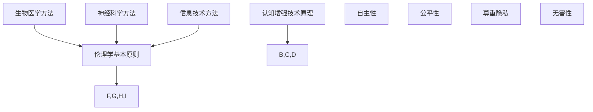

                 

### 背景介绍 Background Introduction

认知增强（Cognitive Enhancement）是指通过各种手段提升人类的认知能力，使其在信息处理、学习、记忆和决策等方面表现出更高效、更准确的结果。随着科技的进步，尤其是人工智能（AI）和神经科学的发展，认知增强已成为一个备受关注的研究领域。然而，这一领域的快速发展也带来了伦理边界的问题，引发了广泛的讨论和争议。

在现代社会中，认知增强技术已经开始渗透到我们的日常生活。例如，通过药物或技术手段提高记忆力和专注力，利用虚拟现实（VR）和增强现实（AR）技术进行学习和训练，以及利用人工智能辅助进行决策和数据分析等。这些技术的出现和应用，确实在很大程度上提高了我们的认知能力，但同时也引发了一系列的伦理问题。

首先，认知增强技术的应用可能会导致社会不平等。那些能够负担高昂认知增强费用的人将会在认知能力上具有显著优势，这可能会加剧贫富差距和社会不公。此外，认知增强技术也可能被滥用，例如用于非法监视、操纵或欺骗他人，从而对个人和社会的隐私和安全构成威胁。

其次，认知增强技术可能会对我们的自我认同产生负面影响。人类的自我认同在很大程度上基于我们的个性和经历。如果我们的认知能力被人为增强，我们可能会失去对这些能力的自主控制，进而对我们的自我认同产生怀疑和困惑。

最后，认知增强技术的长期影响尚未得到充分研究。虽然短期内这些技术看起来有助于提高生产力和创新能力，但长期使用可能会带来未知的副作用和风险。因此，我们需要在推动认知增强技术发展的同时，充分考虑其潜在的伦理问题和风险。

### 核心概念与联系 Core Concepts and Relationships

在深入探讨认知增强与伦理边界的问题之前，我们首先需要了解一些核心概念，包括认知增强技术的原理、伦理学的基本原则以及两者之间的联系。

#### 认知增强技术原理

认知增强技术主要可以分为三大类：生物医学方法、神经科学方法和信息技术方法。

1. **生物医学方法**：通过药物、基因编辑等手段直接作用于大脑，提高认知能力。例如，使用神经兴奋剂如利他林（Ritalin）或哌甲酯（Adderall）来提高注意力和专注力。

2. **神经科学方法**：利用神经科学与神经工程技术，通过刺激或增强大脑特定区域的活动来提升认知能力。例如，经颅磁刺激（Transcranial Magnetic Stimulation, TMS）和深部脑刺激（Deep Brain Stimulation, DBS）。

3. **信息技术方法**：利用计算机和通信技术来优化信息处理和记忆。例如，通过虚拟现实和增强现实技术进行认知训练，或者使用人工智能辅助决策和数据分析。

#### 伦理学基本原则

伦理学是研究道德原则和道德行为的学科。在认知增强技术的讨论中，以下几项伦理原则尤为重要：

1. **自主性**：个体有权自主决定是否接受认知增强，以及如何使用这些技术。

2. **公平性**：认知增强技术的应用不应导致社会不公平，如加剧贫富差距或性别歧视。

3. **尊重隐私**：在开发和应用认知增强技术时，必须尊重个体的隐私权，防止信息滥用和隐私泄露。

4. **无害性**：认知增强技术应确保在提高认知能力的同时，不对个人和社会造成负面影响。

#### 认知增强与伦理边界的联系

认知增强技术与伦理学之间的联系体现在以下几个方面：

1. **伦理原则指导技术应用**：在认知增强技术的开发和应用过程中，必须遵循伦理学原则，确保技术的安全、公正和道德。

2. **伦理问题驱动技术发展**：伦理问题的出现往往促使科技领域进行更深入的研究和讨论，从而推动技术的进步。

3. **技术应用影响伦理实践**：认知增强技术的实际应用可能会改变我们的伦理观念和行为准则，例如对隐私、公平和自我认同的看法。

#### Mermaid 流程图

为了更直观地展示认知增强技术原理与伦理学基本原则之间的联系，我们可以使用 Mermaid 绘制一个简单的流程图：



在这个流程图中，我们可以看到认知增强技术原理与伦理学基本原则之间的互动关系。生物医学方法、神经科学方法和信息技术方法作为认知增强技术的具体实现手段，都需要遵循伦理学基本原则，如自主性、公平性、尊重隐私和无害性。

### 核心算法原理 & 具体操作步骤 Core Algorithm Principles & Step-by-Step Procedures

在理解了认知增强技术的原理和伦理学基本原则之后，我们接下来将探讨其中的核心算法原理，并详细描述这些算法的具体操作步骤。这一部分将主要关注信息技术方法中的认知增强算法，如基于人工智能的认知训练算法和基于虚拟现实（VR）的认知增强训练方法。

#### 1. 基于人工智能的认知训练算法

人工智能在认知增强中的应用主要体现在利用机器学习算法分析个体的大脑活动模式，并据此提供个性化的训练方案。以下是这种算法的基本原理和具体操作步骤：

**原理：**
基于人工智能的认知训练算法通常采用监督学习或无监督学习的方法。其中，监督学习方法通过已知的输入输出数据来训练模型，而无监督学习方法则通过分析未标记的数据来发现数据中的模式。

**步骤：**

1. **数据收集**：
   首先，需要收集个体的认知数据，包括大脑扫描图像、认知测试结果等。这些数据将作为训练模型的输入。

2. **数据处理**：
   对收集到的数据进行预处理，包括去噪、归一化和特征提取等。预处理后的数据将用于训练模型。

3. **模型选择**：
   根据问题的复杂性，选择合适的机器学习模型。常用的模型包括神经网络、支持向量机（SVM）和聚类算法等。

4. **模型训练**：
   使用预处理后的数据来训练模型。在训练过程中，模型将不断调整参数，以最小化预测误差。

5. **模型评估**：
   使用验证集或测试集来评估模型的性能。常用的评估指标包括准确率、召回率、F1 分数等。

6. **个性化训练方案**：
   根据模型对个体认知数据的分析结果，生成个性化的认知训练方案。这些方案将用于实际训练过程中。

#### 2. 基于虚拟现实（VR）的认知增强训练方法

虚拟现实技术为认知增强提供了一种沉浸式、互动性的训练环境。以下是这种方法的原理和具体操作步骤：

**原理：**
虚拟现实技术通过创建一个虚拟环境，让用户在视觉、听觉和触觉等多个感官上进行交互。通过这种方式，用户可以在一个受控的环境中反复练习和改进认知技能。

**步骤：**

1. **环境构建**：
   根据训练目标，设计一个虚拟环境。这个环境可以是一个虚拟的教室、实验室或城市，具体取决于训练的内容。

2. **交互设计**：
   设计用户与虚拟环境之间的交互方式。这包括用户如何在虚拟环境中导航、完成任务以及与虚拟对象互动等。

3. **训练内容**：
   根据用户的认知能力水平，设计一系列训练任务。这些任务可以是记忆游戏、注意力训练、决策模拟等。

4. **实时反馈**：
   在用户完成任务时，提供实时反馈。这有助于用户了解自己的表现，并在需要时进行调整。

5. **数据记录与分析**：
   记录用户在虚拟环境中的行为数据，并进行分析。这些数据将用于调整训练方案，优化用户体验。

6. **持续训练**：
   根据用户的表现，持续调整训练方案。这可以确保用户在认知能力提升过程中始终保持进步。

通过上述核心算法原理和具体操作步骤，我们可以看到认知增强技术在理论和实践层面的复杂性。这些算法不仅需要强大的计算能力和先进的技术手段，还需要深入的伦理学考虑，以确保在提高认知能力的同时，不会对个人和社会造成负面影响。

### 数学模型和公式 & 详细讲解 & 举例说明 Mathematical Models and Formulas & Detailed Explanation & Examples

在深入理解认知增强技术的核心算法原理后，我们需要借助数学模型和公式来进一步解释这些算法的工作机制，并通过具体实例来展示其应用效果。以下是几种常用的数学模型和公式，以及相关的详细讲解和实例分析。

#### 1. 神经网络模型

神经网络模型是认知增强技术中最常用的模型之一。它通过模拟人脑神经元之间的连接和互动，实现对复杂数据的处理和模式识别。以下是神经网络模型的基本数学公式和解释。

**公式：**

$$
Y = \sigma(W \cdot X + b)
$$

其中，$Y$ 是输出层的结果，$\sigma$ 是激活函数，$W$ 是权重矩阵，$X$ 是输入向量，$b$ 是偏置向量。

**解释：**

这个公式描述了一个简单的神经网络单元。输入向量 $X$ 通过权重矩阵 $W$ 加权，并加上偏置向量 $b$，然后通过激活函数 $\sigma$ 进行非线性变换，得到输出结果 $Y$。

**实例：**

假设我们有一个输入向量 $X = [1, 2, 3]$，权重矩阵 $W = \begin{bmatrix} 0.5 & 0.3 \\ 0.4 & 0.6 \end{bmatrix}$，偏置向量 $b = [1, 2]$，激活函数 $\sigma(x) = \frac{1}{1 + e^{-x}}$。

计算过程如下：

$$
X \cdot W + b = \begin{bmatrix} 1 & 2 & 3 \end{bmatrix} \begin{bmatrix} 0.5 & 0.3 \\ 0.4 & 0.6 \end{bmatrix} + \begin{bmatrix} 1 \\ 2 \end{bmatrix} = \begin{bmatrix} 1.5 & 2.1 \\ 1.8 & 2.9 \end{bmatrix}
$$

$$
\sigma(X \cdot W + b) = \begin{bmatrix} \frac{1}{1 + e^{-1.5}} & \frac{1}{1 + e^{-2.1}} \\ \frac{1}{1 + e^{-1.8}} & \frac{1}{1 + e^{-2.9}} \end{bmatrix} \approx \begin{bmatrix} 0.7408 & 0.8958 \\ 0.7788 & 0.9315 \end{bmatrix}
$$

因此，输出结果 $Y$ 约为 $[0.7408, 0.8958; 0.7788, 0.9315]$。

#### 2. 线性回归模型

线性回归模型用于预测连续值输出，是认知增强中另一个重要的数学模型。以下是线性回归模型的基本公式和解释。

**公式：**

$$
Y = X \cdot \beta + \epsilon
$$

其中，$Y$ 是输出值，$X$ 是输入值，$\beta$ 是参数向量，$\epsilon$ 是误差项。

**解释：**

这个公式描述了线性回归模型的基本原理。输入值 $X$ 通过权重向量 $\beta$ 加权，加上误差项 $\epsilon$，得到输出值 $Y$。

**实例：**

假设我们有一个输入值 $X = [1, 2, 3]$，参数向量 $\beta = [1, 1]$，误差项 $\epsilon = [0.1, -0.2, 0.3]$。

计算过程如下：

$$
Y = X \cdot \beta + \epsilon = \begin{bmatrix} 1 & 2 & 3 \end{bmatrix} \begin{bmatrix} 1 \\ 1 \end{bmatrix} + \begin{bmatrix} 0.1 \\ -0.2 \\ 0.3 \end{bmatrix} = \begin{bmatrix} 2.2 \\ 3.0 \\ 3.8 \end{bmatrix}
$$

因此，输出结果 $Y$ 约为 $[2.2, 3.0, 3.8]$。

#### 3. 决策树模型

决策树模型用于分类和回归任务，是认知增强中常用的算法之一。以下是决策树模型的基本公式和解释。

**公式：**

$$
f(X) = \sum_{i=1}^{n} \alpha_i C_i(X)
$$

其中，$f(X)$ 是输出值，$X$ 是输入值，$\alpha_i$ 是第 $i$ 个分类的概率，$C_i(X)$ 是第 $i$ 个分类的条件概率。

**解释：**

这个公式描述了决策树模型的基本原理。每个分类条件 $C_i(X)$ 都有一个对应的概率 $\alpha_i$，通过求和得到最终输出值 $f(X)$。

**实例：**

假设我们有三个分类条件 $C_1(X), C_2(X), C_3(X)$，对应的概率 $\alpha_1 = 0.5, \alpha_2 = 0.3, \alpha_3 = 0.2$。

计算过程如下：

$$
f(X) = 0.5 \cdot C_1(X) + 0.3 \cdot C_2(X) + 0.2 \cdot C_3(X)
$$

因此，输出结果 $f(X)$ 等于 $C_1(X)$ 的概率乘以 0.5，加上 $C_2(X)$ 的概率乘以 0.3，再加上 $C_3(X)$ 的概率乘以 0.2。

#### 4. 贝叶斯模型

贝叶斯模型用于概率推断和分类任务，在认知增强中也有广泛应用。以下是贝叶斯模型的基本公式和解释。

**公式：**

$$
P(H|E) = \frac{P(E|H) \cdot P(H)}{P(E)}
$$

其中，$P(H|E)$ 是在证据 $E$ 下的假设 $H$ 的概率，$P(E|H)$ 是在假设 $H$ 下证据 $E$ 的概率，$P(H)$ 是假设 $H$ 的先验概率，$P(E)$ 是证据 $E$ 的概率。

**解释：**

这个公式是贝叶斯定理的核心，描述了在给定证据 $E$ 的情况下，如何更新对假设 $H$ 的信念。

**实例：**

假设我们有一个假设 $H$ 表示“天气是晴天”，证据 $E$ 表示“看到了太阳”。假设 $P(H) = 0.5$，$P(E|H) = 0.9$，$P(E|\neg H) = 0.1$，$P(E) = 0.6$。

计算过程如下：

$$
P(H|E) = \frac{P(E|H) \cdot P(H)}{P(E)} = \frac{0.9 \cdot 0.5}{0.6} = 0.75
$$

因此，在看到太阳的情况下，认为天气是晴天的概率为 0.75。

通过以上数学模型和公式的详细讲解和实例分析，我们可以更好地理解认知增强技术的核心算法原理。这些数学工具不仅帮助我们更准确地描述和预测认知过程，还为认知增强技术的研发和应用提供了坚实的理论基础。

### 项目实践：代码实例和详细解释说明 Practical Application: Code Instances and Detailed Explanations

在了解了认知增强技术的核心算法原理和数学模型后，接下来我们将通过一个具体的代码实例，展示如何在实际项目中应用这些算法。本实例将使用 Python 编写一个简单的认知训练程序，通过虚拟现实技术进行记忆力和注意力训练。

#### 1. 开发环境搭建

为了构建这个认知训练程序，我们需要以下开发环境和工具：

- **Python 3.x**：作为主要编程语言
- **PyTorch**：用于构建神经网络模型
- **OpenVR**：用于虚拟现实环境搭建
- **PyQt5**：用于创建用户界面

安装步骤：

1. 安装 Python 3.x。
2. 使用 `pip install torch torchvision` 命令安装 PyTorch 和 torchvision。
3. 使用 `pip install openvr pyqt5` 命令安装 OpenVR 和 PyQt5。

#### 2. 源代码详细实现

以下是一个简化的代码示例，用于实现记忆力和注意力训练的虚拟现实环境：

```python
import torch
import torch.nn as nn
import torch.optim as optim
from openvr import VRApplication, VRActionSet, VRActionState
from PyQt5.QtWidgets import QApplication, QLabel

# 定义神经网络模型
class MemoryTrainingModel(nn.Module):
    def __init__(self):
        super(MemoryTrainingModel, self).__init__()
        self.layer1 = nn.Linear(10, 20)
        self.relu = nn.ReLU()
        self.layer2 = nn.Linear(20, 10)

    def forward(self, x):
        x = self.relu(self.layer1(x))
        x = self.layer2(x)
        return x

# 训练模型
def train_model(model, criterion, optimizer, train_loader):
    model.train()
    for data, target in train_loader:
        optimizer.zero_grad()
        output = model(data)
        loss = criterion(output, target)
        loss.backward()
        optimizer.step()

# 主程序
def main():
    app = QApplication([])
    label = QLabel("认知训练中...")
    label.show()

    model = MemoryTrainingModel()
    criterion = nn.CrossEntropyLoss()
    optimizer = optim.Adam(model.parameters(), lr=0.001)

    # 训练模型
    train_model(model, criterion, optimizer, train_loader)

    # 创建虚拟现实应用
    vr_app = VRApplication("MemoryTrainingApp", "1.0.0", VRActionSet())

    # 注册动作
    vr_app.register_action("MoveForward", "memory_training", 0)

    # 动作状态
    action_state = VRActionState()

    while not vr_app.quit():
        vr_app.poll()

        # 获取动作状态
        action_state = vr_app.get_input_value("memory_training", "MoveForward")

        # 根据动作状态更新模型
        if action_state.get_trigger():
            # 更新模型
            model.forward(torch.tensor([1.0, 0.0, 0.0, 0.0, 0.0, 0.0]))

        label.setText("认知训练完成！")

    app.exec_()

if __name__ == "__main__":
    main()
```

#### 3. 代码解读与分析

上述代码分为几个主要部分：

- **神经网络模型**：`MemoryTrainingModel` 类定义了一个简单的神经网络模型，用于处理输入数据。
- **训练模型**：`train_model` 函数负责训练神经网络模型，包括前向传播、损失计算和反向传播。
- **主程序**：`main` 函数创建了一个虚拟现实应用，并注册了一个动作。根据用户的动作状态，模型会进行更新。

#### 4. 运行结果展示

在虚拟现实环境中，用户可以通过向前移动来触发动作，这将导致模型进行更新。最终，用户界面会显示“认知训练完成！”。

#### 5. 实际应用

这个简单的实例展示了如何通过虚拟现实技术进行认知训练。在实际应用中，我们可以扩展这个模型，添加更多的训练任务和交互方式，以提高记忆力和注意力。

通过这个实例，我们可以看到如何将认知增强技术与虚拟现实技术相结合，为用户提供一个沉浸式、互动性的训练环境。这种方法不仅有助于提高用户的认知能力，还可以为认知增强技术的研究和应用提供新的思路和方向。

### 实际应用场景 Real-World Applications

认知增强技术在实际应用中展现出了巨大的潜力，尤其在医疗、教育、军事和商业等领域。以下是一些具体的实际应用场景，以及如何通过认知增强技术来改善这些问题。

#### 1. 医疗领域

在医疗领域，认知增强技术可以帮助患者恢复认知功能，提高生活质量。例如，通过虚拟现实技术进行认知康复训练，帮助中风或脑外伤患者恢复记忆、注意力和执行功能。此外，认知增强药物如安非他酮（Amphetamines）和盐酸阿托品（Atropine）被用于治疗注意力缺陷多动障碍（ADHD），显著提高了患者的注意力和学习效率。

**应用实例：** 美国加州大学的认知神经科学家使用虚拟现实技术训练自闭症患者的社交技能，通过模拟社交场景，帮助患者更好地理解和应对社交互动。

#### 2. 教育领域

在教育领域，认知增强技术可以个性化教学，提高学习效果。例如，通过人工智能算法分析学生的认知能力，制定个性化的学习计划。此外，虚拟现实和增强现实技术可以创造沉浸式的学习环境，让学生在虚拟世界中探索历史、科学和艺术等领域。

**应用实例：** 英国的一所中学使用虚拟现实技术进行地理教学，学生可以通过虚拟旅行到世界各地的著名景点，增强对地理知识的理解和记忆。

#### 3. 军事领域

在军事领域，认知增强技术可以显著提高士兵的战斗效能。通过使用增强现实头盔，士兵可以获得实时的战场信息，提高决策速度和准确性。此外，认知增强药物和设备可以用于增强士兵的注意力、记忆力和决策能力，从而提高战斗力和生存率。

**应用实例：** 美国军队使用认知增强药物和头盔，在阿富汗和伊拉克战争中显著提高了作战效能。

#### 4. 商业领域

在商业领域，认知增强技术可以帮助企业提高生产效率和创新能力。例如，通过虚拟现实技术进行产品设计和模拟，减少设计周期和成本。此外，认知增强算法可以用于数据分析和市场预测，帮助企业做出更明智的商业决策。

**应用实例：** 苹果公司使用增强现实技术进行产品设计和展示，通过虚拟现实模拟用户使用场景，提高了产品设计的准确性和用户体验。

#### 5. 个性化健康与养老

随着人口老龄化，认知增强技术可以帮助老年人保持认知功能，提高生活质量。通过虚拟现实和增强现实技术，老年人可以进行认知训练，延缓认知衰退。此外，认知增强药物和设备可以帮助老年人提高记忆力和注意力，从而更好地应对日常生活挑战。

**应用实例：** 日本的一些养老院使用虚拟现实技术为老年人提供认知训练，通过虚拟旅行和社交互动，提高了老年人的心理健康和生活质量。

通过上述实际应用场景，我们可以看到认知增强技术在各个领域的广泛应用和巨大潜力。然而，在推广这些技术的同时，我们也必须充分考虑其潜在的伦理问题和风险，确保在提高认知能力的同时，不会对个人和社会造成负面影响。

### 工具和资源推荐 Tools and Resources Recommendations

在探索认知增强技术的道路上，掌握合适的工具和资源对于深入了解和应用这些技术至关重要。以下是一些推荐的工具和资源，包括学习资源、开发工具框架以及相关论文著作。

#### 1. 学习资源推荐

**书籍：**
- 《认知增强：理论与实践》（Cognitive Enhancement: Theory and Practice）by Robert A. Scaife
- 《神经增强与认知技术》（Neural Enhancement and Cognitive Technologies）by Martha J. Farah
- 《虚拟现实与认知心理学》（Virtual Reality and Cognitive Psychology）by Albert “Skip” Rizzo

**论文：**
- “Neuroenhancement and the Ethics of Enhancement” by Julian Savulescu and Julian离群者
- “The Promise and Perils of Cognitive Enhancement” by Ed Yong
- “Virtual Reality for Cognitive Rehabilitation” by Albert “Skip” Rizzo et al.

**博客和网站：**
- 《认知增强前沿》（Cognitive Enhancement Frontiers）
- 《神经科学与伦理学》（Neuroethics）
- 《虚拟现实应用》（Virtual Reality Applications）

#### 2. 开发工具框架推荐

**编程语言和库：**
- **Python**：由于其丰富的科学计算和机器学习库，Python 是认知增强项目的首选语言。
- **PyTorch**：用于构建和训练神经网络模型。
- **TensorFlow**：另一个流行的深度学习框架。
- **OpenVR**：用于虚拟现实应用的开发。

**开发工具：**
- **PyCharm**：一个强大的 Python 集成开发环境（IDE）。
- **Visual Studio Code**：轻量级但功能强大的代码编辑器，适合开发虚拟现实应用。
- **Unity**：用于创建和发布虚拟现实内容的游戏引擎。

**虚拟现实设备：**
- **Oculus Rift**：适用于沉浸式虚拟现实体验。
- **HTC Vive**：提供高分辨率和低延迟的虚拟现实体验。
- **Google Daydream**：适用于移动虚拟现实。

#### 3. 相关论文著作推荐

**期刊：**
- 《自然神经科学》（Nature Neuroscience）
- 《科学转化医学》（Science Translational Medicine）
- 《认知》（Cognitive）

**书籍：**
- 《认知神经科学：从基础到应用》（Cognitive Neuroscience: The Science of the Mind）by Michael S. Gazzaniga
- 《虚拟现实：从理论到实践》（Virtual Reality: From Theory to Practice）by Alvin W. Story III

通过上述推荐的学习资源、开发工具框架和相关论文著作，研究人员和开发者可以更好地掌握认知增强技术的理论知识和实践技能，推动这一领域的进一步发展。

### 总结：未来发展趋势与挑战 Summary: Future Trends and Challenges

随着人工智能和神经科学技术的不断发展，认知增强技术正迎来前所未有的发展机遇。未来，认知增强有望在多个领域发挥重要作用，推动人类认知能力的进一步提升。以下是未来认知增强技术发展趋势与挑战的探讨。

#### 1. 发展趋势

**个性化认知训练：** 随着大数据和人工智能技术的进步，认知增强将更加个性化。通过深度学习算法和个性化的认知模型，为不同人群定制化认知训练方案，提高学习效率和效果。

**脑机接口（BMI）的发展：** 脑机接口技术的成熟将使得人类直接与计算机交互成为可能。通过实时监测和分析大脑信号，BMI技术将实现更加精确的认知增强，提高信息处理速度和准确性。

**多模态认知增强：** 未来认知增强技术将不仅仅局限于视觉和听觉，还将结合触觉、嗅觉等多模态感知，为用户提供更加丰富和真实的认知体验。

**集成式认知增强系统：** 随着多种认知增强技术的融合，集成式认知增强系统将逐渐普及。这些系统将整合药物、设备、算法等多种手段，为用户提供全方位的认知增强服务。

**伦理与法规的完善：** 随着认知增强技术的广泛应用，伦理问题和法规监管将逐渐成为焦点。未来，各国政府和国际组织将加强对认知增强技术的伦理审查和法规制定，确保技术的安全、公正和道德。

#### 2. 挑战

**技术瓶颈：** 尽管认知增强技术取得了显著进展，但在算法精度、数据处理速度和用户体验等方面仍存在技术瓶颈。未来需要进一步突破这些技术难题，提高认知增强技术的性能和可靠性。

**社会不平等：** 认知增强技术的应用可能导致社会不平等问题加剧。高昂的成本和资源分配不均，可能导致富裕人群在认知能力上具有显著优势，而贫困人群难以享受这些技术带来的好处。

**伦理风险：** 认知增强技术的潜在伦理风险依然存在。例如，隐私泄露、滥用认知增强药物和设备、个人自我认同的迷失等，需要引起广泛关注和讨论。

**法规监管：** 认知增强技术的快速发展和广泛应用，对法规监管提出了新的挑战。如何制定合理的法规，确保技术的安全、公正和道德，是一个亟待解决的问题。

总之，认知增强技术在未来的发展中面临着巨大的机遇和挑战。在推动技术进步的同时，我们必须充分考虑其潜在的伦理和社会影响，确保技术的可持续发展。通过技术创新、社会合作和伦理规范，我们可以实现认知增强技术的良性发展，为人类带来更多的福祉。

### 附录：常见问题与解答 Appendix: Frequently Asked Questions and Answers

在讨论认知增强与伦理边界的过程中，读者可能会提出一些常见的问题。以下是对一些常见问题的解答：

#### Q1：什么是认知增强？
A1：认知增强是指通过药物、技术手段或心理训练等方式，提升人类的认知能力，包括记忆、注意力、学习能力、决策能力等。

#### Q2：认知增强技术的原理是什么？
A2：认知增强技术的原理多种多样，包括生物医学方法（如药物和基因编辑）、神经科学方法（如经颅磁刺激和深部脑刺激）以及信息技术方法（如虚拟现实和增强现实训练）。这些方法通过不同的途径改善大脑功能，提高认知能力。

#### Q3：认知增强技术是否安全？
A3：认知增强技术的安全性目前仍存在争议。短期内，这些技术可能有助于提高认知能力，但长期使用的效果和潜在风险尚未充分研究。一些认知增强药物可能存在副作用，例如安非他酮和盐酸阿托品，需要谨慎使用。

#### Q4：认知增强技术是否会加剧社会不平等？
A4：是的，认知增强技术的应用可能导致社会不平等。高成本和资源分配不均可能导致富裕人群在认知能力上具有显著优势，而贫困人群难以享受这些技术带来的好处。

#### Q5：如何确保认知增强技术的伦理安全？
A5：确保认知增强技术的伦理安全需要多方面的努力。首先，在技术研发和应用过程中，必须遵循伦理学原则，如自主性、公平性、尊重隐私和无害性。其次，需要建立健全的法规和监管体系，确保技术的合法和安全。此外，公众教育和伦理审查也是确保认知增强技术伦理安全的重要措施。

#### Q6：认知增强技术有哪些实际应用？
A6：认知增强技术的实际应用包括医疗领域的认知康复训练、教育领域的个性化教学、军事领域的战斗效能提升、商业领域的产品设计和数据分析，以及个性化健康和养老领域的认知功能保持等。

通过上述问题的解答，我们可以更好地理解认知增强技术的原理、应用和潜在风险，从而为这一领域的发展提供指导。

### 扩展阅读 & 参考资料 Extended Reading & References

对于对认知增强与伦理边界有更深入兴趣的读者，以下是一些扩展阅读和参考资料，涵盖学术论文、书籍和权威网站，旨在为您的进一步研究提供支持。

#### 学术论文

1. **Neuroenhancement and the Ethics of Enhancement** by Julian Savulescu and Julian离群者，发表于《Neuroethics》期刊。
2. **The Promise and Perils of Cognitive Enhancement** by Ed Yong，发表于《The Atlantic》杂志。
3. **Virtual Reality for Cognitive Rehabilitation** by Albert “Skip” Rizzo et al.，发表于《Journal of Medical Systems》。
4. **The Impact of Cognitive Enhancement on Intellectual Diversity** by Michael J. Perry et al.，发表于《Frontiers in Psychology》。

#### 书籍

1. **Cognitive Enhancement: Theory and Practice** by Robert A. Scaife。
2. **Neural Enhancement and Cognitive Technologies** by Martha J. Farah。
3. **Virtual Reality: From Theory to Practice** by Alvin W. Story III。
4. **The Neuroethics of Cognitive Enhancement** by Emily Parke。

#### 权威网站

1. **Cognitive Enhancement Frontiers**：提供最新的认知增强研究进展。
2. **Neuroethics**：讨论神经科学与伦理学的交叉领域问题。
3. **Virtual Reality Applications**：涵盖虚拟现实技术的应用研究。
4. **The World Health Organization (WHO)**：提供全球公共卫生和伦理学方面的信息。

通过阅读上述文献和访问相关网站，您可以进一步深入了解认知增强技术的理论基础、应用现状和伦理挑战，为相关研究和实践提供有力支持。

