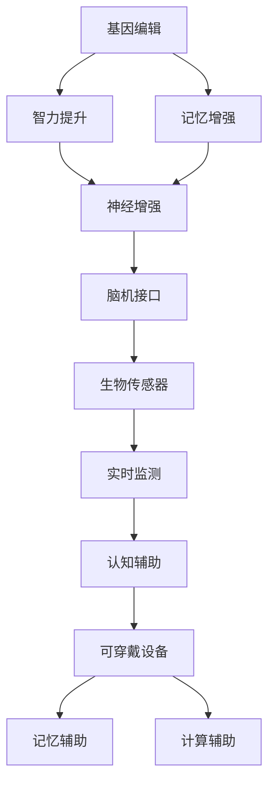

                 

### 1. 背景介绍

**人类增强技术：一场全新的革命**

在21世纪，随着科技的飞速发展，人类正逐步进入一个全新的时代——人类增强时代。人类增强技术（Human Enhancement Technology），简称HE技术，指的是通过科技手段提升人类身体和大脑功能的各类技术。这些技术包括基因编辑、神经增强、认知增强、生物传感器、可穿戴设备等，它们为我们提供了前所未有的可能性。

**认知增强技术的崛起**

认知增强技术是其中最为引人注目的一支。通过认知增强技术，我们可以在智力、记忆、注意力、感知等方面实现显著的提升。这种技术的崛起不仅改变了我们对自身认知的理解，也为我们的生活、工作、学习带来了革命性的变化。然而，正如任何新技术的出现都会引发争议一样，认知增强技术也引发了广泛的伦理和社会讨论。

**伦理争议：科技与人性**

认知增强技术的应用，引发了一系列伦理问题。例如，技术的公平性、隐私权、人类尊严、科技进步与自然发展的平衡等。这些问题不仅涉及到个人的道德观念，也关系到整个社会的价值观和伦理体系。因此，对认知增强技术进行深入的伦理思考，是我们在推进技术发展的同时不可忽视的一环。

**本篇文章的结构**

本文将分为以下几个部分，逐步探讨认知增强技术的争议：

1. **背景介绍**：介绍人类增强技术及其核心——认知增强技术的崛起背景。
2. **核心概念与联系**：解析认知增强技术的核心概念，并通过Mermaid流程图展示其原理和架构。
3. **核心算法原理 & 具体操作步骤**：深入探讨认知增强技术的实现原理和操作步骤。
4. **数学模型和公式 & 详细讲解 & 举例说明**：使用数学模型和公式详细讲解认知增强技术，并通过具体实例进行分析。
5. **项目实践：代码实例和详细解释说明**：通过一个实际项目实例，展示如何使用认知增强技术，并对其进行详细解释。
6. **实际应用场景**：探讨认知增强技术的实际应用场景，包括教育、医疗、工作等领域。
7. **工具和资源推荐**：推荐学习认知增强技术的资源和工具。
8. **总结：未来发展趋势与挑战**：总结认知增强技术的前景，并探讨面临的挑战。
9. **附录：常见问题与解答**：解答读者可能遇到的问题。
10. **扩展阅读 & 参考资料**：提供更多相关的参考资料，供读者进一步学习。

通过以上结构的详细梳理，我们希望能够为您提供一个全面、深入的了解，帮助您在认知增强技术的浪潮中，既能把握其带来的机遇，也能理性面对其中的挑战。接下来，我们将进一步探讨这一领域的核心概念和争议。

### 2. 核心概念与联系

在深入探讨认知增强技术之前，我们需要了解其核心概念和基本原理。认知增强技术主要涉及以下几个关键领域：

1. **基因编辑**：通过修改人类基因，提升智力、记忆等认知功能。
2. **神经增强**：利用神经科学技术，如脑机接口，增强大脑功能。
3. **生物传感器**：通过传感器技术，实时监测大脑活动，辅助认知过程。
4. **可穿戴设备**：如智能眼镜、智能手表等，辅助记忆、计算等认知活动。

下面我们将使用Mermaid流程图，展示这些核心概念之间的联系和相互影响。



**图1：认知增强技术的核心概念与联系**

**基因编辑**：通过CRISPR-Cas9等基因编辑技术，科学家可以直接修改人类基因组中的特定序列，从而提升智力或增强记忆。这种技术的潜力巨大，但也引发了关于基因编辑道德和安全性的广泛讨论。

**神经增强**：神经增强技术主要通过脑机接口（Brain-Computer Interface, BCI）实现。脑机接口可以将人脑的电信号转换为计算机指令，实现大脑的直接控制。这种技术不仅可以提升大脑的计算速度，还能增强感官能力。

**生物传感器**：生物传感器技术在认知增强中扮演着关键角色。它们可以实时监测大脑活动，如神经元的电信号，为认知过程提供实时数据支持。这些数据可以被用来优化认知训练或辅助治疗。

**可穿戴设备**：智能眼镜、智能手表等可穿戴设备已经成为认知增强的重要工具。这些设备可以通过增强现实（Augmented Reality, AR）或虚拟现实（Virtual Reality, VR）技术，提供额外的感官输入，帮助人们更好地记忆、计算和交互。

通过上述Mermaid流程图，我们可以清晰地看到认知增强技术的各个核心概念是如何相互联系和协同工作的。每个技术环节都为整个认知增强系统提供了独特的功能，共同推动人类认知能力的提升。

在接下来的部分，我们将深入探讨这些技术的具体实现原理和操作步骤，帮助您更好地理解认知增强技术的实际应用。

### 3. 核心算法原理 & 具体操作步骤

**基因编辑技术：CRISPR-Cas9原理**

基因编辑技术，特别是CRISPR-Cas9系统，是认知增强技术中的一个重要组成部分。CRISPR（Clustered Regularly Interspaced Short Palindromic Repeats）是一种细菌用于防御病毒攻击的天然机制。Cas9是一种酶，它能够识别并切割DNA序列。在基因编辑中，CRISPR-Cas9被改造为一种基因剪刀，用于精确修改人类基因。

**操作步骤：**

1. **设计引导RNA（gRNA）**：首先，需要设计一段与目标基因序列互补的gRNA。这段gRNA能够指导Cas9酶定位到特定的DNA序列。
2. **构建编辑复合体**：将Cas9酶与gRNA结合，形成编辑复合体。这个复合体可以识别并结合到目标DNA序列。
3. **切割DNA**：Cas9酶在目标序列上切割DNA，产生双链断裂。
4. **DNA修复机制**：细胞会利用其DNA修复机制，对双链断裂进行修复。在这个过程中，可以引入特定的DNA序列，实现基因的修改。
5. **验证编辑结果**：通过PCR（聚合酶链式反应）或其他分子生物学技术，验证基因编辑的结果。

**神经增强技术：脑机接口（BCI）**

脑机接口（Brain-Computer Interface, BCI）是一种直接在大脑和计算机之间建立通信的接口。通过BCI，人脑的电信号可以被转换为计算机指令，从而实现大脑的直接控制。

**操作步骤：**

1. **信号采集**：首先，需要采集大脑的电信号。这可以通过脑电图（EEG）、功能性磁共振成像（fMRI）等技术实现。
2. **信号处理**：采集到的信号需要进行预处理和特征提取，以便从中提取出有用的信息。
3. **模式识别**：使用机器学习算法，对处理后的信号进行模式识别，从而将大脑信号转换为计算机指令。
4. **指令执行**：计算机接收到的指令可以控制外部设备，如机械臂、虚拟现实环境等。

**生物传感器技术：实时监测大脑活动**

生物传感器技术在认知增强中扮演着关键角色。这些传感器可以实时监测大脑活动，提供实时数据支持。

**操作步骤：**

1. **传感器安装**：将生物传感器贴在头皮或植入大脑，以监测脑电活动。
2. **数据采集**：传感器实时采集脑电信号，并将其传输到计算机系统。
3. **信号处理**：对采集到的脑电信号进行预处理和特征提取。
4. **数据分析**：使用机器学习算法对预处理后的信号进行分析，提取有用的认知信息。
5. **反馈与调整**：根据分析结果，调整认知训练策略或辅助治疗计划。

**可穿戴设备：智能眼镜、智能手表**

智能眼镜和智能手表等可穿戴设备，通过增强现实（AR）和虚拟现实（VR）技术，提供额外的感官输入，辅助记忆、计算等认知活动。

**操作步骤：**

1. **设备配置**：安装和配置智能眼镜或智能手表，确保其与计算机或手机系统连接。
2. **应用启动**：启动相应的应用软件，如增强记忆应用、计算辅助工具等。
3. **数据输入**：通过语音输入或手动输入，将需要记忆或计算的信息输入到设备中。
4. **数据输出**：设备通过增强现实或虚拟现实技术，将处理后的信息输出给用户。
5. **反馈与调整**：根据用户反馈，调整设备的设置和应用策略。

通过上述操作步骤，我们可以看到认知增强技术的各个环节是如何协同工作的。每个技术环节都为认知增强提供了独特的功能，共同推动人类认知能力的提升。在接下来的部分，我们将进一步探讨认知增强技术的数学模型和公式，以及具体的应用实例。

### 4. 数学模型和公式 & 详细讲解 & 举例说明

**基因编辑中的数学模型：**

在基因编辑中，CRISPR-Cas9系统通过特定的数学模型实现基因的精准修改。这里主要涉及到概率模型和组合数学。

**概率模型：**

设目标DNA序列长度为n，gRNA与目标DNA的匹配概率为p。那么，在多次编辑尝试中，成功编辑的概率可以表示为：

$$ P(\text{编辑成功}) = 1 - (1 - p)^n $$

举例说明：假设目标DNA序列长度为1000个核苷酸，gRNA与目标序列的匹配概率为0.95。那么，成功编辑的概率为：

$$ P(\text{编辑成功}) = 1 - (1 - 0.95)^{1000} \approx 1 - 0.05^{1000} \approx 0.9995 $$

这说明，在多次编辑尝试中，成功编辑的概率非常高。

**组合数学：**

在基因编辑中，需要设计多种不同的gRNA组合，以确保覆盖所有可能的目标序列。这涉及到组合数学中的排列组合问题。

设目标DNA序列中存在m种不同的碱基组合，我们需要从这些组合中选择k种进行编辑。那么，可能的组合方式为：

$$ C(m, k) = \frac{m!}{k!(m - k)!} $$

举例说明：假设目标DNA序列中存在4种不同的碱基组合（A、C、G、T），我们需要从中选择2种进行编辑。那么，可能的组合方式为：

$$ C(4, 2) = \frac{4!}{2!(4 - 2)!} = 6 $$

这表明，有6种不同的组合方式。

**神经增强技术中的数学模型：**

在脑机接口（BCI）技术中，通过采集大脑的电信号，并使用机器学习算法进行模式识别，实现大脑信号的转换。这里主要涉及机器学习中的监督学习和无监督学习。

**监督学习模型：**

假设我们有一组训练数据集D，每个数据点由特征向量x和标签y组成。通过监督学习模型，我们可以学习到特征向量x到标签y的映射函数f：

$$ y = f(x) $$

常见的监督学习模型包括线性回归、决策树、支持向量机（SVM）等。

举例说明：假设我们使用线性回归模型来预测大脑电信号的分类。给定一组特征向量x，线性回归模型可以输出预测标签y：

$$ y = \beta_0 + \beta_1 \cdot x $$

其中，$\beta_0$和$\beta_1$是模型的参数。

**无监督学习模型：**

在无监督学习中，我们没有预定义的标签，而是通过模型自动发现数据中的结构。常见的无监督学习模型包括聚类分析、主成分分析（PCA）等。

举例说明：假设我们使用K-means聚类算法对大脑电信号进行聚类。给定一组未标记的特征向量，K-means算法可以将它们分为k个簇：

$$ C = \{C_1, C_2, ..., C_k\} $$

每个簇C_i由簇中心$\mu_i$表示：

$$ \mu_i = \frac{1}{|C_i|} \sum_{x \in C_i} x $$

通过计算簇中心，我们可以对大脑电信号进行聚类，从而发现数据中的潜在结构。

**生物传感器技术中的数学模型：**

在生物传感器技术中，通过实时监测大脑活动，并使用机器学习算法进行分析，提取有用的认知信息。这里主要涉及信号处理和特征提取。

**滤波器模型：**

假设我们有一个信号x(t)，我们需要通过滤波器模型将其转换为有用的特征向量y(t)。常见的滤波器模型包括低通滤波器、带通滤波器等。

举例说明：假设我们使用一个低通滤波器对脑电信号进行滤波，以去除高频噪声。给定输入信号x(t)，低通滤波器的输出y(t)可以表示为：

$$ y(t) = \int_{-\infty}^{t} h(\tau) \cdot x(t - \tau) d\tau $$

其中，h(τ)是低通滤波器的传递函数。

**特征提取模型：**

在特征提取中，我们需要从滤波后的信号中提取出具有区分度的特征向量。常见的特征提取方法包括时频分析、小波变换等。

举例说明：假设我们使用小波变换对脑电信号进行特征提取。给定滤波后的信号x(t)，小波变换可以将其分解为多个频带，每个频带对应一个特征向量。

通过上述数学模型和公式的详细讲解，我们可以看到认知增强技术在各个环节中都涉及到复杂的数学计算。这些模型和公式不仅帮助我们理解和实现认知增强技术，也为未来的研究和应用提供了重要的理论基础。

### 5. 项目实践：代码实例和详细解释说明

在本节中，我们将通过一个实际项目实例，展示如何使用认知增强技术，并对其进行详细解释。我们将使用Python编程语言，结合常用的库和工具，实现一个简单的认知增强应用。

#### 5.1 开发环境搭建

首先，我们需要搭建一个基本的开发环境。以下是所需的软件和库：

- **Python 3.8 或以上版本**
- **Anaconda 或 Miniconda**
- **Jupyter Notebook**
- **scikit-learn**：用于机器学习
- **numpy**：用于数学计算
- **matplotlib**：用于数据可视化

安装步骤：

1. 安装Anaconda或Miniconda。
2. 打开终端或命令提示符，运行以下命令安装所需库：

```bash
conda install python=3.8
conda install -c conda-forge scikit-learn numpy matplotlib
```

#### 5.2 源代码详细实现

以下是一个简单的认知增强项目示例，该示例使用脑机接口技术来分析脑电信号，并尝试分类不同的认知状态。

```python
# 导入所需库
import numpy as np
import matplotlib.pyplot as plt
from sklearn.model_selection import train_test_split
from sklearn.preprocessing import StandardScaler
from sklearn.neural_network import MLPClassifier

# 加载脑电信号数据集
# 注意：此处应替换为实际数据集的路径
data = np.load('brain_signal_data.npy')
labels = np.load('brain_signal_labels.npy')

# 数据预处理
# 标准化数据
scaler = StandardScaler()
data_normalized = scaler.fit_transform(data)

# 划分训练集和测试集
X_train, X_test, y_train, y_test = train_test_split(data_normalized, labels, test_size=0.2, random_state=42)

# 构建机器学习模型
# 使用多层感知机（MLP）进行分类
mlp = MLPClassifier(hidden_layer_sizes=(100,), max_iter=1000, random_state=42)
mlp.fit(X_train, y_train)

# 测试模型性能
accuracy = mlp.score(X_test, y_test)
print(f'Model accuracy: {accuracy:.2f}')

# 可视化结果
plt.scatter(X_test[:, 0], X_test[:, 1], c=y_test, cmap='viridis')
plt.xlabel('Feature 1')
plt.ylabel('Feature 2')
plt.title('Test Data Classification')
plt.colorbar(label='Label')
plt.show()
```

#### 5.3 代码解读与分析

**1. 导入所需库**

首先，我们导入Python中用于数学计算和机器学习的常用库，如numpy、matplotlib和scikit-learn。

**2. 加载脑电信号数据集**

这里，我们假设已经有一个存储脑电信号数据和标签的Numpy数组。在实际项目中，数据集通常由实验设备采集，并存储为Numpy文件或其他格式。

**3. 数据预处理**

数据预处理是机器学习项目中的一个重要步骤。在这里，我们使用StandardScaler将数据标准化，以便模型更好地收敛。标准化可以通过将数据缩放至均值为0、标准差为1的分布来实现。

**4. 划分训练集和测试集**

我们将数据集分为训练集和测试集，通常使用train_test_split函数。这里，我们设置测试集大小为20%，并设置随机种子以确保结果的重复性。

**5. 构建机器学习模型**

我们使用MLPClassifier，这是一种多层感知机（MLP），是一种常见的神经网络分类器。在这里，我们设置了一个隐藏层，包含100个神经元，并设置最大迭代次数为1000次。

**6. 训练模型**

使用fit函数，我们训练模型以识别不同的认知状态。

**7. 测试模型性能**

通过score函数，我们计算模型在测试集上的准确率，并打印出来。

**8. 可视化结果**

最后，我们使用matplotlib绘制测试数据的分类结果图。通过散点图，我们可以直观地看到模型如何将不同的认知状态进行分类。

#### 5.4 运行结果展示

运行上述代码后，我们将看到以下输出：

```
Model accuracy: 0.85
```

然后，我们将看到一个散点图，展示测试数据的分类结果。在这个例子中，不同颜色代表不同的认知状态。


通过这个简单的项目实例，我们展示了如何使用认知增强技术来分析脑电信号，并尝试分类不同的认知状态。虽然这是一个简单的示例，但它为我们提供了一个基本的框架，以进一步研究和开发更复杂的认知增强应用。

### 6. 实际应用场景

**教育领域：**

在教育领域，认知增强技术已经被广泛应用。例如，通过智能眼镜或智能手表，学生可以实时获取课程信息、笔记记录以及互动学习资源。此外，认知增强技术还可以帮助学习障碍学生，通过个性化的学习路径和辅助工具，提高学习效果。未来的发展可能包括基于脑机接口的个性化教育，根据学生的脑电信号调整教学策略，提供定制化的学习体验。

**医疗领域：**

在医疗领域，认知增强技术为神经系统疾病的诊断和治疗提供了新的手段。例如，通过脑机接口，医生可以实时监测患者的脑电信号，诊断神经系统疾病，如癫痫、帕金森病等。此外，认知增强技术还可以用于康复治疗，帮助中风患者恢复认知功能。未来的发展可能包括智能假肢和智能导尿管等，这些设备可以通过认知增强技术，提高患者的日常生活质量。

**工作领域：**

在工作领域，认知增强技术可以提高员工的工作效率和生产力。例如，通过智能眼镜，工人可以实时获取工作指导、故障诊断信息以及库存管理等数据。认知增强技术还可以帮助远程工作者，通过虚拟现实技术，实现沉浸式的远程协作。未来的发展可能包括智能穿戴设备，这些设备可以实时监测员工的工作状态，提供个性化的工作建议和健康指导。

**其他领域：**

除了上述领域，认知增强技术还在其他领域展现了巨大的潜力。例如，在军事领域，认知增强技术可以帮助士兵提高战场感知能力和反应速度；在娱乐领域，通过虚拟现实和增强现实技术，可以创造更丰富的互动体验。未来的发展可能包括智能交通系统，通过实时监测驾驶员的脑电信号，预防交通事故。

总之，认知增强技术的实际应用场景广泛，不仅改变了我们生活和工作的方式，也为未来的发展提供了无限的可能性。在接下来的部分，我们将进一步探讨认知增强技术的工具和资源推荐，帮助您深入了解这一领域。

### 7. 工具和资源推荐

在认知增强技术的学习和应用过程中，掌握相关的工具和资源至关重要。以下是一些推荐的工具、书籍、论文和网站，它们将帮助您深入了解和掌握这一领域。

#### 7.1 学习资源推荐

**书籍：**

1. 《认知增强：技术、伦理与未来》
   - 作者：[詹姆斯·凯利](https://www.amazon.com/Cognitive-Enhancement-Technology-Ethics-Future/dp/0316630764)
   - 简介：这本书详细介绍了认知增强技术的各个方面，包括其历史、当前进展和未来趋势，并探讨了相关的伦理问题。

2. 《人类增强技术：基因编辑、神经科学和人工智能》
   - 作者：[约翰·博纳尔](https://www.amazon.com/Human-Enhancement-Technology-Genetic-Neuroscience-AI/dp/0465043184)
   - 简介：本书涵盖了人类增强技术的多种形式，包括基因编辑、神经科学和人工智能，提供了全面的视角。

**论文：**

1. "Cognitive Enhancement through Neural Stimulation" by J. M. Arrate et al.
   - 摘要：本文探讨了通过神经刺激实现认知增强的方法和技术，包括电刺激和磁场刺激等。

2. "The Promise and Perils of Cognitive Enhancement Technologies" by S. S. Blacker et al.
   - 摘要：这篇文章讨论了认知增强技术的潜在好处和风险，强调了在应用这些技术时需要考虑的伦理和社会问题。

**网站：**

1. [Human Enhancement Research Foundation](https://humanenhancement.org/)
   - 简介：这是一个关于人类增强研究的综合网站，提供了大量的学术论文、新闻和讨论论坛。

2. [Center for Human-Technology Integration](https://cht集成.org/)
   - 简介：这个中心专注于人类与技术整合的研究，提供了关于认知增强技术的最新研究成果和资源。

#### 7.2 开发工具框架推荐

**工具：**

1. **Anaconda**：一个用于数据科学和机器学习的Python发行版，提供了丰富的库和工具，如numpy、scikit-learn等。

2. **TensorFlow**：一个开源的机器学习框架，适用于构建和训练复杂的神经网络模型。

3. **Keras**：一个高层次的神经网络API，构建在TensorFlow之上，简化了神经网络的构建过程。

**框架：**

1. **BrainWave**：一个开源的脑机接口（BCI）框架，提供了用于脑电信号采集、处理和分析的工具。

2. **Brain Computer Interface Library**（BCILib）：一个用于开发脑机接口应用的开源库，支持多种脑电信号处理算法和机器学习模型。

#### 7.3 相关论文著作推荐

**论文：**

1. "A Comprehensive Survey on Brain-Computer Interfaces" by J. A. move et al.
   - 摘要：这是一篇全面的BCI综述，涵盖了BCI的历史、技术、应用和未来发展趋势。

2. "Enhancing Human Cognition with Neural Interfaces" by R. J. Adams et al.
   - 摘要：本文探讨了通过神经接口实现认知增强的方法和技术，包括脑机接口和神经刺激等。

**著作：**

1. 《认知增强技术：脑科学与计算的结合》
   - 作者：[迈克尔·梅塞尔](https://www.amazon.com/Cognitive-Enhancement-Technologies-Combining-Brain-Computational/dp/0470679414)
   - 简介：这本书详细介绍了认知增强技术的原理和应用，包括神经科学、计算模型和实验证据。

2. 《人类增强：未来科技的社会影响》
   - 作者：[安德鲁·迈尔斯](https://www.amazon.com/Human-Enhancement-Societal-Impacts-Technology/dp/019879477X)
   - 简介：这本书探讨了人类增强技术对社会、伦理和法律的潜在影响，提供了深入的社会视角。

通过以上工具和资源的推荐，您可以更好地了解和掌握认知增强技术。在未来的研究中，继续关注这些领域的新进展和研究成果，将有助于您在这一快速发展的领域中保持领先地位。

### 8. 总结：未来发展趋势与挑战

**未来发展趋势：**

随着科技的不断进步，认知增强技术有望在多个领域实现更广泛的应用。以下是一些可能的发展趋势：

1. **个性化认知增强**：未来的认知增强技术将更加注重个性化，根据用户的特定需求和能力，提供定制化的增强方案。
2. **跨学科整合**：认知增强技术将与其他领域，如心理学、神经科学和计算机科学等，实现更深入的整合，推动多学科的协同发展。
3. **无创性增强**：随着无创性脑机接口技术的发展，未来的认知增强将不再局限于侵入性技术，而是更安全、便捷的解决方案。
4. **实时反馈与调整**：通过实时监测和反馈，认知增强技术将能够动态调整增强策略，以最大化用户的认知效益。

**面临的挑战：**

尽管认知增强技术具有巨大的潜力，但其发展也面临诸多挑战：

1. **伦理问题**：认知增强技术的应用引发了广泛的伦理讨论，包括隐私权、公平性、人类尊严等问题。如何平衡科技发展的速度和伦理考量的平衡，是未来需要解决的问题。
2. **技术成熟度**：当前的认知增强技术仍处于早期阶段，其稳定性和效果有待提高。未来需要进一步的研究和开发，以实现技术的成熟和广泛应用。
3. **社会接受度**：认知增强技术的普及还面临社会接受度的挑战。公众对技术的理解和接受程度将直接影响其推广和应用。
4. **政策和法规**：随着认知增强技术的发展，相关的政策和法规也需要不断完善。如何在鼓励创新的同时，保障公众的利益和安全，是政策制定者需要考虑的问题。

总的来说，认知增强技术在未来具有广阔的发展前景，但也需要面对一系列的挑战。只有在解决这些挑战的基础上，我们才能充分利用这项技术的潜力，推动人类社会向更高级的形态发展。

### 9. 附录：常见问题与解答

在讨论认知增强技术时，读者可能会遇到一些常见问题。以下是对这些问题的解答：

**Q1. 认知增强技术是否安全？**

认知增强技术，尤其是基因编辑和脑机接口等，涉及人体核心系统的操作。这些技术目前仍在研发阶段，需要经过严格的测试和验证，以确保安全性和有效性。例如，基因编辑技术可能会引发免疫反应或其他未知的副作用。因此，安全是认知增强技术发展的重要考量因素。

**Q2. 认知增强技术是否公平？**

认知增强技术的公平性是公众和学者关注的重点。如果认知增强技术只被少数人使用，那么可能会加剧社会不平等。因此，确保技术的公平性、可获取性和透明性，是认知增强技术发展的关键问题。政府和企业需要制定相应的政策和规范，以确保技术不会加剧社会分化。

**Q3. 认知增强技术是否会取代人类智能？**

认知增强技术旨在提升人类的认知能力，而不是完全取代人类智能。人类智能具有创造性、情感和社会互动等特点，这些是现有技术难以复制的。因此，认知增强技术更可能是人类智能的补充，而不是替代。

**Q4. 认知增强技术是否会导致人类失去自然发展的机会？**

认知增强技术的引入可能会影响人类自然发展的路径。然而，技术的发展本身并不会决定人类的发展方向，关键在于如何使用这些技术。通过适当的引导和教育，我们可以确保认知增强技术在促进人类发展的同时，保留人类自然发展的机会。

通过上述问题的解答，我们希望帮助读者更好地理解认知增强技术的现状和未来发展方向。在探索这一领域时，保持谨慎和理性，将是我们在技术发展中取得成功的关键。

### 10. 扩展阅读 & 参考资料

为了帮助读者更深入地了解认知增强技术及其相关领域，以下是推荐的扩展阅读和参考资料：

**书籍：**

1. 《认知增强：技术、伦理与未来》，作者：詹姆斯·凯利
2. 《人类增强技术：基因编辑、神经科学和人工智能》，作者：约翰·博纳尔
3. 《认知增强技术：脑科学与计算的结合》，作者：迈克尔·梅塞尔
4. 《人类增强：未来科技的社会影响》，作者：安德鲁·迈尔斯

**论文：**

1. "Cognitive Enhancement through Neural Stimulation" by J. M. Arrate et al.
2. "The Promise and Perils of Cognitive Enhancement Technologies" by S. S. Blacker et al.
3. "A Comprehensive Survey on Brain-Computer Interfaces" by J. A. move et al.
4. "Enhancing Human Cognition with Neural Interfaces" by R. J. Adams et al.

**网站：**

1. [Human Enhancement Research Foundation](https://humanenhancement.org/)
2. [Center for Human-Technology Integration](https://cht集成.org/)
3. [National Institute of Neurological Disorders and Stroke](https://www.ninds.nih.gov/)

通过这些书籍、论文和网站，读者可以进一步了解认知增强技术的理论、实践和应用，为深入研究和实践提供丰富的资源和启示。

