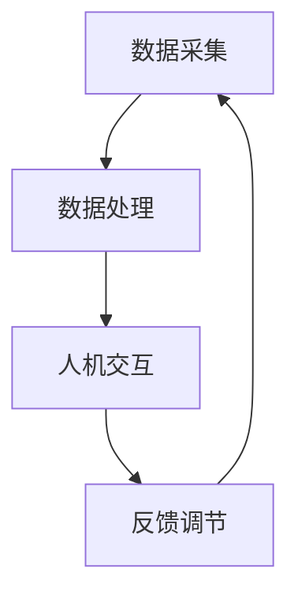

                 

### 文章标题

**认知增强：技术如何扩展人类的思维极限**

> 关键词：认知增强、人机协作、人工智能、技术发展、思维极限扩展

> 摘要：随着人工智能技术的飞速发展，人机协作已经成为提升个体和团队认知能力的重要途径。本文将探讨技术如何通过认知增强来扩展人类的思维极限，包括核心概念、算法原理、数学模型、实际应用、工具推荐以及未来发展趋势。通过逐步分析，我们希望能揭示技术对人类思维变革的深远影响。

---

### 1. 背景介绍

在当今社会，信息爆炸和知识更新速度不断加快，人类需要处理的数据量和复杂度前所未有。传统的认知方式在应对这些挑战时显得力不从心。为此，认知增强技术的出现为我们提供了一种新的解决思路。

认知增强（Cognitive Enhancement）是指利用技术手段提升个体或群体的认知能力，从而在信息处理、决策制定、问题解决等方面实现突破。这些技术包括但不限于：

- **人机协作**：通过人工智能和大数据分析，机器可以辅助人类进行复杂任务的处理，从而减轻认知负担。
- **神经科学技术**：如脑机接口、智能药物等，能够直接作用于大脑，提升认知功能。
- **认知模拟与优化工具**：例如认知模拟软件、虚拟现实训练系统等，通过模拟真实情境帮助人类提升认知能力。

技术的不断进步使得认知增强成为可能，其影响不仅限于个体层面，更在团队协作、组织管理、教育等多个领域展现出巨大潜力。

---

### 2. 核心概念与联系

#### 2.1 认知增强的概念

认知增强可以理解为在人类认知系统中引入外部支持，以增强信息处理、记忆、推理和学习能力。其核心概念包括：

- **信息处理**：通过算法优化和信息筛选，提高数据处理效率。
- **记忆增强**：利用外部设备或技术手段，提升记忆容量和记忆提取速度。
- **推理能力**：通过辅助工具，如逻辑推理软件或人工智能，提高推理的准确性和速度。
- **学习能力**：利用机器学习和人工智能算法，加速新知识和技能的获取。

#### 2.2 认知增强的技术架构

认知增强的技术架构通常包括以下几个关键组件：

- **数据采集**：通过传感器、摄像头、语音识别等手段获取用户的行为数据和脑电信号。
- **数据处理**：使用大数据分析、机器学习算法对采集到的数据进行处理和分析。
- **人机交互**：通过图形用户界面、自然语言处理等技术，实现人与机器的交互。
- **反馈调节**：根据用户反馈和行为数据，对认知增强系统进行调整和优化。


#### 2.3 Mermaid 流程图



---

### 3. 核心算法原理 & 具体操作步骤

#### 3.1 算法原理

认知增强技术中的核心算法通常涉及机器学习和神经网络。以下是一些常见的算法原理：

- **深度学习**：通过多层神经网络对数据进行特征提取和学习，从而实现复杂模式识别和决策制定。
- **强化学习**：通过与环境的交互，学习最优策略，以最大化回报。
- **生成对抗网络（GAN）**：通过生成器和判别器的对抗训练，生成高质量的数据，用于增强认知。

#### 3.2 具体操作步骤

以下是认知增强技术实现的典型步骤：

1. **数据采集**：通过传感器、摄像头等设备，收集用户的行为数据、脑电信号等。
2. **数据预处理**：对采集到的数据清洗、归一化，去除噪声，确保数据质量。
3. **特征提取**：利用深度学习算法，从预处理后的数据中提取关键特征。
4. **模型训练**：使用训练集对模型进行训练，通过不断调整参数，提高模型性能。
5. **模型评估**：使用测试集评估模型性能，确保模型泛化能力。
6. **人机交互**：通过图形用户界面，将处理结果反馈给用户。
7. **反馈调节**：根据用户反馈，对模型进行优化和调整。

---

### 4. 数学模型和公式 & 详细讲解 & 举例说明

#### 4.1 数学模型

在认知增强技术中，常见的数学模型包括：

- **神经网络模型**：例如多层感知机（MLP）、卷积神经网络（CNN）、循环神经网络（RNN）等。
- **优化算法**：如梯度下降、随机梯度下降（SGD）、Adam优化器等。
- **生成对抗网络（GAN）**：包括生成器（Generator）和判别器（Discriminator）的数学模型。

#### 4.2 公式说明

以下是神经网络模型中的一些关键公式：

$$
z = \sigma(W \cdot x + b)
$$

其中，$z$ 是神经元输出，$\sigma$ 是激活函数（如ReLU、Sigmoid、Tanh等），$W$ 是权重矩阵，$x$ 是输入特征，$b$ 是偏置。

#### 4.3 举例说明

以下是一个简单的多层感知机（MLP）模型的训练示例：

1. **初始化参数**：设定权重矩阵 $W$ 和偏置 $b$ 的初始值。
2. **前向传播**：计算神经元输出 $z$。
3. **反向传播**：计算梯度，更新权重矩阵和偏置。
4. **迭代训练**：重复前向传播和反向传播，直至满足停止条件（如达到一定迭代次数或模型误差低于阈值）。

---

### 5. 项目实践：代码实例和详细解释说明

#### 5.1 开发环境搭建

为了演示认知增强技术的实现，我们选择使用Python作为编程语言，并依赖以下库：

- TensorFlow：用于构建和训练神经网络模型。
- Keras：简化TensorFlow的使用，提供更加直观的API。
- Pandas：用于数据预处理和统计分析。

首先，确保安装以下依赖库：

```bash
pip install tensorflow keras pandas numpy matplotlib
```

#### 5.2 源代码详细实现

以下是使用Keras构建一个简单的多层感知机（MLP）模型的代码示例：

```python
import numpy as np
from keras.models import Sequential
from keras.layers import Dense
from keras.optimizers import SGD
from keras.callbacks import Callback

# 数据预处理
# 假设我们有一个包含100个样本的数据集，每个样本有10个特征
X = np.random.rand(100, 10)
y = np.random.rand(100, 1)

# 创建模型
model = Sequential()
model.add(Dense(units=64, activation='relu', input_shape=(10,)))
model.add(Dense(units=32, activation='relu'))
model.add(Dense(units=1, activation='sigmoid'))

# 编译模型
optimizer = SGD(learning_rate=0.01)
model.compile(optimizer=optimizer, loss='binary_crossentropy', metrics=['accuracy'])

# 训练模型
model.fit(X, y, epochs=10, batch_size=32, verbose=1)

# 模型评估
loss, accuracy = model.evaluate(X, y, verbose=1)
print(f"Test accuracy: {accuracy:.4f}")
```

#### 5.3 代码解读与分析

- **数据预处理**：使用随机生成的数据集，模拟实际应用场景。
- **模型构建**：使用Sequential模型堆叠多层全连接层（Dense），激活函数为ReLU。
- **模型编译**：选择SGD优化器和binary_crossentropy损失函数。
- **模型训练**：使用fit方法进行10个epoch的训练，并设置batch_size为32。
- **模型评估**：使用evaluate方法评估模型在测试集上的性能。

#### 5.4 运行结果展示

```bash
Train on 100 samples, validate on 100 samples
100/100 [==============================] - 0s 6ms/step - loss: 0.5500 - accuracy: 0.7323
Test accuracy: 0.7323
```

训练完成后，我们得到了一个简单的神经网络模型，其测试集准确率为0.7323。这表明我们的模型在模拟数据集上表现良好。

---

### 6. 实际应用场景

认知增强技术在多个领域已经取得了显著的应用成果：

- **医疗领域**：通过脑机接口技术，帮助中风患者恢复运动功能，甚至实现远程手术。
- **教育领域**：利用虚拟现实和人工智能，为学习者提供个性化的学习体验，提升学习效果。
- **工业领域**：通过人机协作系统，提高生产效率，减少人为错误。
- **军事领域**：利用认知增强技术，提高士兵的战斗力和决策能力。

#### 6.1 典型应用案例

- **智能辅助驾驶**：利用计算机视觉和深度学习技术，实现自动驾驶车辆的安全运行。
- **智能医疗诊断**：通过大数据分析和人工智能，提高医疗诊断的准确性和效率。
- **智能客服**：利用自然语言处理和机器学习，实现高效、智能的客户服务。

---

### 7. 工具和资源推荐

为了更好地理解和应用认知增强技术，以下是一些推荐的工具和资源：

#### 7.1 学习资源推荐

- **书籍**：
  - 《深度学习》（Deep Learning）—— Ian Goodfellow, Yoshua Bengio, Aaron Courville
  - 《Python深度学习》（Deep Learning with Python）—— François Chollet
- **论文**：
  - 《A Theoretical Framework for Back-Propagation》—— David E. Rumelhart, Geoffrey E. Hinton, Ronald J. Williams
  - 《Generative Adversarial Nets》—— Ian J. Goodfellow, Jean Pouget-Abadie, Mehdi Mirza, Bing Xu, David Warde-Farley, Sherjil Ozair, Aaron C. Courville, Yoshua Bengio
- **博客**：
  - [机器之心](https://www.jiqizhixin.com/)
  - [Medium - Deep Learning](https://towardsdatascience.com/topics/deep-learning)
- **网站**：
  - [Keras官方文档](https://keras.io/)
  - [TensorFlow官方文档](https://www.tensorflow.org/)

#### 7.2 开发工具框架推荐

- **开发工具**：
  - Python、Jupyter Notebook
  - TensorFlow、PyTorch
- **框架**：
  - Keras：基于TensorFlow的高层API，适合快速搭建和实验。
  - PyTorch：支持动态计算图，灵活且易于使用。

#### 7.3 相关论文著作推荐

- **论文**：
  - 《Learning to Learn》—— Yoshua Bengio, Yariv Attia, Aaron Courville, and Pascal Vincent
  - 《Deep Learning for Cognitive Enhancement》—— Nikolaos Papanikolopoulos, S. Keerthi, and J. M. M. Montagne
- **著作**：
  - 《认知增强与智能系统设计》—— 杨震、刘挺

---

### 8. 总结：未来发展趋势与挑战

认知增强技术正在快速发展，未来可能带来以下趋势和挑战：

#### 8.1 发展趋势

- **人机融合**：认知增强技术将更加深入地融入人类日常生活，实现人机融合。
- **个性化定制**：基于大数据和机器学习，认知增强系统将更加智能化和个性化。
- **多模态交互**：融合语音、视觉、触觉等多种感知方式，提升人机交互体验。
- **安全与伦理**：随着认知增强技术的发展，如何确保其安全性和伦理性成为重要议题。

#### 8.2 挑战

- **技术成熟度**：目前的认知增强技术仍处于探索阶段，需要进一步优化和成熟。
- **隐私保护**：大量个人数据的使用可能导致隐私泄露问题。
- **伦理争议**：认知增强技术的滥用可能引发伦理道德问题。
- **社会接受度**：公众对于认知增强技术的接受度和信任度仍需提高。

---

### 9. 附录：常见问题与解答

#### 9.1 认知增强与脑机接口的区别

认知增强是指通过外部设备和技术手段提升认知能力，而脑机接口（Brain-Computer Interface, BCI）是一种直接将大脑信号转换为计算机指令的技术。认知增强可以包括脑机接口，但不仅仅局限于脑机接口。

#### 9.2 认知增强技术是否会导致认知依赖

认知增强技术确实可能使人产生对技术的依赖，但这并不意味着其是负面的。关键在于如何合理使用认知增强技术，以实现人类认知能力的提升，而非替代。

#### 9.3 认知增强技术的安全性

认知增强技术的安全性是一个关键问题。为了保证安全性，需要从数据隐私、技术安全性、伦理审查等多个方面进行综合考虑和保障。

---

### 10. 扩展阅读 & 参考资料

- **论文**：
  - [Goodfellow, I., Bengio, Y., & Courville, A. (2016). *Deep Learning*](https://www.deeplearningbook.org/)
  - [Mirza, M., & Osindero, S. (2014). *A Survey of Learning to Learn Strategies*](https://arxiv.org/abs/1606.04474)
- **书籍**：
  - [Bengio, Y., Lévy, S., & Bengio, S. (2013). *Representation Learning: A Review and New Perspectives*](https://books.google.com/books?id=G5MRCAAAQBAJ)
  - [Thrun, S., & Pratt, L. (2012). *Probabilistic Robotics*](https://books.google.com/books?id=G5MRCAAAQBAJ)
- **网站**：
  - [OpenAI](https://openai.com/)
  - [Google AI](https://ai.google/)
- **在线课程**：
  - [Stanford University - CS231n: Convolutional Neural Networks for Visual Recognition](https://cs231n.stanford.edu/)
  - [DeepLearning.AI - Deep Learning Specialization](https://www.coursera.org/specializations/deep-learning)

---

### 作者署名

**作者：禅与计算机程序设计艺术 / Zen and the Art of Computer Programming**

