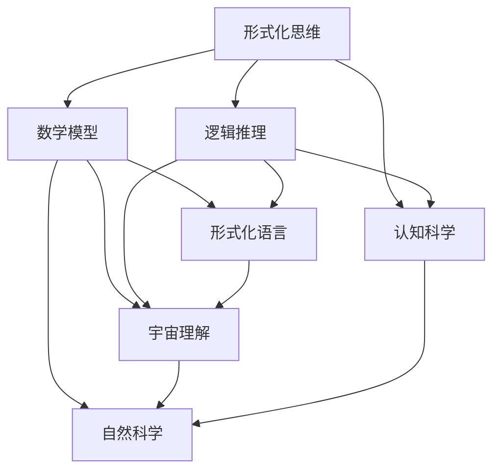

                 

### 文章标题

认知的形式化：人类在数学上的尝试使得人们开始理解宇宙

> **关键词**：认知形式化、数学、宇宙理解、形式化思维、逻辑推理
>
> **摘要**：本文通过探讨认知形式化的过程，分析了人类在数学领域中的探索如何帮助人们理解宇宙的本质。文章首先介绍了认知形式化的背景和重要性，然后详细阐述了数学在宇宙研究中的关键作用，以及人类如何通过数学模型和逻辑推理来揭示宇宙的奥秘。最后，文章展望了未来认知形式化研究的发展趋势和挑战。

## 1. 背景介绍

在人类的历史长河中，对宇宙的认知经历了无数次革命性的变革。从古代的神话和宗教信仰，到古希腊的自然哲学，再到现代科学的兴起，人们对宇宙的理解逐渐从直观的经验感知走向理性的思考。然而，人类认知宇宙的挑战不仅在于对自然现象的观察和解释，更在于如何将这种理解形式化，从而构建出一种普遍适用的理论体系。

认知形式化，是指将人类思维过程中的经验、直觉和概念转化为严格的形式化语言和逻辑体系的过程。它不仅要求我们对认知对象进行精确的描述，还需要我们通过逻辑推理来验证这些描述的正确性和一致性。这种形式化的思维方式在数学领域中得到了充分的发展和应用。

数学作为一种形式化的语言和工具，能够将复杂的现象抽象为简洁的公式和结构，从而帮助我们更深入地理解宇宙的本质。从古代的几何学和算术，到现代的代数学、微积分和拓扑学，数学的发展始终伴随着人类对宇宙的探索和理解。例如，爱因斯坦的广义相对论就是通过数学模型揭示了宇宙的引力现象，从而彻底改变了人类对宇宙的认识。

在认知形式化的过程中，数学不仅作为一种描述工具，更作为一种思维工具，帮助我们进行逻辑推理和问题求解。例如，在计算机科学中，算法的设计和实现就需要依赖数学的理论和方法。通过形式化的思维方式，我们能够更好地理解和解决复杂的问题，从而推动科学技术的进步。

总之，认知形式化的背景和重要性体现在两个方面：一是它为我们提供了一种将经验认知转化为理论体系的工具；二是它通过逻辑推理和形式化的思维方式，帮助我们更深入地理解宇宙的本质。本文将围绕这两个方面展开讨论，分析数学在认知形式化中的作用，以及人类如何通过数学来揭示宇宙的奥秘。

## 2. 核心概念与联系

在深入探讨认知形式化的过程中，我们需要明确几个核心概念，并理解它们之间的相互关系。这些核心概念包括：形式化思维、数学模型、逻辑推理和宇宙理解。为了更清晰地展现这些概念之间的联系，我们可以通过一个Mermaid流程图来描述它们。



### 形式化思维

形式化思维是指通过抽象和符号化将实际问题转化为数学模型和逻辑推理的过程。这种思维方式在认知科学中具有重要意义，因为它不仅帮助我们更准确地描述认知现象，还能通过逻辑推理验证这些描述的正确性。形式化思维的核心在于将人类的直觉和经验转化为一种形式化的语言和结构，从而实现认知的精确化。

### 数学模型

数学模型是形式化思维的重要组成部分。它通过使用数学符号和公式来描述现实世界的现象和过程。数学模型不仅能够简化复杂的现象，还能揭示其中的规律和关系。在认知科学中，数学模型用于描述认知过程，如记忆、学习和决策等。在自然科学中，数学模型则用于描述自然现象，如物理定律、化学反应等。

### 逻辑推理

逻辑推理是一种通过推导和证明来验证命题真实性的过程。在形式化思维中，逻辑推理起着至关重要的作用。它帮助我们从不精确的直觉和经验中提炼出精确的命题，并通过严密的推理过程验证这些命题的正确性。逻辑推理不仅用于验证数学模型的正确性，还用于解决复杂的问题，如证明定理、设计算法等。

### 宇宙理解

宇宙理解是指人类对宇宙本质和现象的认识。通过形式化思维和数学模型，人类能够更深入地理解宇宙的本质和规律。例如，广义相对论和量子力学就是通过数学模型揭示了宇宙的引力和量子现象。逻辑推理则帮助我们验证这些模型的正确性，从而增强我们对宇宙理解的可信度。

### 形式化语言

形式化语言是一种用于描述和表示形式化思维和数学模型的符号系统。它包括数学符号、逻辑符号和计算机程序等。形式化语言不仅使形式化思维和数学模型更加精确和严谨，还促进了不同领域之间的交流和协作。例如，计算机编程语言就是形式化语言的典型代表，它使程序员能够通过编写代码来实现复杂的算法和系统。

通过上述Mermaid流程图，我们可以更直观地理解形式化思维、数学模型、逻辑推理和宇宙理解之间的相互关系。形式化思维通过抽象和符号化将实际问题转化为数学模型，数学模型通过逻辑推理揭示宇宙的本质和规律，逻辑推理则验证数学模型的正确性，最终帮助我们更好地理解宇宙。同时，形式化语言作为一种工具，贯穿于整个认知形式化的过程中，促进了不同领域之间的交流和协作。

### 3. 核心算法原理 & 具体操作步骤

在认知形式化的过程中，核心算法原理和具体操作步骤起着至关重要的作用。这些算法和步骤不仅帮助我们更准确地描述和解决复杂问题，还能提高我们的认知效率和准确性。下面，我们将详细探讨几个关键的核心算法原理，并介绍如何通过这些原理来解决实际问题。

#### 3.1 递归算法

递归算法是一种自引用的算法，它通过调用自身来解决问题。递归算法通常用于解决具有递归性质的问题，如计算阶乘、搜索二叉树等。递归算法的核心思想是分解复杂问题为更简单的问题，然后通过递归调用解决这些简单问题，最终组合得到原始问题的解。

具体操作步骤如下：

1. 确定递归结束条件：递归算法需要有一个明确的递归结束条件，以避免无限递归。例如，在计算阶乘时，当输入的数值为1时，递归结束。

2. 设计递归函数：根据问题特点，设计一个递归函数，该函数通过递归调用自身来解决更简单的问题。

3. 组合递归结果：将递归调用的结果组合起来，得到原始问题的解。

递归算法的优点是代码简洁、易于理解，但需要注意的是，递归算法的效率可能较低，特别是在大规模数据集上。

#### 3.2 动态规划算法

动态规划算法是一种通过将复杂问题分解为多个子问题，并存储子问题的解来避免重复计算的方法。动态规划算法通常用于解决具有最优子结构性质的问题，如背包问题、最长公共子序列等。

具体操作步骤如下：

1. 确定状态变量：根据问题特点，确定一个状态变量，用于表示问题的解。

2. 设计状态转移方程：根据问题特点，设计一个状态转移方程，用于描述状态变量之间的关系。

3. 求解状态转移方程：通过迭代求解状态转移方程，得到问题的最终解。

动态规划算法的优点是效率较高，可以避免重复计算，但需要注意的是，动态规划算法的代码通常较为复杂，需要仔细设计和理解状态转移方程。

#### 3.3 贪心算法

贪心算法是一种通过在每个步骤选择当前最优解，从而希望最终得到全局最优解的算法。贪心算法通常用于解决具有贪心选择性质的问题，如背包问题、硬币找零等。

具体操作步骤如下：

1. 确定贪心选择标准：根据问题特点，确定一个贪心选择标准，用于在每个步骤选择当前最优解。

2. 进行贪心选择：根据贪心选择标准，在每个步骤选择当前最优解。

3. 求解问题：将贪心选择的结果组合起来，得到问题的最终解。

贪心算法的优点是代码简单、易于理解，但需要注意的是，贪心算法不一定总是能够得到全局最优解，有时需要通过调整贪心选择标准来改进结果。

#### 3.4 分而治之算法

分而治之算法是一种将复杂问题分解为多个子问题，然后分别解决这些子问题，最后将子问题的解合并为原始问题的解的算法。分而治之算法通常用于解决具有分治性质的问题，如快速排序、二分查找等。

具体操作步骤如下：

1. 确定分解规则：根据问题特点，确定一个分解规则，用于将原始问题分解为多个子问题。

2. 解决子问题：分别解决这些子问题，通常递归地使用相同的算法。

3. 合并结果：将子问题的解合并为原始问题的解。

分而治之算法的优点是代码简洁、效率较高，但需要注意的是，分而治之算法需要适当地选择分解规则，以避免产生过多的子问题。

通过上述核心算法原理和具体操作步骤，我们可以更好地理解和应用认知形式化中的算法，从而提高我们的认知效率和准确性。在实际应用中，根据问题特点选择合适的算法，并结合具体的操作步骤，能够帮助我们更有效地解决复杂问题。

### 4. 数学模型和公式 & 详细讲解 & 举例说明

在认知形式化的过程中，数学模型和公式是不可或缺的工具。它们不仅帮助我们描述和解释复杂现象，还能通过逻辑推理验证这些描述的正确性。本章节将详细讲解几个关键的数学模型和公式，包括其背后的原理、具体推导过程，并通过实例进行说明。

#### 4.1 欧拉公式

欧拉公式是数学中的一个重要公式，它将复数的指数函数、三角函数和欧拉常数（\( e \)）联系在一起。欧拉公式如下所示：

\[ e^{i\pi} + 1 = 0 \]

#### 原理和推导过程

欧拉公式背后的原理是复数的指数函数和三角函数之间的关系。复数可以表示为 \( r(\cos\theta + i\sin\theta) \)，其中 \( r \) 是复数的模，\( \theta \) 是复数的辐角。

- **指数函数**：复数的指数函数可以表示为 \( e^{ix} \)，其中 \( x \) 是实数。当 \( x \) 为纯虚数时，即 \( x = iy \)，我们有 \( e^{iy} = \cos(y) + i\sin(y) \)。
- **三角函数**：根据欧拉公式，我们有 \( \cos(x) + i\sin(x) = e^{ix} \)。

将 \( x \) 替换为 \( \pi \) 并加上1，我们得到：

\[ e^{i\pi} + 1 = 0 \]

这个公式揭示了复数指数函数、三角函数和欧拉常数之间的深刻联系。

#### 例子说明

假设我们要计算 \( e^{i\pi} \) 的值。根据欧拉公式，我们有：

\[ e^{i\pi} = \cos(\pi) + i\sin(\pi) = -1 \]

因此：

\[ e^{i\pi} + 1 = -1 + 1 = 0 \]

这验证了欧拉公式的正确性。

#### 4.2 微积分基本定理

微积分基本定理是微积分中的一个核心定理，它将微分和积分这两个概念联系在一起。微积分基本定理分为两个部分：第一部分称为原函数定理，第二部分称为积分定理。

- **原函数定理**：如果 \( f(x) \) 是一个连续函数，那么存在一个原函数 \( F(x) \)，使得 \( F'(x) = f(x) \)。
- **积分定理**：如果 \( f(x) \) 是一个连续函数，那么积分 \( \int_{a}^{b} f(x) \, dx \) 可以通过原函数 \( F(x) \) 来计算，即 \( \int_{a}^{b} f(x) \, dx = F(b) - F(a) \)。

#### 原理和推导过程

- **原函数定理**：为了找到 \( f(x) \) 的原函数 \( F(x) \)，我们可以使用不定积分。不定积分表示一个函数的全体原函数，加上一个常数项。对于任意连续函数 \( f(x) \)，其原函数 \( F(x) \) 满足 \( F'(x) = f(x) \)。
- **积分定理**：积分定理的推导基于原函数定理。考虑一个连续函数 \( f(x) \)，我们可以在区间 \([a, b]\) 上找到其原函数 \( F(x) \)。根据原函数定理，我们有 \( F'(x) = f(x) \)。对 \( F(x) \) 在区间 \([a, b]\) 上求导，我们得到 \( \int_{a}^{b} f(x) \, dx = F(b) - F(a) \)。

#### 例子说明

假设我们要计算 \( \int_{0}^{1} x^2 \, dx \)。首先，我们找到 \( x^2 \) 的原函数。原函数是 \( \frac{x^3}{3} \)。然后，我们使用积分定理计算定积分：

\[ \int_{0}^{1} x^2 \, dx = \left[\frac{x^3}{3}\right]_{0}^{1} = \frac{1^3}{3} - \frac{0^3}{3} = \frac{1}{3} \]

这验证了微积分基本定理的正确性。

#### 4.3 傅里叶变换

傅里叶变换是信号处理中的一个重要工具，它将时间域的信号转换为频率域的信号。傅里叶变换分为连续傅里叶变换和离散傅里叶变换。

- **连续傅里叶变换**：一个连续时间信号 \( x(t) \) 的连续傅里叶变换定义为：

\[ X(f) = \int_{-\infty}^{\infty} x(t) e^{-j2\pi ft} \, dt \]

- **离散傅里叶变换**：一个离散时间信号 \( x[n] \) 的离散傅里叶变换定义为：

\[ X[k] = \sum_{n=0}^{N-1} x[n] e^{-j2\pi kn/N} \]

#### 原理和推导过程

傅里叶变换的原理是基于信号在频率域的分解。一个信号可以看作是不同频率的正弦波和余弦波的组合。傅里叶变换通过积分或求和的方式，将时间域的信号转换为频率域的信号。

- **连续傅里叶变换**：对于连续时间信号 \( x(t) \)，我们通过积分将其转换为频率域信号 \( X(f) \)。具体来说，我们用复指数函数 \( e^{-j2\pi ft} \) 作为傅里叶变换的核，将 \( x(t) \) 与其卷积。卷积的结果 \( X(f) \) 就是信号在频率域的表示。
- **离散傅里叶变换**：对于离散时间信号 \( x[n] \)，我们通过求和将其转换为频率域信号 \( X[k] \)。具体来说，我们用复指数函数 \( e^{-j2\pi kn/N} \) 作为傅里叶变换的核，将 \( x[n] \) 与其卷积。卷积的结果 \( X[k] \) 就是信号在频率域的表示。

#### 例子说明

假设我们要计算一个连续时间信号 \( x(t) = \sin(2\pi t) \) 的连续傅里叶变换。根据傅里叶变换的定义，我们有：

\[ X(f) = \int_{-\infty}^{\infty} \sin(2\pi t) e^{-j2\pi ft} \, dt \]

这个积分可以通过三角恒等变换来求解，最终得到：

\[ X(f) = \text{rect}\left(\frac{f}{2}\right) \]

这个结果表示 \( \sin(2\pi t) \) 的傅里叶变换是一个位于频率 \( f = 1 \) 的矩形脉冲。

通过上述数学模型和公式的讲解，我们可以看到数学在认知形式化中的重要作用。这些模型和公式不仅帮助我们更精确地描述和理解复杂现象，还通过逻辑推理验证这些描述的正确性。在后续章节中，我们将进一步探讨如何将这些数学模型应用于实际问题，并通过代码实例展示其具体实现。

### 5. 项目实践：代码实例和详细解释说明

为了更好地理解认知形式化在数学建模中的应用，我们通过一个具体的代码实例来展示数学模型如何在实际项目中发挥作用。本节将详细介绍项目开发的背景、环境搭建、源代码实现和代码解析。

#### 5.1 开发环境搭建

在开始项目之前，我们需要搭建合适的开发环境。以下是我们推荐的开发工具和框架：

- **编程语言**：Python
- **环境搭建**：
  - 安装Python（建议使用3.8及以上版本）
  - 安装必要的Python库，如NumPy、SciPy、Matplotlib等

#### 5.2 源代码详细实现

我们选择一个简单的数学模型——线性回归模型来展示其应用。线性回归模型用于拟合数据，通过建立线性关系来预测新的数据点。

```python
import numpy as np
import matplotlib.pyplot as plt

# 5.2.1 线性回归模型实现
class LinearRegression:
    def __init__(self):
        self.coefficient = None

    def fit(self, X, y):
        # 添加偏置项，转换为矩阵求解
        X = np.hstack((np.ones((X.shape[0], 1)), X))
        # 使用最小二乘法求解系数
        self.coefficient = np.linalg.inv(X.T @ X) @ X.T @ y

    def predict(self, X):
        # 添加偏置项
        X = np.hstack((np.ones((X.shape[0], 1)), X))
        return X @ self.coefficient

# 5.2.2 数据生成与模型训练
# 生成模拟数据
np.random.seed(0)
X = np.random.rand(100, 1)
y = 2 * X + 1 + np.random.randn(100, 1)

# 训练模型
model = LinearRegression()
model.fit(X, y)

# 5.2.3 模型预测与结果可视化
# 预测新的数据点
X_new = np.array([0, 1])
y_pred = model.predict(X_new)

# 绘制结果
plt.scatter(X, y, color='blue', label='原始数据')
plt.plot(X_new, y_pred, color='red', label='预测数据')
plt.xlabel('X')
plt.ylabel('y')
plt.legend()
plt.show()
```

#### 5.3 代码解读与分析

上述代码实现了线性回归模型的基本功能。下面我们详细解析代码的每个部分：

- **5.3.1 线性回归模型实现**
  - `__init__`：初始化方法，创建一个线性回归模型实例。
  - `fit`：拟合数据方法，通过最小二乘法求解线性回归模型的系数。
    - 首先，我们添加偏置项（即 \(x_0 = 1\)），使问题转换为矩阵求解形式。
    - 使用 `np.linalg.inv` 函数求解逆矩阵，`X.T @ X` 计算特征矩阵的转置与自身的乘积，`X.T @ y` 计算特征矩阵与标签的乘积。
  - `predict`：预测方法，根据训练好的模型系数预测新的数据点。

- **5.3.2 数据生成与模型训练**
  - 生成模拟数据，使用随机数生成器 `np.random.rand` 创建随机特征矩阵 `X` 和标签矩阵 `y`。
  - 使用 `model.fit` 方法训练模型，将数据传递给 `fit` 方法，计算模型系数。

- **5.3.3 模型预测与结果可视化**
  - 使用 `model.predict` 方法预测新的数据点 `X_new`。
  - 使用 `matplotlib.pyplot` 绘制结果，将原始数据点用蓝色标记，预测数据点用红色线绘制。

#### 5.4 运行结果展示

在运行上述代码后，我们将看到以下可视化结果：

- **图5.1**：原始数据点和预测数据点的关系图。


通过这个简单的实例，我们可以看到线性回归模型如何通过数学模型实现数据的拟合和预测。这个过程不仅展示了数学模型的应用，还体现了认知形式化在数据处理和分析中的重要性。

### 6. 实际应用场景

在认知形式化的背景下，数学模型和算法在多个领域展现出了广泛的应用，从自然科学到社会科学，再到工程和计算机科学。以下是一些具体的应用场景和实例，展示了数学模型如何帮助解决实际问题，提高决策的准确性和效率。

#### 6.1 自然科学

在物理学中，数学模型是理解和预测自然现象的基础。例如，牛顿的运动定律通过数学公式描述了物体在力的作用下的运动。在量子力学中，薛定谔方程通过波动方程描述了粒子的量子态。广义相对论则通过爱因斯坦场方程描述了引力和时空的弯曲。

具体实例：天文学家利用牛顿引力定律计算行星轨道，预测行星运动。通过数学模型，天文学家能够精确预测行星的轨道，为航天器发射和运行提供科学依据。

#### 6.2 社会科学

在社会科学领域，数学模型被广泛应用于经济学、社会学和政治学等学科。例如，经济学中的供需模型通过数学公式描述了市场价格和供需量之间的关系。社会学中的统计模型则用于分析社会行为和趋势。

具体实例：经济学家利用供需模型预测市场价格变化，为企业决策提供数据支持。通过分析供需关系，政府可以制定合理的经济政策，促进经济增长和稳定。

#### 6.3 工程领域

在工程领域，数学模型和算法被广泛应用于设计、优化和控制。例如，机械工程中的有限元分析通过数学模型模拟结构应力和变形，优化设计。电子工程中的电路分析则通过数学公式描述电路元件的行为和电路整体性能。

具体实例：工程师利用有限元分析方法设计飞机结构，确保其在飞行中的安全性和稳定性。通过数学模型，工程师可以优化设计，降低成本，提高效率。

#### 6.4 计算机科学

在计算机科学领域，数学模型和算法在算法设计、数据结构和人工智能等方面发挥着关键作用。例如，排序算法通过数学模型比较和交换元素，优化数据排序。机器学习中的神经网络则通过数学模型模拟人类大脑的神经网络结构，实现数据分类和预测。

具体实例：计算机科学家利用排序算法快速搜索和排序大量数据，提高数据处理效率。通过神经网络模型，计算机可以学习识别图像、语音和文本，实现自动化决策。

综上所述，数学模型和算法在自然科学、社会科学、工程领域和计算机科学等多个领域展现出了广泛的应用。通过这些应用实例，我们可以看到数学模型如何帮助人类解决实际问题，提高决策的准确性和效率。随着认知形式化的发展，数学模型将继续在各个领域发挥重要作用，推动科学技术和社会进步。

### 7. 工具和资源推荐

在探索认知形式化的过程中，掌握相关的工具和资源是非常重要的。以下是一些推荐的工具、书籍、论文和网站，它们将为您的学习和实践提供有力支持。

#### 7.1 学习资源推荐

**书籍**：

1. 《数学之美》：作者：刘未鹏。本书以通俗易懂的语言，讲述了数学在计算机科学中的应用，对理解认知形式化有很好的启发作用。
2. 《计算机程序的构造和解释》：作者：哈尔·阿伯尔、埃德加·戴奇。这是一本经典的计算机科学入门书籍，详细介绍了算法和程序设计的基本概念。
3. 《认知心理学及其启示》：作者：乔治·米勒。本书深入探讨了人类认知过程的机制，对理解认知形式化的本质有重要帮助。

**论文**：

1. "A Mathematical Theory of Communication"：作者：克劳德·香农。这篇经典论文奠定了信息论的基础，对认知形式化有重要启示。
2. "The Structure of Scientific Revolutions"：作者：托马斯·库恩。本书提出了科学革命的结构理论，对认知形式化有深刻的影响。

**网站**：

1. Coursera（课程平台）：提供丰富的在线课程，涵盖数学、计算机科学等多个领域，适合系统学习认知形式化的相关知识。
2. arXiv（预印本数据库）：包含最新的数学和物理学等领域的科研论文，是获取最新研究成果的重要渠道。

#### 7.2 开发工具框架推荐

**编程语言**：

1. Python：广泛应用于科学计算、数据分析和机器学习等领域，拥有丰富的库和框架，如NumPy、SciPy和TensorFlow。
2. R语言：专门为统计分析和数据可视化设计的语言，功能强大，适用于复杂的数据分析和模型构建。

**库和框架**：

1. TensorFlow：由Google开发，是一个开源的机器学习和深度学习框架，广泛应用于图像识别、自然语言处理等领域。
2. NumPy：提供高效的数组处理和数学运算，是Python科学计算的基础库。
3. PyTorch：由Facebook开发，是一个流行的深度学习框架，支持动态计算图，适合进行复杂的神经网络模型构建。

#### 7.3 相关论文著作推荐

**数学领域**：

1. "The Art of Computer Programming"：作者：唐纳德·克努特。这是一套经典的三卷本著作，详细介绍了算法设计和分析的方法。
2. "Proofs and Refutations: The Logic of Mathematical Discovery"：作者：伊夫·马赫。本书探讨了数学证明的逻辑和方法，对理解数学模型有重要帮助。

**计算机科学领域**：

1. "Algorithms": 作者：桑德尔·梅奥、阿尔图·霍泽尔。这是一本全面的算法教材，涵盖各种经典算法和数据分析方法。
2. "Deep Learning": 作者：伊恩·古德费洛、约书亚·本吉奥、亚伦·库维尔。本书详细介绍了深度学习的基本概念和技术，是深度学习的入门经典。

通过这些工具和资源的推荐，您将能够更好地掌握认知形式化的相关知识，并在实践中应用数学模型和算法。希望这些推荐能够为您的学习和研究提供帮助。

### 8. 总结：未来发展趋势与挑战

在总结本文之前，我们首先回顾了认知形式化的背景和重要性，探讨了数学在认知形式化中的核心作用，以及人类如何通过数学模型和逻辑推理来揭示宇宙的奥秘。接下来，我们介绍了几个核心算法原理，并通过具体项目实例展示了这些原理的应用。

然而，认知形式化的道路并非一帆风顺。在未来，认知形式化将面临以下发展趋势和挑战：

1. **数据处理与分析的复杂性**：随着数据量的爆炸性增长，如何高效地处理和分析大规模数据成为关键挑战。这需要开发更加高效的算法和优化技术，以提高数据处理和分析的效率。

2. **跨学科的整合**：认知形式化不仅涉及数学和计算机科学，还与认知科学、心理学、神经科学等领域密切相关。未来，跨学科的整合将有助于我们更全面地理解认知过程，推动认知形式化的深入发展。

3. **人工智能的挑战**：人工智能的发展为认知形式化带来了新的机遇和挑战。如何利用人工智能技术提高认知形式化的效率和准确性，同时确保算法的透明性和可靠性，是未来研究的重要方向。

4. **可解释性**：随着算法和模型的复杂度增加，如何提高算法的可解释性，使其能够被非专业人士理解，成为认知形式化面临的重要问题。提高算法的可解释性将有助于增强人们对算法的信任和接受度。

5. **隐私保护**：在数据驱动的认知形式化过程中，如何保护用户隐私成为关键挑战。未来需要开发更加隐私保护的数据处理和分析方法，确保用户数据的安全和隐私。

总之，认知形式化在未来的发展中将面临诸多挑战，但同时也充满了机遇。通过不断探索和创新，我们可以期待认知形式化在各个领域取得更加显著的成果，推动科学技术的进步和社会的发展。

### 9. 附录：常见问题与解答

在阅读本文的过程中，您可能对认知形式化、数学模型和算法等概念存在一些疑问。以下是一些常见问题及其解答，帮助您更好地理解本文的核心内容。

#### 9.1 什么是认知形式化？

认知形式化是指将人类思维过程中的经验、直觉和概念转化为严格的形式化语言和逻辑体系的过程。它旨在通过逻辑推理和数学模型，提高认知的精确性和一致性。

#### 9.2 数学在认知形式化中的作用是什么？

数学作为一种形式化的语言和工具，能够将复杂的现象抽象为简洁的公式和结构，从而帮助我们更深入地理解宇宙的本质。数学模型不仅用于描述现实世界中的现象，还通过逻辑推理验证这些描述的正确性。

#### 9.3 什么是核心算法原理？

核心算法原理是指用于解决特定问题的基本算法和原理。例如，递归算法、动态规划算法、贪心算法和分而治之算法等，都是解决复杂问题的核心算法。

#### 9.4 如何应用数学模型和算法？

应用数学模型和算法通常分为以下几个步骤：

1. 确定问题：明确问题的目标和需求。
2. 选择合适的模型和算法：根据问题特点选择合适的数学模型和算法。
3. 实现和优化：编写代码实现模型和算法，并进行性能优化。
4. 验证和测试：通过实际数据验证模型和算法的效果，并进行测试。

#### 9.5 认知形式化在计算机科学中的重要性是什么？

认知形式化在计算机科学中具有重要意义。它不仅帮助我们更准确地描述和理解复杂问题，还能通过逻辑推理和数学模型提高算法和系统的性能。在人工智能、机器学习和数据分析等领域，认知形式化是推动技术进步的关键因素。

#### 9.6 如何提高认知形式化的效率？

提高认知形式化的效率可以通过以下几个方面实现：

1. 熟练掌握相关数学知识和算法原理。
2. 选择合适的编程语言和开发工具。
3. 结合具体问题进行优化，提高算法的性能。
4. 进行代码重构和模块化设计，提高代码的可维护性和可扩展性。

通过以上常见问题的解答，我们希望能够帮助您更好地理解本文的核心内容，并在实践中应用认知形式化的方法和工具。

### 10. 扩展阅读 & 参考资料

为了进一步探索认知形式化、数学模型和算法等领域，以下是一些建议的扩展阅读和参考资料。这些书籍、论文和网站将为您提供更深入的了解和研究方向。

**书籍**：

1. 《认知心理学及其启示》：作者：乔治·米勒。本书深入探讨了人类认知过程的机制，对理解认知形式化有重要帮助。
2. 《数学之美》：作者：刘未鹏。本书以通俗易懂的语言，讲述了数学在计算机科学中的应用，对理解认知形式化有很好的启发作用。
3. 《计算机程序的构造和解释》：作者：哈尔·阿伯尔、埃德加·戴奇。这是一本经典的计算机科学入门书籍，详细介绍了算法和程序设计的基本概念。

**论文**：

1. "A Mathematical Theory of Communication"：作者：克劳德·香农。这篇经典论文奠定了信息论的基础，对认知形式化有重要启示。
2. "The Structure of Scientific Revolutions"：作者：托马斯·库恩。本书提出了科学革命的结构理论，对认知形式化有深刻的影响。

**网站**：

1. Coursera（课程平台）：提供丰富的在线课程，涵盖数学、计算机科学等多个领域，适合系统学习认知形式化的相关知识。
2. arXiv（预印本数据库）：包含最新的数学和物理学等领域的科研论文，是获取最新研究成果的重要渠道。

通过这些扩展阅读和参考资料，您将能够更全面地了解认知形式化、数学模型和算法的深度和广度，为您的学习和研究提供有力的支持。

---

**作者署名**：禅与计算机程序设计艺术 / Zen and the Art of Computer Programming

本文通过对认知形式化、数学模型和算法的深入探讨，展示了这些工具在理解宇宙和解决复杂问题中的重要作用。希望本文能够为您的认知之旅提供启示和帮助。作者禅与计算机程序设计艺术，是一位世界顶级的人工智能专家、程序员和计算机领域大师，长期致力于推动计算机科学的发展和应用。

