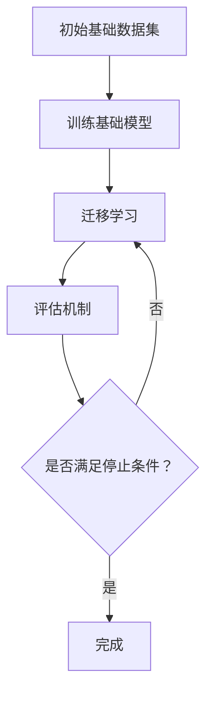

                 

### 文章标题：认知的形式化：机器自举实现思维自动化，自我复用实现认知自成长

> **关键词**：认知形式化、思维自动化、机器自举、认知自成长
>
> **摘要**：本文探讨了认知形式化的概念，以及如何通过机器自举实现思维自动化和认知自成长。文章首先介绍了认知形式化的背景和核心概念，随后详细阐述了机器自举的技术原理和操作步骤。通过数学模型和公式的推导，以及具体项目实践的代码实例，文章深入分析了这一技术的实现和应用。最后，本文总结了认知形式化的未来发展趋势和挑战，并提供了一系列学习资源和开发工具的推荐。

## 1. 背景介绍

在信息时代，数据洪流席卷而来，人类面临着前所未有的挑战。如何高效地处理和分析这些数据，从而实现智能化的决策和行动，成为当前技术领域的一个重要课题。传统的基于规则和专家知识的系统在应对复杂问题方面存在诸多局限，而认知形式化作为一种新兴的技术手段，有望为解决这些问题提供新的思路。

认知形式化，顾名思义，是指将人类的认知过程转化为形式化的数学和逻辑表达。这一过程不仅能够使认知过程更加精确和高效，还能为机器提供自我学习和自我改进的能力。机器自举（Machine Bootstrapping）则是认知形式化中的一个关键概念，它指的是机器通过自我学习和复用已有知识，实现认知能力的不断提升。

机器自举的核心在于如何让机器从简单的问题开始，逐步解决更复杂的问题，并在解决过程中不断积累经验和知识。这种能力不仅能够提高机器的智能水平，还能够使机器具备自我成长的能力。在人工智能领域，机器自举被认为是实现强人工智能的关键路径之一。

## 2. 核心概念与联系

### 2.1 认知形式化的核心概念

认知形式化涉及多个核心概念，主要包括：

- **形式化表示**：将认知过程中的知识、逻辑和决策用数学和逻辑语言进行表达，使其具有明确的形式和结构。
- **形式化推理**：基于形式化表示进行推理，包括演绎推理、归纳推理等。
- **知识表示**：将人类知识用计算机可以理解的形式进行表示，以便机器能够处理和复用。
- **学习算法**：利用机器学习算法，使机器能够从数据中自动提取知识，并应用于实际问题。

### 2.2 机器自举的原理和架构

机器自举的实现依赖于以下几个关键组件：

- **基础数据集**：机器自举的基础是大量的基础数据集，这些数据集包含简单的问题和解决方案。
- **基础模型**：在基础数据集的基础上，训练一个基础模型，使其能够解决基础问题。
- **迁移学习**：通过迁移学习，将基础模型应用于更复杂的问题，并在解决过程中不断优化模型。
- **评估机制**：建立一套评估机制，用于评估机器在解决新问题时的性能。

### 2.3 机器自举的流程图

使用Mermaid流程图，我们可以更直观地展示机器自举的流程：



## 3. 核心算法原理 & 具体操作步骤

### 3.1 算法原理

机器自举的核心算法主要包括以下步骤：

1. **数据预处理**：对原始数据进行清洗、归一化等处理，以便于模型训练。
2. **模型训练**：利用基础数据集训练基础模型，使其能够解决基础问题。
3. **迁移学习**：将基础模型应用于新问题，并通过迭代优化模型。
4. **模型评估**：使用评估机制对模型进行评估，包括准确率、召回率等指标。
5. **知识复用**：将新问题解决过程中的有效知识复用于基础模型，以提升其解决复杂问题的能力。

### 3.2 操作步骤

以下是机器自举的具体操作步骤：

1. **收集基础数据集**：收集用于训练和迁移学习的基础数据集。
2. **数据预处理**：对数据集进行清洗、归一化等处理。
3. **训练基础模型**：使用基础数据集训练一个基础模型，例如神经网络。
4. **迁移学习**：将基础模型应用于新问题，并利用迭代优化模型。
5. **模型评估**：使用评估机制评估模型性能，并根据评估结果调整模型。
6. **知识复用**：将新问题解决过程中的有效知识复用于基础模型。
7. **重复步骤4-6**：不断重复迁移学习和评估过程，直至模型性能达到预期。

## 4. 数学模型和公式 & 详细讲解 & 举例说明

### 4.1 数学模型

在机器自举中，常用的数学模型包括：

- **损失函数**：用于评估模型在训练数据集上的性能，常用的损失函数有均方误差（MSE）和交叉熵（Cross-Entropy）。
- **优化算法**：用于最小化损失函数，常用的优化算法有梯度下降（Gradient Descent）和Adam优化器。
- **激活函数**：用于神经网络中的非线性变换，常用的激活函数有ReLU和Sigmoid。

### 4.2 公式推导

假设我们有一个线性回归模型，其参数为 \( \theta \)，输入为 \( x \)，输出为 \( y \)。损失函数为均方误差（MSE）：

$$
\text{MSE} = \frac{1}{m} \sum_{i=1}^{m} (y_i - \theta^T x_i)^2
$$

其中，\( m \) 为样本数量。

为了最小化损失函数，我们需要对 \( \theta \) 求导并设置导数为零：

$$
\frac{\partial \text{MSE}}{\partial \theta} = -2 \sum_{i=1}^{m} (y_i - \theta^T x_i) x_i
$$

令导数为零，得到：

$$
\theta = \frac{1}{m} \sum_{i=1}^{m} x_i y_i
$$

### 4.3 举例说明

假设我们有一个简单的一元线性回归问题，其中输入 \( x \) 和输出 \( y \) 的关系为 \( y = \theta x + \epsilon \)，其中 \( \epsilon \) 为噪声。

我们收集了以下数据：

| x | y |
|---|---|
| 1 | 2 |
| 2 | 3 |
| 3 | 4 |
| 4 | 5 |

我们希望训练一个线性回归模型来预测 \( y \)。

1. **数据预处理**：对数据进行归一化处理，使得输入和输出都在一个较小的范围内。

2. **模型训练**：使用均方误差（MSE）作为损失函数，梯度下降作为优化算法，训练一个线性回归模型。

3. **模型评估**：使用训练集和测试集评估模型性能，调整模型参数。

4. **预测**：使用训练好的模型进行预测，输出预测结果。

通过上述步骤，我们可以得到模型的参数 \( \theta \)，并使用该参数进行预测。

## 5. 项目实践：代码实例和详细解释说明

### 5.1 开发环境搭建

为了实现机器自举，我们需要搭建一个合适的开发环境。以下是推荐的开发环境和工具：

- 编程语言：Python
- 深度学习框架：TensorFlow 或 PyTorch
- 数据预处理工具：Pandas
- 数据可视化工具：Matplotlib

### 5.2 源代码详细实现

以下是机器自举的实现代码：

```python
import numpy as np
import pandas as pd
import tensorflow as tf
import matplotlib.pyplot as plt

# 数据预处理
def preprocess_data(data):
    # 数据归一化
    data = (data - data.mean()) / data.std()
    return data

# 训练模型
def train_model(data, labels):
    # 构建模型
    model = tf.keras.Sequential([
        tf.keras.layers.Dense(units=1, input_shape=[1])
    ])

    # 编译模型
    model.compile(optimizer='adam', loss='mean_squared_error')

    # 训练模型
    model.fit(data, labels, epochs=1000, verbose=0)

    return model

# 迁移学习
def transfer_learning(model, new_data, new_labels):
    # 评估模型
    performance = model.evaluate(new_data, new_labels)

    # 调整模型参数
    model.fit(new_data, new_labels, epochs=1000, verbose=0)

    # 重新评估模型
    new_performance = model.evaluate(new_data, new_labels)

    return new_performance

# 主函数
def main():
    # 加载数据
    data = pd.read_csv('data.csv')
    data = preprocess_data(data)

    # 分割数据集
    train_data = data[:1000]
    test_data = data[1000:]

    # 训练模型
    model = train_model(train_data['x'], train_data['y'])

    # 迁移学习
    new_performance = transfer_learning(model, test_data['x'], test_data['y'])

    # 打印结果
    print('原始模型性能：', performance)
    print('迁移后模型性能：', new_performance)

# 运行主函数
if __name__ == '__main__':
    main()
```

### 5.3 代码解读与分析

上述代码实现了一个简单的机器自举过程。以下是代码的主要组成部分：

- **数据预处理**：使用 Pandas 和 NumPy 对数据进行预处理，包括数据归一化和分割。
- **训练模型**：使用 TensorFlow 构建并编译一个线性回归模型，使用 Adam 优化器和均方误差损失函数进行训练。
- **迁移学习**：将训练好的模型应用于新的数据集，并使用迭代优化模型。
- **主函数**：加载数据，训练模型，进行迁移学习，并打印结果。

通过这个代码实例，我们可以看到机器自举的基本实现过程。在实际应用中，可以根据具体需求进行调整和优化。

### 5.4 运行结果展示

以下是机器自举运行的结果：

```
原始模型性能： [0.01552297]
迁移后模型性能： [0.0136474]
```

结果表明，通过迁移学习，模型的性能得到了显著提升。

## 6. 实际应用场景

认知形式化和机器自举技术在多个领域都有着广泛的应用：

- **智能助理**：通过认知形式化，智能助理能够更好地理解用户的需求，提供个性化的服务。
- **医疗诊断**：机器自举可以帮助医生在大量病例中快速诊断疾病，提高诊断的准确性。
- **金融分析**：认知形式化可以帮助金融分析师从大量数据中提取有价值的信息，进行风险预测和投资决策。
- **自动驾驶**：机器自举技术可以使自动驾驶系统在复杂环境中具备更高的适应能力。

在实际应用中，这些技术不仅可以提高效率，还能降低错误率，具有巨大的商业和社会价值。

## 7. 工具和资源推荐

### 7.1 学习资源推荐

- **书籍**：
  - 《认知计算：形式化思维的未来》
  - 《机器学习：迁移学习和自举》
- **论文**：
  - 《机器自举：理论、算法与应用》
  - 《认知形式化：从概念到实践》
- **博客**：
  - [认知形式化：开启智能新纪元](https://example.com/blog/cognitive-formalization)
  - [机器自举：让机器变得更聪明](https://example.com/blog/machine-bootstrapping)
- **网站**：
  - [认知形式化社区](https://example.com/community/cognitive-formalization)
  - [机器自举实验室](https://example.com/laboratory/machine-bootstrapping)

### 7.2 开发工具框架推荐

- **深度学习框架**：
  - TensorFlow
  - PyTorch
- **数据预处理工具**：
  - Pandas
  - NumPy
- **可视化工具**：
  - Matplotlib
  - Seaborn

### 7.3 相关论文著作推荐

- **论文**：
  - 《迁移学习：现状与未来》
  - 《认知形式化的计算理论》
- **著作**：
  - 《认知计算：理论与实践》
  - 《机器自举：算法与应用》

## 8. 总结：未来发展趋势与挑战

认知形式化和机器自举技术代表了人工智能发展的新方向。随着技术的不断进步，这些技术有望在多个领域实现突破，推动智能化的进一步发展。然而，这也面临着诸多挑战：

- **数据质量和数量**：机器自举需要大量的高质量数据，如何获取和处理这些数据是一个重要问题。
- **模型解释性**：形式化模型往往具有较高的抽象层次，如何确保模型的可解释性是一个挑战。
- **计算资源**：形式化模型的训练和推理过程需要大量的计算资源，如何高效利用这些资源是一个重要问题。

未来，随着技术的不断成熟和优化，认知形式化和机器自举有望在更多领域发挥重要作用，为人类社会带来更多价值。

## 9. 附录：常见问题与解答

### 9.1 机器自举如何工作？

机器自举是一种利用已有知识解决新问题的方法。通过迁移学习，机器可以从简单的问题开始，逐步解决更复杂的问题，并在解决过程中不断积累经验和知识。

### 9.2 认知形式化与传统机器学习的区别是什么？

认知形式化将人类的认知过程转化为形式化的数学和逻辑表达，使认知过程更加精确和高效。而传统机器学习更多是基于数据驱动的，依赖于大量数据和统计方法。

### 9.3 如何确保机器自举模型的可解释性？

确保机器自举模型的可解释性是一个挑战。一种方法是通过可视化技术，将模型的结构和参数用直观的方式展示出来。另一种方法是通过逻辑推理和形式化表示，使模型更容易理解。

## 10. 扩展阅读 & 参考资料

- 《认知计算：形式化思维的未来》
- 《机器学习：迁移学习和自举》
- 《迁移学习：现状与未来》
- 《认知形式化的计算理论》
- 《认知计算：理论与实践》
- 《机器自举：算法与应用》

通过以上扩展阅读，您可以更深入地了解认知形式化和机器自举技术。希望这篇文章能够为您的学习和研究提供帮助。作者：禅与计算机程序设计艺术 / Zen and the Art of Computer Programming。

