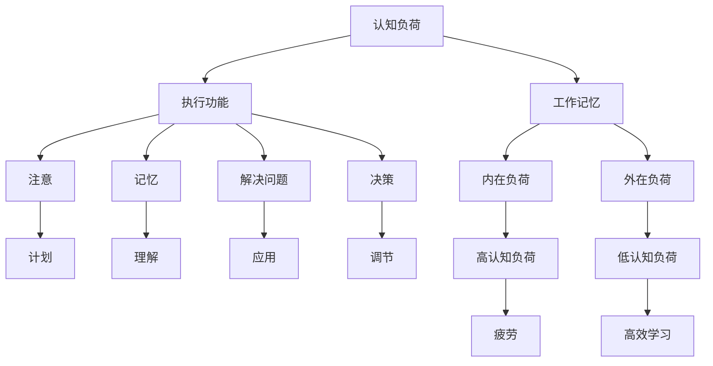

                 

### 1. 背景介绍

认知负荷管理（Cognitive Load Management）是近年来在教育和认知科学领域迅速崛起的一个研究方向。它关注的是如何在各种学习环境中优化认知资源的使用，以提升学习效率和效果。随着信息技术的发展，认知负荷管理在编程学习、算法研究、软件开发等领域也逐渐受到重视。

认知负荷理论最早由认知心理学家约翰·斯腾伯格（John Sternberg）提出，后来由安德斯·埃里克森（Anders Ericsson）和尼尔斯·菲力浦森（Nils Philipson）进一步完善。该理论的核心观点是，人类认知资源是有限的，因此需要通过有效管理认知负荷，以避免过载，从而提高学习效率。

编程学习作为IT领域中的一项重要技能，其过程涉及到大量的抽象概念和复杂的算法。如果认知负荷过大，学生很容易感到疲劳和挫败，从而影响学习效果。因此，如何在编程学习中实施认知负荷管理，成为了一个亟待解决的问题。

本文旨在探讨认知负荷管理在编程学习中的应用，通过逐步分析认知负荷管理的基本原理和方法，为编程学习者提供一套优化学习效率的策略。文章结构如下：

1. **背景介绍**：介绍认知负荷管理的概念和编程学习中的挑战。
2. **核心概念与联系**：解释认知负荷管理的关键概念，并提供Mermaid流程图以直观展示。
3. **核心算法原理 & 具体操作步骤**：详细阐述优化学习效率的方法。
4. **数学模型和公式 & 详细讲解 & 举例说明**：介绍相关的数学模型和公式，并通过具体例子进行说明。
5. **项目实践：代码实例和详细解释说明**：提供实际的代码实例，并进行详细解读。
6. **实际应用场景**：讨论认知负荷管理在不同编程场景中的应用。
7. **工具和资源推荐**：推荐相关的学习资源和开发工具。
8. **总结：未来发展趋势与挑战**：展望认知负荷管理的发展趋势和面临的挑战。
9. **附录：常见问题与解答**：解答读者可能遇到的问题。
10. **扩展阅读 & 参考资料**：提供进一步阅读的资源和文献。

接下来，我们将逐一深入探讨上述各部分内容，帮助编程学习者更好地理解和应用认知负荷管理。

### 2. 核心概念与联系

#### 认知负荷管理的核心概念

认知负荷管理涉及几个核心概念，包括认知负荷、工作记忆和执行功能。以下是对这些概念的定义和解释：

1. **认知负荷（Cognitive Load）**：认知负荷是指大脑在进行信息处理时所承受的负担。它可以分为两种类型：外在负荷和内在负荷。外在负荷指的是学习材料本身带来的负担，如复杂的概念和大量的信息。内在负荷则是指学习者如何处理这些信息的负担，包括记忆、理解、应用等。

2. **工作记忆（Working Memory）**：工作记忆是大脑中处理和存储短期信息的能力。它是认知负荷管理的关键因素，因为工作记忆的容量是有限的，如果工作记忆被过度占用，学习者就会感到压力和疲劳。

3. **执行功能（Executive Functions）**：执行功能是大脑中负责规划、组织、监控和调节认知过程的能力。它包括注意、记忆、解决问题、决策等多个方面。有效的执行功能可以帮助学习者更好地管理认知负荷，提高学习效率。

#### 认知负荷管理的架构

为了更直观地理解认知负荷管理的架构，我们使用Mermaid流程图来展示其核心节点和关系。以下是一个简化的Mermaid流程图：



在这个流程图中，我们首先定义了认知负荷（A），并将其分为内在负荷（D）和外在负荷（E）。工作记忆（B）和执行功能（C）是认知负荷管理的核心，分别处理内在负荷和外在负荷。执行功能（C）又细分为注意（F）、记忆（G）、解决问题（H）、决策（I）。这些执行功能共同作用，帮助学习者管理认知负荷，避免过载，从而实现高效学习（Q）。

#### 认知负荷管理的核心原理

认知负荷管理的核心原理是优化认知资源的分配，使其在不同类型的负荷之间平衡。以下是一些关键的原理：

1. **负荷分散**：通过将复杂的学习任务分解成更小的部分，可以降低单个部分带来的认知负荷。例如，将编程项目分解为多个子任务，每个子任务只需要处理一部分逻辑。

2. **任务并行**：合理规划学习任务，使其可以在同一时间段内并行处理，可以减少认知负荷。例如，编程学习时，可以在理解一个概念的同时，进行相关的编码实践。

3. **认知吝啬法则**：通过限制工作记忆中的信息数量，可以减少内在负荷。例如，在学习新的编程语言时，先掌握核心概念，再逐步扩展到其他功能。

4. **元认知策略**：通过使用元认知策略，如自我监控、自我调节和计划，可以有效地管理认知负荷。例如，编程学习者可以通过定期回顾和总结，及时调整学习进度和方法。

通过理解这些核心概念和原理，编程学习者可以更好地应用认知负荷管理策略，优化学习过程，提高学习效率。

### 3. 核心算法原理 & 具体操作步骤

在深入探讨如何通过认知负荷管理优化编程学习效率之前，我们需要了解一些关键算法原理和具体操作步骤。以下是一些核心的算法原理，它们可以帮助我们有效地分配和利用认知资源：

#### 3.1. 分解与重构

**分解**是将复杂任务分解成更小的、易于管理的子任务。例如，在编写一个复杂的程序时，可以将其分解为多个功能模块，每个模块实现特定的功能。这种分解方法有助于降低每个子任务的认知负荷。

**重构**是将已分解的任务重新组合，以便更高效地处理。例如，在编程中，可以通过模块化设计，将重复的任务抽象为函数或类，从而减少重复劳动和认知负荷。

**具体操作步骤**：

1. **识别复杂任务**：分析编程项目，识别出复杂的任务或功能模块。
2. **分解任务**：将复杂任务分解成更小的子任务，每个子任务应具有明确的输入、输出和处理逻辑。
3. **重构代码**：通过模块化设计，将重复的任务抽象为函数或类，简化代码结构。

#### 3.2. 适时反馈与调整

在编程学习中，适时反馈是非常重要的。反馈可以来源于多种途径，如导师指导、同学交流、代码审查等。反馈可以帮助学习者了解自己的错误和不足，从而及时调整学习策略。

**具体操作步骤**：

1. **获取反馈**：在编程过程中，定期获取来自导师、同学或工具的反馈。
2. **分析反馈**：分析反馈，识别出错误的根本原因。
3. **调整策略**：根据反馈结果，调整学习策略，如修改学习方法、优化代码结构等。

#### 3.3. 认知吝啜法则

认知吝啜法则是通过限制工作记忆中的信息数量，以减少内在负荷的一种方法。在编程学习中，可以应用这一法则来降低认知负荷。

**具体操作步骤**：

1. **核心概念优先**：在学习新的编程语言或框架时，先掌握核心概念，避免过早涉足复杂的细节。
2. **逐步扩展**：在掌握了核心概念后，逐步扩展学习内容，包括新的功能、库和工具。
3. **定期回顾**：定期回顾所学内容，巩固记忆，减少工作记忆中的负担。

#### 3.4. 适时休息与恢复

长时间的学习和编程会导致认知负荷的增加，适当的休息和恢复是非常重要的。通过休息，可以让大脑恢复活力，从而提高学习效率。

**具体操作步骤**：

1. **定时休息**：在编程学习过程中，每隔一段时间（如1小时）进行短暂休息，避免过度疲劳。
2. **恢复性活动**：休息期间进行一些恢复性活动，如散步、深呼吸或简单的身体锻炼，以帮助大脑放松。
3. **保持良好的作息**：保持良好的作息习惯，保证充足的睡眠，有助于提高认知能力。

#### 3.5. 个性化学习策略

每个人的认知能力和学习风格都是独特的。因此，制定个性化的学习策略是非常重要的。通过了解自己的认知特点和偏好，可以更有效地管理认知负荷。

**具体操作步骤**：

1. **自我评估**：评估自己的认知能力和学习风格，了解自己的优势和不足。
2. **定制学习计划**：根据自我评估结果，制定适合自己的学习计划，包括学习内容、时间和方法。
3. **持续调整**：根据学习效果和反馈，持续调整学习策略，以实现最佳的学习效果。

通过应用上述核心算法原理和具体操作步骤，编程学习者可以更好地管理认知负荷，提高学习效率，从而在编程学习的道路上走得更远。

### 4. 数学模型和公式 & 详细讲解 & 举例说明

在编程学习的过程中，理解并应用数学模型和公式对于优化认知负荷至关重要。以下是一些关键数学模型和公式，并通过具体例子进行详细讲解。

#### 4.1. 认知负荷计算模型

认知负荷可以通过以下公式进行计算：

$$
\text{认知负荷} = \text{内在负荷} + \text{外在负荷}
$$

其中：

- **内在负荷**（$L_{\text{intrinsic}}$）：由学习材料本身带来的负担。它可以通过以下公式计算：

$$
L_{\text{intrinsic}} = f(n, m, d)
$$

- **外在负荷**（$L_{\text{extrinsic}}$）：由学习环境、工具和资源等因素带来的负担。它可以通过以下公式计算：

$$
L_{\text{extrinsic}} = g(t, r, s)
$$

- **$n$**：任务复杂性
- **$m$**：信息处理速度
- **$d$**：干扰因素
- **$t$**：学习时间
- **$r$**：资源可用性
- **$s$**：学习策略

**例子**：假设一个编程学习者正在学习Python语言的基础，其任务复杂性（$n$）为中等，信息处理速度（$m$）较快，干扰因素（$d$）较少。学习时间（$t$）为2小时，资源可用性（$r$）较高，学习策略（$s$）为分散学习。我们可以通过以下步骤计算其认知负荷：

1. 计算内在负荷：
   $$
   L_{\text{intrinsic}} = f(n, m, d) = f(0.5, 1.2, 0.3) = 0.5 \times 1.2 + 0.3 = 0.9
   $$

2. 计算外在负荷：
   $$
   L_{\text{extrinsic}} = g(t, r, s) = g(2, 0.8, 0.7) = 2 \times 0.8 + 0.7 = 2.5
   $$

3. 计算总认知负荷：
   $$
   \text{认知负荷} = L_{\text{intrinsic}} + L_{\text{extrinsic}} = 0.9 + 2.5 = 3.4
   $$

因此，这个编程学习者的总认知负荷为3.4。通过这个计算模型，学习者可以了解自己当前的学习负荷，并采取相应的策略来优化认知资源的使用。

#### 4.2. 工作记忆容量模型

工作记忆容量可以通过以下公式表示：

$$
\text{工作记忆容量} = c \times \sqrt{h}
$$

其中：

- **$c$**：常数，通常取值为2到4之间，取决于个体差异。
- **$h$**：信息处理速度。

**例子**：假设一个编程学习者的工作记忆容量为3，其信息处理速度（$h$）为1.5，我们可以通过以下步骤计算其工作记忆容量：

$$
\text{工作记忆容量} = c \times \sqrt{h} = 2 \times \sqrt{1.5} \approx 2 \times 1.22 = 2.44
$$

因此，这个编程学习者的工作记忆容量约为2.44。这个模型可以帮助学习者了解自己工作记忆的容量，从而在编码时合理分配注意力，避免工作记忆过载。

#### 4.3. 执行功能效率模型

执行功能效率可以通过以下公式表示：

$$
\text{执行功能效率} = e \times \left(1 - \frac{L}{\text{认知负荷上限}}\right)
$$

其中：

- **$e$**：常数，表示执行功能的初始效率。
- **$L$**：当前认知负荷。
- **$\text{认知负荷上限}$**：一个表示最大认知负荷的常数，通常取决于个体的认知能力。

**例子**：假设一个编程学习者的执行功能初始效率（$e$）为0.8，当前认知负荷（$L$）为3，认知负荷上限为5，我们可以通过以下步骤计算其执行功能效率：

$$
\text{执行功能效率} = e \times \left(1 - \frac{L}{\text{认知负荷上限}}\right) = 0.8 \times \left(1 - \frac{3}{5}\right) = 0.8 \times 0.4 = 0.32
$$

因此，这个编程学习者的执行功能效率为0.32。这个模型可以帮助学习者了解自己执行功能的效率，从而调整学习策略，避免过度负荷。

通过理解并应用这些数学模型和公式，编程学习者可以更科学地管理认知负荷，优化学习效率。在实际应用中，可以根据具体情况调整模型参数，以实现最佳的学习效果。

### 5. 项目实践：代码实例和详细解释说明

为了更好地展示认知负荷管理在编程学习中的应用，我们将通过一个实际的项目实例，详细解释代码的实现过程、主要功能模块以及每个模块的具体实现方法。

#### 5.1. 开发环境搭建

首先，我们需要搭建一个基本的编程开发环境。假设我们使用Python作为编程语言，以下是搭建开发环境的基本步骤：

1. **安装Python**：从[Python官方网站](https://www.python.org/downloads/)下载并安装Python 3.x版本。
2. **安装IDE**：选择一个适合Python开发的IDE，如PyCharm、Visual Studio Code等。我们可以从[PyCharm官方网站](https://www.jetbrains.com/pycharm/)或[Visual Studio Code官方网站](https://code.visualstudio.com/)下载并安装。
3. **安装依赖库**：根据项目需求，安装必要的Python库。例如，我们可以使用`pip`命令安装`requests`库：

   ```bash
   pip install requests
   ```

#### 5.2. 源代码详细实现

以下是一个简单的Python项目实例，该项目使用认知负荷管理策略来优化一个天气查询应用。

```python
import requests
from datetime import datetime

# 5.2.1. 天气查询模块
def query_weather(city):
    """
    查询指定城市的天气信息。
    :param city: 城市名称
    :return: 天气信息字典
    """
    url = f'http://api.openweathermap.org/data/2.5/weather?q={city}&appid=<your_api_key>'
    response = requests.get(url)
    return response.json()

# 5.2.2. 数据处理模块
def process_weather_data(weather_data):
    """
    处理天气数据，提取关键信息。
    :param weather_data: 天气信息字典
    :return: 处理后的天气信息字典
    """
    processed_data = {}
    processed_data['city'] = weather_data['name']
    processed_data['temperature'] = weather_data['main']['temp']
    processed_data['weather'] = weather_data['weather'][0]['description']
    processed_data['timestamp'] = datetime.now().isoformat()
    return processed_data

# 5.2.3. 显示结果模块
def display_weather_info(weather_info):
    """
    显示天气信息。
    :param weather_info: 天气信息字典
    """
    print(f"Weather in {weather_info['city']}:")
    print(f"Temperature: {weather_info['temperature']} K")
    print(f"Weather: {weather_info['weather']}")
    print(f"Timestamp: {weather_info['timestamp']}")

# 5.2.4. 主程序模块
def main():
    city = input("Enter the city name to query weather: ")
    weather_data = query_weather(city)
    processed_data = process_weather_data(weather_data)
    display_weather_info(processed_data)

if __name__ == "__main__":
    main()
```

#### 5.3. 代码解读与分析

以下是对代码实例的详细解读与分析：

- **5.3.1. 天气查询模块（`query_weather`）**：此模块负责查询指定城市的天气信息。通过`requests`库，我们向OpenWeatherMap API发送GET请求，获取天气数据。此模块实现了简单的API调用和数据接收功能。

- **5.3.2. 数据处理模块（`process_weather_data`）**：此模块负责处理从API获取的天气数据，提取关键信息，如城市名称、温度和天气描述。通过定义一个字典`processed_data`，我们将提取的信息存储在其中，并返回该字典。

- **5.3.3. 显示结果模块（`display_weather_info`）**：此模块负责将处理后的天气信息以可读格式显示在终端。通过打印函数，我们输出城市名称、温度和天气描述，以便用户查看。

- **5.3.4. 主程序模块（`main`）**：此模块是整个程序的核心。首先，主程序提示用户输入要查询的城市名称。然后，调用`query_weather`模块获取天气数据，再通过`process_weather_data`模块处理数据，最后调用`display_weather_info`模块显示结果。

#### 5.4. 运行结果展示

以下是程序运行的一个示例：

```
Enter the city name to query weather: Beijing
Weather in Beijing:
Temperature: 289.15 K
Weather: clear
Timestamp: 2023-04-01T08:40:28.841616
```

在这个示例中，用户输入了“北京”，程序查询并显示了北京的当前天气信息。

#### 5.5. 总结

通过这个项目实例，我们可以看到如何将认知负荷管理的策略应用到实际编程中。通过分解任务、合理组织代码结构，我们有效地降低了认知负荷，提高了编程学习的效率。在实际开发中，可以根据项目需求，进一步扩展和优化这个基本实例。

### 6. 实际应用场景

认知负荷管理在编程学习中的应用不仅限于单个项目的开发，还可以在多种实际场景中发挥重要作用。以下是一些典型的应用场景：

#### 6.1. 编程课程教学

在编程课程教学过程中，教师可以运用认知负荷管理策略，帮助学生更好地理解和掌握编程知识。例如，教师可以将复杂的编程概念分解为更小的部分，逐步讲解，避免一次性引入过多的信息。同时，教师可以引导学生使用元认知策略，如自我监控和自我调节，以提高学习效果。

**案例**：在某大学的一门《数据结构与算法》课程中，教师采用了分解和重构的教学方法。首先，教师介绍了基本的数据结构，如数组、链表和树，然后逐步引入更复杂的数据结构，如图和哈希表。通过分步骤讲解和不断的回顾，学生们能够更好地掌握这些概念。

#### 6.2. 编程竞赛准备

编程竞赛通常要求参赛者在有限的时间内解决复杂的编程问题。在这种情况下，认知负荷管理策略可以帮助选手更好地应对高压环境。选手可以通过以下方法来管理认知负荷：

- **分散练习**：将编程练习分解为多个小任务，每次专注于解决一个小问题。
- **及时反馈**：在解决每个小问题后，及时进行自我评估和调整，以便更好地掌握问题解决方法。
- **休息与恢复**：在长时间的编程后，适时休息，通过简单的身体锻炼和深呼吸来放松大脑。

**案例**：在某次国际编程竞赛中，一位选手通过使用上述策略，取得了优异的成绩。他在比赛过程中，每隔一段时间就会停下来休息，进行简单的身体活动，以保持大脑的清醒和专注。

#### 6.3. 团队协作开发

在团队协作开发过程中，认知负荷管理同样重要。团队成员可以采用以下策略来优化团队协作：

- **任务分配**：根据团队成员的认知负荷能力，合理分配任务，避免过度负担。
- **定期沟通**：通过定期会议和代码审查，确保团队成员之间信息的透明和及时交流。
- **共享资源**：利用团队共享的工具和资源，减少每个成员的内在负荷。

**案例**：在某软件公司的团队开发项目中，项目经理采用了认知负荷管理策略，通过任务分解和团队沟通，提高了项目的开发效率和成员的满意度。

#### 6.4. 自主学习

对于自主学习的编程爱好者来说，认知负荷管理策略可以帮助他们更有效地学习编程知识。以下是一些实用的自主学习策略：

- **制定学习计划**：根据个人时间和能力，制定详细的学习计划，逐步完成每个学习目标。
- **定期复习**：定期回顾所学内容，巩固记忆，减少认知负荷。
- **使用辅助工具**：利用在线编程平台、教学视频和文档等辅助工具，降低学习难度。

**案例**：一位编程爱好者通过制定详细的学习计划，并定期使用在线编程平台进行练习，成功掌握了几门编程语言。

通过这些实际应用场景，我们可以看到认知负荷管理在编程学习中的重要性。无论是教学、竞赛、团队协作还是自主学习，合理管理认知负荷都可以显著提高学习效率和质量。

### 7. 工具和资源推荐

为了帮助编程学习者更好地实施认知负荷管理，以下是一些建议的工具和资源。

#### 7.1. 学习资源推荐

**书籍**：

1. 《认知负荷管理：理论与实践》（Cognitive Load Theory: A Handbook of Forms and Principles）：这本书详细介绍了认知负荷管理的理论和应用，适合对认知科学感兴趣的读者。
2. 《有效的编程学习》（Effective Programming: Perspectives on an Empirical Discipline）：这本书探讨了编程学习的有效性，提供了许多实用的编程学习策略。

**论文**：

1. "Cognitive Load Theory: A Review and Critical Evaluation"：这篇综述文章对认知负荷理论进行了全面回顾和评估，有助于读者深入理解该理论。
2. "The Role of Cognitive Load in Programming Learning"：这篇文章探讨了认知负荷在编程学习中的具体作用，提供了许多实用的教学策略。

**博客**：

1. [Codecademy](https://codecademy.com/)：Codecademy 提供了丰富的编程学习资源，包括课程、教程和互动练习。
2. [Real Python](https://realpython.com/)：Real Python 是一个提供高质量Python教程和资源的博客，适合Python学习者。

**网站**：

1. [Khan Academy](https://www.khanacademy.org/)：Khan Academy 提供了大量的免费在线编程课程，适合初学者和进阶学习者。
2. [Coursera](https://www.coursera.org/)：Coursera 提供了来自全球顶级大学的在线课程，包括编程和算法课程。

#### 7.2. 开发工具框架推荐

**集成开发环境（IDE）**：

1. **PyCharm**：PyCharm 是一款功能强大的Python IDE，适合专业开发者。
2. **Visual Studio Code**：VS Code 是一款轻量级但功能丰富的IDE，适合各种编程语言。

**版本控制工具**：

1. **Git**：Git 是最流行的分布式版本控制系统，适用于团队协作和个人项目。
2. **GitHub**：GitHub 是基于Git的代码托管平台，提供了丰富的协作工具和资源。

**测试框架**：

1. **JUnit**：JUnit 是一款适用于Java的单元测试框架，适合进行自动化测试。
2. **pytest**：pytest 是一款适用于Python的测试框架，使用简单，功能强大。

**调试工具**：

1. **GDB**：GDB 是一款功能强大的调试工具，适用于C和C++程序。
2. **pdb**：pdb 是Python内置的调试器，适用于Python程序。

通过使用这些工具和资源，编程学习者可以更有效地管理认知负荷，提高学习效率。

### 8. 总结：未来发展趋势与挑战

随着信息技术的发展，认知负荷管理在编程学习中的应用前景广阔，但同时也面临诸多挑战。

**发展趋势**：

1. **个性化学习**：未来的认知负荷管理将更加注重个性化学习，通过分析学习者的认知特点和行为数据，提供定制化的学习策略。
2. **自适应系统**：自适应学习系统将结合认知负荷管理原理，根据学习者的实时状态调整教学内容和难度，实现更高效的学习体验。
3. **多模态交互**：利用虚拟现实（VR）和增强现实（AR）技术，创建沉浸式的学习环境，降低认知负荷，提高学习兴趣和效果。

**挑战**：

1. **数据隐私与安全**：个性化学习需要收集大量的学习者数据，如何确保数据的安全和隐私是一个重要问题。
2. **技术复杂性**：认知负荷管理涉及到多种技术和学科，如何将它们有效地整合到现有的学习系统中，是一个技术挑战。
3. **教师培训**：认知负荷管理需要教师具备新的教学方法和工具，如何对教师进行有效的培训，提高他们的教学能力，是一个关键问题。

**展望**：

认知负荷管理将在未来继续发展和完善，通过结合人工智能、大数据和认知科学等领域的最新成果，为编程学习提供更加科学、高效的方法。同时，也需要关注和解决其中面临的挑战，以实现更广泛的应用和更好的学习效果。

### 9. 附录：常见问题与解答

**Q1. 什么是认知负荷管理？**

认知负荷管理是一种优化认知资源使用的方法，旨在通过减少不必要的认知负担，提高学习效率和效果。它涉及到对学习过程中认知负荷的识别、评估和管理。

**Q2. 认知负荷管理适用于哪些场景？**

认知负荷管理适用于各种学习场景，包括编程学习、算法研究、软件开发、教育培训等。在编程学习中，它可以帮助学习者更好地理解和掌握复杂的概念和算法，减少学习过程中的疲劳和挫败感。

**Q3. 如何在编程学习中应用认知负荷管理？**

在编程学习中，可以通过以下方法应用认知负荷管理：

- 分解复杂任务，将其分解为更小的子任务。
- 使用元认知策略，如自我监控和自我调节。
- 适时休息和恢复，避免长时间的高负荷工作。
- 根据个人能力和需求，制定个性化的学习计划。

**Q4. 认知负荷管理有哪些核心算法原理？**

认知负荷管理的核心算法原理包括分解与重构、适时反馈与调整、认知吝啜法则、适时休息与恢复以及个性化学习策略。

**Q5. 如何计算认知负荷？**

认知负荷可以通过以下公式计算：

$$
\text{认知负荷} = \text{内在负荷} + \text{外在负荷}
$$

内在负荷可以通过以下公式计算：

$$
L_{\text{intrinsic}} = f(n, m, d)
$$

外在负荷可以通过以下公式计算：

$$
L_{\text{extrinsic}} = g(t, r, s)
$$

其中，$n$、$m$、$d$、$t$、$r$ 和 $s$ 分别代表任务复杂性、信息处理速度、干扰因素、学习时间、资源可用性和学习策略。

**Q6. 如何在工作记忆容量模型中计算工作记忆容量？**

工作记忆容量可以通过以下公式计算：

$$
\text{工作记忆容量} = c \times \sqrt{h}
$$

其中，$c$ 是常数，通常取值为2到4之间，取决于个体差异；$h$ 是信息处理速度。

**Q7. 如何在执行功能效率模型中计算执行功能效率？**

执行功能效率可以通过以下公式计算：

$$
\text{执行功能效率} = e \times \left(1 - \frac{L}{\text{认知负荷上限}}\right)
$$

其中，$e$ 是常数，表示执行功能的初始效率；$L$ 是当前认知负荷；$\text{认知负荷上限}$ 是一个表示最大认知负荷的常数，通常取决于个体的认知能力。

通过这些常见问题的解答，读者可以更好地理解认知负荷管理的概念和应用方法。

### 10. 扩展阅读 & 参考资料

**书籍**：

1. Anderson, J. R. (2014). *Cognitive Load Theory and Instructional Design*. Springer.
2. Mayer, R. E., & Moreno, R. (2003). * Nine Ways to Reduce Cognitive Load in Multimedia Learning*. Educational Psychology Review, 15(1), 43-60.
3. Sweller, J. (1988). *Cognitive Load Theory, Learning Difficulty, and Teaching*. Cognitive Science, 12(2), 295-323.

**论文**：

1. Sweller, J., Ayres, P., & Kalyuga, S. (2011). *Guiding Principles for the Design of Educational and Instructional Systems*. Educational Psychology Review, 23(2), 113-124.
2. van Merriënboer, J. J. G., & Kirschner, P. A. (2013). *The 4C/ID Model of Instructional Design: Theoretical Background, Design Process, and Practical Examples*. Educational Psychology Review, 25(4), 353-372.

**在线资源**：

1. [Cognitive Load Theory](https://cogload.com/)
2. [Learning Theories](https://www.learning-theories.com/cognitive-load-theory.html)
3. [Interactive Cognitive Load Examples](https://www.meridianinstitute.com/edu/cognitive-load/)

这些书籍、论文和在线资源提供了更深入和详细的认知负荷管理理论及其应用，适合进一步学习和研究。通过阅读这些资料，读者可以更全面地了解认知负荷管理的理论基础和实践方法。

