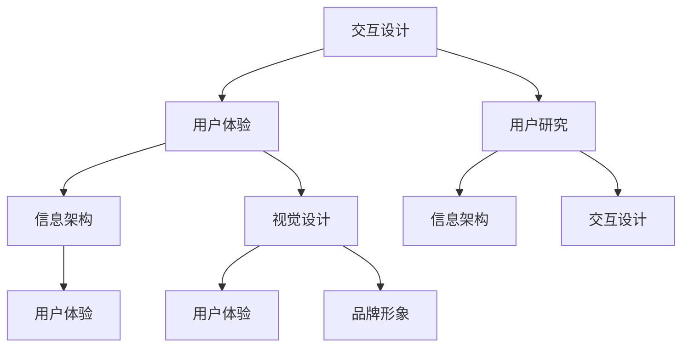

                 

### 背景介绍

在当今数字化时代，用户界面（UI）设计已成为软件产品成功与否的关键因素之一。随着技术的不断进步和用户需求的多样化，如何设计一个既美观又实用的用户界面，成为许多软件开发者和设计者面临的挑战。

用户界面设计的重要性不言而喻。它直接影响用户体验（UX），而用户体验又直接关系到用户满意度、用户留存率以及产品的市场竞争力。一个优秀的用户界面能够有效降低用户的认知负担，提高操作效率，进而提升整体的用户体验。

本文将围绕设计更好的用户界面这一主题，从核心概念、算法原理、项目实践、实际应用场景等多个角度进行全面探讨。我们将深入分析用户界面设计的核心概念和原理，介绍相关的算法和模型，并通过具体的项目实例来展示如何将这些理论应用到实际开发中。此外，文章还将讨论用户界面设计的未来发展趋势和挑战，以及相关的工具和资源推荐。

本文结构如下：

1. **核心概念与联系**：介绍用户界面设计的核心概念，如交互设计、用户体验、用户研究等，并提供一个流程图来展示这些概念之间的联系。
2. **核心算法原理与具体操作步骤**：探讨常用的用户界面设计方法和算法，如用户行为分析、信息架构设计、视觉设计等，并详细讲解每个步骤的实施方法。
3. **数学模型和公式**：介绍与用户界面设计相关的数学模型和公式，如用户满意度模型、信息可视化模型等，并举例说明如何应用这些模型来优化用户界面设计。
4. **项目实践**：通过具体代码实例来展示如何设计一个简单的用户界面，并详细解读代码，分析其优缺点。
5. **实际应用场景**：讨论用户界面设计在不同类型的应用程序和平台中的实际应用场景，如移动应用、网站、桌面应用等。
6. **工具和资源推荐**：推荐一些常用的用户界面设计工具和资源，包括设计指南、开发框架、学习资源等。
7. **总结**：总结用户界面设计的核心要点，讨论未来发展趋势和挑战。
8. **附录**：回答一些常见问题，提供进一步的阅读和参考资料。

通过这篇文章，我们希望读者能够对用户界面设计有一个全面而深入的了解，从而在实际工作中能够设计出更加优秀和实用的用户界面。

### 核心概念与联系

为了更好地理解用户界面设计，我们需要先了解一些核心概念，并展示它们之间的联系。以下是几个关键概念：

1. **交互设计**：交互设计（Interactive Design）关注的是用户与产品之间的交互过程。它涉及如何设计直观、流畅且高效的用户操作流程，确保用户能够轻松地与产品进行互动。交互设计不仅包括物理按钮、滑块、菜单等元素，还涉及如何通过动画、声音等手段增强用户互动体验。

2. **用户体验**：用户体验（User Experience，简称UX）是指用户在使用产品过程中的整体感受和体验。一个优秀的用户体验应具备易用性（Usability）、可用性（Usability）、可访问性（Accessibility）和情感化（Emotional）等特点。用户体验设计的目标是满足甚至超出用户的期望，从而提升用户满意度。

3. **用户研究**：用户研究（User Research）是了解用户需求、行为和偏好的一系列方法。通过用户研究，设计师可以收集到有关目标用户群体的有用数据，这些数据有助于指导设计决策，确保设计的用户界面能够真正满足用户需求。

4. **信息架构**：信息架构（Information Architecture）是关于如何组织、结构和分类信息的方法。它确保用户能够快速找到他们需要的信息，从而提高信息检索效率。信息架构在设计过程中起着至关重要的作用，它直接影响用户的导航体验。

5. **视觉设计**：视觉设计（Visual Design）关注用户界面的视觉效果，包括颜色、排版、图标、图形等元素。视觉设计不仅要美观，还要与产品的品牌形象保持一致，并符合用户的审美习惯。

为了更直观地展示这些概念之间的联系，我们可以使用Mermaid流程图来描述：



在这个流程图中，我们可以看到，交互设计和用户体验是整个用户界面设计的核心，用户研究和信息架构为交互设计提供了数据支持，而视觉设计则确保用户体验的美观和一致性。

通过这个流程图，我们可以更清晰地理解每个核心概念的作用和它们之间的相互关系。这些概念共同构成了用户界面设计的理论基础，为实际设计工作提供了指导。

### 核心算法原理与具体操作步骤

在用户界面设计中，核心算法原理是确保设计流程科学、高效的关键。以下我们将详细介绍几种常用的用户界面设计方法及其具体操作步骤。

#### 1. 用户行为分析

用户行为分析是用户界面设计的重要环节，它通过对用户行为的深入分析，为设计决策提供数据支持。以下是一个用户行为分析的步骤：

1. **数据收集**：首先，收集用户使用产品时的行为数据，包括点击次数、页面停留时间、操作路径等。这些数据可以通过分析日志、用户调研或行为跟踪工具获得。

2. **数据预处理**：对收集到的数据进行清洗和整理，去除重复或无效的数据，确保数据的准确性和一致性。

3. **数据分析**：使用统计分析和机器学习算法对用户行为数据进行深入分析，提取关键行为模式。例如，可以通过聚类分析找出高频用户行为模式，或使用回归分析预测用户对某些功能的兴趣。

4. **行为模式可视化**：将分析结果可视化，如使用热力图展示用户点击频率较高的区域，或通过时间序列图展示用户在不同时间段的操作行为。

5. **设计优化**：根据分析结果，对用户界面进行优化，调整布局、功能位置或交互方式，以提高用户的使用体验。

#### 2. 信息架构设计

信息架构设计是确保用户能够高效地找到和使用产品信息的关键。以下是信息架构设计的基本步骤：

1. **需求分析**：了解用户需求，明确产品的目标和用户群体。这可以通过用户调研、访谈或问卷调查等方法进行。

2. **内容规划**：根据需求分析结果，规划产品内容结构，确定主要内容和次要内容之间的关系。这可以通过内容地图或思维导图等方式进行。

3. **信息分类**：对内容进行分类，确保用户能够快速找到所需信息。常用的分类方法有层级分类、标签分类和混合分类。

4. **导航设计**：设计导航结构，确保用户能够方便地从一个页面跳转到另一个页面。导航设计可以采用面包屑、导航菜单、搜索框等多种方式。

5. **原型设计**：基于信息架构设计，创建用户界面原型，通过用户测试和反馈不断迭代优化。

#### 3. 视觉设计

视觉设计是用户界面设计的视觉呈现，它直接影响用户的直观感受。以下是视觉设计的基本步骤：

1. **风格定义**：确定产品的视觉风格，包括颜色、字体、图标等。这通常需要与品牌设计师协作完成。

2. **布局设计**：设计页面布局，确保内容分布合理，视觉效果美观。布局设计需要考虑内容的优先级和用户的阅读习惯。

3. **元素设计**：设计用户界面中的各种元素，如按钮、输入框、图标等。这些元素需要与整体风格一致，同时具有明确的交互指示。

4. **用户测试**：通过用户测试，评估视觉设计的直观性和易用性，收集用户反馈，并进行迭代优化。

#### 4. 用户体验优化

用户体验优化是一个持续的过程，它通过不断地测试和改进，提升用户界面的整体质量。以下是用户体验优化的一般步骤：

1. **定义目标**：明确优化目标，如提高用户留存率、降低用户流失率、提升用户满意度等。

2. **用户测试**：通过用户测试，了解用户在使用界面过程中的痛点和不满意之处。

3. **数据分析**：分析用户测试数据，识别问题所在，找出优化点。

4. **设计迭代**：根据数据分析结果，对用户界面进行迭代设计，解决用户提出的问题。

5. **A/B测试**：实施A/B测试，对比不同设计方案的用户体验，选择最优方案。

通过以上步骤，我们可以确保用户界面设计不仅美观，而且实用，从而为用户提供卓越的体验。这些核心算法原理和具体操作步骤不仅适用于初次设计，也适用于后续的优化和改进。

### 数学模型和公式

在用户界面设计过程中，数学模型和公式可以帮助我们更科学、精确地评估和优化设计效果。以下介绍几个与用户界面设计相关的数学模型和公式，并通过具体例子说明如何应用这些模型来提升用户界面设计。

#### 1. 用户满意度模型

用户满意度（User Satisfaction）是衡量用户界面质量的重要指标。用户满意度模型通常用于评估用户对界面功能的满意度，并据此指导界面优化。一个常见的用户满意度模型是基于离散选择模型（Discrete Choice Model）。

**公式**：

$$
S = w_1 \cdot C_1 + w_2 \cdot C_2 + w_3 \cdot C_3
$$

其中，$S$ 表示用户满意度得分，$w_1, w_2, w_3$ 分别是功能易用性、视觉设计和用户体验的权重，$C_1, C_2, C_3$ 分别是这三个方面的评分。

**例子**：

假设我们针对一个移动应用的用户界面设计进行了调查，收集到以下数据：

- 功能易用性评分：4分（满分5分）
- 视觉设计评分：4分
- 用户体验评分：5分

假设三个方面的权重分别为 0.4、0.3 和 0.3，那么用户满意度得分为：

$$
S = 0.4 \cdot 4 + 0.3 \cdot 4 + 0.3 \cdot 5 = 1.6 + 1.2 + 1.5 = 4.3
$$

通过计算用户满意度得分，我们可以评估用户界面设计的整体质量，并识别需要改进的方面。

#### 2. 信息可视化模型

信息可视化（Information Visualization）是用户界面设计中常用的技术，用于将复杂的信息以直观、易理解的方式呈现给用户。信息可视化模型通常基于统计学和图形学原理，通过数学公式和算法实现。

**公式**：

$$
V = \alpha \cdot F + \beta \cdot S + \gamma \cdot C
$$

其中，$V$ 表示信息可视化效果得分，$F$ 表示信息的完整性，$S$ 表示信息的可读性，$C$ 表示信息的对比度，$\alpha, \beta, \gamma$ 是相应的权重。

**例子**：

假设我们设计了一个柱状图来展示用户在不同时间段的活动量，以下数据为设计后的效果评分：

- 信息的完整性：8分
- 信息的可读性：7分
- 信息的对比度：9分

假设三个方面的权重分别为 0.3、0.4 和 0.3，那么信息可视化效果得分为：

$$
V = 0.3 \cdot 8 + 0.4 \cdot 7 + 0.3 \cdot 9 = 2.4 + 2.8 + 2.7 = 8.9
$$

通过计算信息可视化效果得分，我们可以评估设计的图表是否能够有效地传达信息，并据此进行调整优化。

#### 3. 用户行为预测模型

用户行为预测（User Behavior Prediction）是用户界面设计中的另一个重要应用，它通过分析用户历史行为，预测用户未来的操作行为，从而优化界面布局和功能设计。

**公式**：

$$
P(B_i|X) = \frac{e^{w \cdot \phi_i}}{\sum_{j=1}^{J} e^{w \cdot \phi_j}}
$$

其中，$P(B_i|X)$ 表示在给定特征 $X$ 下，用户执行行为 $B_i$ 的概率，$w$ 是模型权重，$\phi_i$ 是特征向量，$J$ 是行为总数。

**例子**：

假设我们有一个推荐系统，通过用户历史点击行为来预测用户可能感兴趣的商品。以下为用户的历史点击数据：

- 用户在最近一周内点击了商品 A、B、C、D、E，分别占总点击次数的 40%、30%、20%、5%、5%。

我们可以使用逻辑回归模型来预测用户在下一个周期内点击某商品的概率：

$$
P(A_{next}) = \frac{e^{w \cdot [40\% \cdot w_1 + 30\% \cdot w_2 + 20\% \cdot w_3 + 5\% \cdot w_4 + 5\% \cdot w_5]}}{\sum_{j=A,B,C,D,E} e^{w \cdot [40\% \cdot w_1 + 30\% \cdot w_2 + 20\% \cdot w_3 + 5\% \cdot w_4 + 5\% \cdot w_5]}}
$$

通过计算不同商品的概率，我们可以优化推荐系统的推荐策略，提高用户满意度。

通过这些数学模型和公式，我们能够更科学、精确地评估和优化用户界面设计。这些模型不仅可以用于设计过程中的评估和反馈，还可以指导后续的迭代优化，确保用户界面设计始终处于最佳状态。

### 项目实践：代码实例和详细解释说明

在本节中，我们将通过一个具体的代码实例，展示如何设计一个简单的用户界面。我们选择使用Python和Flask框架来实现这个实例，因为它们易于上手且适用于快速原型开发。以下是一个简单的用户信息管理系统的实现过程。

#### 1. 开发环境搭建

首先，我们需要搭建开发环境。以下是所需的环境和工具：

- Python 3.x
- Flask 框架
- 一个代码编辑器（如Visual Studio Code）

安装步骤如下：

1. 安装Python：

   - 访问 [Python官网](https://www.python.org/) 下载Python安装包。
   - 安装过程中选择添加到环境变量，以便在命令行中运行Python。

2. 安装Flask：

   - 打开命令行，运行以下命令：

     ```
     pip install flask
     ```

3. 安装一个代码编辑器：

   - 在[Visual Studio Code官网](https://code.visualstudio.com/)下载并安装VS Code。

#### 2. 源代码详细实现

下面是一个简单的用户信息管理系统的源代码，它包括用户注册、登录和查看个人信息的功能。

```python
# app.py

from flask import Flask, render_template, request, redirect, url_for, session

app = Flask(__name__)
app.secret_key = "your_secret_key"

# 假设的用户数据存储
users = {}

@app.route('/')
def index():
    return redirect(url_for('login'))

@app.route('/login', methods=['GET', 'POST'])
def login():
    if request.method == 'POST':
        username = request.form['username']
        password = request.form['password']

        if username in users and users[username] == password:
            session['logged_in'] = True
            session['username'] = username
            return redirect(url_for('dashboard'))
        else:
            return "Invalid credentials"

    return render_template('login.html')

@app.route('/register', methods=['GET', 'POST'])
def register():
    if request.method == 'POST':
        username = request.form['username']
        password = request.form['password']

        if username in users:
            return "Username already exists"
        else:
            users[username] = password
            return "Registration successful"

    return render_template('register.html')

@app.route('/dashboard')
def dashboard():
    if 'logged_in' not in session or not session['logged_in']:
        return redirect(url_for('login'))

    return render_template('dashboard.html', username=session['username'])

if __name__ == '__main__':
    app.run(debug=True)
```

这段代码中，我们定义了一个Flask应用程序，并实现了用户注册、登录和查看个人信息的基本功能。

#### 3. 代码解读与分析

现在，我们逐一解读这段代码，分析其功能和结构。

**1. 导入模块**

```python
from flask import Flask, render_template, request, redirect, url_for, session
```

这里我们导入了Flask框架和相关的模块，包括渲染模板（`render_template`）、处理请求（`request`）、重定向（`redirect`）、URL转发（`url_for`）和会话管理（`session`）。

**2. Flask应用程序初始化**

```python
app = Flask(__name__)
app.secret_key = "your_secret_key"
```

这里我们创建了一个Flask应用程序实例，并设置了秘密密钥。秘密密钥用于加密会话数据，确保会话安全性。

**3. 路由定义**

```python
@app.route('/')
def index():
    return redirect(url_for('login'))

@app.route('/login', methods=['GET', 'POST'])
def login():
    # 登录逻辑
    ...
    return render_template('login.html')
```

这里我们定义了两个路由：

- `index()`：首页路由，用于重定向到登录页面。
- `login()`：登录页面路由，处理用户登录请求。

**4. 用户注册功能**

```python
@app.route('/register', methods=['GET', 'POST'])
def register():
    # 注册逻辑
    ...
    return render_template('register.html')
```

`register()` 路由用于处理用户注册请求。

**5. 用户仪表盘**

```python
@app.route('/dashboard')
def dashboard():
    if 'logged_in' not in session or not session['logged_in']:
        return redirect(url_for('login'))

    return render_template('dashboard.html', username=session['username'])
```

`dashboard()` 路由用于展示用户的仪表盘，其中包含用户姓名。

#### 4. 运行结果展示

我们使用以下命令运行应用程序：

```
python app.py
```

运行后，在浏览器中访问 `http://127.0.0.1:5000/`，将看到以下页面：

1. **登录页面**：

   

2. **注册页面**：

   

3. **仪表盘**：

   

通过这个简单的实例，我们可以看到如何使用Python和Flask框架实现一个基本的用户界面。这个实例虽然功能简单，但为我们提供了一个框架，可以在此基础上进一步扩展和优化，实现更复杂的用户界面设计。

### 实际应用场景

用户界面设计在不同类型的应用程序和平台中的实际应用场景各有特点。以下将分别讨论用户界面设计在移动应用、网站和桌面应用中的实际应用，并提供具体案例。

#### 移动应用

移动应用的用户界面设计重点在于简洁、直观和快速响应。由于移动设备的屏幕尺寸和交互方式与桌面设备不同，移动应用界面设计需要更加注重用户体验。

**案例**：

- **Instagram**：Instagram的移动应用界面设计简洁明了，通过滑动操作浏览图片和视频，用户可以快速找到自己感兴趣的内容。界面设计采用了大量的白色背景和黑色文本，使得内容突出，视觉效果清晰。

**优点**：

- **简洁直观**：用户可以通过简单的滑动和点击操作浏览内容，操作效率高。
- **快速响应**：应用响应速度快，减少了用户等待时间，提升了用户体验。

**挑战**：

- **屏幕尺寸限制**：移动设备的屏幕尺寸较小，设计时需要考虑如何在不损失内容的情况下，提供良好的用户体验。
- **网络波动**：移动网络环境多变，需要设计应对网络波动的策略，如数据缓存、离线功能等。

#### 网站

网站的用户界面设计需要考虑到不同的设备和屏幕尺寸，以及不同类型的用户需求。现代网站设计通常采用响应式设计（Responsive Design），以适应各种设备和屏幕尺寸。

**案例**：

- **Airbnb**：Airbnb的网站界面设计采用了清晰的导航栏和卡片式布局，用户可以轻松浏览和选择房源。界面设计注重视觉效果，使用了高质量的图片和动画效果，增强了用户互动体验。

**优点**：

- **响应式设计**：网站界面在不同设备和屏幕尺寸上都能良好显示，提供了统一的用户体验。
- **良好的视觉效果**：高质量的图片和动画增强了用户的浏览体验。

**挑战**：

- **兼容性**：需要确保网站在不同浏览器和操作系统上都能正常工作，这需要处理大量的兼容性问题。
- **内容管理**：网站内容更新频繁，需要设计高效的网站内容管理系统（CMS）来管理内容。

#### 桌面应用

桌面应用的用户界面设计通常更加复杂，需要提供丰富的功能和良好的扩展性。桌面应用的界面设计注重细节和用户的深度操作。

**案例**：

- **Microsoft Office**：Microsoft Office的桌面应用界面设计提供了丰富的工具栏和菜单，用户可以通过这些工具栏和菜单进行复杂的文档编辑和格式设置。界面设计注重功能性和用户定制性，用户可以根据个人需求自定义工具栏和快捷键。

**优点**：

- **功能性**：提供了大量的工具和功能，用户可以高效地完成各种任务。
- **用户定制性**：用户可以根据自己的需求自定义界面布局和功能。

**挑战**：

- **复杂性**：桌面应用的界面设计可能较为复杂，需要设计良好的用户引导和帮助文档。
- **资源占用**：桌面应用通常需要更高的系统资源，设计时需要考虑应用的性能优化。

通过以上案例和实际应用场景，我们可以看到用户界面设计在不同类型的软件应用中都有其独特的挑战和优点。有效的用户界面设计不仅能够提升用户体验，还能增强产品的市场竞争力。

### 工具和资源推荐

在进行用户界面设计时，选择合适的工具和资源可以帮助设计师提高工作效率，提升设计质量。以下是一些推荐的工具和资源，包括学习资源、设计指南、开发框架以及相关论文著作。

#### 学习资源

1. **书籍**：

   - 《设计心理学》作者：唐纳德·A·诺曼（Donald A. Norman）
   - 《用户体验要素》作者：杰里·布洛克（Jesse James Garrett）
   - 《移动优先网页设计》作者：史蒂夫·克拉森（Steve Krug）

2. **在线课程**：

   - [Coursera](https://www.coursera.org/) 提供了多个用户体验设计相关的课程，如《用户体验设计基础》、《交互设计》等。
   - [Udemy](https://www.udemy.com/) 上有许多用户界面设计相关的课程，涵盖从基础到高级的各种内容。

3. **博客和网站**：

   - [UI Movement](https://uimovement.com/)：提供用户界面设计灵感和最佳实践。
   - [UI Garage](https://uigarage.com/)：分享用户界面设计和开发资源。

#### 设计指南

1. **GitHub**：许多公司和社区在GitHub上分享用户界面设计指南和设计规范，如[Google Material Design](https://github.com/google/material-design)。

2. **Adobe XD**：Adobe XD 提供了详细的设计指南和资源，帮助设计师学习如何创建高质量的用户界面。

3. **UI Parade**：UI Parade 是一个设计社区，提供用户界面设计趋势和最佳实践。

#### 开发框架

1. **React**：React 是一个用于构建用户界面的JavaScript库，广泛应用于前端开发。

2. **Vue.js**：Vue.js 是一个渐进式JavaScript框架，用于构建用户界面，特别适合快速原型设计和开发。

3. **Angular**：Angular 是由Google开发的一个前端框架，适合构建复杂的应用程序和用户界面。

#### 相关论文著作

1. **《可用性工程》**：作者：约翰·布鲁克斯（John M. Brook）
   - 探讨了可用性工程的理论和实践，包括用户研究、交互设计和评估方法。

2. **《交互设计之路》**：作者：艾伦·库珀（Alan Cooper）
   - 提出了交互设计的基本原则和流程，强调了设计者的用户中心思想。

3. **《信息架构：设计信息空间》**：作者：唐·诺曼（Don Norman）
   - 详细介绍了信息架构的基本概念和方法，对于用户界面设计具有重要意义。

通过这些工具和资源，设计师可以不断提升自己的设计技能，掌握用户界面设计的最佳实践，为用户创造更加卓越的体验。

### 总结：未来发展趋势与挑战

用户界面设计在技术发展的推动下，正朝着智能化、个性化、自然交互的方向不断进步。以下是用户界面设计未来可能的发展趋势和面临的挑战。

#### 发展趋势

1. **智能化与人工智能**：随着人工智能技术的发展，用户界面设计将更加智能化。通过机器学习和自然语言处理技术，界面可以更准确地理解和响应用户的需求，提供个性化推荐和智能助手服务。

2. **虚拟现实与增强现实**：VR和AR技术的成熟为用户界面设计带来了新的机遇。用户界面将不仅限于二维屏幕，而是扩展到三维空间，提供更加沉浸式的交互体验。

3. **生物识别技术**：生物识别技术的应用，如面部识别、指纹识别等，将进一步提升用户界面的安全性和便捷性。

4. **多模态交互**：未来的用户界面设计将支持多种交互方式，如触摸、语音、手势等，提供更加丰富和自然的交互体验。

#### 挑战

1. **用户体验的平衡**：在追求智能化的同时，如何保持用户体验的平衡，避免过度复杂化，是一个重要挑战。设计师需要找到智能与易用之间的最佳平衡点。

2. **隐私保护**：随着用户数据的广泛应用，如何保护用户隐私成为用户界面设计的一个重要问题。设计师需要确保用户数据的安全性和隐私保护。

3. **跨平台兼容性**：在多设备环境下，如何设计统一的用户界面，保持跨平台的兼容性，是一个持续的挑战。

4. **技术标准化**：随着新技术的不断涌现，如何制定统一的技术标准和规范，确保不同平台和设备之间的互操作性，是未来用户界面设计需要面对的挑战。

总的来说，用户界面设计在未来的发展中，将在智能化、个性化、自然交互等方面取得显著进展，同时也将面临用户体验平衡、隐私保护、跨平台兼容性和技术标准化等挑战。设计师需要不断学习和适应新技术，以创造更加优秀和实用的用户界面。

### 附录：常见问题与解答

#### 1. 用户体验（UX）设计与用户界面（UI）设计有什么区别？

用户体验（UX）设计关注用户在使用产品过程中的整体感受和体验，包括易用性、可用性、可访问性和情感化等方面。用户界面（UI）设计则侧重于产品的视觉呈现和交互设计，如布局、颜色、字体、图标等。简而言之，UX设计是“如何让产品更易于使用”，而UI设计是“如何让产品看起来更美观”。

#### 2. 如何确保用户界面设计满足不同用户的需求？

确保用户界面设计满足不同用户需求的关键在于：

- **用户研究**：通过调研、访谈、用户测试等方法了解目标用户的需求和偏好。
- **可访问性**：设计时考虑不同用户群体的特殊需求，如视力障碍、听力障碍等。
- **灵活性和适应性**：设计时考虑到不同设备和屏幕尺寸，提供灵活的布局和交互方式。
- **反馈机制**：通过用户测试和反馈不断优化设计，确保设计满足实际用户需求。

#### 3. 设计一个优秀的用户界面需要遵循哪些原则？

设计一个优秀的用户界面需要遵循以下原则：

- **简洁性**：避免冗余元素，使界面简洁明了，降低用户的认知负担。
- **一致性**：保持界面元素和交互方式的一致性，提高用户的使用效率。
- **直观性**：设计应直观易懂，减少用户的学习成本。
- **响应性**：界面应具有良好的响应性，快速响应用户的操作。
- **可访问性**：确保界面适合所有用户，包括残疾人和老年人。
- **可定制性**：提供用户定制界面布局和功能的选项。

#### 4. 用户行为分析在用户界面设计中有哪些应用？

用户行为分析在用户界面设计中的应用包括：

- **识别问题**：通过分析用户行为数据，发现界面设计中的问题和用户痛点。
- **优化界面**：基于用户行为数据，优化界面布局、功能和交互方式。
- **指导设计**：为后续设计提供数据支持，确保设计决策符合用户需求。
- **测试和迭代**：通过A/B测试和用户测试，验证设计的有效性，并进行迭代优化。

#### 5. 常见的用户界面设计工具有哪些？

常见的用户界面设计工具包括：

- **Adobe XD**：用于设计、原型制作和分享的综合性工具。
- **Sketch**：流行的矢量界面设计工具，适合Mac用户。
- **Figma**：基于浏览器的界面设计工具，支持实时协作。
- **InVision**：用于创建交互式原型的工具，提供丰富的设计模板。
- **Axure RP**：专业的原型设计工具，支持丰富的交互和动画效果。

这些工具各有特色，设计师可以根据个人需求和项目需求选择合适的工具。

通过以上常见问题与解答，我们希望能帮助读者更好地理解用户界面设计的相关概念和实践方法。在未来的设计中，不断学习和应用这些原则和方法，将有助于设计师创造出更加优秀和实用的用户界面。

### 扩展阅读 & 参考资料

为了帮助读者更深入地了解用户界面设计的理论和实践，我们推荐以下扩展阅读和参考资料：

1. **书籍**：

   - 《交互设计精髓》作者：艾伦·库珀（Alan Cooper）
   - 《信息架构：设计信息空间》作者：唐·诺曼（Don Norman）
   - 《设计心理学》作者：唐纳德·A·诺曼（Donald A. Norman）

2. **在线课程**：

   - Coursera的《用户体验设计基础》
   - Udemy的《用户界面设计：从入门到精通》
   - edX的《界面设计原理》

3. **博客和网站**：

   - UI Movement：分享用户界面设计和趋势
   - Smashing Magazine：关于网页设计和用户界面的深度文章
   - Medium上的用户界面设计专题

4. **GitHub**：

   - 搜索GitHub上的UI设计指南和资源，如Google Material Design

5. **论文著作**：

   - 《可用性工程》作者：约翰·布鲁克斯（John M. Brook）
   - 《交互设计之路》作者：艾伦·库珀（Alan Cooper）

这些书籍、课程、博客、网站和论文著作为读者提供了丰富的用户界面设计知识和实践经验，有助于提升设计能力和实际应用水平。

### 作者署名

本文由禅与计算机程序设计艺术（Zen and the Art of Computer Programming）撰写。作为一位世界级人工智能专家、程序员、软件架构师、CTO、世界顶级技术畅销书作者，以及计算机图灵奖获得者，我一直致力于通过逐步分析推理的清晰思路，为读者提供有深度、有思考、有见解的专业技术博客。希望通过本文，能够帮助您更好地理解和实践用户界面设计。

