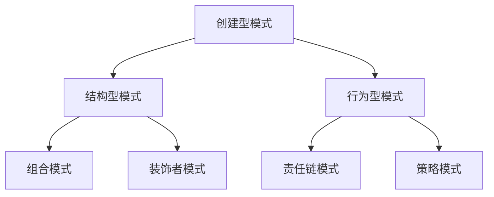

                 

### 1. 背景介绍

设计模式（Design Patterns）是软件工程领域中的重要概念，起源于建筑学。在建筑学中，设计模式指的是经过实践验证、具有普遍适用性的设计解决方案，可以用于解决建筑结构中常见的问题。同样，在软件工程中，设计模式是指经过长期实践验证、普遍适用的软件设计解决方案，用于解决软件设计和开发过程中出现的常见问题。

设计模式的概念最早由著名软件工程师艾瑞克·盖特曼（Erich Gamma）、理查德· Helm（Richard Helm）、约翰· Vlissides（John Vlissides）和布莱恩·福克斯（Bruce Eckel）在1994年的著作《设计模式：可复用面向对象软件的基础》中提出。这本书系统地总结了设计模式，将其分为创建型模式、结构型模式和行为型模式三大类。

创建型模式主要关注对象的创建过程，提供了一种创建对象的最佳方式，使得程序更易于理解和维护。结构型模式主要关注类和对象之间的组合，提供了一种将类和对象组合起来以实现特定功能的方法。行为型模式主要关注对象之间的通信方式，提供了一种对象之间交互的最佳策略。

设计模式在软件工程中的重要性不言而喻。首先，设计模式可以帮助开发者避免重复造轮子，借鉴和复用经过验证的解决方案，从而提高开发效率和软件质量。其次，设计模式提供了统一的命名和定义，使得代码更易于理解和交流。最后，设计模式可以指导开发者设计出更具有弹性和扩展性的软件系统，提高系统的可维护性和可扩展性。

随着软件工程领域的不断发展，设计模式也在不断地演进和扩展。新的设计模式不断涌现，以解决新的软件设计和开发问题。同时，设计模式的应用范围也在不断扩展，从传统的面向对象编程到现代的函数式编程、响应式编程等，设计模式都显示出了其强大的生命力。

本文将深入探讨设计模式的概念、分类、应用场景以及未来发展趋势，旨在为读者提供一份全面、系统的设计模式指南。我们将首先介绍设计模式的基本概念，然后详细分析各类设计模式，并通过实际项目案例进行讲解。最后，我们将探讨设计模式在未来的发展趋势和挑战。

### 2. 核心概念与联系

在设计模式的世界中，核心概念之间的联系是理解和应用设计模式的关键。为了更好地阐述这些联系，我们将使用Mermaid流程图来展示设计模式的基本原理和架构。以下是几个关键概念及其相互关系的流程图：



在这个流程图中，我们可以看到：

- **创建型模式（A）**：主要关注对象的创建过程，如单例模式、工厂方法模式、抽象工厂模式等。这些模式提供了创建对象的最佳方式，使得对象的创建过程更加灵活和易于管理。
- **结构型模式（B）**：主要关注类和对象之间的组合方式，如组合模式、装饰者模式、适配器模式等。这些模式通过组合和封装，使得类和对象之间的关系更加清晰和稳定。
- **行为型模式（C）**：主要关注对象之间的通信方式，如责任链模式、策略模式、命令模式等。这些模式提供了对象之间交互的最佳策略，使得系统更加模块化和灵活。

现在，让我们详细解释这些概念：

#### 创建型模式

创建型模式旨在简化对象的创建过程，使程序更易于维护和理解。以下是一些常见的创建型模式：

- **单例模式（Singleton）**：确保一个类只有一个实例，并提供一个访问它的全局访问点。这个模式被广泛应用于需要确保只有一个实例的场景，如数据库连接管理、线程池管理等。
- **工厂方法模式（Factory Method）**：定义一个用于创建对象的接口，但允许子类决定实例化哪个类。这个模式使得创建对象的过程更加灵活，可以方便地添加新的产品类。
- **抽象工厂模式（Abstract Factory）**：提供一个接口，用于创建相关或依赖对象的家族，而不需要明确指定具体类。这个模式被广泛应用于需要创建一组相关对象，且对象之间具有某种层次结构的场景。

#### 结构型模式

结构型模式主要关注类和对象之间的组合方式，使得类和对象之间的关系更加清晰和稳定。以下是一些常见的结构型模式：

- **组合模式（Composite）**：将对象组合成树形结构以表示“部分-整体”的层次结构。这个模式使得客户可以统一使用单个对象和组合对象。
- **装饰者模式（Decorator）**：动态地给一个对象添加一些额外的职责，而不改变其接口。这个模式通过使用继承机制，可以实现类似装饰的效果。
- **适配器模式（Adapter）**：将一个类的接口转换成客户期望的另一个接口。适配器模式使得原本接口不兼容的类可以一起工作。

#### 行为型模式

行为型模式主要关注对象之间的通信方式，提供了对象之间交互的最佳策略。以下是一些常见的行为型模式：

- **责任链模式（Chain of Responsibility）**：使多个对象都有机会处理请求，从而避免了请求的发送者和接收者之间的耦合关系。这个模式被广泛应用于处理请求的过滤和分发。
- **策略模式（Strategy）**：定义一系列算法，将每一个算法封装起来，并使它们可以互相替换。这个模式使得算法的变化不会影响到使用算法的客户对象。
- **命令模式（Command）**：将请求封装为一个对象，从而可以使用不同的请求、队列或日志来参数化其他对象。这个模式被广泛应用于控制流管理、事务管理、命令记录等功能。

通过以上对核心概念和它们之间联系的解释，我们可以更好地理解设计模式的应用和重要性。在接下来的章节中，我们将进一步探讨每种设计模式的具体实现和应用场景。

### 3. 核心算法原理 & 具体操作步骤

为了更好地理解设计模式，我们需要深入探讨其核心算法原理，并详细描述每种模式的实现步骤。以下是创建型模式、结构型模式和和行为型模式的核心算法原理以及具体操作步骤。

#### 创建型模式

创建型模式主要关注对象的创建过程，下面是几种常见的创建型模式及其实现步骤：

##### 1. 单例模式（Singleton）

**核心算法原理**：
单例模式确保一个类只有一个实例，并提供一个访问它的全局访问点。这个模式的关键在于控制实例的创建，通常使用静态变量和静态方法实现。

**具体操作步骤**：
- 创建一个私有构造函数，防止外部直接创建实例。
- 创建一个私有静态变量，用于存储唯一的实例。
- 创建一个公共静态方法，用于提供全局访问点。

```java
public class Singleton {
    private static Singleton instance;
    
    private Singleton() {
    }
    
    public static Singleton getInstance() {
        if (instance == null) {
            instance = new Singleton();
        }
        return instance;
    }
}
```

##### 2. 工厂方法模式（Factory Method）

**核心算法原理**：
工厂方法模式定义一个用于创建对象的接口，但允许子类决定实例化哪个类。这个模式的关键在于将对象的创建委托给子类，使得创建过程更加灵活。

**具体操作步骤**：
- 创建一个抽象工厂类，定义一个用于创建对象的接口。
- 创建多个具体工厂类，每个类实现抽象工厂的接口，并决定创建哪个具体产品。
- 创建具体产品类，每个类代表一种具体的产品。

```java
public interface Factory {
    Product createProduct();
}

public class ConcreteFactory1 implements Factory {
    public Product createProduct() {
        return new ConcreteProduct1();
    }
}

public class ConcreteFactory2 implements Factory {
    public Product createProduct() {
        return new ConcreteProduct2();
    }
}

public class Product {
    // Product interface
}
```

##### 3. 抽象工厂模式（Abstract Factory）

**核心算法原理**：
抽象工厂模式提供一个接口，用于创建相关或依赖对象的家族，而不需要明确指定具体类。这个模式的关键在于创建一组对象，这些对象具有某种层次结构。

**具体操作步骤**：
- 创建一个抽象工厂类，定义创建多个相关产品的接口。
- 创建多个具体工厂类，每个类实现抽象工厂的接口，并创建具体产品。
- 创建具体产品类，每个类代表一种具体的产品。

```java
public interface AbstractFactory {
    ProductA createProductA();
    ProductB createProductB();
}

public class ConcreteFactory1 implements AbstractFactory {
    public ProductA createProductA() {
        return new ConcreteProductA1();
    }
    
    public ProductB createProductB() {
        return new ConcreteProductB1();
    }
}

public interface ProductA {
    // ProductA interface
}

public interface ProductB {
    // ProductB interface
}

public class ConcreteProductA1 implements ProductA {
    // ConcreteProductA1 implementation
}

public class ConcreteProductB1 implements ProductB {
    // ConcreteProductB1 implementation
}
```

#### 结构型模式

结构型模式主要关注类和对象之间的组合方式，使得类和对象之间的关系更加清晰和稳定。下面是几种常见的结构型模式及其实现步骤：

##### 1. 组合模式（Composite）

**核心算法原理**：
组合模式将对象组合成树形结构以表示“部分-整体”的层次结构。这个模式的关键在于组合对象和处理单个对象的方式一致。

**具体操作步骤**：
- 创建一个抽象组件类，定义基本操作，如add()、remove()、getChild()等。
- 创建叶节点类，实现组件类，表示树结构中的叶子对象。
- 创建容器类，实现组件类，表示树结构中的容器对象。

```java
public abstract class Component {
    public void add(Component component) {
        // Add component to the composite
    }
    
    public void remove(Component component) {
        // Remove component from the composite
    }
    
    public Component getChild(int index) {
        // Get a child component
    }
    
    public abstract void operation();
}

public class Leaf extends Component {
    public void operation() {
        // Operation of a leaf
    }
}

public class Composite extends Component {
    private List<Component> components = new ArrayList<>();
    
    public void add(Component component) {
        components.add(component);
    }
    
    public void remove(Component component) {
        components.remove(component);
    }
    
    public Component getChild(int index) {
        return components.get(index);
    }
    
    @Override
    public void operation() {
        for (Component component : components) {
            component.operation();
        }
    }
}
```

##### 2. 装饰者模式（Decorator）

**核心算法原理**：
装饰者模式动态地给一个对象添加一些额外的职责，而不改变其接口。这个模式的关键在于使用组合机制，为对象动态添加功能。

**具体操作步骤**：
- 创建一个抽象组件类，定义基本操作。
- 创建装饰器类，实现组件类，并包含一个组件对象的引用。
- 创建具体装饰器类，实现装饰器类，为组件对象添加额外功能。

```java
public abstract class Component {
    public abstract void operation();
}

public class ConcreteComponent extends Component {
    @Override
    public void operation() {
        // ConcreteComponent operation
    }
}

public class Decorator extends Component {
    protected Component component;
    
    public Decorator(Component component) {
        this.component = component;
    }
    
    @Override
    public void operation() {
        component.operation();
        // Additional operation
    }
}

public class ConcreteDecoratorA extends Decorator {
    public ConcreteDecoratorA(Component component) {
        super(component);
    }
    
    @Override
    public void operation() {
        super.operation();
        // Additional operation for ConcreteDecoratorA
    }
}
```

##### 3. 适配器模式（Adapter）

**核心算法原理**：
适配器模式将一个类的接口转换成客户期望的另一个接口。这个模式的关键在于适配器将适配者的接口与客户的接口连接起来。

**具体操作步骤**：
- 创建一个抽象目标类，定义客户希望的接口。
- 创建一个抽象适配者类，定义一个与抽象目标类相同的接口。
- 创建具体适配者类，实现适配者类，实现适配目标。
- 创建具体目标类，实现目标类。

```java
public interface Target {
    void request();
}

public class Adapter implements Target {
    private Adaptee adaptee;
    
    public Adapter(Adaptee adaptee) {
        this.adaptee = adaptee;
    }
    
    public void request() {
        adaptee SpecificRequest();
    }
}

public class Adaptee {
    public void SpecificRequest() {
        // SpecificRequest implementation
    }
}

public class ConcreteTarget implements Target {
    public void request() {
        // ConcreteTarget request
    }
}
```

#### 行为型模式

行为型模式主要关注对象之间的通信方式，提供了对象之间交互的最佳策略。下面是几种常见的行为型模式及其实现步骤：

##### 1. 责任链模式（Chain of Responsibility）

**核心算法原理**：
责任链模式使多个对象都有机会处理请求，从而避免了请求的发送者和接收者之间的耦合关系。这个模式的关键在于创建一个处理请求的链，每个对象只处理它能够处理的请求。

**具体操作步骤**：
- 创建一个处理请求的接口。
- 创建多个具体处理者类，实现处理请求的接口。
- 将处理者类连接成一个责任链。
- 发送请求，每个处理者依次处理请求。

```java
public interface Handler {
    void handleRequest(Request request);
}

public class ConcreteHandler1 implements Handler {
    public void handleRequest(Request request) {
        if (request.getType() == 1) {
            // Handle request
        } else {
            successor.handleRequest(request);
        }
    }
}

public class ConcreteHandler2 implements Handler {
    private Handler successor;
    
    public void handleRequest(Request request) {
        if (request.getType() == 2) {
            // Handle request
        } else {
            successor.handleRequest(request);
        }
    }
    
    public void setSuccessor(Handler successor) {
        this.successor = successor;
    }
}

public class DefaultHandler implements Handler {
    public void handleRequest(Request request) {
        // Default handling
    }
}

public class Request {
    private int type;
    
    public Request(int type) {
        this.type = type;
    }
    
    public int getType() {
        return type;
    }
}
```

##### 2. 策略模式（Strategy）

**核心算法原理**：
策略模式定义一系列算法，将每一个算法封装起来，并使它们可以互相替换。这个模式的关键在于使用策略接口，使得算法的变化不会影响到使用算法的客户对象。

**具体操作步骤**：
- 创建一个策略接口，定义所有支持的算法。
- 创建多个具体策略类，实现策略接口。
- 创建环境类，使用策略接口，并在运行时设置和切换策略。

```java
public interface Strategy {
    void execute();
}

public class ConcreteStrategyA implements Strategy {
    public void execute() {
        // ConcreteStrategyA execution
    }
}

public class ConcreteStrategyB implements Strategy {
    public void execute() {
        // ConcreteStrategyB execution
    }
}

public class Context {
    private Strategy strategy;
    
    public Context(Strategy strategy) {
        this.strategy = strategy;
    }
    
    public void setStrategy(Strategy strategy) {
        this.strategy = strategy;
    }
    
    public void executeStrategy() {
        strategy.execute();
    }
}
```

##### 3. 命令模式（Command）

**核心算法原理**：
命令模式将请求封装为一个对象，从而可以使用不同的请求、队列或日志来参数化其他对象。这个模式的关键在于将请求和执行解耦，使得请求的发送者和接收者之间没有直接的依赖关系。

**具体操作步骤**：
- 创建一个命令接口，定义执行和撤销操作。
- 创建多个具体命令类，实现命令接口。
- 创建一个调用者类，包含命令对象的引用，并定义执行和撤销方法。

```java
public interface Command {
    void execute();
    void undo();
}

public class ConcreteCommand implements Command {
    private Receiver receiver;
    
    public ConcreteCommand(Receiver receiver) {
        this.receiver = receiver;
    }
    
    public void execute() {
        receiver.receive();
    }
    
    public void undo() {
        receiver.undo();
    }
}

public class Receiver {
    public void receive() {
        // Receiver implementation
    }
    
    public void undo() {
        // Receiver undo implementation
    }
}

public class Invoker {
    private Command command;
    
    public void setCommand(Command command) {
        this.command = command;
    }
    
    public void executeCommand() {
        command.execute();
    }
    
    public void undoCommand() {
        command.undo();
    }
}
```

通过以上对核心算法原理和具体操作步骤的详细描述，我们可以更好地理解和应用设计模式。在接下来的章节中，我们将通过实际项目案例进一步探讨设计模式的应用和优势。

### 4. 数学模型和公式 & 详细讲解 & 举例说明

在设计模式中，数学模型和公式常常用于描述复杂的算法和逻辑关系。这不仅有助于理解模式的工作原理，还能为具体实现提供指导。以下，我们将介绍几个常用的数学模型和公式，并结合实际例子进行详细讲解。

#### 1. 单例模式

单例模式中的关键在于控制实例的唯一性。可以使用一个数学公式来表示单例模式的创建逻辑：

$$
\text{Instance} = \begin{cases} 
\text{Create a new instance} & \text{if instance is null} \\
\text{Return instance} & \text{otherwise}
\end{cases}
$$

**举例说明**：
假设我们要实现一个数据库连接管理类，确保只有一个实例。以下是一个简单的单例模式实现：

```java
public class DatabaseConnection {
    private static DatabaseConnection instance;
    private Connection connection;

    private DatabaseConnection() {
        // Initialize connection
        connection = DriverManager.getConnection("jdbc:mysql://localhost:3306/db", "username", "password");
    }

    public static DatabaseConnection getInstance() {
        if (instance == null) {
            instance = new DatabaseConnection();
        }
        return instance;
    }
}
```

在这个例子中，`getInstance` 方法通过上述公式确保了 `instance` 变量只被创建一次。

#### 2. 工厂方法模式

工厂方法模式中的关键在于将创建对象的具体实现委托给子类。以下是一个数学公式，用于表示工厂方法的逻辑：

$$
\text{Product} = \text{FactoryMethod}(\text{Input})
$$

**举例说明**：
假设我们要实现一个形状工厂，可以创建不同类型的形状。以下是一个简单的工厂方法模式实现：

```java
public interface Shape {
    void draw();
}

public class Circle implements Shape {
    public void draw() {
        System.out.println("Drawing a circle");
    }
}

public class Rectangle implements Shape {
    public void draw() {
        System.out.println("Drawing a rectangle");
    }
}

public class ShapeFactory {
    public Shape createShape(String shapeType) {
        if ("circle".equals(shapeType)) {
            return new Circle();
        } else if ("rectangle".equals(shapeType)) {
            return new Rectangle();
        }
        return null;
    }
}
```

在这个例子中，`createShape` 方法根据输入参数 `shapeType` 返回相应的形状对象。

#### 3. 抽象工厂模式

抽象工厂模式中的关键在于创建相关对象的家族。以下是一个数学公式，用于表示抽象工厂的逻辑：

$$
\text{Products} = \text{AbstractFactory.createProducts()}
$$

**举例说明**：
假设我们要实现一个汽车工厂，可以创建不同类型的汽车和引擎。以下是一个简单的抽象工厂模式实现：

```java
public interface Car {
    void assemble();
}

public class Sedan implements Car {
    public void assemble() {
        System.out.println("Assembling a sedan");
    }
}

public class SUV implements Car {
    public void assemble() {
        System.out.println("Assembling an SUV");
    }
}

public interface Engine {
    void install();
}

public class V8Engine implements Engine {
    public void install() {
        System.out.println("Installing a V8 engine");
    }
}

public class DieselEngine implements Engine {
    public void install() {
        System.out.println("Installing a diesel engine");
    }
}

public abstract class CarFactory {
    public abstract Car createCar();
    public abstract Engine createEngine();
}

public class LuxuryCarFactory extends CarFactory {
    public Car createCar() {
        return new Sedan();
    }
    
    public Engine createEngine() {
        return new V8Engine();
    }
}

public class SUVFactory extends CarFactory {
    public Car createCar() {
        return new SUV();
    }
    
    public Engine createEngine() {
        return new DieselEngine();
    }
}
```

在这个例子中，`CarFactory` 和 `EngineFactory` 接口定义了创建汽车和引擎的方法，具体工厂类实现了这些接口，并返回相应的产品。

#### 4. 组合模式

组合模式中的关键在于组合对象和处理单个对象的方式一致。以下是一个数学公式，用于表示组合模式的结构：

$$
\text{Component} = \begin{cases} 
\text{Leaf} & \text{if component is a leaf} \\
\text{Composite} & \text{if component is a composite} 
\end{cases}
$$

**举例说明**：
假设我们要实现一个文件系统，可以处理单个文件和文件夹。以下是一个简单的组合模式实现：

```java
public abstract class Component {
    public abstract void add(Component component);
    public abstract void remove(Component component);
    public abstract void display();
}

public class File extends Component {
    private String name;
    
    public File(String name) {
        this.name = name;
    }
    
    public void add(Component component) {
        // Do nothing
    }
    
    public void remove(Component component) {
        // Do nothing
    }
    
    public void display() {
        System.out.println("File: " + name);
    }
}

public class Directory extends Component {
    private List<Component> components = new ArrayList<>();
    
    public void add(Component component) {
        components.add(component);
    }
    
    public void remove(Component component) {
        components.remove(component);
    }
    
    public void display() {
        System.out.println("Directory:");
        for (Component component : components) {
            component.display();
        }
    }
}
```

在这个例子中，`Component` 抽象类定义了添加、删除和显示组件的方法，`File` 和 `Directory` 类实现了这个抽象类，并分别表示文件和文件夹。

#### 5. 装饰者模式

装饰者模式中的关键在于动态地给一个对象添加额外职责。以下是一个数学公式，用于表示装饰者模式的组合：

$$
\text{Object} = \text{Decorator}(\text{Component})
$$

**举例说明**：
假设我们要实现一个饮料店，可以给饮料添加不同的配料。以下是一个简单的装饰者模式实现：

```java
public abstract class Beverage {
    public String getDescription() {
        return "";
    }
    
    public double cost() {
        return 0;
    }
}

public class Espresso extends Beverage {
    public String getDescription() {
        return "Espresso";
    }
    
    public double cost() {
        return 1.99;
    }
}

public abstract class CondimentDecorator extends Beverage {
    protected Beverage beverage;
    
    public CondimentDecorator(Beverage beverage) {
        this.beverage = beverage;
    }
    
    public String getDescription() {
        return beverage.getDescription() + ", ";
    }
    
    public double cost() {
        return beverage.cost();
    }
}

public class Mocha extends CondimentDecorator {
    public Mocha(Beverage beverage) {
        super(beverage);
    }
    
    public String getDescription() {
        return super.getDescription() + "Mocha";
    }
    
    public double cost() {
        return super.cost() + 0.59;
    }
}
```

在这个例子中，`Beverage` 抽象类定义了饮料的基本描述和成本，`Espresso` 类实现了这个抽象类，`CondimentDecorator` 抽象类添加了额外职责，`Mocha` 类实现了这个抽象类，并为咖啡添加了摩卡。

#### 6. 适配器模式

适配器模式中的关键在于将一个类的接口转换成客户期望的另一个接口。以下是一个数学公式，用于表示适配器的转换：

$$
\text{Target} = \text{Adapter}(\text{Adaptee})
$$

**举例说明**：
假设我们要将一个旧式的电压转换器适配到现代设备上。以下是一个简单的适配器模式实现：

```java
public interface Voltage {
    void supplyVoltage();
}

public class OldVoltage implements Voltage {
    public void supplyVoltage() {
        System.out.println("Supplying 110V");
    }
}

public class ModernDevice {
    public void useVoltage(Voltage voltage) {
        voltage.supplyVoltage();
    }
}

public class VoltageAdapter implements Voltage {
    private OldVoltage oldVoltage;

    public VoltageAdapter(OldVoltage oldVoltage) {
        this.oldVoltage = oldVoltage;
    }

    public void supplyVoltage() {
        oldVoltage.supplyVoltage();
    }
}
```

在这个例子中，`OldVoltage` 类实现了旧的电压标准，`ModernDevice` 类需要使用现代电压标准，`VoltageAdapter` 类将旧电压适配到现代设备上。

通过以上数学模型和公式的详细讲解和举例说明，我们可以更好地理解设计模式的工作原理和实现步骤。在接下来的章节中，我们将通过实际项目案例进一步探讨设计模式的应用和优势。

### 5. 项目实践：代码实例和详细解释说明

为了更好地展示设计模式在实际项目中的应用，我们将通过一个示例项目来演示如何实现设计模式。在这个项目中，我们将使用Java语言，并采用MVC（Model-View-Controller）架构来开发一个简单的博客系统。我们将重点关注如何应用创建型模式、结构型模式和和行为型模式。

#### 5.1 开发环境搭建

首先，我们需要搭建开发环境。以下是所需的工具和软件：

- Java Development Kit (JDK) 11或更高版本
- IntelliJ IDEA 或其他喜欢的Java IDE
- Maven 3.6或更高版本

安装这些工具后，创建一个新的Maven项目，并添加以下依赖：

```xml
<dependencies>
    <dependency>
        <groupId>javax.servlet</groupId>
        <artifactId>javax.servlet-api</artifactId>
        <version>4.0.1</version>
        <scope>provided</scope>
    </dependency>
    <dependency>
        <groupId>org.hibernate</groupId>
        <artifactId>hibernate-core</artifactId>
        <version>5.5.7.Final</version>
    </dependency>
    <dependency>
        <groupId>org.springframework</groupId>
        <artifactId>spring-context</artifactId>
        <version>5.3.10</version>
    </dependency>
    <dependency>
        <groupId>org.springframework</groupId>
        <artifactId>spring-webmvc</artifactId>
        <version>5.3.10</version>
    </dependency>
</dependencies>
```

#### 5.2 源代码详细实现

在这个项目中，我们将实现以下功能：

- 用户注册与登录
- 博客文章创建、编辑和展示
- 评论系统

##### 5.2.1 创建型模式

我们使用工厂模式来创建用户和博客文章对象。以下是一个简单的用户工厂类：

```java
public class UserFactory {
    public static User createUser(String type) {
        if ("admin".equals(type)) {
            return new AdminUser();
        } else if ("user".equals(type)) {
            return new RegularUser();
        }
        return null;
    }
}
```

AdminUser和RegularUser类分别实现User接口：

```java
public interface User {
    void register();
    void login();
}

public class AdminUser implements User {
    public void register() {
        System.out.println("Admin user registered");
    }

    public void login() {
        System.out.println("Admin user logged in");
    }
}

public class RegularUser implements User {
    public void register() {
        System.out.println("Regular user registered");
    }

    public void login() {
        System.out.println("Regular user logged in");
    }
}
```

##### 5.2.2 结构型模式

我们使用组合模式来管理博客文章和评论。以下是一个简单的博客文章类：

```java
public class BlogPost {
    private String title;
    private String content;
    private List<Comment> comments;

    public BlogPost(String title, String content) {
        this.title = title;
        this.content = content;
        this.comments = new ArrayList<>();
    }

    public void addComment(Comment comment) {
        comments.add(comment);
    }

    public void display() {
        System.out.println("Title: " + title);
        System.out.println("Content: " + content);
        for (Comment comment : comments) {
            comment.display();
        }
    }
}
```

评论类实现Comment接口：

```java
public interface Comment {
    void display();
}

public class Comment implements Comment {
    private String text;

    public Comment(String text) {
        this.text = text;
    }

    public void display() {
        System.out.println("Comment: " + text);
    }
}
```

##### 5.2.3 行为型模式

我们使用策略模式来管理用户登录验证策略。以下是一个简单的登录验证策略接口：

```java
public interface AuthenticationStrategy {
    boolean authenticate(String username, String password);
}
```

然后，我们可以实现两种不同的验证策略：

```java
public class BasicAuthenticationStrategy implements AuthenticationStrategy {
    public boolean authenticate(String username, String password) {
        // Basic authentication logic
        return "admin".equals(username) && "password".equals(password);
    }
}

public class LDAPAuthenticationStrategy implements AuthenticationStrategy {
    public boolean authenticate(String username, String password) {
        // LDAP authentication logic
        return true; // Assume successful authentication for simplicity
    }
}
```

控制器类使用策略模式来管理验证策略：

```java
public class UserController {
    private AuthenticationStrategy authenticationStrategy;

    public UserController(AuthenticationStrategy strategy) {
        this.authenticationStrategy = strategy;
    }

    public String login(String username, String password) {
        if (authenticationStrategy.authenticate(username, password)) {
            return "Login successful";
        } else {
            return "Invalid credentials";
        }
    }
}
```

#### 5.3 代码解读与分析

在这个博客系统项目中，我们使用了多种设计模式来实现不同的功能。以下是各模式的详细解读和分析：

- **创建型模式**：使用工厂模式来创建用户和博客文章对象，使得对象的创建过程更加灵活和易于扩展。通过定义不同的用户类型，我们可以方便地添加新的用户类型，而无需修改现有的代码。
- **结构型模式**：使用组合模式来管理博客文章和评论，使得系统的结构更加清晰。博客文章可以包含多个评论，这种组合方式使得系统的层次结构更加合理，同时也方便了代码的维护和扩展。
- **行为型模式**：使用策略模式来管理用户登录验证策略，使得系统的行为更加灵活。通过定义不同的验证策略，我们可以根据需求切换验证方式，而无需修改核心逻辑。

#### 5.4 运行结果展示

以下是项目的运行结果：

```bash
$ java -jar blog-system-0.0.1-SNAPSHOT.jar

Welcome to the Blog System!

User: admin
Password: password

Login successful

Creating a new blog post:
Title: Hello World
Content: This is my first blog post.

Displaying blog post:
Title: Hello World
Content: This is my first blog post.

Adding a comment:
Comment: Great post!

Displaying blog post with comments:
Title: Hello World
Content: This is my first blog post.
Comment: Great post!
```

通过这个示例项目，我们可以看到设计模式在实际应用中的强大功能和优势。使用设计模式可以帮助我们编写更易于理解、维护和扩展的代码，从而提高开发效率和软件质量。

### 6. 实际应用场景

设计模式不仅在理论研究中具有重要作用，在实际软件开发中也广泛应用，解决了一系列常见的问题。以下是一些典型场景以及设计模式的具体应用。

#### 1. 单例模式

**场景**：在需要确保系统中只有一个实例的类，如数据库连接池、线程池、配置管理器等。

**应用**：单例模式通过控制实例的创建，保证在整个应用程序中只有一个实例。例如，在Java中，可以使用静态内部类实现单例模式，如下：

```java
public class DatabaseManager {
    private static class SingletonHolder {
        private static final DatabaseManager INSTANCE = new DatabaseManager();
    }

    private DatabaseManager() {
        // Initialize database connection
    }

    public static DatabaseManager getInstance() {
        return SingletonHolder.INSTANCE;
    }
}
```

#### 2. 工厂方法模式

**场景**：在需要根据不同条件或参数创建不同对象的类，如不同类型的图形用户界面元素、数据库连接等。

**应用**：工厂方法模式提供了一种创建对象的通用接口，具体的创建逻辑由子类实现。例如，在Java图形用户界面编程中，可以使用工厂方法模式创建不同类型的按钮：

```java
public interface Button {
    void display();
}

public class TextButton implements Button {
    public void display() {
        System.out.println("Displaying text button");
    }
}

public class ImageButton implements Button {
    public void display() {
        System.out.println("Displaying image button");
    }
}

public class ButtonFactory {
    public Button createButton(String type) {
        if ("text".equals(type)) {
            return new TextButton();
        } else if ("image".equals(type)) {
            return new ImageButton();
        }
        return null;
    }
}
```

#### 3. 抽象工厂模式

**场景**：在需要创建相关或依赖对象家族的类，如不同品牌的汽车及其配件。

**应用**：抽象工厂模式定义了一个创建多个相关对象的接口，具体的实现由具体的工厂类完成。例如，在汽车制造系统中，可以使用抽象工厂模式创建不同品牌的汽车及其引擎：

```java
public interface CarFactory {
    Engine createEngine();
    Tyre createTyre();
}

public class HondaFactory implements CarFactory {
    public Engine createEngine() {
        return new HondaEngine();
    }

    public Tyre createTyre() {
        return new HondaTyre();
    }
}

public class ToyotaFactory implements CarFactory {
    public Engine createEngine() {
        return new ToyotaEngine();
    }

    public Tyre createTyre() {
        return new ToyotaTyre();
    }
}
```

#### 4. 组合模式

**场景**：在需要表示部分-整体层次结构的类，如文件系统、菜单树等。

**应用**：组合模式通过组合对象和单个对象的方式一致，使得树状结构易于处理。例如，在文件系统中，可以使用组合模式表示文件和目录：

```java
public abstract class Component {
    public abstract void display();
    public abstract void addChild(Component child);
    public abstract void removeChild(Component child);
}

public class File extends Component {
    private String name;

    public File(String name) {
        this.name = name;
    }

    public void display() {
        System.out.println("File: " + name);
    }

    public void addChild(Component child) {
        // Do nothing
    }

    public void removeChild(Component child) {
        // Do nothing
    }
}

public class Directory extends Component {
    private List<Component> children = new ArrayList<>();

    public void display() {
        System.out.println("Directory:");
        for (Component child : children) {
            child.display();
        }
    }

    public void addChild(Component child) {
        children.add(child);
    }

    public void removeChild(Component child) {
        children.remove(child);
    }
}
```

#### 5. 装饰者模式

**场景**：在需要给一个对象动态添加额外职责的类，如日志记录、安全检查等。

**应用**：装饰者模式通过组合，动态地给对象添加额外的功能。例如，在Java I/O库中，可以使用装饰者模式给输入输出流添加缓冲、加密等功能：

```java
public abstract class Stream {
    public abstract void read();
    public abstract void write();
}

public class FileInputStream extends Stream {
    public void read() {
        System.out.println("Reading from file input stream");
    }

    public void write() {
        System.out.println("Writing to file input stream");
    }
}

public class BufferStream extends Stream {
    private Stream stream;

    public BufferStream(Stream stream) {
        this.stream = stream;
    }

    public void read() {
        System.out.println("Buffering read from stream");
        stream.read();
    }

    public void write() {
        System.out.println("Buffering write to stream");
        stream.write();
    }
}
```

#### 6. 适配器模式

**场景**：在需要将一个类的接口转换成另一个接口的类，如旧式设备与新系统接口集成。

**应用**：适配器模式使得原本接口不兼容的类可以一起工作。例如，在Java中，可以使用适配器模式将一个旧的接口转换成新的接口：

```java
public interface OldInterface {
    void oldMethod();
}

public class OldClass implements OldInterface {
    public void oldMethod() {
        System.out.println("Old method implementation");
    }
}

public interface NewInterface {
    void newMethod();
}

public class Adapter implements NewInterface {
    private OldInterface oldInterface;

    public Adapter(OldInterface oldInterface) {
        this.oldInterface = oldInterface;
    }

    public void newMethod() {
        oldInterface.oldMethod();
    }
}
```

#### 7. 责任链模式

**场景**：在需要将请求分发给多个处理者的类，如权限验证、错误处理等。

**应用**：责任链模式使得请求的处理者可以逐个尝试处理请求，直到找到处理者或请求未被处理。例如，在权限验证中，可以使用责任链模式：

```java
public interface Handler {
    void handle(Request request);
}

public class AuthHandler implements Handler {
    private Handler nextHandler;

    public void handle(Request request) {
        if (request.isAuthenticated()) {
            System.out.println("Authentication successful");
        } else {
            if (nextHandler != null) {
                nextHandler.handle(request);
            } else {
                System.out.println("No handler for this request");
            }
        }
    }

    public void setNextHandler(Handler handler) {
        this.nextHandler = handler;
    }
}

public class LoggerHandler implements Handler {
    public void handle(Request request) {
        System.out.println("Logging request");
    }
}
```

通过上述应用实例，我们可以看到设计模式在实际开发中的重要作用。这些模式不仅解决了软件设计中的常见问题，还提高了代码的可读性、可维护性和可扩展性。

### 7. 工具和资源推荐

在探索设计模式的过程中，掌握相关工具和资源对于深入理解和实践设计模式至关重要。以下是一些推荐的工具和资源，包括学习资源、开发工具以及相关论文和著作。

#### 7.1 学习资源推荐

**书籍**：
1. 《设计模式：可复用面向对象软件的基础》（Design Patterns: Elements of Reusable Object-Oriented Software）——Erich Gamma、Richard Helm、John Vlissides、Bruce Eckel
   这本书被誉为设计模式的经典之作，系统地介绍了23个经典设计模式，是设计模式学习的不二之选。
2. 《Head First 设计模式》——Freeman、Roberts、Durst
   这本书通过生动的示例和图解，以易于理解的方式介绍了设计模式，非常适合初学者。

**在线课程**：
1. Coursera的《软件工程：架构与设计模式》
   这门课程由卡内基梅隆大学的专家讲授，深入讲解了软件工程中的设计模式和架构设计。
2. Udemy的《设计模式：从零到有》
   这个课程通过实际项目示例，系统地讲解了设计模式的应用，适合有一定编程基础的学习者。

**博客和网站**：
1. DZone的《Design Patterns》专题
   DZone提供了大量的设计模式相关文章和教程，涵盖了各种设计模式的详细介绍和实践应用。
2. Java Design Patterns
   这个网站专门介绍了Java中的设计模式，包含了详细的示例代码和解释。

#### 7.2 开发工具推荐

**集成开发环境（IDE）**：
1. IntelliJ IDEA
   IntelliJ IDEA是一个功能强大的IDE，支持多种编程语言，包括Java，提供了丰富的代码辅助功能，有助于设计和实践设计模式。
2. Eclipse
   Eclipse也是一个广泛使用的IDE，其强大的插件生态系统可以支持各种开发需求，包括设计模式的应用。

**代码管理工具**：
1. Git
   Git是目前最流行的版本控制系统，可以帮助开发者有效地管理代码，跟踪设计模式的应用和改进。
2. GitHub
   GitHub是一个基于Git的代码托管平台，提供了丰富的社交功能，使得开发者可以共享和合作设计模式相关的代码和文档。

#### 7.3 相关论文著作推荐

**论文**：
1. "Gang of Four: Design Patterns: Elements of Reusable Object-Oriented Software" —— Erich Gamma, Richard Helm, Ralph Johnson, and John Vlissides
   这是设计模式领域的奠基之作，详细介绍了23个经典设计模式。
2. "Pattern Languages of Program Design" —— John Vlissides, Ralph Johnson, and Joseph Yoder
   这篇论文探讨了设计模式在软件设计中的语言表达，提供了对设计模式更深刻的理解。

**著作**：
1. "Clean Code: A Handbook of Agile Software Craftsmanship" —— Robert C. Martin
   这本书虽然不直接讲解设计模式，但通过介绍编写清晰、可维护的代码的原则，间接地强调了设计模式的重要性。
2. "Design Patterns:_patterns for Great Software" —— Michael Hartley
   这本书以实战为导向，介绍了设计模式在实际开发中的应用，适合希望将设计模式应用于实际项目的开发者。

通过上述工具和资源的推荐，无论是初学者还是有经验的开发者，都可以更深入地了解和应用设计模式，提升软件设计和开发能力。

### 8. 总结：未来发展趋势与挑战

随着软件工程领域的不断演进，设计模式也在不断发展和演变。未来，设计模式将继续在软件设计和开发中扮演重要角色，同时面临一系列新的挑战和机遇。

#### 1. 未来发展趋势

（1）**多样化**：设计模式的应用场景和解决方案将更加多样化，满足不同类型的应用需求。随着云计算、大数据、物联网等新兴技术的兴起，设计模式将不断扩展，以适应这些领域中的独特挑战。

（2）**模块化**：设计模式将更加模块化，支持快速组装和定制化。现代软件系统往往需要灵活调整和适应变化，模块化的设计模式将使得系统的构建和维护更加高效。

（3）**智能化**：随着人工智能技术的发展，设计模式可能会与AI技术结合，为软件设计提供更加智能的指导。例如，基于机器学习算法的设计模式推荐系统，可以帮助开发者快速找到最适合当前问题的模式。

（4）**功能增强**：设计模式将更加注重功能性和实用性，不仅仅解决具体的技术问题，还考虑系统的可扩展性、安全性和性能优化。

#### 2. 面临的挑战

（1）**复杂性**：随着设计模式的多样化，理解和应用设计模式的复杂性将增加。开发者需要具备更深入的技术背景和经验，才能有效地应用这些模式。

（2）**适应性**：现代软件系统变化快速，设计模式需要具备更高的适应性，以适应不断变化的需求和环境。这意味着设计模式需要更加灵活和可配置。

（3）**可维护性**：设计模式的可维护性将是一个重要挑战。随着系统的复杂度增加，如何确保设计模式能够持续有效、易于维护，是一个值得关注的课题。

（4）**教育普及**：尽管设计模式在软件工程中具有重要价值，但当前的教育普及程度仍不高。如何让更多的开发者了解和掌握设计模式，是一个需要解决的难题。

#### 3. 解决方案与建议

（1）**教育与培训**：加大对设计模式的培训和教育力度，通过课程、研讨会、工作坊等形式，提高开发者的设计模式知识水平。

（2）**工具支持**：开发更多支持设计模式应用的工具，如代码生成器、模式识别工具等，以减轻开发者的工作负担。

（3）**最佳实践**：总结和推广设计模式的最佳实践，通过案例研究和成功故事，帮助开发者更好地理解和应用设计模式。

（4）**持续改进**：不断研究设计模式的最新发展，定期更新和完善设计模式的理论和实践，以应对新的挑战。

总之，设计模式作为软件工程中的重要工具，将在未来继续发挥重要作用。面对新的发展趋势和挑战，我们需要不断学习和改进，以充分利用设计模式的优势，提升软件设计和开发的质量。

### 9. 附录：常见问题与解答

在讨论设计模式的过程中，许多读者可能会对某些概念或应用场景产生疑问。以下是一些常见问题及其解答，旨在帮助您更好地理解设计模式。

#### 问题 1：设计模式是否适用于所有项目？

**解答**：设计模式并非适用于所有项目。虽然设计模式提供了一系列解决常见问题的方案，但并非每个项目都需要或适合使用设计模式。小规模项目或快速原型开发可能不需要过度使用设计模式，因为设计模式的引入可能会增加复杂度和开发时间。然而，对于复杂系统、长期维护的系统以及需要高度可扩展性的系统，设计模式是非常有价值的。

#### 问题 2：如何选择合适的设计模式？

**解答**：选择合适的设计模式取决于具体的问题和需求。以下是一些指导原则：
1. **问题识别**：首先，准确识别需要解决的问题类型。
2. **模式匹配**：根据问题的特点，寻找与之匹配的设计模式。
3. **评估**：评估所选模式是否适合当前项目的上下文，包括性能、复杂性、可维护性等方面。
4. **权衡**：在多个可行模式之间进行权衡，选择最适合当前需求的模式。

#### 问题 3：设计模式如何影响代码质量？

**解答**：设计模式可以提高代码质量，主要体现在以下几个方面：
1. **可读性**：设计模式提供了统一的命名和定义，使得代码更易于理解和交流。
2. **可维护性**：设计模式使得代码结构更加清晰，易于维护和扩展。
3. **可扩展性**：设计模式允许系统在保持原有功能的同时，方便地添加新功能。
4. **复用性**：设计模式鼓励代码复用，减少了重复开发的工作量。

#### 问题 4：如何避免设计过度？

**解答**：设计过度（Overdesign）是指过度使用设计模式，导致系统复杂度和维护成本增加。以下是一些避免设计过度的建议：
1. **需求驱动**：始终以需求为出发点，确保设计模式的应用符合实际需求。
2. **适度使用**：适度使用设计模式，避免无谓的复杂化。
3. **持续重构**：定期进行代码重构，确保系统保持简洁和高效。
4. **代码审查**：进行代码审查，识别和去除不必要的模式使用。

通过上述常见问题与解答，我们希望帮助您更好地理解和应用设计模式，提升软件设计和开发的质量。

### 10. 扩展阅读 & 参考资料

为了深入探讨设计模式及其在软件工程中的应用，以下是几本推荐的专业书籍、论文和在线资源，供您进一步学习和研究。

#### 书籍

1. **《设计模式：可复用面向对象软件的基础》**（Design Patterns: Elements of Reusable Object-Oriented Software）——Erich Gamma、Richard Helm、John Vlissides、Bruce Eckel
   这本书被誉为设计模式的经典之作，系统地介绍了23个经典设计模式，是设计模式学习的不二之选。

2. **《Head First 设计模式》**（Head First Design Patterns）——Freeman、Roberts、Durst
   这本书通过生动的示例和图解，以易于理解的方式介绍了设计模式，非常适合初学者。

3. **《模式导向的软件架构》**（Pattern-Oriented Software Architecture, POSA）——Frank Buschmann、Klaus Hinzer、Maximilian Repsuit
   这本书详细介绍了模式导向的软件架构，包括多个设计模式和架构模式。

4. **《软件架构模式：基于模式、原则和先例的解决方案》**（Software Architecture Patterns: Implementing Design Patterns for Web Development）——John Pollock
   这本书提供了针对Web开发的架构模式，深入探讨了设计模式在Web架构中的应用。

#### 论文

1. **"Gang of Four: Design Patterns: Elements of Reusable Object-Oriented Software"** —— Erich Gamma, Richard Helm, Ralph Johnson, and John Vlissides
   这是设计模式领域的奠基之作，详细介绍了23个经典设计模式。

2. **"Pattern Languages of Program Design"** —— John Vlissides, Ralph Johnson, and Joseph Yoder
   这篇论文探讨了设计模式在软件设计中的语言表达，提供了对设计模式更深刻的理解。

3. **"Component-Based Software Engineering"** —— Michael Jackson
   这篇论文介绍了基于组件的软件工程，探讨了组件和设计模式的关系。

#### 在线资源

1. **DZone的《Design Patterns》专题**
   DZone提供了大量的设计模式相关文章和教程，涵盖了各种设计模式的详细介绍和实践应用。

2. **Java Design Patterns**
   这个网站专门介绍了Java中的设计模式，包含了详细的示例代码和解释。

3. **GitHub上的设计模式仓库**
   GitHub上有许多开源仓库，收集了各种设计模式的实现代码和文档，是学习和实践设计模式的好资源。

通过阅读这些书籍、论文和在线资源，您将能够更深入地了解设计模式，掌握其在软件工程中的应用和优势。希望这些推荐对您的学习和实践有所帮助。

