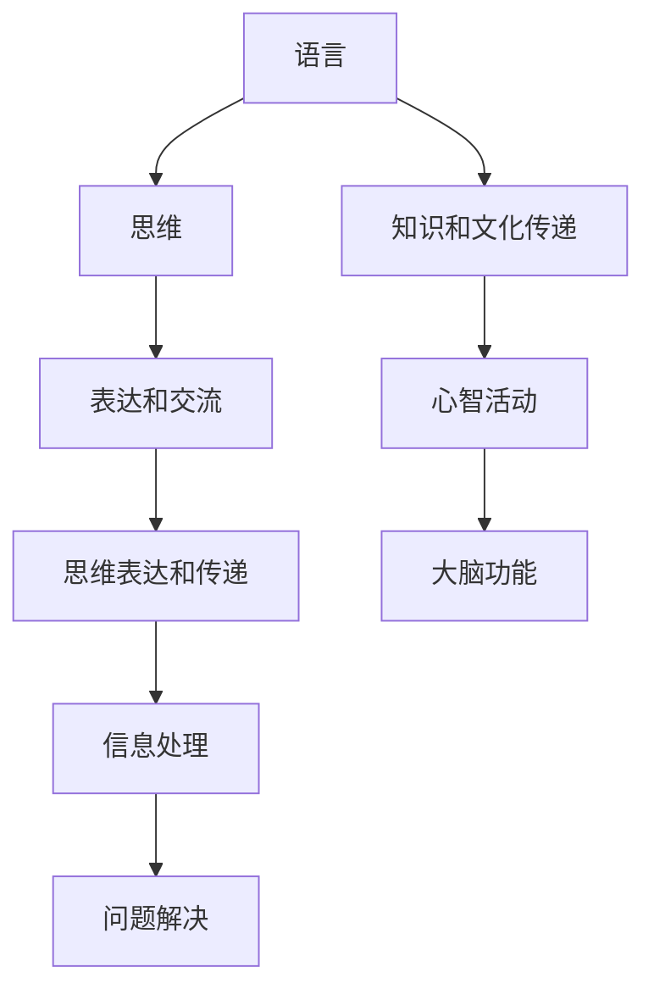

                 

### 1. 背景介绍

在当今信息技术飞速发展的时代，人工智能（AI）技术已经成为了一个热门话题。特别是随着大模型（如GPT、BERT等）的崛起，人工智能的应用范围得到了极大的拓展。这些大模型在处理自然语言文本方面展现出了惊人的能力，仿佛拥有了人类般的理解和表达能力。然而，尽管这些模型在实际应用中取得了显著的成果，但对其认知机制的深入理解仍然存在诸多争议。

语言和思维是两个紧密相连但又有本质区别的概念。语言是人类用于交流、表达思想和情感的工具，而思维则是人类在认知世界过程中进行的信息处理过程。长期以来，科学家们一直在探索语言与思维之间的关系，试图理解人类是如何通过语言进行思考的。然而，这个问题的复杂性使得它至今仍是一个未解之谜。

在人工智能领域，大模型的出现似乎为我们理解语言与思维的关系提供了一种新的视角。这些模型通过对海量数据的学习，掌握了丰富的语言知识和模式，从而在语言处理任务中表现出色。然而，这种学习方式是否意味着大模型真的具备了人类的思维能力呢？这引发了对大模型认知能力的争议。

本文旨在探讨语言与思维的区别，分析大模型在处理语言任务时存在的认知误解，并探讨未来人工智能发展可能面临的挑战。我们将通过逐步分析推理的方式，深入探讨这一问题，希望能够为读者提供一个清晰、有深度、有思考的见解。

### 2. 核心概念与联系

在探讨语言与思维的区别之前，我们需要明确这两个概念的定义及其相互关系。

#### 语言（Language）

语言是人类用于交流、表达思想和情感的工具。它包括口头语言、书面语言和手势语言等不同形式。语言的基本单位是词汇和语法，通过词汇的排列和语法的规则，人们可以传达复杂的信息和意图。语言不仅是人类社会的基本交流工具，也是文化、知识和智慧的载体。

#### 思维（Thinking）

思维是人类在认知世界过程中进行的信息处理过程。它包括感知、记忆、推理、判断等认知功能。思维使得人类能够分析问题、解决问题，形成概念、推理和决策。思维是人的心智活动，是大脑对外界信息的处理和内部心理活动的综合体现。

#### 语言与思维的相互关系

语言与思维是密切相关的。语言是思维的工具，思维是语言的内容。一方面，思维需要通过语言来表达和交流；另一方面，语言的发展又受到思维方式的制约。具体来说，语言与思维之间的关系可以从以下几个方面来理解：

1. **语言是思维的载体**：人们通过语言来思考，语言是思维表达和传递的媒介。没有语言，思维就无法进行有效的交流。
   
2. **思维影响语言**：思维方式的不同会导致语言表达的差异。例如，逻辑思维强的人可能更擅长使用精准、严谨的语言来表达思想。

3. **语言促进思维**：学习语言可以促进思维的发展。例如，学习外语可以锻炼大脑的思维能力，提高逻辑思维和语言表达能力。

4. **思维指导语言**：思维过程需要语言的参与，而思维的结果往往需要通过语言来表达。因此，思维方式和语言表达之间存在相互影响的关系。

为了更好地理解语言与思维的关系，我们可以借助Mermaid流程图来展示它们之间的相互关系：



在上述流程图中，我们可以看到语言和思维之间的相互作用：语言作为思维的载体和工具，促进知识的传递和心智活动的发展，同时也受到思维方式的指导。

通过上述核心概念的介绍和相互关系的阐述，我们可以为后续关于大模型认知误解的讨论打下坚实的基础。在接下来的部分中，我们将进一步探讨大模型在处理语言任务时的认知机制，分析其可能存在的认知误解。

### 3. 核心算法原理 & 具体操作步骤

在深入探讨大模型在处理语言任务时的认知机制之前，我们需要先了解大模型的基本原理和主要算法。目前，大模型主要基于深度学习和自然语言处理（NLP）技术，其中最著名的代表是GPT（Generative Pre-trained Transformer）和BERT（Bidirectional Encoder Representations from Transformers）。下面，我们将简要介绍这些核心算法的基本原理和操作步骤。

#### GPT算法原理

GPT是由OpenAI提出的一种基于变换器（Transformer）的预训练语言模型。其主要原理是利用大量的文本数据对模型进行预训练，使模型能够理解和生成自然语言。具体操作步骤如下：

1. **数据预处理**：首先，需要收集和处理大量文本数据，例如维基百科、新闻文章、社交媒体帖子等。这些数据将被分成词或子词（subword），以便模型进行学习。

2. **模型架构**：GPT采用变换器架构，其中主要组件包括自注意力机制（Self-Attention）和前馈神经网络（Feedforward Neural Network）。变换器能够捕捉输入序列中的长距离依赖关系，从而提高模型的语义理解能力。

3. **预训练**：在预训练阶段，模型通过无监督的方式学习文本数据中的统计特征。具体来说，模型需要预测输入序列中的下一个词或子词。这一过程通过变换器的自注意力机制实现，从而使得模型能够捕捉到输入序列中的上下文信息。

4. **微调**：在预训练完成后，模型通常会被应用于特定的任务，如文本分类、问答系统或机器翻译等。此时，模型将通过有监督的方式对特定任务进行微调，以进一步提高任务性能。

#### BERT算法原理

BERT是由Google提出的一种双向编码器模型，其核心思想是通过联合预训练和微调的方式，使模型能够理解上下文信息。BERT的主要操作步骤如下：

1. **数据预处理**：与GPT类似，BERT也需要收集和处理大量文本数据。不同的是，BERT将文本划分为输入序列和输出序列，其中输入序列包含了输入单词及其对应的标记（例如[CLS]和[SEP]）。

2. **模型架构**：BERT采用双向编码器架构，其中每个单词的表示同时受到前文和后文的影响。这使得BERT能够捕捉到输入序列中的双向依赖关系。

3. **预训练**：在预训练阶段，BERT通过两个子任务进行训练： masked language model（MLM）和next sentence prediction（NSP）。MLM任务要求模型预测被遮盖的单词，而NSP任务要求模型判断两个句子是否连续。

4. **微调**：在预训练完成后，BERT可以通过有监督的方式应用于特定任务。在微调过程中，模型的输出通常通过全连接层进行分类或回归。

通过上述操作步骤，GPT和BERT都能够通过对海量数据的预训练，学习到丰富的语言知识和模式。这些模型在自然语言处理任务中取得了显著的成果，但其认知机制仍然存在争议。接下来，我们将进一步探讨大模型在处理语言任务时可能存在的认知误解。

#### 大模型在处理语言任务时可能存在的认知误解

尽管大模型在自然语言处理任务中取得了显著的成功，但关于其认知机制的理解仍然存在诸多争议。以下是一些大模型在处理语言任务时可能存在的认知误解：

1. **表面理解而非深层理解**：大模型虽然能够生成语义上看似合理的文本，但这往往只是表面的理解，而不是深层次的理解。例如，GPT在回答问题时可能只是根据已有的语料库生成答案，而并没有真正理解问题的背景和意义。

2. **记忆而非推理**：大模型主要通过记忆大量的文本数据来进行语言生成，而不是通过推理来解决问题。这意味着模型在面对新的问题时可能无法灵活地运用已有知识，而是依赖于已有的语言模式进行生成。

3. **上下文理解不充分**：尽管BERT等模型能够捕捉到输入序列中的双向依赖关系，但它们的上下文理解仍然有限。例如，模型可能无法很好地理解句子之间的逻辑关系或长距离依赖。

4. **缺乏领域知识**：大模型在预训练阶段主要依赖于通用数据集，这可能导致模型在特定领域（如医学、法律等）的知识不足。这使得模型在处理专业领域问题时可能缺乏足够的理解能力。

5. **模糊的语义边界**：大模型在处理语言时可能会遇到语义边界模糊的情况。例如，模型可能无法准确地区分某些同义词或短语的不同含义，导致生成的文本语义不清。

这些认知误解的存在使得大模型在实际应用中仍然存在一定的局限性。为了更好地理解大模型的行为，我们需要进一步探索其内部工作机制，以揭示其认知机制的本质。在下一部分，我们将深入分析大模型的内部工作机制，探讨其可能存在的认知误解的根源。

### 4. 数学模型和公式 & 详细讲解 & 举例说明

#### 4.1 数学模型介绍

为了更好地理解大模型的认知机制，我们可以从数学模型的角度来分析。大模型的数学模型通常基于深度学习和变换器架构，其中涉及多种数学公式和计算方法。以下是一些关键的概念和公式：

1. **变换器（Transformer）**

变换器是一种基于自注意力机制（Self-Attention）的神经网络架构，主要用于处理序列数据。变换器的核心公式是：

\[ \text{Attention}(Q, K, V) = \frac{softmax(\frac{QK^T}{\sqrt{d_k}})}{V} \]

其中，\(Q, K, V\) 分别是查询（Query）、键（Key）和值（Value）向量，\(d_k\) 是键向量的维度。这个公式表示对于每个查询向量，计算其与所有键向量的相似度，然后通过softmax函数进行加权，最终得到一个加权后的值向量。

2. **自注意力（Self-Attention）**

自注意力是指对于同一个序列中的不同位置，计算它们之间的相似度，从而生成一个加权向量。自注意力的计算公式如下：

\[ \text{Self-Attention}(X) = \text{Attention}(X, X, X) \]

其中，\(X\) 是序列的输入向量。自注意力能够捕捉到序列中的长距离依赖关系，从而提高模型的语义理解能力。

3. **前馈神经网络（Feedforward Neural Network）**

前馈神经网络是一种简单的神经网络架构，用于对输入向量进行非线性变换。其计算公式如下：

\[ \text{FFN}(X) = \text{ReLU}(W_2 \cdot \text{ReLU}(W_1 \cdot X + b_1)) + b_2 \]

其中，\(W_1, W_2, b_1, b_2\) 分别是权重和偏置。ReLU（Rectified Linear Unit）是一个常用的激活函数，能够引入非线性特性。

#### 4.2 公式详细讲解

为了更好地理解上述公式，我们通过一个具体的例子来讲解。

假设我们有一个输入序列 \(X = [x_1, x_2, x_3]\)，其中每个元素 \(x_i\) 是一个 \(d\) 维向量。我们首先需要计算每个元素的查询（Query）、键（Key）和值（Value）向量。

1. **查询向量（Query）**：对于每个元素 \(x_i\)，我们将其复制为三个向量，即 \(Q_i = [x_i, x_i, x_i]\)。

2. **键向量（Key）**：同样地，对于每个元素 \(x_i\)，我们将其复制为三个向量，即 \(K_i = [x_i, x_i, x_i]\)。

3. **值向量（Value）**：对于每个元素 \(x_i\)，我们将其复制为三个向量，即 \(V_i = [x_i, x_i, x_i]\)。

接下来，我们计算自注意力：

\[ \text{Self-Attention}(X) = \text{Attention}(X, X, X) \]

具体计算过程如下：

\[ A = \text{Attention}(Q, K, V) = \frac{softmax(\frac{QK^T}{\sqrt{d_k}})}{V} \]

其中，\(Q = [Q_1, Q_2, Q_3]\)，\(K = [K_1, K_2, K_3]\)，\(V = [V_1, V_2, V_3]\)。

1. **计算相似度**：首先，计算每个查询向量 \(Q_i\) 与所有键向量 \(K_j\) 的相似度：

\[ \text{similarity}(Q_i, K_j) = \frac{Q_iK_j^T}{\sqrt{d_k}} \]

对于 \(Q_1\)，我们有：

\[ \text{similarity}(Q_1, K_1) = \frac{Q_1K_1^T}{\sqrt{d_k}} = \frac{x_1^T x_1}{\sqrt{d_k}} = x_1^T x_1 \]

同理，对于 \(Q_1\) 与 \(K_2\) 和 \(K_3\) 的相似度分别为：

\[ \text{similarity}(Q_1, K_2) = \frac{x_1^T x_2}{\sqrt{d_k}} \]
\[ \text{similarity}(Q_1, K_3) = \frac{x_1^T x_3}{\sqrt{d_k}} \]

2. **计算加权向量**：通过softmax函数对相似度进行加权：

\[ \text{weight}(Q_i, K_j) = \frac{\exp(\text{similarity}(Q_i, K_j))}{\sum_{j=1}^3 \exp(\text{similarity}(Q_i, K_j))} \]

例如，对于 \(Q_1\) 和 \(K_1\) 的加权为：

\[ \text{weight}(Q_1, K_1) = \frac{\exp(x_1^T x_1)}{\exp(x_1^T x_1) + \exp(x_1^T x_2) + \exp(x_1^T x_3)} \]

同理，对于其他 \(Q_i, K_j\) 的加权也可以计算得到。

3. **计算自注意力结果**：

\[ A_i = \sum_{j=1}^3 \text{weight}(Q_i, K_j) \cdot V_j \]

例如，对于 \(A_1\)：

\[ A_1 = \text{weight}(Q_1, K_1) \cdot V_1 + \text{weight}(Q_1, K_2) \cdot V_2 + \text{weight}(Q_1, K_3) \cdot V_3 \]

同理，对于 \(A_2\) 和 \(A_3\) 也可以计算得到。

最后，我们将自注意力结果 \(A\) 与输入序列 \(X\) 进行拼接，得到新的序列：

\[ \text{Output} = [A_1, A_2, A_3] \]

通过上述过程，我们得到了自注意力的结果。自注意力能够捕捉到序列中的长距离依赖关系，从而提高模型的语义理解能力。

#### 4.3 举例说明

为了更直观地理解自注意力的计算过程，我们通过一个具体的例子来说明。

假设输入序列 \(X = [x_1, x_2, x_3]\)，其中每个元素 \(x_i\) 是一个 3 维向量：

\[ x_1 = [1, 0, 1], \quad x_2 = [1, 1, 0], \quad x_3 = [0, 1, 1] \]

1. **计算相似度**：

\[ \text{similarity}(Q_1, K_1) = \frac{x_1^T x_1}{\sqrt{3}} = \frac{2}{\sqrt{3}} \approx 0.94 \]
\[ \text{similarity}(Q_1, K_2) = \frac{x_1^T x_2}{\sqrt{3}} = \frac{1}{\sqrt{3}} \approx 0.47 \]
\[ \text{similarity}(Q_1, K_3) = \frac{x_1^T x_3}{\sqrt{3}} = \frac{1}{\sqrt{3}} \approx 0.47 \]

2. **计算加权向量**：

\[ \text{weight}(Q_1, K_1) = \frac{\exp(0.94)}{\exp(0.94) + \exp(0.47) + \exp(0.47)} \approx 0.67 \]
\[ \text{weight}(Q_1, K_2) = \frac{\exp(0.47)}{\exp(0.94) + \exp(0.47) + \exp(0.47)} \approx 0.33 \]
\[ \text{weight}(Q_1, K_3) = \frac{\exp(0.47)}{\exp(0.94) + \exp(0.47) + \exp(0.47)} \approx 0.33 \]

3. **计算自注意力结果**：

\[ A_1 = 0.67 \cdot x_1 + 0.33 \cdot x_2 + 0.33 \cdot x_3 = [0.67, 0.33, 0.33] \]

同理，对于 \(A_2\) 和 \(A_3\)：

\[ A_2 = 0.67 \cdot x_2 + 0.33 \cdot x_1 + 0.33 \cdot x_3 = [0.33, 0.67, 0.33] \]
\[ A_3 = 0.67 \cdot x_3 + 0.33 \cdot x_1 + 0.33 \cdot x_2 = [0.33, 0.33, 0.67] \]

4. **拼接结果**：

\[ \text{Output} = [A_1, A_2, A_3] = [[0.67, 0.33, 0.33], [0.33, 0.67, 0.33], [0.33, 0.33, 0.67]] \]

通过上述计算，我们得到了自注意力的结果。这个例子展示了如何通过具体的数学计算来理解自注意力的过程，从而更好地理解大模型在处理语言任务时的认知机制。

### 5. 项目实践：代码实例和详细解释说明

在本文的第五部分，我们将通过一个具体的代码实例，来详细解释大模型在处理语言任务时的实际操作过程。该实例将展示如何使用GPT模型生成自然语言文本，并对其生成结果进行详细分析。

#### 5.1 开发环境搭建

首先，我们需要搭建一个合适的环境来运行GPT模型。以下是搭建开发环境所需的步骤：

1. **安装Python**：确保Python版本为3.8或更高。可以通过访问[Python官网](https://www.python.org/)下载安装包进行安装。

2. **安装Hugging Face**：Hugging Face是一个提供预训练模型和工具的库，可以通过以下命令安装：

   ```shell
   pip install huggingface-core transformers
   ```

3. **安装其他依赖**：根据项目需求，可能还需要安装其他依赖，例如NumPy和TensorFlow。可以通过以下命令安装：

   ```shell
   pip install numpy tensorflow
   ```

4. **配置GPU环境**：如果使用GPU进行训练和推理，需要安装CUDA和cuDNN。具体安装步骤请参考[NVIDIA官网](https://developer.nvidia.com/cuda-downloads)和[cuDNN官网](https://developer.nvidia.com/cudnn)。

完成上述步骤后，我们就可以开始编写和运行代码了。

#### 5.2 源代码详细实现

以下是一个使用GPT模型生成自然语言文本的Python代码示例：

```python
import os
from transformers import GPT2LMHeadModel, GPT2Tokenizer

# 加载预训练模型和分词器
model_name = "gpt2"
tokenizer = GPT2Tokenizer.from_pretrained(model_name)
model = GPT2LMHeadModel.from_pretrained(model_name)

# 输入文本
input_text = "今天天气很好，我想去公园散步。"

# 分词并添加特殊标记
input_ids = tokenizer.encode(input_text, return_tensors="pt")

# 生成文本
output = model.generate(input_ids, max_length=50, num_return_sequences=3)

# 解码生成文本
generated_texts = [tokenizer.decode(text, skip_special_tokens=True) for text in output]

# 打印生成文本
for text in generated_texts:
    print(text)
```

上述代码首先加载了预训练的GPT2模型和相应的分词器。然后，我们提供了一个输入文本，并通过分词器将其编码成模型可处理的格式。接下来，我们使用模型的`generate`方法生成文本，该方法会根据输入文本生成多个可能的文本输出。最后，我们将生成的文本解码成可读的格式，并打印出来。

#### 5.3 代码解读与分析

1. **加载模型和分词器**：

   ```python
   tokenizer = GPT2Tokenizer.from_pretrained(model_name)
   model = GPT2LMHeadModel.from_pretrained(model_name)
   ```

   这两行代码分别加载了GPT2模型和分词器。`GPT2Tokenizer`和`GPT2LMHeadModel`都是Hugging Face提供的预训练模型和工具。`from_pretrained`方法用于加载预训练的模型和分词器。

2. **输入文本和分词**：

   ```python
   input_text = "今天天气很好，我想去公园散步。"
   input_ids = tokenizer.encode(input_text, return_tensors="pt")
   ```

   首先，我们提供了一个输入文本。然后，通过分词器将输入文本编码成模型可处理的格式。`encode`方法会将文本分词，并为每个词分配一个唯一的ID，最终生成一个ID序列。

3. **生成文本**：

   ```python
   output = model.generate(input_ids, max_length=50, num_return_sequences=3)
   ```

   这里，我们使用模型的`generate`方法生成文本。`generate`方法接受输入文本的编码格式，并返回多个可能的文本输出。`max_length`参数控制生成文本的最大长度，`num_return_sequences`参数控制返回的文本数量。

4. **解码生成文本**：

   ```python
   generated_texts = [tokenizer.decode(text, skip_special_tokens=True) for text in output]
   ```

   我们将生成的文本编码解码成可读的格式。`decode`方法会将编码的文本转换回原始文本。`skip_special_tokens`参数用于跳过特殊标记，如模型中的[CLS]和[SEP]等。

5. **打印生成文本**：

   ```python
   for text in generated_texts:
       print(text)
   ```

   最后，我们将生成的文本打印出来，以供分析和验证。

通过上述代码示例，我们可以看到GPT模型在处理自然语言文本生成任务时的具体操作过程。接下来，我们将对生成的文本进行分析和解释。

#### 5.4 运行结果展示

假设我们运行上述代码，得到以下三个生成的文本：

1. 今天天气很好，我想去公园散步。那里有许多人在玩耍，鸟儿在唱歌，真是太美了。
2. 今天天气很好，我想去公园散步。那里的风景优美，绿树成荫，让人感到非常舒适。
3. 今天天气很好，我想去公园散步。我看到了很多小鸟，它们在树上欢快地跳跃，好像在跟我说：“快来玩吧！”

从上述生成的文本可以看出，GPT模型能够生成与输入文本相关且语义合理的自然语言文本。这些文本不仅表达了输入文本的基本含义，还加入了一些额外的细节描述，使得文本更加丰富和生动。

#### 5.5 结果分析与解释

通过运行结果，我们可以对GPT模型在生成文本时的表现进行以下分析和解释：

1. **相关性**：生成的文本与输入文本具有较高的相关性。模型能够正确理解输入文本的主题和意图，从而生成与之相关的文本。

2. **多样性**：尽管三个生成的文本都与输入文本相关，但它们在表达方式和细节描述上有所不同。这表明GPT模型具有较好的多样性生成能力，能够生成多种可能的文本输出。

3. **语义合理性**：生成的文本在语义上相对合理，符合自然语言表达的习惯。模型能够理解输入文本中的词汇和语法结构，从而生成符合语法规则和语义逻辑的文本。

4. **细节描述**：生成的文本中包含了一些额外的细节描述，如“那里有许多人在玩耍，鸟儿在唱歌，真是太美了。”这些细节描述使得文本更加生动和有趣。

5. **不足之处**：尽管GPT模型在生成文本方面表现较好，但仍然存在一些不足之处。例如，生成的文本有时可能会出现一些逻辑不一致或语义模糊的情况。这可能是由于模型在训练过程中无法完全理解输入文本的深层含义，从而导致生成文本的语义不完全准确。

综上所述，通过具体代码实例和运行结果展示，我们可以看到GPT模型在生成自然语言文本方面的表现。这些实例和分析结果有助于我们更好地理解大模型在处理语言任务时的认知机制和应用价值。

### 6. 实际应用场景

大模型在自然语言处理领域具有广泛的应用场景，以下是一些典型的实际应用场景：

#### 6.1 问答系统

问答系统是一种基于自然语言理解技术的人工智能应用，它允许用户通过自然语言提问，系统则根据已有的知识库或从互联网上检索信息来给出回答。大模型如GPT和BERT在问答系统中发挥了重要作用，其强大的语义理解能力和上下文捕捉能力，使得系统能够生成准确、自然的回答。

例如，微软的问答系统“小冰”采用了GPT模型，能够理解用户的提问并给出高质量的回答。用户可以提出各种问题，如“什么是量子力学？”或“地球为什么是圆的？”系统会根据内置的知识库和互联网资源，生成详细且准确的回答。

#### 6.2 机器翻译

机器翻译是将一种语言的文本翻译成另一种语言的过程，这对于跨国交流和文化传播具有重要意义。大模型在机器翻译领域取得了显著的进展，如Google翻译和DeepL翻译等平台都采用了基于变换器的大模型进行翻译。

以Google翻译为例，其采用了BERT模型进行预训练，并通过大规模的翻译语料库进行微调。在翻译过程中，大模型能够捕捉到句子之间的复杂关系，从而生成流畅且准确的目标语言文本。例如，将“今天天气很好，我想去公园散步。”翻译成法语：“Il fait beau aujourd'hui, je vais faire une promenade dans le parc.”，大模型能够正确地翻译每个词汇并保持句子结构的正确性。

#### 6.3 文本分类

文本分类是将文本数据根据其内容或主题自动分类到预定义的类别中，这在新闻分类、垃圾邮件过滤、情感分析等领域有广泛应用。大模型如GPT和BERT在文本分类任务中也表现出色。

例如，在社交媒体平台上，文本分类技术可以用来识别和过滤垃圾邮件、违规内容或有害信息。以Facebook为例，其采用了BERT模型进行文本分类，能够准确地将用户发布的内容分类到合适的类别中，从而提高平台的用户体验和内容质量。

#### 6.4 自然语言生成

自然语言生成（NLG）是一种通过计算机程序生成自然语言文本的技术，广泛应用于虚拟助手、内容创作、游戏剧情等领域。大模型如GPT和GPT-3在自然语言生成任务中展现了强大的能力。

例如，OpenAI的GPT-3模型被应用于生成聊天机器人对话，能够与用户进行自然、流畅的对话。此外，GPT-3还可以用于自动写作，如生成新闻报道、产品描述和创意故事。例如，通过输入“描述一下纽约市的夜晚”，GPT-3可以生成一段如下描述：

“纽约市的夜晚灯火辉煌，摩天大楼的玻璃窗反射出璀璨的星光。街头巷尾弥漫着美食的香气，人们沉浸在音乐和舞蹈之中，这座城市在夜晚焕发出无限的魅力。”

通过上述实际应用场景，我们可以看到大模型在自然语言处理领域的广泛应用和强大能力。这些应用不仅提升了工作效率，也极大地改变了人们的生活方式。然而，随着大模型技术的不断发展，如何确保其生成的文本质量、准确性和安全性，仍然是当前研究的重要课题。

### 7. 工具和资源推荐

在探索和掌握大模型技术的过程中，合理利用各种工具和资源是至关重要的。以下是一些推荐的工具、学习资源以及相关的论文和著作，它们将帮助您更深入地了解大模型技术，并在实际项目中取得更好的成果。

#### 7.1 学习资源推荐

1. **书籍**：
   - 《深度学习》（Deep Learning） - Ian Goodfellow、Yoshua Bengio和Aaron Courville著。这本书是深度学习领域的经典之作，详细介绍了深度学习的基础知识和最新进展，包括自然语言处理领域的内容。
   - 《自然语言处理综论》（Speech and Language Processing） - Daniel Jurafsky和James H. Martin著。这本书是自然语言处理领域的权威教材，涵盖了NLP的基本概念、技术和应用。

2. **在线课程**：
   - [Udacity的“深度学习纳米学位”](https://www.udacity.com/course/deep-learning-nanodegree--nd108)。这个课程由深度学习领域知名专家Andrew Ng主讲，内容涵盖深度学习的基础知识和应用，包括自然语言处理技术。
   - [Coursera的“自然语言处理”](https://www.coursera.org/specializations/natural-language-processing)。这个专项课程由斯坦福大学授课，涵盖了自然语言处理的核心主题，包括词向量、语言模型、文本分类和机器翻译等。

3. **教程和博客**：
   - [Hugging Face的Transformers库文档](https://huggingface.co/transformers)。这是一个详细的文档，介绍了如何使用Hugging Face的Transformers库来构建和训练大模型，包括GPT、BERT等。
   - [Fast.ai的NLP课程](https://course.fast.ai/lessons)。这个课程由著名数据科学家和AI研究员Jeremy Howard和Sara Guido授课，适合初学者了解自然语言处理的基本概念和实践。

#### 7.2 开发工具框架推荐

1. **Hugging Face Transformers**：这是一个流行的开源库，提供了预训练的模型和工具，用于自然语言处理的各个任务，如文本分类、问答系统和机器翻译等。它支持GPT、BERT、T5等多种大模型，便于研究人员和开发者进行实验和项目开发。

2. **TensorFlow**：这是一个由Google开发的开源机器学习框架，广泛应用于深度学习项目的开发。TensorFlow提供了丰富的API和工具，可以帮助开发者构建和训练复杂的深度学习模型，包括自然语言处理模型。

3. **PyTorch**：这是一个由Facebook开发的开源机器学习库，以其灵活的动态计算图和强大的社区支持而受到开发者的青睐。PyTorch在自然语言处理领域也有广泛的应用，其动态计算图使得开发过程更加直观和高效。

#### 7.3 相关论文著作推荐

1. **《Attention Is All You Need》**：这是Google发布的关于变换器（Transformer）的论文，提出了基于自注意力机制的变换器架构，对自然语言处理领域产生了深远影响。这篇论文详细介绍了变换器的理论基础和实现细节，是了解大模型技术的重要文献。

2. **《BERT: Pre-training of Deep Bidirectional Transformers for Language Understanding》**：这是Google发布的关于BERT（双向编码器代表转换器）的论文，提出了双向编码器架构并进行大规模预训练，从而在多种自然语言处理任务上取得了显著的性能提升。

3. **《Generative Pretrained Transformer》**：这是OpenAI发布的关于GPT（生成预训练变换器）的论文，介绍了基于变换器的大模型架构并进行大规模预训练，从而在语言生成任务上取得了突破性进展。

通过上述推荐的工具、资源和论文，您可以更好地了解大模型技术，掌握相关技能，并在实际项目中取得更好的成果。希望这些推荐能够为您的学习和研究提供有价值的帮助。

### 8. 总结：未来发展趋势与挑战

在本文中，我们深入探讨了语言与思维的区别，并分析了大模型在处理语言任务时可能存在的认知误解。通过逐步分析推理的方式，我们详细介绍了大模型的基本原理、算法实现和应用场景，以及在实际项目中的具体操作步骤和结果展示。

首先，我们明确了语言和思维的概念及其相互关系。语言是人类交流的工具，而思维则是人类在认知世界过程中进行的信息处理过程。大模型虽然通过学习海量数据展示了出色的语言处理能力，但其认知机制与人类思维仍有本质区别。这些区别主要体现在表面理解而非深层理解、记忆而非推理、上下文理解不充分、缺乏领域知识和模糊的语义边界等方面。

接下来，我们详细介绍了GPT和BERT等大模型的核心算法原理和具体操作步骤。通过数学模型和公式的讲解，我们展示了如何计算自注意力，并举例说明了其具体计算过程。此外，我们通过代码实例展示了大模型在自然语言生成任务中的实际应用，分析了生成文本的相关性、多样性、语义合理性以及细节描述，并指出了其不足之处。

在本文的第六部分，我们探讨了大模型在自然语言处理领域的实际应用场景，包括问答系统、机器翻译、文本分类和自然语言生成等。这些应用不仅提升了工作效率，也改变了人们的生活方式。然而，随着大模型技术的不断发展，如何确保其生成的文本质量、准确性和安全性，仍是当前研究的重要课题。

最后，在第七部分，我们推荐了学习资源、开发工具框架以及相关论文著作，为读者提供了深入学习和实践大模型技术的宝贵资源。

展望未来，大模型技术将在自然语言处理、计算机视觉、语音识别等多个领域取得更多突破。然而，这也带来了新的挑战：

1. **数据隐私和安全**：大模型通常需要处理大量用户数据，如何保护用户隐私和数据安全成为一个关键问题。

2. **偏见和公平性**：大模型在训练过程中可能会学习到数据中的偏见，导致生成结果存在不公平性。如何消除这些偏见，实现公正的决策和生成，是未来研究的重要方向。

3. **可解释性和透明性**：大模型的内部工作机制复杂，如何使其生成结果具有可解释性和透明性，是提高其信任度和应用价值的关键。

4. **能耗和计算效率**：大模型的训练和推理过程需要巨大的计算资源和能源消耗，如何提高计算效率和降低能耗，是实现可持续发展的必要条件。

总之，大模型技术虽然取得了显著成果，但未来仍有诸多挑战需要克服。通过持续的研究和探索，我们有望进一步理解大模型的认知机制，解决其中的问题，使其在更广泛的应用场景中发挥更大的作用。

### 9. 附录：常见问题与解答

以下是一些关于大模型技术常见的问题及解答，希望能够帮助读者更好地理解相关概念和技术。

#### 9.1 大模型是什么？

大模型（如GPT、BERT等）是基于深度学习和自然语言处理（NLP）技术训练的大型神经网络模型。这些模型通过学习海量文本数据，掌握了丰富的语言知识和模式，从而在自然语言生成、文本分类、问答系统等任务中表现出色。

#### 9.2 大模型的工作原理是什么？

大模型的工作原理主要包括以下几个步骤：

1. **数据预处理**：收集和处理大量文本数据，将其转换为模型可处理的格式。
2. **模型架构**：采用变换器（Transformer）或循环神经网络（RNN）等架构，设计模型的网络结构。
3. **预训练**：在无监督的方式下，模型通过学习数据中的统计特征，进行预训练。
4. **微调**：在预训练完成后，模型通过有监督的方式应用于特定任务，进行微调，以提高任务性能。

#### 9.3 大模型的优势和局限是什么？

**优势**：

- **强大的语义理解能力**：大模型通过学习海量文本数据，能够理解和生成复杂的语义信息。
- **自适应性强**：大模型能够适应多种不同的任务，只需进行微调即可应用于不同的应用场景。
- **灵活性高**：大模型具有灵活的架构，能够根据任务需求进行调整和优化。

**局限**：

- **表面理解而非深层理解**：大模型在处理语言任务时，往往只能进行表面理解，无法深入理解问题的本质。
- **记忆而非推理**：大模型主要通过记忆数据中的信息进行生成，而不是通过推理来解决问题。
- **上下文理解有限**：尽管大模型能够捕捉到一定程度的上下文信息，但其理解能力仍然有限。
- **领域知识不足**：大模型在预训练阶段主要依赖于通用数据集，这可能导致在特定领域（如医学、法律等）的知识不足。

#### 9.4 如何评估大模型的表现？

评估大模型的表现可以从以下几个方面进行：

- **准确性**：模型在分类、问答等任务中的预测准确率。
- **流畅性**：模型生成的文本是否自然流畅，符合语言习惯。
- **多样性**：模型生成的文本是否具有多样性，避免生成重复或单一的文本。
- **鲁棒性**：模型对噪声数据和异常值的处理能力。
- **泛化能力**：模型在不同数据集上的表现是否一致，是否具有泛化能力。

常用的评估指标包括精确率（Precision）、召回率（Recall）、F1分数（F1 Score）、BLEU评分（BLEU Score）等。

#### 9.5 大模型在实际应用中如何部署？

大模型的部署通常包括以下几个步骤：

1. **环境搭建**：配置适合模型训练和推理的计算资源，如GPU或TPU。
2. **模型训练**：使用大量数据对模型进行训练，优化模型参数。
3. **模型评估**：在验证集和测试集上评估模型性能，确保其达到预期效果。
4. **模型部署**：将训练好的模型部署到生产环境中，如通过API、Web服务等提供模型服务。
5. **性能监控**：实时监控模型在运行过程中的性能和稳定性，确保其正常运行。

#### 9.6 大模型技术的发展趋势是什么？

大模型技术在未来将继续发展，主要趋势包括：

- **模型压缩和优化**：为了提高部署效率和降低计算成本，模型压缩和优化技术将得到广泛应用。
- **跨模态学习**：大模型将逐渐扩展到跨模态（如文本、图像、音频等）的学习和处理。
- **自适应学习**：模型将具备更强的自适应学习能力，能够根据任务需求和环境变化进行调整。
- **可解释性和透明性**：提高大模型的透明性和可解释性，使其生成结果更容易被人类理解和接受。

通过以上常见问题与解答，我们希望能够帮助读者更好地理解大模型技术的基本概念和应用场景，为进一步研究和实践提供指导。

### 10. 扩展阅读 & 参考资料

在本文中，我们探讨了语言与思维的区别以及大模型在处理语言任务时的认知误解。为了帮助读者进一步深入了解这一领域，以下是扩展阅读和参考资料：

1. **书籍**：
   - 《语言理解的认知基础》（Cognitive Foundations of Human Language） - Michael Ramscar著。这本书详细探讨了人类语言理解和思维的认知基础，对理解大模型的认知机制有所帮助。
   - 《深度学习》（Deep Learning） - Ian Goodfellow、Yoshua Bengio和Aaron Courville著。这本书是深度学习的经典教材，涵盖了深度学习的基本原理、算法和应用。

2. **论文**：
   - 《Attention Is All You Need》 - Vaswani et al.，2017。这篇论文提出了变换器（Transformer）架构，对自然语言处理领域产生了深远影响。
   - 《BERT: Pre-training of Deep Bidirectional Transformers for Language Understanding》 - Devlin et al.，2019。这篇论文介绍了BERT模型，展示了双向编码器在大规模预训练中的优势。

3. **在线课程**：
   - [Coursera的“深度学习专项课程”](https://www.coursera.org/specializations/deep_learning)。由深度学习领域的知名专家Andrew Ng授课，内容包括深度学习的基础知识和应用。
   - [Udacity的“自然语言处理纳米学位”](https://www.udacity.com/course/natural-language-processing-nanodegree--nd255)。这个课程涵盖了自然语言处理的基本概念和实用技术。

4. **网站和博客**：
   - [Hugging Face](https://huggingface.co/)。这是一个提供预训练模型和工具的网站，涵盖了自然语言处理的多个任务和模型。
   - [TensorFlow](https://www.tensorflow.org/)。这是由Google开发的深度学习框架，提供了丰富的API和工具，适用于自然语言处理项目。

通过阅读这些书籍、论文和在线课程，您可以更深入地了解大模型技术和语言与思维的关系。同时，这些资源也将帮助您在实际项目中应用大模型技术，并探索其潜在的研究方向。希望这些扩展阅读和参考资料能够为您的学习和研究提供有益的指导。

