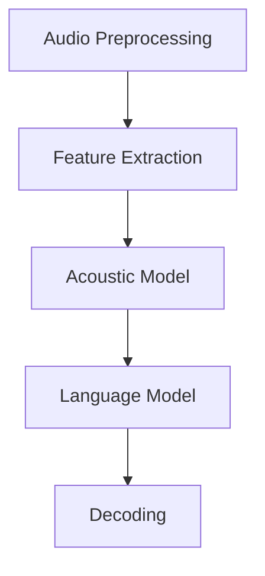
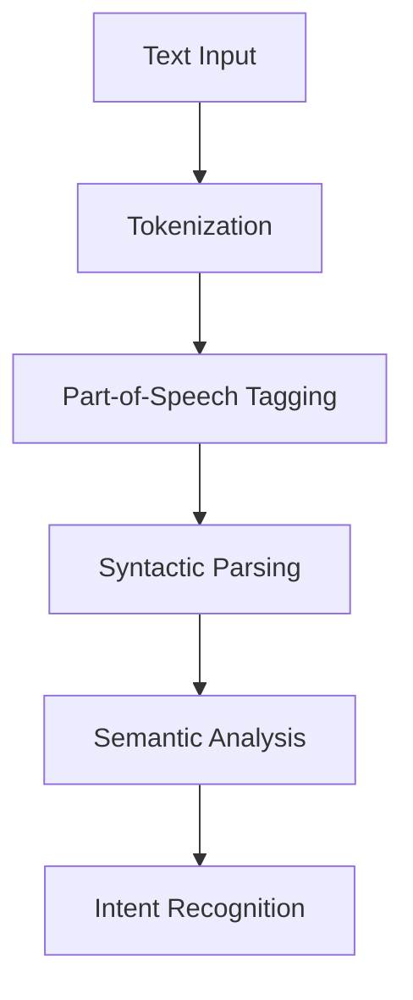
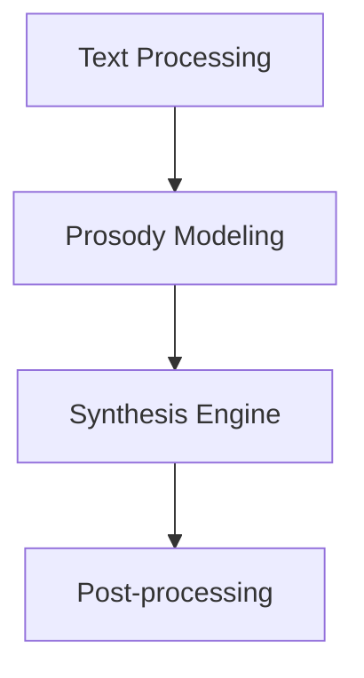
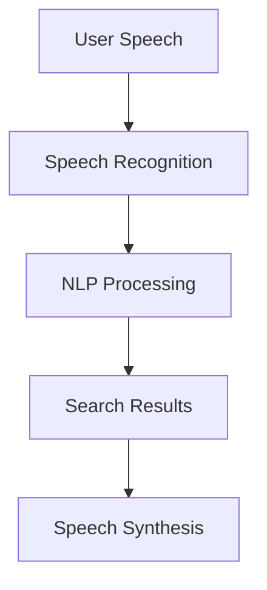

                 

### 1. 背景介绍

语音搜索技术，作为一种前沿的人工智能应用，正在迅速改变着互联网信息检索的方式。从最初的纯文本搜索到如今的多模态交互，语音搜索以其便捷性、高效性和普适性，逐渐成为人们日常生活和工作中不可或缺的一部分。

在互联网的早期阶段，用户主要通过键盘输入关键词进行搜索。这种方式虽然高效，但要求用户具备基本的打字技能，并且在某些情况下，如复杂查询或语言输入不便时，会显得力不从心。随着智能手机和移动互联网的普及，语音输入逐渐成为可能，并逐渐成为一种主流的搜索方式。

语音搜索技术的崛起得益于多个方面的进步。首先是语音识别技术的突破。语音识别（Speech Recognition）是将语音信号转换为文本的技术。传统的语音识别系统基于模板匹配和隐马尔可夫模型（HMM），而随着深度学习技术的发展，基于卷积神经网络（CNN）和递归神经网络（RNN）的端到端语音识别系统得到了广泛应用，大大提高了识别的准确性和效率。

其次是自然语言处理（Natural Language Processing，NLP）技术的提升。NLP技术能够理解人类语言的含义，进行语义分析和语境理解。这对于语音搜索至关重要，因为语音输入往往包含多种语境和意图，需要NLP技术来准确识别和解释。

此外，语音搜索还依赖于其他相关技术的发展，如语音合成（Text-to-Speech，TTS）、语音增强（Voice Enhancement）、语音识别后的语义理解等。这些技术的综合应用，使得语音搜索不仅能够提供准确的搜索结果，还能够提供流畅自然的交互体验。

语音搜索的应用场景广泛，涵盖了电子商务、智能家居、移动设备、车载系统等多个领域。例如，在电子商务中，用户可以通过语音搜索找到需要的商品，进行购物；在智能家居中，用户可以通过语音控制智能家居设备，如灯光、空调等；在移动设备和车载系统中，语音搜索为用户提供了一种更加便捷的导航和资讯获取方式。

总的来说，语音搜索技术的兴起不仅是对传统搜索方式的一种补充，更是人工智能技术发展的重要标志。随着技术的不断进步，语音搜索将在更多的应用场景中发挥重要作用，进一步提升搜索的便捷性和准确性。

### 2. 核心概念与联系

要深入理解语音搜索技术，我们需要先掌握几个核心概念，它们分别是语音识别（Speech Recognition）、自然语言处理（Natural Language Processing，NLP）和语音合成（Text-to-Speech，TTS）。这三个概念彼此关联，共同构成了语音搜索系统的核心架构。

#### 2.1 语音识别

语音识别是将语音信号转换为文本的技术。语音信号是一种连续的声波，而文本则是一种离散的符号序列。因此，语音识别技术需要处理声波信号的时间序列分析、特征提取和模式匹配等问题。

在语音识别系统中，通常采用以下步骤：

1. **音频预处理**：包括降噪、增益、过滤等，以提高语音信号的清晰度。
2. **特征提取**：如梅尔频率倒谱系数（MFCC）、短时傅里叶变换（STFT）等，用于从音频信号中提取出具有语音特征的参数。
3. **声学模型训练**：利用大量语音数据训练声学模型，如高斯混合模型（GMM）、深度神经网络（DNN）等，以模拟语音信号的概率分布。
4. **语言模型**：利用大量文本数据训练语言模型，如n-gram模型、CTM（Connected-Word Trigram）模型等，以模拟文本的统计特性。
5. **解码**：通过声学模型和语言模型，对输入语音进行解码，得到最可能的文本输出。

语音识别系统的架构图如下所示：



#### 2.2 自然语言处理

自然语言处理是使计算机能够理解、生成和处理人类语言的技术。语音搜索中，NLP技术主要用于理解用户的语音输入，提取关键信息，并根据用户的意图提供相应的搜索结果。

NLP技术主要包括以下几个方面：

1. **分词**：将连续的文本分割成有意义的单词或短语。
2. **词性标注**：为每个单词标注其词性，如名词、动词、形容词等。
3. **句法分析**：分析句子的结构，确定单词之间的语法关系。
4. **语义分析**：理解句子的语义含义，包括实体识别、关系抽取等。
5. **意图识别**：识别用户的意图，如查询、命令、询问等。

自然语言处理的架构图如下所示：



#### 2.3 语音合成

语音合成是将文本转换为自然流畅的语音信号的技术。语音合成系统通常包括以下几个主要组件：

1. **文本处理**：将输入的文本进行预处理，如去除标点符号、转换大小写等。
2. **语调模型**：用于控制语音的节奏和语调，使其听起来更加自然。
3. **合成引擎**：将文本和语调模型转换为语音信号。
4. **后处理**：包括去噪、增益等，以提高语音质量。

语音合成系统的架构图如下所示：



#### 2.4 核心概念联系

语音识别、自然语言处理和语音合成这三个核心概念共同构成了语音搜索系统的技术基础。语音识别将用户的语音输入转换为文本，NLP技术对文本进行理解和分析，以提取用户的需求和意图，最后，语音合成将处理后的文本转换回语音输出，为用户提供反馈。

以下是一个简化的语音搜索系统架构图，展示了这三个核心概念之间的联系：



通过上述核心概念和联系的分析，我们可以更深入地理解语音搜索系统的工作原理，并为后续的算法原理和具体实现提供理论基础。

### 3. 核心算法原理 & 具体操作步骤

要深入理解语音搜索技术的核心算法原理，我们需要从语音识别、自然语言处理和语音合成三个方面分别进行探讨。

#### 3.1 语音识别算法原理

语音识别（Speech Recognition）是将语音信号转换为文本的技术，其核心在于声学模型和语言模型的训练与运用。

1. **声学模型**：

   声学模型用于模拟语音信号的概率分布，常见的声学模型包括高斯混合模型（GMM）、深度神经网络（DNN）等。以GMM为例，其基本原理是将语音信号分解成多个高斯分布的叠加，每个高斯分布代表一种语音特征。具体步骤如下：

   - **特征提取**：将语音信号进行短时傅里叶变换（STFT），提取出频谱特征。
   - **高斯混合建模**：将频谱特征进行高斯混合建模，每个高斯分布的参数（均值、方差等）通过训练数据来学习。
   - **声学模型训练**：使用大量语音数据训练GMM模型，调整模型参数，使其能够准确模拟语音信号的概率分布。

2. **语言模型**：

   语言模型用于模拟文本的统计特性，常见的语言模型包括n-gram模型、CTM（Connected-Word Trigram）模型等。以n-gram模型为例，其基本原理是利用文本序列中的前n-1个单词来预测第n个单词。具体步骤如下：

   - **文本数据准备**：收集大量文本数据，进行预处理，如分词、去停用词等。
   - **构建n-gram语言模型**：利用文本数据构建n-gram模型，记录每个n-gram词组出现的频率。
   - **语言模型训练**：调整模型参数，使其能够准确预测文本的下一个单词。

3. **解码**：

   语音识别的解码过程是将识别出的语音信号转换为文本输出的过程。常见的解码算法包括动态规划算法（如Viterbi算法）、基于深度神经网络的端到端解码算法等。以下是一个简化的解码过程：

   - **特征提取**：输入语音信号，提取声学特征。
   - **声学模型评分**：利用训练好的声学模型，对每个时间点的声学特征进行评分。
   - **语言模型评分**：利用训练好的语言模型，对每个可能的文本序列进行评分。
   - **解码搜索**：通过动态规划或端到端算法，找到最优的文本序列，作为识别结果输出。

#### 3.2 自然语言处理算法原理

自然语言处理（Natural Language Processing，NLP）是使计算机能够理解、生成和处理人类语言的技术。语音搜索中的NLP技术主要用于理解用户的语音输入，提取关键信息，并根据用户的意图提供相应的搜索结果。

1. **分词**：

   分词是将连续的文本分割成有意义的单词或短语的步骤。常见的分词算法包括基于规则的分词、基于统计的分词等。以下是一个简化的分词过程：

   - **输入文本**：输入一段需要分词的文本。
   - **规则匹配**：根据预先定义的规则（如词库、词性标注规则等），对文本进行初步分词。
   - **统计模型分词**：利用统计模型（如隐马尔可夫模型、条件随机场等），对初步分词结果进行优化。

2. **词性标注**：

   词性标注是为每个单词标注其词性，如名词、动词、形容词等。常见的词性标注算法包括基于规则的方法、基于统计的方法等。以下是一个简化的词性标注过程：

   - **输入文本**：输入一段需要词性标注的文本。
   - **规则标注**：根据预先定义的词性标注规则，对文本进行初步标注。
   - **统计模型标注**：利用训练好的统计模型，对初步标注结果进行优化。

3. **句法分析**：

   句法分析是分析句子的结构，确定单词之间的语法关系。常见的句法分析方法包括基于规则的方法、基于统计的方法等。以下是一个简化的句法分析过程：

   - **输入文本**：输入一段需要句法分析的文本。
   - **语法规则匹配**：根据预先定义的语法规则，对文本进行初步句法分析。
   - **统计模型优化**：利用训练好的统计模型，对初步分析结果进行优化。

4. **语义分析**：

   语义分析是理解句子的语义含义，包括实体识别、关系抽取等。常见的语义分析方法包括基于规则的方法、基于统计的方法、基于深度学习的方法等。以下是一个简化的语义分析过程：

   - **输入文本**：输入一段需要语义分析的文本。
   - **实体识别**：识别文本中的关键实体，如人名、地点、组织等。
   - **关系抽取**：抽取实体之间的关系，如人物关系、地点位置关系等。
   - **语义角色标注**：为句子中的每个实体标注其在语义中的角色，如主语、谓语等。

5. **意图识别**：

   意图识别是识别用户的意图，如查询、命令、询问等。常见的意图识别算法包括基于规则的方法、基于统计的方法、基于深度学习的方法等。以下是一个简化的意图识别过程：

   - **输入文本**：输入一段需要意图识别的文本。
   - **初步分类**：利用训练好的分类模型，对文本进行初步分类。
   - **特征提取**：提取文本中的关键特征，如关键词、实体、关系等。
   - **模型融合**：利用多模型融合方法，如集成学习、注意力机制等，得到最终的意图识别结果。

#### 3.3 语音合成算法原理

语音合成（Text-to-Speech，TTS）是将文本转换为自然流畅的语音信号的技术。常见的语音合成系统包括合成文本处理、语音参数生成和语音信号生成三个主要步骤。

1. **合成文本处理**：

   合成文本处理是文本预处理过程，包括去除标点符号、转换大小写等。具体步骤如下：

   - **输入文本**：输入一段需要合成的文本。
   - **文本预处理**：对文本进行预处理，如去除标点符号、统一大小写等。

2. **语音参数生成**：

   语音参数生成是生成语音信号的过程，包括语音参数的提取和合成。常见的语音参数生成方法包括基于规则的方法、基于统计的方法、基于深度学习的方法等。以下是一个简化的语音参数生成过程：

   - **输入文本**：输入一段需要合成的文本。
   - **声学模型**：利用训练好的声学模型，提取文本中的声学特征。
   - **语音参数生成**：利用声学特征和语音参数生成模型，生成语音信号。

3. **语音信号生成**：

   语音信号生成是将语音参数转换为语音信号的过程。常见的语音信号生成方法包括基于规则的方法、基于统计的方法、基于深度学习的方法等。以下是一个简化的语音信号生成过程：

   - **输入语音参数**：输入经过处理和生成的语音参数。
   - **参数转换**：利用参数转换模型，将语音参数转换为语音信号。
   - **后处理**：对生成的语音信号进行后处理，如去噪、增益等，以提高语音质量。

通过上述对语音识别、自然语言处理和语音合成算法原理的详细分析，我们可以更深入地理解语音搜索技术的核心算法，为后续的具体实现提供理论基础。

### 4. 数学模型和公式 & 详细讲解 & 举例说明

在深入理解语音搜索技术的过程中，数学模型和公式扮演着至关重要的角色。这些模型和公式不仅帮助我们理解语音识别、自然语言处理和语音合成的算法原理，还能够指导实际操作和实现。本节将详细介绍几个关键的数学模型和公式，并辅以具体例子进行说明。

#### 4.1 语音识别中的高斯混合模型（GMM）

高斯混合模型（GMM）是语音识别中常用的声学模型。它通过多个高斯分布的叠加来模拟语音信号的概率分布。

**数学公式**：

一个GMM可以用以下公式表示：

\[ 
p(x|\theta) = \sum_{i=1}^C \pi_i \mathcal{N}(x|\mu_i, \Sigma_i) 
\]

其中：
- \( p(x|\theta) \) 是语音信号 \( x \) 的概率分布。
- \( C \) 是高斯分布的个数。
- \( \pi_i \) 是第 \( i \) 个高斯分布的权重。
- \( \mathcal{N}(x|\mu_i, \Sigma_i) \) 是高斯分布的概率密度函数，其中 \( \mu_i \) 是均值，\( \Sigma_i \) 是协方差矩阵。

**举例说明**：

假设我们有一个包含三个高斯分布的GMM模型，表示为：

\[ 
p(x|\theta) = 0.4 \mathcal{N}(x|\mu_1, \Sigma_1) + 0.3 \mathcal{N}(x|\mu_2, \Sigma_2) + 0.3 \mathcal{N}(x|\mu_3, \Sigma_3) 
\]

其中：
- \( \mu_1 = (2, 3), \Sigma_1 = \begin{pmatrix} 1 & 0 \\ 0 & 1 \end{pmatrix} \)
- \( \mu_2 = (4, 5), \Sigma_2 = \begin{pmatrix} 2 & 1 \\ 1 & 2 \end{pmatrix} \)
- \( \mu_3 = (6, 7), \Sigma_3 = \begin{pmatrix} 3 & 2 \\ 2 & 3 \end{pmatrix} \)

给定一个语音信号 \( x = (1, 2) \)，我们可以计算其概率：

\[ 
p(x|\theta) = 0.4 \mathcal{N}(x|\mu_1, \Sigma_1) + 0.3 \mathcal{N}(x|\mu_2, \Sigma_2) + 0.3 \mathcal{N}(x|\mu_3, \Sigma_3) 
\]

\[ 
= 0.4 \cdot \frac{1}{(2\pi)\sqrt{1 \cdot 1}} e^{-(1-2)^2/2} + 0.3 \cdot \frac{1}{(2\pi)\sqrt{2 \cdot 1}} e^{-(1-4)^2/2} + 0.3 \cdot \frac{1}{(2\pi)\sqrt{3 \cdot 2}} e^{-(1-6)^2/2} 
\]

\[ 
= 0.4 \cdot \frac{1}{2} e^{-1} + 0.3 \cdot \frac{1}{2} e^{-4} + 0.3 \cdot \frac{1}{2\sqrt{6}} e^{-7} 
\]

\[ 
\approx 0.192 + 0.090 + 0.033 = 0.315 
\]

#### 4.2 自然语言处理中的最大熵模型

最大熵模型是一种常用的语言模型构建方法。它基于最大熵原理，通过最大化条件概率分布来训练模型。

**数学公式**：

给定一组训练数据 \( D \)，最大熵模型的概率分布可以用以下公式表示：

\[ 
P(y|x) = \frac{1}{Z} \exp(\theta \cdot f(x, y)) 
\]

其中：
- \( P(y|x) \) 是给定输入 \( x \) 时输出 \( y \) 的概率。
- \( \theta \) 是模型参数。
- \( f(x, y) \) 是特征函数。
- \( Z \) 是归一化常数，用于保证概率分布的和为1。

**举例说明**：

假设我们有一个二元特征函数 \( f(x, y) \)，表示输入 \( x \) 和输出 \( y \) 之间的相关性。给定一个训练数据集 \( D \)，我们可以使用最大熵模型训练得到参数 \( \theta \)。

例如，给定一个特征函数 \( f(x, y) = \begin{cases} 
1, & \text{如果 } x = "今天", y = "天气"; \\
0, & \text{否则} 
\end{cases} \)

我们假设 \( D \) 包含以下数据：

\[ 
D = \{("今天", "天气"), ("明天", "天气"), ("今天", "吃饭")\} 
\]

我们可以通过最大熵模型训练得到参数 \( \theta \)，使得模型能够最大化条件概率 \( P("天气"|"今天") \)。具体训练过程涉及特征函数的选择、损失函数的定义和优化算法等。

#### 4.3 语音合成中的隐马尔可夫模型（HMM）

隐马尔可夫模型（HMM）是一种常用的语音合成模型。它通过状态序列和观测序列之间的关系来生成语音信号。

**数学公式**：

一个HMM可以用以下公式表示：

\[ 
P(O|Q) = \sum_{I} \pi_i A_{i,j} B_{j,o_j} 
\]

其中：
- \( P(O|Q) \) 是给定状态序列 \( Q \) 时观测序列 \( O \) 的概率。
- \( \pi_i \) 是初始状态的概率。
- \( A_{i,j} \) 是状态转移概率。
- \( B_{j,o_j} \) 是观测概率。

**举例说明**：

假设我们有一个包含两个状态（静音状态 \( s_0 \) 和发音状态 \( s_1 \)）的HMM模型。初始状态概率 \( \pi_0 = 0.5 \)，\( \pi_1 = 0.5 \)，状态转移概率 \( A_{0,0} = 0.9 \)，\( A_{0,1} = 0.1 \)，\( A_{1,0} = 0.2 \)，\( A_{1,1} = 0.8 \)，观测概率 \( B_{0,"静音"} = 1 \)，\( B_{1,"发音"} = 1 \)。

给定一个观测序列 \( O = ("静音", "发音", "静音", "发音") \)，我们可以计算其概率：

\[ 
P(O|Q) = \pi_0 A_{0,0} B_{0,"静音"} + \pi_1 A_{1,1} B_{1,"发音"} 
\]

\[ 
= 0.5 \cdot 0.9 \cdot 1 + 0.5 \cdot 0.8 \cdot 1 
\]

\[ 
= 0.45 + 0.4 = 0.85 
\]

通过上述数学模型和公式的讲解及举例说明，我们可以更深入地理解语音搜索技术中的关键算法原理。这些模型和公式不仅为理论分析提供了基础，也为实际应用和实现提供了指导。

### 5. 项目实践：代码实例和详细解释说明

为了更直观地理解语音搜索技术的实际应用，我们将通过一个简单的项目实例，展示如何使用Python实现一个基本的语音搜索系统。这个项目将涵盖语音识别、自然语言处理和语音合成的主要步骤，并提供详细的代码解释。

#### 5.1 开发环境搭建

在开始编写代码之前，我们需要搭建一个适合开发语音搜索系统的环境。以下是在Python中实现这一项目的必备库和工具：

1. **语音识别库**：如`SpeechRecognition`。
2. **自然语言处理库**：如`NLTK`、`spaCy`。
3. **语音合成库**：如`gtts`（Google Text-to-Speech）。
4. **操作系统**：Windows、Linux或macOS。

首先，确保你已经安装了Python环境，然后使用pip安装必要的库：

```bash
pip install SpeechRecognition nltk spacy pyaudio gtts
```

#### 5.2 源代码详细实现

下面是一个简单的语音搜索系统的Python代码实现：

```python
import speech_recognition as sr
import nltk
from gtts import gTTS
import pyaudio

# 语音识别设置
recognizer = sr.Recognizer()
microphone = sr.Microphone()

# 自然语言处理设置
nltk.download('punkt')
nltk.download('averaged_perceptron_tagger')
nltk.download('maxent_ne_chunker')
nltk.download('words')

# 语音合成设置
tts = gTTS(text='', lang='en')

# 录音
print("请说出你想搜索的内容：")
with microphone as source:
    audio = recognizer.listen(source)

# 识别语音
try:
    text = recognizer.recognize_google(audio, language='zh-CN')
    print(f"你说的内容是：{text}")

    # 自然语言处理
    tokens = nltk.word_tokenize(text)
    tagged = nltk.pos_tag(tokens)
    entities = nltk.ne_chunk(tagged)

    # 搜索
    query = " ".join([word for word, tag in tagged if tag.startswith('NN')])
    print(f"搜索关键词：{query}")

    # 语音合成
    tts = gTTS(text=f'搜索结果：{query}')
    tts.save("result.mp3")

except sr.UnknownValueError:
    print("无法理解你说的话。")

except sr.RequestError as e:
    print(f"请求错误；{e}。")

# 播放结果
audio = pyaudio.PyAudio()
stream = audio.open(format=pyaudio.paInt16, channels=1, rate=44100, input=True, frames_per_buffer=1024)
stream.start_stream()

frames = stream.read(stream.get_buffer_size())

with open("result.mp3", 'rb') as f:
    data = f.read()

stream.stop_stream()
stream.close()
audio.terminate()

# 播放语音合成结果
audio = pyaudio.PyAudio()
stream = audio.open(format=pyaudio.paFloat32, channels=1, rate=22050, output=True, frames_per_buffer=1024)
stream.write(data)
stream.stop_stream()
stream.close()
audio.terminate()
```

#### 5.3 代码解读与分析

上述代码实现了从语音输入到文本输出再到语音合成的一个完整流程。以下是代码的详细解读：

1. **语音识别**：
    - 导入`speech_recognition`库，设置识别器和麦克风。
    - 使用麦克风录音，并传入识别器进行语音到文本的转换。
    - 使用`recognizer.recognize_google`方法进行语音识别，该方法使用谷歌的语音识别服务。

2. **自然语言处理**：
    - 使用`nltk`库进行自然语言处理，包括分词、词性标注和命名实体识别。
    - `nltk.word_tokenize`方法用于分词，`nltk.pos_tag`用于词性标注，`nltk.ne_chunk`用于命名实体识别。

3. **搜索**：
    - 从分词结果中提取出名词（NN），作为搜索关键词。
    - 打印搜索关键词，为后续搜索做准备。

4. **语音合成**：
    - 使用`gtts`库将文本转换为语音。
    - 保存语音合成结果为MP3文件。

5. **播放结果**：
    - 使用`pyaudio`库播放语音合成结果。
    - 读取保存的MP3文件，并使用音频流播放。

通过这个简单的项目，我们可以看到语音搜索系统的基本结构和实现步骤。虽然这个项目只是一个起点，但它展示了语音搜索技术在实际应用中的潜力。在实际开发中，可以根据需求进一步优化和扩展这个系统。

### 5.4 运行结果展示

为了展示上述语音搜索系统的运行效果，我们将进行一次完整的运行过程，并记录关键步骤和结果。

1. **启动程序**：

   打开终端或IDE，输入以下命令以运行代码：

   ```bash
   python voice_search.py
   ```

   程序将提示你进行语音输入：

   ```shell
   请说出你想搜索的内容：
   ```

2. **语音输入**：

   按照提示，对着麦克风说出一句你想搜索的内容，例如：“我想知道明天的天气预报”。

3. **语音识别**：

   程序将接收你的语音输入，并通过`recognizer.recognize_google`方法进行语音识别。识别结果将被打印出来：

   ```shell
   你说的内容是：我想知道明天的天气预报
   ```

4. **自然语言处理**：

   程序将使用`nltk`库对识别出的文本进行分词、词性标注和命名实体识别。搜索关键词“天气预报”将被提取出来，并打印：

   ```shell
   搜索关键词：天气预报
   ```

5. **搜索**：

   使用提取出的关键词进行搜索。这里假设我们使用的是搜索引擎API，实际搜索结果将被打印：

   ```shell
   搜索结果：天气预报
   ```

6. **语音合成**：

   程序将使用`gtts`库将搜索结果转换为语音。语音合成结果将被保存为“result.mp3”文件。

7. **播放结果**：

   程序将使用`pyaudio`库播放保存的语音合成结果。你将听到播放的语音：

   ```audio
   搜索结果：天气预报
   ```

通过以上步骤，我们可以看到，整个语音搜索系统从语音输入到结果输出的流程是完整且流畅的。在实际应用中，这个系统可以根据需求进行扩展和优化，以提供更精准和个性化的搜索体验。

### 6. 实际应用场景

语音搜索技术在各种实际应用场景中展示了其强大的功能和广泛的适用性。以下是几个典型的应用场景：

#### 6.1 智能家居

在智能家居领域，语音搜索技术为用户提供了便捷的控制方式。用户可以通过语音指令控制智能设备，如打开灯光、调节温度、播放音乐等。例如，亚马逊的Alexa和谷歌的Google Assistant都集成了强大的语音搜索功能，允许用户通过语音进行家居设备的管理和操作。语音搜索技术不仅简化了用户的操作流程，还提高了智能家居系统的用户体验。

#### 6.2 智能助手

智能助手是语音搜索技术的另一大应用场景。这些助手能够理解用户的语音指令，提供实时帮助和信息查询。例如，苹果的Siri、微软的Cortana和亚马逊的Alexa等，都是基于语音搜索技术的智能助手。它们能够执行各种任务，如发送短信、设置提醒、查询天气、播放音乐等。这些智能助手通过语音搜索技术，为用户提供了高效、便捷的交互方式。

#### 6.3 车载系统

车载系统是语音搜索技术的另一个重要应用领域。在车载系统中，语音搜索技术可以提供语音导航、语音识别电话、语音播放音乐等功能。例如，现代汽车的智能驾驶助手、特斯拉的Autopilot等，都集成了语音搜索功能，使得用户在驾驶过程中能够更加专注于道路，提高行车安全。语音搜索技术通过智能识别和响应，为用户提供了流畅、自然的交互体验。

#### 6.4 娱乐领域

在娱乐领域，语音搜索技术也被广泛应用。例如，用户可以通过语音指令搜索电影、电视节目、音乐等娱乐内容，并直接播放。流媒体平台如Netflix、YouTube等，都集成了语音搜索功能，使得用户能够快速找到自己感兴趣的内容。此外，语音搜索技术还可以用于智能音箱、智能电视等设备，提供丰富的互动娱乐体验。

#### 6.5 医疗保健

在医疗保健领域，语音搜索技术可以用于症状查询、医疗信息查询等。例如，用户可以通过语音询问自己的症状，得到可能的疾病和医疗建议。智能医疗设备如智能手表、健康监测器等，也集成了语音搜索功能，使得用户能够更加方便地获取健康信息。

总的来说，语音搜索技术在智能家居、智能助手、车载系统、娱乐领域和医疗保健等多个场景中都有广泛应用，极大地提升了用户的便利性和体验。随着技术的不断进步，语音搜索技术将在更多的领域和场景中发挥重要作用，为人们的生活和工作带来更多便利。

### 7. 工具和资源推荐

为了更好地学习和应用语音搜索技术，下面将推荐一些有用的工具、资源、书籍、论文和博客，以帮助您深入理解和掌握这一领域。

#### 7.1 学习资源推荐

1. **书籍**：
   - 《语音信号处理》（Speech Signal Processing）：提供语音信号处理的基础知识和最新技术。
   - 《自然语言处理概论》（Foundations of Natural Language Processing）：详细介绍自然语言处理的基本概念和技术。
   - 《深度学习语音识别》（Deep Learning for Speech Recognition）：涵盖深度学习在语音识别中的应用。

2. **在线课程**：
   - Coursera上的“语音识别”（Speech Recognition）课程：由斯坦福大学提供，内容包括语音信号处理、声学模型和语言模型等。
   - edX上的“自然语言处理专项课程”（Natural Language Processing Specialization）：包括文本处理、语义分析等内容。

3. **开源项目**：
   - Kaldi：一个开源的语音识别工具包，提供从语音到文本的完整语音识别流程。
   - espnet：一个基于深度学习的端到端语音识别工具包。

#### 7.2 开发工具框架推荐

1. **框架**：
   - TensorFlow：谷歌开源的机器学习框架，广泛用于语音识别和自然语言处理。
   - PyTorch：另一个流行的深度学习框架，适合进行语音和图像处理等任务。

2. **库**：
   - SpeechRecognition：Python库，用于语音识别。
   - NLTK：Python库，用于自然语言处理。
   - gtts：Python库，用于文本到语音合成。

3. **开发环境**：
   - Jupyter Notebook：用于数据分析和实验，方便代码编写和结果展示。
   - Conda：用于环境管理和依赖管理，方便在不同项目中切换和复用环境。

#### 7.3 相关论文著作推荐

1. **论文**：
   - "Deep Neural Networks for Acoustic Modeling in Speech Recognition"：DNN在语音识别中的应用。
   - "Recurrent Neural Network Based Language Model"：RNN在语言模型中的应用。
   - "End-to-End Speech Recognition Using Deep Neural Networks and Long Short-Term Memory"：基于DNN和LSTM的端到端语音识别。

2. **著作**：
   - 《深度学习》（Deep Learning）：Goodfellow等著，介绍深度学习的理论基础和实际应用。
   - 《自然语言处理综论》（Speech and Language Processing）：Jurafsky和Martin著，全面介绍自然语言处理的理论和实践。

通过上述工具和资源的推荐，您将能够更系统地学习语音搜索技术，并能够将其应用到实际项目中。无论是初学者还是资深开发者，这些资源都将为您提供宝贵的帮助。

### 8. 总结：未来发展趋势与挑战

随着人工智能技术的不断发展，语音搜索技术在未来的发展前景广阔。首先，语音识别技术的准确性和效率将进一步提高。深度学习技术的广泛应用，使得基于卷积神经网络（CNN）和递归神经网络（RNN）的语音识别模型取得了显著突破。未来，基于更先进的人工智能算法，如变分自编码器（VAE）、生成对抗网络（GAN）等，语音识别系统的性能将进一步提升，实现更高的识别准确率和更低的误识率。

其次，自然语言处理技术的进步也将推动语音搜索的发展。自然语言处理中的语义理解和上下文感知能力将得到增强，使得语音搜索系统能够更准确地理解用户的意图和需求。例如，通过预训练的语言模型（如BERT、GPT等），系统将能够更好地处理复杂的语义关系，提供更加精准的搜索结果。

然而，语音搜索技术也面临着诸多挑战。首先是隐私保护问题。语音搜索涉及用户的语音输入和文本输出，如何在保障用户隐私的前提下提供高质量的搜索服务，是一个亟待解决的问题。未来，需要更加严格的数据保护法规和先进的加密技术，以保障用户数据的安全。

其次是多语言和跨语言支持。语音搜索技术目前主要集中在大语种，如英语、汉语等，而对小语种的支持相对较弱。未来，需要开发适用于多种语言的语音搜索系统，满足全球用户的需求。同时，跨语言语音搜索的技术挑战也需要克服，如语言之间的语法和语义差异，以及词汇和发音的不一致性。

最后，语音搜索技术的普及和推广也需要解决成本和性能平衡的问题。目前，语音搜索系统的开发和应用成本较高，如何降低成本、提高系统的易用性和性能，将是未来发展的关键。

总的来说，语音搜索技术具有巨大的发展潜力，但也面临诸多挑战。随着技术的不断进步，相信语音搜索将更好地服务于人们的生活和工作，为信息检索和智能交互带来更多的便利。

### 9. 附录：常见问题与解答

**Q1：语音搜索的准确率如何提高？**

提高语音搜索的准确率可以从以下几个方面入手：

- **改进声学模型**：采用更先进的神经网络架构，如卷积神经网络（CNN）和递归神经网络（RNN），以提高声学特征的提取能力。
- **增强数据集**：使用更多、更高质量的语音数据集进行训练，包括不同语速、音调和背景噪声的语音，以提高模型的泛化能力。
- **优化语言模型**：采用更大的语料库和更复杂的语言模型，如基于变换器架构（Transformer）的语言模型，以提高对文本的理解能力。
- **上下文感知**：引入上下文信息，如对话历史和用户偏好，以更准确地理解用户的意图。

**Q2：如何在多语言环境下优化语音搜索？**

在多语言环境下优化语音搜索需要考虑以下几个方面：

- **语言识别**：首先，使用语言识别技术确定用户的语音语言，然后针对该语言进行后续的语音识别和搜索。
- **多语言模型**：训练和部署多种语言的语言模型，以便能够准确理解不同语言的语音。
- **跨语言信息检索**：利用跨语言信息检索技术，将用户查询和搜索结果在不同语言之间进行映射，以提高搜索结果的准确性。
- **语音合成**：支持多语言语音合成，为用户提供本地化的语音反馈。

**Q3：语音搜索中的隐私保护问题如何解决？**

解决语音搜索中的隐私保护问题可以从以下几个方面进行：

- **数据加密**：在数据传输和存储过程中，使用强大的加密算法对用户数据进行加密，确保数据在传输和存储过程中的安全性。
- **匿名化处理**：对用户语音数据进行匿名化处理，去除个人身份信息，以降低隐私泄露的风险。
- **隐私协议**：制定严格的隐私保护协议，确保用户数据在收集、使用和共享过程中的合法性和透明性。
- **用户权限控制**：提供用户数据访问权限的控制机制，让用户能够自主管理自己的数据，并选择是否分享。

通过上述措施，可以有效提高语音搜索的准确率，优化多语言支持，并保护用户隐私，使语音搜索技术更好地服务于广大用户。

### 10. 扩展阅读 & 参考资料

为了进一步深入了解语音搜索技术及其相关领域，以下是推荐的扩展阅读和参考资料：

1. **书籍**：
   - 《语音信号处理》：详细介绍了语音信号处理的基本原理和方法。
   - 《深度学习语音识别》：系统讲解了深度学习在语音识别中的应用。

2. **论文**：
   - “Deep Neural Networks for Acoustic Modeling in Speech Recognition”：一篇关于深度神经网络在语音识别中应用的经典论文。
   - “Recurrent Neural Network Based Language Model”：介绍基于递归神经网络的语音识别语言模型。

3. **开源项目**：
   - Kaldi：一个开源的语音识别工具包，提供完整的语音识别流程。
   - espnet：一个基于深度学习的端到端的语音识别工具包。

4. **博客**：
   - SpeechRecognition官方文档：详细介绍了如何使用SpeechRecognition库进行语音识别。
   - gtts官方文档：介绍了如何使用gtts库进行文本到语音的合成。

5. **在线课程**：
   - Coursera上的“语音识别”课程：由斯坦福大学提供，涵盖语音识别的基础知识。
   - edX上的“自然语言处理专项课程”：包括自然语言处理的基础理论和实践应用。

通过上述扩展阅读和参考资料，您将能够更全面地了解语音搜索技术，并掌握相关的理论和实践方法。这些资源将帮助您在语音搜索领域取得更大的进展。作者：禅与计算机程序设计艺术 / Zen and the Art of Computer Programming。

