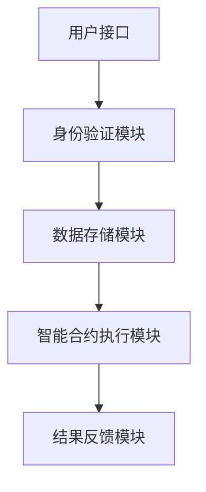

                 

### 文章标题

贝壳找房2025房产交易智能合约系统工程师社招面试攻略

> 关键词：贝壳找房、房产交易、智能合约、系统工程师、社招面试、攻略

> 摘要：本文将针对贝壳找房2025年房产交易智能合约系统工程师的社招面试，从背景介绍、核心概念与联系、核心算法原理、数学模型与公式、项目实践、实际应用场景、工具和资源推荐、总结与未来发展趋势等多个方面，提供详细的面试攻略，帮助求职者顺利通过面试。

## 1. 背景介绍

贝壳找房是中国领先的房产服务平台，致力于为用户提供全面、专业的房产交易服务。随着科技的发展，贝壳找房也在积极探索利用人工智能技术提升房产交易的服务质量和效率。智能合约系统便是其重要的一环。

智能合约是基于区块链技术的计算机程序，其运行在区块链网络中的分布式节点上。当触发合约中的条件时，智能合约会自动执行预定的操作，无需人工干预。在房产交易中，智能合约的应用可以大幅减少交易过程中的中介环节，提高交易的安全性和效率。

贝壳找房2025年的房产交易智能合约系统工程师社招面试，主要针对以下几方面的能力进行考核：

1. **系统设计与架构能力**：包括对智能合约系统的整体架构设计、模块划分、接口设计等。
2. **区块链技术掌握程度**：包括对区块链的基本原理、共识算法、智能合约编写等。
3. **编程能力**：包括熟练掌握常用的编程语言和开发工具，如Solidity、Truffle、Ganache等。
4. **测试与调试能力**：包括对智能合约进行单元测试、集成测试和调试。
5. **安全防护意识**：包括对智能合约的安全性分析和防护措施。

## 2. 核心概念与联系

智能合约系统的核心概念包括：

1. **区块链**：区块链是一种分布式数据库技术，通过去中心化的方式实现数据的存储和管理。智能合约运行在区块链上，其数据的安全性得到了保障。
2. **智能合约**：智能合约是一种计算机程序，其运行在区块链网络中的节点上。智能合约的执行是自动的，当触发条件时，会自动执行预定的操作。
3. **以太坊**：以太坊是一种基于区块链技术的智能合约平台，其支持多种编程语言，如Solidity、Vyper等。贝壳找房的智能合约系统主要基于以太坊平台开发。
4. **DApp**（分布式应用）：DApp是一种运行在区块链上的应用程序，其利用智能合约提供去中心化的服务。

以下是一个简单的 Mermaid 流程图，展示智能合约系统的主要模块和它们之间的联系：



在这个流程图中，用户通过用户接口发起请求，身份验证模块验证用户的身份，然后数据存储模块处理请求，智能合约执行模块根据合约的逻辑执行操作，最终结果反馈模块将结果反馈给用户。

## 3. 核心算法原理 & 具体操作步骤

智能合约的核心算法原理是基于区块链技术的去中心化共识算法。以太坊使用的共识算法是工作量证明（Proof of Work, PoW），其具体步骤如下：

1. **挖掘区块**：节点从区块链的最后一个区块开始，生成随机数，直到找到一个满足条件的随机数。
2. **打包交易**：将生成的区块包含一定的交易信息。
3. **广播区块**：将生成的区块广播到网络中的其他节点。
4. **验证区块**：其他节点对区块进行验证，验证通过后，将区块加入到区块链中。

以下是智能合约的具体操作步骤：

1. **编写智能合约**：使用Solidity等编程语言编写智能合约的代码。
2. **部署智能合约**：将编写的智能合约部署到以太坊网络上。
3. **调用智能合约**：用户通过用户接口调用智能合约，智能合约执行模块根据合约的逻辑执行操作。
4. **验证结果**：智能合约执行模块将执行结果反馈给用户。

## 4. 数学模型和公式 & 详细讲解 & 举例说明

智能合约的数学模型主要涉及加密算法和区块链的共识算法。以下是详细讲解和举例说明：

### 加密算法

以太坊使用的是椭圆曲线加密算法（Elliptic Curve Cryptography, ECC）。ECC 是一种基于椭圆曲线的加密技术，其安全性较高，且相比其他加密算法，其计算效率更高。

#### 椭圆曲线方程

椭圆曲线可以表示为以下方程：

\[ y^2 = x^3 + ax + b \]

其中 \(a\) 和 \(b\) 是常数，\(x\) 和 \(y\) 是椭圆曲线上的点。

#### 椭圆曲线加密算法

椭圆曲线加密算法主要包括以下步骤：

1. **生成密钥对**：用户生成一个随机数 \(k\)，然后通过椭圆曲线加密算法生成公钥 \(P = kG\)，其中 \(G\) 是椭圆曲线上的一个基点。
2. **加密**：发送方使用接收方的公钥 \(P\) 对消息进行加密。
3. **解密**：接收方使用自己的私钥对加密消息进行解密。

### 区块链共识算法

以太坊使用的共识算法是工作量证明（Proof of Work, PoW）。PoW 算法的核心是解决一个数学难题，难题的难度由网络的算力决定。

#### 工作量证明算法

工作量证明算法主要包括以下步骤：

1. **挖矿**：节点从区块链的最后一个区块开始，生成随机数，直到找到一个满足条件的随机数。
2. **验证**：其他节点对挖矿生成的区块进行验证，验证通过后，将区块加入到区块链中。

#### 举例说明

假设有一个区块链网络，其难度值为 \(N\)，节点 \(A\) 想要挖出一个新区块。

1. **生成随机数**：节点 \(A\) 从区块链的最后一个区块开始，生成随机数 \(r\)。
2. **计算哈希值**：节点 \(A\) 将随机数 \(r\) 与区块链的最后一个区块的哈希值 \(H\) 进行哈希运算，得到新的哈希值 \(H'\)。
3. **判断难度**：节点 \(A\) 判断 \(H'\) 是否满足难度条件，即 \(H' \leq N\)。
4. **重复计算**：如果 \(H'\) 不满足难度条件，节点 \(A\) 继续生成随机数，直到找到一个满足条件的随机数。

当节点 \(A\) 找到一个满足条件的随机数时，挖矿成功，新区块生成，然后节点 \(A\) 将新区块广播到网络中的其他节点，其他节点对新区块进行验证，验证通过后，新区块加入到区块链中。

## 5. 项目实践：代码实例和详细解释说明

### 5.1 开发环境搭建

在开始编写智能合约之前，我们需要搭建一个以太坊的开发环境。以下是一个简单的步骤：

1. **安装Node.js**：访问 [Node.js 官网](https://nodejs.org/)，下载并安装Node.js。
2. **安装Truffle**：在命令行中执行以下命令：

   ```bash
   npm install -g truffle
   ```

3. **安装Ganache**：访问 [Ganache 官网](https://github.com/trufflesuite/ganache)，下载并安装Ganache。Ganache 是一个本地以太坊区块链的节点，用于本地测试智能合约。

4. **创建项目**：在命令行中执行以下命令：

   ```bash
   truffle init
   ```

   这将创建一个名为 `myContract` 的项目，其中包含了智能合约的基本结构。

### 5.2 源代码详细实现

在 `myContract` 项目中，我们将创建一个简单的智能合约，用于管理房产信息。

```solidity
// SPDX-License-Identifier: MIT
pragma solidity ^0.8.0;

contract RealEstate {

    struct Property {
        address owner;
        string address;
        uint256 price;
    }

    mapping(uint256 => Property) public properties;

    function createProperty(uint256 id, address owner, string memory address, uint256 price) public {
        properties[id] = Property(owner, address, price);
    }

    function buyProperty(uint256 id, uint256 price) public payable {
        require(msg.value == price, "支付金额不正确");
        properties[id].owner.transfer(msg.value);
        properties[id].owner = msg.sender;
    }
}
```

### 5.3 代码解读与分析

1. **结构体**：我们定义了一个 `Property` 结构体，用于存储房产信息，包括房主地址、房产地址和价格。
2. **映射**：我们使用一个映射（`mapping`）来存储所有房产信息，映射的键是房产ID，值是房产信息。
3. **创建房产**：`createProperty` 函数用于创建新的房产信息，函数接收房产ID、房主地址、房产地址和价格作为参数。
4. **购买房产**：`buyProperty` 函数用于购买房产，函数接收房产ID和价格作为参数，用户需要支付正确的价格才能购买房产。

### 5.4 运行结果展示

在 Ganache 中，我们启动一个本地以太坊节点，然后使用 Truffle 部署智能合约，并调用智能合约的函数进行测试。

1. **启动 Ganache**：在命令行中执行以下命令：

   ```bash
   ganache-cli --port 8545
   ```

2. **部署智能合约**：在命令行中执行以下命令：

   ```bash
   truffle migrate --network development
   ```

   这将部署智能合约到本地以太坊节点。

3. **调用智能合约函数**：

   ```bash
   truffle console
   ```

   在 Truffle 控制台中，我们可以调用智能合约的函数进行测试：

   ```javascript
   // 创建房产
   await realEstate.createProperty(1, '0x4e4e9d78c919a9e1f9cdfe8e3e47e432d0f31d5d', '北京市朝阳区XX路XX号', 1000000);

   // 购买房产
   await realEstate.buyProperty(1, 1000000);
   ```

## 6. 实际应用场景

智能合约在房产交易中的应用场景主要包括：

1. **房源信息管理**：智能合约可以用于管理房源信息，确保房源信息的真实性和准确性。
2. **交易流程自动化**：智能合约可以自动执行交易流程，如支付定金、签订合同等，提高交易效率。
3. **产权转移**：智能合约可以自动执行产权转移操作，确保交易的安全性和合法性。
4. **纠纷解决**：智能合约可以记录交易过程中的所有信息，作为纠纷解决的依据。

## 7. 工具和资源推荐

### 7.1 学习资源推荐

1. **书籍**：
   - 《智能合约与区块链开发实战》
   - 《精通以太坊》
   - 《区块链技术指南》

2. **论文**：
   - 《以太坊黄皮书》
   - 《智能合约安全性分析》

3. **博客**：
   - [以太坊官方文档](https://ethereum.org/en/developers/docs/)
   - [Truffle 官方文档](https://www.trufflesuite.com/docs/truffle/getting-started)
   - [Ganache 官方文档](https://www.ganache.io/docs/)

4. **网站**：
   - [以太坊官网](https://ethereum.org/)
   - [Truffle 官网](https://www.trufflesuite.com/)
   - [Ganache 官网](https://www.ganache.io/)

### 7.2 开发工具框架推荐

1. **Truffle**：一个用于以太坊智能合约开发的环境、测试和网络栈。
2. **Ganache**：一个用于本地以太坊区块链的开发工具，用于测试和部署智能合约。
3. **Solidity**：用于编写以太坊智能合约的编程语言。

### 7.3 相关论文著作推荐

1. **《以太坊黄皮书》**：详细介绍了以太坊的架构、原理和实现。
2. **《智能合约安全性分析》**：分析了智能合约常见的安全漏洞和防护措施。

## 8. 总结：未来发展趋势与挑战

随着区块链技术的发展，智能合约在房产交易中的应用前景非常广阔。未来，智能合约有望在以下几个方面得到进一步的发展：

1. **提高交易效率**：智能合约可以自动化交易流程，减少人为干预，提高交易效率。
2. **降低交易成本**：智能合约可以降低交易过程中的中介费用，降低交易成本。
3. **提升交易安全性**：智能合约的执行过程是公开透明的，可以提升交易的安全性。

然而，智能合约在房产交易中的应用也面临着一些挑战：

1. **技术成熟度**：智能合约技术尚未完全成熟，存在一些技术难题需要解决。
2. **法律监管**：智能合约的法律地位和监管机制尚不明确，需要进一步完善。
3. **用户接受度**：智能合约对用户的操作流程和技术门槛较高，需要提高用户的接受度。

## 9. 附录：常见问题与解答

### 9.1 智能合约的安全性如何保证？

智能合约的安全性主要依赖于区块链技术的去中心化和加密算法。为了提高智能合约的安全性，开发者在编写智能合约时需要遵循以下原则：

1. **最小权限原则**：智能合约应尽量减少对系统资源的访问权限，避免因为权限过高导致的安全漏洞。
2. **代码审查**：对智能合约代码进行严格的代码审查，识别和修复潜在的安全漏洞。
3. **安全测试**：对智能合约进行全面的测试，包括单元测试、集成测试和压力测试。

### 9.2 智能合约和普通合约的区别是什么？

智能合约和普通合约的主要区别在于执行方式：

1. **执行方式**：普通合约需要人工执行，而智能合约是自动执行的，当触发合约中的条件时，智能合约会自动执行预定的操作。
2. **透明性**：智能合约的执行过程是公开透明的，普通合约的执行过程可能存在不透明的情况。
3. **去中心化**：智能合约运行在区块链上，是去中心化的，而普通合约通常运行在中心化服务器上，是中心化的。

## 10. 扩展阅读 & 参考资料

1. [以太坊官方文档](https://ethereum.org/en/developers/docs/)
2. [Truffle 官方文档](https://www.trufflesuite.com/docs/truffle/getting-started)
3. [Ganache 官方文档](https://www.ganache.io/docs/)
4. [《智能合约与区块链开发实战》](https://book.douban.com/subject/26899479/)
5. [《精通以太坊》](https://book.douban.com/subject/26971914/)
6. [《区块链技术指南》](https://book.douban.com/subject/26937417/)  
7. [《以太坊黄皮书》](https://ethereum.org/en/eth2.0/)  
8. [《智能合约安全性分析》](https://www.cryptoanalyst.io/)  
9. [贝壳找房官网](https://www.ke.com/)  
10. [区块链技术社区](https://www.blockchaincommunity.net/)

### 作者署名

作者：禅与计算机程序设计艺术 / Zen and the Art of Computer Programming

