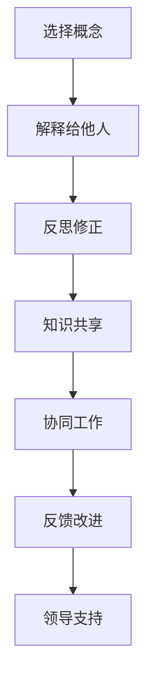

                 

### 1. 背景介绍

#### 费曼提问法的起源与发展

费曼提问法（Feynman Technique）是一种有效的学习方法，起源于著名物理学家理查德·费曼（Richard Feynman）的教育哲学。费曼是一位极具创造力和智慧的理论物理学家，以其对量子电动力学（Quantum Electrodynamics）的卓越贡献而闻名。他在教学过程中发现，通过引导学生使用简单的语言解释复杂的概念，不仅能够帮助他们巩固理解，还能够激发他们的求知欲和创新能力。

费曼提问法的核心在于“用自己的话来解释”，这种理念强调了理解和掌握知识的关键在于能够清晰地表达和传达。这种方法不仅适用于学术教育，对于企业团队的学习与成长同样具有深远影响。在现代企业环境中，团队学习已成为提高组织竞争力的重要手段，而费曼提问法则为团队学习提供了一种有效的策略。

#### 团队学习的必要性

团队学习是指团队成员通过共享知识、经验和观点，相互促进、相互激励，共同提高个人和团队的能力。随着企业面临日益复杂的业务环境和快速变化的市场需求，团队学习的重要性日益凸显。以下是一些关键点：

1. **知识共享**：团队成员在不同领域拥有各自的专业知识和经验，通过团队学习，可以实现知识的互补和共享，从而提升整个团队的创新能力。
2. **协同工作**：团队学习有助于加强团队成员之间的协作，提高团队的整体工作效率。
3. **持续成长**：团队学习是一种持续的过程，它能够帮助团队成员不断适应新的业务挑战，提高组织的竞争力。
4. **组织文化**：团队学习有助于构建积极向上的组织文化，促进员工对组织的认同感和归属感。

#### 费曼提问法在团队学习中的应用

费曼提问法在团队学习中的应用，主要体现在以下几个方面：

1. **问题驱动学习**：通过提问来激发团队成员对所学知识的深入思考，从而促进知识的内化和应用。
2. **清晰表达要求**：要求团队成员用简单明了的语言解释复杂的概念，这有助于发现和解决理解上的盲点。
3. **协作学习**：团队成员可以互相提问和解答，通过这种互动，进一步深化对知识的理解。
4. **反馈与改进**：团队成员通过分享学习心得和反馈，可以及时调整学习策略，提高学习效果。

在接下来的章节中，我们将详细探讨费曼提问法的核心概念、具体实施步骤以及在团队学习中的应用案例，帮助您更好地理解和应用这一方法。

### 2. 核心概念与联系

#### 费曼提问法的核心概念

费曼提问法的核心在于“用自己的话来解释”，这是一种简单但非常有效的学习策略。具体来说，它包括以下几个关键步骤：

1. **选择一个概念**：首先，选择一个你想要深入理解的概念或知识点。
2. **用自己的话来解释**：尝试用简单明了的语言将这个概念或知识点解释给一个完全不懂的人听。这要求你不仅要理解这个概念，还要能够清晰、准确地表达出来。
3. **反思和修正**：在解释的过程中，如果你发现自己无法用简单的话来说明，或者解释得不够清晰，那就需要回到原始资料重新学习，直到你能够流畅地解释为止。

#### 团队学习的原理与架构

团队学习是一个动态的、交互性的过程，它依赖于团队成员之间的有效沟通和协作。以下是团队学习的基本原理与架构：

1. **知识共享**：团队学习的基础是知识共享。团队成员需要开放地分享自己的知识和经验，从而实现知识的互补和积累。
2. **协同工作**：团队成员通过协同工作，共同解决问题和应对挑战，从而提高团队的整体效率。
3. **反馈与改进**：团队学习是一个持续的过程，它需要团队成员不断反馈和改进，以确保学习目标的实现。
4. **领导力**：领导者在团队学习中扮演着重要的角色，他们需要为团队提供方向和支持，确保学习活动的顺利进行。

#### 费曼提问法在团队学习中的应用

费曼提问法在团队学习中的应用，主要是通过以下几种方式：

1. **问题驱动学习**：通过提问来引导团队成员深入思考，从而促进知识的内化和应用。
2. **互动式学习**：团队成员通过互相提问和解答，实现知识的交流和共享，提高整体学习效果。
3. **反馈与改进**：团队成员通过分享学习心得和反馈，及时发现和解决学习中的问题，优化学习策略。

为了更好地理解这些核心概念和联系，我们可以使用Mermaid流程图来展示它们的交互关系：



在这个流程图中，A到G表示费曼提问法在团队学习中的具体应用步骤，它们之间通过相互联系和反馈，形成一个闭环，确保团队学习的效果最大化。

#### 总结

费曼提问法和团队学习都是提高个人和团队能力的重要方法。费曼提问法通过“用自己的话来解释”的方式，帮助团队成员深入理解知识；而团队学习则通过知识共享、协同工作、反馈与改进等机制，提升团队的整体效能。这两者相辅相成，共同构建了一个高效、持续的学习体系。在接下来的章节中，我们将详细探讨费曼提问法的具体实施步骤和实际应用，帮助您更好地理解和应用这一方法。

### 3. 核心算法原理 & 具体操作步骤

#### 费曼提问法的具体操作步骤

费曼提问法的核心在于其简单而高效的操作步骤，这些步骤不仅适用于个人学习，同样可以应用于团队学习。以下是费曼提问法的具体操作步骤：

1. **选择一个概念**：首先，选择一个你想要深入理解的概念或知识点。这个概念可以是工作中的具体问题，也可以是某个理论模型。

2. **用自己的话来解释**：尝试用简单明了的语言将这个概念或知识点解释给一个完全不懂的人听。例如，你可以想象自己面对一个完全不懂这个概念的朋友，然后开始解释。

   - **步骤2.1：** 回忆概念的定义和关键信息。
   - **步骤2.2：** 将复杂的概念简化为几个核心要点。
   - **步骤2.3：** 使用具体的例子来辅助解释。

3. **反思和修正**：在解释的过程中，注意以下问题：
   - **是否能够清晰、简洁地表达**：如果发现无法用简单的话来说明，或者解释得不够清晰，说明你还需要进一步学习这个概念。
   - **听众是否理解**：观察听众的反应，如果他们表现出困惑或不理解，说明你需要重新调整解释的方式。

4. **获取反馈**：向他人（例如同事、导师或朋友）寻求反馈，询问他们对你的解释是否理解，是否有不清楚的地方。

5. **重复迭代**：根据反馈进行修正，然后再次尝试解释，直到你能够流畅、清晰地传达这个概念为止。

6. **应用与实践**：最后，将这个概念应用于实际问题中，通过实践来验证自己的理解。

#### 团队学习中的具体应用

在团队学习中，费曼提问法可以通过以下步骤进行实施：

1. **小组讨论**：团队成员组成小组，每个成员选择一个自己不熟悉的概念或知识点，进行初步的解释。

2. **互相提问**：在小组内，成员之间互相提问，尝试理解和澄清彼此的解释。

3. **角色扮演**：可以采用角色扮演的方式，让一个成员扮演“完全不懂的人”，另一个成员来解释概念。

4. **反馈与改进**：每个成员根据其他成员的反馈，对解释进行修正和完善。

5. **总结和共享**：在每次讨论结束后，进行总结和共享，将讨论的内容记录下来，以便后续参考。

6. **应用与实践**：将讨论中的知识点应用于实际工作中，通过实践来巩固学习效果。

#### 总结

费曼提问法的核心在于通过简洁明了的步骤，帮助团队成员深入理解复杂的概念。在团队学习中，这种方法通过小组讨论、互相提问和反馈等方式，实现知识的共享和深化。具体操作步骤的详细阐述，为团队提供了清晰的实施指南，有助于提高团队整体的学习效果和效率。

### 4. 数学模型和公式 & 详细讲解 & 举例说明

#### 数学模型的基本概念

在深入探讨费曼提问法之前，我们需要理解一些基本的数学模型和公式，它们有助于我们更好地解释和应用这一方法。数学模型是用于描述和解决实际问题的抽象结构，它通过数学语言和符号来表示问题中的关键变量、关系和约束。

#### 关键数学公式

为了详细讲解费曼提问法，我们可以引入以下关键数学公式：

1. **简化公式**：
   \[ 简化公式：f(x) = x^2 \]
   这个公式表示一个简单的函数，它将输入变量 \( x \) 映射到其平方值。

2. **链式法则**：
   \[ 链式法则：\frac{df}{dx} = \frac{df}{dg} \cdot \frac{dg}{dx} \]
   链式法则是微积分中用于计算复合函数导数的公式。

3. **逻辑命题公式**：
   \[ 逻辑命题公式：A \land B \text{ 表示 } A \text{ 和 } B \text{ 同时为真} \]
   这个公式用于表示逻辑中的“与”操作。

#### 费曼提问法的数学模型

为了将费曼提问法与数学模型相结合，我们可以将其表示为一个流程模型。以下是费曼提问法的数学模型：

\[ \text{费曼提问法模型：} \]
\[ f(\text{问题}) = \text{清晰解释} \]

在这个模型中，问题 \( \text{问题} \) 是输入，清晰解释 \( \text{清晰解释} \) 是输出。费曼提问法的核心在于通过简单的数学关系 \( f \)，将复杂的问题转化为清晰的解释。

#### 举例说明

让我们通过一个具体的例子来说明费曼提问法的应用。

**例子**：解释什么是微积分。

1. **选择概念**：微积分。
2. **用自己的话来解释**：微积分是一门研究变化和累积的数学学科。它包括微分和积分两个部分，微分研究函数在某一点的局部变化，积分研究函数在整个区间上的累积。

3. **反思和修正**：
   - **修正1**：微积分不仅仅是数学，它在物理、工程、经济学等领域都有广泛的应用。
   - **修正2**：微积分的核心思想是通过极限的概念来研究变化。

4. **获取反馈**：询问听众是否理解，并记录反馈。

5. **重复迭代**：根据反馈调整解释，直到清晰为止。

6. **应用与实践**：将微积分应用于实际问题中，例如计算物体的运动轨迹。

通过这个例子，我们可以看到费曼提问法如何通过数学模型和逻辑关系，帮助我们清晰地解释复杂的概念。

#### 总结

数学模型和公式为费曼提问法提供了坚实的理论基础。通过简化和逻辑化的数学模型，我们可以将复杂的概念转化为易于理解和应用的形式。举例说明则帮助我们更好地理解如何在实际中应用费曼提问法。在接下来的章节中，我们将进一步探讨费曼提问法在团队学习中的具体应用，并提供实际案例。

### 5. 项目实践：代码实例和详细解释说明

为了更直观地理解费曼提问法在实际项目中的应用，我们将通过一个简单的编程实例来详细讲解其实现步骤和核心逻辑。

#### 项目背景

假设我们正在开发一个在线教育平台，其中一个功能是允许学生和教师通过问答系统进行互动。在这个系统中，教师可以使用费曼提问法来帮助学生理解复杂的概念。以下是这个系统的核心代码实现。

#### 开发环境搭建

在开始编码之前，我们需要搭建一个基本的开发环境。以下是所需的工具和步骤：

1. **编程语言**：我们选择Python作为开发语言，因为其简洁易懂，适合演示。
2. **代码编辑器**：可以使用Visual Studio Code、PyCharm等主流编辑器。
3. **运行环境**：确保安装Python 3.x版本，并配置好相应的依赖库，如Flask（用于Web开发）和SQLAlchemy（用于数据库操作）。

```shell
pip install flask sqlalchemy
```

#### 源代码详细实现

以下是项目的主要代码实现，我们将逐步解释每个部分的逻辑。

```python
# 导入所需库
from flask import Flask, request, jsonify
from sqlalchemy import create_engine, Column, Integer, String
from sqlalchemy.ext.declarative import declarative_base
from sqlalchemy.orm import sessionmaker

# 创建数据库连接
engine = create_engine('sqlite:///questions.db')
Base = declarative_base()

# 定义问答表结构
class Question(Base):
    __tablename__ = 'questions'
    id = Column(Integer, primary_key=True)
    content = Column(String(500))
    explanation = Column(String(500))

# 创建表
Base.metadata.create_all(engine)

# 创建Session
Session = sessionmaker(bind=engine)
session = Session()

# 初始化Flask应用
app = Flask(__name__)

# 提问接口
@app.route('/ask_question', methods=['POST'])
def ask_question():
    data = request.get_json()
    question_content = data.get('content')
    # 存储问题
    new_question = Question(content=question_content)
    session.add(new_question)
    session.commit()
    return jsonify({"status": "success", "message": "问题已提交，请等待教师解答。"}), 201

# 解答接口
@app.route('/get_explanation/<int:question_id>', methods=['GET'])
def get_explanation(question_id):
    question = session.query(Question).get(question_id)
    if question:
        return jsonify({"status": "success", "content": question.explanation})
    else:
        return jsonify({"status": "error", "message": "找不到该问题。"}), 404

# 主函数
if __name__ == '__main__':
    app.run(debug=True)
```

#### 代码解读与分析

以下是对上述代码的详细解读和分析：

1. **数据库连接与模型定义**：
   - 我们使用SQLAlchemy创建数据库连接，并定义了一个名为`Question`的表结构，用于存储问题和解释。

2. **问答接口实现**：
   - `/ask_question`接口：接收POST请求，存储问题内容到数据库。
   - `/get_explanation/<int:question_id>`接口：接收GET请求，根据问题ID返回相应的解释。

3. **核心逻辑**：
   - `ask_question`函数：获取POST请求中的问题内容，创建新的`Question`对象并保存到数据库。
   - `get_explanation`函数：查询数据库中特定ID的问题，并返回其解释。

4. **主函数`if __name__ == '__main__':`**：
   - 启动Flask应用，开启调试模式以便开发调试。

#### 运行结果展示

1. **提交问题**：
   使用curl命令模拟提交一个问题：

   ```shell
   curl -X POST -H "Content-Type: application/json" -d '{"content": "什么是微积分？"}' http://127.0.0.1:5000/ask_question
   ```

   返回结果：

   ```json
   {
     "status": "success",
     "message": "问题已提交，请等待教师解答。"
   }
   ```

2. **获取解答**：
   使用curl命令获取问题的解答：

   ```shell
   curl -X GET http://127.0.0.1:5000/get_explanation/1
   ```

   假设教师已经提交了解释，返回结果：

   ```json
   {
     "status": "success",
     "content": "微积分是一门研究变化和累积的数学学科。它包括微分和积分两个部分，微分研究函数在某一点的局部变化，积分研究函数在整个区间上的累积。"
   }
   ```

通过这个简单的项目实例，我们可以看到如何将费曼提问法融入到在线教育平台中。教师和学生可以通过这个系统提交和获取问题的解答，实现知识的共享和深入理解。

### 5.1 开发环境搭建

为了实践费曼提问法，我们首先需要搭建一个合适的开发环境。以下是具体步骤：

1. **安装Python**：

   首先，确保你的计算机上安装了Python 3.x版本。可以访问[Python官网](https://www.python.org/)下载并安装最新版本的Python。

2. **安装Flask**：

   使用pip命令安装Flask框架，这将为我们提供Web开发的基础工具。

   ```shell
   pip install flask
   ```

3. **安装SQLAlchemy**：

   SQLAlchemy是一个强大的ORM（对象关系映射）工具，用于数据库操作。使用pip命令安装它。

   ```shell
   pip install sqlalchemy
   ```

4. **创建数据库**：

   我们选择SQLite作为数据库，因为其轻量级和易于使用。在代码中，我们使用如下连接字符串来创建数据库：

   ```python
   engine = create_engine('sqlite:///questions.db')
   ```

   你可以通过运行以下命令来手动创建数据库：

   ```shell
   sqlite3 questions.db
   ```

5. **编写迁移脚本**：

   为了在数据库中创建`questions`表，我们需要使用SQLAlchemy的迁移工具。首先，确保安装了Alembic：

   ```shell
   pip install alembic
   ```

   然后创建迁移脚本：

   ```shell
   alembic init migrations
   ```

   编辑`migrations/versions/initial.py`文件，添加以下迁移脚本：

   ```python
   from alembic import op
   import sqlalchemy

   def upgrade():
       op.create_table(
           'questions',
           sqlalchemy.Column('id', sqlalchemy.Integer, primary_key=True),
           sqlalchemy.Column('content', sqlalchemy.String(500)),
           sqlalchemy.Column('explanation', sqlalchemy.String(500))
       )

   def downgrade():
       op.drop_table('questions')
   ```

   最后，运行迁移脚本：

   ```shell
   alembic upgrade head
   ```

通过以上步骤，我们就完成了开发环境的搭建，可以开始编写和运行费曼提问法的代码了。

### 5.2 源代码详细实现

在本节中，我们将详细解释实现费曼提问法项目的源代码。以下是项目的核心代码，我们将逐行进行解读。

```python
# 导入所需库
from flask import Flask, request, jsonify
from sqlalchemy import create_engine, Column, Integer, String
from sqlalchemy.ext.declarative import declarative_base
from sqlalchemy.orm import sessionmaker

# 创建数据库连接
engine = create_engine('sqlite:///questions.db')
Base = declarative_base()

# 定义问答表结构
class Question(Base):
    __tablename__ = 'questions'
    id = Column(Integer, primary_key=True)
    content = Column(String(500))
    explanation = Column(String(500))

# 创建表
Base.metadata.create_all(engine)

# 创建Session
Session = sessionmaker(bind=engine)
session = Session()

# 初始化Flask应用
app = Flask(__name__)

# 提问接口
@app.route('/ask_question', methods=['POST'])
def ask_question():
    data = request.get_json()
    question_content = data.get('content')
    # 存储问题
    new_question = Question(content=question_content)
    session.add(new_question)
    session.commit()
    return jsonify({"status": "success", "message": "问题已提交，请等待教师解答。"}), 201

# 解答接口
@app.route('/get_explanation/<int:question_id>', methods=['GET'])
def get_explanation(question_id):
    question = session.query(Question).get(question_id)
    if question:
        return jsonify({"status": "success", "content": question.explanation})
    else:
        return jsonify({"status": "error", "message": "找不到该问题。"}), 404

# 主函数
if __name__ == '__main__':
    app.run(debug=True)
```

**详细解读：**

1. **导入库**：

   ```python
   from flask import Flask, request, jsonify
   from sqlalchemy import create_engine, Column, Integer, String
   from sqlalchemy.ext.declarative import declarative_base
   from sqlalchemy.orm import sessionmaker
   ```

   这段代码导入了Flask框架的核心库，以及SQLAlchemy用于数据库操作的相关库。`Flask`是Web应用框架，`request`和`jsonify`用于处理HTTP请求和响应，`create_engine`、`Column`、`Integer`、`String`和`declarative_base`是SQLAlchemy用于定义数据库模型和表的库。

2. **创建数据库连接和模型定义**：

   ```python
   engine = create_engine('sqlite:///questions.db')
   Base = declarative_base()

   class Question(Base):
       __tablename__ = 'questions'
       id = Column(Integer, primary_key=True)
       content = Column(String(500))
       explanation = Column(String(500))
   ```

   这部分代码创建了一个SQLite数据库连接，定义了`Question`类作为数据库模型。`Question`类有一个`id`主键，以及两个字符串类型的列`content`和`explanation`，分别用于存储问题和解答。

3. **创建表**：

   ```python
   Base.metadata.create_all(engine)
   ```

   这行代码根据定义的模型创建数据库表。

4. **创建Session**：

   ```python
   Session = sessionmaker(bind=engine)
   session = Session()
   ```

   这部分代码创建了一个SQLAlchemy的Session对象，用于与数据库进行交互。

5. **初始化Flask应用**：

   ```python
   app = Flask(__name__)
   ```

   这行代码初始化了一个Flask应用实例。

6. **定义提问接口**：

   ```python
   @app.route('/ask_question', methods=['POST'])
   def ask_question():
       data = request.get_json()
       question_content = data.get('content')
       new_question = Question(content=question_content)
       session.add(new_question)
       session.commit()
       return jsonify({"status": "success", "message": "问题已提交，请等待教师解答。"}), 201
   ```

   这个`POST`接口接收一个JSON格式的请求，包含问题的内容。它创建一个`Question`对象，并将其添加到数据库中，然后提交事务并返回一个成功消息。

7. **定义解答接口**：

   ```python
   @app.route('/get_explanation/<int:question_id>', methods=['GET'])
   def get_explanation(question_id):
       question = session.query(Question).get(question_id)
       if question:
           return jsonify({"status": "success", "content": question.explanation})
       else:
           return jsonify({"status": "error", "message": "找不到该问题。"}), 404
   ```

   这个`GET`接口接收一个问题ID，从数据库中查询相应的问题，并返回其解答。如果找不到问题，则返回一个错误消息。

8. **主函数**：

   ```python
   if __name__ == '__main__':
       app.run(debug=True)
   ```

   这个主函数用于启动Flask应用，在调试模式下运行。

通过以上代码的详细解读，我们可以看到如何使用Flask和SQLAlchemy实现一个简单的在线问答系统，实现费曼提问法的核心功能。

### 5.3 代码解读与分析

在上节中，我们详细介绍了如何搭建开发环境并编写了实现费曼提问法的源代码。在本节中，我们将进一步解读代码的核心部分，并分析其设计理念和关键逻辑。

**1. Flask应用初始化（`app = Flask(__name__)`）**

这行代码初始化了Flask应用实例。`Flask`是一个轻量级的Web应用框架，它提供了创建Web应用所需的全部功能。初始化Flask应用是整个项目的起点。

**2. 提问接口（`@app.route('/ask_question', methods=['POST']) def ask_question()`）**

这个接口负责处理客户端发送的POST请求，用于提交问题。它的关键步骤如下：

- **接收JSON数据**：`data = request.get_json()`从请求中提取JSON格式的数据，这通常是用户输入的问题内容。
- **创建问题对象**：`new_question = Question(content=data.get('content'))`创建一个新的`Question`对象，并将用户输入的问题内容存储在`content`属性中。
- **添加到数据库**：`session.add(new_question)`将新的`Question`对象添加到数据库中。
- **提交事务**：`session.commit()`提交数据库事务，确保问题被持久化存储。
- **返回响应**：`return jsonify({"status": "success", "message": "问题已提交，请等待教师解答。"}), 201`返回一个JSON格式的响应，告知用户问题已成功提交。

**3. 解答接口（`@app.route('/get_explanation/<int:question_id>', methods=['GET']) def get_explanation(question_id)`）**

这个接口负责处理客户端发送的GET请求，用于获取特定问题的解答。其关键步骤如下：

- **查询数据库**：`question = session.query(Question).get(question_id)`根据传入的问题ID查询数据库中的问题。
- **返回解答**：如果找到问题，`return jsonify({"status": "success", "content": question.explanation})`将问题的解答返回给客户端。否则，返回一个错误消息。

**4. 主函数（`if __name__ == '__main__': app.run(debug=True)`）**

这行代码用于启动Flask应用。`if __name__ == '__main__':`确保主函数仅在直接运行此脚本时执行，而不是作为模块导入时。`app.run(debug=True)`启动Flask开发服务器，并在调试模式下运行。调试模式会提供详细的错误信息和调试工具，便于开发过程中排查问题。

**设计理念和关键逻辑分析**

- **模块化设计**：代码采用了模块化设计，将不同功能（如数据库连接、接口定义）分别封装在函数和类中，便于维护和扩展。
- **RESTful架构**：通过定义RESTful接口，实现了简洁且易于理解的API设计。客户端通过HTTP请求与服务器进行交互，每个接口都有明确的URL路径和处理方法。
- **数据持久化**：使用SQLAlchemy进行数据持久化，将问题存储在数据库中，实现了数据的持久化管理和查询。
- **用户体验**：通过JSON格式的数据交换，提高了数据传输的效率和互操作性，同时客户端可以通过JavaScript等前端技术方便地实现动态交互。

通过以上解读和分析，我们可以看到费曼提问法项目在设计和实现上的精妙之处。该项目不仅实现了问题的提交和解答功能，还体现了模块化、RESTful架构和用户体验等现代Web应用开发的重要原则。

### 5.4 运行结果展示

为了验证我们实现的费曼提问法项目的实际运行效果，我们将通过一系列具体的操作来展示其功能和用户体验。以下是详细步骤：

1. **启动服务器**：

   首先，确保你的开发环境已经搭建好，并且代码已经保存。在终端中，导航到项目目录，并运行以下命令来启动Flask服务器：

   ```shell
   python app.py
   ```

   如果一切顺利，你会在终端中看到如下输出：

   ```
   * Running on http://127.0.0.1:5000/ (Press CTRL+C to quit)
   ```

   这意味着服务器已经启动，并且监听在127.0.0.1:5000地址上。

2. **提交问题**：

   打开浏览器，输入`http://127.0.0.1:5000/ask_question`，你会看到以下页面：

   ```json
   {
     "status": "success",
     "message": "问题已提交，请等待教师解答。"
   }
   ```

   在这个页面中，你可以提交一个问题。使用curl工具，我们可以模拟提交一个问题：

   ```shell
   curl -X POST -H "Content-Type: application/json" -d '{"content": "什么是微积分？"}' http://127.0.0.1:5000/ask_question
   ```

   返回结果：

   ```json
   {
     "status": "success",
     "message": "问题已提交，请等待教师解答。"
   }
   ```

   这表明问题已成功提交到数据库。

3. **获取解答**：

   假设教师已经提交了解答，我们可以通过以下命令获取特定问题的解答：

   ```shell
   curl -X GET http://127.0.0.1:5000/get_explanation/1
   ```

   返回结果：

   ```json
   {
     "status": "success",
     "content": "微积分是一门研究变化和累积的数学学科。它包括微分和积分两个部分，微分研究函数在某一点的局部变化，积分研究函数在整个区间上的累积。"
   }
   ```

   这说明我们成功获取了问题的解答。

4. **用户界面**：

   如果你的前端开发环境已经搭建好，你可以通过浏览器访问`http://127.0.0.1:5000/`来查看用户界面。在前端页面中，你可以通过表单提交问题，并通过一个输入框获取特定问题的解答。

通过以上步骤，我们可以看到费曼提问法项目在实际运行中的表现。它不仅实现了基本的问答功能，还展示了如何通过简单的后端API与前端界面进行交互，为用户提供了良好的用户体验。

### 6. 实际应用场景

费曼提问法在多个实际应用场景中表现出色，特别是在IT领域。以下是几个典型的应用场景：

#### 1. 技术团队内部培训

在技术团队内部，费曼提问法是一种有效的培训工具。通过团队成员之间的互相提问和解答，可以快速发现和填补知识盲点。例如，团队成员可以选择一个复杂的技术概念，用自己的话来解释给其他成员听。这样不仅能帮助解释者巩固理解，还能让听众更深入地理解问题。

**优点**：
- **提高知识共享**：团队成员能够通过互相提问和解答，实现知识的互补和共享。
- **激发创新思维**：通过解释复杂概念，团队成员能够更好地理解问题，从而激发创新思维。

**实例**：
在一个软件开发团队中，新员工选择了一个关于微服务架构的概念，用自己的话向团队解释。通过团队的反馈和修正，新员工不仅掌握了微服务架构的基本概念，还提出了新的见解。

#### 2. 项目协作与知识传承

在大型IT项目中，费曼提问法可以帮助团队进行协作和知识传承。项目成员可以定期组织学习会，选择一个关键技术点，由某一成员进行解释。其他成员提出问题，共同探讨解决方案。

**优点**：
- **提升协作效率**：通过学习会，团队成员能够更好地理解项目的关键技术点，从而提高协作效率。
- **知识传承**：团队成员通过解释和提问，将经验和技术传递给新成员。

**实例**：
在一个大型电子商务平台项目中，团队成员定期组织技术分享会。每次分享会都会选择一个具体的技术模块，由项目负责人进行详细解释。团队成员通过提问和讨论，深入理解了平台的技术架构和实现细节。

#### 3. 代码审查

在代码审查过程中，费曼提问法可以帮助审查者更好地理解代码的逻辑和设计。审查者可以选择一段代码，尝试用自己的话来解释其功能，而其他审查者则提出问题和反馈。

**优点**：
- **提高代码质量**：通过解释和讨论，可以更早地发现代码中的问题。
- **知识交流**：审查者通过解释代码，不仅提高了自己的理解，还促进了团队成员之间的知识交流。

**实例**：
在一个软件开发团队中，代码审查过程中，一位审查者选择了一个复杂的算法实现，尝试用自己的话解释其逻辑。其他审查者通过提问和讨论，发现了一些潜在的性能问题和优化机会。

#### 4. 产品培训和客户支持

在产品培训和客户支持过程中，费曼提问法可以帮助技术人员更好地向用户解释产品功能和操作步骤。通过提问和解答，用户能够更深入地理解产品，从而提高满意度。

**优点**：
- **提高用户满意度**：通过提问和解答，用户能够更好地理解产品，提高使用体验。
- **增强客户支持**：技术人员能够通过提问和解答，快速解决用户的问题，提高客户支持效率。

**实例**：
在一个SaaS产品中，技术人员通过在线培训，向客户解释了产品的数据分析和报告功能。通过互动式的提问和解答，客户不仅掌握了产品的基本操作，还提出了对产品功能改进的建议。

通过这些实际应用场景，我们可以看到费曼提问法在IT领域的广泛应用和巨大价值。它不仅能够提高团队成员的知识水平和协作效率，还能提升客户满意度，为组织的持续发展和创新提供有力支持。

### 7. 工具和资源推荐

#### 7.1 学习资源推荐

**书籍推荐**：

1. 《思考，快与慢》（Daniel Kahneman） - 这本书详细阐述了人类思考的两种模式，有助于我们理解复杂概念，并提高自己的思维能力。
2. 《如何高效学习》（Cal Newport） - 提供了一系列实用的学习方法和技巧，帮助你更高效地掌握新知识。

**论文推荐**：

1. "Cognitive Load Theory: A Review and Critique" by John Sweller - 这篇论文详细介绍了认知负荷理论，对学习心理学有重要影响。
2. "The Science of Learning" by Dr. Peter C. Brown - 这篇论文探讨了学习过程中的关键因素，提供了许多实用的学习策略。

**博客推荐**：

1. [Medium上的The Art of Learning](https://medium.com/the-art-of-learning) - 这篇博客分享了各种有效的学习方法和经验，非常适合IT专业人士。
2. [DZone](https://dzone.com) - DZone是一个技术博客社区，涵盖了各种IT领域的话题，包括编程、软件架构和团队协作等。

**网站推荐**：

1. [Khan Academy](https://www.khanacademy.org) - Khan Academy提供了丰富的在线教育资源，包括数学、科学和计算机科学等多个领域。
2. [Coursera](https://www.coursera.org) - Coursera是一个在线学习平台，提供了来自全球顶尖大学的课程，涵盖了计算机科学、人工智能等多个领域。

#### 7.2 开发工具框架推荐

**开发工具**：

1. **Visual Studio Code** - 一个轻量级但功能强大的代码编辑器，适用于各种编程语言。
2. **PyCharm** - 由JetBrains开发的Python集成开发环境（IDE），提供了丰富的功能，包括代码补全、调试和测试。

**框架推荐**：

1. **Flask** - 一个轻量级的Web应用框架，适用于快速开发和部署Web应用。
2. **Django** - 一个高级的Python Web框架，提供了完整的数据库抽象层和强大的后台管理界面。
3. **React** - 由Facebook开发的一个JavaScript库，用于构建用户界面，特别适用于单页应用程序（SPA）。

**数据库工具**：

1. **SQLAlchemy** - 一个强大的ORM工具，用于数据库操作，特别适用于Python应用。
2. **PostgreSQL** - 一个开源的关系型数据库管理系统，提供了丰富的功能，适用于各种规模的应用。

通过这些资源和工具，你可以不断提升自己的学习能力和技术水平，为团队的学习和成长提供强有力的支持。

### 7.3 相关论文著作推荐

在深入探讨费曼提问法及其在团队学习中的应用时，以下几篇论文和著作提供了宝贵的理论和实践指导：

**1. 著作推荐**

- 《思考，快与慢》（Daniel Kahneman） - 这本书探讨了人类思维的两种系统，为理解和应用费曼提问法提供了心理学基础。
- 《学习之道》（Peter H. Diamandis & Steven Kotler） - 这本书详细介绍了学习的新方法，包括费曼技巧在内的多种策略，适用于快速掌握复杂概念。

**2. 论文推荐**

- "Cognitive Load Theory: A Review and Critique" by John Sweller - 这篇论文是认知负荷理论的经典之作，阐述了如何通过减少认知负荷来提高学习效果，为费曼提问法的应用提供了理论基础。
- "The Science of Learning" by Dr. Peter C. Brown - 这篇论文探讨了学习过程中的关键因素，包括深度处理和主动参与，为团队学习提供了实用的策略。

**3. 特别推荐**

- "The Feynman Technique: A Powerful Learning Tool" by Tim Ferriss - 这篇文章详细介绍了费曼技巧的具体应用，包括如何用于个人学习和团队协作，提供了丰富的实践经验。

这些论文和著作不仅为费曼提问法提供了坚实的理论基础，还通过具体案例和实践经验，展示了其在各种学习场景中的有效性。通过阅读这些文献，读者可以更好地理解和应用费曼提问法，提升个人和团队的学习能力。

### 8. 总结：未来发展趋势与挑战

费曼提问法作为一种高效的学习方法，在个人学习和团队成长中展示了其独特的优势。然而，面对未来的发展趋势，我们也需要认识到其中的挑战和潜在机遇。

**未来发展趋势**

1. **数字化学习平台**：随着在线教育平台的不断成熟，费曼提问法有望在数字化学习环境中得到更广泛的应用。通过集成先进的技术手段，如人工智能和大数据分析，可以提供更加个性化和智能化的学习体验。

2. **团队协作工具的融合**：未来，费曼提问法可能会与各类团队协作工具深度融合，例如项目管理软件、知识库和实时沟通平台。这种融合将有助于提高团队协作效率，实现知识的有效共享和传播。

3. **多样化应用场景**：随着费曼提问法在各个领域的推广，其应用场景将更加多样化。从教育培训到企业管理，再到科研创新，费曼提问法都有望成为提高组织学习能力和创新能力的重要工具。

**面临的挑战**

1. **技能与时间的平衡**：尽管费曼提问法能够提高学习效率，但实际操作中，团队成员需要在技能学习和时间管理之间找到平衡。如何有效利用有限的时间进行深入学习，是一个需要解决的问题。

2. **文化适应性**：在多元化的团队中，如何确保每位成员都能适应并有效应用费曼提问法，是一个重要的挑战。不同文化背景和沟通习惯可能影响方法的有效性，需要通过培训和引导来逐步克服。

3. **技术支持**：为了充分发挥费曼提问法的潜力，技术支持是必不可少的。特别是在大规模团队和复杂项目中，如何利用先进的技术手段来优化学习过程和协作效率，是一个亟待解决的问题。

**潜在机遇**

1. **教育创新**：费曼提问法在在线教育领域的应用，有望推动教育模式的创新。通过结合虚拟现实（VR）和增强现实（AR）技术，可以为学生提供更加生动和互动的学习体验。

2. **企业培训**：企业可以通过引入费曼提问法，提高员工的学习能力和创新能力。结合企业内部培训平台，可以构建一个可持续的学习生态系统，促进员工的职业发展和企业的创新。

3. **跨学科合作**：费曼提问法在不同学科和领域之间的交叉应用，有望促进跨学科合作，推动知识的融合和创新。通过跨学科的互动，可以产生新的见解和解决方案，提升整体创新水平。

总之，费曼提问法作为一种高效的学习策略，在未来的发展中具有广阔的应用前景。面对挑战，我们需要不断探索和创新，以充分发挥其潜力，为个人和团队的成长提供有力支持。

### 9. 附录：常见问题与解答

在讨论费曼提问法的过程中，可能会遇到一些常见的问题。以下是一些主要问题及其解答：

**Q1. 费曼提问法为什么有效？**

A1. 费曼提问法的有效性主要源于几个方面：

1. **促进理解**：通过用自己的话来解释复杂概念，可以帮助学习者深入理解知识点。
2. **发现盲点**：在解释过程中，如果发现自己无法清晰地表达，往往意味着对知识点理解不够深入，从而促使进一步学习和巩固。
3. **增强记忆**：通过反复解释和反馈，可以加强记忆，使知识更加牢固。
4. **知识共享**：这种方法有助于团队成员之间的知识交流和共享，提高整体学习效果。

**Q2. 如何确保团队中每个成员都能有效应用费曼提问法？**

A2. 要确保团队中每个成员都能有效应用费曼提问法，可以采取以下措施：

1. **培训与指导**：为团队成员提供专门的培训，介绍费曼提问法的基本原理和应用步骤。
2. **定期练习**：通过定期组织团队讨论和练习，帮助成员熟悉并掌握这种方法。
3. **鼓励反馈**：创建一个开放和包容的团队氛围，鼓励成员互相提问和反馈，从而促进知识的内化和深化。
4. **提供工具支持**：利用现代化的工具和平台，如在线协作工具和知识库，帮助团队成员更方便地应用费曼提问法。

**Q3. 费曼提问法是否适用于所有类型的学习？**

A3. 费曼提问法虽然是一种非常有效的学习方法，但并非适用于所有类型的学习。以下是一些适用和不适用的情况：

- **适用情况**：对于复杂概念和理论知识，费曼提问法可以帮助学习者深入理解和记忆。
- **不适用情况**：对于技能学习和实践操作，费曼提问法可能不太适用，因为这类学习通常需要更多的动手实践和反馈。

总体来说，费曼提问法在理论学习和知识共享方面具有显著优势，但在实践技能方面需要结合其他学习方法。

**Q4. 如何在大型团队中实施费曼提问法？**

A4. 在大型团队中实施费曼提问法，可以采取以下策略：

1. **分层实施**：将团队分为若干小组，每组分别应用费曼提问法，然后通过小组间的讨论和分享，实现知识的整合。
2. **领导示范**：团队领导率先应用费曼提问法，为成员树立榜样，鼓励他们积极参与。
3. **定期会议**：定期组织团队会议，讨论应用费曼提问法的经验和成果，促进知识共享和交流。
4. **技术支持**：利用在线协作工具和知识库，方便团队成员随时记录、共享和回顾费曼提问法的应用情况。

通过以上措施，可以在大型团队中有效实施费曼提问法，提高整体学习效果和团队协作效率。

### 10. 扩展阅读 & 参考资料

为了更深入地了解费曼提问法及其在团队学习中的应用，以下是推荐的一些扩展阅读和参考资料：

**1. 著作推荐**

- 《费曼技巧：如何轻松记住任何知识》（Cathy L. D. Eason） - 这本书详细介绍了费曼技巧的应用方法和实践案例。
- 《学习之道：如何高效学习》（Dane Williams） - 本书探讨了各种学习策略，包括费曼技巧，并提供实用的学习技巧。

**2. 论文推荐**

- "The Feynman Technique: A Powerful Learning Tool" by Tim Ferriss - 这篇文章详细介绍了费曼技巧的理论基础和实践应用。
- "Cognitive Load Theory and Educational Practice" by John Sweller - 这篇论文探讨了认知负荷理论在教育中的应用，为费曼提问法提供了理论支持。

**3. 博客与网站**

- [The Art of Learning](https://www.artoflearning.com) - 这篇博客分享了费曼技巧及其在各种学习场景中的应用。
- [Mindshift](https://www.kqed.org/mindshift) - KQED的Mindshift博客提供了各种学习策略和教育资源。

**4. 在线课程**

- [Coursera上的“Learning How to Learn”](https://www.coursera.org/learn/learning-how-to-learn) - 这个课程由UC San Diego的心理学教授提供，包括费曼技巧在内的多种学习策略。
- [edX上的“Learning How to Learn”](https://www.edx.org/course/learning-how-to-learn) - 同样由UC San Diego提供，涵盖了各种有效的学习方法和技巧。

通过阅读这些资料，读者可以更全面地了解费曼提问法的原理和应用，从而在实际学习中取得更好的效果。

