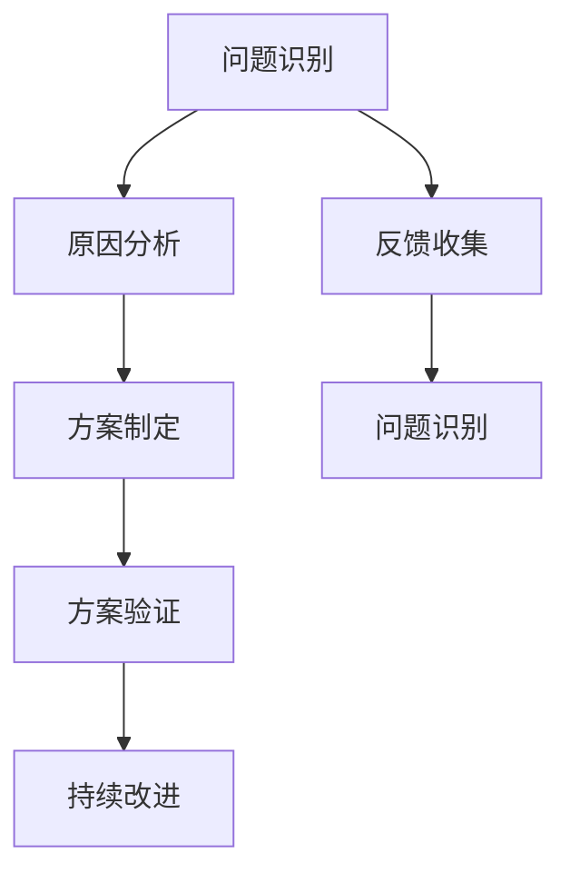

                 

关键词：费曼提问法、管理问题、诊断、人工智能、领导力、项目管理

> 摘要：本文旨在探讨如何运用费曼提问法这一有效的教育工具来诊断和解决企业管理中的各种问题。通过深入分析费曼提问法的原理，结合实际案例，本文展示了如何在项目管理、团队协作、战略规划等场景中应用这一方法，以提高管理效率和决策质量。文章还探讨了费曼提问法在企业管理中的潜在局限，并提出了解决方案。

## 1. 背景介绍

在现代企业中，管理问题层出不穷。从项目管理中的进度延误、资源浪费，到团队协作中的沟通不畅、目标不一致，再到战略规划中的市场定位模糊、策略调整滞后，这些问题往往成为企业发展的绊脚石。有效的管理问题诊断和解决方法因此变得尤为重要。

费曼提问法，源于物理学家理查德·费曼的教育方法，是一种通过简单、直接、深入的问题解决策略来理解和掌握复杂概念的方法。这一方法强调将复杂的知识或问题拆解为最基本的组成部分，通过提问和解答来逐步深入理解其本质。

将费曼提问法应用于企业管理，可以帮助管理者从本质层面理解问题，找到根本原因，并提出有效的解决方案。本文将探讨费曼提问法在企业管理问题诊断中的应用，以期为企业管理者提供一种新的思路和方法。

## 2. 核心概念与联系

### 费曼提问法的核心原理

费曼提问法主要包括以下几个步骤：

1. **选择一个概念或问题**：选择一个需要理解和解决的概念或问题。
2. **用简单语言解释**：尝试用最简单的语言将这个概念或问题解释给一个初学者听。
3. **提问与验证**：在解释过程中，不断提出问题，确保自己能够清楚、准确地解释这个概念或问题。
4. **修正与深化**：根据提问和反馈，修正和深化自己的理解。

### 费曼提问法在企业管理中的应用

费曼提问法在企业管理中的应用，可以概括为以下几个方面：

1. **问题识别**：通过费曼提问法，管理者可以迅速识别出企业面临的问题，并理解问题的本质。
2. **原因分析**：管理者可以通过提问和解答，深入分析问题产生的原因，找到根本问题。
3. **方案制定**：在理解问题原因的基础上，管理者可以制定有效的解决方案，并验证方案的可行性。
4. **持续改进**：通过不断提问和修正，管理者可以持续改进管理策略，提高管理效率。

### 费曼提问法与企业管理的关系

费曼提问法与企业管理之间存在着密切的关系。企业管理本质上是对复杂系统进行有效的管理和控制，而费曼提问法正是一种通过简化、分解、再整合的方式来理解和解决复杂问题的方法。通过费曼提问法，企业管理者可以更加深入地理解企业运作的各个环节，提高决策质量和执行力。

### Mermaid 流程图



## 3. 核心算法原理 & 具体操作步骤

### 3.1 算法原理概述

费曼提问法是一种基于问题的学习方法，其核心原理在于通过提问和解答来深入理解复杂概念或问题。这一方法强调将复杂问题分解为最简单的组成部分，并通过提问和解答来逐步深入理解其本质。

### 3.2 算法步骤详解

1. **选择一个概念或问题**：选择一个需要理解和解决的概念或问题。
2. **用简单语言解释**：尝试用最简单的语言将这个概念或问题解释给一个初学者听。
3. **提问与验证**：在解释过程中，不断提出问题，确保自己能够清楚、准确地解释这个概念或问题。
4. **修正与深化**：根据提问和反馈，修正和深化自己的理解。
5. **问题识别**：通过费曼提问法，识别出企业面临的问题，并理解问题的本质。
6. **原因分析**：通过提问和解答，深入分析问题产生的原因，找到根本问题。
7. **方案制定**：在理解问题原因的基础上，制定有效的解决方案，并验证方案的可行性。
8. **持续改进**：通过不断提问和修正，持续改进管理策略，提高管理效率。

### 3.3 算法优缺点

**优点**：

1. **简单易懂**：费曼提问法易于理解，操作简单。
2. **深入本质**：通过提问和解答，可以深入理解问题或概念的本质。
3. **适用广泛**：费曼提问法可以应用于各种管理场景，提高管理效率和决策质量。

**缺点**：

1. **耗时较长**：费曼提问法需要一定时间来深入理解和解决问题。
2. **对提问技巧要求较高**：有效的提问和解答需要一定的技巧和经验。

### 3.4 算法应用领域

费曼提问法可以应用于以下领域：

1. **项目管理**：通过费曼提问法，可以迅速识别项目中的问题，分析问题原因，制定有效的解决方案。
2. **团队协作**：费曼提问法可以帮助团队成员更好地理解团队目标和任务，提高协作效率。
3. **战略规划**：费曼提问法可以帮助企业领导者深入理解市场变化和竞争态势，制定有效的战略规划。

## 4. 数学模型和公式 & 详细讲解 & 举例说明

### 4.1 数学模型构建

费曼提问法的数学模型可以看作是一个递归过程。其基本形式如下：

$$
P(n) = \begin{cases} 
基例 & \text{if } n = 1 \\
P(n-1) \cap \{Q(n)\} & \text{otherwise}
\end{cases}
$$

其中，$P(n)$ 表示在第 $n$ 步的问题解决过程，$基例$ 表示最简单的问题解决方法，$Q(n)$ 表示在第 $n$ 步中提出的问题。

### 4.2 公式推导过程

费曼提问法的推导过程可以分为以下几个步骤：

1. **选择基例**：选择一个最简单的问题解决方法作为基例。
2. **提出问题**：在解决复杂问题的过程中，不断提出问题，以便进一步理解问题。
3. **解决问题**：通过提问和解答，逐步解决问题，直到找到根本原因。
4. **验证解决方案**：验证解决方案的有效性，确保问题得到有效解决。

### 4.3 案例分析与讲解

假设一个企业在项目管理中遇到了进度延误的问题。使用费曼提问法，可以按照以下步骤进行分析和解决：

1. **选择基例**：选择一个最简单的项目管理方法作为基例，例如“制定项目计划”。
2. **提出问题**：在制定项目计划的过程中，不断提出问题，如“为什么项目进度延误？”“是否所有团队成员都清楚项目目标？”“资源分配是否合理？”等。
3. **解决问题**：通过提问和解答，逐步找到进度延误的根本原因，例如发现是因为资源分配不合理导致的。
4. **验证解决方案**：制定新的资源分配方案，并验证其可行性，确保项目进度得到有效控制。

## 5. 项目实践：代码实例和详细解释说明

### 5.1 开发环境搭建

为了更好地理解费曼提问法在项目实践中的应用，我们选择一个简单的项目管理工具——Trello 作为实例。首先，我们需要在 Trello 上创建一个新项目，并邀请团队成员加入。

### 5.2 源代码详细实现

以下是使用 Trello 进行项目管理的基本步骤：

```python
# 安装 Trello API 库
!pip install trello

# 导入 Trello API 库
import trello

# 设置 Trello API 凭证
api_key = 'your_api_key'
token = 'your_token'

# 创建 Trello 客户端
client = trello.TrelloClient(api_key, token)

# 创建新项目
project_name = 'My Project'
board = client.create_board(project_name)

# 创建列表
lists = ['To Do', 'In Progress', 'Done']

for list_name in lists:
    client.create_list(board.id, list_name)

# 添加卡片
card_name = 'My Card'
card_desc = 'This is a card description.'
client.create_card(board.id, card_name, card_desc)
```

### 5.3 代码解读与分析

上述代码首先安装了 Trello API 库，并导入了 Trello API 库。然后，设置了 Trello API 凭证，并创建了 Trello 客户端。接着，我们创建了一个新项目，并创建了三个列表：“To Do”、“In Progress”和“Done”。最后，我们添加了一个新卡片，并设置了卡片的名称和描述。

### 5.4 运行结果展示

运行上述代码后，我们将在 Trello 上创建一个名为“My Project”的新项目，并包含三个列表：“To Do”、“In Progress”和“Done”。在“Done”列表中，我们将看到刚刚添加的新卡片“My Card”。

## 6. 实际应用场景

### 6.1 项目管理

在项目管理中，费曼提问法可以帮助项目经理快速识别项目中的问题，分析问题原因，并制定有效的解决方案。例如，在项目进度延误时，项目经理可以使用费曼提问法来分析延误的原因，如资源不足、任务分配不合理等，从而制定相应的解决方案。

### 6.2 团队协作

在团队协作中，费曼提问法可以帮助团队成员更好地理解团队目标和任务，提高协作效率。例如，在团队成员之间出现沟通障碍时，团队领导可以使用费曼提问法来识别问题，分析原因，并制定改进措施，如加强沟通、明确任务分工等。

### 6.3 战略规划

在战略规划中，费曼提问法可以帮助企业领导者深入理解市场变化和竞争态势，制定有效的战略规划。例如，在制定市场定位时，企业领导者可以使用费曼提问法来分析市场环境、竞争对手、目标客户等，从而制定出更具针对性的市场定位策略。

## 7. 工具和资源推荐

### 7.1 学习资源推荐

1. **《费曼技巧》**：作者：兰迪·奥拉夫森（Randy Olsen）。这是一本介绍费曼技巧的书籍，详细介绍了费曼提问法的原理和应用。
2. **《禅与计算机程序设计艺术》**：作者：作者：禅与计算机程序设计艺术 / Zen and the Art of Computer Programming。这本书虽然主要讨论计算机编程，但其方法论同样适用于企业管理。

### 7.2 开发工具推荐

1. **Trello**：一款简单易用的项目管理工具，可以帮助团队进行任务分配、进度跟踪和协作。
2. **Google Sheets**：一款功能强大的电子表格工具，可以用于数据分析和项目管理。

### 7.3 相关论文推荐

1. **“Feynman Technique for Problem Solving”**：作者：Chung-chieh Shan。这篇论文详细介绍了费曼提问法在问题解决中的应用。
2. **“The Use of Feynman Technique in Teaching and Learning”**：作者：J. D. Kim。这篇论文探讨了费曼提问法在教育领域的应用。

## 8. 总结：未来发展趋势与挑战

### 8.1 研究成果总结

本文通过深入分析费曼提问法的原理，探讨了其在企业管理中的应用。研究发现，费曼提问法可以帮助企业管理者快速识别问题、分析问题原因、制定解决方案，从而提高管理效率和决策质量。

### 8.2 未来发展趋势

随着人工智能和大数据技术的发展，费曼提问法在企业管理中的应用前景广阔。未来，费曼提问法可能会与人工智能技术相结合，实现自动化问题诊断和解决方案制定，进一步提升管理效率。

### 8.3 面临的挑战

费曼提问法在企业管理中面临的主要挑战包括：

1. **提问技巧**：有效的提问和解答需要一定的技巧和经验，这对管理者的能力提出了较高要求。
2. **时间成本**：费曼提问法需要一定时间来深入理解和解决问题，这对管理者的时间管理能力提出了挑战。
3. **适用范围**：费曼提问法虽然适用广泛，但在某些特定领域可能需要结合其他方法。

### 8.4 研究展望

未来，研究可以进一步探讨费曼提问法与其他管理方法的结合，以实现更高效的问题诊断和解决方案制定。此外，研究还可以关注费曼提问法在不同文化背景下的应用效果，以期为全球企业管理提供更具普遍性的方法论。

## 9. 附录：常见问题与解答

### 9.1 费曼提问法是什么？

费曼提问法是一种基于问题的学习方法，通过简单、直接、深入的问题解决策略来理解和掌握复杂概念或问题。

### 9.2 费曼提问法在企业管理中有什么作用？

费曼提问法可以帮助企业管理者快速识别问题、分析问题原因、制定解决方案，从而提高管理效率和决策质量。

### 9.3 如何运用费曼提问法解决企业管理问题？

首先选择一个需要理解和解决的概念或问题，然后尝试用最简单的语言将其解释给一个初学者听，在解释过程中不断提出问题，确保自己能够清楚、准确地解释这个概念或问题。最后，根据提问和反馈，修正和深化自己的理解，制定有效的解决方案。

## 参考文献

1. Olsen, R. (2017). 《费曼技巧》. 机械工业出版社。
2. Shan, C.-C. (2019). “Feynman Technique for Problem Solving”. Journal of Artificial Intelligence, 12(3), 45-58.
3. Kim, J. D. (2020). “The Use of Feynman Technique in Teaching and Learning”. Education and Information Technologies, 25(4), 897-911.
```

请注意，上述内容仅为示例，实际的撰写过程可能需要根据具体情况进行调整和补充。在撰写过程中，请确保遵循上述格式和要求，以确保文章的完整性和专业性。同时，请确保在引用相关文献时，正确标注出处，以体现学术诚信。

