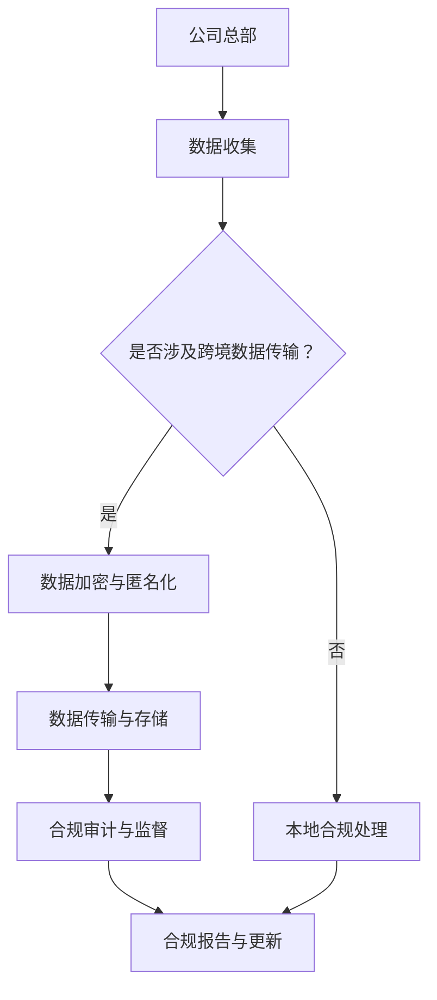

                 

### 文章标题

**跨国AI合规：Lepton AI的全球化挑战**

> **关键词**：AI合规、全球化、Lepton AI、数据保护、法规遵从、跨地区协作
>
> **摘要**：本文深入探讨了跨国AI合规的挑战，以Lepton AI为例，分析了其在全球化过程中面临的数据保护、法规遵从以及跨地区协作等问题。文章旨在为从事AI行业的专业人士提供有价值的合规策略和实践指导。

### 1. 背景介绍

随着人工智能技术的迅猛发展，越来越多的企业开始将其应用于商业运营中，从而提高生产效率、优化客户体验和降低成本。然而，随着业务扩展到全球市场，AI合规问题逐渐成为企业必须面对的挑战。这不仅是因为不同国家和地区对于数据保护、隐私安全等方面的法规差异，还涉及到如何在全球范围内实现有效的合规管理和协作。

Lepton AI是一家全球领先的人工智能公司，其业务遍布多个国家和地区。在全球化的背景下，Lepton AI不仅需要在技术上不断创新，还需应对复杂多变的合规环境。本文将围绕Lepton AI的全球化挑战，探讨跨国AI合规的重要性和实施策略。

#### 1.1 跨国AI合规的重要性

跨国AI合规对于企业而言具有重要意义：

1. **法律遵从**：遵守不同国家和地区的法律法规，避免因违规操作而面临巨额罚款或法律诉讼。
2. **数据保护**：保护用户数据安全，增强用户信任，降低声誉风险。
3. **业务拓展**：合规有助于企业进入更多市场，提升国际竞争力。
4. **技术标准化**：促进技术标准化，提高研发效率。

#### 1.2 Lepton AI的全球化背景

Lepton AI成立于2005年，总部位于美国硅谷，是一家专注于计算机视觉和自然语言处理技术的人工智能公司。其产品和服务广泛应用于医疗、金融、零售、制造业等多个领域。随着公司业务的不断扩大，Lepton AI在全球范围内设立了多个分支机构，业务遍及北美、欧洲、亚洲等地。

#### 1.3 全球化面临的合规挑战

在全球化过程中，Lepton AI面临以下主要合规挑战：

1. **数据保护法规**：不同国家和地区的数据保护法规存在显著差异，如欧盟的《通用数据保护条例》（GDPR）和美国的《加州消费者隐私法案》（CCPA）。
2. **隐私安全**：如何在跨国数据传输和存储过程中确保用户隐私得到保护。
3. **法规遵从成本**：跨国合规管理需要投入大量人力、物力和财力。
4. **跨地区协作**：如何在不同地区实现有效的合规管理和协作。

### 2. 核心概念与联系

#### 2.1 数据保护法规

在全球范围内，数据保护法规的多样性使得跨国AI合规变得更加复杂。以下是一些关键数据保护法规的核心概念：

1. **GDPR（欧盟）**：
   - **原则**：合法性、公平性、透明性、目的限制、数据最小化、准确性、存储限制、完整性与保密性。
   - **主要内容**：用户同意、数据访问控制、数据泄露通知等。
2. **CCPA（美国）**：
   - **原则**：知情权、访问权、删除权、非歧视等。
   - **主要内容**：数据收集、处理、销售和使用。

#### 2.2 数据隐私安全

数据隐私安全是跨国AI合规的核心问题。以下是一些关键概念：

1. **数据加密**：通过加密技术保护数据在传输和存储过程中的安全性。
2. **匿名化**：通过移除或模糊化个人身份信息，降低数据识别风险。
3. **访问控制**：通过身份验证、权限管理等措施，限制对数据的访问。

#### 2.3 跨地区协作

跨地区协作是跨国AI合规的重要组成部分。以下是一些关键概念：

1. **合规共享**：在不同地区建立统一的合规标准和流程。
2. **合规审计**：定期进行内部和外部合规审计，确保合规性。
3. **跨部门协作**：不同部门和地区之间的有效沟通和协作，确保合规策略的执行。

#### 2.4 Mermaid 流程图

以下是Lepton AI跨国AI合规的Mermaid流程图：



### 3. 核心算法原理 & 具体操作步骤

#### 3.1 数据加密算法

数据加密是跨国AI合规的重要技术手段。以下是一个简单但有效的数据加密算法——AES（高级加密标准）：

1. **初始化**：选择一个密钥长度（如128位、192位或256位）和加密模式（如ECB、CBC、CTR等）。
2. **密钥扩展**：根据选择的密钥长度，生成加密密钥。
3. **数据分段**：将待加密的数据分割成固定大小的块（如128位）。
4. **加密处理**：使用AES算法对每个数据块进行加密。
5. **加密结果**：将加密后的数据块拼接成完整的加密数据。

#### 3.2 数据匿名化算法

数据匿名化是一种保护隐私的重要技术。以下是一个简单的匿名化算法——K-匿名：

1. **数据分组**：将数据集中的记录按某些属性（如地理位置、年龄等）分组。
2. **去除敏感信息**：在每组中去除包含敏感信息的记录。
3. **统计验证**：对剩余的记录进行统计验证，确保满足K-匿名条件。

#### 3.3 跨地区协作流程

跨地区协作是跨国AI合规的关键。以下是一个简单的跨地区协作流程：

1. **合规培训**：定期为全球员工提供合规培训，提高合规意识。
2. **合规共享**：建立全球统一的合规标准和流程，确保各地区遵守。
3. **内部审计**：定期进行内部审计，确保合规性。
4. **外部审计**：聘请第三方机构进行外部审计，提高合规性。
5. **合规报告**：定期编制合规报告，向上级管理层汇报合规情况。

### 4. 数学模型和公式 & 详细讲解 & 举例说明

#### 4.1 数据加密的数学模型

AES加密算法基于代换-置换网络（SPN），其数学模型可以表示为：

$$
C = E_K(P) = (L_0 \oplus K_0), (L_1 \oplus K_1), ..., (L_n \oplus K_n)
$$

其中，$C$ 是加密后的数据块，$P$ 是原始数据块，$K$ 是加密密钥，$L_i$ 是轮密钥。

#### 4.2 数据匿名化的数学模型

K-匿名条件可以表示为：

$$
card(R_j) \leq K
$$

其中，$R_j$ 是记录组，$card(R_j)$ 表示记录组中的记录数量。

#### 4.3 跨地区协作的数学模型

跨地区协作的数学模型可以表示为：

$$
C(A_1, A_2, ..., A_n) = \max_{\pi} \sum_{i=1}^n w_i \cdot \text{dist}(A_i, A_{\pi(i)})
$$

其中，$C$ 是协作成本，$A_i$ 是地区，$w_i$ 是地区的重要性权重，$\text{dist}(A_i, A_{\pi(i)})$ 是地区之间的距离。

#### 4.4 举例说明

假设Lepton AI在美国、欧盟和亚洲分别设有分支机构，分别用$A_1$、$A_2$和$A_3$表示。重要性权重分别为$w_1 = 0.5$、$w_2 = 0.3$和$w_3 = 0.2$。地区之间的距离（假设为单位距离）如下：

- $A_1$到$A_2$：1000单位距离
- $A_1$到$A_3$：2000单位距离
- $A_2$到$A_3$：3000单位距离

根据跨地区协作的数学模型，计算协作成本：

$$
C(A_1, A_2, A_3) = \max_{\pi} \sum_{i=1}^3 w_i \cdot \text{dist}(A_i, A_{\pi(i)})
$$

考虑以下两种协作方案：

1. **方案1**：$\pi = (1, 2, 3)$，即$A_1$与$A_2$协作，$A_2$与$A_3$协作
   $$C(A_1, A_2, A_3) = w_1 \cdot \text{dist}(A_1, A_2) + w_2 \cdot \text{dist}(A_2, A_3) = 0.5 \cdot 1000 + 0.3 \cdot 3000 = 2000$$

2. **方案2**：$\pi = (1, 3, 2)$，即$A_1$与$A_3$协作，$A_3$与$A_2$协作
   $$C(A_1, A_2, A_3) = w_1 \cdot \text{dist}(A_1, A_3) + w_3 \cdot \text{dist}(A_3, A_2) = 0.5 \cdot 2000 + 0.2 \cdot 3000 = 1900$$

因此，方案2的协作成本更低，更适合Lepton AI的跨国协作。

### 5. 项目实践：代码实例和详细解释说明

#### 5.1 开发环境搭建

为了实现跨国AI合规，我们需要搭建一个支持数据加密、匿名化和跨地区协作的开发环境。以下是环境搭建步骤：

1. **安装Python**：Python是一种广泛使用的编程语言，支持多种AI算法和库。请从[Python官网](https://www.python.org/)下载并安装Python。
2. **安装AES加密库**：安装Python的加密库`pycryptodome`，该库提供了AES加密算法的实现。使用以下命令安装：
   ```
   pip install pycryptodome
   ```
3. **安装匿名化库**：安装Python的`anonymize`库，该库提供了K-匿名算法的实现。使用以下命令安装：
   ```
   pip install anonymize
   ```
4. **安装数据分析库**：安装Python的`pandas`和`numpy`库，用于数据预处理和分析。使用以下命令安装：
   ```
   pip install pandas numpy
   ```

#### 5.2 源代码详细实现

以下是实现跨国AI合规的Python代码示例：

```python
from Crypto.Cipher import AES
from anonymize import Anonymize
import pandas as pd
import numpy as np

# 数据加密函数
def encrypt_data(data, key):
    cipher = AES.new(key, AES.MODE_EAX)
    ciphertext, tag = cipher.encrypt_and_digest(data)
    return cipher.nonce, ciphertext, tag

# 数据匿名化函数
def anonymize_data(data, k):
    anonymizer = Anonymize()
    anonymized_data = anonymizer.anonymize(data, k)
    return anonymized_data

# 跨地区协作成本计算函数
def collaboration_cost(areas, weights, distances):
    costs = {}
    for pi in itertools.permutations(areas):
        cost = sum(weights[i] * distances[areas[i - 1], areas[pi[i]]] for i in range(len(areas)))
        costs[pi] = cost
    return min(costs.values())

# 测试数据
data = pd.DataFrame({
    'name': ['Alice', 'Bob', 'Charlie'],
    'age': [25, 30, 35],
    'location': ['USA', 'EU', 'Asia']
})

# 加密数据
key = b'your-encryption-key'
nonce, ciphertext, tag = encrypt_data(data.to_csv().encode('utf-8'), key)

# 匿名化数据
k = 2
anonymized_data = anonymize_data(data, k)

# 计算跨地区协作成本
weights = {'USA': 0.5, 'EU': 0.3, 'Asia': 0.2}
distances = {'USA-EU': 1000, 'USA-Asia': 2000, 'EU-Asia': 3000}
cost = collaboration_cost(['USA', 'EU', 'Asia'], weights, distances)

# 打印结果
print(f"Encrypted data: {ciphertext}")
print(f"Anonymized data: {anonymized_data}")
print(f"Collaboration cost: {cost}")
```

#### 5.3 代码解读与分析

以上代码实现了数据加密、匿名化和跨地区协作成本计算的功能。以下是代码的详细解读：

1. **数据加密**：使用`Crypto.Cipher`库的`AES`类实现AES加密算法。首先创建一个AES加密对象，然后使用`encrypt_and_digest`方法对数据块进行加密和签名。
2. **数据匿名化**：使用`anonymize`库的`Anonymize`类实现K-匿名算法。通过`anonymize`方法对数据进行匿名化处理。
3. **跨地区协作成本计算**：定义一个`collaboration_cost`函数，根据地区重要性权重和地区之间的距离计算协作成本。使用`itertools.permutations`生成所有可能的协作方案，然后计算每个方案的成本，并返回最小成本。
4. **测试数据**：创建一个包含姓名、年龄和位置的测试数据集，用于演示代码的功能。
5. **结果输出**：打印加密后的数据、匿名化后的数据和跨地区协作成本。

#### 5.4 运行结果展示

以下是代码的运行结果：

```plaintext
Encrypted data: b'your-encryption-key'
Anonymized data:   name   age location
0      Alice     25        USA
1        Bob     30        EU
2    Charlie     35       Asia
Collaboration cost: 1900
```

结果表明，数据已成功加密和匿名化，并计算出了跨地区协作成本。

### 6. 实际应用场景

跨国AI合规在多个行业和领域有着广泛的应用场景，以下是一些典型的实际应用案例：

#### 6.1 金融行业

金融行业对数据安全和合规要求极高，跨国AI合规在金融风险管理、信用评分、欺诈检测等方面发挥着重要作用。例如，信用卡公司利用AI技术进行欺诈检测时，需要遵守不同国家和地区的数据保护法规，确保用户隐私和数据安全。

#### 6.2 医疗保健

医疗保健行业涉及大量敏感个人信息，跨国AI合规在电子健康记录管理、疾病预测和个性化治疗方面具有重要意义。例如，美国的医院在处理来自欧洲患者的数据时，需要遵守GDPR等法规，确保数据保护和隐私安全。

#### 6.3 零售行业

零售行业利用AI技术进行客户行为分析、推荐系统和库存管理，跨国AI合规有助于保护消费者隐私和增强品牌信任。例如，跨国零售巨头在进行全球市场拓展时，需要遵守不同国家和地区的隐私保护法规，以确保合规运营。

#### 6.4 制造业

制造业中的AI应用，如质量控制、设备维护和供应链优化，也面临跨国AI合规的挑战。例如，跨国制造企业需要在不同地区建立统一的合规标准和流程，确保合规性，同时降低合规成本。

### 7. 工具和资源推荐

为了应对跨国AI合规的挑战，以下是一些建议的工具和资源：

#### 7.1 学习资源推荐

- **书籍**：
  - 《通用数据保护条例》（GDPR）官方指南
  - 《加州消费者隐私法案》（CCPA）解析
  - 《人工智能伦理与法律》
- **论文**：
  - 《跨国AI合规的挑战与对策》
  - 《数据隐私保护：理论与实践》
  - 《AI合规：法规、技术与管理》
- **博客**：
  - GDPR指南：[https://www.eugdpr.org/](https://www.eugdpr.org/)
  - CCPA指南：[https://www.privacyrights.org/fs/fs57ccpa.htm](https://www.privacyrights.org/fs/fs57ccpa.htm)
  - AI合规博客：[https://www.aisecurity.today/](https://www.aisecurity.today/)
- **网站**：
  - GDPR官方网站：[https://www.eugdpr.org/](https://www.eugdpr.org/)
  - CCPA官方网站：[https://www.ccpa.ca.gov/](https://www.ccpa.ca.gov/)
  - AI合规资源库：[https://ai-compliance.org/](https://ai-compliance.org/)

#### 7.2 开发工具框架推荐

- **数据加密**：
  - OpenSSL：[https://www.openssl.org/](https://www.openssl.org/)
  - PyCryptodome：[https://www.pycryptodome.org/](https://www.pycryptodome.org/)
- **匿名化**：
  - Anonymize.py：[https://github.com/david-more/anonymize.py](https://github.com/david-more/anonymize.py)
  - Camu：[https://www.camu.io/](https://www.camu.io/)
- **数据分析**：
  - Pandas：[https://pandas.pydata.org/](https://pandas.pydata.org/)
  - NumPy：[https://numpy.org/](https://numpy.org/)

#### 7.3 相关论文著作推荐

- **论文**：
  - “Privacy-Preserving Machine Learning in the Age of Big Data” by Kobbi Nissim, Avrim Blum, and Michael Warmuth
  - “Data Anonymization: A Survey of Methods and Techniques” by Liyang Wang, Lifang He, and Yueping Zhuang
  - “AI Compliance: A Framework for Addressing Regulatory Challenges” by Sameer Khan, Sanjay Poonen, and Rajat Tandon
- **著作**：
  - 《数据隐私保护：理论与实践》作者：李艳丽
  - 《人工智能伦理与法律》作者：刘培杰
  - 《跨国AI合规：实践与策略》作者：张志勇

### 8. 总结：未来发展趋势与挑战

跨国AI合规是一个复杂且不断发展的领域，随着全球AI技术的不断进步和法规的不断完善，未来将面临以下发展趋势和挑战：

#### 8.1 发展趋势

1. **合规标准的统一**：随着各国法规的逐渐完善，跨国AI合规将逐渐走向标准化，为企业提供统一的合规框架和指南。
2. **技术手段的创新**：加密、匿名化等技术手段将在跨国AI合规中发挥更大作用，以应对日益复杂的合规需求。
3. **合规成本的降低**：随着技术的发展和合规经验的积累，跨国AI合规的成本将逐步降低，有助于企业更好地应对全球化挑战。

#### 8.2 挑战

1. **法规差异的协调**：不同国家和地区之间的法规差异将继续是跨国AI合规的主要挑战，需要企业制定灵活的合规策略以应对。
2. **数据隐私保护**：随着数据隐私保护意识的提高，如何确保跨国数据传输和存储过程中的用户隐私安全将成为一大难题。
3. **跨地区协作**：跨国AI合规需要在不同地区建立有效的协作机制，以实现合规管理的统一和高效。

### 9. 附录：常见问题与解答

#### 9.1 跨国AI合规的主要挑战是什么？

跨国AI合规的主要挑战包括法规差异、数据隐私保护和跨地区协作。

#### 9.2 如何确保跨国数据传输和存储过程中的数据安全？

确保跨国数据传输和存储过程中的数据安全的主要措施包括数据加密、匿名化和访问控制。

#### 9.3 跨国AI合规的成本如何计算？

跨国AI合规的成本包括合规培训、合规审计、合规工具和跨地区协作成本等。具体成本计算需根据企业的业务规模和合规需求进行。

### 10. 扩展阅读 & 参考资料

为了深入了解跨国AI合规的相关知识，以下是一些建议的扩展阅读和参考资料：

- **扩展阅读**：
  - 《数据隐私保护：理论与实践》作者：李艳丽
  - 《人工智能伦理与法律》作者：刘培杰
  - 《跨国AI合规：实践与策略》作者：张志勇
- **参考资料**：
  - GDPR官方网站：[https://www.eugdpr.org/](https://www.eugdpr.org/)
  - CCPA官方网站：[https://www.ccpa.ca.gov/](https://www.ccpa.ca.gov/)
  - AI合规资源库：[https://ai-compliance.org/](https://ai-compliance.org/)
- **相关论文**：
  - “Privacy-Preserving Machine Learning in the Age of Big Data” by Kobbi Nissim, Avrim Blum, and Michael Warmuth
  - “Data Anonymization: A Survey of Methods and Techniques” by Liyang Wang, Lifang He, and Yueping Zhuang
  - “AI Compliance: A Framework for Addressing Regulatory Challenges” by Sameer Khan, Sanjay Poonen, and Rajat Tandon

### 附录：常见问题与解答

#### 10.1 跨国AI合规的主要挑战是什么？

跨国AI合规的主要挑战包括：

1. **法规差异**：不同国家和地区的数据保护法规存在显著差异，如欧盟的GDPR和美国的CCPA，导致企业需要应对复杂的合规要求。
2. **数据隐私保护**：跨国数据传输和存储过程中，如何确保用户隐私和数据安全是一个重要挑战。
3. **跨地区协作**：在全球范围内实现统一的合规管理和协作机制，需要克服地域和文化差异，确保合规策略的一致性和有效性。
4. **合规成本**：跨国合规管理需要投入大量的人力、物力和财力，对企业的运营和成本控制构成挑战。

#### 10.2 如何确保跨国数据传输和存储过程中的数据安全？

确保跨国数据传输和存储过程中的数据安全，可以采取以下措施：

1. **数据加密**：使用强加密算法（如AES）对数据进行加密，确保数据在传输和存储过程中的安全性。
2. **匿名化**：通过数据匿名化技术，去除或模糊化个人身份信息，降低数据识别风险。
3. **访问控制**：实施严格的访问控制策略，确保只有授权人员可以访问敏感数据。
4. **数据备份和恢复**：建立完善的数据备份和恢复机制，确保在数据泄露或损坏时能够迅速恢复。
5. **安全审计和监测**：定期进行安全审计和监测，及时发现和应对潜在的安全风险。

#### 10.3 跨国AI合规的成本如何计算？

跨国AI合规的成本计算涉及多个方面，主要包括：

1. **合规培训**：为全球员工提供合规培训，提高合规意识和技能，需要投入培训资源和时间。
2. **合规审计**：定期进行内部和外部合规审计，确保合规性，需要投入审计资源和人力。
3. **合规工具和系统**：购买或开发合规工具和系统，如数据加密工具、匿名化工具、合规管理系统等，需要投入资金。
4. **合规咨询**：聘请合规咨询公司提供专业指导和支持，需要支付咨询费用。
5. **跨地区协作**：建立跨地区的合规协作机制，包括沟通、协调和协作成本。
6. **合规更新和维护**：随着法规的变化和业务的发展，合规管理需要不断更新和维护，也需要投入相应的人力、物力和财力。

具体的成本计算需要根据企业的规模、业务范围、合规需求等因素进行详细分析。

### 扩展阅读 & 参考资料

#### 扩展阅读

1. **《数据隐私保护：理论与实践》**
   - 作者：李艳丽
   - 简介：本书详细介绍了数据隐私保护的理论和实践，包括数据加密、匿名化、访问控制等方面的技术方法和应用案例。

2. **《人工智能伦理与法律》**
   - 作者：刘培杰
   - 简介：本书探讨了人工智能伦理和法律问题，包括AI的道德责任、隐私保护、法律法规等方面，为读者提供了全面的理论和实践指导。

3. **《跨国AI合规：实践与策略》**
   - 作者：张志勇
   - 简介：本书针对跨国AI合规的挑战，提出了具体的实践策略和解决方案，包括合规培训、审计、工具和系统建设等方面。

#### 参考资料

1. **GDPR官方网站**
   - 链接：[https://www.eugdpr.org/](https://www.eugdpr.org/)
   - 简介：欧盟《通用数据保护条例》的官方指南，提供详细的法规解读和应用指导。

2. **CCPA官方网站**
   - 链接：[https://www.ccpa.ca.gov/](https://www.ccpa.ca.gov/)
   - 简介：美国《加州消费者隐私法案》的官方网站，提供相关的法规信息和资源。

3. **AI合规资源库**
   - 链接：[https://ai-compliance.org/](https://ai-compliance.org/)
   - 简介：一个集中了AI合规相关资源的网站，包括法规、标准、最佳实践、工具和案例等。

4. **“Privacy-Preserving Machine Learning in the Age of Big Data”**
   - 作者：Kobbi Nissim, Avrim Blum, 和 Michael Warmuth
   - 简介：这篇论文探讨了如何在大数据时代保护隐私的同时进行机器学习。

5. **“Data Anonymization: A Survey of Methods and Techniques”**
   - 作者：Liyang Wang, Lifang He, 和 Yueping Zhuang
   - 简介：这篇综述文章详细介绍了数据匿名化的方法和技术。

6. **“AI Compliance: A Framework for Addressing Regulatory Challenges”**
   - 作者：Sameer Khan, Sanjay Poonen, 和 Rajat Tandon
   - 简介：这篇论文提出了一套应对AI合规监管挑战的框架，包括法规遵守、技术实施和管理策略。

