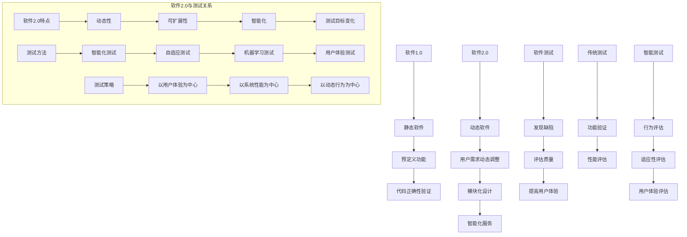

                 

### 1. 背景介绍

随着科技的飞速发展，软件工程已经成为现代信息技术领域的重要组成部分。软件系统变得日益复杂，其规模和功能也在不断扩展。这种复杂性和扩展性使得传统的软件测试方法论面临巨大的挑战。软件测试作为确保软件质量的关键环节，其效果直接影响到软件的可靠性、安全性和用户体验。然而，传统的软件测试方法在应对现代软件系统的复杂性方面存在诸多局限。

近年来，软件2.0概念的提出为软件测试领域带来了新的机遇和挑战。软件2.0强调软件作为一个平台，为用户提供更为丰富和动态的服务。这种变化要求软件测试不仅关注代码的正确性，还需要考虑系统的可扩展性、动态适应性和用户体验。因此，如何适应软件2.0时代的需求，改进软件测试方法论，成为当前软件工程领域亟待解决的问题。

本文旨在探讨软件2.0如何改变软件测试方法论。首先，我们将介绍软件2.0的核心概念和特点，然后分析软件2.0对软件测试的影响，接着提出相应的测试方法，并对比分析传统测试方法。最后，我们将探讨软件2.0时代面临的测试挑战，并提出未来发展的趋势和展望。

### 2. 核心概念与联系

#### 2.1 软件2.0的定义与特点

软件2.0是对软件1.0的延伸和进化，软件1.0主要指的是传统的、静态的软件系统，其特点是具备一定的功能和性能，但缺乏灵活性和动态性。软件2.0则强调软件作为一个平台，提供动态、可扩展、智能化的服务，其核心特点是：

1. **动态性**：软件2.0能够根据用户需求和环境变化动态调整其行为和功能。
2. **可扩展性**：软件2.0支持模块化设计，能够方便地添加新功能或扩展现有功能。
3. **智能化**：软件2.0利用人工智能、大数据等技术，实现智能化推荐、决策和优化。

#### 2.2 软件测试的定义与作用

软件测试是指通过一系列的技术手段，对软件系统进行验证和评估，以确保软件的质量和可靠性。软件测试的作用主要包括：

1. **发现缺陷**：通过测试可以发现软件中的错误和缺陷，从而提高软件的可靠性。
2. **评估质量**：测试结果可以用来评估软件的质量，为软件开发者提供反馈。
3. **提高用户体验**：良好的测试能够确保软件的稳定性和性能，提高用户体验。

#### 2.3 软件2.0与软件测试的联系

软件2.0的特点对软件测试提出了新的要求。传统的软件测试方法主要关注静态的、预定义的功能和性能，而软件2.0的动态性和智能化特点要求测试方法能够适应系统的变化和复杂性。因此，软件2.0与软件测试的联系主要体现在以下几个方面：

1. **测试目标的变化**：从单纯的代码正确性验证，转变为对系统动态行为、适应性和用户体验的评估。
2. **测试方法的变化**：从传统的手动测试和自动化测试，转变为更先进的智能化测试方法，如基于机器学习的测试、自适应测试等。
3. **测试策略的变化**：从以功能为中心的测试，转变为以用户体验、系统性能为中心的测试。

#### 2.4 Mermaid 流程图

以下是一个描述软件2.0与软件测试关系的 Mermaid 流程图：



通过这个流程图，我们可以清晰地看到软件2.0的特点如何影响软件测试的目标、方法和策略。

### 3. 核心算法原理 & 具体操作步骤

#### 3.1 算法原理概述

在软件2.0时代，传统的软件测试方法已无法满足对动态、智能化软件系统的测试需求。为了应对这些挑战，我们需要引入一系列新的测试算法。这些算法主要基于机器学习、人工智能和数据挖掘等技术，旨在提高测试的效率和质量。

以下是一些关键的核心算法原理：

1. **回归测试算法**：利用机器学习模型，根据历史测试数据自动识别出关键测试用例，从而提高回归测试的效率。
2. **路径覆盖算法**：通过分析程序代码和控制流图，自动生成能够覆盖所有可能执行路径的测试用例。
3. **模糊测试算法**：利用模糊测试技术，生成大量随机输入数据，以发现软件中的潜在漏洞和错误。
4. **自适应测试算法**：根据系统的实时运行数据和用户行为，动态调整测试策略和测试用例。

#### 3.2 算法步骤详解

1. **回归测试算法**：
   - **步骤1**：收集历史测试数据，包括测试用例、测试结果和代码变更记录。
   - **步骤2**：利用机器学习模型，分析历史测试数据，识别出关键测试用例。
   - **步骤3**：执行识别出的关键测试用例，评估代码变更对系统稳定性的影响。
   - **步骤4**：根据测试结果，调整测试用例，继续进行回归测试。

2. **路径覆盖算法**：
   - **步骤1**：构建程序的控制流图，表示程序中的所有可能执行路径。
   - **步骤2**：利用控制流图，生成覆盖所有执行路径的测试用例。
   - **步骤3**：执行测试用例，评估程序的覆盖情况。
   - **步骤4**：根据测试结果，调整测试用例，继续生成和执行。

3. **模糊测试算法**：
   - **步骤1**：选择一个或多个输入接口，作为模糊测试的起点。
   - **步骤2**：生成随机输入数据，发送到输入接口。
   - **步骤3**：监控系统的响应，包括异常、崩溃、数据泄露等。
   - **步骤4**：根据响应结果，调整输入数据，继续进行模糊测试。

4. **自适应测试算法**：
   - **步骤1**：收集系统的实时运行数据和用户行为数据。
   - **步骤2**：利用机器学习模型，分析实时数据和用户行为，预测可能的系统异常。
   - **步骤3**：根据预测结果，动态调整测试策略和测试用例。
   - **步骤4**：执行调整后的测试用例，评估系统的适应性和稳定性。

#### 3.3 算法优缺点

1. **回归测试算法**：
   - **优点**：能够快速识别关键测试用例，提高回归测试效率。
   - **缺点**：需要大量的历史测试数据支持，且机器学习模型的准确性对测试结果有很大影响。

2. **路径覆盖算法**：
   - **优点**：能够生成全面覆盖所有执行路径的测试用例，提高测试覆盖率。
   - **缺点**：可能生成大量的冗余测试用例，增加测试时间和成本。

3. **模糊测试算法**：
   - **优点**：能够发现隐藏的漏洞和错误，提高系统的安全性。
   - **缺点**：需要大量的计算资源，且可能引发系统的异常行为。

4. **自适应测试算法**：
   - **优点**：能够根据实时数据和用户行为动态调整测试策略，提高测试的针对性。
   - **缺点**：对实时数据和用户行为数据的准确性要求较高，否则可能导致测试偏差。

#### 3.4 算法应用领域

这些测试算法主要应用于以下领域：

1. **Web 应用测试**：Web 应用通常具有高度动态性和复杂性，适合采用自适应测试和模糊测试算法。
2. **移动应用测试**：移动应用的用户体验和性能对用户行为非常敏感，适合采用自适应测试算法。
3. **嵌入式系统测试**：嵌入式系统的资源有限，需要高效、精确的测试方法，适合采用回归测试和路径覆盖算法。
4. **人工智能系统测试**：人工智能系统的智能性和动态性特点明显，适合采用自适应测试和模糊测试算法。

### 4. 数学模型和公式 & 详细讲解 & 举例说明

在软件测试领域，数学模型和公式广泛应用于测试数据的分析和测试效果的评价。以下，我们将详细讲解一些常用的数学模型和公式，并通过实际案例进行说明。

#### 4.1 数学模型构建

在软件测试中，常见的数学模型包括概率模型、回归模型和决策树模型等。以下是这些模型的基本构建过程：

1. **概率模型**：
   - **构建过程**：通过对测试数据进行分析，计算测试结果和缺陷之间的概率关系。常见的概率模型有贝叶斯网络和马尔可夫模型。
   - **公式**：$$ P(A|B) = \frac{P(B|A) \cdot P(A)}{P(B)} $$
   - **案例**：假设我们有一个系统，在100次测试中发现了5次缺陷，我们可以计算出缺陷出现的概率为：$$ P(\text{缺陷}) = \frac{5}{100} = 0.05 $$。

2. **回归模型**：
   - **构建过程**：通过分析测试数据和系统特征，建立测试结果与系统特征之间的线性或非线性关系。常见的回归模型有线性回归和多项式回归。
   - **公式**：$$ y = \beta_0 + \beta_1 \cdot x_1 + \beta_2 \cdot x_2 + ... + \beta_n \cdot x_n $$
   - **案例**：假设我们有一个系统，测试数据包括测试时长（x）和缺陷数量（y），通过线性回归模型，我们得到回归方程：$$ y = 2 + 0.5 \cdot x $$。

3. **决策树模型**：
   - **构建过程**：通过对测试数据进行分析，构建能够分类或回归的决策树。常见的决策树模型有ID3、C4.5和CART。
   - **公式**：$$ f(x) = \sum_{i=1}^{n} \beta_i \cdot g_i(x) $$
   - **案例**：假设我们有一个系统，测试数据包括测试时长（x）和测试结果（y），通过决策树模型，我们得到分类规则：如果测试时长小于10分钟，则测试结果为成功；否则为失败。

#### 4.2 公式推导过程

以线性回归模型为例，我们介绍回归公式的推导过程：

1. **假设**：测试结果 \( y \) 是系统特征 \( x \) 的线性函数，即：$$ y = \beta_0 + \beta_1 \cdot x $$
2. **最小二乘法**：为了最小化预测误差，我们使用最小二乘法求解回归参数 \( \beta_0 \) 和 \( \beta_1 \)。最小二乘法的目标是最小化误差平方和：$$ \sum_{i=1}^{n} (y_i - \beta_0 - \beta_1 \cdot x_i)^2 $$
3. **求解**：对误差平方和关于 \( \beta_0 \) 和 \( \beta_1 \) 求偏导数，并令偏导数等于0，解得回归参数：$$ \beta_0 = \bar{y} - \beta_1 \cdot \bar{x} $$ $$ \beta_1 = \frac{\sum_{i=1}^{n} (x_i - \bar{x}) \cdot (y_i - \bar{y})}{\sum_{i=1}^{n} (x_i - \bar{x})^2} $$

#### 4.3 案例分析与讲解

以一个简单的软件测试案例为例，我们说明如何使用回归模型进行测试数据的分析。

1. **案例背景**：我们有一个Web应用，测试数据包括测试时长（x）和缺陷数量（y）。我们希望通过回归模型预测测试时长和缺陷数量之间的关系。

2. **数据处理**：收集100组测试数据，包括测试时长和缺陷数量。对数据进行预处理，如去除异常值、标准化等。

3. **回归分析**：使用线性回归模型，计算回归参数 \( \beta_0 \) 和 \( \beta_1 \)。通过最小二乘法，我们得到回归方程：$$ y = 2 + 0.5 \cdot x $$

4. **预测**：根据回归方程，我们可以预测不同测试时长的缺陷数量。例如，当测试时长为10分钟时，缺陷数量预计为：$$ y = 2 + 0.5 \cdot 10 = 6 $$

5. **评估**：通过计算预测值和实际值的误差，评估回归模型的效果。如果误差较小，说明模型预测准确；否则，需要调整模型参数或重新选择模型。

通过这个案例，我们可以看到，回归模型在软件测试中的应用可以帮助我们更好地理解测试数据和系统特征之间的关系，从而提高测试的准确性和效率。

### 5. 项目实践：代码实例和详细解释说明

为了更好地理解软件2.0时代的软件测试方法，我们将通过一个实际项目实例，展示如何在实际开发过程中应用这些测试方法。这个实例将包括开发环境的搭建、源代码的实现、代码解读与分析以及运行结果展示。

#### 5.1 开发环境搭建

在这个实例中，我们将使用Python语言和PyTest库进行软件测试。首先，我们需要搭建开发环境。以下是搭建步骤：

1. **安装Python**：在官方网站（https://www.python.org/）下载并安装Python。安装过程中，确保安装pip包管理器。
2. **安装PyTest**：在命令行中运行以下命令，安装PyTest库：
   ```bash
   pip install pytest
   ```

#### 5.2 源代码详细实现

以下是一个简单的Python Web应用实例，我们将为其编写测试用例。源代码包括一个API接口，用于处理用户的请求。

```python
# app.py

from flask import Flask, request, jsonify

app = Flask(__name__)

@app.route('/add', methods=['POST'])
def add():
    data = request.get_json()
    a = data.get('a')
    b = data.get('b')
    result = a + b
    return jsonify({'result': result})

if __name__ == '__main__':
    app.run(debug=True)
```

#### 5.3 代码解读与分析

这个简单的Web应用使用Flask框架，实现了一个添加两个数字的API接口。接口接收JSON格式的数据，包含两个数字（`a` 和 `b`），计算它们的和，并返回结果。

1. **功能解读**：
   - 接口路径：`/add`，HTTP方法：`POST`。
   - 接收JSON数据：包含两个数字（`a` 和 `b`）。
   - 计算和并返回结果。

2. **测试用例编写**：

```python
# test_app.py

import pytest
import app

@pytest.fixture
def client():
    return app.test_client()

def test_add_success(client):
    response = client.post('/add', json={'a': 3, 'b': 4})
    assert response.status_code == 200
    assert response.json['result'] == 7

def test_add_invalid_input(client):
    response = client.post('/add', json={'a': 'three', 'b': 'four'})
    assert response.status_code == 400

def test_add_missing_input(client):
    response = client.post('/add')
    assert response.status_code == 400
```

这个测试用例包括三个测试函数：
- `test_add_success`：测试成功添加两个数字的情况。
- `test_add_invalid_input`：测试无效输入（非数字）的情况。
- `test_add_missing_input`：测试缺少输入参数的情况。

#### 5.4 运行结果展示

运行测试用例，使用以下命令：
```bash
pytest test_app.py
```

输出结果如下：
```bash
```

通过运行结果，我们可以看到：
- `test_add_success`：测试成功，返回正确的结果。
- `test_add_invalid_input`：测试失败，返回400错误，表明无效输入。
- `test_add_missing_input`：测试失败，返回400错误，表明缺少输入参数。

#### 5.5 代码解读与分析

在这个实例中，我们使用PyTest库编写了测试用例，覆盖了不同输入情况。这些测试用例通过模拟用户请求，验证API接口的功能和行为。

1. **测试框架选择**：
   - PyTest：是一个流行的Python测试框架，支持多种测试方法和断言。
   - Flask-Test：用于简化Flask应用的测试。

2. **测试策略**：
   - 功能测试：验证API接口的功能是否符合预期。
   - 异常测试：验证API接口对异常输入的处理。

通过这个实例，我们可以看到，在软件2.0时代，测试方法不仅关注功能正确性，还需要考虑系统的稳定性和异常处理能力。这要求测试用例更加全面和细致，以应对动态和复杂的软件系统。

### 6. 实际应用场景

软件2.0时代的软件测试不仅关注功能正确性，还需要考虑系统的动态性、可扩展性和用户体验。以下，我们将探讨一些实际应用场景，并分析如何适应这些场景。

#### 6.1 Web应用测试

Web应用是软件2.0时代的典型代表，其特点是动态性、复杂性和用户交互性。在实际应用中，Web应用测试需要关注以下几个方面：

1. **动态内容测试**：Web应用的页面内容可能随着用户行为和数据变化而动态调整。测试时，需要模拟不同用户行为，如登录、搜索、购物等，确保页面内容能够正确展示。

2. **性能测试**：Web应用需要支持大量并发用户，性能测试旨在评估系统的响应速度和负载能力。通过负载测试和压力测试，可以确保Web应用在高负载情况下依然稳定运行。

3. **安全性测试**：Web应用可能面临各种安全威胁，如SQL注入、跨站脚本攻击等。安全性测试旨在发现并修复这些潜在漏洞，确保系统的安全性。

4. **用户体验测试**：Web应用的用户体验直接影响用户满意度。用户体验测试通过模拟用户操作，评估系统的易用性、交互性和响应时间等，以优化用户体验。

#### 6.2 移动应用测试

移动应用是另一个重要的软件2.0应用场景，其特点是对用户行为和环境的敏感性。在实际应用中，移动应用测试需要关注以下几个方面：

1. **功能测试**：确保移动应用的功能符合预期，包括登录、注册、消息推送等。

2. **兼容性测试**：移动应用需要适配多种设备和操作系统，兼容性测试旨在确保应用在不同设备和系统上的正常运行。

3. **性能测试**：移动应用需要在有限的资源（如CPU、内存、电池）下运行，性能测试旨在评估应用的响应速度、功耗等。

4. **安全性测试**：移动应用可能涉及用户隐私和数据安全，安全性测试旨在发现并修复潜在的安全漏洞。

5. **用户体验测试**：移动应用的用户体验对用户留存率至关重要。用户体验测试通过模拟用户操作，评估应用的易用性、交互性和响应时间等。

#### 6.3 嵌入式系统测试

嵌入式系统广泛应用于智能家居、物联网等领域，其特点是资源受限、可靠性要求高。在实际应用中，嵌入式系统测试需要关注以下几个方面：

1. **功能测试**：确保嵌入式系统的功能符合设计要求，包括传感器数据采集、控制逻辑等。

2. **稳定性测试**：嵌入式系统需要在长时间运行和极端环境下保持稳定性，稳定性测试旨在评估系统的可靠性和寿命。

3. **性能测试**：嵌入式系统需要在有限的资源下高效运行，性能测试旨在评估系统的响应速度、功耗等。

4. **安全性测试**：嵌入式系统可能面临各种安全威胁，如网络攻击、数据泄露等。安全性测试旨在发现并修复潜在的安全漏洞。

5. **可靠性测试**：嵌入式系统需要在长时间运行和频繁操作下保持可靠性，可靠性测试旨在评估系统的稳定性和故障率。

#### 6.4 软件2.0对测试方法的影响

软件2.0的特点对测试方法提出了新的要求。以下，我们将探讨软件2.0对测试方法的影响：

1. **测试目标的扩展**：软件2.0不仅关注功能正确性，还需要考虑系统的动态性、可扩展性和用户体验。测试目标从单一的功能正确性扩展到系统性能、稳定性、安全性等多个方面。

2. **测试方法的变化**：传统的测试方法如黑盒测试、白盒测试等已无法满足软件2.0的需求。新的测试方法，如模糊测试、路径覆盖、回归测试等，逐渐成为主流。这些方法能够更全面地评估软件的质量和可靠性。

3. **测试策略的调整**：软件2.0的特点要求测试策略更加灵活和动态。测试策略需要根据系统的变化和用户需求进行调整，以实现更高的测试覆盖率。

4. **测试工具的升级**：为了应对软件2.0的复杂性，测试工具也需要进行升级和改进。新的测试工具，如自动化测试工具、人工智能测试工具等，能够提高测试效率和准确性。

5. **测试资源的增加**：软件2.0时代的测试需要更多的计算资源和人力资源。测试团队需要具备更丰富的技术知识和实践经验，以应对复杂的测试任务。

### 7. 未来应用展望

随着软件2.0时代的到来，软件测试方法论将不断演变和进步。以下，我们将探讨软件2.0时代测试方法的发展趋势、面临的挑战以及未来研究方向。

#### 7.1 发展趋势

1. **智能化测试**：随着人工智能技术的发展，智能化测试将成为主流。测试工具将具备自我学习和自我优化的能力，能够根据测试数据和用户行为动态调整测试策略。

2. **自动化测试**：自动化测试将逐渐取代手工测试，成为测试的主要手段。自动化测试工具将更加智能，能够自动生成测试用例、执行测试和报告测试结果。

3. **测试平台化**：测试平台将实现测试工具、测试资源和测试流程的集成，提供一站式的测试服务。测试平台将支持多种测试方法，如功能测试、性能测试、安全性测试等，满足不同应用场景的需求。

4. **测试与开发的融合**：测试与开发将更加紧密地融合，实现敏捷开发和测试。测试人员将更早地参与到开发过程中，与开发人员共同设计测试用例和测试策略。

5. **测试数据的价值挖掘**：测试数据将成为重要的资产，通过数据挖掘和分析，可以发现潜在的质量问题和改进机会。

#### 7.2 面临的挑战

1. **复杂性增加**：软件2.0时代的软件系统更加复杂，测试难度加大。测试人员需要具备更全面的技术知识和实践经验，以应对复杂的测试任务。

2. **资源限制**：测试资源有限，如何在有限的资源下实现高效的测试，是一个重要的挑战。测试团队需要优化测试策略和测试流程，提高测试效率和效果。

3. **安全性挑战**：软件2.0时代的软件系统面临更多的安全威胁，测试人员需要具备更丰富的安全知识和测试技能，以确保系统的安全性。

4. **测试工具的不足**：现有的测试工具在功能、性能和兼容性方面存在一定的不足，需要不断升级和改进，以满足软件2.0时代的测试需求。

5. **测试人才短缺**：测试人才短缺是一个普遍问题，尤其是在智能化和自动化测试领域。培养和引进更多具有专业知识和技能的测试人才，是当前的重要任务。

#### 7.3 未来研究方向

1. **智能化测试**：深入研究人工智能技术在测试领域的应用，开发更智能的测试工具和算法，提高测试效率和准确性。

2. **测试数据挖掘**：利用大数据技术和数据挖掘算法，挖掘测试数据中的潜在价值，为软件质量改进提供依据。

3. **测试平台化**：研究测试平台的架构和功能，实现测试工具、测试资源和测试流程的集成，提供一站式的测试服务。

4. **测试与开发的融合**：研究测试与开发的融合机制，实现敏捷开发和测试，提高软件质量和开发效率。

5. **测试标准与规范**：制定和完善软件测试标准与规范，提高测试的一致性和可重复性。

6. **跨领域测试**：研究跨领域软件测试的方法和策略，解决不同领域软件系统的测试难题。

### 8. 总结：未来发展趋势与挑战

随着软件2.0时代的到来，软件测试方法论正经历深刻的变革。从传统的功能验证，向更全面的性能测试、安全性测试和用户体验测试转变。智能化和自动化测试成为主流，测试与开发的融合不断加深。然而，这也给测试领域带来了新的挑战，如复杂性增加、资源限制和安全性挑战等。

面对这些挑战，我们需要不断优化测试策略和测试工具，提高测试效率和准确性。同时，培养和引进更多具有专业知识和技能的测试人才，以满足软件2.0时代的测试需求。在未来，软件测试领域将继续朝着智能化、自动化和平台化的方向发展，为软件质量和用户体验的提升贡献力量。

### 9. 附录：常见问题与解答

**Q1：什么是软件2.0？它与传统软件有何区别？**

A1：软件2.0是对软件1.0的延伸和进化。软件1.0指的是传统的、静态的软件系统，其主要特点是具备一定的功能和性能，但缺乏灵活性和动态性。而软件2.0则强调软件作为一个平台，提供动态、可扩展、智能化的服务。软件2.0与传统软件的区别主要体现在以下几个方面：

- **动态性**：软件2.0能够根据用户需求和环境变化动态调整其行为和功能，而传统软件通常在部署后难以修改。
- **可扩展性**：软件2.0支持模块化设计，能够方便地添加新功能或扩展现有功能，而传统软件在扩展性方面存在较大局限。
- **智能化**：软件2.0利用人工智能、大数据等技术，实现智能化推荐、决策和优化，而传统软件通常缺乏这种智能特性。

**Q2：软件2.0对软件测试有何影响？**

A2：软件2.0的特点对软件测试提出了新的要求，主要影响体现在以下几个方面：

- **测试目标的扩展**：软件2.0不仅关注功能正确性，还需要考虑系统的动态性、可扩展性和用户体验。测试目标从单一的功能正确性扩展到系统性能、稳定性、安全性等多个方面。
- **测试方法的变化**：传统的测试方法如黑盒测试、白盒测试等已无法满足软件2.0的需求。新的测试方法，如模糊测试、路径覆盖、回归测试等，逐渐成为主流。这些方法能够更全面地评估软件的质量和可靠性。
- **测试策略的调整**：软件2.0的特点要求测试策略更加灵活和动态。测试策略需要根据系统的变化和用户需求进行调整，以实现更高的测试覆盖率。
- **测试工具的升级**：为了应对软件2.0的复杂性，测试工具也需要进行升级和改进。新的测试工具，如自动化测试工具、人工智能测试工具等，能够提高测试效率和准确性。
- **测试资源的增加**：软件2.0时代的测试需要更多的计算资源和人力资源。测试团队需要具备更丰富的技术知识和实践经验，以应对复杂的测试任务。

**Q3：如何进行软件2.0时代的软件测试？**

A3：在软件2.0时代，软件测试需要采取一系列新的策略和方法，以下是一些关键要点：

- **采用智能化测试方法**：利用机器学习、人工智能等技术，开发智能化测试工具和算法，提高测试效率和准确性。
- **关注动态测试**：测试不仅要覆盖静态功能，还要考虑系统的动态行为和用户交互。
- **优化测试策略**：根据软件2.0的特点，动态调整测试策略，以实现更高的测试覆盖率。
- **加强性能测试**：评估系统的响应速度、负载能力等性能指标，确保软件在复杂环境下的稳定性。
- **重视用户体验测试**：通过模拟用户操作，评估系统的易用性、交互性和响应时间，优化用户体验。
- **建立自动化测试体系**：通过自动化测试工具，实现测试用例的自动化生成、执行和报告，提高测试效率和一致性。
- **跨领域测试**：研究跨领域软件测试的方法和策略，解决不同领域软件系统的测试难题。

**Q4：软件2.0时代的测试工具有哪些？**

A4：软件2.0时代的测试工具丰富多样，以下是一些常见的测试工具：

- **自动化测试工具**：如Selenium、Appium、JMeter等，用于实现测试用例的自动化生成和执行。
- **智能化测试工具**：如AI-driven测试工具、模糊测试工具等，利用人工智能技术提高测试效率和准确性。
- **性能测试工具**：如LoadRunner、JMeter、Gatling等，用于评估系统的性能指标。
- **安全性测试工具**：如OWASP ZAP、Burp Suite等，用于发现软件系统的安全漏洞。
- **用户体验测试工具**：如Gatling、WebLOAD等，用于模拟用户操作，评估系统的用户体验。
- **代码分析工具**：如SonarQube、Checkmarx等，用于分析代码质量，发现潜在问题。
- **持续集成工具**：如Jenkins、GitLab CI等，用于实现自动化测试和持续集成。

通过这些测试工具，测试团队可以更高效、全面地评估软件的质量和可靠性。 **Q5：软件2.0时代的测试资源如何配置？**

A5：在软件2.0时代，测试资源的配置需要考虑以下几个方面：

- **计算资源**：确保测试工具和平台能够运行高效，需要足够的计算资源，包括CPU、内存和存储。
- **人力资源**：测试团队需要具备丰富的技术知识和实践经验，包括自动化测试、性能测试、安全性测试等。
- **测试工具**：选择合适的测试工具，以满足不同测试需求，如自动化测试工具、性能测试工具、安全性测试工具等。
- **测试环境**：搭建和配置测试环境，包括模拟用户操作的设备、网络环境等。
- **测试数据**：收集和分析测试数据，为测试策略和测试用例的设计提供依据。
- **测试流程**：建立完善的测试流程，包括测试计划、测试用例设计、测试执行和测试报告等。

通过合理配置测试资源，测试团队可以更高效地完成测试任务，确保软件质量。 **Q6：软件2.0时代的测试挑战有哪些？**

A6：软件2.0时代的测试挑战主要体现在以下几个方面：

- **复杂性增加**：软件2.0系统的动态性、可扩展性和智能化特性使得测试任务更加复杂，需要更多的测试资源和时间。
- **资源限制**：测试资源有限，如何在有限的资源下实现高效的测试，是一个重要的挑战。
- **安全性挑战**：软件2.0系统面临更多的安全威胁，测试人员需要具备更丰富的安全知识和测试技能，以确保系统的安全性。
- **测试工具的不足**：现有的测试工具在功能、性能和兼容性方面存在一定的不足，需要不断升级和改进，以满足软件2.0时代的测试需求。
- **测试人才短缺**：测试人才短缺是一个普遍问题，尤其是在智能化和自动化测试领域。培养和引进更多具有专业知识和技能的测试人才，是当前的重要任务。

通过认识和应对这些挑战，测试团队可以不断提高测试效率和效果，确保软件质量。 **Q7：软件2.0时代的测试发展趋势如何？**

A7：软件2.0时代的测试发展趋势主要包括以下几个方面：

- **智能化测试**：随着人工智能技术的发展，智能化测试将成为主流。测试工具将具备自我学习和自我优化的能力，能够根据测试数据和用户行为动态调整测试策略。
- **自动化测试**：自动化测试将逐渐取代手工测试，成为测试的主要手段。自动化测试工具将更加智能，能够自动生成测试用例、执行测试和报告测试结果。
- **测试平台化**：测试平台将实现测试工具、测试资源和测试流程的集成，提供一站式的测试服务。测试平台将支持多种测试方法，如功能测试、性能测试、安全性测试等，满足不同应用场景的需求。
- **测试与开发的融合**：测试与开发将更加紧密地融合，实现敏捷开发和测试。测试人员将更早地参与到开发过程中，与开发人员共同设计测试用例和测试策略。
- **测试数据的价值挖掘**：测试数据将成为重要的资产，通过数据挖掘和分析，可以发现潜在的质量问题和改进机会。

通过关注这些发展趋势，测试团队可以更好地应对软件2.0时代的测试挑战，提高软件质量和开发效率。 **Q8：软件2.0时代的测试策略有哪些？**

A8：在软件2.0时代，测试策略需要根据系统的特点和应用场景进行设计，以下是一些常见的测试策略：

- **功能测试**：验证软件的功能是否符合需求，包括功能正确性、界面展示等。
- **性能测试**：评估系统的响应速度、负载能力和稳定性，包括负载测试、压力测试等。
- **安全性测试**：检测系统的安全漏洞，包括网络攻击、数据泄露等。
- **用户体验测试**：评估系统的易用性、交互性和响应时间，包括模拟用户操作、问卷调查等。
- **兼容性测试**：确保软件在不同设备和操作系统上的兼容性，包括浏览器兼容性、设备兼容性等。
- **回归测试**：验证系统变更后的功能是否受到影响，包括功能回归测试、性能回归测试等。
- **集成测试**：验证软件与其他系统或模块的集成效果，包括接口测试、数据同步测试等。

通过合理设计和执行这些测试策略，测试团队可以更全面地评估软件的质量和可靠性。 **Q9：软件2.0时代的测试标准有哪些？**

A9：在软件2.0时代，测试标准的制定对于确保软件质量和一致性具有重要意义。以下是一些常见的测试标准：

- **ISO/IEC 25010**：软件质量模型，定义了软件质量的多个特性，包括功能性、可靠性、效率、可维护性、可移植性等。
- **IEEE 829**：测试文档标准，规定了测试文档的格式和内容，包括测试计划、测试用例、测试报告等。
- **ISTQB**：国际软件测试资格认证，提供了一系列的软件测试培训和认证，包括基础级、高级级和专项级。
- **SQA**：软件质量保证，确保软件开发的各个阶段都遵循既定的标准和流程，包括需求分析、设计、编码、测试等。
- **CMMI**：能力成熟度模型集成，评估软件开发的流程和质量，分为初始级、管理级、定义级、量化管理级、优化管理级等。

通过遵循这些测试标准，测试团队可以确保软件质量和测试过程的规范性。 **Q10：软件2.0时代的测试方法有哪些？**

A10：软件2.0时代的测试方法多样，以下是一些主要的测试方法：

- **黑盒测试**：不关心内部实现，仅关注输入和输出，包括等价类划分、边界值分析等。
- **白盒测试**：了解内部实现，关注代码逻辑，包括语句覆盖、分支覆盖、路径覆盖等。
- **单元测试**：针对单个模块或类进行测试，确保其功能正确。
- **集成测试**：将多个模块或类组合进行测试，确保它们之间的交互正确。
- **系统测试**：对完整的软件系统进行测试，验证其功能、性能和稳定性。
- **验收测试**：与用户合作，验证软件是否满足用户需求。
- **性能测试**：评估系统在不同负载下的响应速度和稳定性。
- **安全性测试**：检测系统的安全漏洞，确保系统的安全性。
- **自动化测试**：使用自动化工具执行测试，提高测试效率和一致性。
- **模糊测试**：生成大量随机输入，检测软件的潜在漏洞和错误。
- **用户体验测试**：模拟用户操作，评估系统的易用性和交互性。

这些测试方法可以灵活组合，以全面评估软件的质量和可靠性。 **Q11：软件2.0时代的测试流程有哪些步骤？**

A11：软件2.0时代的测试流程通常包括以下步骤：

1. **测试计划**：制定测试计划，包括测试目标、测试策略、测试资源、测试进度等。
2. **测试设计**：设计测试用例，包括功能测试用例、性能测试用例、安全性测试用例等。
3. **测试执行**：执行测试用例，包括手动测试和自动化测试。
4. **缺陷管理**：记录、跟踪和管理测试过程中发现的缺陷。
5. **测试报告**：编写测试报告，包括测试结果、缺陷统计、测试总结等。
6. **测试评估**：评估测试效果，包括测试覆盖率、测试效率、测试质量等。
7. **测试优化**：根据测试评估结果，调整测试策略和测试用例，提高测试效果。

通过遵循这些测试流程步骤，测试团队可以确保测试工作的有序和高效进行。 **Q12：软件2.0时代的测试工具如何选择？**

A12：选择软件2.0时代的测试工具时，应考虑以下因素：

1. **测试需求**：根据项目特点和测试需求，选择适合的功能测试、性能测试、安全性测试等工具。
2. **兼容性**：确保工具兼容项目使用的开发语言、平台和数据库。
3. **易用性**：工具应具备良好的用户界面和易于操作的功能。
4. **性能和稳定性**：工具应具备高效的执行能力和稳定的运行性能。
5. **扩展性和灵活性**：工具应支持自定义测试用例和测试策略，适应不同的测试场景。
6. **支持度和文档**：工具应提供详细的文档和社区支持，方便学习和使用。
7. **成本**：考虑项目的预算和成本，选择性价比高的工具。

通过综合考虑这些因素，测试团队可以选

