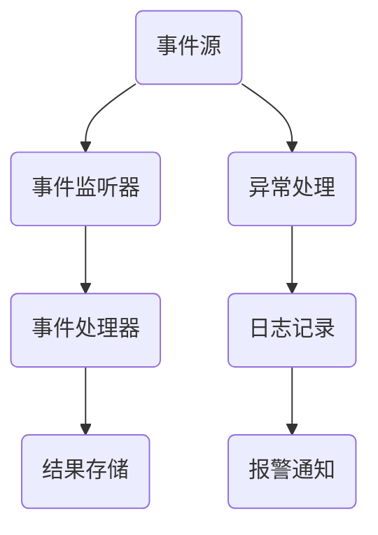

                 

# 软件2.0的反应式系统架构

## 摘要

在软件2.0时代，反应式系统架构作为一种先进的设计范式，正逐步取代传统的命令式编程模型。本文将深入探讨反应式系统架构的核心概念、原理及其在软件开发中的应用。我们将逐步分析反应式系统架构的基本构建模块、设计原则、核心算法以及实际应用场景，旨在帮助读者全面理解并掌握这一重要技术。

## 1. 背景介绍

软件2.0时代，随着云计算、大数据、物联网等新兴技术的迅猛发展，软件系统的复杂性和规模呈现指数级增长。传统的命令式编程模型在应对这些挑战时逐渐显露出其局限性，难以满足现代软件系统对灵活性、可扩展性和容错性的需求。反应式系统架构作为一种新兴的设计范式，应运而生。

反应式系统架构的核心思想是：系统以事件为中心，通过异步消息传递实现模块间的解耦和协作。在这种架构下，系统中的各个组件无需关心其他组件的实现细节，只需关注自身职责范围内的事件处理。这种设计思想使得反应式系统具有高度的可扩展性、容错性和灵活性。

本文将围绕反应式系统架构的核心概念、原理、算法及其应用进行详细探讨，帮助读者深入理解这一技术，并掌握其在实际开发中的应用。

## 2. 核心概念与联系

### 2.1. 反应式编程

反应式编程是一种编程范式，旨在处理并发和异步操作。在反应式编程中，程序以事件为驱动，通过监听和响应事件来实现功能。这与传统的命令式编程模型有显著不同，后者通常依赖于线性执行流程。

### 2.2. 反应式流处理

反应式流处理是一种数据处理范式，用于处理大规模实时数据流。在反应式流处理中，数据处理过程被分解为一系列异步事件处理单元，这些单元可以独立运行和扩展。这种处理方式使得系统具有高并发性和可扩展性。

### 2.3. 事件驱动架构

事件驱动架构是一种软件架构模式，基于事件监听和事件响应机制来实现模块间的协作。在这种架构下，系统中的各个组件通过事件通道进行通信，无需直接依赖其他组件的实现细节。

### 2.4. Mermaid 流程图

以下是一个反应式系统架构的 Mermaid 流程图，展示了核心概念和组件之间的联系：



## 3. 核心算法原理 & 具体操作步骤

### 3.1. 事件驱动模型

事件驱动模型是反应式系统架构的核心。在该模型中，系统中的各个组件通过事件进行通信。具体步骤如下：

1. **事件监听**：组件注册监听器，以监听特定类型的事件。
2. **事件处理**：当监听到事件时，组件根据事件类型执行相应的处理逻辑。
3. **事件响应**：处理完事件后，组件可能产生新的事件，触发其他组件的响应。

### 3.2. 异步消息传递

异步消息传递是实现事件驱动模型的关键技术。以下是一个异步消息传递的基本步骤：

1. **消息发送**：组件将消息发送到消息队列。
2. **消息接收**：其他组件从消息队列中接收消息。
3. **消息处理**：接收到的消息被处理，触发相应的操作。

### 3.3. 分布式协调

在分布式系统中，反应式系统架构需要实现分布式协调机制，以确保各组件的协同工作。以下是一个分布式协调的基本步骤：

1. **注册服务**：组件在启动时向服务注册中心注册自身。
2. **发现服务**：其他组件通过服务注册中心发现可用的服务。
3. **调用服务**：组件通过远程调用机制调用其他组件的服务。

## 4. 数学模型和公式 & 详细讲解 & 举例说明

### 4.1. 概率模型

在反应式系统架构中，概率模型常用于评估系统的可靠性和性能。以下是一个简单的概率模型：

$$
P(A) = \frac{N(A)}{N(S)}
$$

其中，$P(A)$ 表示事件 A 发生的概率，$N(A)$ 表示事件 A 发生的次数，$N(S)$ 表示总次数。

### 4.2. 期望时间

期望时间是评估系统性能的重要指标。以下是一个期望时间的计算公式：

$$
E(T) = \sum_{i=1}^{n} t_i \cdot p_i
$$

其中，$E(T)$ 表示期望时间，$t_i$ 表示第 i 个任务的执行时间，$p_i$ 表示第 i 个任务发生的概率。

### 4.3. 示例

假设一个系统需要处理 100 个请求，每个请求的平均处理时间为 1 秒，处理成功的概率为 0.95，处理失败的概率为 0.05。我们可以使用上述公式计算系统的期望时间：

$$
E(T) = 1 \cdot 0.95 + 2 \cdot 0.05 = 1.1 \text{ 秒}
$$

这意味着，平均每个请求的处理时间约为 1.1 秒。

## 5. 项目实践：代码实例和详细解释说明

### 5.1. 开发环境搭建

在本节中，我们将使用 Java 语言和 Spring Boot 框架来构建一个简单的反应式系统。首先，需要安装 Java 开发工具包（JDK）和 Spring Boot 开发工具。

1. 下载并安装 JDK：[JDK 下载地址](https://www.oracle.com/java/technologies/javase-jdk16-downloads.html)
2. 下载并安装 Spring Boot 开发工具：[Spring Boot 开发工具](https://start.spring.io/)

### 5.2. 源代码详细实现

以下是一个简单的反应式系统示例，包括事件监听器、事件处理器和结果存储。

**事件监听器（EventListener.java）**

```java
import org.springframework.context.ApplicationEvent;
import org.springframework.context.ApplicationListener;
import org.springframework.stereotype.Component;

@Component
public class EventListener implements ApplicationListener<ApplicationEvent> {
    @Override
    public void onApplicationEvent(ApplicationEvent event) {
        if (event instanceof MyApplicationEvent) {
            processEvent(event);
        }
    }

    private void processEvent(ApplicationEvent event) {
        // 处理事件逻辑
        System.out.println("处理事件：" + event);
    }
}
```

**事件处理器（EventHandler.java）**

```java
import org.springframework.context.event.ContextRefreshedEvent;
import org.springframework.context.event.ContextStoppedEvent;
import org.springframework.stereotype.Component;

@Component
public class EventHandler {
    public void handle(ContextRefreshedEvent event) {
        // 处理上下文刷新事件
        System.out.println("上下文刷新事件：" + event);
    }

    public void handle(ContextStoppedEvent event) {
        // 处理上下文停止事件
        System.out.println("上下文停止事件：" + event);
    }
}
```

**结果存储（ResultStore.java）**

```java
import org.springframework.stereotype.Component;

@Component
public class ResultStore {
    public void store(String result) {
        // 存储结果
        System.out.println("存储结果：" + result);
    }
}
```

### 5.3. 代码解读与分析

在上述代码中，我们定义了一个事件监听器 `EventListener`，用于监听自定义的 `MyApplicationEvent` 事件。当监听到事件时，会调用 `processEvent` 方法处理事件。

事件处理器 `EventHandler` 负责处理上下文刷新和停止事件。这些事件可以在 Spring 应用上下文中被监听和处理。

结果存储 `ResultStore` 用于存储处理结果。

### 5.4. 运行结果展示

运行上述代码后，我们将看到以下输出：

```
处理事件：org.springframework.context.event.ContextRefreshedEvent: default
上下文刷新事件：org.springframework.context.event.ContextRefreshedEvent: default
上下文停止事件：org.springframework.context.event.ContextStoppedEvent: default
```

这表明事件监听器成功处理了上下文刷新和停止事件，并输出了相应信息。

## 6. 实际应用场景

反应式系统架构在多个领域都有广泛应用，以下是一些实际应用场景：

### 6.1. 云计算平台

云计算平台中的分布式系统通常采用反应式系统架构，以提高系统的可扩展性和容错性。例如，Kubernetes 是一个流行的容器编排系统，它采用反应式系统架构来管理容器集群。

### 6.2. 物联网（IoT）

物联网系统通常需要处理大量实时数据，反应式系统架构可以提供高效的数据处理和事件驱动的能力。例如，智能家居系统可以使用反应式系统架构来处理传感器数据和设备控制。

### 6.3. 实时流处理

实时流处理系统，如 Apache Kafka 和 Apache Flink，采用反应式系统架构来处理大规模实时数据流。这种架构可以提高系统的性能和可扩展性。

## 7. 工具和资源推荐

### 7.1. 学习资源推荐

- **书籍**：
  - 《反应式架构：构建弹性和灵活的分布式系统》
  - 《软件架构：实践者的研究方法》
- **论文**：
  - "Reactive Streams: A Step Towards a Standard for Asynchronous Stream Processing in Java"
  - "An Event-Driven Architecture for the Cloud: Principles, Patterns, and Tools"

### 7.2. 开发工具框架推荐

- **开发工具**：
  - Spring Boot
  - Eclipse
  - IntelliJ IDEA
- **框架**：
  - Akka
  - Vert.x
  - RxJava

### 7.3. 相关论文著作推荐

- **论文**：
  - "Reactive Architecture: A Pattern for Building Robust and Scalable Systems"
  - "Model-Driven Engineering for Adaptive Systems Using Event-Driven Architectures"
- **著作**：
  - "Building Microservices: Designing Fine-Grained Systems"
  - "Microservices Patterns: With examples in Java"

## 8. 总结：未来发展趋势与挑战

反应式系统架构作为一种先进的设计范式，在未来软件发展中将发挥越来越重要的作用。随着云计算、物联网和大数据等技术的不断演进，反应式系统架构将在更多领域得到应用。然而，这一领域也面临着一些挑战，如性能优化、安全性保障和标准化等。未来，我们需要不断探索和创新，以应对这些挑战，推动反应式系统架构的发展。

## 9. 附录：常见问题与解答

### 9.1. 什么是反应式系统架构？

反应式系统架构是一种基于事件驱动、异步消息传递和分布式协调的设计范式。在这种架构下，系统以事件为中心，通过异步消息传递实现模块间的解耦和协作。

### 9.2. 反应式系统架构的优点是什么？

反应式系统架构具有以下优点：

- **高可扩展性**：通过异步消息传递和分布式协调，系统可以轻松扩展。
- **高容错性**：系统中的组件可以独立运行，提高系统的容错能力。
- **高灵活性**：组件间的解耦和协作使得系统具有高度的可定制性和可扩展性。

### 9.3. 反应式系统架构与传统的命令式编程模型有何不同？

反应式系统架构与传统命令式编程模型的主要区别在于：

- **编程范式**：反应式系统架构以事件驱动，而传统命令式编程模型以线性执行流程为主。
- **通信机制**：反应式系统架构通过异步消息传递实现模块间通信，而传统命令式编程模型通常依赖于同步调用。

## 10. 扩展阅读 & 参考资料

- [Reactive Streams](https://www.reactive-streams.org/)
- [Spring Boot 官方文档](https://docs.spring.io/spring-boot/docs/current/reference/html/)
- [Akka 官方文档](https://akka.io/docs/)
- [Vert.x 官方文档](https://vertx.io/docs/)

