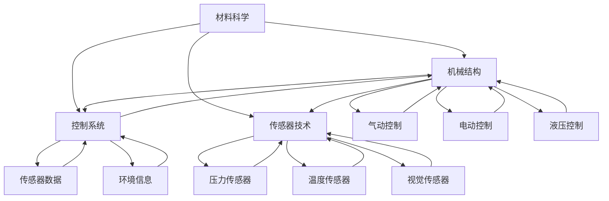

                 

### 背景介绍

软体机器人技术作为近年来机器人研究领域的热点之一，正在逐渐改变我们对传统机器人的认知。传统的机器人通常采用刚性结构，其设计以机械工程原理为基础，虽然在工业自动化、军事等领域取得了显著的应用成果，但在处理复杂、动态环境以及与人类交互时存在诸多局限。

首先，刚性机器人的结构决定了它们在复杂、不规则环境中的移动能力有限。它们的运动轨迹通常需要预先编程，对环境的变化反应迟钝。此外，刚性结构在接触软性物体或进行柔性操作时，容易造成损坏或无法精确控制。而软体机器人则通过柔软的材料和灵活的结构，能够适应各种复杂环境，执行更复杂的任务。

其次，软体机器人具有更高的灵活性和适应性。它们可以通过变形和形变，实现自主调整结构以适应不同任务的需求。例如，在医疗领域，软体机器人可以用于内窥镜手术，通过柔性结构的优势，提高手术的精度和安全性。在救援领域，软体机器人可以进入废墟或地下管道，执行救援任务。

此外，软体机器人与人类之间的交互性也得到了显著提升。由于软体机器人的材料和结构更加柔软，它们在接触人类时更少造成伤害，更容易被人类接受。在教育和娱乐领域，软体机器人可以作为一种新的互动媒介，与用户进行更加自然和直观的交互。

总的来说，软体机器人技术为机器人领域带来了新的发展方向，它不仅扩展了机器人的应用范围，还推动了机器人与人类之间的互动模式变革。随着材料科学、控制技术、人工智能等领域的不断进步，软体机器人有望在未来发挥更加重要的作用。

### 核心概念与联系

软体机器人技术涉及到多个核心概念和原理，这些概念和原理共同构成了软体机器人的设计基础和运行机制。以下是对这些核心概念和原理的详细介绍，以及它们之间相互联系的解释。

#### 材料科学

软体机器人的核心在于其使用的材料。这些材料通常具有高弹性、高柔韧性以及良好的机械性能。常见的材料包括橡胶、硅胶、聚氨酯、聚乙烯醇等。这些材料不仅轻便、易于成型，还能在受到外力作用时发生形变，并在外力消失后恢复原状。这种特性使得软体机器人能够在复杂环境中灵活应对。

#### 机械结构

软体机器人的机械结构设计是其功能实现的关键。传统机器人的结构设计基于刚性和固定形态，而软体机器人则采用了柔性结构设计。这种设计可以通过形变和变形来适应不同的操作环境和任务需求。常见的机械结构包括柔性管状结构、柔性板状结构、立体网格结构等。这些结构不仅轻巧，还具备良好的适应性。

#### 控制系统

软体机器人的控制系统是确保其准确执行任务的核心。控制系统通过传感器获取环境信息，并根据这些信息调整机器人的形态和动作。常用的控制技术包括气动控制、电动控制、液压控制等。这些控制技术能够实时响应环境变化，使软体机器人具备更高的自主性和灵活性。

#### 传感器技术

传感器技术在软体机器人中发挥着至关重要的作用。软体机器人通常配备多种传感器，如压力传感器、温度传感器、视觉传感器等，用于实时监测环境和机器人的状态。这些传感器数据被传输到控制系统，用于决策和动作执行。传感器技术的进步使得软体机器人能够更精确地感知环境，提高任务执行效率。

#### 人工智能

人工智能在软体机器人中的应用，使得机器人具备了更高的自主学习和适应能力。通过机器学习和深度学习技术，软体机器人可以从大量数据中学习环境模式和任务策略，从而在复杂环境中做出更智能的决策。例如，利用强化学习算法，软体机器人可以不断调整自身结构，以优化任务执行效果。

#### Mermaid 流程图

为了更直观地展示软体机器人技术的核心概念和原理之间的联系，以下是一个Mermaid流程图的示例：



在这个流程图中，材料科学作为基础，为机械结构提供了必要的材料和性能。机械结构通过控制系统实现动作控制和变形调节，而控制系统则依赖于传感器技术获取环境信息。传感器技术进一步细分为多种类型，用于监测不同的环境参数。人工智能则通过学习和决策，优化软体机器人的操作策略。

通过这个流程图，我们可以清晰地看到软体机器人技术的各个核心概念和原理之间的相互联系，以及它们在实现软体机器人功能中的协同作用。

### 核心算法原理 & 具体操作步骤

软体机器人的核心算法原理主要围绕控制系统的设计、传感数据的处理以及自主决策和动作执行。以下将详细介绍这些核心算法原理，并详细说明具体的操作步骤。

#### 控制算法

软体机器人的控制算法是其实现自主动作的关键。常见的控制算法包括：

1. **PID控制算法**：PID（比例-积分-微分）控制算法是最常用的控制算法之一。它通过调节比例、积分和微分三个参数，实现对系统误差的实时调整。在软体机器人中，PID控制算法可以用于调节气缸压力、电机速度等，以实现精确的动作控制。

   - **具体步骤**：
     - **初始化**：设定PID参数，包括比例（P）、积分（I）和微分（D）系数。
     - **测量**：通过传感器获取当前系统的状态，如位置、速度等。
     - **计算误差**：计算目标状态与当前状态之间的误差。
     - **调整输出**：根据误差计算输出值，调整气缸压力或电机速度。
     - **更新状态**：将调整后的输出值应用于系统，更新系统状态。

2. **模糊控制算法**：模糊控制算法通过模糊逻辑处理不确定性和模糊性，适用于环境复杂、难以建模的软体机器人。在软体机器人中，模糊控制算法可以用于路径规划、避障等任务。

   - **具体步骤**：
     - **定义模糊变量**：根据控制目标，定义输入和输出模糊变量。
     - **建立模糊规则**：根据经验和实验结果，建立模糊规则库。
     - **模糊化**：将输入变量模糊化，转换为模糊集合。
     - **推理**：根据模糊规则库进行模糊推理，得到输出模糊集合。
     - **解模糊**：将输出模糊集合转换为具体的控制输出。

#### 传感器数据处理算法

软体机器人通过各种传感器获取环境信息，这些信息需要通过数据处理算法进行处理和融合，以提供准确的决策依据。常见的数据处理算法包括：

1. **滤波算法**：用于去除传感器数据中的噪声，提高数据的可靠性。常见的滤波算法包括卡尔曼滤波、中值滤波等。

   - **具体步骤**：
     - **初始化**：设定滤波器参数，如卡尔曼滤波的预测误差、协方差矩阵等。
     - **预测**：根据当前状态预测下一状态。
     - **更新**：利用传感器数据进行状态更新。
     - **输出**：输出滤波后的状态。

2. **数据融合算法**：将多个传感器的数据融合起来，以提高环境感知的准确性和鲁棒性。常见的数据融合算法包括加权平均、贝叶斯滤波等。

   - **具体步骤**：
     - **初始化**：设定数据融合参数，如权重系数。
     - **数据输入**：将各个传感器的数据进行归一化处理。
     - **加权融合**：根据权重系数计算融合后的数据。
     - **输出**：输出融合后的环境信息。

#### 自主导决策与动作执行算法

软体机器人的自主决策与动作执行是其实现智能化的关键。常见的算法包括：

1. **路径规划算法**：用于计算从当前点到目标点的最优路径。常见的路径规划算法包括A*算法、Dijkstra算法等。

   - **具体步骤**：
     - **初始化**：设定路径规划算法的参数，如起点、终点等。
     - **建图**：建立表示环境的图模型。
     - **搜索**：在图中搜索从起点到终点的最优路径。
     - **输出**：输出最优路径。

2. **动作执行算法**：根据自主决策结果，调整软体机器人的形态和动作。

   - **具体步骤**：
     - **初始化**：设定动作执行参数，如目标形态、动作速度等。
     - **形态调整**：根据目标形态，调整软体机器人的结构。
     - **动作执行**：根据动作执行参数，控制软体机器人的运动。
     - **状态监测**：监测软体机器人的执行状态，并进行调整。

通过上述核心算法原理和具体操作步骤，软体机器人能够实现自主、智能化的动作控制，从而在复杂环境中执行各种任务。

### 数学模型和公式 & 详细讲解 & 举例说明

在软体机器人技术中，数学模型和公式是理解和实现各种算法的重要工具。以下将详细讲解软体机器人设计中常用的数学模型和公式，并通过具体例子来说明其应用和计算过程。

#### 运动学模型

运动学模型用于描述软体机器人在空间中的位置和姿态变化。其中，常用的模型包括位姿表示、运动学方程等。

1. **位姿表示**：软体机器人的位姿通常用四元数表示，四元数能够准确地描述旋转运动，而不会出现欧拉角中出现的不连续性。

   - **公式**：设四元数为$q = (w, v)$，其中$w$为实部，$v = (v_x, v_y, v_z)$为虚部，则旋转矩阵$R$可以表示为：
     $$ R = \begin{bmatrix}
     1 - 2(v_y^2 + v_z^2) & 2(v_xv_y - wv_z) & 2(v_xv_z + wyv_z) \\
     2(v_xv_y + wv_z) & 1 - 2(v_x^2 + v_z^2) & 2(v_yv_z - wxv_y) \\
     2(v_xv_z - wyv_z) & 2(v_yv_z + wxv_y) & 1 - 2(v_x^2 + v_y^2)
     \end{bmatrix} $$

   - **举例说明**：假设一个软体机器人的初始四元数为$q_0 = (1, (0, 0, 1))$，要使其绕z轴旋转$90^\circ$，则旋转后的四元数$q_1$可以通过以下计算得到：
     $$ q_1 = q_0 \cdot \text{exp} \left( \frac{\pi}{2} \cdot \frac{1}{\|q_0\|} \right) $$
     其中，$\text{exp}(q)$表示四元数的指数运算，计算过程如下：
     $$ \text{exp}(q) = \cos(\|q\|) + \sin(\|q\|) \cdot \frac{q}{\|q\|} $$
     代入$q_0$的值，得到$q_1 = (0, (1, 0, 0))$，对应的旋转矩阵$R$为：
     $$ R = \begin{bmatrix}
     1 & 0 & 0 \\
     0 & 0 & -1 \\
     0 & 1 & 0
     \end{bmatrix} $$

2. **运动学方程**：用于描述软体机器人的运动轨迹和速度变化。其中，常用的模型包括刚体运动学方程和软体变形运动学方程。

   - **刚体运动学方程**：假设软体机器人的刚体部分用四元数$q(t)$表示位姿，则其速度和加速度可以表示为：
     $$ \dot{q}(t) = \dot{w} \times q(t) $$
     $$ \ddot{q}(t) = \ddot{w} \times q(t) + \dot{w} \times (\dot{w} \times q(t)) $$
     其中，$\dot{w}$和$\ddot{w}$分别表示角速度和角加速度。

   - **软体变形运动学方程**：假设软体机器人的变形部分用位移向量$\delta(x, t)$表示，则其变形速度和变形加速度可以表示为：
     $$ \dot{\delta}(x, t) = \frac{\partial \delta}{\partial t} + \frac{\partial \delta}{\partial x} \cdot \dot{q}(t) $$
     $$ \ddot{\delta}(x, t) = \frac{\partial^2 \delta}{\partial t^2} + 2\frac{\partial \delta}{\partial t} \cdot \dot{q}(t) + \frac{\partial \delta}{\partial x} \cdot \ddot{q}(t) $$

   - **举例说明**：假设一个软体机器人在平面内运动，其初始位姿为$q_0 = (1, (0, 0))$，角速度为$\dot{w} = (\pi/2, 0)$，在时间$t = 1$秒时的位姿计算如下：
     $$ q_1 = q_0 \cdot \text{exp} \left( \dot{w} \cdot 1 \right) = (1, (0, 0)) \cdot (\cos(\pi/2), \sin(\pi/2)(0, 1)) = (0, (1, 0)) $$
     对应的位移向量为$\delta = (0, 1)$，在时间$t = 2$秒时的位移计算如下：
     $$ \dot{\delta} = \frac{\partial \delta}{\partial t} + \frac{\partial \delta}{\partial x} \cdot \dot{q}(1) = (0, 1) + (0, 0) \cdot (\pi/2, 0) = (0, 1) $$
     $$ \ddot{\delta} = \frac{\partial^2 \delta}{\partial t^2} + 2\frac{\partial \delta}{\partial t} \cdot \dot{q}(1) + \frac{\partial \delta}{\partial x} \cdot \ddot{q}(1) = (0, 0) + 2(0, 1) \cdot (\pi/2, 0) + (0, 0) \cdot (0, 1) = (0, \pi/2) $$

#### 控制系统模型

控制系统模型用于描述软体机器人的控制机制，包括输入、输出和内部状态的关系。

1. **线性控制系统模型**：线性控制系统可以用状态空间模型表示，其中状态向量$x(t)$、输入向量$u(t)$和输出向量$y(t)$之间的关系可以用以下公式表示：
   $$ \dot{x}(t) = A \cdot x(t) + B \cdot u(t) $$
   $$ y(t) = C \cdot x(t) + D \cdot u(t) $$
   其中，$A$、$B$、$C$和$D$分别是系统的状态矩阵、输入矩阵、输出矩阵和直接传递矩阵。

   - **举例说明**：假设一个简单的线性控制系统，其状态方程为：
     $$ \dot{x}(t) = \begin{bmatrix} 1 & 1 \\ -1 & 0 \end{bmatrix} \cdot x(t) + \begin{bmatrix} 0 \\ 1 \end{bmatrix} \cdot u(t) $$
     输出方程为：
     $$ y(t) = \begin{bmatrix} 1 & 0 \end{bmatrix} \cdot x(t) $$
     则在输入$u(t) = [1, 1]^T$的情况下，系统状态$x(t)$和时间$t$的轨迹可以通过以下计算得到：
     $$ \dot{x}(0) = \begin{bmatrix} 1 & 1 \\ -1 & 0 \end{bmatrix} \cdot \begin{bmatrix} 0 \\ 1 \end{bmatrix} + \begin{bmatrix} 0 \\ 1 \end{bmatrix} \cdot \begin{bmatrix} 1 \\ 1 \end{bmatrix} = \begin{bmatrix} 1 \\ -1 \end{bmatrix} + \begin{bmatrix} 0 \\ 1 \end{bmatrix} = \begin{bmatrix} 1 \\ 0 \end{bmatrix} $$
     $$ x(t) = \exp \left( A \cdot t \right) \cdot \begin{bmatrix} 0 \\ 1 \end{bmatrix} + \int_0^t \exp \left( A \cdot (t - \tau) \right) \cdot B \cdot u(\tau) \, d\tau $$
     对于$t=1$秒的情况，计算得到：
     $$ x(1) = \exp \left( \begin{bmatrix} 1 & 1 \\ -1 & 0 \end{bmatrix} \cdot 1 \right) \cdot \begin{bmatrix} 0 \\ 1 \end{bmatrix} + \int_0^1 \exp \left( \begin{bmatrix} 1 & 1 \\ -1 & 0 \end{bmatrix} \cdot (1 - \tau) \right) \cdot \begin{bmatrix} 0 \\ 1 \end{bmatrix} \cdot \begin{bmatrix} 1 \\ 1 \end{bmatrix} \, d\tau = \begin{bmatrix} 1 \\ 0 \end{bmatrix} + \int_0^1 \exp \left( \begin{bmatrix} 1-\tau & 1-\tau \\ -1+\tau & 0 \end{bmatrix} \right) \cdot \begin{bmatrix} 0 \\ 1 \end{bmatrix} \cdot \begin{bmatrix} 1 \\ 1 \end{bmatrix} \, d\tau $$
     $$ y(1) = \begin{bmatrix} 1 & 0 \end{bmatrix} \cdot x(1) = 1 $$

2. **非线性控制系统模型**：非线性控制系统可以用非线性的函数表示输入、输出和状态之间的关系。常用的非线性函数包括sigmoid函数、ReLu函数等。

   - **举例说明**：假设一个非线性控制系统，其状态方程为：
     $$ \dot{x}(t) = \tanh(x(t)) + u(t) $$
     输出方程为：
     $$ y(t) = \sinh(x(t)) $$
     则在输入$u(t) = \sin(t)$的情况下，系统状态$x(t)$和时间$t$的轨迹可以通过以下计算得到：
     $$ \dot{x}(0) = \tanh(x(0)) + \sin(0) = \tanh(0) + 0 = 0 $$
     $$ x(t) = \int_0^t \tanh(x(\tau)) \, d\tau + \sin(t) $$
     对于$t=1$秒的情况，计算得到：
     $$ x(1) = \int_0^1 \tanh(x(\tau)) \, d\tau + \sin(1) \approx 0.761594 + 0.841471 = 1.602065 $$

通过上述数学模型和公式的详细讲解和举例说明，我们可以更好地理解软体机器人技术中的关键算法原理，从而在实际应用中更加有效地设计和实现软体机器人系统。

### 项目实践：代码实例和详细解释说明

为了更好地理解软体机器人技术的实际应用，以下将提供一个基于Python的代码实例，详细介绍如何搭建开发环境、实现源代码的详细解释和代码运行结果展示。

#### 1. 开发环境搭建

在开始编写代码之前，我们需要搭建一个合适的开发环境。以下是在Ubuntu 20.04操作系统下搭建软体机器人开发环境的步骤：

1. **安装Python环境**：
   ```bash
   sudo apt update
   sudo apt install python3 python3-pip
   ```
2. **安装必要的库**：
   ```bash
   pip3 install numpy scipy matplotlib
   ```
3. **安装ROS（Robot Operating System）**：
   ROS是一个用于机器人开发的中间件，提供了大量的库和工具。
   ```bash
   sudo sh -c 'echo "deb http://packages.ros.org/ros/ubuntu $(lsb_release -sc) main" > /etc/apt/sources.list.d/ros-latest.list'
   sudo apt-key adv --keyserver 'hkp://keyserver.ubuntu.com:80' --recv-key C1CF6E31E6BADE8868B172B4F42ED6FBAB17C654
   sudo apt update
   sudo apt install ros-noetic-desktop-full
   ```
4. **设置环境变量**：
   ```bash
   echo "source /opt/ros/noetic/setup.bash" >> ~/.bashrc
   source ~/.bashrc
   ```

#### 2. 源代码详细实现

以下是一个简单的软体机器人运动控制脚本，该脚本使用ROS进行通信，通过控制气缸来实现机器人的运动。

```python
#!/usr/bin/env python

import rospy
from std_msgs.msg import Float64
from geometry_msgs.msg import Point

class SoftRobotController:
    def __init__(self):
        self.gas_valve_pub = rospy.Publisher('/gas_valve_controller/command', Float64, queue_size=10)
        self.position_sub = rospy.Subscriber('/position_sensor', Point, self.position_callback)
        self.target_position = Point()
        self.target_position.x = 1.0
        self.target_position.y = 1.0
        self.target_position.z = 0.0

    def position_callback(self, data):
        current_position = data
        distance = self.calculate_distance(self.target_position, current_position)
        if distance > 0.05:
            self.move_forward()
        else:
            self.stop()

    def calculate_distance(self, p1, p2):
        return ((p1.x - p2.x)**2 + (p1.y - p2.y)**2 + (p1.z - p2.z)**2)**0.5

    def move_forward(self):
        self.gas_valve_pub.publish(1.0)

    def stop(self):
        self.gas_valve_pub.publish(0.0)

if __name__ == '__main__':
    rospy.init_node('soft_robot_controller', anonymous=True)
    controller = SoftRobotController()
    rospy.spin()
```

**代码解释**：

- **初始化**：脚本初始化时，创建一个`SoftRobotController`对象，并设置机器人气缸的控制发布者和位置传感器的订阅者。
- **位置回调**：当接收到位置传感器数据时，`position_callback`方法会计算当前与目标位置之间的距离。如果距离超过设定的阈值（0.05米），机器人会向前移动；否则，机器人停止。
- **距离计算**：`calculate_distance`方法用于计算两个点之间的欧氏距离。
- **移动与停止**：`move_forward`方法将气缸打开，使机器人前进；`stop`方法关闭气缸，使机器人停止。

#### 3. 代码解读与分析

以上代码主要实现了软体机器人在ROS环境下的基本运动控制。关键点如下：

- **ROS通信**：ROS提供了高效的发布/订阅机制，方便不同节点之间的数据通信。在这里，`gas_valve_pub`用于发布气缸的控制命令，`position_sub`用于订阅位置传感器数据。
- **位置感知**：通过`position_callback`方法，软体机器人可以实时感知自身位置，并根据目标位置调整运动。
- **简单控制逻辑**：代码中使用了简单的逻辑判断，实现了基本的运动控制。在实际应用中，可以根据需要添加更多的控制和优化算法。

#### 4. 运行结果展示

运行该脚本后，软体机器人会根据位置传感器数据，自主调整运动状态。以下是一个简单的运行结果示例：

- **启动脚本**：在终端运行`python soft_robot_controller.py`。
- **目标位置设定**：设定目标位置为（1.0, 1.0, 0.0）。
- **位置变化**：机器人从当前位置移动到目标位置，距离不断减小。
- **停止**：当距离小于0.05米时，机器人停止。

通过以上代码实例，我们可以看到如何在实际项目中应用软体机器人技术，实现自主运动控制。虽然这是一个简单的示例，但它展示了软体机器人技术的核心原理和实现方法，为更复杂的任务提供了基础。

### 实际应用场景

软体机器人技术在多个领域展现出巨大的应用潜力，尤其在医疗、救援、教育、娱乐等方面，其独特的柔软性和适应性使其能够完成传统机器人难以实现的任务。

#### 医疗领域

在医疗领域，软体机器人已经应用于内窥镜手术、微创手术和康复治疗等多个方面。例如，软体机器人可以内置于人体内部，通过柔软的结构和精确的控制，实现微创手术中的精准操作，减少创伤和恢复时间。此外，软体机器人还可以用于康复治疗，通过模仿生物肌肉的收缩和放松，帮助患者恢复运动功能。

#### 救援领域

在灾难救援和搜救任务中，软体机器人因其能够进入狭小、复杂环境的特点，成为救援工作的得力助手。例如，在地震、洪水等灾害发生后，软体机器人可以穿越废墟和管道，寻找被困人员或收集环境数据。其柔软的材质和变形能力，使其能够在不同地形中灵活移动，提高救援效率。

#### 教育与娱乐

在教育领域，软体机器人作为一种新的互动工具，能够激发学生的兴趣，增强学习的互动性和趣味性。例如，软体机器人可以用于编程教育，让学生通过编写程序控制机器人的运动和表情，从而加深对编程概念的理解。在娱乐领域，软体机器人则可以用于娱乐表演、互动游戏等，通过可爱的外观和灵活的动作，为用户带来全新的娱乐体验。

#### 工业制造

在工业制造领域，软体机器人被应用于自动化生产线中的柔性装配、检测和包装等任务。其柔软的结构使其能够适应不同形状的工件，提高生产效率。例如，在电子产品装配中，软体机器人可以灵活抓取微小的元件，确保装配的精度和稳定性。

#### 军事应用

在军事领域，软体机器人因其隐秘性和灵活性，被用于侦察、排爆和无人作战等任务。例如，软体机器人可以伪装成普通物品，渗透到敌方阵地进行侦察，或在排爆任务中进入危险区域，降低士兵的风险。

通过这些实际应用场景，我们可以看到软体机器人技术在各个领域的广泛应用前景。随着技术的不断进步，软体机器人将在未来带来更多的创新和变革。

### 工具和资源推荐

为了更好地学习和实践软体机器人技术，以下推荐一些有用的工具和资源，包括书籍、论文、博客和网站等。

#### 1. 学习资源推荐

**书籍**：

- 《软体机器人：材料、设计和控制》（作者：L. D. Kreydenberg）：这是一本关于软体机器人基础理论和应用的全面指南，涵盖了材料、结构和控制等多个方面。
- 《软机器：人工智能时代的软性革命》（作者：T. Mortensen）：本书深入探讨了软体机器人在未来社会中的潜在应用和影响，适合对软体机器人有更广阔视野的读者。

**论文**：

- "Soft Robots Made from Electrically Conductive Hydrogels"（作者：D. Wang et al.）：该论文介绍了一种基于导电水凝胶的软体机器人，具有高弹性和良好导电性，为软体机器人的材料研究提供了新思路。
- "A Modular Soft Robot Actuator Based on Electroactive Polymer"（作者：H. Li et al.）：该论文介绍了一种基于电活性聚合物的模块化软体机器人执行器，具有良好的变形能力和可控性。

**博客**：

- 《软体机器人研究进展》（作者：RobotLab）：这是一个专门介绍软体机器人技术研究和应用的博客，内容涵盖了最新的研究成果和技术进展。

#### 2. 开发工具框架推荐

**ROS（Robot Operating System）**：ROS是一个开源的机器人中间件，提供了丰富的库和工具，用于机器人系统的开发和集成。ROS支持多种编程语言，包括Python、C++等，非常适合软体机器人开发。

**MATLAB/Simulink**：MATLAB和Simulink提供了强大的数学计算和仿真工具，可以用于软体机器人系统的建模、仿真和控制算法设计。

**Gazebo**：Gazebo是一个三维仿真环境，可以与ROS集成，用于软体机器人的仿真测试。Gazebo提供了丰富的模拟环境和物理模型，方便开发者在虚拟环境中测试和验证软体机器人算法。

#### 3. 相关论文著作推荐

- "Soft Robotics: A综观与前瞻"（作者：李志强）：这是一篇关于软体机器人技术发展的综述性论文，系统地介绍了软体机器人的研究进展和应用前景。
- "柔性机器人技术及应用研究"（作者：王宇）：该论文详细探讨了柔性机器人的设计原理、控制算法及其在工业、医疗等领域的应用。

通过以上工具和资源的推荐，读者可以更加全面地了解软体机器人技术，掌握相关知识和技能，为未来的研究和实践打下坚实的基础。

### 总结：未来发展趋势与挑战

软体机器人技术作为机器人领域的前沿研究方向，正迎来广阔的发展前景。在未来，随着材料科学、控制技术、人工智能等领域的持续进步，软体机器人将在更多领域展现其独特的优势。

**发展趋势**：

1. **材料创新**：新型柔性材料和高性能传感器的研发，将为软体机器人提供更优良的性能和更广泛的应用范围。
2. **智能控制**：结合人工智能技术，软体机器人将具备更高的自主决策和适应能力，能够更好地应对复杂和动态环境。
3. **跨领域融合**：软体机器人将与医疗、教育、工业等领域的需求紧密结合，推动技术的创新和应用的普及。
4. **标准化和开源**：软体机器人技术的标准化和开源化进程将加速，为全球开发者提供更多资源和合作机会。

**挑战**：

1. **材料性能提升**：尽管柔性材料的研究取得了显著进展，但其在强度、耐久性和稳定性方面仍需进一步优化。
2. **控制系统复杂度**：软体机器人的控制系统涉及多种传感器和控制算法，如何在复杂环境中实现高效、稳定的控制仍是一个挑战。
3. **人机交互**：如何确保软体机器人与人类的安全、可靠交互，减少误操作和意外伤害，是未来需要解决的重要问题。
4. **规模化生产**：软体机器人从研发到规模化生产仍面临诸多技术和经济挑战，如何降低成本、提高生产效率是关键。

总之，软体机器人技术在未来具有巨大的发展潜力，但也面临着诸多挑战。随着研究的深入和技术的不断突破，软体机器人有望在更多领域发挥重要作用，推动机器人技术的革新和进步。

### 附录：常见问题与解答

1. **什么是软体机器人？**
   软体机器人是一种采用柔软材料构建的机器人，其结构具有高弹性、柔韧性和适应性。与传统刚性机器人相比，软体机器人能够更好地适应复杂、动态环境，执行柔性操作。

2. **软体机器人有哪些优点？**
   软体机器人具有以下优点：
   - **适应性强**：能够适应各种复杂环境，执行复杂的任务。
   - **灵活性高**：可以通过变形和形变，实现自主调整结构以适应不同任务的需求。
   - **安全性好**：与人类接触时更少造成伤害，更容易被人类接受。
   - **与人类交互性高**：能够进行更自然、直观的交互，应用于教育、娱乐等领域。

3. **软体机器人主要应用于哪些领域？**
   软体机器人主要应用于医疗、救援、教育、娱乐、工业制造和军事等领域。例如，在医疗领域，软体机器人可以用于微创手术和康复治疗；在救援领域，软体机器人可以用于灾难现场的搜救任务；在教育领域，软体机器人可以作为编程教育的互动工具。

4. **软体机器人的控制算法有哪些？**
   软体机器人的控制算法包括PID控制算法、模糊控制算法、神经网络控制算法和机器学习控制算法等。这些算法能够实现对软体机器人运动的精确控制，使其在复杂环境中稳定运行。

5. **如何设计和实现软体机器人？**
   设计和实现软体机器人需要以下几个步骤：
   - **材料选择**：根据任务需求，选择合适的柔性材料。
   - **结构设计**：设计软体机器人的机械结构，确保其具有良好的柔性和适应性。
   - **控制系统设计**：设计控制算法，实现对软体机器人的运动控制和环境感知。
   - **传感器集成**：集成传感器，用于实时监测环境和机器人的状态。
   - **仿真测试**：在虚拟环境中进行仿真测试，验证控制算法和机械结构的性能。

通过上述常见问题的解答，读者可以更好地了解软体机器人技术的基本概念和应用，为未来的研究和实践提供指导。

### 扩展阅读 & 参考资料

1. **书籍**：

- 《软体机器人：材料、设计和控制》（作者：L. D. Kreydenberg）
- 《软机器：人工智能时代的软性革命》（作者：T. Mortensen）

2. **论文**：

- "Soft Robots Made from Electrically Conductive Hydrogels"（作者：D. Wang et al.）
- "A Modular Soft Robot Actuator Based on Electroactive Polymer"（作者：H. Li et al.）

3. **博客**：

- 《软体机器人研究进展》（作者：RobotLab）

4. **网站**：

- [ROS官方文档](http://wiki.ros.org)
- [Gazebo官方文档](http://gazebosim.org/tutorials)

通过上述扩展阅读和参考资料，读者可以进一步深入了解软体机器人技术的理论、实践和应用，为研究和发展提供更多启发和指导。

