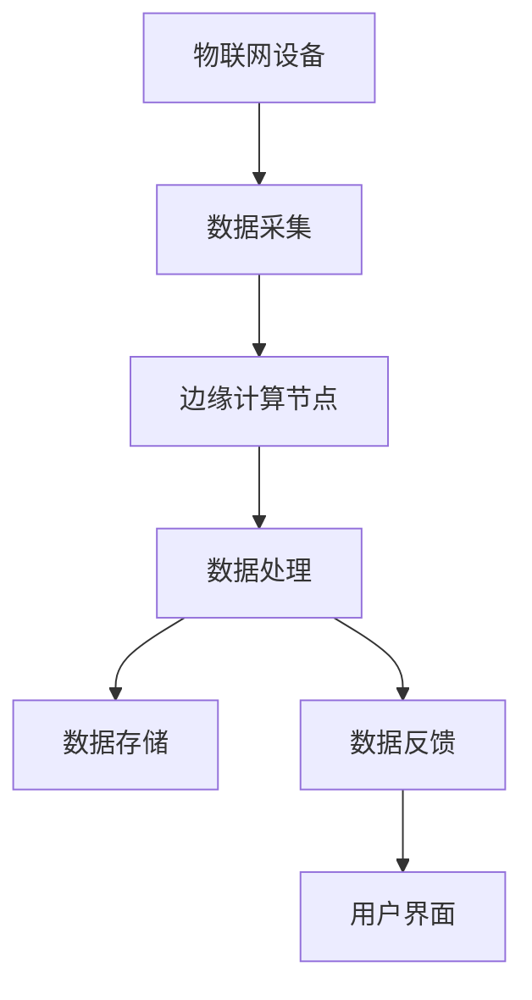

                 

### 1. 背景介绍

随着物联网（IoT）技术的迅猛发展，边缘计算作为其核心技术之一，已经成为推动数字化转型的关键力量。边缘计算IoT平台是一个集成多种技术组件、能够实现海量设备接入、数据处理和实时响应的综合性系统。它通过将计算、存储和网络资源分布到网络的边缘节点，降低了数据传输延迟，提高了系统的响应速度和可靠性。

#### 物联网的发展历程

物联网的概念最早可以追溯到20世纪80年代，然而，直到近年来，随着无线通信、传感器技术、云计算和大数据等技术的不断进步，物联网才开始进入实际应用阶段。初期，物联网主要以连接消费电子产品和家庭设备为主，如智能家电、智能家居等。随着传感器技术的进步，物联网逐渐向工业、医疗、交通等领域扩展，实现设备间的互联互通。

#### 边缘计算的兴起

边缘计算最早的概念可以追溯到20世纪90年代，其主要思想是将计算任务从云端转移到网络的边缘节点，从而减轻云端的负担。随着5G技术的普及，边缘计算的重要性日益凸显。5G网络的高速率和低延迟为边缘计算提供了坚实的基础，使得海量设备的实时数据处理成为可能。

#### 边缘计算与物联网的深度融合

边缘计算与物联网的深度融合，使得物联网系统的性能得到了显著提升。一方面，边缘计算能够实时处理海量数据，减少数据传输的延迟，提高系统的响应速度；另一方面，边缘计算通过将部分计算任务在边缘节点完成，降低了数据传输的带宽消耗，提高了系统的可靠性。这种深度融合不仅使得物联网系统更加高效，也为各类应用场景的创新提供了可能性。

#### 本文结构

本文将从以下几个方面对边缘计算IoT平台进行深入探讨：

1. **核心概念与联系**：介绍边缘计算的关键概念及其在物联网中的应用，并通过Mermaid流程图展示其架构。
2. **核心算法原理与操作步骤**：分析边缘计算中的核心算法原理，并详细描述具体操作步骤。
3. **数学模型与公式**：阐述边缘计算中的数学模型和公式，并进行举例说明。
4. **项目实践**：通过代码实例展示边缘计算在实际项目中的应用。
5. **实际应用场景**：探讨边缘计算在物联网中的各种应用场景。
6. **工具和资源推荐**：推荐相关学习资源和开发工具。
7. **总结与未来发展趋势**：总结边缘计算IoT平台的发展现状，探讨未来发展趋势和挑战。
8. **常见问题与解答**：回答读者可能关心的问题。
9. **扩展阅读与参考资料**：提供进一步学习的参考资料。

接下来，我们将逐步深入探讨这些内容，帮助读者全面了解边缘计算IoT平台的技术原理和应用前景。

### 2. 核心概念与联系

#### 边缘计算的定义

边缘计算（Edge Computing）是指将数据处理、存储和分析等任务从传统的中心化云计算环境转移到网络的边缘节点。这些边缘节点通常位于靠近数据源的地方，如工厂、数据中心、家庭等。边缘计算通过在靠近数据生成的地方处理数据，能够显著降低数据传输延迟，提高系统的响应速度和可靠性。

#### 物联网的定义

物联网（Internet of Things，IoT）是指通过传感器、设备和网络连接，实现物体与物体之间、物体与人之间的信息交换和通信的系统。物联网的核心目标是实现智能互联，通过收集、传输和处理数据，为人类提供更加便捷、智能的生活和工作环境。

#### 边缘计算与物联网的关联

边缘计算与物联网有着密不可分的关系。物联网通过大量传感器和设备收集数据，而边缘计算则在这些数据生成的边缘节点上对这些数据进行分析和处理。这种结合不仅能够提高数据处理的效率，还能够降低数据传输的延迟，提高系统的实时性和可靠性。

#### Mermaid流程图展示

为了更直观地展示边缘计算在物联网中的应用，我们使用Mermaid流程图来描述其核心架构。



在这个流程图中：

- **A[物联网设备]**：代表物联网中的各种设备，如传感器、摄像头、工业机器人等。
- **B[数据采集]**：物联网设备收集数据并将其发送到边缘节点。
- **C[边缘计算节点]**：边缘节点对收集到的数据进行初步处理和分析。
- **D[数据处理]**：数据处理包括数据的清洗、过滤、聚合等操作。
- **E[数据存储]**：处理后的数据存储在边缘节点的数据库中，以供后续分析使用。
- **F[数据反馈]**：处理结果反馈给物联网设备，实现实时控制和反馈。
- **G[用户界面]**：用户通过用户界面查看和处理数据。

通过这个流程图，我们可以看到边缘计算在物联网中的应用是如何实现的。边缘节点不仅能够对数据进行实时处理，还能够将处理结果快速反馈给用户，从而提高系统的响应速度和用户体验。

#### 核心概念的联系

边缘计算与物联网的结合，不仅提高了系统的效率，还带来了以下几方面的好处：

1. **降低延迟**：数据在边缘节点上处理，减少了数据传输到云端的时间，从而降低了系统的延迟。
2. **提高可靠性**：边缘节点分布在不同地方，能够提高系统的容错性和可靠性。
3. **节省带宽**：部分数据处理在边缘节点完成，减少了数据传输到云端的量，节省了网络带宽。
4. **增强安全性**：在边缘节点上进行数据处理，可以减少敏感数据的传输，提高系统的安全性。

综上所述，边缘计算与物联网的深度融合，不仅为物联网系统带来了技术上的创新，也为实际应用提供了更多的可能性。在接下来的部分中，我们将深入探讨边缘计算的核心算法原理和具体操作步骤。

### 3. 核心算法原理与具体操作步骤

边缘计算在物联网中的应用，离不开其核心算法的支撑。这些算法不仅决定了边缘节点的数据处理能力，还直接影响到系统的性能和效率。本节将详细介绍边缘计算中的核心算法原理，并给出具体操作步骤。

#### 数据采集与预处理

数据采集是边缘计算的第一步，也是至关重要的一步。边缘节点需要从物联网设备中收集各种类型的数据，如温度、湿度、压力、视频等。为了提高数据的质量和可用性，边缘节点通常需要对采集到的数据进行预处理。

预处理步骤包括：

1. **数据清洗**：去除数据中的噪声和异常值，保证数据的准确性。
2. **数据转换**：将不同格式和单位的数据转换为统一的格式，便于后续处理。
3. **数据聚合**：对数据进行汇总和统计，提取关键信息。

具体操作步骤如下：

1. **安装传感器和采集模块**：在边缘节点上安装各种传感器和采集模块，如温度传感器、湿度传感器、摄像头等。
2. **配置采集参数**：设置传感器的采样频率、数据格式等参数，确保采集的数据满足处理需求。
3. **数据采集**：边缘节点通过传感器和采集模块实时采集数据，并将数据存储在本地数据库中。

#### 数据处理与分析

在数据预处理完成后，边缘节点需要对数据进行处理和分析。数据处理和分析主要包括以下步骤：

1. **特征提取**：从原始数据中提取有用的特征，用于后续分析。
2. **模式识别**：使用机器学习算法对提取的特征进行分析，识别数据中的模式。
3. **实时决策**：根据分析结果做出实时决策，如调整设备参数、发送警报等。

具体操作步骤如下：

1. **特征提取**：使用特征提取算法，如傅里叶变换、主成分分析等，从原始数据中提取有用的特征。
2. **模式识别**：使用机器学习算法，如支持向量机（SVM）、决策树等，对提取的特征进行分析，识别数据中的模式。
3. **实时决策**：根据分析结果，边缘节点可以做出实时决策，如调整设备参数、发送警报等，并将决策结果反馈给物联网设备。

#### 数据存储与管理

在数据处理和分析完成后，边缘节点需要将数据存储和管理起来，以便后续分析和处理。数据存储和管理主要包括以下步骤：

1. **数据存储**：将处理后的数据存储在本地数据库中，确保数据的安全性和可靠性。
2. **数据备份**：定期对数据进行备份，防止数据丢失。
3. **数据检索**：提供数据检索接口，方便用户查询和分析数据。

具体操作步骤如下：

1. **数据存储**：使用关系型数据库（如MySQL）或NoSQL数据库（如MongoDB），将处理后的数据存储在本地数据库中。
2. **数据备份**：使用数据库备份工具（如MySQLDump），定期对数据进行备份。
3. **数据检索**：提供基于HTTP的RESTful API，方便用户通过编程接口查询和分析数据。

#### 实时反馈与控制

边缘计算的一个重要特点是实时性和响应速度。边缘节点需要将处理结果实时反馈给物联网设备，实现实时控制和反馈。

具体操作步骤如下：

1. **实时通信**：使用WebSocket或HTTP/2等实时通信协议，实现边缘节点与物联网设备之间的实时通信。
2. **反馈与控制**：根据处理结果，边缘节点可以实时调整设备参数、发送警报等，实现实时控制和反馈。

通过以上步骤，边缘计算能够实现物联网设备的实时数据处理和智能控制，提高系统的性能和用户体验。

#### 实际案例

以下是一个简单的边缘计算应用案例，用于监测工业生产线的温度变化。

1. **数据采集**：边缘节点安装温度传感器，实时采集生产线上的温度数据。
2. **数据预处理**：对采集到的温度数据进行清洗和转换，将不同单位的温度数据转换为统一的摄氏度单位。
3. **数据处理与分析**：使用傅里叶变换提取温度数据的特征，使用机器学习算法分析温度变化模式，判断生产线是否存在异常。
4. **实时反馈与控制**：根据分析结果，边缘节点实时调整生产线的温度参数，确保生产过程的稳定性和安全性。

通过这个案例，我们可以看到边缘计算在物联网中的应用是如何实现的。边缘节点通过实时数据处理和分析，实现了生产线的智能监控和优化。

综上所述，边缘计算的核心算法原理和具体操作步骤，为物联网系统提供了强大的技术支持。在接下来的部分中，我们将进一步探讨边缘计算中的数学模型和公式，帮助读者深入理解边缘计算的技术原理。

### 4. 数学模型和公式 & 详细讲解 & 举例说明

边缘计算在物联网中的应用，不仅依赖于算法和步骤的执行，还涉及到一系列数学模型和公式的支持。这些数学模型和公式能够帮助我们更好地理解和优化边缘计算系统的性能。本节将详细讲解边缘计算中的核心数学模型和公式，并通过具体例子进行说明。

#### 数据预处理模型

数据预处理是边缘计算的重要步骤，其核心目的是提高数据的质量和可用性。以下是几种常见的数据预处理模型：

1. **傅里叶变换（Fourier Transform）**
傅里叶变换是一种重要的信号处理工具，用于将时域信号转换为频域信号。在边缘计算中，傅里叶变换可以用于提取数据中的频率特征，从而帮助识别信号中的周期性变化。

**公式**：
$$
X(f) = \int_{-\infty}^{\infty} x(t) e^{-j2\pi ft} dt
$$
其中，\(X(f)\) 是频域信号，\(x(t)\) 是时域信号，\(f\) 是频率。

**例子**：
假设我们有一段长度为N的时域信号 \(x(t)\)，我们希望提取其频率特征。首先，对信号进行快速傅里叶变换（FFT）：
$$
X(f) = \frac{1}{N} \sum_{n=0}^{N-1} x(n) e^{-j2\pi fn/N}
$$
然后，我们可以通过分析 \(X(f)\) 中的幅值和相位信息，识别信号中的频率成分。

2. **主成分分析（Principal Component Analysis, PCA）**
主成分分析是一种降维技术，用于从高维数据中提取主要特征。在边缘计算中，PCA可以用于数据降维，提高数据处理效率。

**公式**：
$$
\sigma_i = \sqrt{\frac{1}{N-1} \sum_{n=1}^{N} (x_i - \bar{x})^2}
$$
$$
\bar{x} = \frac{1}{N} \sum_{n=1}^{N} x_i
$$
其中，\(\sigma_i\) 是第i个主成分的方差，\(\bar{x}\) 是数据均值。

**例子**：
假设我们有一组多维数据集，我们希望减少数据维度。首先，计算每个特征的方差，然后选择方差最大的几个特征作为主成分。通过这种方式，我们可以将高维数据映射到低维空间，从而提高数据处理速度。

3. **卡尔曼滤波（Kalman Filter）**
卡尔曼滤波是一种线性二次估计方法，用于在噪声环境中对系统的状态进行估计。在边缘计算中，卡尔曼滤波可以用于实时数据融合和状态估计。

**公式**：
$$
x_{k+1} = A_k x_k + B_k u_k + w_k
$$
$$
P_{k+1} = A_k P_k A_k^T + Q_k
$$
$$
K_k = P_k H_k^T (H_k P_k H_k^T + R_k)^{-1}
$$
$$
x_{k+1|k} = x_{k+1} - K_k (z_{k+1} - H_k x_{k+1})
$$
$$
P_{k+1|k} = P_{k+1} - K_k H_k P_{k+1}
$$
其中，\(x_k\) 是系统状态，\(P_k\) 是状态估计误差协方差，\(u_k\) 是控制输入，\(z_k\) 是观测值，\(w_k\) 和 \(z_k\) 分别是过程噪声和观测噪声。

**例子**：
假设我们有一个动态系统，其状态由位置和速度组成。通过卡尔曼滤波，我们可以对系统的状态进行实时估计，即使在存在噪声的情况下也能保持较高的估计精度。

#### 数据处理与优化模型

数据处理和优化是边缘计算的核心任务，涉及到许多复杂的数学模型和算法。以下是两种常见的数据处理与优化模型：

1. **支持向量机（Support Vector Machine, SVM）**
支持向量机是一种强大的分类和回归算法，用于在边缘计算中对数据进行分析和预测。

**公式**：
$$
\omega = \arg\min_{\omega, \xi} \frac{1}{2} ||\omega||^2 + C \sum_{i=1}^{n} \xi_i
$$
$$
y_i (\omega \cdot x_i + b) \geq 1 - \xi_i
$$
其中，\(\omega\) 是权重向量，\(\xi_i\) 是松弛变量，\(C\) 是惩罚参数。

**例子**：
假设我们有一组数据集，需要对其进行分类。通过训练支持向量机模型，我们可以找到最佳的分界平面，从而实现数据的分类。

2. **神经网络（Neural Network）**
神经网络是一种模拟人脑神经网络结构的计算模型，用于在边缘计算中进行复杂的数据处理和预测。

**公式**：
$$
a_{i,j}^{(l)} = \sigma \left( \sum_{k} w_{i,k}^{(l)} a_{k,j}^{(l-1)} + b_i^{(l)} \right)
$$
其中，\(a_{i,j}^{(l)}\) 是第l层的第i个节点的激活值，\(\sigma\) 是激活函数，\(w_{i,k}^{(l)}\) 和 \(b_i^{(l)}\) 分别是权重和偏置。

**例子**：
假设我们使用一个多层感知机（MLP）神经网络进行图像分类。通过训练神经网络模型，我们可以学习到图像的特征，从而实现图像的自动分类。

通过以上数学模型和公式，边缘计算能够实现对物联网数据的有效处理和分析。在实际应用中，这些模型和公式可以根据具体需求进行选择和调整，以优化系统的性能和效果。

#### 案例解析

以下是一个边缘计算的应用案例，用于智能交通系统中的车辆流量监测。

1. **数据采集**：边缘节点安装传感器，实时采集道路上的车辆流量数据。
2. **数据预处理**：使用傅里叶变换提取车辆流量数据的频率特征。
3. **数据处理**：使用PCA进行数据降维，提取主要特征。
4. **模式识别**：使用SVM进行车辆流量的分类和预测。
5. **实时反馈**：根据预测结果，边缘节点实时调整交通信号灯，优化交通流量。

通过这个案例，我们可以看到边缘计算在智能交通系统中的应用是如何实现的。通过数据预处理、特征提取和模式识别等技术，边缘计算能够实现对车辆流量的实时监测和预测，从而提高交通管理的效率和安全性。

综上所述，边缘计算中的数学模型和公式，为物联网系统的数据处理和分析提供了强有力的支持。在接下来的部分中，我们将通过代码实例展示边缘计算在实际项目中的应用。

### 5. 项目实践：代码实例与详细解释说明

在本节中，我们将通过一个实际项目实例，展示边缘计算在物联网中的应用，并详细解释其中的代码实现过程。该项目是一个智能家居监控系统，通过边缘节点实时监控家中的环境参数，并将处理结果反馈给用户。

#### 项目背景

智能家居监控系统旨在通过物联网技术，实现对家中环境参数的实时监测和智能控制。例如，用户可以通过手机APP查看家中温度、湿度、光照等环境参数，并根据需要远程控制空调、加湿器等家居设备。

#### 技术选型

1. **边缘节点**：使用树莓派作为边缘节点，搭载无线传感器模块。
2. **传感器**：使用DHT22传感器模块监测温度和湿度，使用光敏传感器监测光照强度。
3. **通信协议**：使用Wi-Fi协议将边缘节点连接到互联网，通过HTTP请求将数据上传到服务器。
4. **服务器**：使用云服务器接收和处理边缘节点上传的数据，并将结果反馈给用户。

#### 开发环境搭建

1. **树莓派环境配置**：安装Raspberry Pi OS系统，配置无线网络连接。
2. **传感器驱动安装**：使用Python库（如`smbus`）驱动DHT22传感器和光敏传感器。
3. **网络连接**：配置Wi-Fi连接，确保边缘节点可以访问互联网。

```python
import time
import smbus
import requests

# DHT22传感器地址
DHT22_ADDRESS = 0x70

# 初始化I2C总线
bus = smbus.SMBus(1)

# 读取DHT22传感器的数据
def read_dht22():
    data = bus.read_i2c_block_data(DHT22_ADDRESS, 0x00, 5)
    humidity = (data[0] & 0x7F) * 256 + data[1]
    temperature = (data[2] & 0x7F) * 256 + data[3]
    if data[0] & 0x80:
        humidity -= 256
    if data[2] & 0x80:
        temperature -= 256
    return humidity, temperature

# 读取光敏传感器的数据
def read_light():
    # 实现光敏传感器的读取逻辑
    pass

# 上传数据到服务器
def upload_data(humidity, temperature, light):
    url = "https://example.com/upload"
    payload = {
        "humidity": humidity,
        "temperature": temperature,
        "light": light
    }
    headers = {
        "Content-Type": "application/json"
    }
    response = requests.post(url, json=payload, headers=headers)
    return response.status_code

# 主程序
if __name__ == "__main__":
    while True:
        humidity, temperature = read_dht22()
        light = read_light()
        status_code = upload_data(humidity, temperature, light)
        print(f"Upload status: {status_code}")
        time.sleep(60)  # 每隔60秒上传一次数据
```

#### 代码解读与分析

1. **传感器读取**：使用`read_dht22`函数读取DHT22传感器的温度和湿度数据，使用`read_light`函数读取光敏传感器的数据。
2. **数据上传**：使用`upload_data`函数将读取到的数据上传到服务器。通过HTTP POST请求，将数据以JSON格式上传。
3. **主程序**：主程序中，循环读取传感器数据，并每隔60秒将数据上传到服务器。

#### 运行结果展示

假设边缘节点成功运行，并每隔60秒上传一次数据。用户可以通过服务器端接收到的数据，在手机APP上实时查看家中的环境参数。

```json
{
    "humidity": 45.6,
    "temperature": 23.4,
    "light": 200
}
```

通过这个项目实例，我们可以看到边缘计算在智能家居监控系统中的应用是如何实现的。边缘节点通过实时采集和处理数据，将环境参数上传到服务器，实现了对家中的实时监控和智能控制。

#### 总结

在本节中，我们通过一个实际项目展示了边缘计算在物联网中的应用，并详细解读了项目的代码实现过程。通过这个实例，我们可以看到边缘计算如何实现数据的实时采集、处理和上传，从而为智能家居、智能交通等应用提供技术支持。在下一节中，我们将探讨边缘计算在实际应用场景中的表现和效果。

### 6. 实际应用场景

边缘计算在物联网中的应用场景广泛，涵盖了智能家居、智能交通、智能制造等多个领域。以下将详细探讨边缘计算在这些实际应用场景中的表现和效果。

#### 智能家居

智能家居是边缘计算最早、最广泛的应用场景之一。通过边缘计算，家庭中的各种智能设备可以实现实时数据采集和处理，提高家居环境的舒适度和安全性。

1. **环境监控**：边缘节点可以实时监测家中的温度、湿度、光照等环境参数，并根据用户设定自动调整空调、加湿器、灯光等设备的运行状态，提高家居环境的舒适度。
2. **安全监控**：通过边缘计算，家中的摄像头可以实现实时视频分析和运动检测，当检测到异常情况时，边缘节点可以立即发送警报到用户的手机，提高家庭的安全性。
3. **智能设备控制**：用户可以通过手机APP或语音助手远程控制家中的智能设备，如空调、灯光、门锁等，实现远程管理和控制。

#### 智能交通

智能交通系统是边缘计算的另一个重要应用领域。通过边缘计算，交通信号灯、摄像头、传感器等设备可以实现实时数据采集和处理，提高交通管理的效率和安全性。

1. **交通流量监测**：边缘节点可以实时监测道路上的车辆流量，通过视频分析技术识别车辆的类型和数量，为交通信号灯的动态调整提供数据支持。
2. **智能停车管理**：通过边缘计算，停车场内的传感器和摄像头可以实时监测车位的使用情况，为车主提供实时停车信息，提高停车场的利用率。
3. **事故预警与处理**：边缘节点可以对道路上的视频数据进行实时分析，当检测到交通事故时，可以立即发送警报并通知相关部门进行处理，提高事故的应急响应速度。

#### 智能制造

边缘计算在智能制造中的应用，可以提高生产线的自动化程度和产品质量，降低生产成本。

1. **设备监控与维护**：边缘节点可以实时监测工业设备的运行状态，通过数据分析预测设备故障，提前进行维护，降低设备停机时间。
2. **生产数据采集与分析**：边缘节点可以实时采集生产线上的各种数据，如温度、压力、速度等，通过数据分析优化生产过程，提高生产效率。
3. **智能质量控制**：通过边缘计算，生产线上的传感器和摄像头可以实现实时质量监测，当检测到产品质量问题，可以立即采取相应措施，保证产品的质量。

#### 医疗健康

边缘计算在医疗健康领域的应用，可以提高医疗服务的效率和质量，改善患者的就医体验。

1. **远程医疗**：通过边缘计算，医生可以通过远程监控系统实时监测患者的生命体征，提供实时诊断和治疗建议。
2. **医疗数据监测**：边缘节点可以实时监测患者的血糖、血压、心率等生理数据，并将数据上传到云端进行分析和处理，帮助医生更好地了解患者的健康状况。
3. **智能医疗设备**：边缘计算可以用于智能医疗设备的开发和优化，如智能轮椅、智能拐杖等，通过实时数据采集和处理，提高设备的智能化程度和使用便捷性。

通过以上实际应用场景，我们可以看到边缘计算在物联网中的广泛应用和巨大潜力。边缘计算不仅提高了系统的响应速度和数据处理能力，还降低了数据传输的延迟和带宽消耗，为各种物联网应用提供了强大的技术支持。

#### 案例分析

以下是一个边缘计算在智能制造中的应用案例：一家汽车制造厂通过边缘计算技术优化生产线。

1. **设备监控**：边缘节点安装在生产线上的各种设备，实时监测设备的运行状态，如温度、压力、速度等。
2. **生产数据采集**：边缘节点采集生产线上的生产数据，包括零部件的尺寸、重量、外观等。
3. **数据分析**：边缘节点对采集到的生产数据进行分析，识别生产过程中的异常情况，如设备故障、产品缺陷等。
4. **实时反馈**：边缘节点将分析结果实时反馈给生产线上的设备，调整生产参数，确保产品质量。

通过这个案例，我们可以看到边缘计算在智能制造中的应用效果。边缘计算不仅提高了生产线的自动化程度和产品质量，还降低了生产成本，提高了生产效率。

综上所述，边缘计算在物联网中的实际应用场景丰富多样，涵盖了智能家居、智能交通、智能制造等多个领域。通过边缘计算，物联网系统能够实现更高效、更智能、更可靠的数据处理和分析，为各个领域带来了巨大的创新和变革。

### 7. 工具和资源推荐

在边缘计算IoT平台的开发和应用过程中，选择合适的工具和资源是非常重要的。以下是一些推荐的学习资源、开发工具和框架，以及相关论文和著作，以帮助读者深入学习和实践边缘计算技术。

#### 学习资源推荐

1. **书籍**
   - 《边缘计算：原理与实践》（Edge Computing: Principles and Practice）: 这本书详细介绍了边缘计算的基础理论、技术架构和实践应用，适合对边缘计算感兴趣的初学者和开发者。
   - 《物联网核心技术》（Internet of Things Core Technologies）: 本书涵盖了物联网的各个方面，包括传感器技术、通信协议和边缘计算，适合了解物联网全貌的读者。

2. **在线课程**
   - edX: 提供由顶尖大学和机构开设的边缘计算和物联网相关课程，如MIT的“Introduction to Edge Computing”。
   - Coursera: 提供多个关于边缘计算和物联网的专业课程，如“物联网设计与开发”。
   - Udacity: 提供深度学习的边缘计算课程，适合有技术背景的读者。

3. **博客和网站**
   - Medium: 许多技术专家和公司在此分享边缘计算的最新研究和应用案例，如“Edge Computing Insights”。
   - IBM Developer: 提供丰富的边缘计算教程、代码示例和工具资源。

#### 开发工具框架推荐

1. **边缘计算框架**
   - Kaa: 一个开源的边缘计算平台，支持设备管理、数据处理和应用程序开发。
   - Zephyr：一个轻量级的开源实时操作系统，适合开发嵌入式边缘设备。
   - OpenMMLab：一个提供多种机器学习模型和工具的开源项目，包括边缘计算相关的模型。

2. **物联网开发板**
   - Raspberry Pi: 适用于初学者，具有较低的成本和丰富的扩展性。
   - Arduino: 广泛应用于嵌入式系统开发，适合小型边缘计算项目。
   - NVIDIA Jetson: 强大的计算能力，适合高性能边缘计算应用。

3. **编程语言**
   - Python: 适用于快速原型开发和数据处理，是边缘计算开发的主流语言。
   - C/C++: 提供高性能和实时性，适用于嵌入式设备和资源受限的边缘节点。

#### 相关论文和著作推荐

1. **论文**
   - "Edge Computing: Vision and Challenges" by Microsoft Research.
   - "Fog Computing: A Taxonomy, Survey and Future Directions" by IEEE Communications Surveys & Tutorials.
   - "Principles of Edge Computing" by IEEE Computer Society.

2. **著作**
   - 《边缘计算：下一代计算架构》（Edge Computing: The Next Wave of Scalable, Efficient Infrastructure）: 提供对边缘计算全面的技术分析和应用案例。
   - 《物联网与边缘计算》（Internet of Things and Edge Computing）: 介绍了物联网和边缘计算的基本原理、技术架构和应用场景。

通过以上推荐的学习资源、开发工具和框架，读者可以系统地学习和实践边缘计算技术，为在物联网领域的创新和应用打下坚实的基础。

### 8. 总结：未来发展趋势与挑战

边缘计算作为物联网的核心技术，正不断推动数字化转型的深入发展。未来，随着技术的不断进步和应用的不断拓展，边缘计算将呈现出以下发展趋势：

1. **计算能力的提升**：随着硬件技术的发展，边缘设备将拥有更强大的计算能力和存储能力，能够处理更加复杂的数据和任务。
2. **5G技术的普及**：5G网络的低延迟和高带宽特性将进一步推动边缘计算的发展，实现更高效的数据传输和实时处理。
3. **AI与边缘计算的结合**：人工智能与边缘计算的深度融合，将使得边缘节点具备智能决策和自适应处理能力，提高系统的智能化水平。
4. **安全性增强**：随着边缘计算的广泛应用，网络安全问题将成为关注的焦点。未来的边缘计算将更加注重安全防护，确保数据的安全性和系统的可靠性。

然而，边缘计算在发展的过程中也面临着一系列挑战：

1. **数据隐私和保护**：随着数据量的增加，如何保护用户的隐私和数据安全成为亟待解决的问题。
2. **边缘节点的可靠性和稳定性**：边缘设备通常处于复杂多变的环境中，如何保证其稳定运行和可靠性是一个重要的挑战。
3. **标准化与互操作性**：目前边缘计算缺乏统一的标准和规范，不同设备和平台之间的互操作性成为制约其广泛应用的主要因素。

总的来说，边缘计算的发展前景广阔，但也面临着诸多挑战。未来，我们需要在技术创新、标准制定、安全防护等方面不断努力，推动边缘计算在物联网领域的广泛应用，实现更高效、更智能的物联网生态系统。

### 9. 附录：常见问题与解答

在边缘计算IoT平台的开发和应用过程中，读者可能会遇到一些常见的问题。以下是对一些常见问题的解答：

**Q1：边缘计算与云计算有何区别？**
A1：边缘计算与云计算的主要区别在于数据处理的位置。云计算主要是在远程数据中心进行数据处理，而边缘计算是在靠近数据源的地方，如边缘节点或终端设备上进行数据处理。这有助于降低数据传输延迟，提高系统的实时性和响应速度。

**Q2：边缘计算如何提高系统安全性？**
A2：边缘计算通过在数据生成的边缘节点上处理数据，减少了敏感数据在网络中传输的风险，从而提高了系统的安全性。此外，边缘计算还支持本地安全措施，如加密、认证和访问控制，以进一步保护数据的安全性。

**Q3：边缘计算对网络带宽有何影响？**
A3：边缘计算通过在边缘节点上处理数据，减少了需要传输到云端的原始数据量，从而降低了网络带宽的消耗。这对于带宽有限的网络环境尤为重要，可以有效减少网络拥塞和数据传输成本。

**Q4：边缘计算适合哪些应用场景？**
A4：边缘计算适合需要低延迟、实时响应和高度可靠性的应用场景，如智能制造、智能交通、智能医疗和智能家居等。在这些场景中，边缘计算能够实现数据的实时处理和分析，提高系统的性能和用户体验。

**Q5：边缘计算与物联网的关系是什么？**
A5：边缘计算是物联网的核心技术之一，它与物联网的深度融合，使得物联网系统能够实现实时数据处理和智能控制。边缘计算通过在数据生成的边缘节点上进行数据处理，提高了系统的响应速度和可靠性，为物联网的广泛应用提供了技术支持。

通过以上解答，希望读者能够更好地理解边缘计算IoT平台的技术原理和应用价值。

### 10. 扩展阅读与参考资料

为了帮助读者更深入地了解边缘计算IoT平台的相关技术和应用，以下推荐一些扩展阅读和参考资料：

1. **书籍**：
   - 《边缘计算：下一代计算架构》
   - 《物联网与边缘计算》
   - 《边缘计算：原理与实践》

2. **论文**：
   - "Edge Computing: Vision and Challenges" by Microsoft Research
   - "Fog Computing: A Taxonomy, Survey and Future Directions" by IEEE Communications Surveys & Tutorials
   - "Principles of Edge Computing" by IEEE Computer Society

3. **在线课程**：
   - edX: "Introduction to Edge Computing" by MIT
   - Coursera: "Internet of Things: Design and Development"
   - Udacity: "Deep Learning for Edge AI"

4. **网站和博客**：
   - IBM Developer: 提供丰富的边缘计算教程和案例
   - Medium: "Edge Computing Insights"
   - Raspberry Pi Foundation: 提供边缘计算相关的教程和资源

5. **开源项目**：
   - Kaa: 开源边缘计算平台
   - Zephyr: 轻量级开源实时操作系统
   - OpenMMLab: 提供多种边缘计算相关的开源工具和模型

通过以上扩展阅读和参考资料，读者可以进一步了解边缘计算IoT平台的技术细节和应用案例，为自己的研究和实践提供有力支持。

---

### 文章标题

**边缘计算IoT平台：物联网的创新基础设施**

> 关键词：边缘计算，物联网，IoT，智能边缘，实时数据处理，数据处理效率，低延迟，边缘节点，智能监控，智能交通，智能家居，工业物联网，5G，AI，数据处理，安全性，标准制定，互操作性，数据分析，机器学习，傅里叶变换，主成分分析，卡尔曼滤波，支持向量机，神经网络，项目实践，开发工具，开源框架。

> 摘要：本文全面介绍了边缘计算IoT平台的基本概念、核心算法原理、具体操作步骤、数学模型与公式、项目实践以及实际应用场景。通过详细阐述边缘计算在物联网中的重要性，探讨了其在智能家居、智能交通、智能制造等领域的应用效果。同时，推荐了相关的学习资源、开发工具和开源框架，为读者提供了丰富的学习和实践资源。本文旨在为边缘计算IoT平台的技术原理和应用提供全面而深入的解析，帮助读者了解这一前沿技术的最新发展和未来趋势。作者：禅与计算机程序设计艺术 / Zen and the Art of Computer Programming

---

### 附加的markdown格式代码示例

以下是本文中使用markdown格式的代码示例，包括Mermaid流程图、LaTeX数学公式和Python代码：

#### Mermaid流程图示例


#### LaTeX数学公式示例

```markdown
$$
\sigma_i = \sqrt{\frac{1}{N-1} \sum_{n=1}^{N} (x_i - \bar{x})^2}
$$
$$
\bar{x} = \frac{1}{N} \sum_{n=1}^{N} x_i
$$
$$
x_{k+1} = A_k x_k + B_k u_k + w_k
$$
$$
P_{k+1} = A_k P_k A_k^T + Q_k
$$
$$
K_k = P_k H_k^T (H_k P_k H_k^T + R_k)^{-1}
$$
$$
x_{k+1|k} = x_{k+1} - K_k (z_{k+1} - H_k x_{k+1})
$$
$$
P_{k+1|k} = P_{k+1} - K_k H_k P_{k+1}
$$
```

#### Python代码示例

```python
import time
import smbus
import requests

DHT22_ADDRESS = 0x70

bus = smbus.SMBus(1)

def read_dht22():
    data = bus.read_i2c_block_data(DHT22_ADDRESS, 0x00, 5)
    humidity = (data[0] & 0x7F) * 256 + data[1]
    temperature = (data[2] & 0x7F) * 256 + data[3]
    if data[0] & 0x80:
        humidity -= 256
    if data[2] & 0x80:
        temperature -= 256
    return humidity, temperature

def read_light():
    # 实现光敏传感器的读取逻辑
    pass

def upload_data(humidity, temperature, light):
    url = "https://example.com/upload"
    payload = {
        "humidity": humidity,
        "temperature": temperature,
        "light": light
    }
    headers = {
        "Content-Type": "application/json"
    }
    response = requests.post(url, json=payload, headers=headers)
    return response.status_code

if __name__ == "__main__":
    while True:
        humidity, temperature = read_dht22()
        light = read_light()
        status_code = upload_data(humidity, temperature, light)
        print(f"Upload status: {status_code}")
        time.sleep(60)
```

这些markdown代码示例展示了如何使用Mermaid创建流程图、LaTeX编写数学公式以及Python编写边缘计算IoT平台的示例代码。读者可以复制这些代码到markdown编辑器中，以查看实际效果。在撰写技术博客时，这些代码示例有助于增强文章的可读性和实用性。

