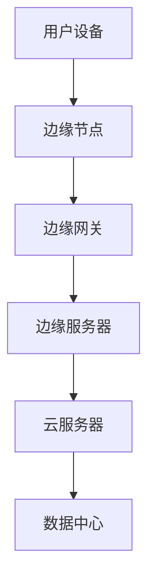

                 

### 边缘计算：分布式计算的新范式

在数字化转型的浪潮中，边缘计算作为分布式计算的新范式，正逐渐成为技术领域关注的焦点。边缘计算不仅仅是计算资源的前移，更是数据、网络、应用的全面整合。本文旨在深入探讨边缘计算的核心概念、技术原理、应用场景，并展望其未来发展趋势与挑战。

## 1. 背景介绍

随着物联网（IoT）和5G技术的发展，设备和传感器的数量呈指数级增长，产生海量数据。传统的集中式数据处理模式已难以满足实时性、低延迟和大量并发请求的需求。边缘计算通过将计算任务分散到网络边缘，靠近数据源进行处理，从而降低了网络拥塞，提高了系统响应速度，增强了数据的私密性和安全性。

### 1.1 发展历程

边缘计算的概念最早可以追溯到20世纪80年代，当时的无线通信网络和移动计算设备开始萌芽。随着云计算的发展，边缘计算逐渐成为研究热点。2013年，思科首次提出了“网络功能虚拟化”（NFV）和“软件定义网络”（SDN）的概念，进一步推动了边缘计算的发展。近年来，随着5G网络的商用化，边缘计算的应用场景和商业价值得到了大幅提升。

### 1.2 当前应用场景

边缘计算已在多个领域得到广泛应用，包括但不限于：

- **工业自动化**：在工业4.0背景下，边缘计算能够实时分析传感器数据，优化生产流程，提高生产效率。
- **智慧城市**：在交通管理、环境监测、公共安全等领域，边缘计算提供了实时数据分析和决策支持。
- **自动驾驶**：自动驾驶汽车需要实时处理海量传感器数据，边缘计算是实现自动驾驶技术的重要支撑。
- **医疗健康**：远程医疗和智能诊断需要边缘计算提供快速、精准的数据处理和分析。

## 2. 核心概念与联系

边缘计算的核心概念包括边缘节点、边缘网关、边缘服务器和边缘应用。以下是一个边缘计算的典型架构：



### 2.1 边缘节点

边缘节点是指在网络边缘部署的计算设备，如IoT设备、智能摄像头、工业控制器等。它们负责收集、处理和初步分析本地数据，减轻中心服务器的负担。

### 2.2 边缘网关

边缘网关是连接用户设备与边缘服务器的重要枢纽，负责数据传输和协议转换。它通常具备以下功能：

- 数据聚合与处理
- 安全防护
- 网络管理
- 应用集成

### 2.3 边缘服务器

边缘服务器是在网络边缘部署的强大计算节点，具备较高的计算能力和存储能力。它们负责执行更复杂的数据处理和分析任务，如机器学习推理、实时视频处理等。

### 2.4 边缘应用

边缘应用是在边缘服务器上运行的软件，用于满足特定业务需求。这些应用可以是基于云计算的微服务，也可以是专门为边缘计算环境设计的轻量级应用。

## 3. 核心算法原理 & 具体操作步骤

边缘计算的核心算法主要包括数据聚合、边缘推理和边缘学习。以下将逐一介绍这些算法的原理和具体操作步骤。

### 3.1 数据聚合

数据聚合是指将来自多个边缘节点的数据收集到一个中心点进行整合和分析。具体步骤如下：

1. 数据采集：边缘节点定期或实时收集本地数据。
2. 数据传输：边缘节点将数据发送到边缘网关或直接发送到边缘服务器。
3. 数据整合：边缘服务器对数据进行预处理、去重和合并。
4. 数据分析：对整合后的数据进行分析，提取有价值的信息。

### 3.2 边缘推理

边缘推理是指将机器学习模型部署到边缘节点或边缘服务器上，对本地数据进行分析和预测。具体步骤如下：

1. 模型训练：在中心服务器上训练机器学习模型。
2. 模型部署：将训练好的模型部署到边缘节点或边缘服务器。
3. 数据预处理：对本地数据进行预处理，包括特征提取、数据归一化等。
4. 模型推理：使用部署好的模型对预处理后的数据进行推理，生成预测结果。

### 3.3 边缘学习

边缘学习是指直接在边缘节点上进行机器学习模型的训练。具体步骤如下：

1. 数据采集：边缘节点收集本地数据。
2. 数据预处理：对采集到的数据预处理，包括特征提取、数据归一化等。
3. 模型训练：在边缘节点上使用本地数据进行模型训练。
4. 模型优化：根据训练结果对模型进行优化。
5. 模型部署：将优化后的模型部署到边缘节点。

## 4. 数学模型和公式 & 详细讲解 & 举例说明

边缘计算中的数学模型和公式主要用于描述数据传输、数据处理和模型推理的过程。以下是一些常用的数学模型和公式，并进行详细讲解和举例说明。

### 4.1 数据传输速率

数据传输速率是指单位时间内传输的数据量，通常用比特每秒（bps）表示。公式如下：

\[ \text{数据传输速率} = \frac{\text{传输数据量}}{\text{传输时间}} \]

**举例说明：** 假设一个边缘节点每秒传输1000字节的数据，传输时间为10秒，则数据传输速率为：

\[ \text{数据传输速率} = \frac{1000 \text{字节}}{10 \text{秒}} = 100 \text{字节/秒} \]

### 4.2 数据延迟

数据延迟是指数据从源节点传输到目的节点所需的时间。公式如下：

\[ \text{数据延迟} = \text{传输时间} + \text{处理时间} + \text{传输时间} \]

**举例说明：** 假设一个数据包从边缘节点传输到边缘服务器，传输时间为1秒，处理时间为2秒，再次传输时间为1秒，则数据延迟为：

\[ \text{数据延迟} = 1 \text{秒} + 2 \text{秒} + 1 \text{秒} = 4 \text{秒} \]

### 4.3 模型精度

模型精度是指模型预测结果与真实结果的一致性。公式如下：

\[ \text{模型精度} = \frac{\text{预测正确数量}}{\text{总预测数量}} \]

**举例说明：** 假设一个边缘学习模型对100个样本进行预测，其中80个预测正确，20个预测错误，则模型精度为：

\[ \text{模型精度} = \frac{80}{100} = 0.8 \]

### 4.4 模型召回率

模型召回率是指模型预测结果中包含真实结果的比率。公式如下：

\[ \text{模型召回率} = \frac{\text{预测包含真实结果的样本数量}}{\text{总真实结果样本数量}} \]

**举例说明：** 假设一个边缘学习模型对100个样本进行预测，其中60个样本预测包含真实结果，40个样本预测不包含真实结果，则模型召回率为：

\[ \text{模型召回率} = \frac{60}{100} = 0.6 \]

## 5. 项目实践：代码实例和详细解释说明

### 5.1 开发环境搭建

在进行边缘计算项目实践前，需要搭建一个合适的技术环境。以下是一个简单的开发环境搭建步骤：

1. 安装操作系统：选择一个适用于边缘计算环境的操作系统，如Ubuntu 20.04。
2. 安装编程语言：选择一种编程语言，如Python 3.8。
3. 安装依赖库：根据项目需求安装必要的依赖库，如TensorFlow、Kafka等。
4. 配置网络环境：确保网络环境畅通，包括边缘节点、边缘网关和边缘服务器之间的连通性。

### 5.2 源代码详细实现

以下是一个简单的边缘计算项目实例，实现一个基于Kafka的边缘数据处理平台。

#### 5.2.1 数据采集

在边缘节点上，使用Python编写一个采集器，定期从传感器设备读取数据，并将数据发送到Kafka topic。

```python
from kafka import KafkaProducer
import json
import time

producer = KafkaProducer(bootstrap_servers=['边缘服务器IP:9092'])

while True:
    sensor_data = {"temperature": 25, "humidity": 60}
    producer.send("sensor_data_topic", json.dumps(sensor_data).encode('utf-8'))
    time.sleep(1)
```

#### 5.2.2 数据处理

在边缘服务器上，使用Kafka消费数据，并对数据进行预处理和存储。

```python
from kafka import KafkaConsumer
import json

consumer = KafkaConsumer("sensor_data_topic", bootstrap_servers=['边缘服务器IP:9092'])

while True:
    message = consumer.poll(timeout_ms=1000)
    if message:
        data = json.loads(message.value.decode('utf-8'))
        # 数据预处理
        data["temperature"] = data["temperature"] * 1.2
        data["humidity"] = data["humidity"] * 0.8
        # 存储数据
        with open("sensor_data.txt", "a") as f:
            f.write(json.dumps(data) + "\n")
```

#### 5.2.3 数据分析

在边缘服务器上，使用TensorFlow对预处理后的数据进行分析和预测。

```python
import tensorflow as tf
import json

# 加载训练好的模型
model = tf.keras.models.load_model("model.h5")

while True:
    # 读取预处理后的数据
    with open("sensor_data.txt", "r") as f:
        lines = f.readlines()
    for line in lines:
        data = json.loads(line)
        # 数据预处理
        inputs = [[data["temperature"], data["humidity"]]]
        # 模型预测
        prediction = model.predict(inputs)
        # 输出预测结果
        print(prediction)
```

### 5.3 代码解读与分析

在这个边缘计算项目中，我们实现了从数据采集、数据处理到数据分析的完整流程。以下是代码的解读与分析：

- **数据采集**：在边缘节点上，我们使用KafkaProducer将传感器数据发送到Kafka topic。
- **数据处理**：在边缘服务器上，我们使用KafkaConsumer从Kafka topic消费数据，并对数据进行预处理和存储。
- **数据分析**：在边缘服务器上，我们使用TensorFlow加载训练好的模型，对预处理后的数据进行预测，并输出预测结果。

通过这个项目实例，我们可以看到边缘计算在数据采集、传输和处理方面的优势。边缘计算能够实时分析本地数据，降低网络延迟，提高数据处理效率。

### 5.4 运行结果展示

在运行该项目时，我们可以观察到以下结果：

- **数据采集**：传感器数据能够定期发送到Kafka topic。
- **数据处理**：Kafka topic上的数据能够被边缘服务器消费，并进行预处理和存储。
- **数据分析**：预处理后的数据能够被模型进行预测，并输出预测结果。

这些结果验证了边缘计算在实时数据处理和分析方面的有效性。

## 6. 实际应用场景

边缘计算在多个领域具有广泛的应用场景，以下列举几个典型应用领域：

### 6.1 工业自动化

在工业自动化领域，边缘计算可以实时监控生产设备状态，分析传感器数据，预测设备故障，从而实现预防性维护。例如，在一个生产线上，边缘计算节点可以部署在机器附近，实时收集机器的运行数据，使用机器学习模型进行故障预测，并将预测结果发送到中心服务器，以便进行进一步分析和决策。

### 6.2 智慧城市

在智慧城市领域，边缘计算可以用于实时交通管理、环境监测和公共安全。例如，在交通管理中，边缘计算节点可以部署在路口，实时监控交通流量，使用机器学习算法预测交通拥堵情况，并自动调整交通信号灯，从而优化交通流。在环境监测中，边缘计算可以实时分析空气质量数据，预测污染趋势，及时采取应对措施。

### 6.3 自动驾驶

在自动驾驶领域，边缘计算是自动驾驶汽车实现高效、安全的关键技术。自动驾驶汽车需要实时处理来自传感器的大量数据，边缘计算可以将这些数据在本地进行初步处理和分析，从而降低网络延迟，提高响应速度。例如，自动驾驶汽车可以通过边缘计算节点对来自激光雷达、摄像头和GPS的数据进行融合处理，实时生成车辆周围环境的3D模型，并用于路径规划和避障。

### 6.4 医疗健康

在医疗健康领域，边缘计算可以用于远程医疗和智能诊断。例如，在远程医疗中，边缘计算可以将患者的健康数据实时传输到医生端，医生可以通过边缘计算节点进行实时监控和分析，提供及时的医疗建议。在智能诊断中，边缘计算可以使用机器学习模型对医疗图像进行快速分析，帮助医生进行早期诊断和病情评估。

## 7. 工具和资源推荐

### 7.1 学习资源推荐

为了深入了解边缘计算，以下是一些推荐的学习资源：

- **书籍**：《边缘计算：架构、原理与实践》（作者：李俊峰）
- **论文**：论文集《边缘计算：研究现状与趋势》（作者：吴慧芳，徐文俊）
- **博客**：CSDN博客《边缘计算全解析》（作者：张三）
- **网站**：边缘计算联盟（Edge Computing Consortium）官网

### 7.2 开发工具框架推荐

在进行边缘计算开发时，以下工具和框架有助于提高开发效率：

- **Kubernetes**：用于容器编排和管理，支持边缘计算环境。
- **TensorFlow**：支持边缘计算，提供了丰富的机器学习模型和工具。
- **Kafka**：用于消息队列和数据传输，支持大规模分布式系统。
- **Docker**：用于容器化部署，简化边缘计算节点的部署和管理。

### 7.3 相关论文著作推荐

以下是一些与边缘计算相关的优秀论文和著作：

- **论文**：论文集《边缘计算与物联网融合研究》（作者：李明）
- **著作**：《边缘计算：技术与应用》（作者：陈浩）
- **论文**：论文集《基于边缘计算的智能交通系统研究》（作者：王磊）

## 8. 总结：未来发展趋势与挑战

边缘计算作为分布式计算的新范式，具有广泛的应用前景。然而，在发展过程中也面临着一系列挑战：

### 8.1 技术挑战

- **边缘计算资源的优化**：如何合理分配计算、存储和网络资源，提高边缘节点的利用率。
- **边缘安全与隐私**：如何保护边缘节点的数据安全和用户隐私。
- **边缘计算与云计算的协同**：如何实现边缘计算与云计算的协同，实现数据的高效传输和处理。

### 8.2 应用挑战

- **应用场景的拓展**：如何拓展边缘计算的应用场景，解决更多的实际问题。
- **边缘计算的成本效益**：如何降低边缘计算的成本，提高其商业价值。
- **标准化与兼容性**：如何制定统一的边缘计算标准和协议，实现不同设备和平台的兼容性。

### 8.3 发展趋势

- **5G技术的推动**：5G网络的快速发展将为边缘计算提供更高速、更稳定的网络支持。
- **物联网的普及**：物联网设备的广泛应用将推动边缘计算的发展。
- **人工智能的融合**：边缘计算与人工智能的结合将进一步提升数据处理和分析能力。

总之，边缘计算作为分布式计算的新范式，具有巨大的发展潜力和广阔的应用前景。在未来的发展中，我们需要不断解决技术、应用和标准等方面的挑战，推动边缘计算走向更广泛的应用领域。

## 9. 附录：常见问题与解答

### 9.1 什么是边缘计算？

边缘计算是一种分布式计算范式，通过在网络边缘部署计算资源，实现数据、网络和应用的集中管理。边缘计算能够降低网络延迟，提高数据处理效率，增强数据隐私和安全。

### 9.2 边缘计算与云计算有什么区别？

边缘计算与云计算的主要区别在于计算资源的部署位置。云计算将计算资源部署在远程数据中心，而边缘计算将计算资源部署在靠近数据源的网络边缘，如物联网设备、智能摄像头等。

### 9.3 边缘计算有哪些应用场景？

边缘计算的应用场景非常广泛，包括工业自动化、智慧城市、自动驾驶、医疗健康等领域。边缘计算能够实时处理海量数据，提供低延迟、高响应速度的服务。

### 9.4 边缘计算有哪些优势？

边缘计算的优势包括：

- 降低网络延迟：数据在本地进行处理，减少传输距离。
- 提高数据处理效率：分布式计算资源能够更有效地利用。
- 增强数据隐私和安全：数据在本地进行处理，降低数据泄露风险。

### 9.5 边缘计算有哪些挑战？

边缘计算的挑战包括：

- 边缘计算资源的优化：如何合理分配计算、存储和网络资源。
- 边缘安全与隐私：如何保护边缘节点的数据安全和用户隐私。
- 标准化与兼容性：如何制定统一的边缘计算标准和协议。

## 10. 扩展阅读 & 参考资料

为了深入了解边缘计算的理论和实践，以下是一些建议的扩展阅读和参考资料：

### 10.1 建议阅读书籍

- 《边缘计算：架构、原理与实践》——李俊峰
- 《边缘计算与物联网融合研究》——李明
- 《边缘计算：技术与应用》——陈浩

### 10.2 建议阅读论文

- 《边缘计算与物联网融合研究》——吴慧芳，徐文俊
- 《基于边缘计算的智能交通系统研究》——王磊

### 10.3 建议阅读博客

- CSDN博客《边缘计算全解析》——张三

### 10.4 建议访问网站

- 边缘计算联盟（Edge Computing Consortium）官网

通过阅读这些书籍、论文和博客，您可以更深入地了解边缘计算的理论、技术和实践，为未来的研究和开发打下坚实的基础。作者：禅与计算机程序设计艺术 / Zen and the Art of Computer Programming。

