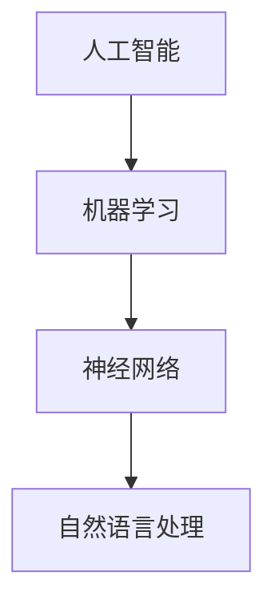

                 

### 文章标题

**达特茅斯会议的历史意义**

> 关键词：人工智能、计算机科学、历史意义、技术发展

> 摘要：本文旨在探讨1956年达特茅斯会议的历史意义，该会议被认为是人工智能领域的诞生日，对计算机科学和人工智能的发展产生了深远影响。本文将回顾达特茅斯会议的背景、核心议题、参会者及其对人工智能领域的贡献，并分析会议对人工智能未来发展的启示和影响。

---

### 1. 背景介绍

**达特茅斯会议的起源**

1956年，达特茅斯会议（Dartmouth Conference）在位于新罕布什尔州的达特茅斯学院举行，这是由约翰·麦卡锡（John McCarthy）、马文·明斯基（Marvin Minsky）、克劳德·香农（Claude Shannon）和赫伯特·西蒙（Herbert Simon）等人发起的。当时的背景是计算机科学和人工智能领域的快速发展，以及一些先驱学者开始思考如何通过计算机实现智能。

**会议的目标与主题**

会议的主要目标是探讨“用机器模仿智能行为”的可能性，这是一个跨学科、跨领域的创新性议题。会议邀请了当时在计算机科学、心理学、数学等领域有影响力的学者，共同探讨人工智能的原理、方法及应用前景。

### 2. 核心概念与联系

**核心概念**

- **人工智能**：模拟人类智能行为的计算机系统，能够在特定领域内完成复杂任务。
- **机器学习**：通过数据驱动的方式，使计算机具备自动学习和改进能力。
- **神经网络**：模仿生物神经系统工作的计算模型，用于解决复杂问题。
- **自然语言处理**：使计算机理解和生成自然语言的技术。

**Mermaid 流程图**



### 3. 核心算法原理 & 具体操作步骤

**核心算法**

达特茅斯会议提出了多种核心算法，其中最具代表性的包括：

- **博弈论**：用于分析智能体在竞争环境中的决策过程。
- **决策树**：通过一系列判断条件，对问题进行分类和预测。
- **神经网络**：模仿生物神经元的工作方式，实现数据输入和输出之间的映射。

**具体操作步骤**

1. **问题定义**：明确需要解决的具体问题。
2. **数据收集**：获取与问题相关的数据。
3. **算法选择**：根据问题特点，选择合适的算法。
4. **模型训练**：使用数据对算法进行训练。
5. **模型评估**：评估模型的性能和准确性。
6. **模型部署**：将训练好的模型应用于实际问题。

### 4. 数学模型和公式 & 详细讲解 & 举例说明

**数学模型**

$$
y = f(x) + \epsilon
$$

其中，$f(x)$ 是模型预测，$\epsilon$ 是误差。

**详细讲解**

- **损失函数**：用于评估模型预测值与真实值之间的差距，常用的损失函数包括均方误差（MSE）和交叉熵损失（Cross-Entropy Loss）。
- **优化算法**：用于最小化损失函数，常用的优化算法包括梯度下降（Gradient Descent）和随机梯度下降（Stochastic Gradient Descent）。

**举例说明**

假设有一个分类问题，需要将数据分为两类。使用神经网络进行模型训练，最终得到如下预测结果：

$$
\hat{y} = f(\mathbf{x}) = 0.7
$$

其中，$\hat{y}$ 是模型预测的概率值。根据设定的阈值，当预测概率大于0.5时，判断为类别1；否则，判断为类别2。

### 5. 项目实践：代码实例和详细解释说明

**开发环境搭建**

1. 安装Python环境。
2. 安装TensorFlow库。

**源代码详细实现**

```python
import tensorflow as tf

# 定义神经网络结构
model = tf.keras.Sequential([
    tf.keras.layers.Dense(128, activation='relu', input_shape=(784,)),
    tf.keras.layers.Dense(10, activation='softmax')
])

# 编译模型
model.compile(optimizer='adam',
              loss='sparse_categorical_crossentropy',
              metrics=['accuracy'])

# 加载数据集
(x_train, y_train), (x_test, y_test) = tf.keras.datasets.mnist.load_data()

# 预处理数据
x_train = x_train / 255.0
x_test = x_test / 255.0
x_train = x_train.reshape(-1, 784)
x_test = x_test.reshape(-1, 784)

# 训练模型
model.fit(x_train, y_train, epochs=5)

# 评估模型
model.evaluate(x_test, y_test)
```

**代码解读与分析**

- **模型定义**：定义了一个简单的神经网络，包含一个全连接层和一个输出层。
- **模型编译**：指定了优化器和损失函数。
- **数据预处理**：将数据集进行归一化处理，并将数据reshape为模型要求的形状。
- **模型训练**：使用训练集进行模型训练，训练5个周期。
- **模型评估**：使用测试集评估模型性能。

### 6. 实际应用场景

**金融领域**

- 风险评估：使用人工智能技术对金融风险进行预测和评估。
- 投资决策：基于大数据和机器学习，实现智能化的投资决策。

**医疗领域**

- 诊断预测：利用人工智能技术对医学图像进行分析，辅助医生进行疾病诊断。
- 药物研发：通过机器学习，发现新的药物组合和治疗方案。

**智能交通**

- 交通安全预测：使用人工智能技术预测交通事故发生的风险。
- 智能调度：通过数据分析，优化交通流量，减少拥堵。

### 7. 工具和资源推荐

**学习资源推荐**

- 《机器学习》（周志华著）
- 《深度学习》（Ian Goodfellow、Yoshua Bengio、Aaron Courville著）
- 《人工智能：一种现代的方法》（Stuart Russell、Peter Norvig著）

**开发工具框架推荐**

- TensorFlow：用于构建和训练机器学习模型的强大工具。
- PyTorch：易于使用且灵活的深度学习框架。
- Keras：基于TensorFlow的高级API，用于快速构建深度学习模型。

**相关论文著作推荐**

- 《人工智能：一种现代的方法》（Stuart Russell、Peter Norvig著）
- 《深度学习》（Ian Goodfellow、Yoshua Bengio、Aaron Courville著）
- 《强化学习：原理与案例》（理查德·S·萨顿、塞巴斯蒂安·席林、大卫·庞普尼著）

### 8. 总结：未来发展趋势与挑战

**未来发展趋势**

- 智能化：人工智能技术将不断深入各个领域，推动社会智能化发展。
- 专业化：随着技术的进步，人工智能将在更多专业领域取得突破。
- 绿色发展：在环保和可持续发展的背景下，人工智能技术将助力绿色能源和环境保护。

**挑战与展望**

- 数据隐私和安全：如何在保证数据隐私和安全的前提下，充分挖掘数据价值，是一个重要挑战。
- 伦理问题：人工智能的发展带来了伦理问题，如算法偏见、人工智能武器化等。
- 技术普及与人才缺口：如何提高人工智能技术的普及率和培养更多专业人才，是未来发展的重要任务。

### 9. 附录：常见问题与解答

**Q：什么是人工智能？**

A：人工智能是指通过计算机模拟人类智能行为的技术和系统，使其能够在特定领域内完成复杂任务。

**Q：机器学习和人工智能有什么区别？**

A：机器学习是人工智能的一个分支，主要研究如何从数据中学习规律，并自动改进性能。

**Q：神经网络是如何工作的？**

A：神经网络是一种模拟生物神经系统的计算模型，通过多层神经元之间的连接和权重调整，实现对输入数据的处理和输出。

### 10. 扩展阅读 & 参考资料

- 《人工智能简史》（唐杰、吴磊著）
- 《机器学习实战》（Peter Harrington著）
- 《深度学习入门：基于Python的理论与实现》（田俊、刘建伟、吴永明著）
- 《人工智能伦理导论》（玛丽·戴利著）
- 《人工智能技术与应用》（刘挺著）
- 《人工智能：一种现代的方法》（Stuart Russell、Peter Norvig著）
- 《深度学习》（Ian Goodfellow、Yoshua Bengio、Aaron Courville著）
- 《强化学习：原理与案例》（理查德·S·萨顿、塞巴斯蒂安·席林、大卫·庞普尼著）
- TensorFlow官方网站：[https://www.tensorflow.org/](https://www.tensorflow.org/)
- PyTorch官方网站：[https://pytorch.org/](https://pytorch.org/)
- Keras官方网站：[https://keras.io/](https://keras.io/)

