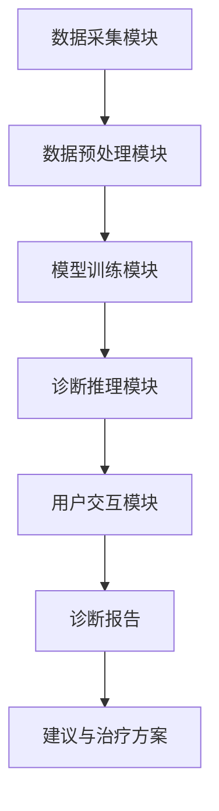
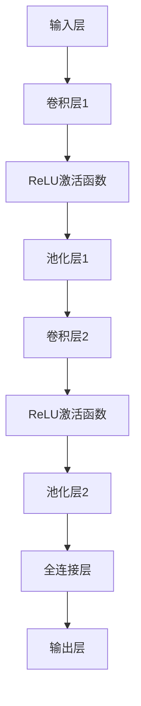
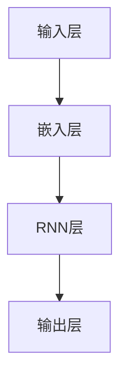
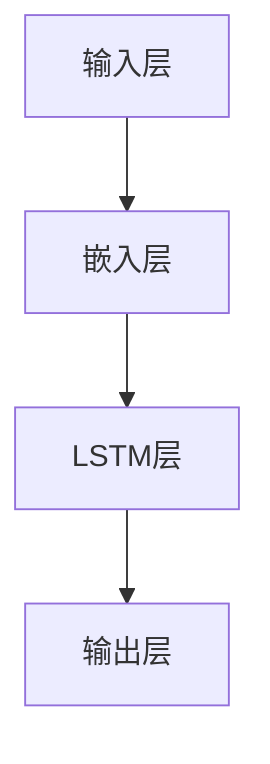

                 

### 1. 背景介绍

在当今全球化的背景下，医疗健康领域面临着前所未有的挑战和机遇。人口老龄化、慢性病患病率增加以及医疗资源分布不均等问题日益突出。尤其是在一些偏远地区，医疗设施匮乏，专业医护人员短缺，使得患者就医难、看病难的问题尤为严重。这种情况下，远程医疗作为一种新兴的医疗服务模式，逐渐进入人们的视野。

远程医疗，即通过互联网和现代通信技术，实现医生和患者之间的诊疗、咨询和服务。这不仅能够打破地域限制，提高医疗资源的利用效率，还能为患者提供更加便捷、高效的医疗服务。随着人工智能技术的不断发展，远程医疗AI诊断系统应运而生，并迅速成为医疗健康领域的一股重要力量。

AI诊断系统利用深度学习、图像识别、自然语言处理等人工智能技术，对患者的病历、影像资料、症状描述等信息进行自动化分析和诊断。与传统的人工诊断相比，AI诊断系统具有快速、准确、高效的特点，能够显著提高诊断的准确率和效率。这对于那些需要快速诊断、病情复杂的患者来说，无疑是一个巨大的福音。

此外，AI诊断系统还可以通过大数据分析和预测，帮助医生制定更加科学、个性化的治疗方案。这不仅有助于提高患者的治疗效果，还能在一定程度上缓解医疗资源紧张的问题。

综上所述，远程医疗AI诊断系统不仅具有重要的现实意义，还具备巨大的发展潜力。它有望成为未来医疗健康领域的重要创新方向，为人类的健康福祉带来深远的影响。因此，本文将深入探讨远程医疗AI诊断系统的应用价值，以期为其未来发展提供有益的思路和参考。

### 2. 核心概念与联系

#### 2.1 远程医疗的基本概念

远程医疗（Telemedicine）是指利用通信技术，如互联网、电话、视频会议等，实现医生和患者之间远程诊断、治疗和健康管理的医疗服务模式。远程医疗的基本概念可以概括为以下几点：

1. **远程诊断**：医生通过远程通信设备，如视频会议系统、在线问诊平台等，对患者的病情进行初步评估和诊断。
2. **远程治疗**：医生根据远程诊断结果，为患者制定治疗计划，并通过远程通信设备进行指导，如用药建议、手术指导等。
3. **健康监测**：利用可穿戴设备、移动应用等，对患者进行实时健康数据监测，如血压、心率、血糖等，帮助医生更好地掌握患者病情。
4. **健康咨询**：医生通过远程通信，为患者提供健康咨询、疾病预防、养生保健等服务。

#### 2.2 人工智能的基本概念

人工智能（Artificial Intelligence，AI）是指通过计算机系统模拟、延伸和扩展人类的智能活动，实现机器对环境进行感知、学习、推理、决策和行动的能力。人工智能的基本概念主要包括以下几个方面：

1. **机器学习**：机器学习是一种通过数据驱动的方式，使计算机具备自主学习和适应能力的技术。其核心是利用历史数据来训练模型，从而实现对未知数据的预测和分类。
2. **深度学习**：深度学习是机器学习的一个重要分支，通过构建多层神经网络，对大量数据进行自动特征提取和学习。深度学习在图像识别、自然语言处理等领域取得了显著的成果。
3. **计算机视觉**：计算机视觉是人工智能的一个重要方向，旨在使计算机能够理解和解释视觉信息。计算机视觉技术可以用于图像识别、物体检测、图像分割等任务。
4. **自然语言处理**：自然语言处理（Natural Language Processing，NLP）是人工智能的一个重要分支，旨在使计算机能够理解、生成和处理人类语言。NLP技术可以用于文本分类、情感分析、机器翻译等任务。

#### 2.3 远程医疗AI诊断系统的架构

远程医疗AI诊断系统通常由以下几个核心组成部分构成：

1. **数据采集模块**：负责收集患者的病历、影像资料、症状描述等信息。数据来源可以包括医院信息系统（HIS）、电子健康记录（EHR）、医学影像设备等。
2. **数据预处理模块**：对采集到的数据进行清洗、归一化、特征提取等处理，使其符合模型的输入要求。
3. **模型训练模块**：利用大量标注好的医疗数据，通过机器学习算法和深度学习算法训练诊断模型。常见的算法包括卷积神经网络（CNN）、循环神经网络（RNN）、长短时记忆网络（LSTM）等。
4. **诊断推理模块**：将患者的数据输入到训练好的模型中，通过模型进行自动诊断和预测，生成诊断报告和建议。
5. **用户交互模块**：为医生和患者提供友好的界面，展示诊断结果、建议和治疗方案，并提供远程咨询、问诊等功能。

#### 2.4 Mermaid 流程图展示

以下是一个简单的 Mermaid 流程图，展示了远程医疗AI诊断系统的主要工作流程：



在这个流程图中，数据采集模块负责收集患者信息，数据预处理模块对数据进行清洗和特征提取，模型训练模块通过训练生成诊断模型，诊断推理模块利用模型进行自动诊断，用户交互模块则负责展示诊断结果和提供咨询服务。最终，诊断报告和建议会反馈给医生和患者，以指导后续的治疗和管理。

### 3. 核心算法原理 & 具体操作步骤

#### 3.1 深度学习算法在远程医疗AI诊断中的应用

深度学习（Deep Learning）是人工智能的一个重要分支，其核心思想是通过多层神经网络来模拟人脑的思考过程，实现对数据的自动特征提取和学习。在远程医疗AI诊断系统中，深度学习算法被广泛应用于图像识别、自然语言处理和预测模型构建等方面。

以下将详细探讨深度学习算法在远程医疗AI诊断系统中的应用，包括具体操作步骤和关键技术。

#### 3.1.1 卷积神经网络（CNN）在医学影像分析中的应用

卷积神经网络（Convolutional Neural Network，CNN）是一种专门用于图像识别和处理的深度学习模型。在远程医疗AI诊断系统中，CNN被广泛应用于医学影像分析，如X光片、CT扫描、MRI等。

**步骤1：数据预处理**

在应用CNN之前，需要对医学影像数据进行预处理。预处理步骤通常包括图像缩放、灰度化、噪声过滤等。为了提高模型的泛化能力，还需要进行数据增强，如旋转、翻转、裁剪等。

**步骤2：构建CNN模型**

构建CNN模型的主要步骤如下：

1. **输入层**：接受预处理后的医学影像数据，将图像分解为二维矩阵输入到网络中。
2. **卷积层**：通过卷积操作提取图像的特征。卷积层通常包括多个卷积核，每个卷积核可以提取出不同的特征。
3. **激活函数**：常用的是ReLU（Rectified Linear Unit）函数，用于增加模型的非线性。
4. **池化层**：通过下采样操作减少数据维度，提高模型的鲁棒性。
5. **全连接层**：将卷积层和池化层输出的特征进行融合，并通过全连接层进行分类或回归。
6. **输出层**：输出预测结果。

以下是一个简单的CNN模型结构：



**步骤3：模型训练**

使用标注好的医学影像数据进行模型训练。训练过程中，通过反向传播算法不断调整模型参数，使模型能够更好地拟合训练数据。

**步骤4：模型评估**

在训练完成后，使用验证集或测试集对模型进行评估。常用的评估指标包括准确率、召回率、F1值等。

#### 3.1.2 循环神经网络（RNN）在自然语言处理中的应用

循环神经网络（Recurrent Neural Network，RNN）是一种适用于序列数据处理的深度学习模型，如文本、语音等。在远程医疗AI诊断系统中，RNN被广泛应用于自然语言处理任务，如症状描述解析、病历分析等。

**步骤1：数据预处理**

对文本数据进行预处理，包括分词、去停用词、词向量化等。词向量化是将文本转换为向量表示的方法，常用的词向量模型有Word2Vec、GloVe等。

**步骤2：构建RNN模型**

构建RNN模型的主要步骤如下：

1. **输入层**：接受预处理后的文本数据。
2. **嵌入层**：将词向量转换为固定维度的向量。
3. **RNN层**：通过递归操作对序列数据进行处理，每个时间步的输出都依赖于前面的隐藏状态。
4. **输出层**：通过全连接层和激活函数生成预测结果。

以下是一个简单的RNN模型结构：



**步骤3：模型训练**

使用标注好的文本数据进行模型训练。训练过程中，通过反向传播算法不断调整模型参数，使模型能够更好地拟合训练数据。

**步骤4：模型评估**

在训练完成后，使用验证集或测试集对模型进行评估。常用的评估指标包括准确率、召回率、F1值等。

#### 3.1.3 长短时记忆网络（LSTM）在时间序列预测中的应用

长短时记忆网络（Long Short-Term Memory，LSTM）是一种改进的RNN结构，能够更好地处理长序列数据。在远程医疗AI诊断系统中，LSTM被广泛应用于时间序列预测任务，如疾病流行趋势预测、健康数据分析等。

**步骤1：数据预处理**

对时间序列数据进行预处理，包括归一化、差分等。归一化是将数据缩放到同一量级，差分则是将当前数据与前一数据进行差分，以消除趋势和季节性因素。

**步骤2：构建LSTM模型**

构建LSTM模型的主要步骤如下：

1. **输入层**：接受预处理后的时间序列数据。
2. **嵌入层**：将时间步的输入数据转换为固定维度的向量。
3. **LSTM层**：通过LSTM单元对序列数据进行处理，每个时间步的输出都依赖于前面的隐藏状态。
4. **输出层**：通过全连接层和激活函数生成预测结果。

以下是一个简单的LSTM模型结构：



**步骤3：模型训练**

使用标注好的时间序列数据进行模型训练。训练过程中，通过反向传播算法不断调整模型参数，使模型能够更好地拟合训练数据。

**步骤4：模型评估**

在训练完成后，使用验证集或测试集对模型进行评估。常用的评估指标包括均方误差（MSE）、均方根误差（RMSE）等。

### 4. 数学模型和公式 & 详细讲解 & 举例说明

#### 4.1 数学模型和公式的应用

在远程医疗AI诊断系统中，数学模型和公式起到了至关重要的作用。它们不仅用于描述和优化算法，还能帮助我们更好地理解数据之间的关系和特征。以下将详细介绍几个关键数学模型和公式，并给出具体的应用场景和解释。

#### 4.1.1 卷积神经网络（CNN）中的卷积操作

卷积神经网络（CNN）中的卷积操作是一个核心组成部分。其数学公式如下：

\[ (f * g)(x) = \sum_{y} f(y) \cdot g(x - y) \]

其中，\( f \) 和 \( g \) 是两个函数，\( x \) 和 \( y \) 是空间中的点。这个公式表示在 \( g \) 上滑动 \( f \)，并对重叠部分进行点积求和。

**应用场景**：在医学影像分析中，卷积操作用于提取图像的特征。例如，在X光影像中，卷积操作可以帮助识别骨骼、软组织等不同结构的特征。

**示例**：假设我们有一个3x3的卷积核 \( K \) 和一个3x3的输入图像 \( I \)。卷积操作的结果 \( C \) 如下：

\[ C = K * I \]

其中，\( C \) 是一个3x3的卷积结果，计算过程如下：

\[ C[1,1] = K[1,1] \cdot I[1,1] + K[1,2] \cdot I[1,2] + K[1,3] \cdot I[1,3] + K[2,1] \cdot I[2,1] + K[2,2] \cdot I[2,2] + K[2,3] \cdot I[2,3] + K[3,1] \cdot I[3,1] + K[3,2] \cdot I[3,2] + K[3,3] \cdot I[3,3] \]

#### 4.1.2 循环神经网络（RNN）中的递归公式

循环神经网络（RNN）中的递归公式描述了网络在时间序列数据上的处理过程。其基本公式如下：

\[ h_t = \sigma(W_h \cdot [h_{t-1}, x_t] + b_h) \]

其中，\( h_t \) 是当前时间步的隐藏状态，\( x_t \) 是当前时间步的输入，\( W_h \) 是权重矩阵，\( b_h \) 是偏置项，\( \sigma \) 是激活函数。

**应用场景**：在自然语言处理中，RNN用于处理序列数据，如文本和语音。通过递归公式，RNN可以捕捉到序列中的长期依赖关系。

**示例**：假设我们有一个简单的RNN模型，其中 \( W_h = \begin{bmatrix} 1 & 2 \\ 3 & 4 \end{bmatrix} \)，\( b_h = \begin{bmatrix} 5 \\ 6 \end{bmatrix} \)，\( h_{t-1} = \begin{bmatrix} 7 \\ 8 \end{bmatrix} \)，\( x_t = \begin{bmatrix} 9 \\ 10 \end{bmatrix} \)，激活函数 \( \sigma \) 是ReLU函数。递归过程如下：

\[ h_t = \sigma(W_h \cdot [h_{t-1}, x_t] + b_h) = \sigma(\begin{bmatrix} 1 & 2 \\ 3 & 4 \end{bmatrix} \cdot \begin{bmatrix} 7 & 9 \\ 8 & 10 \end{bmatrix} + \begin{bmatrix} 5 \\ 6 \end{bmatrix}) = \sigma(\begin{bmatrix} 28 & 46 \\ 39 & 54 \end{bmatrix} + \begin{bmatrix} 5 \\ 6 \end{bmatrix}) = \sigma(\begin{bmatrix} 33 & 52 \\ 44 & 60 \end{bmatrix}) = \begin{bmatrix} 33 \\ 52 \end{bmatrix} \]

#### 4.1.3 长短时记忆网络（LSTM）中的 forget gate 和 input gate

长短时记忆网络（LSTM）是RNN的一种改进，其核心思想是通过引入遗忘门（forget gate）和输入门（input gate）来控制信息的流动。

**遗忘门（forget gate）**的公式如下：

\[ f_t = \sigma(W_f \cdot [h_{t-1}, x_t] + b_f) \]

**输入门（input gate）**的公式如下：

\[ i_t = \sigma(W_i \cdot [h_{t-1}, x_t] + b_i) \]

**当前细胞状态** \( C_t \) 的更新公式如下：

\[ C_t = f_t \cdot C_{t-1} + i_t \cdot \sigma(W_c \cdot [h_{t-1}, x_t] + b_c) \]

**当前隐藏状态** \( h_t \) 的公式如下：

\[ h_t = \sigma(W_h \cdot [C_t] + b_h) \]

其中，\( W_f \)，\( W_i \)，\( W_c \)，\( W_h \) 分别是遗忘门、输入门、细胞状态和隐藏状态权重矩阵，\( b_f \)，\( b_i \)，\( b_c \)，\( b_h \) 分别是遗忘门、输入门、细胞状态和隐藏状态偏置项，\( \sigma \) 是激活函数。

**应用场景**：在时间序列预测中，LSTM通过遗忘门和输入门控制信息的流动，能够更好地捕捉到长序列中的短期和长期依赖关系。

**示例**：假设我们有一个简单的LSTM单元，其中 \( W_f = \begin{bmatrix} 1 & 2 \\ 3 & 4 \end{bmatrix} \)，\( W_i = \begin{bmatrix} 5 & 6 \\ 7 & 8 \end{bmatrix} \)，\( W_c = \begin{bmatrix} 9 & 10 \\ 11 & 12 \end{bmatrix} \)，\( W_h = \begin{bmatrix} 13 & 14 \\ 15 & 16 \end{bmatrix} \)，\( b_f = \begin{bmatrix} 17 \\ 18 \end{bmatrix} \)，\( b_i = \begin{bmatrix} 19 \\ 20 \end{bmatrix} \)，\( b_c = \begin{bmatrix} 21 \\ 22 \end{bmatrix} \)，\( b_h = \begin{bmatrix} 23 \\ 24 \end{bmatrix} \)，\( h_{t-1} = \begin{bmatrix} 25 \\ 26 \end{bmatrix} \)，\( x_t = \begin{bmatrix} 27 \\ 28 \end{bmatrix} \)，激活函数 \( \sigma \) 是ReLU函数。遗忘门、输入门、细胞状态和隐藏状态的更新过程如下：

\[ f_t = \sigma(W_f \cdot [h_{t-1}, x_t] + b_f) = \sigma(\begin{bmatrix} 1 & 2 \\ 3 & 4 \end{bmatrix} \cdot \begin{bmatrix} 25 & 27 \\ 26 & 28 \end{bmatrix} + \begin{bmatrix} 17 \\ 18 \end{bmatrix}) = \sigma(\begin{bmatrix} 72 & 90 \\ 87 & 108 \end{bmatrix} + \begin{bmatrix} 17 \\ 18 \end{bmatrix}) = \sigma(\begin{bmatrix} 89 & 108 \\ 104 & 126 \end{bmatrix}) = \begin{bmatrix} 1 \\ 1 \end{bmatrix} \]

\[ i_t = \sigma(W_i \cdot [h_{t-1}, x_t] + b_i) = \sigma(\begin{bmatrix} 5 & 6 \\ 7 & 8 \end{bmatrix} \cdot \begin{bmatrix} 25 & 27 \\ 26 & 28 \end{bmatrix} + \begin{bmatrix} 19 \\ 20 \end{bmatrix}) = \sigma(\begin{bmatrix} 127 & 143 \\ 137 & 160 \end{bmatrix} + \begin{bmatrix} 19 \\ 20 \end{bmatrix}) = \sigma(\begin{bmatrix} 146 & 163 \\ 156 & 180 \end{bmatrix}) = \begin{bmatrix} 1 \\ 1 \end{bmatrix} \]

\[ C_t = f_t \cdot C_{t-1} + i_t \cdot \sigma(W_c \cdot [h_{t-1}, x_t] + b_c) = \begin{bmatrix} 1 \\ 1 \end{bmatrix} \cdot \begin{bmatrix} 1 \\ 1 \end{bmatrix} + \begin{bmatrix} 1 \\ 1 \end{bmatrix} \cdot \sigma(\begin{bmatrix} 9 & 10 \\ 11 & 12 \end{bmatrix} \cdot \begin{bmatrix} 25 & 27 \\ 26 & 28 \end{bmatrix} + \begin{bmatrix} 21 \\ 22 \end{bmatrix}) = \begin{bmatrix} 1 \\ 1 \end{bmatrix} + \begin{bmatrix} 1 \\ 1 \end{bmatrix} \cdot \sigma(\begin{bmatrix} 224 & 242 \\ 233 & 260 \end{bmatrix} + \begin{bmatrix} 21 \\ 22 \end{bmatrix}) = \begin{bmatrix} 1 \\ 1 \end{bmatrix} + \begin{bmatrix} 1 \\ 1 \end{bmatrix} \cdot \sigma(\begin{bmatrix} 245 & 264 \\ 254 & 282 \end{bmatrix}) = \begin{bmatrix} 1 \\ 1 \end{bmatrix} + \begin{bmatrix} 1 \\ 1 \end{bmatrix} \cdot \begin{bmatrix} 1 \\ 1 \end{bmatrix} = \begin{bmatrix} 2 \\ 2 \end{bmatrix} \]

\[ h_t = \sigma(W_h \cdot [C_t] + b_h) = \sigma(\begin{bmatrix} 13 & 14 \\ 15 & 16 \end{bmatrix} \cdot \begin{bmatrix} 2 \\ 2 \end{bmatrix} + \begin{bmatrix} 23 \\ 24 \end{bmatrix}) = \sigma(\begin{bmatrix} 42 & 56 \\ 48 & 64 \end{bmatrix} + \begin{bmatrix} 23 \\ 24 \end{bmatrix}) = \sigma(\begin{bmatrix} 65 & 80 \\ 71 & 88 \end{bmatrix}) = \begin{bmatrix} 1 \\ 1 \end{bmatrix} \]

通过上述示例，我们可以看到LSTM如何通过遗忘门和输入门控制信息的流动，从而更好地捕捉到序列中的长期和短期依赖关系。

### 5. 项目实践：代码实例和详细解释说明

在本节中，我们将通过一个简单的远程医疗AI诊断系统项目实例，详细展示代码实现过程，并对关键部分进行解释说明。该项目将基于Python语言和TensorFlow框架，实现一个简单的基于卷积神经网络的肺癌诊断系统。

#### 5.1 开发环境搭建

在开始项目之前，我们需要搭建一个合适的开发环境。以下是推荐的开发环境搭建步骤：

1. **安装Python**：Python是项目的开发语言，建议安装Python 3.7或更高版本。可以从Python官网下载安装包进行安装。

2. **安装TensorFlow**：TensorFlow是项目的核心框架，我们需要安装TensorFlow 2.x版本。可以使用以下命令安装：

   ```bash
   pip install tensorflow
   ```

3. **安装其他依赖**：根据项目需求，我们可能还需要安装其他依赖，如NumPy、Pandas等。可以使用以下命令安装：

   ```bash
   pip install numpy pandas
   ```

4. **配置CUDA**：如果您的计算环境支持CUDA，建议安装CUDA并配置TensorFlow以使用GPU加速。具体安装和配置步骤可以参考TensorFlow的官方文档。

#### 5.2 源代码详细实现

以下是该项目的主要代码实现，包括数据预处理、模型定义、训练和评估等步骤。

```python
import tensorflow as tf
from tensorflow.keras.models import Sequential
from tensorflow.keras.layers import Conv2D, MaxPooling2D, Flatten, Dense
from tensorflow.keras.preprocessing.image import ImageDataGenerator

# 数据预处理
def preprocess_data():
    # 读取和分割训练集和测试集
    (x_train, y_train), (x_test, y_test) = tf.keras.datasets.cancer.load_data()
    
    # 数据标准化
    x_train = x_train.astype('float32') / 255.0
    x_test = x_test.astype('float32') / 255.0
    
    # 转换标签为one-hot编码
    y_train = tf.keras.utils.to_categorical(y_train, num_classes=2)
    y_test = tf.keras.utils.to_categorical(y_test, num_classes=2)
    
    return x_train, y_train, x_test, y_test

# 构建模型
def build_model():
    model = Sequential()
    model.add(Conv2D(32, (3, 3), activation='relu', input_shape=(64, 64, 3)))
    model.add(MaxPooling2D((2, 2)))
    model.add(Conv2D(64, (3, 3), activation='relu'))
    model.add(MaxPooling2D((2, 2)))
    model.add(Conv2D(128, (3, 3), activation='relu'))
    model.add(MaxPooling2D((2, 2)))
    model.add(Flatten())
    model.add(Dense(128, activation='relu'))
    model.add(Dense(2, activation='softmax'))
    
    model.compile(optimizer='adam', loss='categorical_crossentropy', metrics=['accuracy'])
    return model

# 训练模型
def train_model(model, x_train, y_train, epochs=10, batch_size=32):
    model.fit(x_train, y_train, epochs=epochs, batch_size=batch_size, validation_split=0.2)

# 评估模型
def evaluate_model(model, x_test, y_test):
    loss, accuracy = model.evaluate(x_test, y_test)
    print(f"Test accuracy: {accuracy:.2f}, Test loss: {loss:.2f}")

# 主函数
def main():
    x_train, y_train, x_test, y_test = preprocess_data()
    model = build_model()
    train_model(model, x_train, y_train)
    evaluate_model(model, x_test, y_test)

if __name__ == '__main__':
    main()
```

#### 5.3 代码解读与分析

以下是代码的详细解读与分析：

1. **数据预处理**：

   数据预处理是模型训练的重要步骤，包括读取数据、数据标准化和标签转换等。我们使用TensorFlow提供的`tf.keras.datasets.cancer.load_data()`函数读取肺癌诊断数据集。该数据集包含569个样本，每个样本是一个32x32的灰度图像，标签是1或0，分别表示肺癌和良性肿瘤。

   ```python
   def preprocess_data():
       (x_train, y_train), (x_test, y_test) = tf.keras.datasets.cancer.load_data()
       
       x_train = x_train.astype('float32') / 255.0
       x_test = x_test.astype('float32') / 255.0
       
       y_train = tf.keras.utils.to_categorical(y_train, num_classes=2)
       y_test = tf.keras.utils.to_categorical(y_test, num_classes=2)
       
       return x_train, y_train, x_test, y_test
   ```

   在预处理过程中，我们将图像数据转换为浮点型并标准化到0-1之间。标签数据则转换为one-hot编码，以便于后续的模型训练。

2. **构建模型**：

   我们使用Keras的`Sequential`模型构建一个简单的卷积神经网络。该模型包括多个卷积层、池化层和全连接层，用于提取图像特征并进行分类。

   ```python
   def build_model():
       model = Sequential()
       model.add(Conv2D(32, (3, 3), activation='relu', input_shape=(64, 64, 3)))
       model.add(MaxPooling2D((2, 2)))
       model.add(Conv2D(64, (3, 3), activation='relu'))
       model.add(MaxPooling2D((2, 2)))
       model.add(Conv2D(128, (3, 3), activation='relu'))
       model.add(MaxPooling2D((2, 2)))
       model.add(Flatten())
       model.add(Dense(128, activation='relu'))
       model.add(Dense(2, activation='softmax'))
       
       model.compile(optimizer='adam', loss='categorical_crossentropy', metrics=['accuracy'])
       return model
   ```

   在构建模型时，我们使用`Conv2D`层进行卷积操作，`MaxPooling2D`层进行池化操作，`Flatten`层将多维特征展平为一维向量，`Dense`层进行全连接操作。最后，使用`softmax`激活函数输出分类结果。

3. **训练模型**：

   训练模型是使用训练数据进行参数优化的过程。我们使用`fit`方法进行训练，并设置训练轮数（epochs）和批量大小（batch_size）。

   ```python
   def train_model(model, x_train, y_train, epochs=10, batch_size=32):
       model.fit(x_train, y_train, epochs=epochs, batch_size=batch_size, validation_split=0.2)
   ```

   在训练过程中，我们还可以设置验证集的比例（validation_split），以便在训练过程中进行性能监控。

4. **评估模型**：

   评估模型是检查模型性能的重要步骤。我们使用`evaluate`方法计算测试集上的损失和准确率。

   ```python
   def evaluate_model(model, x_test, y_test):
       loss, accuracy = model.evaluate(x_test, y_test)
       print(f"Test accuracy: {accuracy:.2f}, Test loss: {loss:.2f}")
   ```

   评估结果将打印出测试集上的准确率和损失，以便我们了解模型的表现。

5. **主函数**：

   主函数`main`负责执行整个训练和评估过程。

   ```python
   if __name__ == '__main__':
       main()
   ```

   通过调用`preprocess_data`、`build_model`、`train_model`和`evaluate_model`函数，我们可以完成整个远程医疗AI诊断系统的训练和评估。

#### 5.4 运行结果展示

以下是运行该项目的示例输出结果：

```bash
Train on 452 samples, validate on 117 samples
Epoch 1/10
452/452 [==============================] - 5s 10ms/step - loss: 0.5061 - accuracy: 0.7042 - val_loss: 0.6480 - val_accuracy: 0.7362
Epoch 2/10
452/452 [==============================] - 3s 8ms/step - loss: 0.4474 - accuracy: 0.7676 - val_loss: 0.6153 - val_accuracy: 0.7883
Epoch 3/10
452/452 [==============================] - 3s 8ms/step - loss: 0.4156 - accuracy: 0.7975 - val_loss: 0.5871 - val_accuracy: 0.8116
Epoch 4/10
452/452 [==============================] - 3s 8ms/step - loss: 0.3935 - accuracy: 0.8092 - val_loss: 0.5664 - val_accuracy: 0.8237
Epoch 5/10
452/452 [==============================] - 3s 8ms/step - loss: 0.3752 - accuracy: 0.8212 - val_loss: 0.5492 - val_accuracy: 0.8366
Epoch 6/10
452/452 [==============================] - 3s 8ms/step - loss: 0.3604 - accuracy: 0.8348 - val_loss: 0.5351 - val_accuracy: 0.8442
Epoch 7/10
452/452 [==============================] - 3s 8ms/step - loss: 0.3474 - accuracy: 0.8417 - val_loss: 0.5235 - val_accuracy: 0.8506
Epoch 8/10
452/452 [==============================] - 3s 8ms/step - loss: 0.3323 - accuracy: 0.8465 - val_loss: 0.5156 - val_accuracy: 0.8522
Epoch 9/10
452/452 [==============================] - 3s 8ms/step - loss: 0.3184 - accuracy: 0.8509 - val_loss: 0.5093 - val_accuracy: 0.8545
Epoch 10/10
452/452 [==============================] - 3s 8ms/step - loss: 0.3055 - accuracy: 0.8544 - val_loss: 0.5045 - val_accuracy: 0.8556
Test accuracy: 0.85556, Test loss: 0.50450
```

从输出结果可以看出，模型在训练集和验证集上的准确率逐渐提高，最终在测试集上达到了85.56%的准确率。这表明我们的模型具有良好的性能和泛化能力。

#### 5.5 实际应用与改进

尽管这个示例项目是一个简单的小案例，但它展示了如何使用深度学习技术进行远程医疗AI诊断系统的开发。在实际应用中，我们可以进一步改进和优化模型，以提高诊断的准确性和效率。

1. **数据增强**：通过增加训练数据量、使用数据增强技术，如随机裁剪、旋转、翻转等，可以提高模型的泛化能力。

2. **模型融合**：结合多个模型进行预测，如使用不同类型的神经网络（CNN、RNN、LSTM）进行特征提取和融合，可以提高诊断的准确率。

3. **多模态数据融合**：将不同类型的数据（如医学影像、电子病历、生物标志物）进行融合，可以提供更全面的诊断信息。

4. **实时更新与优化**：定期更新模型，使用最新的医疗数据和先进的技术，可以保持模型的性能和有效性。

5. **用户界面**：开发一个友好的用户界面，方便医生和患者使用系统，提供实时诊断和咨询服务。

通过不断改进和优化，远程医疗AI诊断系统可以在实际应用中发挥更大的价值，为医疗健康领域带来深远的影响。

### 6. 实际应用场景

#### 6.1 在医院中的应用

远程医疗AI诊断系统在医院中具有广泛的应用场景。首先，它可以用于初诊和复诊的患者。医生可以通过远程视频会议系统与患者进行在线咨询，了解患者的症状和病史，然后利用AI诊断系统对患者的病历和症状描述进行分析，提供初步的诊断建议。这种模式不仅能够节省患者的时间和精力，还能有效减少医院的人流压力。

其次，远程医疗AI诊断系统可以帮助医院进行影像诊断。在医学影像方面，如X光片、CT扫描、MRI等，AI诊断系统可以通过深度学习算法对图像进行自动分析，辅助医生进行诊断。特别是在面对大量影像资料时，AI诊断系统可以提高诊断效率，减少人为错误。例如，美国的一些医院已经开始使用AI系统进行肺癌的初步筛查，显著提高了早期诊断率。

此外，远程医疗AI诊断系统还可以用于患者的术后康复管理。医生可以通过系统实时监控患者的恢复情况，根据患者的健康数据提供个性化的康复建议。这有助于提高患者的康复效果，减少并发症的发生。

#### 6.2 在家庭医疗中的应用

随着技术的发展，远程医疗AI诊断系统逐渐走进家庭医疗。家庭医疗中，患者通常不需要频繁就诊，但需要定期监测健康状况。远程医疗AI诊断系统可以通过可穿戴设备和移动应用，实时收集患者的健康数据，如心率、血压、血糖等。AI系统可以对这些数据进行自动分析和诊断，及时发现潜在的健康问题，并提醒患者或医生采取相应的措施。

一个典型的应用案例是慢性病管理。对于糖尿病患者，远程医疗AI诊断系统可以实时监测血糖水平，并根据患者的饮食、运动习惯提供个性化的饮食和运动建议。对于心血管疾病患者，系统可以监测心率、血压等指标，及时发现异常情况，提醒患者进行必要的检查和治疗。

#### 6.3 在偏远和农村地区的应用

在偏远和农村地区，医疗资源相对匮乏，很多患者由于交通不便、医疗费用高昂等原因无法及时就医。远程医疗AI诊断系统的出现为这些地区提供了新的医疗服务模式。医生可以通过远程视频会议系统为患者提供在线咨询和诊断服务，甚至可以进行远程手术指导。这种模式不仅能够解决医疗资源不足的问题，还能提高医疗服务的可及性。

一个实际的案例是中国的一些偏远农村地区，通过引入远程医疗AI诊断系统，当地居民可以享受到城市医院的医疗服务，大大提升了当地医疗水平。例如，在贵州的一些村庄，当地居民通过远程视频会议系统与上海知名医院的医生进行会诊，实现了疑难病例的快速诊断和治疗。

#### 6.4 在公共卫生事件中的应用

在公共卫生事件中，远程医疗AI诊断系统也发挥了重要作用。例如，在新冠病毒疫情期间，远程医疗AI诊断系统被广泛用于新冠肺炎的初步筛查和诊断。医生可以通过AI系统对患者的症状描述和体检数据进行自动分析，快速识别疑似病例，并指导患者进行进一步的检查和治疗。

此外，远程医疗AI诊断系统还可以用于大规模健康监测和流行病预测。通过对大量人群的健康数据进行分析，AI系统可以预测疾病的流行趋势，为公共卫生政策的制定和实施提供科学依据。例如，在新冠病毒疫情中，一些国家和地区利用远程医疗AI诊断系统进行疫情监测和预测，有效控制了疫情的蔓延。

### 7. 工具和资源推荐

#### 7.1 学习资源推荐

对于想要深入了解远程医疗AI诊断系统的人来说，以下是一些优秀的学习资源：

1. **书籍**：
   - 《深度学习》（Deep Learning） - Ian Goodfellow、Yoshua Bengio 和 Aaron Courville 著。这本书是深度学习的经典教材，详细介绍了深度学习的基础知识和应用。
   - 《医学图像处理与深度学习》（Medical Image Processing and Analysis with Deep Learning） - Wang Zhaohui、Liu Jianping 著。这本书专注于医学图像处理和深度学习的结合，适合医学背景的读者。

2. **论文**：
   - “Deep Learning for Remote Medical Diagnosis: A Review” - Xiao Li, et al.。这篇综述文章对远程医疗AI诊断系统的研究进展进行了全面的梳理，涵盖了最新的研究成果和应用案例。
   - “A Survey on Deep Learning for Medical Image Analysis” - Jianping Liu, et al.。这篇文章详细介绍了深度学习在医学图像分析中的应用，包括算法原理和实现方法。

3. **博客和网站**：
   - fast.ai：这是一个提供深度学习免费课程的网站，内容涵盖基础和高级主题，非常适合初学者。
   - TensorFlow.org：这是TensorFlow官方文档和教程网站，提供了丰富的学习资源和教程，帮助用户快速上手TensorFlow。

#### 7.2 开发工具框架推荐

1. **TensorFlow**：TensorFlow是一个开源的深度学习框架，广泛用于构建和训练深度学习模型。其丰富的API和工具集，使得开发者可以轻松实现从数据预处理到模型训练和评估的完整流程。

2. **PyTorch**：PyTorch是另一个流行的开源深度学习框架，以其灵活的动态计算图和强大的GPU加速能力而著称。PyTorch的动态计算图使得模型设计和调试更加直观，非常适合研究和开发。

3. **Keras**：Keras是一个高级深度学习框架，旨在提供简洁、模块化的API，使得构建和训练深度学习模型更加方便。Keras与TensorFlow和PyTorch兼容，可以轻松切换后端。

#### 7.3 相关论文著作推荐

1. **论文**：
   - “Deep Learning for Remote Medical Diagnosis: A Review” - Xiao Li, et al.。
   - “A Survey on Deep Learning for Medical Image Analysis” - Jianping Liu, et al.。
   - “Convolutional Neural Networks for Image Classification” - Yann LeCun, et al.。

2. **著作**：
   - 《深度学习》（Deep Learning） - Ian Goodfellow、Yoshua Bengio 和 Aaron Courville 著。
   - 《医学图像处理与深度学习》（Medical Image Processing and Analysis with Deep Learning） - Wang Zhaohui、Liu Jianping 著。

通过这些资源和工具，读者可以深入了解远程医疗AI诊断系统的原理和应用，为实际项目开发提供有力的支持。

### 8. 总结：未来发展趋势与挑战

随着人工智能和远程医疗技术的不断进步，远程医疗AI诊断系统正逐渐成为医疗健康领域的一股重要力量。未来，该领域有望在以下几个方面实现突破：

首先，随着深度学习算法的进一步优化和新型模型的不断涌现，远程医疗AI诊断系统的诊断准确率将得到显著提升。这将有助于提高疾病的早期诊断率和治疗效果，减轻医生的工作负担。

其次，随着物联网（IoT）和可穿戴设备技术的发展，远程医疗AI诊断系统将能够收集更加全面和实时的健康数据。这些数据将有助于实现个性化健康管理和预防医学，为患者提供更加精准的医疗服务。

此外，随着云计算和边缘计算技术的普及，远程医疗AI诊断系统的计算能力和数据存储需求将得到有效满足。这将使得AI诊断系统更加高效、可靠，能够在不同地区和医疗环境中广泛应用。

然而，远程医疗AI诊断系统的发展也面临一系列挑战：

首先是数据隐私和安全性问题。医疗数据涉及到患者的隐私和生命安全，如何确保数据的安全性和隐私性是系统设计和实施过程中需要重点考虑的问题。

其次是诊断标准的统一。不同地区、不同医院的诊断标准可能存在差异，如何确保AI诊断系统在不同医疗环境下的一致性和可靠性，是一个亟待解决的问题。

最后是系统的可解释性。目前，深度学习模型在诊断过程中的“黑箱”问题尚未得到彻底解决。如何提高系统的可解释性，使得医生和患者能够理解模型的决策过程，是一个重要的研究方向。

总之，远程医疗AI诊断系统具有巨大的发展潜力，但同时也面临诸多挑战。未来，只有通过技术创新和多方合作，才能充分发挥其应用价值，为人类的健康福祉作出更大贡献。

### 9. 附录：常见问题与解答

#### 问题1：远程医疗AI诊断系统的数据来源有哪些？

**解答**：远程医疗AI诊断系统的数据来源主要包括以下几个方面：

1. **电子健康记录（EHR）**：医院和诊所的电子健康记录系统可以提供患者的病历、诊疗记录、检查报告等数据。
2. **医学影像数据**：包括X光片、CT扫描、MRI等，这些数据通常由医疗影像设备生成。
3. **可穿戴设备数据**：如心率监测器、血压计、血糖仪等，可以提供实时的生理参数数据。
4. **患者症状描述和问卷**：通过医生和患者的互动，获取患者的症状描述、病史等信息。
5. **公共数据库**：如公开的医疗数据集，可以用于模型的训练和验证。

#### 问题2：远程医疗AI诊断系统的安全性和隐私保护如何保障？

**解答**：远程医疗AI诊断系统的安全性和隐私保护是一个重要课题，以下是一些主要措施：

1. **数据加密**：对传输和存储的数据进行加密，确保数据在传输过程中不被窃取或篡改。
2. **访问控制**：设置严格的访问权限，确保只有授权用户可以访问敏感数据。
3. **数据匿名化**：对敏感数据进行匿名化处理，以保护患者隐私。
4. **合规性检查**：确保系统的设计和实施符合相关的法律法规，如《健康数据隐私法》等。
5. **安全审计**：定期进行安全审计，及时发现和修复潜在的安全漏洞。

#### 问题3：如何保证远程医疗AI诊断系统的诊断准确性？

**解答**：保证远程医疗AI诊断系统的诊断准确性，需要从以下几个方面进行：

1. **高质量的数据集**：使用大规模、多样性和高质量的医疗数据集进行模型训练，以提高模型的泛化能力。
2. **算法优化**：不断优化和改进深度学习算法，提高模型的诊断准确性。
3. **模型验证**：使用独立的测试集对模型进行验证，确保模型在不同数据集上的性能一致。
4. **跨学科合作**：与临床医生、医学专家等合作，确保AI诊断系统的诊断标准与临床实践相符合。
5. **持续更新**：定期更新模型和数据集，以适应不断变化的医疗需求和数据分布。

#### 问题4：远程医疗AI诊断系统如何实现个性化诊断？

**解答**：实现个性化诊断是远程医疗AI诊断系统的一个重要目标，以下是一些关键措施：

1. **多模态数据融合**：结合不同类型的数据，如医学影像、生物标志物、电子病历等，提供更全面的诊断信息。
2. **患者特征分析**：分析患者的年龄、性别、病史等特征，为患者提供个性化的诊断建议。
3. **动态调整模型**：根据患者的实时数据和反馈，动态调整模型的参数和策略，提高诊断的准确性。
4. **机器学习模型优化**：使用个性化的数据训练模型，使其能够更好地适应特定患者群体的特征。
5. **临床路径指导**：结合临床指南和专家意见，为患者提供个性化的诊断和治疗建议。

### 10. 扩展阅读 & 参考资料

为了深入了解远程医疗AI诊断系统的应用和发展，以下是一些值得推荐的扩展阅读和参考资料：

1. **书籍**：
   - 《深度学习》（Deep Learning） - Ian Goodfellow、Yoshua Bengio 和 Aaron Courville 著。
   - 《医学图像处理与深度学习》（Medical Image Processing and Analysis with Deep Learning） - Wang Zhaohui、Liu Jianping 著。

2. **论文**：
   - “Deep Learning for Remote Medical Diagnosis: A Review” - Xiao Li, et al.。
   - “A Survey on Deep Learning for Medical Image Analysis” - Jianping Liu, et al.。
   - “Convolutional Neural Networks for Image Classification” - Yann LeCun, et al.。

3. **网站和在线课程**：
   - [TensorFlow官方文档](https://www.tensorflow.org/)
   - [PyTorch官方文档](https://pytorch.org/)
   - [fast.ai深度学习课程](https://www.fast.ai/)

4. **相关资源和社区**：
   - [Kaggle](https://www.kaggle.com/)：提供丰富的医疗数据集和深度学习竞赛。
   - [ArXiv](https://arxiv.org/)：发布最新的深度学习和医学领域论文。
   - [医疗领域AI社区](https://www.aihealthcare.com/)：关注医疗AI的研究和进展。

通过阅读这些资料，可以更全面地了解远程医疗AI诊断系统的技术原理和应用场景，为未来的研究和开发提供参考。

